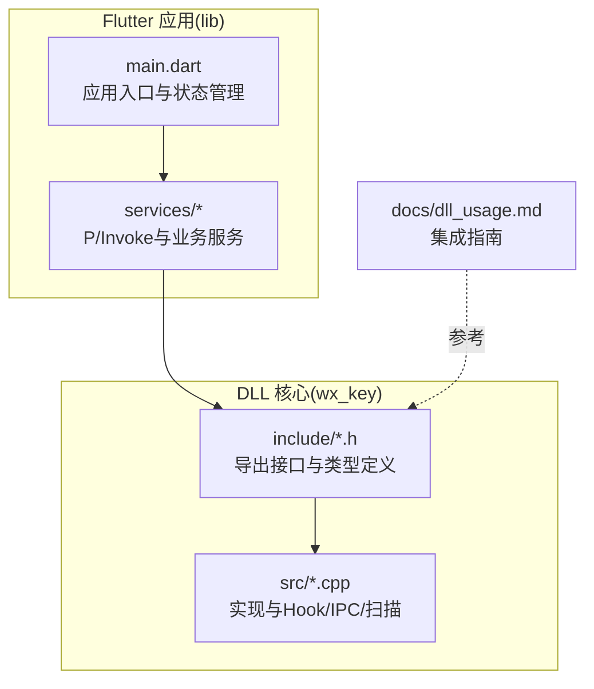
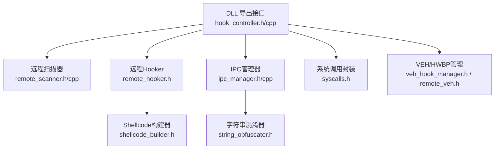
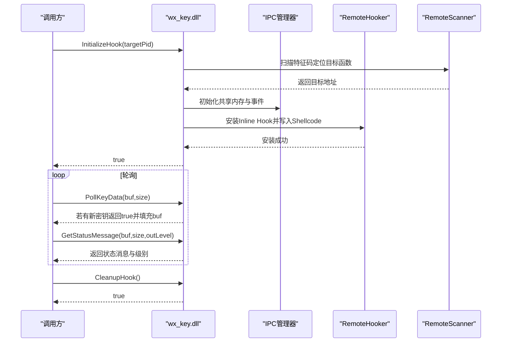
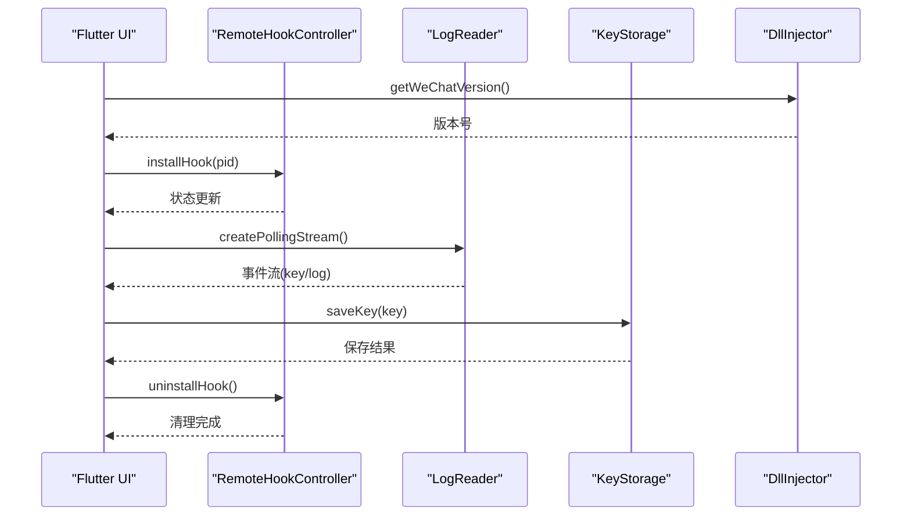
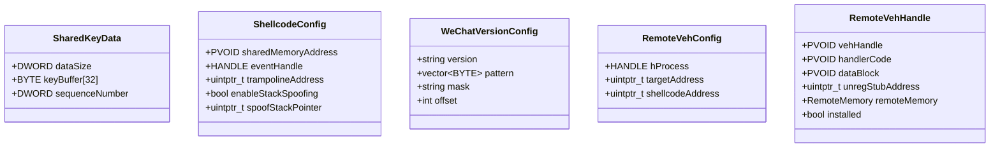
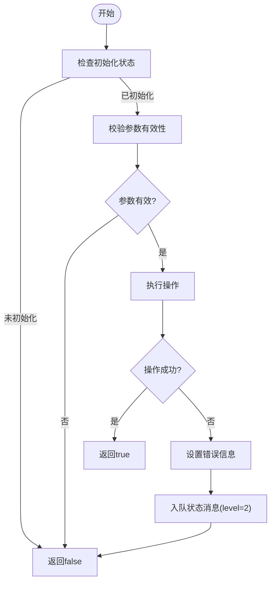
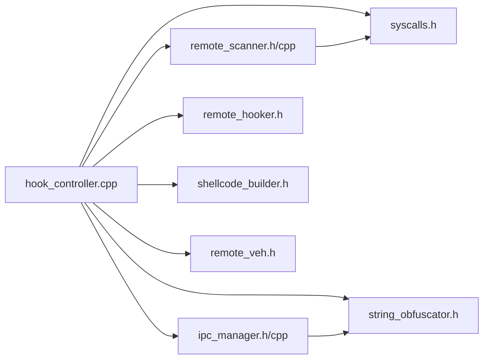

# API参考文档

<cite>
**本文引用的文件**
- [wx_key/include/hook_controller.h](file://wx_key/include/hook_controller.h)
- [wx_key/src/hook_controller.cpp](file://wx_key/src/hook_controller.cpp)
- [wx_key/include/ipc_manager.h](file://wx_key/include/ipc_manager.h)
- [wx_key/src/ipc_manager.cpp](file://wx_key/src/ipc_manager.cpp)
- [wx_key/include/remote_scanner.h](file://wx_key/include/remote_scanner.h)
- [wx_key/src/remote_scanner.cpp](file://wx_key/src/remote_scanner.cpp)
- [wx_key/include/remote_hooker.h](file://wx_key/include/remote_hooker.h)
- [wx_key/include/shellcode_builder.h](file://wx_key/include/shellcode_builder.h)
- [wx_key/include/syscalls.h](file://wx_key/include/syscalls.h)
- [wx_key/include/string_obfuscator.h](file://wx_key/include/string_obfuscator.h)
- [wx_key/include/veh_hook_manager.h](file://wx_key/include/veh_hook_manager.h)
- [wx_key/include/remote_veh.h](file://wx_key/include/remote_veh.h)
- [docs/dll_usage.md](file://docs/dll_usage.md)
- [lib/main.dart](file://lib/main.dart)
</cite>

## 目录
1. [简介](#简介)
2. [项目结构](#项目结构)
3. [核心组件](#核心组件)
4. [架构总览](#架构总览)
5. [详细组件分析](#详细组件分析)
6. [依赖关系分析](#依赖关系分析)
7. [性能考量](#性能考量)
8. [故障排查指南](#故障排查指南)
9. [结论](#结论)
10. [附录](#附录)

## 简介
本文件为 wx_key 的全面 API 参考文档，覆盖：
- DLL 导出函数接口规范（函数签名、参数、返回值、错误处理）
- Flutter 服务 API 设计（方法签名、异常处理、回调机制）
- 数据结构与枚举说明
- 错误码与错误处理策略
- 实际使用示例与集成指南
- API 版本兼容性与迁移注意事项
- 性能优化与最佳实践
- 测试与验证方法

## 项目结构
该项目采用分层组织方式：
- C/C++ 核心库位于 wx_key/，包含 DLL 导出接口与底层 Hook/扫描/IPC 实现
- Flutter 应用位于 lib/，提供 GUI 与服务封装（P/Invoke、日志、存储等）
- 文档位于 docs/，包含 DLL 使用指南与集成说明
- 资源 assets/ 包含可分发的 wx_key.dll

**图表来源**
- [lib/main.dart](file://lib/main.dart#L1-L120)
- [wx_key/include/hook_controller.h](file://wx_key/include/hook_controller.h#L1-L50)
- [wx_key/src/hook_controller.cpp](file://wx_key/src/hook_controller.cpp#L1-L120)
- [docs/dll_usage.md](file://docs/dll_usage.md#L1-L60)

**章节来源**
- [lib/main.dart](file://lib/main.dart#L1-L120)
- [wx_key/include/hook_controller.h](file://wx_key/include/hook_controller.h#L1-L50)
- [docs/dll_usage.md](file://docs/dll_usage.md#L1-L60)

## 核心组件
- DLL 导出接口：提供初始化、轮询获取密钥、获取状态日志、清理资源、获取最后错误等 C 风格接口
- IPC 管理器：负责共享内存与事件的创建、轮询监听远程缓冲区、回调分发
- 远程扫描器：在目标进程内扫描特征码，定位目标函数地址
- 远程 Hooker：在目标进程安装 Inline Hook，配合 Shellcode 捕获密钥
- Shellcode 构建器：根据配置生成 Hook Shellcode
- 系统调用封装：通过间接系统调用访问 Nt* API，规避检测
- 字符串混淆器：对全局共享内存名、事件名等敏感字符串进行编译期混淆
- VEH/HWBP 管理：提供硬件断点与 VEH 的安装/卸载能力（当前实现主要使用 Inline Hook）

**章节来源**
- [wx_key/include/hook_controller.h](file://wx_key/include/hook_controller.h#L1-L50)
- [wx_key/include/ipc_manager.h](file://wx_key/include/ipc_manager.h#L1-L80)
- [wx_key/include/remote_scanner.h](file://wx_key/include/remote_scanner.h#L1-L70)
- [wx_key/include/remote_hooker.h](file://wx_key/include/remote_hooker.h#L1-L73)
- [wx_key/include/shellcode_builder.h](file://wx_key/include/shellcode_builder.h#L1-L38)
- [wx_key/include/syscalls.h](file://wx_key/include/syscalls.h#L1-L189)
- [wx_key/include/string_obfuscator.h](file://wx_key/include/string_obfuscator.h#L1-L62)
- [wx_key/include/veh_hook_manager.h](file://wx_key/include/veh_hook_manager.h#L1-L33)
- [wx_key/include/remote_veh.h](file://wx_key/include/remote_veh.h#L1-L29)

## 架构总览
下图展示 DLL 导出接口、IPC、Hook、Shellcode、扫描器与系统调用之间的交互关系。

**图表来源**
- [wx_key/include/hook_controller.h](file://wx_key/include/hook_controller.h#L1-L50)
- [wx_key/src/hook_controller.cpp](file://wx_key/src/hook_controller.cpp#L1-L120)
- [wx_key/include/remote_scanner.h](file://wx_key/include/remote_scanner.h#L1-L70)
- [wx_key/src/remote_scanner.cpp](file://wx_key/src/remote_scanner.cpp#L1-L120)
- [wx_key/include/remote_hooker.h](file://wx_key/include/remote_hooker.h#L1-L73)
- [wx_key/include/shellcode_builder.h](file://wx_key/include/shellcode_builder.h#L1-L38)
- [wx_key/include/ipc_manager.h](file://wx_key/include/ipc_manager.h#L1-L80)
- [wx_key/src/ipc_manager.cpp](file://wx_key/src/ipc_manager.cpp#L1-L120)
- [wx_key/include/syscalls.h](file://wx_key/include/syscalls.h#L1-L189)
- [wx_key/include/string_obfuscator.h](file://wx_key/include/string_obfuscator.h#L1-L62)
- [wx_key/include/veh_hook_manager.h](file://wx_key/include/veh_hook_manager.h#L1-L33)
- [wx_key/include/remote_veh.h](file://wx_key/include/remote_veh.h#L1-L29)

## 详细组件分析

### DLL 导出函数 API
- 函数签名与用途
  - InitializeHook(targetPid): 启动 Hook 安装流程（扫描、分配共享内存、注入 Shellcode）
  - PollKeyData(keyBuffer, bufferSize): 非阻塞轮询获取最新密钥（十六进制字符串，长度 64 字节 + 结束符）
  - GetStatusMessage(statusBuffer, bufferSize, outLevel): 获取内部状态日志（0=Info, 1=Success, 2=Error）
  - CleanupHook(): 清理 Hook、共享内存与句柄
  - GetLastErrorMsg(): 获取最后一次错误信息字符串
- 参数与返回值
  - targetPid: 目标微信进程 ID（DWORD）
  - keyBuffer: 输出缓冲区（至少 65 字节）
  - statusBuffer: 输出缓冲区（至少 256 字节），outLevel 输出状态级别
  - 返回值：布尔型，成功为 true，失败为 false
- 错误处理
  - 失败时调用 GetLastErrorMsg() 获取具体原因
  - 内部维护状态队列与互斥锁，保证线程安全
- 使用示例（C#）
  - 参见 docs/dll_usage.md 中的示例，展示 P/Invoke 调用与轮询逻辑

**图表来源**
- [wx_key/include/hook_controller.h](file://wx_key/include/hook_controller.h#L12-L46)
- [wx_key/src/hook_controller.cpp](file://wx_key/src/hook_controller.cpp#L414-L491)
- [wx_key/include/ipc_manager.h](file://wx_key/include/ipc_manager.h#L18-L76)
- [wx_key/src/ipc_manager.cpp](file://wx_key/src/ipc_manager.cpp#L206-L273)
- [wx_key/include/remote_scanner.h](file://wx_key/include/remote_scanner.h#L15-L44)
- [wx_key/src/remote_scanner.cpp](file://wx_key/src/remote_scanner.cpp#L158-L204)

**章节来源**
- [wx_key/include/hook_controller.h](file://wx_key/include/hook_controller.h#L12-L46)
- [wx_key/src/hook_controller.cpp](file://wx_key/src/hook_controller.cpp#L414-L491)
- [docs/dll_usage.md](file://docs/dll_usage.md#L21-L60)

### Flutter 服务 API
- 远程 Hook 控制器（RemoteHookController）
  - 方法：installHook(pid)、uninstallHook()、dispose()
  - 异常处理：通过日志流与状态消息反馈错误
  - 回调机制：通过日志流订阅获取状态与密钥
- 日志读取器（LogReader）
  - 方法：createPollingStream()、clearLog()
  - 行为：轮询日志文件，按类型分发（key/log）
- 密钥存储（KeyStorage）
  - 方法：saveKey(key)、getKeyInfo()、getImageKeyInfo()
  - 行为：持久化保存数据库密钥与图片密钥信息
- DLL 注入器（DllInjector）
  - 方法：launchWeChat()、killWeChatProcesses()、getWeChatVersion()
  - 行为：自动化微信启动、进程管理与版本检测
- 图片密钥服务（ImageKeyService）
  - 方法：获取 XOR/AES 图片密钥
  - 行为：基于数据库密钥推导图片解密所需密钥

**图表来源**
- [lib/main.dart](file://lib/main.dart#L485-L534)
- [lib/services/remote_hook_controller.dart](file://lib/services/remote_hook_controller.dart)
- [lib/services/log_reader.dart](file://lib/services/log_reader.dart)
- [lib/services/key_storage.dart](file://lib/services/key_storage.dart)
- [lib/services/dll_injector.dart](file://lib/services/dll_injector.dart)
- [lib/services/image_key_service.dart](file://lib/services/image_key_service.dart)

**章节来源**
- [lib/main.dart](file://lib/main.dart#L485-L534)
- [lib/services/remote_hook_controller.dart](file://lib/services/remote_hook_controller.dart)
- [lib/services/log_reader.dart](file://lib/services/log_reader.dart)
- [lib/services/key_storage.dart](file://lib/services/key_storage.dart)
- [lib/services/dll_injector.dart](file://lib/services/dll_injector.dart)
- [lib/services/image_key_service.dart](file://lib/services/image_key_service.dart)

### 数据结构与枚举
- 共享内存数据结构（SharedKeyData）
  - 字段：dataSize（DWORD）、keyBuffer[32]（BYTE）、sequenceNumber（DWORD）
  - 语义：当 dataSize==32 时，表示有新密钥；每次写入后 sequenceNumber 递增
- 状态级别（整数）
  - 0=Info、1=Success、2=Error
- Shellcode 配置（ShellcodeConfig）
  - 字段：sharedMemoryAddress（PVOID）、eventHandle（HANDLE）、trampolineAddress（uintptr_t）、enableStackSpoofing（bool）、spoofStackPointer（uintptr_t）
- 版本配置（WeChatVersionConfig）
  - 字段：version（string）、pattern（vector<BYTE>）、mask（string）、offset（int）
- VEH 配置（RemoteVehConfig）
  - 字段：hProcess（HANDLE）、targetAddress（uintptr_t）、shellcodeAddress（uintptr_t）
- VEH 句柄（RemoteVehHandle）
  - 字段：vehHandle（PVOID）、handlerCode（PVOID）、dataBlock（PVOID）、unregStubAddress（PVOID）、remoteMemory（RemoteMemory）、installed（bool）

**图表来源**
- [wx_key/include/ipc_manager.h](file://wx_key/include/ipc_manager.h#L10-L16)
- [wx_key/include/shellcode_builder.h](file://wx_key/include/shellcode_builder.h#L8-L15)
- [wx_key/include/remote_scanner.h](file://wx_key/include/remote_scanner.h#L46-L55)
- [wx_key/include/remote_veh.h](file://wx_key/include/remote_veh.h#L8-L23)

**章节来源**
- [wx_key/include/ipc_manager.h](file://wx_key/include/ipc_manager.h#L10-L16)
- [wx_key/include/shellcode_builder.h](file://wx_key/include/shellcode_builder.h#L8-L15)
- [wx_key/include/remote_scanner.h](file://wx_key/include/remote_scanner.h#L46-L55)
- [wx_key/include/remote_veh.h](file://wx_key/include/remote_veh.h#L8-L23)

### 错误码与错误处理策略
- 错误来源
  - Windows API 错误码：通过 GetLastError() 获取
  - NTSTATUS：通过 IndirectSyscalls 封装的 Nt* API 返回
- 错误格式化
  - Win32 错误：FormatWin32Error(baseMessage, errorCode)
  - NTSTATUS 错误：FormatNtStatusError(baseMessage, status)
- 错误传播
  - SetLastError() 设置最后错误字符串
  - SendStatus(level=2) 将错误消息入队，可通过 GetStatusMessage 获取
- 常见错误场景
  - 权限不足（管理员权限）
  - 微信版本不受支持
  - 特征码扫描失败（多于/少于1个结果）
  - 进程打开失败、共享内存创建失败、Hook 安装失败

**图表来源**
- [wx_key/src/hook_controller.cpp](file://wx_key/src/hook_controller.cpp#L177-L181)
- [wx_key/src/hook_controller.cpp](file://wx_key/src/hook_controller.cpp#L156-L175)
- [wx_key/src/hook_controller.cpp](file://wx_key/src/hook_controller.cpp#L457-L486)

**章节来源**
- [wx_key/src/hook_controller.cpp](file://wx_key/src/hook_controller.cpp#L156-L181)
- [wx_key/src/hook_controller.cpp](file://wx_key/src/hook_controller.cpp#L457-L491)

### 版本兼容性与迁移注意事项
- 支持范围：4.0.x 及以上 4.x 版本
- 版本检测：通过读取 Weixin.dll 文件版本号，匹配对应特征码配置
- 特征码库：VersionConfigManager 维护多版本特征码与掩码，按版本区间选择
- 迁移策略
  - 微信升级导致特征码偏移变化时，仅需更新特征码库并重新编译 DLL
  - 上层应用无需改动，保持相同的导出函数签名与轮询机制

**章节来源**
- [docs/dll_usage.md](file://docs/dll_usage.md#L145-L147)
- [wx_key/src/remote_scanner.cpp](file://wx_key/src/remote_scanner.cpp#L45-L106)
- [wx_key/include/remote_scanner.h](file://wx_key/include/remote_scanner.h#L46-L66)

### 实际代码示例与集成指南
- C# 示例
  - 参见 docs/dll_usage.md 第 62-131 行，展示 P/Invoke 声明、初始化、轮询与清理
- Flutter 示例
  - 参见 lib/main.dart 第 709-807 行，展示自动化注入流程（关闭微信、启动微信、注入 DLL、轮询日志与密钥）
- 最佳实践
  - 缓冲区大小：PollKeyData 至少 65 字节，GetStatusMessage 至少 256 字节
  - 轮询间隔：建议 100ms，避免 UI 线程阻塞
  - 单实例原则：同一微信进程仅一次 Hook，需重启扫描时先 CleanupHook
  - 多线程安全：建议仅在专用监控线程轮询

**章节来源**
- [docs/dll_usage.md](file://docs/dll_usage.md#L62-L131)
- [lib/main.dart](file://lib/main.dart#L709-L807)
- [docs/dll_usage.md](file://docs/dll_usage.md#L139-L165)

## 依赖关系分析
- 组件耦合
  - hook_controller.cpp 依赖 remote_scanner、ipc_manager、remote_hooker、shellcode_builder、syscalls、string_obfuscator、remote_veh、remote_memory
  - ipc_manager.cpp 依赖 string_obfuscator 与 Windows IPC API
  - remote_scanner.cpp 依赖 syscalls 与 Psapi/version.lib
- 外部依赖
  - Windows API（进程/内存/同步对象）
  - Psapi.lib、version.lib
- 潜在循环依赖
  - 通过头文件分离与前置声明避免循环包含

**图表来源**
- [wx_key/src/hook_controller.cpp](file://wx_key/src/hook_controller.cpp#L1-L22)
- [wx_key/src/ipc_manager.cpp](file://wx_key/src/ipc_manager.cpp#L1-L8)
- [wx_key/src/remote_scanner.cpp](file://wx_key/src/remote_scanner.cpp#L1-L11)

**章节来源**
- [wx_key/src/hook_controller.cpp](file://wx_key/src/hook_controller.cpp#L1-L22)
- [wx_key/src/ipc_manager.cpp](file://wx_key/src/ipc_manager.cpp#L1-L8)
- [wx_key/src/remote_scanner.cpp](file://wx_key/src/remote_scanner.cpp#L1-L11)

## 性能考量
- 内存扫描
  - 分块读取（1MB）减少系统调用次数，提高扫描效率
  - 预分配扫描缓冲区，避免频繁分配
- 轮询策略
  - IPC 轮询加入轻微抖动，降低稳定特征
  - 建议轮询间隔 80-143ms，兼顾及时性与 CPU 占用
- Hook 效率
  - Inline Hook 与 Trampoline 机制尽量保留原指令长度，减少性能损耗
  - 堆栈伪造避免破坏目标函数上下文
- 线程与锁
  - 关键区保护最小化，避免长时间持锁

**章节来源**
- [wx_key/src/remote_scanner.cpp](file://wx_key/src/remote_scanner.cpp#L170-L204)
- [wx_key/src/ipc_manager.cpp](file://wx_key/src/ipc_manager.cpp#L212-L271)
- [wx_key/src/hook_controller.cpp](file://wx_key/src/hook_controller.cpp#L324-L333)

## 故障排查指南
- 常见问题
  - 权限不足：以管理员身份运行
  - 微信版本不支持：更新特征码库或降级微信版本
  - 缓冲区溢出：确保 PollKeyData 缓冲区至少 65 字节
  - 单实例冲突：先 CleanupHook 再重新 InitializeHook
- 诊断手段
  - 调用 GetLastErrorMsg() 获取详细错误
  - 轮询 GetStatusMessage 获取内部日志（带级别）
  - 检查共享内存结构与 sequenceNumber 是否递增
- 清理与恢复
  - 程序退出前务必调用 CleanupHook
  - 如出现异常，重启微信并重新注入

**章节来源**
- [docs/dll_usage.md](file://docs/dll_usage.md#L135-L165)
- [wx_key/src/hook_controller.cpp](file://wx_key/src/hook_controller.cpp#L488-L491)
- [wx_key/src/ipc_manager.cpp](file://wx_key/src/ipc_manager.cpp#L242-L269)

## 结论
本项目通过 DLL 导出接口与 Flutter 服务封装，提供了稳定、可扩展的微信密钥提取能力。其核心优势在于：
- 明确的 C 风格导出 API，便于多语言集成
- 健壮的版本兼容与特征码管理机制
- 完善的日志与错误处理体系
- 良好的性能与线程安全性

建议在生产环境中严格遵循缓冲区大小、轮询间隔与清理流程的最佳实践，并针对新版本微信及时更新特征码库。

## 附录
- 集成清单
  - 确认系统架构为 x64，微信为 64 位
  - 以管理员身份运行调用进程
  - 正确设置缓冲区大小与轮询间隔
  - 在应用退出前调用 CleanupHook
- 参考文档
  - docs/dll_usage.md 提供完整集成步骤与示例

**章节来源**
- [docs/dll_usage.md](file://docs/dll_usage.md#L15-L18)
- [docs/dll_usage.md](file://docs/dll_usage.md#L35-L60)
- [docs/dll_usage.md](file://docs/dll_usage.md#L135-L165)