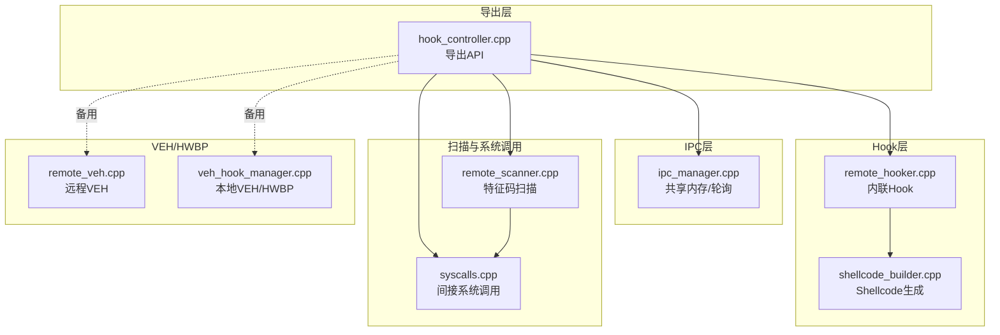
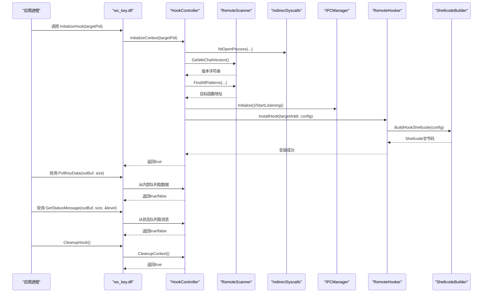
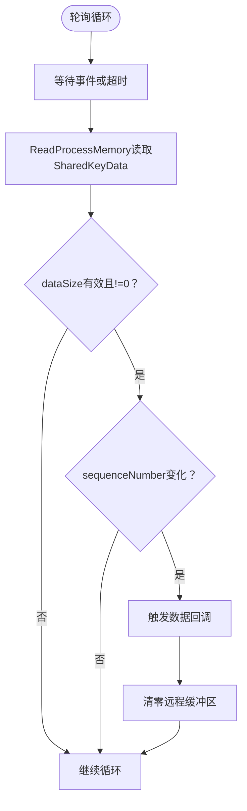
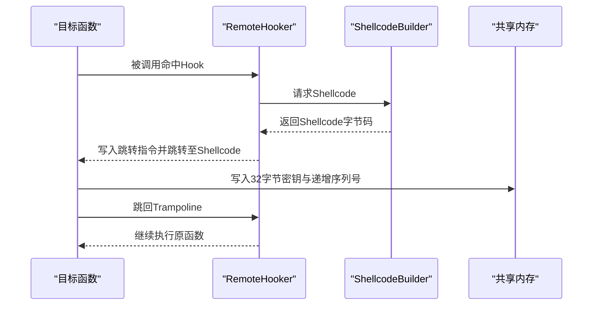
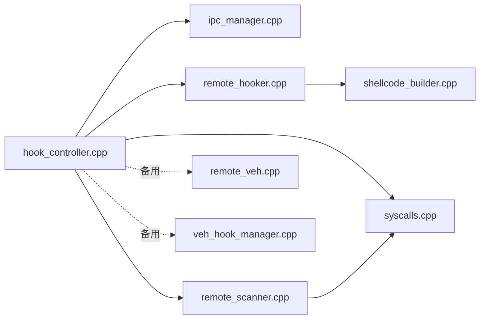

# DLL导出函数API

<cite>
**本文档引用的文件**
- [wx_key/dllmain.cpp](file://wx_key/dllmain.cpp)
- [wx_key/include/hook_controller.h](file://wx_key/include/hook_controller.h)
- [wx_key/src/hook_controller.cpp](file://wx_key/src/hook_controller.cpp)
- [wx_key/include/ipc_manager.h](file://wx_key/include/ipc_manager.h)
- [wx_key/src/ipc_manager.cpp](file://wx_key/src/ipc_manager.cpp)
- [wx_key/include/remote_hooker.h](file://wx_key/include/remote_hooker.h)
- [wx_key/src/remote_hooker.cpp](file://wx_key/src/remote_hooker.cpp)
- [wx_key/include/shellcode_builder.h](file://wx_key/include/shellcode_builder.h)
- [wx_key/src/shellcode_builder.cpp](file://wx_key/src/shellcode_builder.cpp)
- [wx_key/include/remote_scanner.h](file://wx_key/include/remote_scanner.h)
- [wx_key/src/remote_scanner.cpp](file://wx_key/src/remote_scanner.cpp)
- [wx_key/include/syscalls.h](file://wx_key/include/syscalls.h)
- [wx_key/src/syscalls.cpp](file://wx_key/src/syscalls.cpp)
- [wx_key/include/remote_veh.h](file://wx_key/include/remote_veh.h)
- [wx_key/src/remote_veh.cpp](file://wx_key/src/remote_veh.cpp)
- [wx_key/include/veh_hook_manager.h](file://wx_key/include/veh_hook_manager.h)
- [wx_key/src/veh_hook_manager.cpp](file://wx_key/src/veh_hook_manager.cpp)
- [docs/dll_usage.md](file://docs/dll_usage.md)
</cite>

## 目录
1. [简介](#简介)
2. [项目结构](#项目结构)
3. [核心组件](#核心组件)
4. [架构总览](#架构总览)
5. [详细组件分析](#详细组件分析)
6. [依赖关系分析](#依赖关系分析)
7. [性能考量](#性能考量)
8. [故障排查指南](#故障排查指南)
9. [结论](#结论)
10. [附录](#附录)

## 简介
本文件为 wx_key.dll 的导出函数API文档，覆盖以下核心导出函数的接口规范与使用说明：
- InitializeHook：初始化并安装Hook（轮询模式）
- PollKeyData：轮询检查是否有新的密钥数据（非阻塞）
- GetStatusMessage：获取当前状态消息
- CleanupHook：清理并卸载Hook
- GetLastErrorMsg：获取最后一次错误信息

同时，文档解释共享内存数据结构、序列号机制、错误码定义、异常处理策略与最佳实践，并提供C/C++、C#、Flutter等语言的调用示例与P/Invoke封装方法。

## 项目结构
该DLL位于 wx_key 子目录，采用分层设计：
- 导出层：通过 hook_controller.* 提供对外API
- IPC层：通过 ipc_manager.* 实现跨进程共享内存与轮询
- Hook层：通过 remote_hooker.* 与 shellcode_builder.* 实现远程内联Hook
- 扫描层：通过 remote_scanner.* 与 syscalls.* 实现特征码扫描与间接系统调用
- VEH/HWBP层：通过 remote_veh.* 与 veh_hook_manager.* 提供硬件断点与VEH支持（备用）

**图表来源**
- [wx_key/src/hook_controller.cpp](file://wx_key/src/hook_controller.cpp#L414-L490)
- [wx_key/src/ipc_manager.cpp](file://wx_key/src/ipc_manager.cpp#L24-L132)
- [wx_key/src/remote_hooker.cpp](file://wx_key/src/remote_hooker.cpp#L278-L389)
- [wx_key/src/shellcode_builder.cpp](file://wx_key/src/shellcode_builder.cpp#L28-L150)
- [wx_key/src/remote_scanner.cpp](file://wx_key/src/remote_scanner.cpp#L108-L261)
- [wx_key/src/syscalls.cpp](file://wx_key/src/syscalls.cpp#L92-L278)
- [wx_key/src/remote_veh.cpp](file://wx_key/src/remote_veh.cpp#L238-L268)
- [wx_key/src/veh_hook_manager.cpp](file://wx_key/src/veh_hook_manager.cpp#L101-L156)

**章节来源**
- [wx_key/dllmain.cpp](file://wx_key/dllmain.cpp#L1-L24)
- [wx_key/include/hook_controller.h](file://wx_key/include/hook_controller.h#L12-L46)

## 核心组件
- 导出API（hook_controller.*）
  - InitializeHook：初始化上下文、打开目标进程、版本检测、特征码扫描、分配远程数据与伪栈、初始化IPC、安装Hook
  - PollKeyData：从内部队列取出最新密钥十六进制字符串
  - GetStatusMessage：从内部状态队列取出一条状态消息及级别
  - CleanupHook：卸载Hook、停止IPC监听、释放远程内存、关闭句柄
  - GetLastErrorMsg：返回最近一次错误信息字符串
- IPC管理（ipc_manager.*）
  - 共享内存数据结构 SharedKeyData：包含数据大小、密钥缓冲区、序列号
  - 轮询模式：在监听线程中周期性读取远程进程共享内存，通过序列号去重
- Hook实现（remote_hooker.* + shellcode_builder.*）
  - 内联Hook：计算目标指令长度、生成Trampoline、写入跳转指令、保护目标页
  - Shellcode：保存寄存器、拷贝32字节密钥、递增序列号、跳回Trampoline
- 扫描与系统调用（remote_scanner.* + syscalls.*）
  - 版本识别：枚举模块、读取版本信息、匹配特征码
  - 间接系统调用：动态解析ntdll函数、构建syscall stub、避免API拦截
- VEH/HWBP（remote_veh.* + veh_hook_manager.*）
  - 远程VEH：在目标进程注册VEH并设置硬件断点（备用方案）
  - 本地VEH/HWBP：在当前进程设置硬件断点并注册VEH（调试用途）

**章节来源**
- [wx_key/include/hook_controller.h](file://wx_key/include/hook_controller.h#L12-L46)
- [wx_key/src/hook_controller.cpp](file://wx_key/src/hook_controller.cpp#L414-L490)
- [wx_key/include/ipc_manager.h](file://wx_key/include/ipc_manager.h#L9-L16)
- [wx_key/src/ipc_manager.cpp](file://wx_key/src/ipc_manager.cpp#L212-L271)
- [wx_key/include/remote_hooker.h](file://wx_key/include/remote_hooker.h#L9-L70)
- [wx_key/src/remote_hooker.cpp](file://wx_key/src/remote_hooker.cpp#L278-L389)
- [wx_key/include/shellcode_builder.h](file://wx_key/include/shellcode_builder.h#L8-L34)
- [wx_key/src/shellcode_builder.cpp](file://wx_key/src/shellcode_builder.cpp#L28-L150)
- [wx_key/include/remote_scanner.h](file://wx_key/include/remote_scanner.h#L15-L70)
- [wx_key/src/remote_scanner.cpp](file://wx_key/src/remote_scanner.cpp#L108-L261)
- [wx_key/include/syscalls.h](file://wx_key/include/syscalls.h#L95-L188)
- [wx_key/src/syscalls.cpp](file://wx_key/src/syscalls.cpp#L92-L278)
- [wx_key/include/remote_veh.h](file://wx_key/include/remote_veh.h#L8-L27)
- [wx_key/src/remote_veh.cpp](file://wx_key/src/remote_veh.cpp#L238-L268)
- [wx_key/include/veh_hook_manager.h](file://wx_key/include/veh_hook_manager.h#L9-L33)
- [wx_key/src/veh_hook_manager.cpp](file://wx_key/src/veh_hook_manager.cpp#L101-L156)

## 架构总览
下图展示DLL导出函数与内部组件的交互关系，以及数据流与控制流：

**图表来源**
- [wx_key/src/hook_controller.cpp](file://wx_key/src/hook_controller.cpp#L214-L379)
- [wx_key/src/remote_scanner.cpp](file://wx_key/src/remote_scanner.cpp#L108-L261)
- [wx_key/src/syscalls.cpp](file://wx_key/src/syscalls.cpp#L124-L233)
- [wx_key/src/ipc_manager.cpp](file://wx_key/src/ipc_manager.cpp#L163-L196)
- [wx_key/src/remote_hooker.cpp](file://wx_key/src/remote_hooker.cpp#L278-L389)
- [wx_key/src/shellcode_builder.cpp](file://wx_key/src/shellcode_builder.cpp#L28-L150)

## 详细组件分析

### 导出函数API规范

- 函数：InitializeHook
  - 签名：bool InitializeHook(DWORD targetPid)
  - 参数：
    - targetPid：微信进程的PID
  - 返回值：成功返回true，失败返回false
  - 使用场景：首次初始化Hook系统，完成进程打开、版本检测、特征码扫描、IPC初始化与Hook安装
  - 注意事项：若已初始化则直接返回false；失败时可通过GetLastErrorMsg获取错误详情
  - 线程安全：内部使用临界区保护全局状态

- 函数：PollKeyData
  - 签名：bool PollKeyData(char* keyBuffer, int bufferSize)
  - 参数：
    - keyBuffer：输出缓冲区，用于接收密钥十六进制字符串（至少65字节）
    - bufferSize：缓冲区大小（需≥65）
  - 返回值：若有新数据返回true，否则返回false
  - 使用场景：轮询获取最新的32字节密钥（十六进制格式）
  - 注意事项：每次调用仅返回一次新数据；调用后内部状态会被清除
  - 线程安全：内部使用临界区保护

- 函数：GetStatusMessage
  - 签名：bool GetStatusMessage(char* statusBuffer, int bufferSize, int* outLevel)
  - 参数：
    - statusBuffer：输出缓冲区，用于接收状态消息（至少256字节）
    - bufferSize：缓冲区大小（需≥256）
    - outLevel：输出状态级别（0=info, 1=success, 2=error）
  - 返回值：若有新状态返回true，否则返回false
  - 使用场景：轮询获取状态消息与级别，便于UI或日志记录
  - 线程安全：内部使用临界区保护

- 函数：CleanupHook
  - 签名：bool CleanupHook()
  - 参数：无
  - 返回值：成功返回true，失败返回false
  - 使用场景：卸载Hook、停止IPC监听、释放远程内存、关闭句柄
  - 注意事项：多次调用安全；若未初始化则直接返回true

- 函数：GetLastErrorMsg
  - 签名：const char* GetLastErrorMsg()
  - 参数：无
  - 返回值：错误信息字符串（UTF-8）
  - 使用场景：获取最近一次错误详情
  - 注意事项：错误信息由内部维护，调用其他API可能覆盖

**章节来源**
- [wx_key/include/hook_controller.h](file://wx_key/include/hook_controller.h#L12-L46)
- [wx_key/src/hook_controller.cpp](file://wx_key/src/hook_controller.cpp#L414-L490)

### 共享内存数据结构与序列号机制

- 共享内存数据结构 SharedKeyData
  - 字段：
    - dataSize：数据大小（<=32）
    - keyBuffer[32]：密钥数据缓冲区
    - sequenceNumber：序列号（用于去重）
  - 结构体打包：按1字节对齐（#pragma pack(push, 1)）
  - 作用：Shellcode将32字节密钥写入共享内存，IPC轮询线程读取并去重

- 序列号机制
  - Shellcode在写入密钥后递增sequenceNumber
  - IPC轮询线程比较lastSequenceNumber与当前数据的sequenceNumber，仅当不相等且非0时认为新数据
  - 读取后清零远程缓冲区，防止重复消费

**图表来源**
- [wx_key/include/ipc_manager.h](file://wx_key/include/ipc_manager.h#L9-L16)
- [wx_key/src/ipc_manager.cpp](file://wx_key/src/ipc_manager.cpp#L212-L271)
- [wx_key/src/shellcode_builder.cpp](file://wx_key/src/shellcode_builder.cpp#L127-L131)

**章节来源**
- [wx_key/include/ipc_manager.h](file://wx_key/include/ipc_manager.h#L9-L16)
- [wx_key/src/ipc_manager.cpp](file://wx_key/src/ipc_manager.cpp#L212-L271)
- [wx_key/src/shellcode_builder.cpp](file://wx_key/src/shellcode_builder.cpp#L127-L131)

### Hook安装与Shellcode执行流程

- 内联Hook安装步骤
  - 读取目标指令，计算需要备份的长度（至少14字节）
  - 生成Trampoline（保存原始指令+跳回原函数）
  - 分配并写入Shellcode，设置可执行权限
  - 修改目标函数页保护，写入跳转指令，恢复保护
  - 保存Trampoline地址供Shellcode跳回

- Shellcode执行逻辑
  - 保存寄存器与标志位
  - 检查keySize是否为32
  - 将密钥从源地址复制到共享内存（keyBuffer）
  - 递增sequenceNumber
  - 恢复寄存器与标志位
  - 跳回Trampoline继续执行原函数

**图表来源**
- [wx_key/src/remote_hooker.cpp](file://wx_key/src/remote_hooker.cpp#L278-L389)
- [wx_key/src/shellcode_builder.cpp](file://wx_key/src/shellcode_builder.cpp#L28-L150)
- [wx_key/src/ipc_manager.cpp](file://wx_key/src/ipc_manager.cpp#L242-L269)

**章节来源**
- [wx_key/include/remote_hooker.h](file://wx_key/include/remote_hooker.h#L9-L70)
- [wx_key/src/remote_hooker.cpp](file://wx_key/src/remote_hooker.cpp#L278-L389)
- [wx_key/include/shellcode_builder.h](file://wx_key/include/shellcode_builder.h#L8-L34)
- [wx_key/src/shellcode_builder.cpp](file://wx_key/src/shellcode_builder.cpp#L28-L150)

### 版本检测与特征码扫描

- 版本检测
  - 枚举远程进程模块，定位Weixin.dll
  - 读取模块版本信息，解析主/次/构建/修订号
- 特征码配置
  - 针对不同微信版本提供特征码与掩码、偏移量
  - 通过VersionConfigManager根据版本选择对应配置
- 扫描流程
  - 分块读取远程进程内存（1MB块），在本地缓冲区匹配特征码
  - 返回目标函数地址并结合偏移得到最终地址

**章节来源**
- [wx_key/include/remote_scanner.h](file://wx_key/include/remote_scanner.h#L15-L70)
- [wx_key/src/remote_scanner.cpp](file://wx_key/src/remote_scanner.cpp#L45-L106)
- [wx_key/src/remote_scanner.cpp](file://wx_key/src/remote_scanner.cpp#L108-L261)

### 间接系统调用与安全防护

- 间接系统调用
  - 动态解析ntdll函数，构建syscall stub，避免API拦截
  - 支持NtOpenProcess/NtReadVirtualMemory/NtWriteVirtualMemory/NtAllocateVirtualMemory/NtFreeVirtualMemory/NtProtectVirtualMemory/NtQueryInformationProcess
- 安全特性
  - 使用Direct Syscall调用减少API调用链
  - 通过随机化命名与本地回退策略增强IPC兼容性

**章节来源**
- [wx_key/include/syscalls.h](file://wx_key/include/syscalls.h#L95-L188)
- [wx_key/src/syscalls.cpp](file://wx_key/src/syscalls.cpp#L92-L278)

### VEH与硬件断点（备用方案）

- 远程VEH
  - 在目标进程注册VEH并设置硬件断点，命中后执行自定义处理
  - 通过CreateRemoteThread执行注册/卸载桩代码
- 本地VEH/HWBP
  - 在当前进程遍历所有线程设置硬件断点，注册VEH捕获单步异常
  - 回调中清除单步标志并继续执行

**章节来源**
- [wx_key/include/remote_veh.h](file://wx_key/include/remote_veh.h#L8-L27)
- [wx_key/src/remote_veh.cpp](file://wx_key/src/remote_veh.cpp#L238-L268)
- [wx_key/include/veh_hook_manager.h](file://wx_key/include/veh_hook_manager.h#L9-L33)
- [wx_key/src/veh_hook_manager.cpp](file://wx_key/src/veh_hook_manager.cpp#L101-L156)

## 依赖关系分析

**图表来源**
- [wx_key/src/hook_controller.cpp](file://wx_key/src/hook_controller.cpp#L1-L30)
- [wx_key/src/ipc_manager.cpp](file://wx_key/src/ipc_manager.cpp#L1-L10)
- [wx_key/src/remote_hooker.cpp](file://wx_key/src/remote_hooker.cpp#L1-L10)
- [wx_key/src/shellcode_builder.cpp](file://wx_key/src/shellcode_builder.cpp#L1-L5)
- [wx_key/src/remote_scanner.cpp](file://wx_key/src/remote_scanner.cpp#L1-L10)
- [wx_key/src/syscalls.cpp](file://wx_key/src/syscalls.cpp#L1-L10)
- [wx_key/src/remote_veh.cpp](file://wx_key/src/remote_veh.cpp#L1-L10)
- [wx_key/src/veh_hook_manager.cpp](file://wx_key/src/veh_hook_manager.cpp#L1-L10)

**章节来源**
- [wx_key/src/hook_controller.cpp](file://wx_key/src/hook_controller.cpp#L1-L30)

## 性能考量
- 轮询间隔抖动：IPC监听线程采用轻微抖动（约80-143ms）降低稳定特征，平衡CPU占用与实时性
- 批量读取：扫描器使用2MB分块读取远程内存，减少系统调用次数
- 间接系统调用：减少API拦截风险，提高稳定性
- 伪栈与寄存器保存：Shellcode在必要时进行寄存器保存与伪栈切换，保证原函数执行一致性

[本节为通用指导，无需特定文件引用]

## 故障排查指南
- 常见错误与处理
  - 打开进程失败：检查目标PID是否有效、权限是否足够、进程是否存活
  - 版本不支持：确认微信版本是否在支持范围内（4.0.x及以上）
  - 特征码匹配失败：确认Weixin.dll存在且未被修改；必要时更新版本配置
  - IPC初始化失败：检查全局命名空间权限，必要时尝试本地回退命名
  - Hook安装失败：确认目标函数地址有效、页面保护可写、有足够的空间写入跳转指令
- 错误获取
  - 使用GetLastErrorMsg获取最近错误信息
  - 使用GetStatusMessage轮询状态消息，级别为2表示错误
- 最佳实践
  - 先调用InitializeHook，再轮询PollKeyData与GetStatusMessage
  - 在应用退出时调用CleanupHook确保资源释放
  - 避免在Hook回调中执行耗时操作，保持响应性

**章节来源**
- [wx_key/src/hook_controller.cpp](file://wx_key/src/hook_controller.cpp#L214-L379)
- [wx_key/src/ipc_manager.cpp](file://wx_key/src/ipc_manager.cpp#L24-L132)
- [wx_key/src/remote_hooker.cpp](file://wx_key/src/remote_hooker.cpp#L278-L389)
- [wx_key/src/remote_scanner.cpp](file://wx_key/src/remote_scanner.cpp#L108-L261)

## 结论
wx_key.dll通过导出简洁的API实现了对微信进程的远程Hook与密钥提取，采用轮询模式的IPC通信与序列号去重机制确保数据可靠传输。其内部通过间接系统调用、特征码扫描与内联Hook技术实现稳定与隐蔽的运行效果。遵循本文档的接口规范与最佳实践，可在C/C++、C#、Flutter等环境中安全高效地集成使用。

[本节为总结，无需特定文件引用]

## 附录

### C/C++ 调用示例（基于导出函数）
- 加载DLL并调用导出函数
  - 使用LoadLibrary/GetProcAddress加载API
  - 调用顺序：InitializeHook → 轮询PollKeyData/GetStatusMessage → CleanupHook
- 关键注意事项
  - 确保传入的缓冲区大小满足要求（密钥缓冲区至少65字节，状态缓冲区至少256字节）
  - 使用GetLastErrorMsg与GetStatusMessage进行错误诊断

**章节来源**
- [wx_key/include/hook_controller.h](file://wx_key/include/hook_controller.h#L12-L46)
- [wx_key/src/hook_controller.cpp](file://wx_key/src/hook_controller.cpp#L414-L490)

### C# P/Invoke 封装要点
- 导入声明
  - 使用DllImport导入InitializeHook、PollKeyData、GetStatusMessage、CleanupHook、GetLastErrorMsg
- 字符串与缓冲区
  - 使用StringBuilder承载输出缓冲区，指定容量
  - 密钥缓冲区建议使用byte[]或char[]，长度≥65
- 状态级别
  - out参数接收int级别（0=info, 1=success, 2=error）
- 调用流程
  - 先InitializeHook，再轮询PollKeyData与GetStatusMessage，最后CleanupHook

**章节来源**
- [wx_key/include/hook_controller.h](file://wx_key/include/hook_controller.h#L12-L46)
- [wx_key/src/hook_controller.cpp](file://wx_key/src/hook_controller.cpp#L414-L490)

### Flutter/Dart 调用要点
- 使用ffi库加载DLL并绑定导出函数
- 密钥与状态消息均以C风格字符串返回，注意UTF-8编码处理
- 建议封装为异步接口，避免阻塞主线程
- 调用顺序与C#一致：初始化 → 轮询 → 清理

**章节来源**
- [docs/dll_usage.md](file://docs/dll_usage.md)

### 集成流程与最佳实践
- 集成流程
  - 步骤1：获取微信进程PID
  - 步骤2：调用InitializeHook
  - 步骤3：循环调用PollKeyData与GetStatusMessage
  - 步骤4：调用CleanupHook
- 最佳实践
  - 在应用启动时初始化，在退出时清理
  - 对错误进行分级处理（info/success/error）
  - 避免在Hook回调中执行耗时操作
  - 定期检查微信版本，必要时更新特征码配置

**章节来源**
- [wx_key/src/hook_controller.cpp](file://wx_key/src/hook_controller.cpp#L214-L379)
- [wx_key/src/ipc_manager.cpp](file://wx_key/src/ipc_manager.cpp#L212-L271)