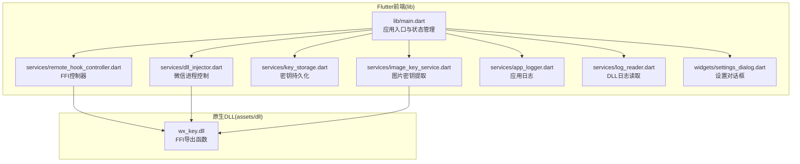
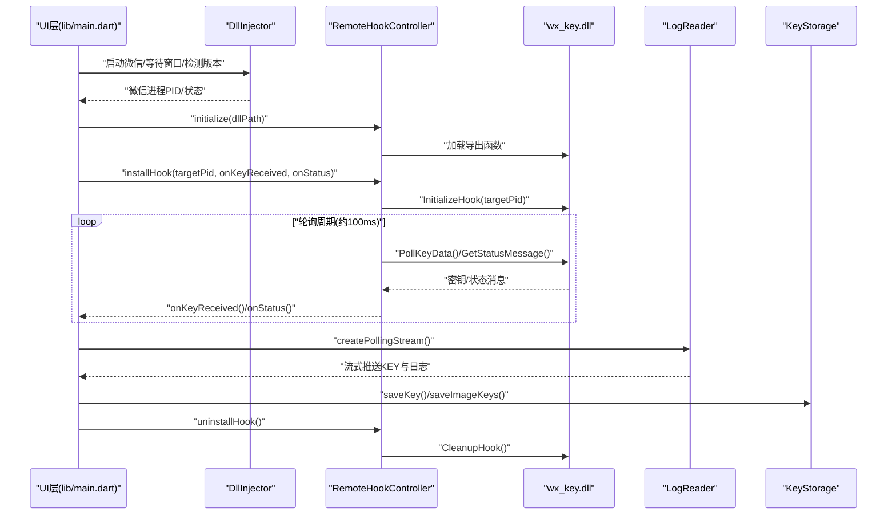
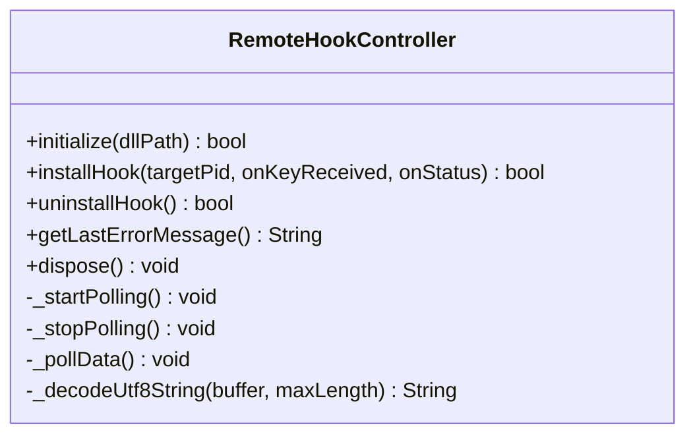
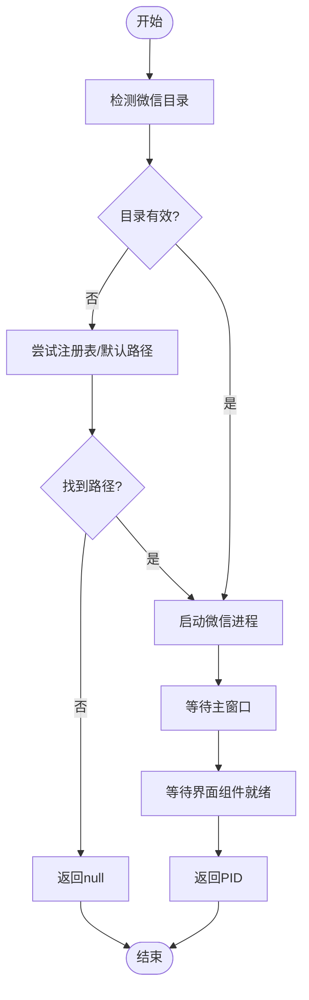
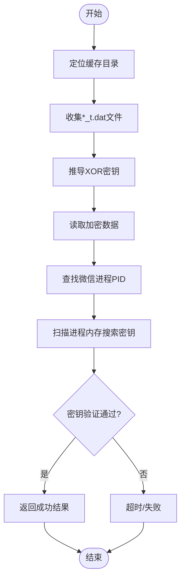
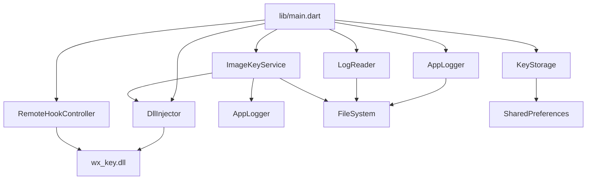

# Flutter服务API

<cite>
**本文档引用的文件**
- [lib/main.dart](file://lib/main.dart)
- [lib/services/remote_hook_controller.dart](file://lib/services/remote_hook_controller.dart)
- [lib/services/key_storage.dart](file://lib/services/key_storage.dart)
- [lib/services/dll_injector.dart](file://lib/services/dll_injector.dart)
- [lib/services/image_key_service.dart](file://lib/services/image_key_service.dart)
- [lib/services/app_logger.dart](file://lib/services/app_logger.dart)
- [lib/services/log_reader.dart](file://lib/services/log_reader.dart)
- [lib/widgets/settings_dialog.dart](file://lib/widgets/settings_dialog.dart)
- [pubspec.yaml](file://pubspec.yaml)
- [README.md](file://README.md)
</cite>

## 目录
1. [简介](#简介)
2. [项目结构](#项目结构)
3. [核心组件](#核心组件)
4. [架构总览](#架构总览)
5. [详细组件分析](#详细组件分析)
6. [依赖关系分析](#依赖关系分析)
7. [性能考量](#性能考量)
8. [故障排除指南](#故障排除指南)
9. [结论](#结论)
10. [附录](#附录)

## 简介
本文件为wx_key项目的Flutter服务层API参考文档，聚焦RemoteHookController、KeyStorage、DllInjector、ImageKeyService等核心服务类，系统性说明接口设计、方法签名、参数类型、返回值、异常处理机制、服务间依赖关系与调用流程，并提供状态管理、异步操作与错误恢复的实现细节，以及在Flutter应用中集成与使用的示例路径与最佳实践。项目基于Windows平台，结合FFI调用原生DLL，实现微信密钥提取与图片密钥获取能力。

## 项目结构
- Flutter前端位于lib目录，包含UI入口、服务层与自定义组件。
- 服务层提供密钥持久化、DLL注入与Hook控制、日志读取与应用日志、图片密钥提取等能力。
- 原生DLL位于assets/dll，由Flutter通过FFI加载并调用导出函数。
- C++原生工程位于wx_key目录，包含头文件与源文件，构建生成控制器DLL。

图表来源
- [lib/main.dart](file://lib/main.dart#L1-L100)
- [lib/services/remote_hook_controller.dart](file://lib/services/remote_hook_controller.dart#L1-L120)
- [lib/services/dll_injector.dart](file://lib/services/dll_injector.dart#L1-L120)
- [lib/services/key_storage.dart](file://lib/services/key_storage.dart#L1-L60)
- [lib/services/image_key_service.dart](file://lib/services/image_key_service.dart#L1-L80)
- [lib/services/app_logger.dart](file://lib/services/app_logger.dart#L1-L60)
- [lib/services/log_reader.dart](file://lib/services/log_reader.dart#L1-L60)
- [lib/widgets/settings_dialog.dart](file://lib/widgets/settings_dialog.dart#L1-L60)

章节来源
- [README.md](file://README.md#L77-L96)
- [pubspec.yaml](file://pubspec.yaml#L84-L112)

## 核心组件
- RemoteHookController：通过FFI加载控制器DLL，安装Hook到目标微信进程，轮询获取密钥与状态消息，提供卸载与错误信息查询。
- DllInjector：负责微信进程发现、启动、窗口等待与组件就绪检测，提供DLL路径选择、微信版本检测、进程终止等能力。
- KeyStorage：基于SharedPreferences的密钥与配置持久化，支持数据库密钥、图片密钥、DLL路径与微信安装目录等键值管理。
- ImageKeyService：从微信缓存目录收集模板文件，推导XOR密钥，读取加密数据，扫描微信进程内存获取AES密钥，提供结果封装与进度回调。
- AppLogger：应用级日志服务，支持缓冲写入、定时刷新、文件大小限制、打开与清空日志文件。
- LogReader：读取DLL写入的状态日志文件，解析密钥与日志消息，提供轮询流订阅。

章节来源
- [lib/services/remote_hook_controller.dart](file://lib/services/remote_hook_controller.dart#L32-L278)
- [lib/services/dll_injector.dart](file://lib/services/dll_injector.dart#L31-L931)
- [lib/services/key_storage.dart](file://lib/services/key_storage.dart#L1-L273)
- [lib/services/image_key_service.dart](file://lib/services/image_key_service.dart#L54-L698)
- [lib/services/app_logger.dart](file://lib/services/app_logger.dart#L7-L191)
- [lib/services/log_reader.dart](file://lib/services/log_reader.dart#L6-L138)

## 架构总览
下图展示了服务层与原生DLL之间的交互关系，以及UI层如何协调各服务完成密钥提取流程。

图表来源
- [lib/main.dart](file://lib/main.dart#L709-L807)
- [lib/services/remote_hook_controller.dart](file://lib/services/remote_hook_controller.dart#L46-L235)
- [lib/services/dll_injector.dart](file://lib/services/dll_injector.dart#L531-L657)
- [lib/services/log_reader.dart](file://lib/services/log_reader.dart#L96-L135)
- [lib/services/key_storage.dart](file://lib/services/key_storage.dart#L14-L82)

## 详细组件分析

### RemoteHookController（FFI控制器）
- 职责
  - 加载控制器DLL并绑定导出函数。
  - 安装Hook到目标微信进程，启动轮询定时器。
  - 轮询获取密钥与状态消息，回调至UI层。
  - 卸载Hook并清理资源。
  - 提供错误信息查询。
- 关键接口
  - initialize(dllPath): bool
  - installHook(targetPid:int, onKeyReceived:Function(String), onStatus:Function(String,int)?): bool
  - uninstallHook(): bool
  - getLastErrorMessage(): String
  - dispose(): void
- 参数与返回
  - dllPath: 字符串，DLL绝对路径。
  - targetPid: 整型，微信进程PID。
  - onKeyReceived/onStatus: 回调函数，分别接收密钥字符串与状态消息及级别。
  - 返回值：布尔值表示操作是否成功。
- 异常处理
  - DLL加载失败、函数绑定失败、轮询异常均记录日志并返回false。
  - 最后错误信息通过GetLastErrorMsg获取。
- 资源管理
  - 轮询定时器在install/uninstall中启动/停止。
  - dispose中释放DLL句柄与回调引用。

图表来源
- [lib/services/remote_hook_controller.dart](file://lib/services/remote_hook_controller.dart#L34-L278)

章节来源
- [lib/services/remote_hook_controller.dart](file://lib/services/remote_hook_controller.dart#L46-L235)

### DllInjector（微信进程控制与注入）
- 职责
  - 查找微信进程、判断是否运行。
  - 从注册表、App Paths、腾讯特定键读取微信安装路径。
  - 启动微信进程、等待主窗口出现与界面组件就绪。
  - 提供DLL路径选择、微信版本检测、进程终止等辅助功能。
- 关键接口
  - findProcessIds(processName): List<int>
  - isProcessRunning(processName): bool
  - getWeChatDirectory(): Future<String?>
  - getWeChatVersion(): Future<String?>
  - selectDllFile(): Future<String?>
  - killWeChatProcesses(): bool
  - launchWeChat(): Future<bool>
  - waitForWeChatWindow(maxWaitSeconds:int=10): Future<bool>
  - waitForWeChatWindowComponents(maxWaitSeconds:int=25): Future<bool>
  - findMainWeChatPid(): int?
  - getLastErrorMessage(): String
- 参数与返回
  - processName: 字符串，进程名。
  - maxWaitSeconds: 整型，等待超时秒数。
  - 返回值：Future<String?>或bool，取决于具体方法。
- 异常处理
  - 注册表查询、进程枚举、窗口枚举等均捕获异常并返回安全值。
  - 最后错误信息通过Windows API GetLastError/FormatMessage获取。
- 资源管理
  - 使用calloc/Free进行内存分配与释放，避免泄漏。
  - 进程句柄在使用后及时CloseHandle。

图表来源
- [lib/services/dll_injector.dart](file://lib/services/dll_injector.dart#L406-L657)

章节来源
- [lib/services/dll_injector.dart](file://lib/services/dll_injector.dart#L52-L922)

### KeyStorage（密钥与配置持久化）
- 职责
  - 基于SharedPreferences存储数据库密钥、图片密钥、DLL路径、微信安装目录等。
  - 提供保存、读取、存在性检查、清除等操作。
- 关键接口
  - saveKey(key:String, timestamp:DateTime?): Future<bool>
  - getKey(): Future<String?>
  - hasKey(): Future<bool>
  - getKeyTimestamp(): Future<DateTime?>
  - clearKey(): Future<bool>
  - saveDllPath(path:String): Future<bool>
  - getDllPath(): Future<String?>
  - clearDllPath(): Future<bool>
  - saveWechatDirectory(directory:String): Future<bool>
  - getWechatDirectory(): Future<String?>
  - clearWechatDirectory(): Future<bool>
  - saveImageXorKey(xorKey:int): Future<bool>
  - getImageXorKey(): Future<int?>
  - saveImageAesKey(aesKey:String): Future<bool>
  - getImageAesKey(): Future<String?>
  - saveImageKeys(xorKey:int, aesKey:String): Future<bool>
  - getImageKeyInfo(): Future<Map<String,dynamic>?>
  - clearImageKeys(): Future<bool>
- 参数与返回
  - key/aesKey: 字符串；xorKey: 整型。
  - timestamp: 可选，若为null则使用当前时间。
  - 返回值：Future<bool>/Future<String?>/Future<int?>/Future<Map>?
- 异常处理
  - 所有操作均try/catch，失败时打印错误并返回安全值。
- 使用场景
  - UI启动时加载已保存密钥与图片密钥，成功获取后自动保存。

章节来源
- [lib/services/key_storage.dart](file://lib/services/key_storage.dart#L1-L273)

### ImageKeyService（图片密钥提取）
- 职责
  - 定位微信缓存目录，枚举账号目录。
  - 收集*_t.dat模板文件，推导XOR密钥与AES密钥。
  - 扫描微信进程内存，搜索32字节ASCII密钥并验证。
- 关键接口
  - getWeChatCacheDirectory(): Future<String?>
  - findWeChatCacheDirectories(): Future<List<String>>
  - getImageKeys(manualDirectory:String?, onProgress:Function(String)?): Future<ImageKeyResult>
- 参数与返回
  - manualDirectory: 可选的手动选择目录。
  - onProgress: 进度回调，用于UI反馈。
  - ImageKeyResult: 包含xorKey、aesKey、success、error、needManualSelection。
- 异常处理
  - 目录不存在、模板文件缺失、进程未运行、内存搜索超时等均返回失败结果。
  - 超时设置为45秒，避免长时间阻塞。
- 算法要点
  - XOR密钥通过统计最后两个字节的共现频率推导。
  - AES密钥通过在内存中按YARA风格规则搜索ASCII密钥并用AES ECB解密验证。
  - 支持UTF-16LE存储的ASCII密钥兼容。

图表来源
- [lib/services/image_key_service.dart](file://lib/services/image_key_service.dart#L600-L696)

章节来源
- [lib/services/image_key_service.dart](file://lib/services/image_key_service.dart#L54-L698)

### AppLogger（应用日志）
- 职责
  - 统一日志输出，支持INFO/SUCCESS/WARNING/ERROR等级。
  - 缓冲写入，定时刷新，文件大小超过阈值时自动清空。
  - 提供打开日志文件、清空日志、获取文件大小等功能。
- 关键接口
  - init(): Future<void>
  - close(): Future<void>
  - info/warning/error/success(message, error?, stackTrace?): Future<void>
  - clearLog(): Future<void>
  - openLogFile(): Future<bool>
  - getLogFileSize(): Future<String>
- 参数与返回
  - message: 字符串；error/stackTrace: 可选。
  - 返回值：Future<void>/Future<bool>/Future<String>。

章节来源
- [lib/services/app_logger.dart](file://lib/services/app_logger.dart#L7-L191)

### LogReader（DLL日志读取）
- 职责
  - 读取系统临时目录中的状态日志文件，解析密钥与日志消息。
  - 提供轮询流订阅，避免重复处理同一行。
- 关键接口
  - readAllLines(): Future<List<String>>
  - parseLogLine(line): Map<String,String>?
  - extractKey(): Future<String?>
  - getLogMessages(): Future<List<Map<String,String>>>
  - createPollingStream(interval:Duration=500ms): Stream<Map>
- 参数与返回
  - interval: 轮询间隔，默认500ms。
  - 返回值：Future<List>/Future<Map>/Stream。

章节来源
- [lib/services/log_reader.dart](file://lib/services/log_reader.dart#L6-L138)

## 依赖关系分析
- 组件耦合
  - RemoteHookController与DllInjector共同协作完成Hook安装与状态轮询。
  - ImageKeyService依赖DllInjector定位微信进程，依赖AppLogger记录过程。
  - KeyStorage贯穿UI与服务层，作为持久化枢纽。
  - LogReader与AppLogger配合，形成双通道日志体系（DLL日志与应用日志）。
- 外部依赖
  - win32/ffi用于Windows API与FFI调用。
  - shared_preferences用于密钥持久化。
  - pointycastle用于AES解密验证。
  - file_picker用于目录与文件选择。
  - path/path_provider用于路径处理与外部存储访问。

图表来源
- [lib/services/remote_hook_controller.dart](file://lib/services/remote_hook_controller.dart#L1-L87)
- [lib/services/dll_injector.dart](file://lib/services/dll_injector.dart#L1-L10)
- [lib/services/image_key_service.dart](file://lib/services/image_key_service.dart#L1-L11)
- [lib/services/key_storage.dart](file://lib/services/key_storage.dart#L1)
- [lib/services/log_reader.dart](file://lib/services/log_reader.dart#L1-L10)
- [lib/services/app_logger.dart](file://lib/services/app_logger.dart#L1-L10)
- [lib/main.dart](file://lib/main.dart#L1-L15)
- [pubspec.yaml](file://pubspec.yaml#L38-L61)

章节来源
- [pubspec.yaml](file://pubspec.yaml#L30-L61)

## 性能考量
- 轮询策略
  - RemoteHookController以约100ms周期轮询，兼顾实时性与CPU占用。
  - LogReader以500ms周期轮询，避免频繁IO。
- 内存扫描
  - ImageKeyService按4MB块扫描微信进程内存，设置最大扫描区域与覆盖重叠，平衡覆盖率与性能。
  - 超时控制在45秒，避免长时间阻塞。
- I/O与缓冲
  - AppLogger采用缓冲+定时刷新策略，减少磁盘写入次数。
  - 日志文件超过10MB自动清空，避免磁盘膨胀。
- 资源释放
  - 所有FFI内存使用calloc/Free配对释放。
  - 进程句柄在使用后及时CloseHandle。
  - UI层在窗口关闭时统一调用RemoteHookController.dispose()与AppLogger.close()。

[本节为通用指导，无需列出章节来源]

## 故障排除指南
- DLL加载失败
  - 检查dllPath是否存在与可读。
  - 确认目标平台与架构匹配。
  - 查看RemoteHookController.getLastErrorMessage()。
- Hook安装失败
  - 确认微信进程PID有效。
  - 检查微信版本与DLL版本兼容性。
  - 查看状态回调与错误信息。
- 密钥获取超时
  - 确保微信已完全启动并显示界面。
  - 在朋友圈打开带图片的动态，触发内存中密钥驻留。
  - 调整等待时间或重试流程。
- 图片密钥提取失败
  - 确认缓存目录存在且包含*_t.dat文件。
  - 手动选择正确的账号目录。
  - 检查AES ECB解密验证是否通过。
- 日志问题
  - 使用AppLogger.openLogFile()打开日志文件。
  - 使用clearLog()清空历史日志。
  - 检查LogReader.logFilePath是否可达。

章节来源
- [lib/services/remote_hook_controller.dart](file://lib/services/remote_hook_controller.dart#L237-L253)
- [lib/services/dll_injector.dart](file://lib/services/dll_injector.dart#L901-L921)
- [lib/services/image_key_service.dart](file://lib/services/image_key_service.dart#L665-L686)
- [lib/services/log_reader.dart](file://lib/services/log_reader.dart#L13-L22)
- [lib/services/app_logger.dart](file://lib/services/app_logger.dart#L147-L167)

## 结论
本服务层围绕FFI与原生DLL构建，实现了微信密钥提取与图片密钥获取的关键能力。通过清晰的服务边界与完善的日志、持久化与资源管理机制，保证了在Windows平台上的稳定性与可维护性。UI层通过事件驱动与流式日志实现良好的用户体验，同时提供设置对话框便于用户配置与排障。

[本节为总结，无需列出章节来源]

## 附录

### 服务生命周期与资源清理
- 应用启动
  - 初始化AppLogger，设置窗口选项，runApp。
- 主界面状态
  - 初始化动画控制器与轮询标志，加载保存数据，检测微信版本，启动状态轮询。
- 资源清理
  - 窗口关闭时：隐藏窗口、清理Hook、停止日志流订阅、关闭AppLogger、销毁窗口。
- 服务释放
  - RemoteHookController.dispose()释放DLL与回调。
  - DllInjector与ImageKeyService在使用后释放FFI资源与进程句柄。

章节来源
- [lib/main.dart](file://lib/main.dart#L486-L534)
- [lib/services/remote_hook_controller.dart](file://lib/services/remote_hook_controller.dart#L255-L264)

### 在Flutter中集成与使用示例（路径指引）
- 初始化与启动流程
  - 参考路径：[lib/main.dart](file://lib/main.dart#L16-L35)
  - 自动注入流程：[lib/main.dart](file://lib/main.dart#L709-L807)
- Hook控制
  - 初始化DLL：[lib/services/remote_hook_controller.dart](file://lib/services/remote_hook_controller.dart#L46-L87)
  - 安装Hook并轮询：[lib/services/remote_hook_controller.dart](file://lib/services/remote_hook_controller.dart#L89-L128)
  - 卸载Hook与错误查询：[lib/services/remote_hook_controller.dart](file://lib/services/remote_hook_controller.dart#L206-L253)
- DLL注入与微信控制
  - 启动微信与等待窗口：[lib/services/dll_injector.dart](file://lib/services/dll_injector.dart#L531-L657)
  - 进程查找与版本检测：[lib/services/dll_injector.dart](file://lib/services/dll_injector.dart#L52-L91)
- 密钥持久化
  - 保存与读取数据库密钥：[lib/services/key_storage.dart](file://lib/services/key_storage.dart#L14-L42)
  - 保存与读取图片密钥：[lib/services/key_storage.dart](file://lib/services/key_storage.dart#L170-L216)
- 图片密钥提取
  - 获取图片密钥（含进度回调）：[lib/services/image_key_service.dart](file://lib/services/image_key_service.dart#L600-L696)
- 日志与设置
  - 应用日志服务：[lib/services/app_logger.dart](file://lib/services/app_logger.dart#L30-L86)
  - DLL日志读取与轮询流：[lib/services/log_reader.dart](file://lib/services/log_reader.dart#L96-L135)
  - 设置对话框（目录选择与日志管理）：[lib/widgets/settings_dialog.dart](file://lib/widgets/settings_dialog.dart#L42-L125)