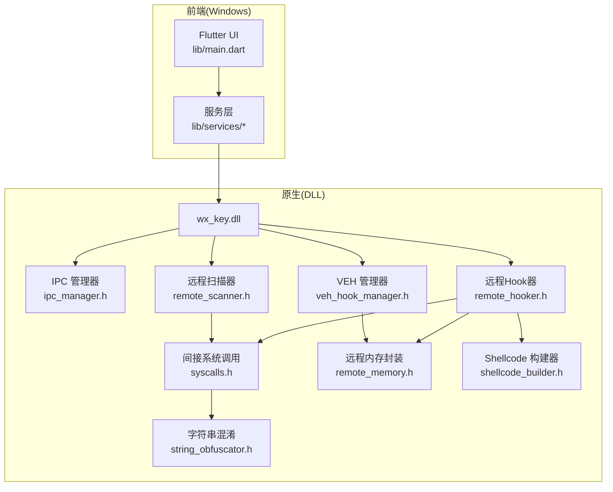
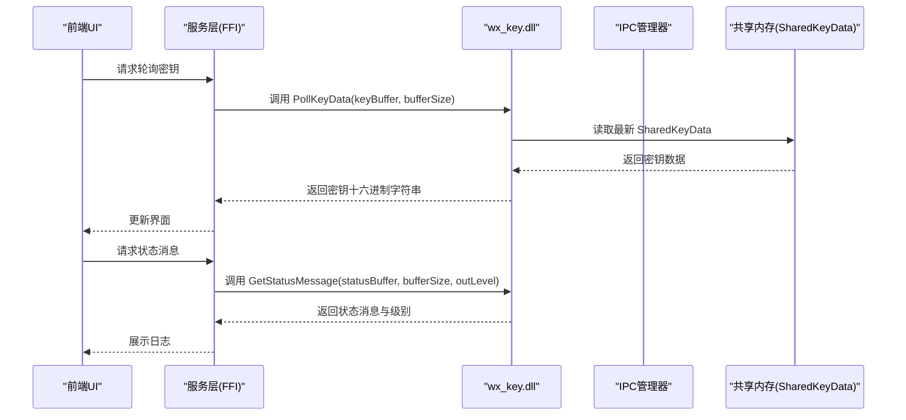
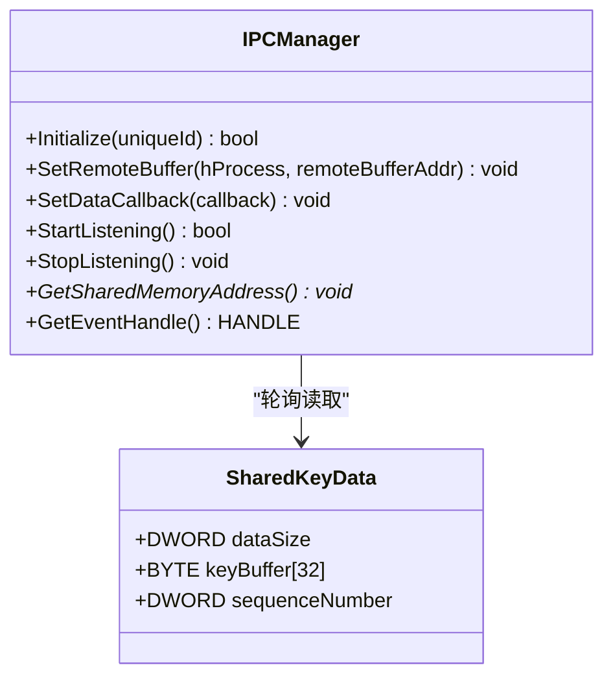
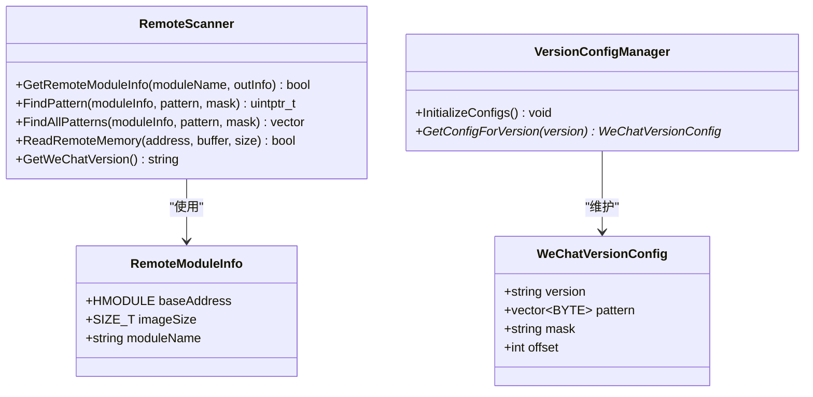
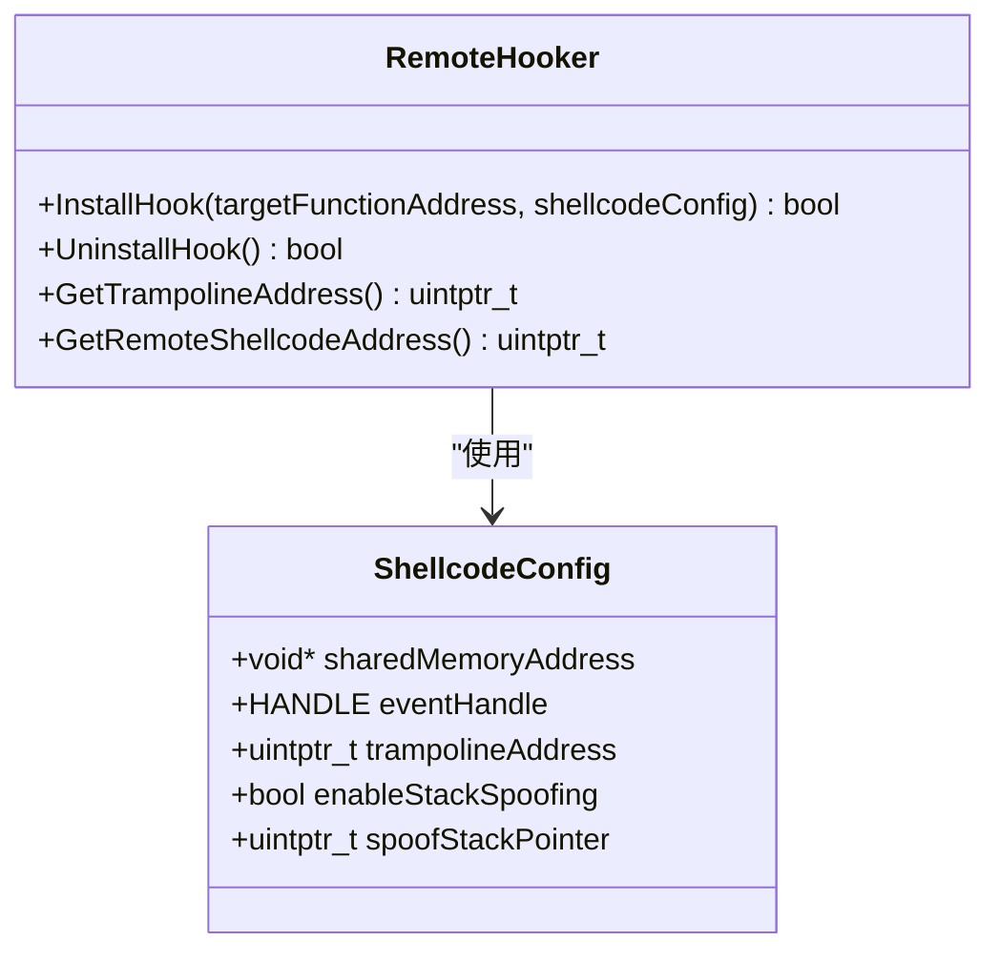
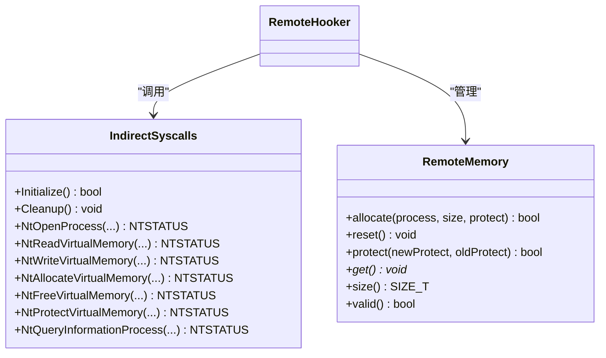
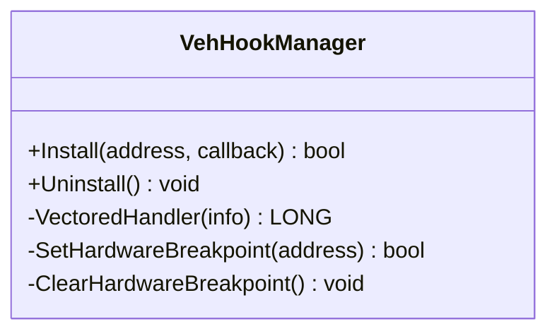
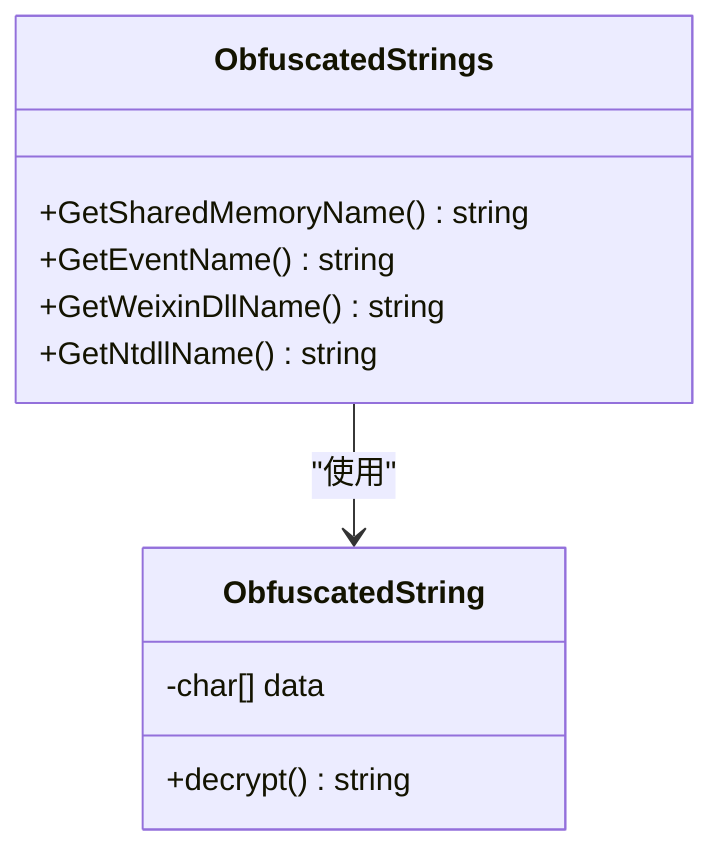
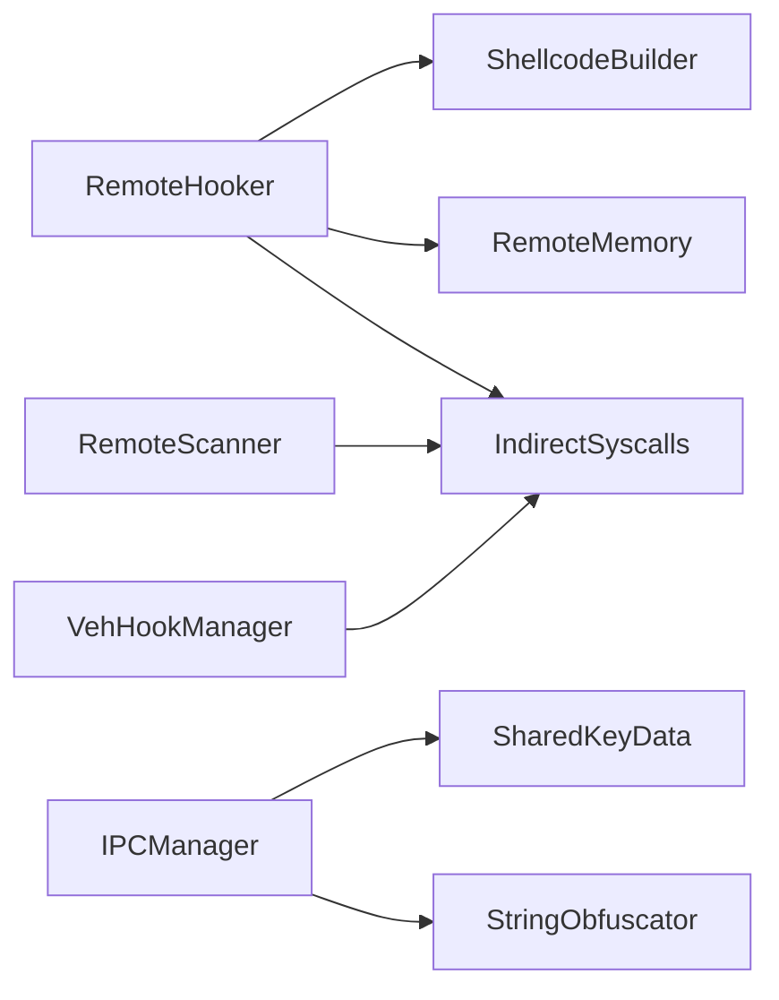

# 数据结构与枚举

<cite>
**本文引用的文件**
- [README.md](file://README.md)
- [hook_controller.h](file://wx_key/include/hook_controller.h)
- [ipc_manager.h](file://wx_key/include/ipc_manager.h)
- [remote_hooker.h](file://wx_key/include/remote_hooker.h)
- [remote_memory.h](file://wx_key/include/remote_memory.h)
- [remote_scanner.h](file://wx_key/include/remote_scanner.h)
- [remote_veh.h](file://wx_key/include/remote_veh.h)
- [shellcode_builder.h](file://wx_key/include/shellcode_builder.h)
- [string_obfuscator.h](file://wx_key/include/string_obfuscator.h)
- [syscalls.h](file://wx_key/include/syscalls.h)
- [veh_hook_manager.h](file://wx_key/include/veh_hook_manager.h)
</cite>

## 目录
1. [引言](#引言)
2. [项目结构](#项目结构)
3. [核心数据结构](#核心数据结构)
4. [架构总览](#架构总览)
5. [详细组件分析](#详细组件分析)
6. [依赖关系分析](#依赖关系分析)
7. [性能考量](#性能考量)
8. [故障排查指南](#故障排查指南)
9. [结论](#结论)
10. [附录](#附录)

## 引言
本文件面向 wx_key 项目的原生 C++ 组件，聚焦于数据结构与枚举的完整参考，涵盖共享密钥数据、状态消息、关键信息等核心结构的字段定义、数据类型、用途、内存布局、序列化格式、验证规则与约束，并结合实际数据流给出使用场景与设计原理说明。由于项目中未发现显式的 C++ 枚举类型定义，本文将严格基于头文件中出现的结构体与常量进行说明。

## 项目结构
- 原生层（C++）位于 wx_key/ 目录，包含头文件与源文件，负责注入、扫描、Hook、IPC 等底层能力。
- 前端层（Flutter）位于 lib/ 目录，通过 FFI 调用 wx_key.dll，实现 UI 与状态展示。
- 文档与使用说明位于 docs/ 与根目录 README.md。

图表来源
- [README.md](file://README.md#L77-L96)
- [ipc_manager.h](file://wx_key/include/ipc_manager.h#L18-L76)
- [remote_scanner.h](file://wx_key/include/remote_scanner.h#L16-L44)
- [remote_hooker.h](file://wx_key/include/remote_hooker.h#L10-L70)
- [veh_hook_manager.h](file://wx_key/include/veh_hook_manager.h#L10-L30)
- [syscalls.h](file://wx_key/include/syscalls.h#L96-L185)
- [remote_memory.h](file://wx_key/include/remote_memory.h#L8-L104)
- [shellcode_builder.h](file://wx_key/include/shellcode_builder.h#L18-L34)
- [string_obfuscator.h](file://wx_key/include/string_obfuscator.h#L42-L58)

章节来源
- [README.md](file://README.md#L77-L96)

## 核心数据结构
本节梳理项目中出现的结构体与相关常量，明确字段、类型、用途与约束。

- SharedKeyData（共享密钥数据）
  - 字段
    - dataSize: DWORD，表示 keyBuffer 的有效字节数
    - keyBuffer[32]: BYTE 数组，存放密钥数据，最大 32 字节
    - sequenceNumber: DWORD，序列号，用于去重与顺序控制
  - 内存布局与对齐
    - 结构体采用紧凑打包（pack=1），避免编译器填充导致的额外字节
    - 布局顺序为：dataSize(4B) + keyBuffer(32B) + sequenceNumber(4B)，总计 40 字节
  - 序列化格式
    - 固定长度二进制块，按字段顺序连续排列
  - 验证规则与约束
    - dataSize 必须满足 0 ≤ dataSize ≤ 32
    - sequenceNumber 递增且用于轮询去重
    - keyBuffer 前 dataSize 字节有效，其余字节不保证一致性
  - 使用场景
    - 由 DLL 写入，前端轮询读取；作为 IPC 缓冲区中的最小单元

- StatusMessage（状态消息）
  - 字段
    - 该结构体在头文件中未直接定义，但 DLL 导出接口 GetStatusMessage 提供了输出缓冲区与级别参数
  - 级别参数 outLevel（整型）
    - 0：信息（info）
    - 1：成功（success）
    - 2：错误（error）
  - 使用场景
    - 前端轮询获取状态消息与级别，用于 UI 展示与日志同步

- KeyInfo（关键信息）
  - 字段
    - 该结构体在头文件中未直接定义
  - 可能的组成
    - 与密钥提取相关的上下文信息，如版本、模块基址、偏移等，来源于远程扫描器与版本配置管理器
  - 使用场景
    - 作为扫描与 Hook 安装的输入参数集合

章节来源
- [ipc_manager.h](file://wx_key/include/ipc_manager.h#L9-L16)
- [hook_controller.h](file://wx_key/include/hook_controller.h#L27-L34)
- [remote_scanner.h](file://wx_key/include/remote_scanner.h#L47-L66)

## 架构总览
下图展示了 DLL 侧数据结构与组件之间的交互关系，以及前端轮询读取密钥与状态消息的流程。

图表来源
- [hook_controller.h](file://wx_key/include/hook_controller.h#L17-L46)
- [ipc_manager.h](file://wx_key/include/ipc_manager.h#L18-L76)

## 详细组件分析

### IPC 管理器与共享密钥数据
- 职责
  - 管理共享内存与事件对象，实现跨进程轮询读取
  - 提供回调机制，将新数据传递给上层
- 关键点
  - 共享内存名称与事件名称通过字符串混淆模块生成，降低静态特征
  - 轮询模式下，通过 lastSequenceNumber 避免重复处理
- 数据流转
  - DLL 写入 SharedKeyData 到共享内存
  - IPC 管理器线程轮询读取，触发回调

图表来源
- [ipc_manager.h](file://wx_key/include/ipc_manager.h#L18-L76)
- [string_obfuscator.h](file://wx_key/include/string_obfuscator.h#L42-L58)

章节来源
- [ipc_manager.h](file://wx_key/include/ipc_manager.h#L18-L76)
- [string_obfuscator.h](file://wx_key/include/string_obfuscator.h#L42-L58)

### 远程扫描器与版本配置
- 职责
  - 在远程进程扫描特征码，定位关键函数地址
  - 维护版本到特征码的映射表，支持多版本微信
- 关键结构
  - RemoteModuleInfo：远程模块信息（基址、大小、名称）
  - WeChatVersionConfig：版本配置（版本号、特征码、掩码、偏移）
  - VersionConfigManager：配置管理器（初始化与查询）

图表来源
- [remote_scanner.h](file://wx_key/include/remote_scanner.h#L16-L66)

章节来源
- [remote_scanner.h](file://wx_key/include/remote_scanner.h#L16-L66)

### 远程 Hook 管理器与 Shellcode 配置
- 职责
  - 在远程进程安装硬件断点/VEH Hook，配合 Shellcode 执行
  - 生成跳板（Trampoline）以恢复原始指令执行
- 关键结构
  - ShellcodeConfig：包含共享内存地址、事件句柄、Trampoline 地址、堆栈伪造开关与伪栈指针
  - RemoteHooker：负责内存分配、读写保护、跳板生成与 Hook 安装/卸载

图表来源
- [shellcode_builder.h](file://wx_key/include/shellcode_builder.h#L9-L15)
- [remote_hooker.h](file://wx_key/include/remote_hooker.h#L10-L70)

章节来源
- [shellcode_builder.h](file://wx_key/include/shellcode_builder.h#L9-L15)
- [remote_hooker.h](file://wx_key/include/remote_hooker.h#L10-L70)

### 间接系统调用与远程内存封装
- 职责
  - 通过动态解析 ntdll 函数与 SSN 直调方式实现间接系统调用，降低检测风险
  - 封装远程内存分配、保护与释放，提供 RAII 语义
- 关键点
  - IndirectSyscalls：封装 NtOpenProcess、NtReadVirtualMemory、NtWriteVirtualMemory、NtAllocateVirtualMemory、NtFreeVirtualMemory、NtProtectVirtualMemory、NtQueryInformationProcess
  - RemoteMemory：远程内存生命周期管理，自动清理

图表来源
- [syscalls.h](file://wx_key/include/syscalls.h#L96-L185)
- [remote_memory.h](file://wx_key/include/remote_memory.h#L8-L104)
- [remote_hooker.h](file://wx_key/include/remote_hooker.h#L42-L70)

章节来源
- [syscalls.h](file://wx_key/include/syscalls.h#L96-L185)
- [remote_memory.h](file://wx_key/include/remote_memory.h#L8-L104)
- [remote_hooker.h](file://wx_key/include/remote_hooker.h#L42-L70)

### VEH Hook 管理器
- 职责
  - 当前线程安装硬件断点并注册 VEH，用于捕获异常并回调用户逻辑
- 关键点
  - 支持安装/卸载，内部维护原始上下文映射

图表来源
- [veh_hook_manager.h](file://wx_key/include/veh_hook_manager.h#L10-L30)

章节来源
- [veh_hook_manager.h](file://wx_key/include/veh_hook_manager.h#L10-L30)

### 字符串混淆
- 职责
  - 编译期字符串异或混淆，降低静态特征
- 关键点
  - 提供共享内存名、事件名、Weixin.dll、ntdll.dll 等常用字符串的混淆版本

图表来源
- [string_obfuscator.h](file://wx_key/include/string_obfuscator.h#L8-L58)

章节来源
- [string_obfuscator.h](file://wx_key/include/string_obfuscator.h#L8-L58)

## 依赖关系分析
- 组件耦合
  - RemoteHooker 依赖 ShellcodeBuilder、RemoteMemory、IndirectSyscalls
  - RemoteScanner 依赖 IndirectSyscalls
  - IPCManager 依赖 SharedKeyData 与字符串混淆模块
  - VehHookManager 独立工作，用于当前进程的硬件断点与 VEH
- 外部依赖
  - Windows API、ntdll 系统调用
  - 前端通过 FFI 调用 DLL 导出函数

图表来源
- [remote_hooker.h](file://wx_key/include/remote_hooker.h#L6-L7)
- [remote_scanner.h](file://wx_key/include/remote_scanner.h#L4-L6)
- [ipc_manager.h](file://wx_key/include/ipc_manager.h#L4-L7)
- [string_obfuscator.h](file://wx_key/include/string_obfuscator.h#L4-L6)
- [syscalls.h](file://wx_key/include/syscalls.h#L4-L6)
- [veh_hook_manager.h](file://wx_key/include/veh_hook_manager.h#L4-L6)

## 性能考量
- 轮询策略
  - IPC 管理器采用轮询模式读取共享内存，避免阻塞；建议前端合理设置轮询间隔，平衡实时性与 CPU 占用
- 内存对齐与拷贝
  - SharedKeyData 紧凑打包，减少跨进程传输的额外字节；注意缓冲区大小需覆盖 40 字节
- 系统调用间接化
  - 通过 SSN 直调与动态解析降低检测概率，同时保持调用效率

## 故障排查指南
- 状态消息级别
  - 0：信息；1：成功；2：错误；前端根据级别决定 UI 表现与日志颜色
- 常见问题
  - 共享内存读取失败：确认 IPC 初始化与事件句柄正确传递
  - 密钥数据为空：检查 DLL 是否已安装 Hook 并写入数据
  - 版本不匹配：确认版本配置表是否包含当前微信版本
- 日志与错误
  - 使用 GetLastErrorMsg 获取最后错误信息，便于定位问题

章节来源
- [hook_controller.h](file://wx_key/include/hook_controller.h#L27-L46)

## 结论
本文件基于头文件中的结构体与接口定义，系统梳理了 wx_key 原生层的数据结构与使用方式。SharedKeyData 作为 IPC 的核心载体，配合轮询机制实现密钥数据的稳定传输；状态消息通过整数级别进行分类，便于前端统一展示。远程扫描、Hook、VEH 与系统调用间接化共同构成完整的数据提取链路。由于项目未发现显式 C++ 枚举，本文严格依据现有结构体与常量进行说明。

## 附录
- 数据结构与字段一览
  - SharedKeyData：dataSize、keyBuffer[32]、sequenceNumber
  - ShellcodeConfig：sharedMemoryAddress、eventHandle、trampolineAddress、enableStackSpoofing、spoofStackPointer
  - RemoteModuleInfo：baseAddress、imageSize、moduleName
  - WeChatVersionConfig：version、pattern、mask、offset
  - RemoteVehConfig：hProcess、targetAddress、shellcodeAddress
  - RemoteVehHandle：vehHandle、handlerCode、dataBlock、unregStubAddress、remoteMemory、installed
  - StatusMessage：状态消息缓冲区与级别（整型 0/1/2）
  - KeyInfo：未在头文件中定义，可能由扫描与配置信息组合而成