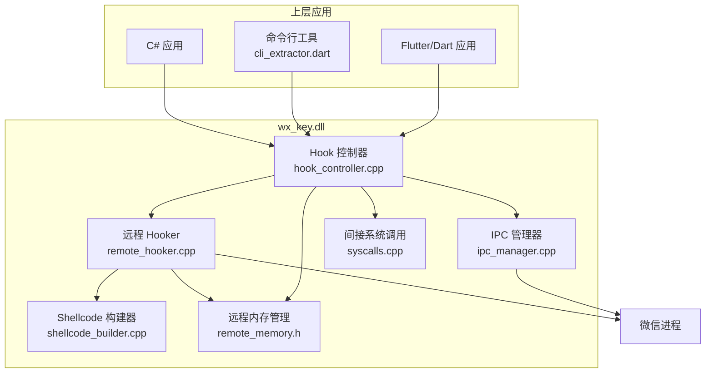
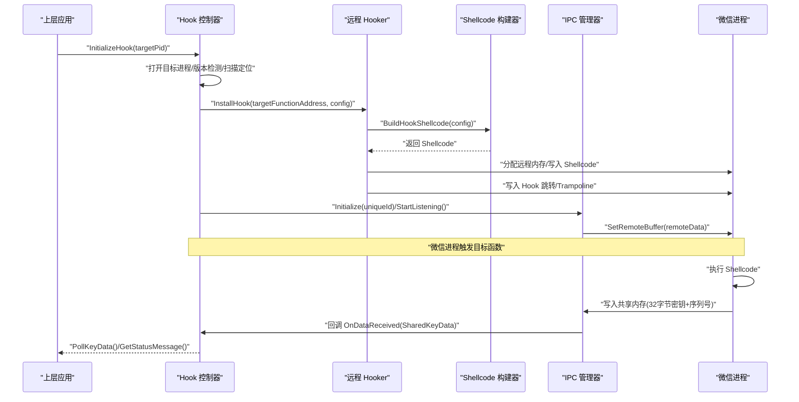
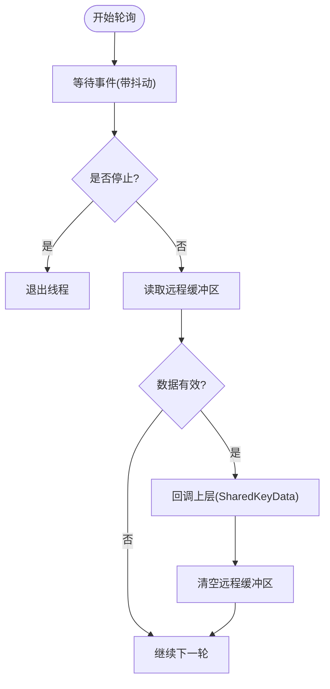
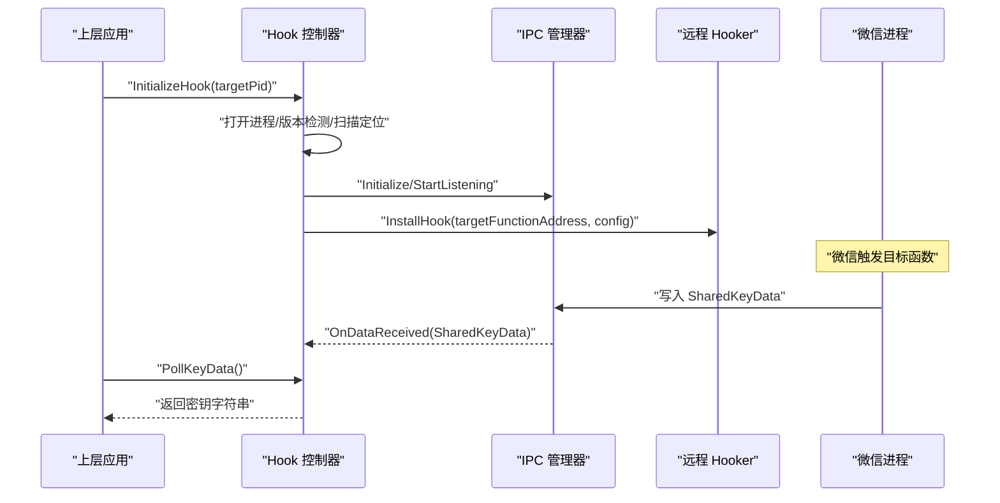
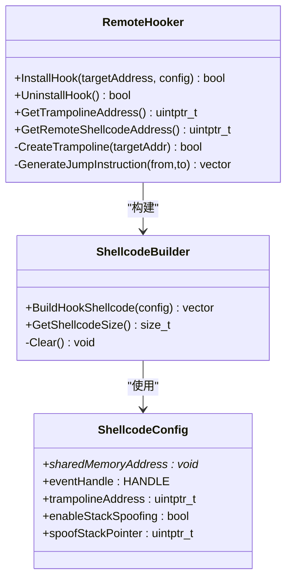
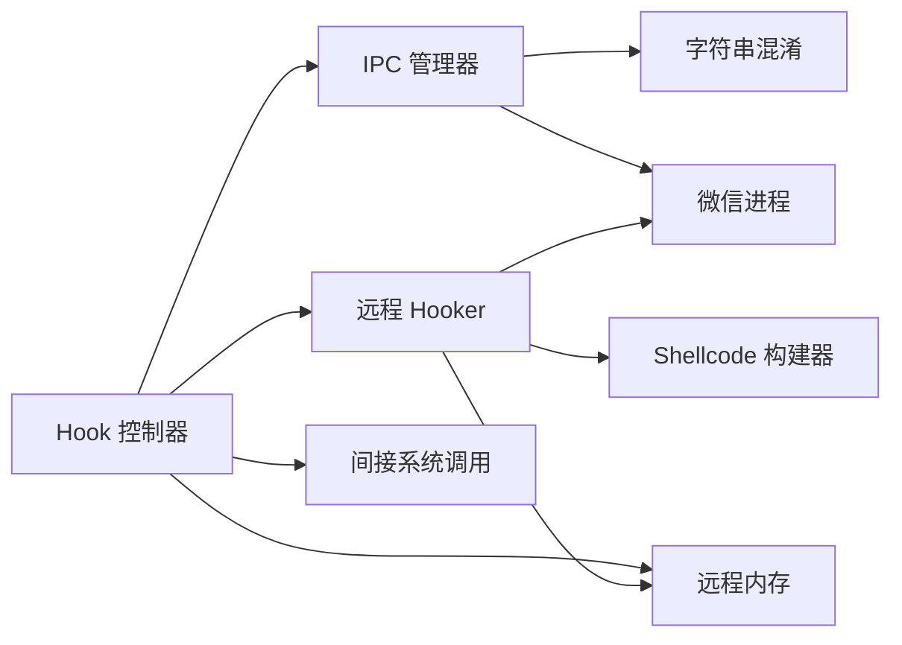

# 进程间通信接口

<cite>
**本文引用的文件**
- [ipc_manager.h](file://wx_key/include/ipc_manager.h)
- [ipc_manager.cpp](file://wx_key/src/ipc_manager.cpp)
- [hook_controller.h](file://wx_key/include/hook_controller.h)
- [hook_controller.cpp](file://wx_key/src/hook_controller.cpp)
- [shellcode_builder.h](file://wx_key/include/shellcode_builder.h)
- [shellcode_builder.cpp](file://wx_key/src/shellcode_builder.cpp)
- [remote_memory.h](file://wx_key/include/remote_memory.h)
- [remote_hooker.h](file://wx_key/include/remote_hooker.h)
- [remote_hooker.cpp](file://wx_key/src/remote_hooker.cpp)
- [syscalls.h](file://wx_key/include/syscalls.h)
- [syscalls.cpp](file://wx_key/src/syscalls.cpp)
- [string_obfuscator.h](file://wx_key/include/string_obfuscator.h)
- [dll_usage.md](file://docs/dll_usage.md)
- [cli_extractor.dart](file://bin/cli_extractor.dart)
- [dllmain.cpp](file://wx_key/dllmain.cpp)
</cite>

## 目录
1. [简介](#简介)
2. [项目结构](#项目结构)
3. [核心组件](#核心组件)
4. [架构总览](#架构总览)
5. [详细组件分析](#详细组件分析)
6. [依赖关系分析](#依赖关系分析)
7. [性能考量](#性能考量)
8. [故障排查指南](#故障排查指南)
9. [结论](#结论)
10. [附录](#附录)

## 简介
本文件面向 wx_key 的进程间通信（IPC）机制，聚焦于共享内存管理、事件同步与消息传递的实现细节。文档详细说明 IPC 数据格式、通信协议与同步机制，提供共享内存结构定义与访问方法，解释事件唤醒机制、轮询策略与超时处理，阐述通信安全性、并发控制与错误恢复机制，并给出完整的 IPC 通信示例与调试方法，最后提供性能优化建议与最佳实践。

## 项目结构
本项目采用分层设计：
- 上层应用通过动态库导出函数与 wx_key.dll 交互（Flutter/C#/CLI 等）。
- wx_key.dll 内部通过远程 Hook 技术拦截微信关键函数，将密钥写入共享内存并通过轮询机制通知上层。
- IPC 通道由共享内存与事件对象组成，当前实现采用轮询模式（事件用于线程唤醒，非阻塞等待）。

图表来源
- [hook_controller.cpp](file://wx_key/src/hook_controller.cpp#L214-L379)
- [ipc_manager.cpp](file://wx_key/src/ipc_manager.cpp#L24-L132)
- [remote_hooker.cpp](file://wx_key/src/remote_hooker.cpp#L278-L389)
- [shellcode_builder.cpp](file://wx_key/src/shellcode_builder.cpp#L28-L150)
- [remote_memory.h](file://wx_key/include/remote_memory.h#L8-L104)
- [syscalls.cpp](file://wx_key/src/syscalls.cpp#L92-L117)

章节来源
- [hook_controller.cpp](file://wx_key/src/hook_controller.cpp#L214-L379)
- [ipc_manager.cpp](file://wx_key/src/ipc_manager.cpp#L24-L132)
- [remote_hooker.cpp](file://wx_key/src/remote_hooker.cpp#L278-L389)
- [shellcode_builder.cpp](file://wx_key/src/shellcode_builder.cpp#L28-L150)
- [remote_memory.h](file://wx_key/include/remote_memory.h#L8-L104)
- [syscalls.cpp](file://wx_key/src/syscalls.cpp#L92-L117)

## 核心组件
- IPC 管理器（IPCManager）：负责共享内存与事件对象的创建、映射、轮询监听与回调分发。
- Hook 控制器（HookController）：负责进程打开、版本检测、扫描定位、远程内存分配、Shellcode 注入与 IPC 初始化。
- 远程 Hooker（RemoteHooker）：负责在目标进程内安装 Inline Hook，生成 Trampoline 与 Shellcode。
- Shellcode 构建器（ShellcodeBuilder）：基于 Xbyak 生成 x64 汇编，实现密钥拷贝与序列号递增。
- 远程内存（RemoteMemory）：封装 Nt* 系统调用，提供远程内存分配、保护与释放。
- 间接系统调用（IndirectSyscalls）：动态解析 ntdll 函数并生成 syscall stub，规避 EDR 检测。
- 字符串混淆（StringObfuscator）：对全局共享内存名与事件名进行编译时异或混淆。

章节来源
- [ipc_manager.h](file://wx_key/include/ipc_manager.h#L18-L76)
- [hook_controller.h](file://wx_key/include/hook_controller.h#L12-L47)
- [remote_hooker.h](file://wx_key/include/remote_hooker.h#L9-L70)
- [shellcode_builder.h](file://wx_key/include/shellcode_builder.h#L8-L34)
- [remote_memory.h](file://wx_key/include/remote_memory.h#L8-L104)
- [syscalls.h](file://wx_key/include/syscalls.h#L96-L185)
- [string_obfuscator.h](file://wx_key/include/string_obfuscator.h#L42-L58)

## 架构总览
下图展示从上层应用到微信进程的关键交互路径，以及 IPC 通道的建立与轮询流程。

图表来源
- [hook_controller.cpp](file://wx_key/src/hook_controller.cpp#L334-L379)
- [remote_hooker.cpp](file://wx_key/src/remote_hooker.cpp#L278-L389)
- [shellcode_builder.cpp](file://wx_key/src/shellcode_builder.cpp#L28-L150)
- [ipc_manager.cpp](file://wx_key/src/ipc_manager.cpp#L212-L271)

## 详细组件分析

### IPC 数据结构与通信协议
- 共享内存数据结构（SharedKeyData）
  - 字段
    - dataSize：数据大小（固定为 32）
    - keyBuffer[32]：密钥缓冲区（32 字节）
    - sequenceNumber：序列号（每次写入递增，用于去重）
  - 结构体打包：按 1 字节对齐，保证跨进程一致性
  - 通信协议
    - 写入条件：Shellcode 在 keySize==32 时写入
    - 读取条件：监听线程周期性读取，仅当 sequenceNumber 变化且非零时视为新数据
    - 去重策略：记录 lastSequenceNumber，避免重复处理
    - 清空策略：读取后将远程缓冲区清零，防止重复消费

- 名称生成与安全
  - 名称模板：Global\WxKeySharedMemory_{GUID}、Global\WxKeyEvent_{GUID}
  - GUID 由 uniqueId 与随机后缀组合生成，降低可预测性
  - 若创建 Global 命名失败（权限问题），自动降级为 Local 前缀

- 事件与唤醒
  - 事件对象为手动重置事件，初始非信号
  - 监听线程在 Wait 上增加轻微抖动（约 80-143ms），避免稳定特征
  - 收到事件信号后重置事件，继续轮询

章节来源
- [ipc_manager.h](file://wx_key/include/ipc_manager.h#L10-L16)
- [ipc_manager.cpp](file://wx_key/src/ipc_manager.cpp#L24-L132)
- [ipc_manager.cpp](file://wx_key/src/ipc_manager.cpp#L212-L271)
- [string_obfuscator.h](file://wx_key/include/string_obfuscator.h#L42-L58)

### IPC 管理器（IPCManager）
- 职责
  - 初始化共享内存与事件对象
  - 设置远程缓冲区地址（目标进程）
  - 启动/停止监听线程
  - 提供共享内存地址与事件句柄（传递给 Shellcode）
  - 回调分发：将新密钥数据传递给上层

- 关键流程
  - Initialize：生成 GUID、替换模板、创建共享内存与事件、必要时降级为 Local 命名
  - StartListening：创建监听线程，ResetEvent，进入轮询循环
  - ListeningLoop：WaitForSingleObject + 抖动 + ReadProcessMemory + 校验 + 回调 + 清空远程缓冲
  - StopListening：原子标记 shouldStopListening，SetEvent 唤醒，等待线程退出并关闭句柄

图表来源
- [ipc_manager.cpp](file://wx_key/src/ipc_manager.cpp#L212-L271)

章节来源
- [ipc_manager.h](file://wx_key/include/ipc_manager.h#L18-L76)
- [ipc_manager.cpp](file://wx_key/src/ipc_manager.cpp#L24-L132)
- [ipc_manager.cpp](file://wx_key/src/ipc_manager.cpp#L163-L196)
- [ipc_manager.cpp](file://wx_key/src/ipc_manager.cpp#L206-L210)
- [ipc_manager.cpp](file://wx_key/src/ipc_manager.cpp#L212-L271)

### Hook 控制器（HookController）
- 职责
  - 打开目标进程、版本检测、扫描定位目标函数
  - 分配远程数据缓冲区与伪栈
  - 初始化 IPC 管理器并启动监听
  - 安装远程 Hook（Inline Patch）
  - 提供 PollKeyData 与 GetStatusMessage 等导出函数

- 关键流程
  - InitializeContext：初始化系统调用 → 打开进程 → 版本检测 → 扫描定位 → 分配远程内存 → 初始化 IPC → 安装 Hook
  - PollKeyData：临界区保护，返回 pendingKeyData，置 hasNewKey=false
  - GetStatusMessage：返回状态队列消息，支持等级（Info/Success/Error）

图表来源
- [hook_controller.cpp](file://wx_key/src/hook_controller.cpp#L214-L379)
- [hook_controller.cpp](file://wx_key/src/hook_controller.cpp#L428-L455)
- [hook_controller.cpp](file://wx_key/src/hook_controller.cpp#L457-L486)

章节来源
- [hook_controller.h](file://wx_key/include/hook_controller.h#L12-L47)
- [hook_controller.cpp](file://wx_key/src/hook_controller.cpp#L214-L379)
- [hook_controller.cpp](file://wx_key/src/hook_controller.cpp#L428-L455)
- [hook_controller.cpp](file://wx_key/src/hook_controller.cpp#L457-L486)

### 远程 Hooker 与 Shellcode 构建器
- 远程 Hooker
  - 创建 Trampoline：读取目标指令，分配远程内存，写入原始指令 + 跳回原函数的长跳转
  - 生成 Shellcode 地址：分配远程内存，写入并设置可执行权限
  - 安装 Hook：修改目标函数保护属性，写入跳转指令，恢复保护
  - 卸载 Hook：恢复原始字节，释放远程内存

- Shellcode 构建器
  - 保存/恢复寄存器与标志位
  - 检查 keySize==32，拷贝 32 字节密钥到共享内存
  - 递增 sequenceNumber
  - 切换到伪栈（可选）以规避栈检测
  - 跳回 Trampoline

图表来源
- [shellcode_builder.h](file://wx_key/include/shellcode_builder.h#L8-L34)
- [shellcode_builder.cpp](file://wx_key/src/shellcode_builder.cpp#L28-L150)
- [remote_hooker.h](file://wx_key/include/remote_hooker.h#L9-L70)
- [remote_hooker.cpp](file://wx_key/src/remote_hooker.cpp#L197-L245)
- [remote_hooker.cpp](file://wx_key/src/remote_hooker.cpp#L278-L389)

章节来源
- [remote_hooker.h](file://wx_key/include/remote_hooker.h#L9-L70)
- [remote_hooker.cpp](file://wx_key/src/remote_hooker.cpp#L197-L245)
- [remote_hooker.cpp](file://wx_key/src/remote_hooker.cpp#L278-L389)
- [shellcode_builder.h](file://wx_key/include/shellcode_builder.h#L8-L34)
- [shellcode_builder.cpp](file://wx_key/src/shellcode_builder.cpp#L28-L150)

### 远程内存与间接系统调用
- 远程内存（RemoteMemory）
  - RAII 包装：allocate/protect/reset/move
  - 使用 NtAllocateVirtualMemory/NtProtectVirtualMemory/NtFreeVirtualMemory
  - 支持移动语义，避免浅拷贝风险

- 间接系统调用（IndirectSyscalls）
  - 动态解析 ntdll 函数，必要时从干净镜像加载
  - 提取 SSN 并生成 syscall stub，降低检测概率
  - 封装常用 Nt* 接口，统一错误码处理

章节来源
- [remote_memory.h](file://wx_key/include/remote_memory.h#L8-L104)
- [syscalls.h](file://wx_key/include/syscalls.h#L96-L185)
- [syscalls.cpp](file://wx_key/src/syscalls.cpp#L92-L117)
- [syscalls.cpp](file://wx_key/src/syscalls.cpp#L235-L276)

### 字符串混淆与安全
- 编译时字符串混淆（XOR + 编译期解密）
  - 共享内存名、事件名、Weixin.dll、ntdll.dll 等敏感字符串被混淆
  - 运行时解密后使用，降低静态特征

章节来源
- [string_obfuscator.h](file://wx_key/include/string_obfuscator.h#L7-L32)
- [string_obfuscator.h](file://wx_key/include/string_obfuscator.h#L42-L58)

## 依赖关系分析
- 组件耦合
  - Hook 控制器依赖 IPC 管理器、远程 Hooker、远程内存、间接系统调用
  - 远程 Hooker 依赖 Shellcode 构建器与远程内存
  - IPC 管理器依赖字符串混淆（名称生成）、系统事件与进程内存读写
- 外部依赖
  - Windows API（CreateFileMapping/MapViewOfFile/ReadProcessMemory 等）
  - ntdll（Nt* 系统调用）
  - Xbyak（x64 汇编代码生成）

图表来源
- [hook_controller.cpp](file://wx_key/src/hook_controller.cpp#L334-L379)
- [remote_hooker.cpp](file://wx_key/src/remote_hooker.cpp#L278-L389)
- [ipc_manager.cpp](file://wx_key/src/ipc_manager.cpp#L24-L132)
- [string_obfuscator.h](file://wx_key/include/string_obfuscator.h#L42-L58)

章节来源
- [hook_controller.cpp](file://wx_key/src/hook_controller.cpp#L334-L379)
- [remote_hooker.cpp](file://wx_key/src/remote_hooker.cpp#L278-L389)
- [ipc_manager.cpp](file://wx_key/src/ipc_manager.cpp#L24-L132)
- [string_obfuscator.h](file://wx_key/include/string_obfuscator.h#L42-L58)

## 性能考量
- 轮询抖动
  - 监听线程等待时间加入轻微抖动（约 80-143ms），避免稳定特征，降低 CPU 占用
- 事件唤醒
  - 使用手动重置事件作为线程唤醒信号，避免忙等
- 内存访问
  - 仅在检测到新数据时进行 ReadProcessMemory，减少不必要的系统调用
- Shellcode 效率
  - 使用 rep movsb 批量拷贝 32 字节密钥，减少指令数量
- 建议
  - 轮询间隔建议 50-200ms，兼顾及时性与性能
  - 上层应用使用独立线程轮询，避免阻塞 UI
  - 对 sequenceNumber 做本地缓存，避免重复处理

[本节为通用性能建议，不直接分析具体文件]

## 故障排查指南
- 常见错误与定位
  - 打开进程失败：检查权限与 PID 是否有效，查看 NTSTATUS 与系统错误码
  - 版本不支持：微信版本不在支持范围内，需更新特征码配置
  - 进程模块缺失：未找到 Weixin.dll，确认微信安装与进程状态
  - 扫描失败：特征码匹配数量不为 1，需更新版本配置
  - IPC 初始化失败：检查命名空间（Global/Local）权限，必要时以管理员运行
  - Hook 安装失败：检查目标函数地址与保护属性，确认 Inline Patch 可写
  - 轮询无数据：确认 Shellcode 正常执行，SharedKeyData 写入与 sequenceNumber 递增
- 调试方法
  - 使用 GetStatusMessage 获取内部日志，区分 Info/Success/Error 等级
  - 使用 GetLastErrorMsg 获取最后一次错误详情
  - CLI 工具提供命令行轮询与超时控制，便于自动化测试
  - 检查共享内存是否被清空（读取后自动清零）

章节来源
- [hook_controller.cpp](file://wx_key/src/hook_controller.cpp#L225-L232)
- [hook_controller.cpp](file://wx_key/src/hook_controller.cpp#L252-L256)
- [hook_controller.cpp](file://wx_key/src/hook_controller.cpp#L276-L281)
- [hook_controller.cpp](file://wx_key/src/hook_controller.cpp#L300-L306)
- [hook_controller.cpp](file://wx_key/src/hook_controller.cpp#L338-L343)
- [hook_controller.cpp](file://wx_key/src/hook_controller.cpp#L369-L374)
- [hook_controller.cpp](file://wx_key/src/hook_controller.cpp#L488-L490)
- [cli_extractor.dart](file://bin/cli_extractor.dart#L150-L188)
- [cli_extractor.dart](file://bin/cli_extractor.dart#L206-L262)

## 结论
本 IPC 机制通过共享内存与事件配合轮询实现稳定的消息传递，结合 Shellcode 拦截与序列号去重，确保上层应用能够可靠地获取微信密钥。通过字符串混淆、间接系统调用与伪栈技术，提升了隐蔽性与稳定性。建议在生产环境中合理设置轮询间隔、做好错误日志与超时处理，并遵循单例与清理原则，确保系统长期稳定运行。

[本节为总结性内容，不直接分析具体文件]

## 附录

### API 一览（上层应用）
- InitializeHook(targetPid)
  - 功能：初始化 Hook，扫描定位、分配远程内存、安装 Hook、初始化 IPC
  - 返回：成功/失败
- PollKeyData(keyBuffer, bufferSize)
  - 功能：非阻塞轮询获取密钥（64 字节十六进制字符串 + 结束符）
  - 返回：有新数据返回 true，否则 false
- GetStatusMessage(statusBuffer, bufferSize, outLevel)
  - 功能：获取内部日志消息，outLevel 对应 Info/Sucess/Error
  - 返回：有新消息返回 true，否则 false
- CleanupHook()
  - 功能：卸载 Hook、释放资源、关闭句柄
  - 返回：成功/失败
- GetLastErrorMsg()
  - 功能：获取最后一次错误信息

章节来源
- [hook_controller.h](file://wx_key/include/hook_controller.h#L12-L47)
- [dll_usage.md](file://docs/dll_usage.md#L21-L31)

### IPC 通信示例（命令行）
- CLI 工具通过 DynamicLibrary 加载 wx_key.dll，查找导出函数，启动轮询定时器，周期性调用 PollKeyData 与 GetStatusMessage，并在提取到密钥后停止轮询与清理资源。

章节来源
- [cli_extractor.dart](file://bin/cli_extractor.dart#L106-L147)
- [cli_extractor.dart](file://bin/cli_extractor.dart#L190-L204)
- [cli_extractor.dart](file://bin/cli_extractor.dart#L206-L262)
- [cli_extractor.dart](file://bin/cli_extractor.dart#L282-L300)

### DLL 入口与生命周期
- DLL 入口在进程附加时禁用库调用线程化，在进程分离时清理 Hook 资源，确保进程退出时资源回收。

章节来源
- [dllmain.cpp](file://wx_key/dllmain.cpp#L11-L23)