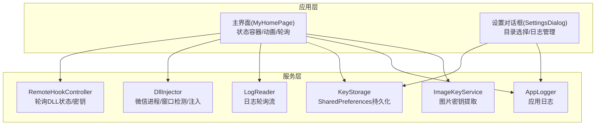
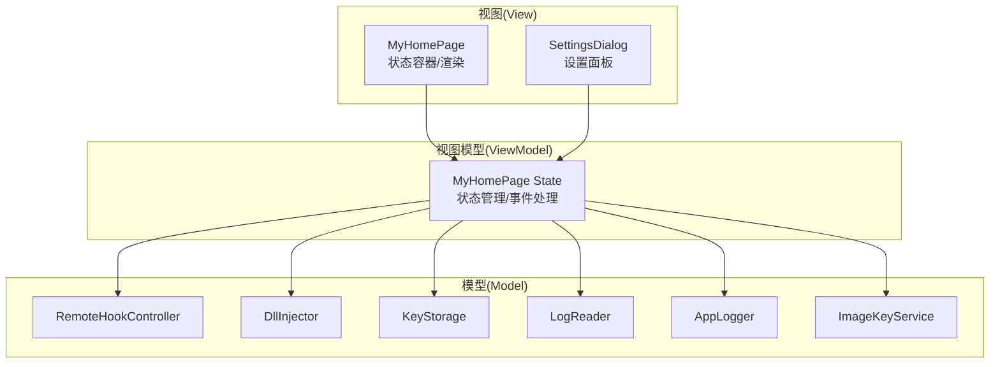
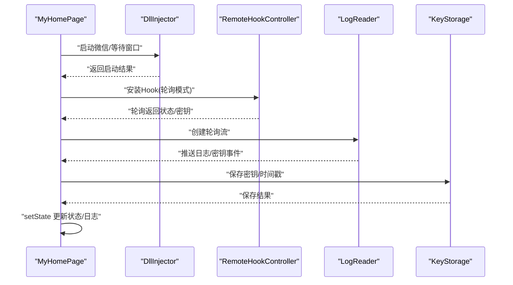
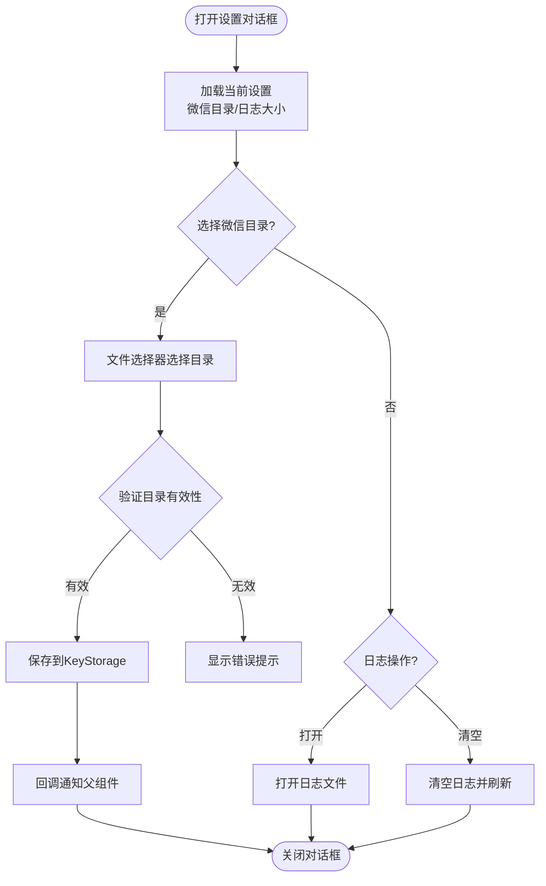
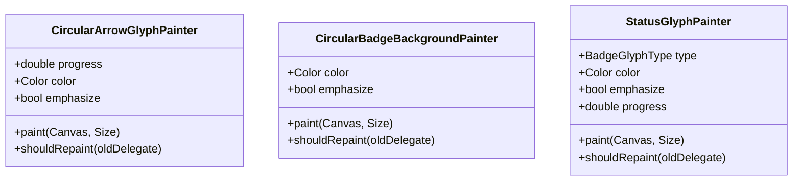
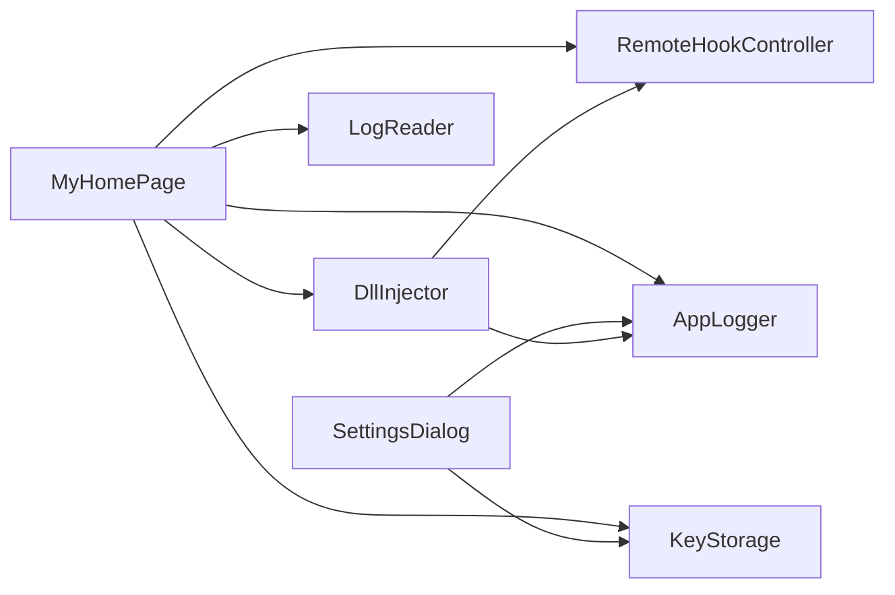

# Flutter UI组件

<cite>
**本文档引用的文件**
- [main.dart](file://lib/main.dart)
- [settings_dialog.dart](file://lib/widgets/settings_dialog.dart)
- [remote_hook_controller.dart](file://lib/services/remote_hook_controller.dart)
- [dll_injector.dart](file://lib/services/dll_injector.dart)
- [key_storage.dart](file://lib/services/key_storage.dart)
- [log_reader.dart](file://lib/services/log_reader.dart)
- [app_logger.dart](file://lib/services/app_logger.dart)
- [image_key_service.dart](file://lib/services/image_key_service.dart)
- [pubspec.yaml](file://pubspec.yaml)
- [README.md](file://README.md)
</cite>

## 目录
1. [引言](#引言)
2. [项目结构](#项目结构)
3. [核心组件](#核心组件)
4. [架构总览](#架构总览)
5. [详细组件分析](#详细组件分析)
6. [依赖关系分析](#依赖关系分析)
7. [性能考虑](#性能考虑)
8. [故障排除指南](#故障排除指南)
9. [结论](#结论)
10. [附录](#附录)

## 引言
本项目是一个基于 Flutter 的桌面应用，用于在微信 4.0 及以上版本中提取数据库密钥与缓存图片解密所需的密钥。UI 层采用 MVVM 思想，通过状态管理与数据绑定实现自动化流程控制，包括 DLL 注入、状态轮询、日志监控与密钥持久化。本文档围绕 wx_key 组件的 UI 实现展开，重点说明：

- MVVM 架构在项目中的落地方式（状态管理与数据绑定）
- 主要 UI 组件（设置对话框、状态显示组件、用户交互元素）的设计与实现
- 自动化流程控制的 UI 表达（进度指示器、状态轮询机制）
- 响应式设计与跨平台兼容性策略
- 组件定制与主题配置
- 用户体验优化与无障碍支持
- 组件间组合与集成模式

## 项目结构
项目采用按功能域划分的组织方式，核心目录如下：
- lib/main.dart：应用入口与主界面（状态容器、动画、状态轮询）
- lib/widgets/settings_dialog.dart：设置对话框组件
- lib/services/*：业务服务层（远程 Hook 控制、DLL 注入、密钥存储、日志读取、应用日志、图片密钥服务等）

图表来源
- [main.dart](file://lib/main.dart#L420-L534)
- [settings_dialog.dart](file://lib/widgets/settings_dialog.dart#L1-L397)
- [remote_hook_controller.dart](file://lib/services/remote_hook_controller.dart#L34-L277)
- [dll_injector.dart](file://lib/services/dll_injector.dart#L31-L931)
- [key_storage.dart](file://lib/services/key_storage.dart#L5-L273)
- [log_reader.dart](file://lib/services/log_reader.dart#L6-L138)
- [app_logger.dart](file://lib/services/app_logger.dart#L7-L191)
- [image_key_service.dart](file://lib/services/image_key_service.dart#L54-L698)

章节来源
- [README.md](file://README.md#L77-L96)
- [pubspec.yaml](file://pubspec.yaml#L77-L112)

## 核心组件
本节聚焦于与 wx_key 组件直接相关的 UI 组件与状态管理机制。

- 主界面状态容器（MyHomePage）
  - 状态字段：微信运行状态、DLL 注入状态、加载状态、密钥信息、日志消息、轮询开关、动画控制器、超时定时器等
  - 生命周期：初始化时启动状态轮询、加载持久化数据、检测微信版本、启动窗口监听
  - 数据绑定：通过 setState 触发 UI 更新，配合 StreamSubscription 实时渲染日志与密钥
  - 动画：使用 AnimationController 控制背景装饰动画，增强状态反馈

- 设置对话框（SettingsDialog）
  - 功能：选择微信安装目录、打开/清空应用日志、回调通知父级目录变更
  - 交互：文件选择器、确认对话框、浮层提示（SnackBar）
  - 数据持久化：通过 KeyStorage 读写微信目录与日志大小

- 状态可视化与进度指示
  - 自定义绘制：CircularArrowGlyphPainter、CircularBadgeBackgroundPainter、StatusGlyphPainter
  - 状态映射：不同状态（信息、成功、警告、错误）对应不同的图标、颜色与阴影
  - 进度表达：通过进度参数驱动箭头与徽章动画，直观反映自动化流程阶段

章节来源
- [main.dart](file://lib/main.dart#L420-L534)
- [main.dart](file://lib/main.dart#L57-L155)
- [main.dart](file://lib/main.dart#L157-L336)
- [settings_dialog.dart](file://lib/widgets/settings_dialog.dart#L8-L397)

## 架构总览
本项目采用 MVVM 架构思想：
- Model：服务层（RemoteHookController、DllInjector、KeyStorage、LogReader、AppLogger、ImageKeyService）
- View：Flutter UI（MyHomePage、SettingsDialog）
- ViewModel：通过 StatefulWidget 管理状态与生命周期，将 Model 的异步结果转化为 View 的渲染数据

图表来源
- [main.dart](file://lib/main.dart#L420-L534)
- [settings_dialog.dart](file://lib/widgets/settings_dialog.dart#L8-L397)
- [remote_hook_controller.dart](file://lib/services/remote_hook_controller.dart#L34-L277)
- [dll_injector.dart](file://lib/services/dll_injector.dart#L31-L931)
- [key_storage.dart](file://lib/services/key_storage.dart#L5-L273)
- [log_reader.dart](file://lib/services/log_reader.dart#L6-L138)
- [app_logger.dart](file://lib/services/app_logger.dart#L7-L191)
- [image_key_service.dart](file://lib/services/image_key_service.dart#L54-L698)

## 详细组件分析

### 主界面（MyHomePage）与状态管理
- 状态字段与职责
  - 运行状态：_isWechatRunning、_isDllInjected、_isLoading
  - 业务数据：_extractedKey、_currentSessionKey、_savedKey、_keyTimestamp
  - 图片密钥：_imageXorKey、_imageAesKey、_imageKeyTimestamp、_isGettingImageKey、_imageKeyProgressMessage
  - 版本与日志：_wechatVersion、_logMessages、_maxLogMessages
  - 流控制：_isPolling、AnimationController、Timer、StreamSubscription

- 数据绑定与更新
  - setState：统一触发 UI 重绘，保证状态与视图一致
  - StreamSubscription：订阅日志轮询流，实时渲染日志与密钥
  - AnimationController：循环播放背景装饰动画，提升状态反馈

- 自动化流程控制
  - 状态轮询：_startStatusPolling 启动轮询，持续更新 UI 状态
  - 超时控制：_startKeyTimeout 在 60 秒后若未获取密钥则清理资源并提示
  - 资源清理：_cleanupResources 停止轮询、卸载 Hook、取消日志订阅、重置状态

图表来源
- [main.dart](file://lib/main.dart#L710-L807)
- [dll_injector.dart](file://lib/services/dll_injector.dart#L531-L602)
- [remote_hook_controller.dart](file://lib/services/remote_hook_controller.dart#L130-L204)
- [log_reader.dart](file://lib/services/log_reader.dart#L96-L135)
- [key_storage.dart](file://lib/services/key_storage.dart#L14-L30)

章节来源
- [main.dart](file://lib/main.dart#L420-L534)
- [main.dart](file://lib/main.dart#L536-L707)
- [main.dart](file://lib/main.dart#L709-L807)

### 设置对话框（SettingsDialog）
- 功能点
  - 选择微信安装目录：文件选择器 + 校验（Weixin.exe/WeChat.exe）
  - 日志管理：打开日志文件、清空日志
  - 回调通知：目录变更回调通知父组件刷新状态

- 交互设计
  - 卡片式布局：清晰的功能分区与触控反馈
  - 对话框样式：圆角边框、阴影、标题栏与关闭按钮
  - 提示反馈：SnackBar 浮层提示成功/错误信息

图表来源
- [settings_dialog.dart](file://lib/widgets/settings_dialog.dart#L30-L125)
- [settings_dialog.dart](file://lib/widgets/settings_dialog.dart#L202-L397)
- [key_storage.dart](file://lib/services/key_storage.dart#L137-L168)
- [app_logger.dart](file://lib/services/app_logger.dart#L146-L167)

章节来源
- [settings_dialog.dart](file://lib/widgets/settings_dialog.dart#L8-L397)
- [key_storage.dart](file://lib/services/key_storage.dart#L137-L168)
- [app_logger.dart](file://lib/services/app_logger.dart#L146-L167)

### 状态显示组件与进度指示
- 自定义绘制器
  - CircularArrowGlyphPainter：旋转箭头动画，表示流程进度
  - CircularBadgeBackgroundPainter：圆形背景渐变与描边
  - StatusGlyphPainter：根据状态类型绘制勾选或感叹号徽章，并支持进度动画

- 状态映射
  - 不同状态（信息、成功、警告、错误）对应不同图标、颜色与阴影
  - emphasize 参数控制视觉强调程度，提升可感知性

图表来源
- [main.dart](file://lib/main.dart#L57-L155)
- [main.dart](file://lib/main.dart#L157-L336)

章节来源
- [main.dart](file://lib/main.dart#L57-L155)
- [main.dart](file://lib/main.dart#L157-L336)

### 自动化流程控制的 UI 实现
- 状态轮询机制
  - RemoteHookController：轮询 DLL 状态与密钥，每 100ms 检查一次
  - LogReader：轮询日志文件，解析 KEY 与日志消息，去重并推送到 UI
  - MyHomePage：订阅流并在 UI 中展示最新状态与日志

- 进度指示器
  - AnimationController：控制背景装饰动画的循环播放
  - 自定义绘制器：根据 progress 参数绘制箭头与徽章，直观反映自动化阶段

- 超时与资源清理
  - 60 秒超时：若未获取到密钥则清理资源并提示用户
  - _cleanupResources：统一停止轮询、卸载 Hook、取消订阅、重置状态

章节来源
- [remote_hook_controller.dart](file://lib/services/remote_hook_controller.dart#L130-L204)
- [log_reader.dart](file://lib/services/log_reader.dart#L96-L135)
- [main.dart](file://lib/main.dart#L470-L534)
- [main.dart](file://lib/main.dart#L690-L707)

### 响应式设计与跨平台兼容性
- 字体与主题
  - 使用 HarmonyOS_SansSC 字体族，适配多权重
  - Material3 主题，基于 seedColor 生成色彩方案

- 响应式布局
  - 使用 Container + Column/Row 组合，约束最大宽度与高度
  - SingleChildScrollView 支持长内容滚动
  - 圆角卡片与阴影增强层级感

- 跨平台
  - Flutter 框架天然支持 Windows/macOS/Linux/Web
  - 通过 window_manager 管理窗口行为
  - 通过 ffi/win32 与原生 Windows API 交互

章节来源
- [main.dart](file://lib/main.dart#L344-L417)
- [pubspec.yaml](file://pubspec.yaml#L95-L112)

### 组件定制与主题配置
- 主题定制
  - seedColor：绿色系（0xFF07c160），营造专业与信任感
  - 字体族：HarmonyOS_SansSC，统一中英文排版
  - 文本样式：针对不同层级的标题与正文设置字体权重

- 组件样式
  - 圆角边框、阴影、描边与渐变背景
  - 图标与颜色语义化（蓝色/绿色/红色分别对应目录、日志、错误）

章节来源
- [main.dart](file://lib/main.dart#L344-L417)
- [settings_dialog.dart](file://lib/widgets/settings_dialog.dart#L202-L397)

### 用户体验优化与无障碍支持
- 无障碍
  - 使用 Material 组件，具备默认的可访问性属性
  - 文本使用语义化字体与合适的字号与行高

- 交互优化
  - 浮层提示（SnackBar）及时反馈操作结果
  - 确认对话框避免误操作
  - 动画与进度指示提升用户对流程的掌控感

- 错误处理
  - 统一的日志记录与错误提示
  - 超时与资源清理避免 UI 卡顿

章节来源
- [settings_dialog.dart](file://lib/widgets/settings_dialog.dart#L127-L200)
- [app_logger.dart](file://lib/services/app_logger.dart#L61-L86)

### 组件间的组合与集成
- 组件组合
  - MyHomePage 作为根容器，组合状态显示、日志列表、操作按钮
  - SettingsDialog 作为独立对话框，通过回调与父组件通信

- 服务集成
  - RemoteHookController：与 DLL 交互，提供轮询接口
  - DllInjector：微信进程/窗口检测与注入
  - LogReader：日志轮询流
  - KeyStorage：密钥与配置持久化
  - AppLogger：应用日志
  - ImageKeyService：图片密钥提取（可扩展到 UI）

章节来源
- [main.dart](file://lib/main.dart#L420-L534)
- [remote_hook_controller.dart](file://lib/services/remote_hook_controller.dart#L34-L277)
- [dll_injector.dart](file://lib/services/dll_injector.dart#L31-L931)
- [log_reader.dart](file://lib/services/log_reader.dart#L6-L138)
- [key_storage.dart](file://lib/services/key_storage.dart#L5-L273)
- [app_logger.dart](file://lib/services/app_logger.dart#L7-L191)
- [image_key_service.dart](file://lib/services/image_key_service.dart#L54-L698)

## 依赖关系分析
- 外部依赖
  - ffi/win32：与原生 Windows API 交互
  - shared_preferences：本地持久化
  - file_picker/url_launcher/path/path_provider：文件与系统交互
  - http：网络请求（下载 DLL）
  - pointycastle：AES 加解密
  - window_manager：窗口管理

- 内部模块耦合
  - MyHomePage 依赖多个服务，形成高扇出结构
  - SettingsDialog 仅依赖 KeyStorage 与 AppLogger，低耦合
  - RemoteHookController 与 DllInjector 通过进程与窗口检测协同工作

图表来源
- [main.dart](file://lib/main.dart#L8-L14)
- [settings_dialog.dart](file://lib/widgets/settings_dialog.dart#L1-L6)
- [remote_hook_controller.dart](file://lib/services/remote_hook_controller.dart#L34-L87)
- [dll_injector.dart](file://lib/services/dll_injector.dart#L31-L931)
- [key_storage.dart](file://lib/services/key_storage.dart#L5-L273)
- [app_logger.dart](file://lib/services/app_logger.dart#L7-L191)

章节来源
- [pubspec.yaml](file://pubspec.yaml#L30-L61)

## 性能考虑
- 轮询频率与资源占用
  - RemoteHookController 轮询间隔 100ms，LogReader 轮询间隔 500ms，平衡实时性与性能
- 内存扫描优化
  - ImageKeyService 分块读取进程内存，限制单次扫描大小，避免阻塞
- UI 渲染优化
  - 自定义绘制器仅在参数变化时重绘（shouldRepaint），减少不必要的绘制
- 日志与持久化
  - AppLogger 缓冲写入，降低频繁 IO；KeyStorage 使用轻量级键值存储

## 故障排除指南
- 未检测到微信进程
  - 检查微信是否已安装与路径是否正确
  - 使用设置对话框手动选择微信目录
- 注入失败
  - 确认微信进程已关闭或允许重启
  - 检查系统权限与杀软拦截
- 密钥获取超时
  - 按提示重新启动微信并进行图片浏览操作
  - 等待 60 秒后自动清理资源并提示
- 日志问题
  - 通过设置对话框打开/清空日志文件，定位问题

章节来源
- [main.dart](file://lib/main.dart#L564-L592)
- [main.dart](file://lib/main.dart#L690-L707)
- [settings_dialog.dart](file://lib/widgets/settings_dialog.dart#L89-L125)
- [app_logger.dart](file://lib/services/app_logger.dart#L146-L167)

## 结论
本项目通过 MVVM 架构实现了清晰的状态管理与数据绑定，结合自定义绘制器与轮询机制，为复杂自动化流程提供了直观的 UI 表达。设置对话框、状态显示与用户交互元素共同构成了完整的用户体验闭环。通过合理的依赖与服务集成，项目在跨平台与性能之间取得了良好平衡，并提供了完善的日志与错误处理能力。

## 附录
- 目录结构概览与 DLL 扩展使用说明参见项目 README
- 开发构建与许可证信息参见项目 README 与 pubspec.yaml

章节来源
- [README.md](file://README.md#L77-L132)
- [pubspec.yaml](file://pubspec.yaml#L1-L20)