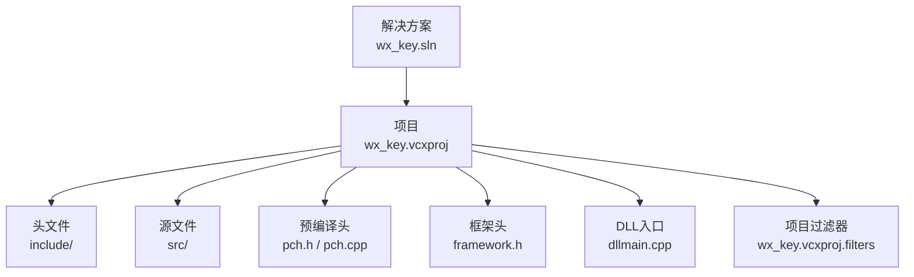
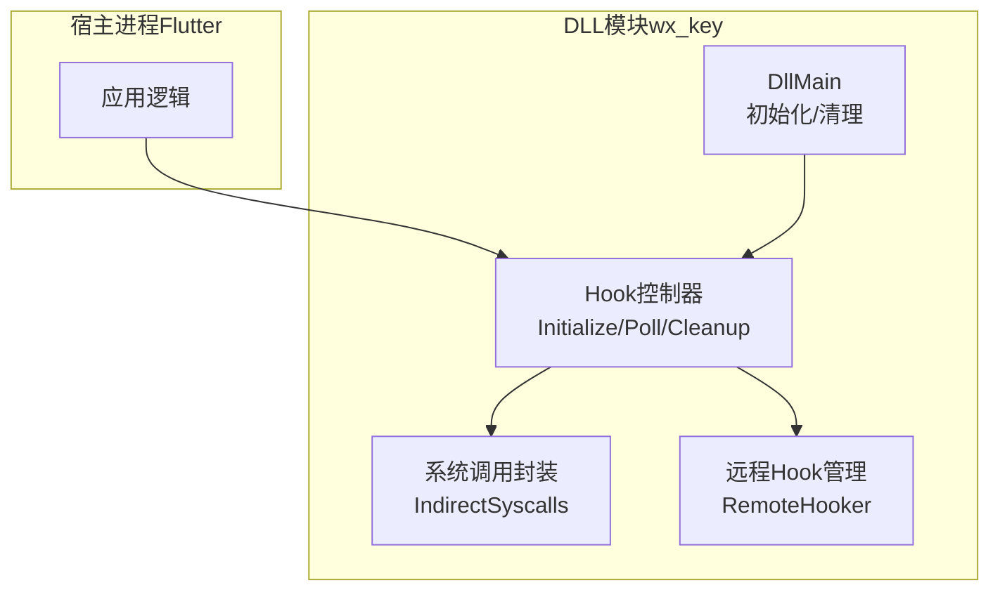
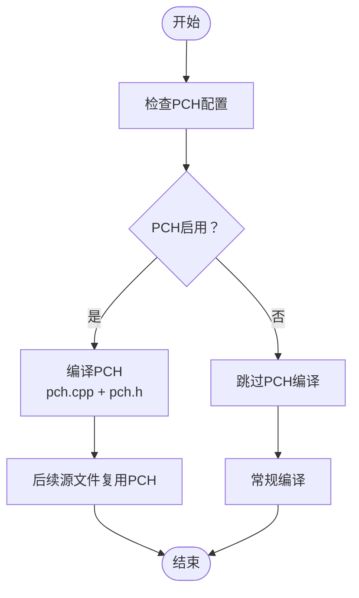
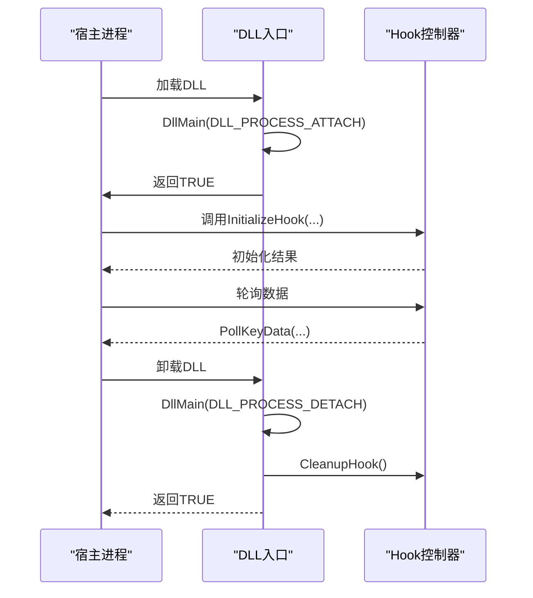
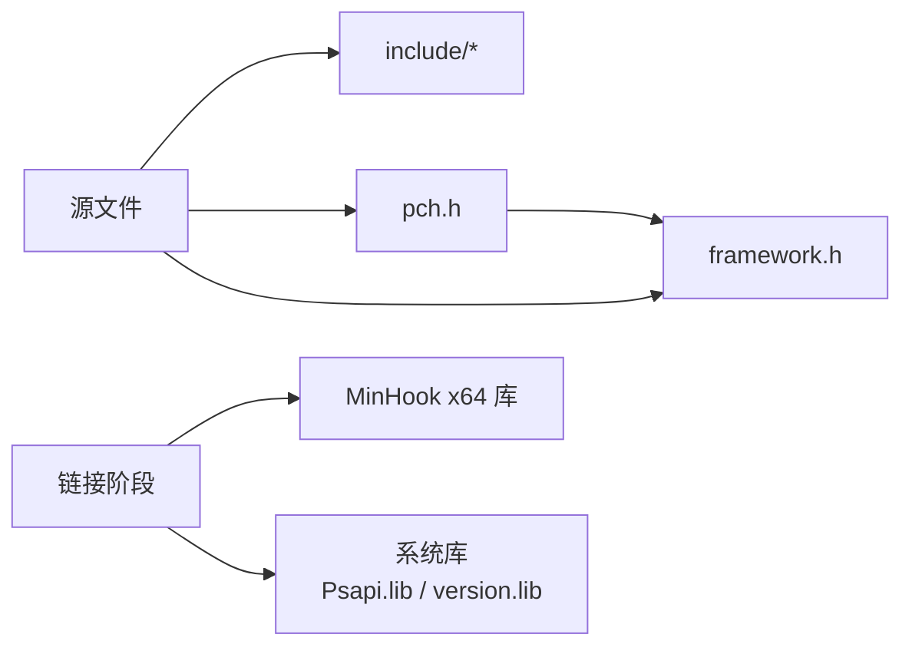
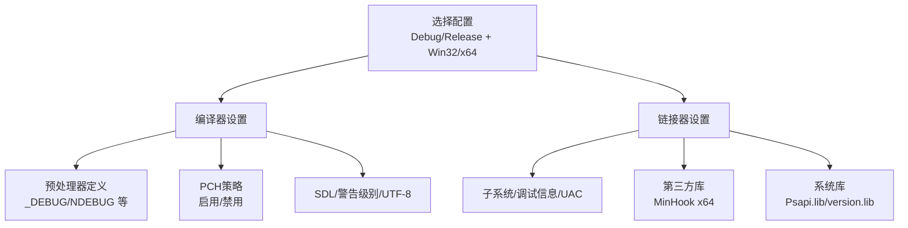

# DLL项目结构与配置

<cite>
**本文档引用的文件**
- [wx_key.vcxproj](file://wx_key/wx_key.vcxproj)
- [wx_key.vcxproj.filters](file://wx_key/wx_key.vcxproj.filters)
- [wx_key.sln](file://wx_key/wx_key.sln)
- [pch.h](file://wx_key/pch.h)
- [pch.cpp](file://wx_key/pch.cpp)
- [framework.h](file://wx_key/framework.h)
- [dllmain.cpp](file://wx_key/dllmain.cpp)
- [hook_controller.h](file://wx_key/include/hook_controller.h)
- [syscalls.h](file://wx_key/include/syscalls.h)
- [remote_hooker.h](file://wx_key/include/remote_hooker.h)
</cite>

## 目录
1. [简介](#简介)
2. [项目结构](#项目结构)
3. [核心组件](#核心组件)
4. [架构总览](#架构总览)
5. [详细组件分析](#详细组件分析)
6. [依赖关系分析](#依赖关系分析)
7. [构建配置详解](#构建配置详解)
8. [性能考虑](#性能考虑)
9. [故障排查指南](#故障排查指南)
10. [结论](#结论)

## 简介
本文件面向Visual Studio中的wx_key DLL项目，系统性梳理其项目文件配置、编译器与链接器设置、预编译头文件策略、构建配置（Debug/Release）差异、输出与中间文件组织方式，并说明第三方库与系统库的链接关系。该DLL在Flutter进程中运行，负责微信远程Hook控制与数据轮询，不直接注入目标进程。

## 项目结构
该项目采用标准的Visual Studio C++动态库工程布局：
- 根目录包含解决方案文件与各平台适配层（Flutter嵌入层），DLL实现位于wx_key子目录
- wx_key目录下包含：
  - 头文件与源文件分层：include/ 与 src/
  - 预编译头：pch.h / pch.cpp
  - 框架头：framework.h（定义WIN32_LEAN_AND_MEAN并包含Windows.h）
  - DLL入口：dllmain.cpp
  - 项目文件：wx_key.vcxproj、wx_key.vcxproj.filters、wx_key.sln

图表来源
- [wx_key.sln](file://wx_key/wx_key.sln#L1-L32)
- [wx_key.vcxproj](file://wx_key/wx_key.vcxproj#L1-L181)
- [wx_key.vcxproj.filters](file://wx_key/wx_key.vcxproj.filters#L1-L85)

章节来源
- [wx_key.sln](file://wx_key/wx_key.sln#L1-L32)
- [wx_key.vcxproj](file://wx_key/wx_key.vcxproj#L1-L181)
- [wx_key.vcxproj.filters](file://wx_key/wx_key.vcxproj.filters#L1-L85)

## 核心组件
- 预编译头（PCH）
  - pch.h：集中包含framework.h等稳定头文件，提升编译速度与IntelliSense性能
  - pch.cpp：空实现文件，配合PCH编译以确保PCH正确生成
- 框架头（framework.h）：定义WIN32_LEAN_AND_MEAN并包含Windows.h，减少不必要的Windows头文件开销
- DLL入口（dllmain.cpp）：实现DllMain，处理DLL_PROCESS_ATTACH/DLL_PROCESS_DETACH，进行必要的初始化与清理
- 导出接口（hook_controller.h）：通过HOOK_EXPORTS宏控制导出/导入，提供InitializeHook、PollKeyData、GetStatusMessage、CleanupHook、GetLastErrorMsg等API

章节来源
- [pch.h](file://wx_key/pch.h#L1-L14)
- [pch.cpp](file://wx_key/pch.cpp#L1-L6)
- [framework.h](file://wx_key/framework.h#L1-L6)
- [dllmain.cpp](file://wx_key/dllmain.cpp#L1-L24)
- [hook_controller.h](file://wx_key/include/hook_controller.h#L1-L50)

## 架构总览
DLL作为独立模块在宿主进程（Flutter）中加载，通过系统调用与内存操作实现对目标进程的扫描与Hook管理，同时提供稳定的C风格导出接口供外部调用。

图表来源
- [dllmain.cpp](file://wx_key/dllmain.cpp#L1-L24)
- [hook_controller.h](file://wx_key/include/hook_controller.h#L1-L50)
- [syscalls.h](file://wx_key/include/syscalls.h#L1-L189)
- [remote_hooker.h](file://wx_key/include/remote_hooker.h#L1-L73)

## 详细组件分析

### 预编译头（PCH）配置与作用
- 作用
  - 将频繁使用的稳定头文件一次性编译，显著缩短后续编译时间
  - 改善IntelliSense性能，提升代码补全与浏览体验
  - 注意：若PCH列表中的文件频繁变更，会导致全量重编，抵消性能收益
- 配置要点
  - pch.h中仅包含稳定头文件（如framework.h）
  - pch.cpp为空实现文件，确保PCH编译成功
  - 项目中针对不同配置启用/禁用PCH，见下文“构建配置详解”

图表来源
- [pch.h](file://wx_key/pch.h#L1-L14)
- [pch.cpp](file://wx_key/pch.cpp#L1-L6)
- [wx_key.vcxproj](file://wx_key/wx_key.vcxproj#L72-L147)

章节来源
- [pch.h](file://wx_key/pch.h#L1-L14)
- [pch.cpp](file://wx_key/pch.cpp#L1-L6)
- [wx_key.vcxproj](file://wx_key/wx_key.vcxproj#L72-L147)

### 框架头（framework.h）
- 定义WIN32_LEAN_AND_MEAN，避免包含大量不常用Windows头文件
- 统一包含Windows.h，保证后续源文件无需重复包含基础系统头

章节来源
- [framework.h](file://wx_key/framework.h#L1-L6)

### DLL入口（dllmain.cpp）
- 实现DllMain，处理DLL_PROCESS_ATTACH时禁用线程库调用（减少TLS开销）
- 处理DLL_PROCESS_DETACH时调用CleanupHook进行资源清理
- 显式链接Psapi.lib与version.lib

图表来源
- [dllmain.cpp](file://wx_key/dllmain.cpp#L1-L24)
- [hook_controller.h](file://wx_key/include/hook_controller.h#L1-L50)

章节来源
- [dllmain.cpp](file://wx_key/dllmain.cpp#L1-L24)

### 导出接口（hook_controller.h）
- 通过HOOK_EXPORTS宏控制导出/导入，统一对外API
- 提供InitializeHook、PollKeyData、GetStatusMessage、CleanupHook、GetLastErrorMsg等接口

章节来源
- [hook_controller.h](file://wx_key/include/hook_controller.h#L1-L50)

### 系统调用封装（syscalls.h）
- 封装NtOpenProcess、NtReadVirtualMemory、NtWriteVirtualMemory、NtAllocateVirtualMemory、NtFreeVirtualMemory、NtProtectVirtualMemory、NtQueryInformationProcess等
- 提供IndirectSyscalls类，动态解析ntdll函数地址并支持SSN直调stub

章节来源
- [syscalls.h](file://wx_key/include/syscalls.h#L1-L189)

### 远程Hook管理（remote_hooker.h）
- RemoteHooker类负责在远程进程安装/卸载Hook，管理Trampoline与Shellcode内存
- 支持硬件断点模式开关，提供跳转指令生成与原指令备份计算

章节来源
- [remote_hooker.h](file://wx_key/include/remote_hooker.h#L1-L73)

## 依赖关系分析
- 第三方库
  - MinHook：x64平台链接libMinHook.x64.lib，位于vendor/MinHook_134_lib/lib
- 系统库
  - Psapi.lib、version.lib：在dllmain.cpp中显式链接
- 头文件依赖
  - pch.h依赖framework.h
  - 各源文件依赖include下的公共头文件

图表来源
- [wx_key.vcxproj](file://wx_key/wx_key.vcxproj#L116-L146)
- [dllmain.cpp](file://wx_key/dllmain.cpp#L8-L9)

章节来源
- [wx_key.vcxproj](file://wx_key/wx_key.vcxproj#L116-L146)
- [dllmain.cpp](file://wx_key/dllmain.cpp#L8-L9)

## 构建配置详解
项目支持Debug与Release两种配置，分别对应Win32与x64平台。以下为关键差异说明：

- 平台工具集与目标类型
  - 工具集：v145
  - 目标类型：DynamicLibrary（DLL）
- 字符集与调试信息
  - Unicode字符集
  - Debug配置启用调试信息；Release配置启用整体程序优化
- 预处理器定义
  - Debug：_DEBUG、WXKEY_EXPORTS、_WINDOWS、_USRDLL等
  - Release：NDEBUG、WXKEY_EXPORTS、_WINDOWS、_USRDLL等
- 预编译头策略
  - Win32 Debug/Release：启用PCH，PCH文件在所有配置中创建
  - x64 Debug/Release：禁用PCH（PrecompiledHeader=NotUsing）
- 编译器选项
  - 启用SDL检查、警告级别Level3
  - 启用函数级链接与内联函数（Release）
  - UTF-8源码编码
- 链接器选项
  - 子系统：Windows
  - UAC：禁用
  - x64 Release：自动附加$(CoreLibraryDependencies)

图表来源
- [wx_key.vcxproj](file://wx_key/wx_key.vcxproj#L29-L147)

章节来源
- [wx_key.vcxproj](file://wx_key/wx_key.vcxproj#L29-L147)

## 性能考虑
- 预编译头
  - 在Win32配置中启用PCH可显著降低编译时间；在x64配置中禁用PCH以避免潜在兼容问题
- 优化选项
  - Release启用函数级链接与内联函数，提升运行时性能
- 头文件稳定性
  - PCH中仅包含稳定头文件，避免频繁重编
- 调试与发布
  - Debug启用调试信息便于定位问题；Release启用整体优化以获得最佳性能

## 故障排查指南
- DLL入口问题
  - 确认DllMain在DLL_PROCESS_ATTACH/DLL_PROCESS_DETACH路径正确执行
  - 确保在DLL_PROCESS_DETACH调用CleanupHook进行资源释放
- 导出符号问题
  - 确认使用HOOK_EXPORTS宏控制导出/导入，避免符号不匹配
- 第三方库链接
  - x64配置需确保MinHook x64库正确链接，库目录与依赖项已配置
- 系统库缺失
  - 确认Psapi.lib与version.lib已链接
- 预编译头问题
  - 若PCH相关编译失败，检查pch.h/pch.cpp是否正确配置，必要时调整PCH策略

章节来源
- [dllmain.cpp](file://wx_key/dllmain.cpp#L1-L24)
- [hook_controller.h](file://wx_key/include/hook_controller.h#L1-L50)
- [wx_key.vcxproj](file://wx_key/wx_key.vcxproj#L116-L146)

## 结论
本DLL项目通过清晰的头文件分层、预编译头策略与严格的Debug/Release配置区分，实现了高效且稳定的构建流程。结合MinHook与系统调用封装，DLL在Flutter进程中提供了可靠的微信远程Hook能力。建议在开发过程中遵循PCH使用规范与优化选项配置，确保编译效率与运行性能的平衡。