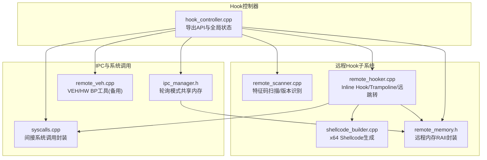
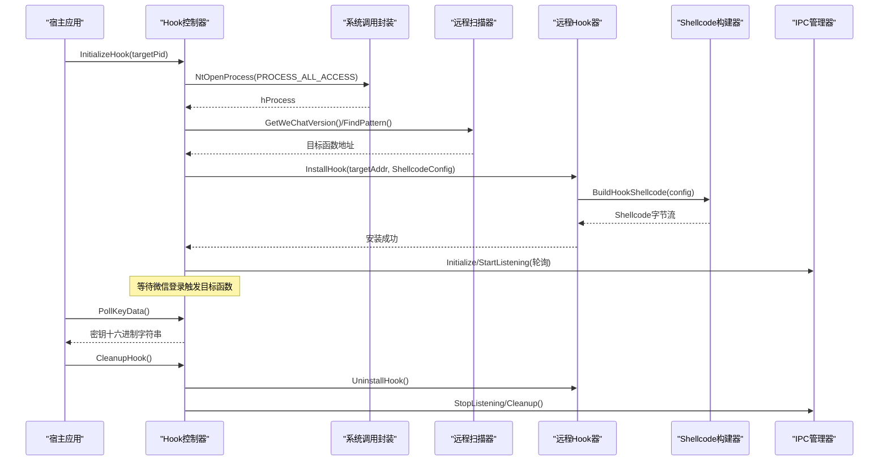
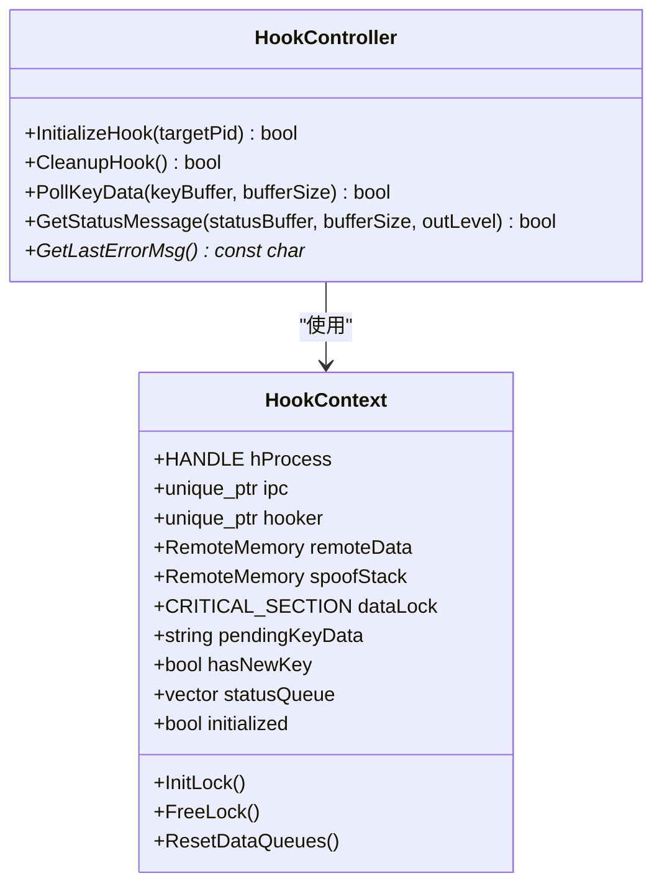
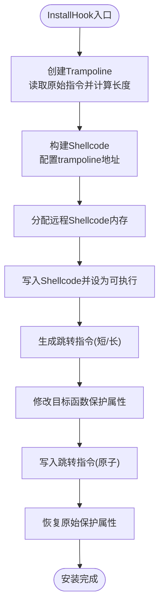
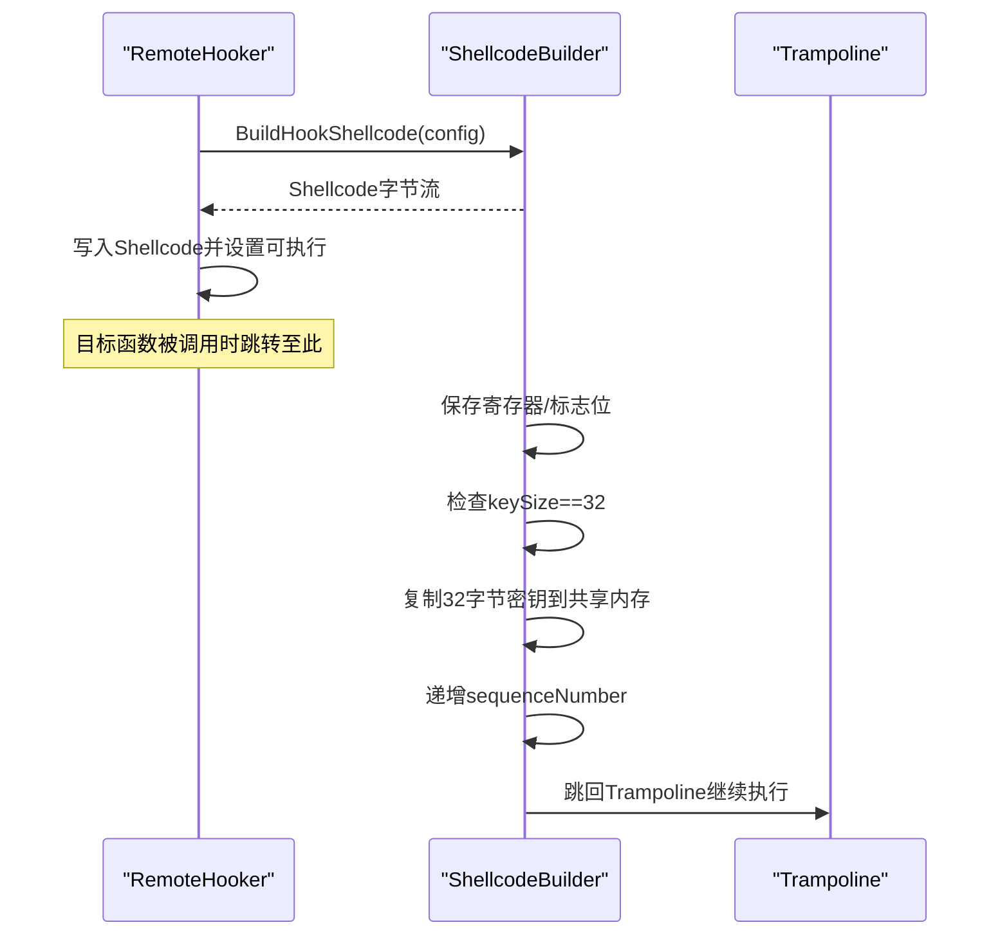
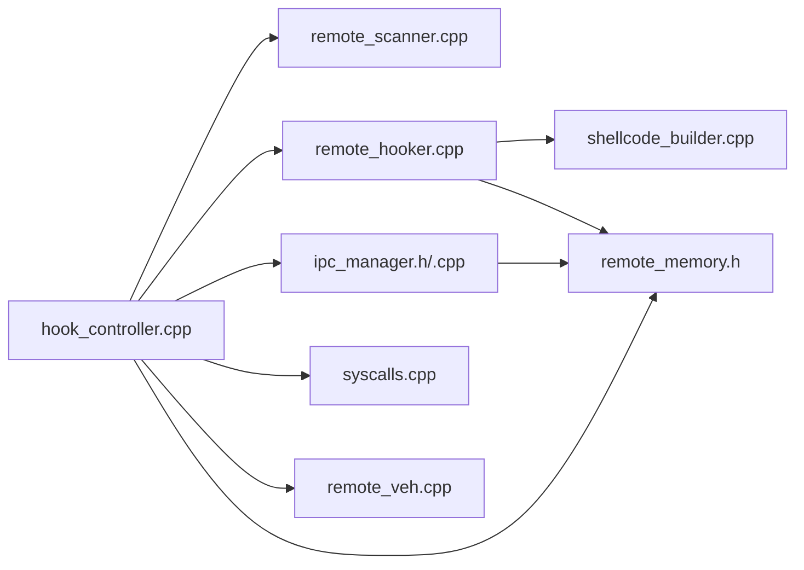

# Hook控制器实现

<cite>
**本文引用的文件**
- [wx_key/include/hook_controller.h](file://wx_key/include/hook_controller.h)
- [wx_key/src/hook_controller.cpp](file://wx_key/src/hook_controller.cpp)
- [wx_key/include/remote_hooker.h](file://wx_key/include/remote_hooker.h)
- [wx_key/src/remote_hooker.cpp](file://wx_key/src/remote_hooker.cpp)
- [wx_key/include/remote_scanner.h](file://wx_key/include/remote_scanner.h)
- [wx_key/include/shellcode_builder.h](file://wx_key/include/shellcode_builder.h)
- [wx_key/src/shellcode_builder.cpp](file://wx_key/src/shellcode_builder.cpp)
- [wx_key/include/remote_memory.h](file://wx_key/include/remote_memory.h)
- [wx_key/include/ipc_manager.h](file://wx_key/include/ipc_manager.h)
- [wx_key/include/syscalls.h](file://wx_key/include/syscalls.h)
- [wx_key/src/syscalls.cpp](file://wx_key/src/syscalls.cpp)
- [wx_key/include/remote_veh.h](file://wx_key/include/remote_veh.h)
- [wx_key/src/remote_veh.cpp](file://wx_key/src/remote_veh.cpp)
</cite>

## 目录
1. [简介](#简介)
2. [项目结构](#项目结构)
3. [核心组件](#核心组件)
4. [架构总览](#架构总览)
5. [详细组件分析](#详细组件分析)
6. [依赖关系分析](#依赖关系分析)
7. [性能考量](#性能考量)
8. [故障排查指南](#故障排查指南)
9. [结论](#结论)
10. [附录：API接口文档](#附录api接口文档)

## 简介
本文件为Hook控制器的技术实现文档，聚焦于以下方面：
- DLL注入与进程交互：进程打开、权限提升与模块加载路径
- 函数拦截机制：Inline Hook、远跳转与简化的x64反汇编
- 数据捕获与处理：密钥提取、缓冲区管理与线程同步
- 状态管理与错误处理：异常捕获与恢复策略
- 完整API接口说明：InitializeHook、CleanupHook、PollKeyData等
- 全局状态设计模式与内存安全考虑

## 项目结构
该仓库采用按功能域分层的组织方式，核心逻辑集中在wx_key目录下，包含头文件与源文件分离的结构。Hook控制器位于wx_key/src/hook_controller.cpp，配合远程扫描、远程Hook、Shellcode生成、IPC通信、系统调用封装、VEH工具等模块协同工作。

图表来源
- [wx_key/src/hook_controller.cpp](file://wx_key/src/hook_controller.cpp#L214-L379)
- [wx_key/src/remote_hooker.cpp](file://wx_key/src/remote_hooker.cpp#L278-L389)
- [wx_key/src/shellcode_builder.cpp](file://wx_key/src/shellcode_builder.cpp#L28-L150)
- [wx_key/src/remote_scanner.cpp](file://wx_key/src/remote_scanner.cpp#L1-L200)
- [wx_key/src/ipc_manager.cpp](file://wx_key/src/ipc_manager.cpp#L1-L200)
- [wx_key/src/syscalls.cpp](file://wx_key/src/syscalls.cpp#L92-L233)
- [wx_key/src/remote_veh.cpp](file://wx_key/src/remote_veh.cpp#L238-L268)

章节来源
- [wx_key/src/hook_controller.cpp](file://wx_key/src/hook_controller.cpp#L1-L491)

## 核心组件
- Hook控制器：提供对外API、全局状态管理、错误消息与状态队列、IPC回调与轮询接口
- 远程Hook器：负责在目标进程内安装Inline Hook，生成Trampoline与远跳转指令
- Shellcode构建器：使用Xbyak生成x64机器码，将密钥写入共享内存并递增序列号
- 远程扫描器：定位Weixin.dll并基于版本配置进行特征码扫描
- IPC管理器：轮询模式下通过共享内存向宿主进程传递密钥数据
- 系统调用封装：间接调用ntdll函数，支持直调stub与SSN提取
- 远程VEH工具：可选的VEH/HW BP方案（当前默认禁用）

章节来源
- [wx_key/include/hook_controller.h](file://wx_key/include/hook_controller.h#L12-L46)
- [wx_key/src/hook_controller.cpp](file://wx_key/src/hook_controller.cpp#L23-L67)
- [wx_key/include/remote_hooker.h](file://wx_key/include/remote_hooker.h#L10-L40)
- [wx_key/include/shellcode_builder.h](file://wx_key/include/shellcode_builder.h#L9-L27)
- [wx_key/include/remote_scanner.h](file://wx_key/include/remote_scanner.h#L16-L35)
- [wx_key/include/ipc_manager.h](file://wx_key/include/ipc_manager.h#L19-L47)
- [wx_key/include/syscalls.h](file://wx_key/include/syscalls.h#L96-L156)
- [wx_key/include/remote_veh.h](file://wx_key/include/remote_veh.h#L8-L26)

## 架构总览
Hook控制器采用“初始化上下文→扫描目标→安装Hook→轮询数据”的主流程。核心要点：
- 进程打开与权限：通过间接系统调用打开目标进程，使用PROCESS_ALL_ACCESS
- 版本识别与特征码：根据WeChat版本选择对应配置，扫描Weixin.dll中的目标函数
- Hook安装：生成Trampoline保存原始指令，写入远跳转至Shellcode，确保最小覆盖长度
- 数据通道：Shellcode将32字节密钥写入共享内存，序列号自增；宿主轮询读取
- 状态与错误：统一的状态消息队列与错误字符串，支持线程安全访问

图表来源
- [wx_key/src/hook_controller.cpp](file://wx_key/src/hook_controller.cpp#L214-L379)
- [wx_key/src/remote_hooker.cpp](file://wx_key/src/remote_hooker.cpp#L278-L389)
- [wx_key/src/shellcode_builder.cpp](file://wx_key/src/shellcode_builder.cpp#L28-L150)
- [wx_key/src/ipc_manager.cpp](file://wx_key/src/ipc_manager.cpp#L1-L200)
- [wx_key/src/syscalls.cpp](file://wx_key/src/syscalls.cpp#L124-L137)

## 详细组件分析

### Hook控制器（全局状态与API）
- 全局状态
  - 进程句柄、IPC与Hooker对象、远程共享内存与伪栈、临界区、待处理密钥与状态队列、初始化标记
  - 线程安全：进入/离开临界区保护状态队列与密钥缓冲
- 初始化流程
  - 初始化系统调用→打开目标进程→版本检测→版本配置→扫描函数→分配远程数据缓冲与伪栈→初始化IPC→创建Hook→安装完成
- 轮询接口
  - PollKeyData：拷贝一次有效密钥后清空标记，保证非阻塞
  - GetStatusMessage：从队列取出一条状态消息，带级别
  - GetLastErrorMsg：最近错误字符串
- 清理流程
  - 卸载Hook→停止IPC→释放远程内存→关闭句柄→清理系统调用

图表来源
- [wx_key/src/hook_controller.cpp](file://wx_key/src/hook_controller.cpp#L23-L67)
- [wx_key/include/hook_controller.h](file://wx_key/include/hook_controller.h#L12-L46)

章节来源
- [wx_key/src/hook_controller.cpp](file://wx_key/src/hook_controller.cpp#L214-L491)
- [wx_key/include/hook_controller.h](file://wx_key/include/hook_controller.h#L12-L46)

### 远程Hook器（Inline Hook与Trampoline）
- 关键职责
  - 在目标进程分配Shellcode与Trampoline内存
  - 读取/写入/保护远程内存
  - 计算最小覆盖长度并生成远跳转指令
  - 安装/卸载Hook（Inline Patch模式）
- 反汇编与跳转
  - 简化版x64反汇编器：识别REX前缀、ModRM、立即数、相对跳转、CALL/JMP等
  - 生成5字节短跳转或14字节长跳转（含mov rax, addr64 + jmp rax）
- 安装流程
  - 读取原始指令→计算长度→创建Trampoline（复制原始指令+回跳）→写入Shellcode→修改目标函数保护→写入跳转→恢复保护
  - 卸载时写回原始指令并释放内存

图表来源
- [wx_key/src/remote_hooker.cpp](file://wx_key/src/remote_hooker.cpp#L182-L195)
- [wx_key/src/remote_hooker.cpp](file://wx_key/src/remote_hooker.cpp#L247-L276)
- [wx_key/src/remote_hooker.cpp](file://wx_key/src/remote_hooker.cpp#L278-L389)

章节来源
- [wx_key/include/remote_hooker.h](file://wx_key/include/remote_hooker.h#L10-L70)
- [wx_key/src/remote_hooker.cpp](file://wx_key/src/remote_hooker.cpp#L1-L419)

### Shellcode构建器（x64机器码）
- 功能
  - 保存/恢复寄存器与标志位
  - 检查keySize=32，复制32字节密钥到共享内存
  - 递增SharedKeyData.sequenceNumber
  - 在启用堆栈伪造时切换到对齐后的伪栈，再跳回Trampoline
- 生成流程
  - 使用Xbyak生成完整机器码，支持条件分支与寄存器操作
  - 输出字节流供RemoteHooker写入目标进程

图表来源
- [wx_key/src/shellcode_builder.cpp](file://wx_key/src/shellcode_builder.cpp#L28-L150)
- [wx_key/include/shellcode_builder.h](file://wx_key/include/shellcode_builder.h#L9-L27)

章节来源
- [wx_key/include/shellcode_builder.h](file://wx_key/include/shellcode_builder.h#L18-L34)
- [wx_key/src/shellcode_builder.cpp](file://wx_key/src/shellcode_builder.cpp#L1-L151)

### 远程扫描器（版本识别与特征码）
- 功能
  - 获取Weixin.dll模块信息
  - 在指定模块中按掩码特征码查找目标地址
  - 读取远程内存并匹配模式
  - 获取WeChat版本号（用于选择版本配置）
- 版本配置
  - VersionConfigManager维护多版本配置，按版本号匹配

章节来源
- [wx_key/include/remote_scanner.h](file://wx_key/include/remote_scanner.h#L16-L66)
- [wx_key/src/remote_scanner.cpp](file://wx_key/src/remote_scanner.cpp#L1-L200)

### IPC管理器（轮询模式）
- 结构
  - SharedKeyData：包含dataSize、keyBuffer[32]、sequenceNumber
- 轮询机制
  - 控制器端分配共享内存，目标进程写入密钥
  - 控制器端启动监听线程，轮询sequenceNumber变化并读取密钥
  - 回调OnDataReceived将密钥转换为十六进制字符串并放入队列

章节来源
- [wx_key/include/ipc_manager.h](file://wx_key/include/ipc_manager.h#L19-L76)
- [wx_key/src/ipc_manager.cpp](file://wx_key/src/ipc_manager.cpp#L1-L200)

### 系统调用封装（间接调用与直调stub）
- 设计
  - 动态解析ntdll函数地址，构建直调stub（mov r10, rcx; mov eax, ssn; syscall; ret）
  - 支持从干净ntdll提取SSN，规避被篡改的ntdll stub
- 用途
  - NtOpenProcess、NtReadVirtualMemory、NtWriteVirtualMemory、NtAllocateVirtualMemory、NtProtectVirtualMemory、NtQueryInformationProcess

章节来源
- [wx_key/include/syscalls.h](file://wx_key/include/syscalls.h#L96-L185)
- [wx_key/src/syscalls.cpp](file://wx_key/src/syscalls.cpp#L92-L278)

### 远程VEH工具（可选方案）
- 功能
  - 在目标进程注册VEH，为所有线程设置硬件断点
  - 构造远程处理器代码，命中断点时将RIP修正为Shellcode并清除陷阱位
  - 提供卸载接口，清理断点与VEH句柄
- 当前状态
  - Hook控制器默认禁用硬件断点+VEH模式，优先使用稳定的Inline Hook

章节来源
- [wx_key/include/remote_veh.h](file://wx_key/include/remote_veh.h#L8-L26)
- [wx_key/src/remote_veh.cpp](file://wx_key/src/remote_veh.cpp#L238-L268)

## 依赖关系分析
- 组件耦合
  - Hook控制器依赖远程扫描器、远程Hook器、IPC管理器、系统调用封装与远程内存
  - 远程Hook器依赖Shellcode构建器与远程内存
  - IPC管理器依赖远程内存与系统调用
- 外部依赖
  - Xbyak用于x64机器码生成
  - Windows API用于进程/线程/内存操作与VEH/HW BP

图表来源
- [wx_key/src/hook_controller.cpp](file://wx_key/src/hook_controller.cpp#L11-L20)
- [wx_key/src/remote_hooker.cpp](file://wx_key/src/remote_hooker.cpp#L1-L6)
- [wx_key/src/shellcode_builder.cpp](file://wx_key/src/shellcode_builder.cpp#L1-L4)
- [wx_key/src/ipc_manager.cpp](file://wx_key/src/ipc_manager.cpp#L1-L200)
- [wx_key/src/syscalls.cpp](file://wx_key/src/syscalls.cpp#L1-L7)
- [wx_key/src/remote_veh.cpp](file://wx_key/src/remote_veh.cpp#L1-L11)

章节来源
- [wx_key/src/hook_controller.cpp](file://wx_key/src/hook_controller.cpp#L1-L20)
- [wx_key/src/remote_hooker.cpp](file://wx_key/src/remote_hooker.cpp#L1-L6)
- [wx_key/src/shellcode_builder.cpp](file://wx_key/src/shellcode_builder.cpp#L1-L4)
- [wx_key/src/ipc_manager.cpp](file://wx_key/src/ipc_manager.cpp#L1-L200)
- [wx_key/src/syscalls.cpp](file://wx_key/src/syscalls.cpp#L1-L7)
- [wx_key/src/remote_veh.cpp](file://wx_key/src/remote_veh.cpp#L1-L11)

## 性能考量
- 远程内存分配与保护
  - 使用NtAllocateVirtualMemory一次性分配，避免频繁调用
  - Shellcode与Trampoline分别设置PAGE_EXECUTE_READ，减少RWX风险
- 轮询效率
  - IPC轮询基于sequenceNumber增量，避免全量读取
  - Hook仅在目标函数被调用时触发，降低CPU占用
- 反汇编与跳转
  - 简化版x64反汇编器快速估算最小覆盖长度，确保跳转指令可容纳
- 线程同步
  - 临界区保护状态队列与密钥缓冲，避免竞争条件

## 故障排查指南
- 常见错误与定位
  - 打开进程失败：检查目标PID是否存在、权限是否足够（PROCESS_ALL_ACCESS）
  - 版本不支持：确认微信版本在支持范围内，或更新版本配置
  - 特征码匹配失败：确认Weixin.dll存在且特征码与掩码正确
  - Hook安装失败：检查目标函数可写性、保护属性变更是否成功
  - IPC轮询无数据：确认共享内存地址设置正确、目标进程确实在写入
- 错误信息
  - GetLastErrorMsg返回最近错误字符串
  - GetStatusMessage返回状态消息与级别（info/success/error）

章节来源
- [wx_key/src/hook_controller.cpp](file://wx_key/src/hook_controller.cpp#L125-L181)
- [wx_key/src/hook_controller.cpp](file://wx_key/src/hook_controller.cpp#L457-L486)

## 结论
Hook控制器通过“远程扫描→Inline Hook→Shellcode写共享内存→轮询读取”的闭环，实现了对微信密钥的安全捕获。其设计强调：
- 明确的模块边界与职责划分
- 线程安全的状态管理与错误传播
- 可靠的远程内存与系统调用封装
- 可扩展的版本配置与可选的VEH/HW BP方案

## 附录API接口文档

- InitializeHook(targetPid)
  - 功能：初始化Hook系统，打开目标进程、扫描函数、安装Hook并启动IPC轮询
  - 参数：targetPid（目标微信进程PID）
  - 返回：true/false
  - 使用示例：调用后等待微信登录触发目标函数，随后轮询密钥

- CleanupHook()
  - 功能：卸载Hook、停止IPC、释放远程内存与句柄
  - 返回：true/false

- PollKeyData(keyBuffer, bufferSize)
  - 功能：轮询获取最新密钥（十六进制字符串，32字节→64字符+终止符）
  - 参数：keyBuffer（输出缓冲区，至少65字节）、bufferSize（缓冲区大小）
  - 返回：有新数据返回true，否则false

- GetStatusMessage(statusBuffer, bufferSize, outLevel)
  - 功能：获取一条状态消息及级别（0=info, 1=success, 2=error）
  - 参数：statusBuffer（输出缓冲区，至少256字节）、bufferSize（缓冲区大小）、outLevel（输出级别）
  - 返回：有新状态返回true，否则false

- GetLastErrorMsg()
  - 功能：获取最近错误信息字符串
  - 返回：错误描述

章节来源
- [wx_key/include/hook_controller.h](file://wx_key/include/hook_controller.h#L12-L46)
- [wx_key/src/hook_controller.cpp](file://wx_key/src/hook_controller.cpp#L414-L491)