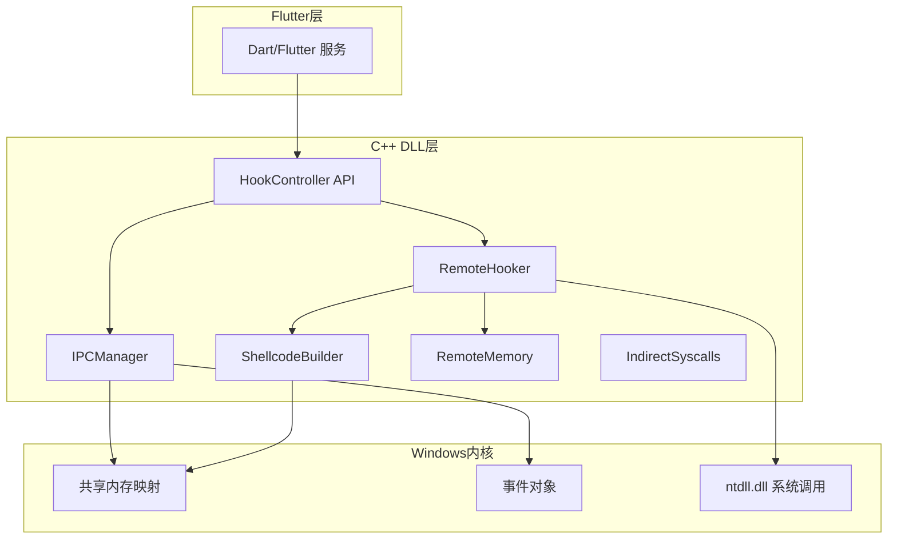
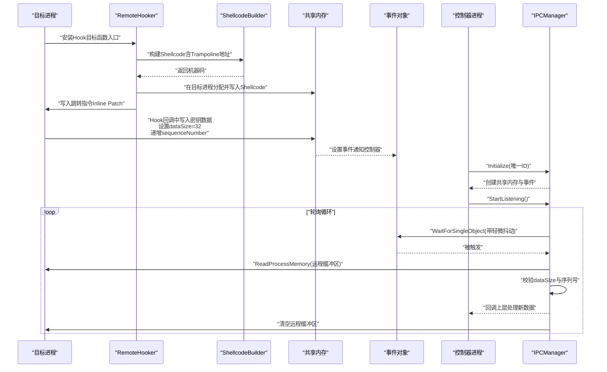
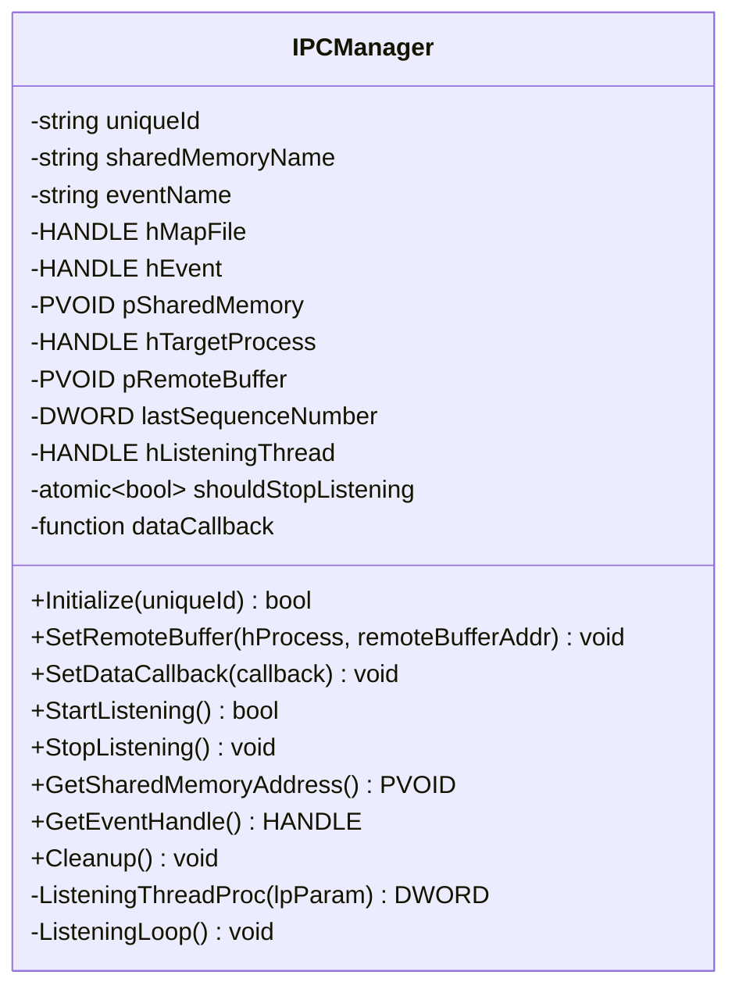
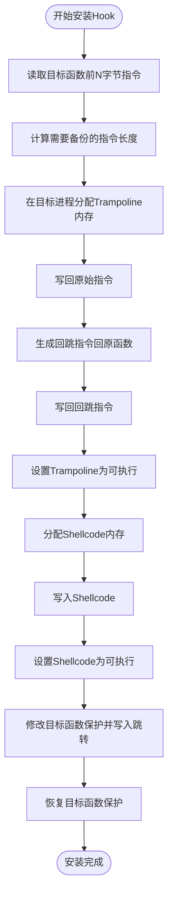
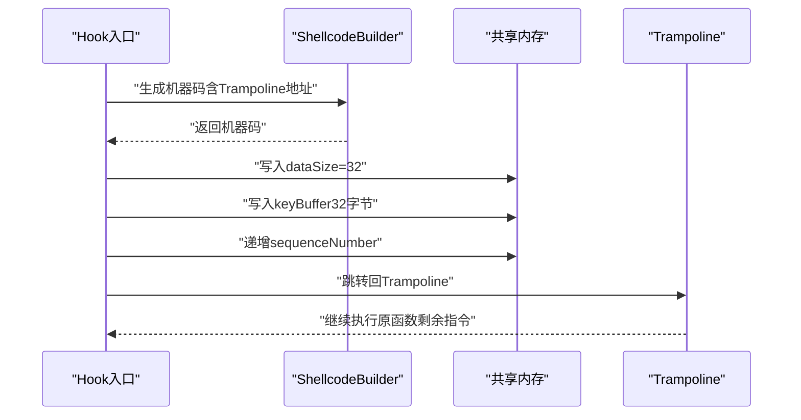
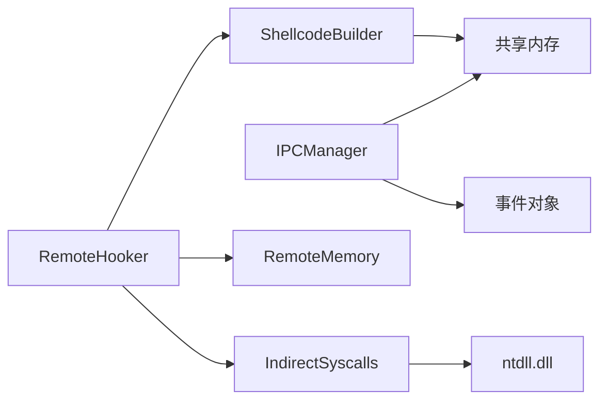

# IPC通信机制

<cite>
**本文引用的文件**
- [ipc_manager.h](file://wx_key/include/ipc_manager.h)
- [ipc_manager.cpp](file://wx_key/src/ipc_manager.cpp)
- [remote_memory.h](file://wx_key/include/remote_memory.h)
- [remote_hooker.h](file://wx_key/include/remote_hooker.h)
- [remote_hooker.cpp](file://wx_key/src/remote_hooker.cpp)
- [syscalls.h](file://wx_key/include/syscalls.h)
- [shellcode_builder.h](file://wx_key/include/shellcode_builder.h)
- [shellcode_builder.cpp](file://wx_key/src/shellcode_builder.cpp)
- [string_obfuscator.h](file://wx_key/include/string_obfuscator.h)
- [veh_hook_manager.h](file://wx_key/include/veh_hook_manager.h)
- [remote_veh.h](file://wx_key/include/remote_veh.h)
- [remote_scanner.h](file://wx_key/include/remote_scanner.h)
- [hook_controller.h](file://wx_key/include/hook_controller.h)
</cite>

## 目录
1. [简介](#简介)
2. [项目结构](#项目结构)
3. [核心组件](#核心组件)
4. [架构总览](#架构总览)
5. [详细组件分析](#详细组件分析)
6. [依赖关系分析](#依赖关系分析)
7. [性能考量](#性能考量)
8. [故障排查指南](#故障排查指南)
9. [结论](#结论)
10. [附录](#附录)

## 简介
本技术文档围绕IPC（进程间通信）机制展开，重点解释以下方面：
- 共享内存管理：内存映射文件创建、句柄传递与同步机制
- 数据序列化与反序列化：结构体打包、字节序与完整性校验
- 安全策略：权限控制、数据验证与防篡改
- 通信协议设计：消息格式、事件通知与状态同步
- API使用示例：初始化、数据发送与接收处理
- 错误处理与重连机制：保证通信稳定性与可靠性

该仓库中与IPC直接相关的核心实现集中在Windows平台，采用共享内存+事件对象的轮询模式进行跨进程数据交换，并通过Shellcode在目标进程内写入共享内存并递增序列号，控制器端通过轮询读取远程缓冲区实现数据采集。

## 项目结构
本项目为多平台Flutter应用，IPC相关逻辑位于C++子项目wx_key中，主要目录如下：
- wx_key/include：头文件，定义IPC、远程内存、系统调用、Shellcode等接口
- wx_key/src：源文件，实现IPC管理器、远程Hook、Shellcode生成等
- assets/dll：导出DLL供上层Flutter/Dart调用
- lib/services：Flutter侧服务封装与调用示例

图表来源
- [hook_controller.h](file://wx_key/include/hook_controller.h#L12-L46)
- [ipc_manager.h](file://wx_key/include/ipc_manager.h#L18-L76)
- [remote_hooker.h](file://wx_key/include/remote_hooker.h#L9-L70)
- [shellcode_builder.h](file://wx_key/include/shellcode_builder.h#L8-L34)
- [remote_memory.h](file://wx_key/include/remote_memory.h#L7-L104)
- [syscalls.h](file://wx_key/include/syscalls.h#L95-L185)

章节来源
- [hook_controller.h](file://wx_key/include/hook_controller.h#L12-L46)
- [ipc_manager.h](file://wx_key/include/ipc_manager.h#L18-L76)
- [remote_hooker.h](file://wx_key/include/remote_hooker.h#L9-L70)
- [shellcode_builder.h](file://wx_key/include/shellcode_builder.h#L8-L34)
- [remote_memory.h](file://wx_key/include/remote_memory.h#L7-L104)
- [syscalls.h](file://wx_key/include/syscalls.h#L95-L185)

## 核心组件
- IPCManager：控制器端IPC管理器，负责共享内存与事件对象的创建、轮询读取远程缓冲区、回调分发
- RemoteHooker：远程Hook管理器，负责在目标进程内分配内存、写入Shellcode、生成Trampoline并安装/卸载Hook
- ShellcodeBuilder：Shellcode构建器，基于Xbyak生成x64机器码，将密钥写入共享内存并递增序列号
- RemoteMemory：远程内存RAII封装，使用间接系统调用进行分配/保护/释放
- IndirectSyscalls：间接系统调用封装，避免静态导入ntdll符号
- StringObfuscator：编译期字符串混淆，降低静态特征
- VehHookManager/RemoteVeh：硬件断点+VEH管理（当前进程多线程遍历）

章节来源
- [ipc_manager.h](file://wx_key/include/ipc_manager.h#L18-L76)
- [remote_hooker.h](file://wx_key/include/remote_hooker.h#L9-L70)
- [shellcode_builder.h](file://wx_key/include/shellcode_builder.h#L8-L34)
- [remote_memory.h](file://wx_key/include/remote_memory.h#L7-L104)
- [syscalls.h](file://wx_key/include/syscalls.h#L95-L185)
- [string_obfuscator.h](file://wx_key/include/string_obfuscator.h#L7-L61)
- [veh_hook_manager.h](file://wx_key/include/veh_hook_manager.h#L9-L30)
- [remote_veh.h](file://wx_key/include/remote_veh.h#L8-L26)

## 架构总览
IPC采用“目标进程写入+控制器轮询”的双阶段模型：
- 目标进程：在Hook回调中将密钥数据写入共享内存，递增序列号，触发事件
- 控制器进程：创建共享内存与事件，启动监听线程轮询远程缓冲区，收到新数据后回调上层

图表来源
- [ipc_manager.cpp](file://wx_key/src/ipc_manager.cpp#L206-L271)
- [remote_hooker.cpp](file://wx_key/src/remote_hooker.cpp#L278-L389)
- [shellcode_builder.cpp](file://wx_key/src/shellcode_builder.cpp#L28-L150)
- [syscalls.h](file://wx_key/include/syscalls.h#L63-L85)

章节来源
- [ipc_manager.cpp](file://wx_key/src/ipc_manager.cpp#L206-L271)
- [remote_hooker.cpp](file://wx_key/src/remote_hooker.cpp#L278-L389)
- [shellcode_builder.cpp](file://wx_key/src/shellcode_builder.cpp#L28-L150)
- [syscalls.h](file://wx_key/include/syscalls.h#L63-L85)

## 详细组件分析

### IPCManager：共享内存与轮询监听
- 共享内存与事件创建：使用CreateFileMappingA与MapViewOfFile创建固定大小的共享区域；使用CreateEventA创建手动重置事件
- 名称安全：通过字符串混淆与唯一ID拼接，必要时降级至Local作用域以规避权限问题
- 轮询监听：监听线程WaitForSingleObject等待事件，结合轻微抖动避免稳定特征；从远程进程读取SharedKeyData，校验dataSize与序列号，回调上层并清空远程缓冲区
- 资源清理：UnmapViewOfFile/CloseHandle，停止监听线程并等待退出

图表来源
- [ipc_manager.h](file://wx_key/include/ipc_manager.h#L18-L76)
- [ipc_manager.cpp](file://wx_key/src/ipc_manager.cpp#L8-L273)

章节来源
- [ipc_manager.h](file://wx_key/include/ipc_manager.h#L18-L76)
- [ipc_manager.cpp](file://wx_key/src/ipc_manager.cpp#L24-L132)
- [ipc_manager.cpp](file://wx_key/src/ipc_manager.cpp#L163-L196)
- [ipc_manager.cpp](file://wx_key/src/ipc_manager.cpp#L206-L271)

### RemoteHooker：远程Hook与Trampoline
- Trampoline生成：读取目标函数前若干字节指令，分配可执行内存，写回原始指令并附加回跳指令
- Shellcode注入：分配可执行内存，写入Shellcode，修改目标函数保护属性写入跳转指令，恢复保护
- 远程内存操作：通过间接系统调用完成读写/保护，避免静态导入
- 资源管理：RemoteMemory RAII封装，自动释放

图表来源
- [remote_hooker.cpp](file://wx_key/src/remote_hooker.cpp#L197-L245)
- [remote_hooker.cpp](file://wx_key/src/remote_hooker.cpp#L278-L389)
- [remote_memory.h](file://wx_key/include/remote_memory.h#L34-L89)

章节来源
- [remote_hooker.h](file://wx_key/include/remote_hooker.h#L9-L70)
- [remote_hooker.cpp](file://wx_key/src/remote_hooker.cpp#L197-L245)
- [remote_hooker.cpp](file://wx_key/src/remote_hooker.cpp#L278-L389)
- [remote_memory.h](file://wx_key/include/remote_memory.h#L34-L89)

### ShellcodeBuilder：x64机器码生成
- 寄存器保存/恢复：完整保存通用寄存器与标志位，确保Hook不破坏调用约定
- 数据拷贝：将密钥缓冲区复制到共享内存，设置dataSize=32
- 序列号递增：读取并递增sequenceNumber，便于控制器识别新数据
- 堆栈伪造（可选）：在启用时切换到对齐的伪栈，保留真实RSP以便恢复
- 回跳Trampoline：最终跳转回原始函数继续执行

图表来源
- [shellcode_builder.cpp](file://wx_key/src/shellcode_builder.cpp#L28-L150)
- [shellcode_builder.h](file://wx_key/include/shellcode_builder.h#L8-L34)

章节来源
- [shellcode_builder.h](file://wx_key/include/shellcode_builder.h#L8-L34)
- [shellcode_builder.cpp](file://wx_key/src/shellcode_builder.cpp#L28-L150)

### RemoteMemory：远程内存RAII
- 分配：使用NtAllocateVirtualMemory在目标进程保留并提交内存
- 保护：NtProtectVirtualMemory动态调整访问权限
- 释放：NtFreeVirtualMemory释放内存
- 移动语义：支持移动构造与赋值，避免重复释放

章节来源
- [remote_memory.h](file://wx_key/include/remote_memory.h#L7-L104)

### IndirectSyscalls：间接系统调用
- 动态解析：从ntdll解析函数地址，避免硬编码导入
- SSN直调：提取系统调用号并生成直调桩，降低检测风险
- 封装接口：统一提供Open/Read/Write/Alloc/Protect/Query等接口

章节来源
- [syscalls.h](file://wx_key/include/syscalls.h#L95-L185)

### StringObfuscator：字符串混淆
- 编译期XOR加密：通过模板在编译时加密，运行时解密
- 常用名称：共享内存名、事件名、模块名等均采用混淆形式

章节来源
- [string_obfuscator.h](file://wx_key/include/string_obfuscator.h#L7-L61)

### VehHookManager/RemoteVeh：硬件断点与VEH
- 硬件断点：在指定地址设置硬件断点，触发异常
- VEH注册：注册VEH处理器，遍历当前进程所有线程设置硬件断点
- 远程VEH：在远程进程注册VEH并写入处理代码，返回卸载所需句柄与地址

章节来源
- [veh_hook_manager.h](file://wx_key/include/veh_hook_manager.h#L9-L30)
- [remote_veh.h](file://wx_key/include/remote_veh.h#L8-L26)

## 依赖关系分析
- 组件耦合
  - IPCManager依赖事件与共享内存，负责轮询与回调
  - RemoteHooker依赖ShellcodeBuilder与RemoteMemory，负责Hook安装与内存管理
  - ShellcodeBuilder依赖IPC共享数据布局（SharedKeyData）
  - RemoteHooker/ShellcodeBuilder依赖IndirectSyscalls进行远程内存操作
- 外部依赖
  - Windows内核API：CreateFileMappingA/MapViewOfFile/CreateEventA等
  - ntdll系统调用：NtAllocateVirtualMemory/NtProtectVirtualMemory等
  - 第三方库：Xbyak用于x64机器码生成

图表来源
- [ipc_manager.h](file://wx_key/include/ipc_manager.h#L18-L76)
- [remote_hooker.h](file://wx_key/include/remote_hooker.h#L9-L70)
- [shellcode_builder.h](file://wx_key/include/shellcode_builder.h#L8-L34)
- [remote_memory.h](file://wx_key/include/remote_memory.h#L7-L104)
- [syscalls.h](file://wx_key/include/syscalls.h#L95-L185)

章节来源
- [ipc_manager.h](file://wx_key/include/ipc_manager.h#L18-L76)
- [remote_hooker.h](file://wx_key/include/remote_hooker.h#L9-L70)
- [shellcode_builder.h](file://wx_key/include/shellcode_builder.h#L8-L34)
- [remote_memory.h](file://wx_key/include/remote_memory.h#L7-L104)
- [syscalls.h](file://wx_key/include/syscalls.h#L95-L185)

## 性能考量
- 轮询抖动：监听线程等待时间加入轻微抖动，避免被检测为稳定周期
- 最小化远程读写：仅在有事件触发时读取远程缓冲区，减少不必要的ReadProcessMemory调用
- Shellcode尺寸：严格控制机器码长度，确保能覆盖目标函数的最小补丁长度
- 内存保护切换：在写入跳转指令前后进行保护切换，尽量缩短临界区

## 故障排查指南
- 初始化失败
  - 检查权限：若CreateFileMappingA/CreateEventA返回访问拒绝，尝试降级至Local作用域
  - 名称冲突：确保唯一ID与GUID占位符替换正确
- 轮询无数据
  - 确认事件已触发：控制器端WaitForSingleObject是否被唤醒
  - 校验条件：dataSize必须为32且序列号变化，且非零
  - 清空远程缓冲区：读取后会清空，避免重复消费
- Hook安装失败
  - 检查目标函数可写性与保护切换是否成功
  - 确认原始指令长度计算正确，补丁长度足够
- 远程内存操作失败
  - 使用IndirectSyscalls封装的NtReadVirtualMemory/NtWriteVirtualMemory进行诊断
  - 确认目标进程句柄有效且具有相应权限

章节来源
- [ipc_manager.cpp](file://wx_key/src/ipc_manager.cpp#L113-L131)
- [ipc_manager.cpp](file://wx_key/src/ipc_manager.cpp#L212-L271)
- [remote_hooker.cpp](file://wx_key/src/remote_hooker.cpp#L358-L388)
- [syscalls.h](file://wx_key/include/syscalls.h#L109-L123)

## 结论
该IPC机制通过共享内存+事件对象实现跨进程数据交换，配合Shellcode在目标进程内写入数据并递增序列号，控制器端通过轮询读取实现可靠的数据采集。系统在安全性方面采用字符串混淆、间接系统调用与硬件断点/VEH等多种手段降低检测风险。整体设计在功能完备性与隐蔽性之间取得平衡，适合在受控环境下进行数据采集与状态同步。

## 附录

### 数据结构与序列化
- 共享数据结构：SharedKeyData包含dataSize、keyBuffer与sequenceNumber
- 序列化流程：Shellcode将密钥缓冲区按顺序写入共享内存，设置dataSize=32，递增sequenceNumber
- 反序列化流程：控制器端读取远程缓冲区，校验dataSize与序列号，回调上层处理

章节来源
- [ipc_manager.h](file://wx_key/include/ipc_manager.h#L10-L16)
- [shellcode_builder.cpp](file://wx_key/src/shellcode_builder.cpp#L116-L131)
- [ipc_manager.cpp](file://wx_key/src/ipc_manager.cpp#L242-L269)

### 安全策略
- 权限控制：优先使用全局命名对象，失败时降级至Local作用域
- 数据验证：严格校验dataSize范围与序列号变化
- 防篡改：通过序列号识别新数据，清空远程缓冲区避免重复消费
- 隐蔽性：字符串混淆、间接系统调用、硬件断点/VEH组合

章节来源
- [string_obfuscator.h](file://wx_key/include/string_obfuscator.h#L42-L58)
- [ipc_manager.cpp](file://wx_key/src/ipc_manager.cpp#L113-L131)
- [ipc_manager.cpp](file://wx_key/src/ipc_manager.cpp#L244-L247)

### 通信协议设计
- 消息格式：固定大小的SharedKeyData，包含密钥缓冲区与序列号
- 事件通知：目标进程写入共享内存后设置事件，控制器端WaitForSingleObject响应
- 状态同步：通过sequenceNumber实现去重与顺序控制

章节来源
- [ipc_manager.h](file://wx_key/include/ipc_manager.h#L10-L16)
- [ipc_manager.cpp](file://wx_key/src/ipc_manager.cpp#L81-L95)
- [ipc_manager.cpp](file://wx_key/src/ipc_manager.cpp#L214-L223)

### API使用示例（路径指引）
- 初始化与Hook安装
  - 参考：[hook_controller.h](file://wx_key/include/hook_controller.h#L17-L17)
  - 实现参考：[remote_hooker.cpp](file://wx_key/src/remote_hooker.cpp#L278-L389)
- IPC初始化与监听
  - 参考：[ipc_manager.h](file://wx_key/include/ipc_manager.h#L24-L40)
  - 实现参考：[ipc_manager.cpp](file://wx_key/src/ipc_manager.cpp#L24-L132), [ipc_manager.cpp](file://wx_key/src/ipc_manager.cpp#L163-L196)
- 数据接收回调
  - 参考：[ipc_manager.h](file://wx_key/include/ipc_manager.h#L34-L34)
  - 实现参考：[ipc_manager.cpp](file://wx_key/src/ipc_manager.cpp#L252-L255)
- 清理资源
  - 参考：[ipc_manager.h](file://wx_key/include/ipc_manager.h#L30-L31)
  - 实现参考：[ipc_manager.cpp](file://wx_key/src/ipc_manager.cpp#L140-L157)

### 错误处理与重连机制
- 错误处理
  - 初始化失败：记录并返回错误码，必要时降级命名空间
  - 轮询失败：检查事件状态与远程读取结果
  - Hook失败：检查保护切换与写入长度
- 重连机制
  - 监听线程退出后可重新StartListening
  - IPCManager提供Cleanup以释放资源，支持重新初始化

章节来源
- [ipc_manager.cpp](file://wx_key/src/ipc_manager.cpp#L117-L131)
- [ipc_manager.cpp](file://wx_key/src/ipc_manager.cpp#L184-L196)
- [ipc_manager.cpp](file://wx_key/src/ipc_manager.cpp#L140-L157)