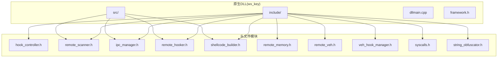
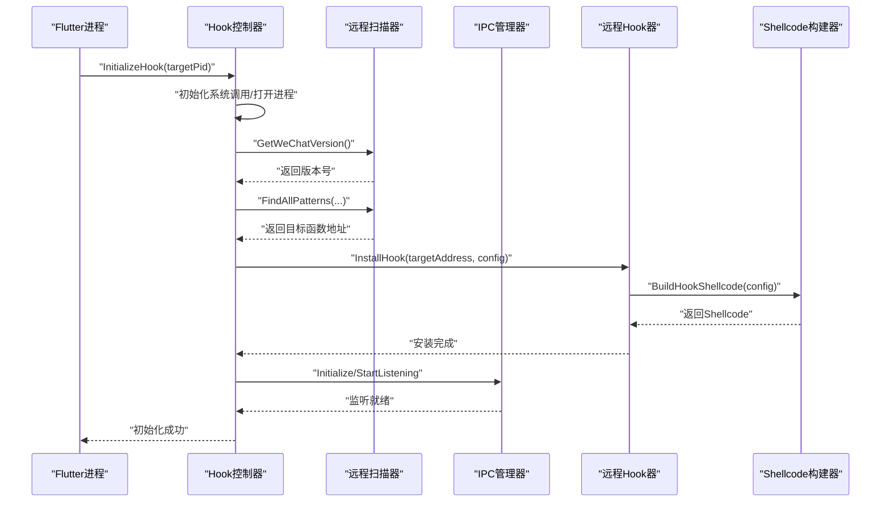
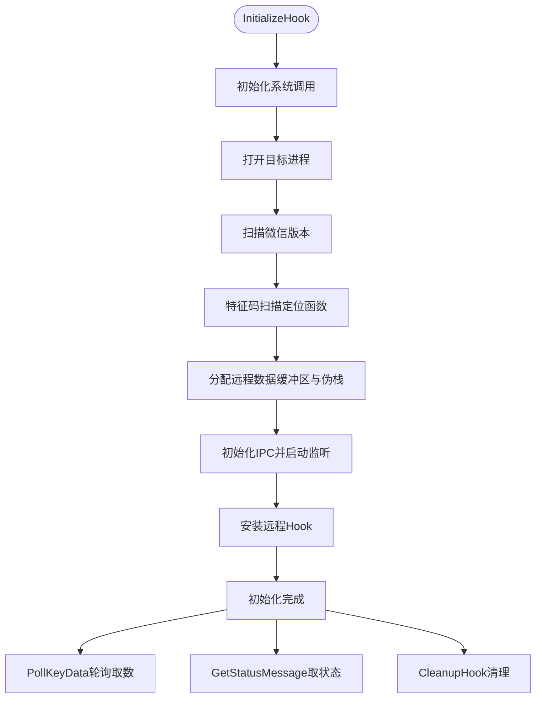
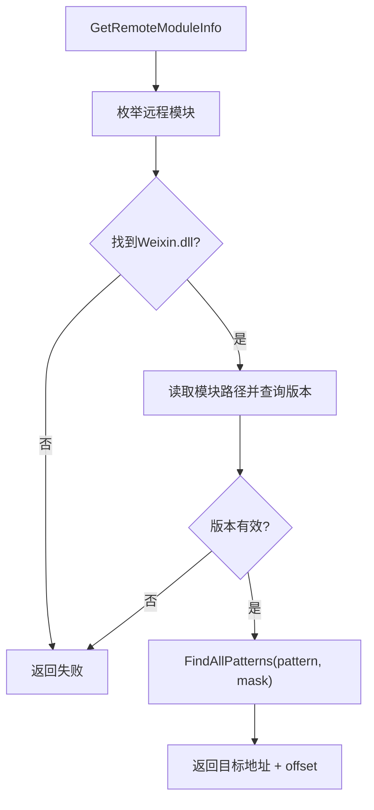
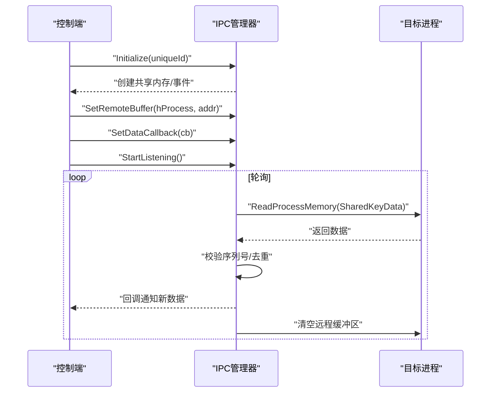
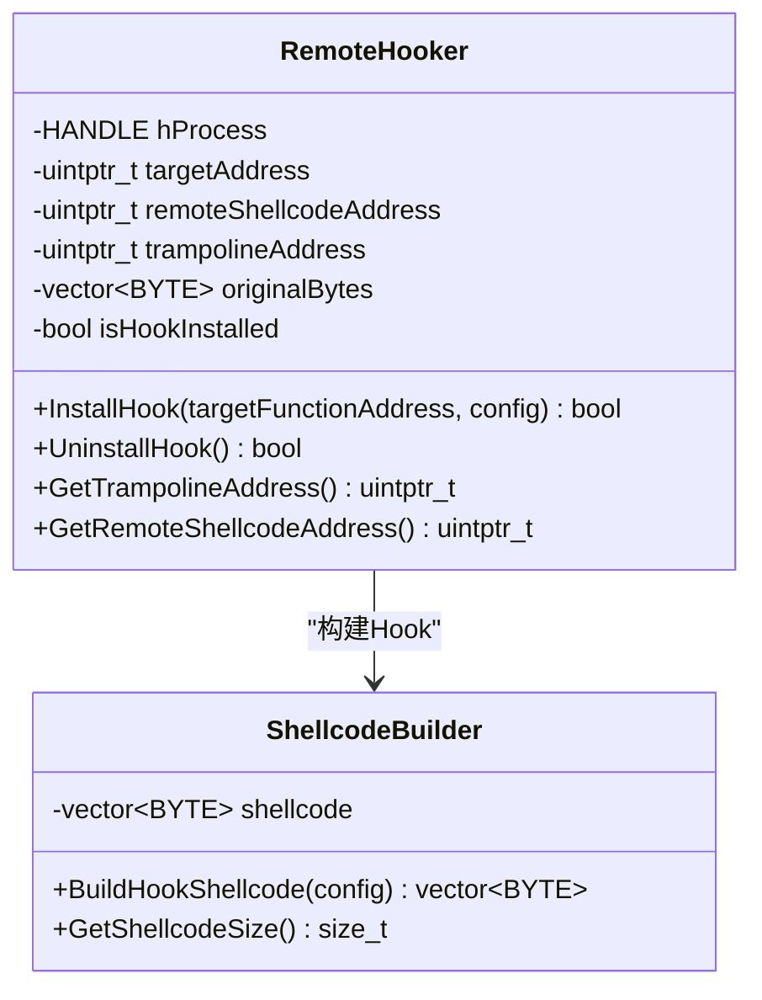
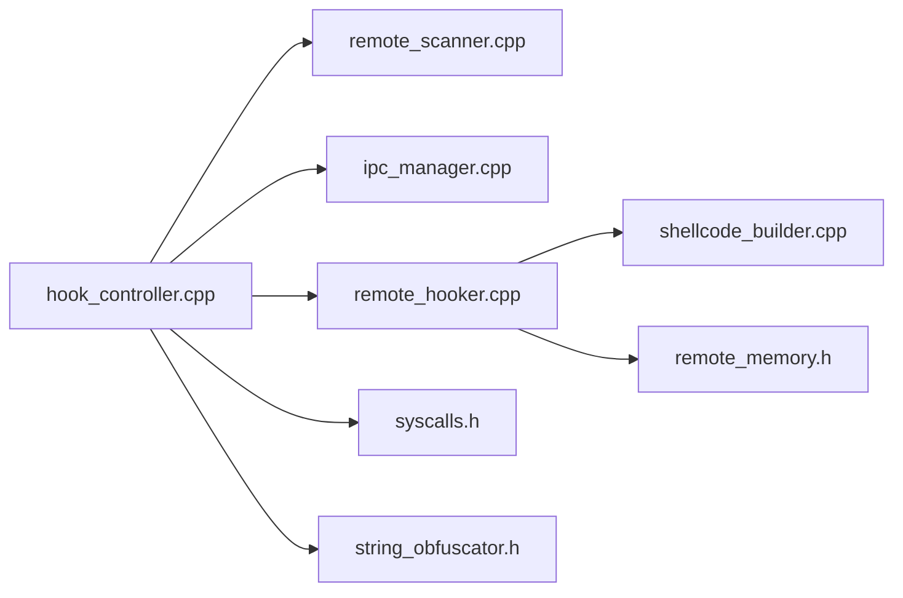

# 原生DLL开发

<cite>
**本文引用的文件**
- [dllmain.cpp](file://wx_key/dllmain.cpp)
- [framework.h](file://wx_key/framework.h)
- [hook_controller.h](file://wx_key/include/hook_controller.h)
- [hook_controller.cpp](file://wx_key/src/hook_controller.cpp)
- [remote_scanner.h](file://wx_key/include/remote_scanner.h)
- [remote_scanner.cpp](file://wx_key/src/remote_scanner.cpp)
- [ipc_manager.h](file://wx_key/include/ipc_manager.h)
- [ipc_manager.cpp](file://wx_key/src/ipc_manager.cpp)
- [remote_hooker.h](file://wx_key/include/remote_hooker.h)
- [remote_hooker.cpp](file://wx_key/src/remote_hooker.cpp)
- [shellcode_builder.h](file://wx_key/include/shellcode_builder.h)
- [shellcode_builder.cpp](file://wx_key/src/shellcode_builder.cpp)
- [remote_memory.h](file://wx_key/include/remote_memory.h)
- [remote_veh.h](file://wx_key/include/remote_veh.h)
- [veh_hook_manager.h](file://wx_key/include/veh_hook_manager.h)
- [syscalls.h](file://wx_key/include/syscalls.h)
- [string_obfuscator.h](file://wx_key/include/string_obfuscator.h)
- [wx_key.vcxproj](file://wx_key/wx_key.vcxproj)
- [wx_key.vcxproj.filters](file://wx_key/wx_key.vcxproj.filters)
- [wx_key.sln](file://wx_key/wx_key.sln)
- [dll_usage.md](file://docs/dll_usage.md)
</cite>

## 目录
1. [简介](#简介)
2. [项目结构](#项目结构)
3. [核心组件](#核心组件)
4. [架构总览](#架构总览)
5. [组件详解](#组件详解)
6. [依赖关系分析](#依赖关系分析)
7. [性能考量](#性能考量)
8. [故障排查指南](#故障排查指南)
9. [结论](#结论)
10. [附录](#附录)

## 简介
本项目为wx_key的原生DLL开发，目标是在Flutter进程中作为控制端，对目标微信进程进行远程Hook，捕获密钥数据并通过共享内存+轮询的方式回传至控制端。系统采用“特征码扫描定位目标函数 → 远程分配内存与Trampoline → 生成并写入Hook Shellcode → 通过共享内存回传数据”的完整链路，同时提供状态消息与错误信息的统一上报机制。

## 项目结构
仓库采用按语言与功能分层的组织方式：
- 头文件集中于wx_key/include，按职责拆分为Hook控制器、远程扫描器、IPC管理、远程Hook器、Shellcode构建器、远程内存管理等模块。
- 源文件集中于wx_key/src，对应各头文件的实现。
- 根目录提供跨平台Flutter应用与文档；原生DLL位于wx_key目录下，包含Visual Studio工程文件与预编译头。
- assets/dll目录包含已编译的wx_key.dll，供上层Flutter应用加载使用。

图表来源
- [hook_controller.h](file://wx_key/include/hook_controller.h#L1-L50)
- [remote_scanner.h](file://wx_key/include/remote_scanner.h#L1-L70)
- [ipc_manager.h](file://wx_key/include/ipc_manager.h#L1-L80)
- [remote_hooker.h](file://wx_key/include/remote_hooker.h#L1-L73)
- [shellcode_builder.h](file://wx_key/include/shellcode_builder.h#L1-L38)
- [remote_memory.h](file://wx_key/include/remote_memory.h#L1-L107)
- [remote_veh.h](file://wx_key/include/remote_veh.h#L1-L29)
- [veh_hook_manager.h](file://wx_key/include/veh_hook_manager.h#L1-L33)
- [syscalls.h](file://wx_key/include/syscalls.h)
- [string_obfuscator.h](file://wx_key/include/string_obfuscator.h)

章节来源
- [wx_key.vcxproj](file://wx_key/wx_key.vcxproj)
- [wx_key.vcxproj.filters](file://wx_key/wx_key.vcxproj.filters)
- [wx_key.sln](file://wx_key/wx_key.sln)

## 核心组件
- Hook控制器：对外提供初始化、轮询取数、状态查询、清理等导出函数，协调远程扫描、Hook安装、IPC监听与数据回传。
- 远程扫描器：在目标进程枚举模块、读取版本、基于特征码掩码扫描定位目标函数地址。
- IPC管理器：创建共享内存与事件，启动监听线程轮询远程缓冲区，回调通知控制端新数据。
- 远程Hook器：在目标进程分配Trampoline与Shellcode，写入补丁跳转，恢复保护，支持回滚卸载。
- Shellcode构建器：使用Xbyak生成x64机器码，完成密钥拷贝、序列号递增与回跳Trampoline。
- 远程内存管理：封装NtAllocateVirtualMemory/NtFreeVirtualMemory/NtProtectVirtualMemory，提供RAII语义。
- 系统调用与字符串混淆：间接系统调用与字符串混淆工具，提升隐蔽性。

章节来源
- [hook_controller.h](file://wx_key/include/hook_controller.h#L12-L46)
- [hook_controller.cpp](file://wx_key/src/hook_controller.cpp#L414-L491)
- [remote_scanner.h](file://wx_key/include/remote_scanner.h#L15-L44)
- [ipc_manager.h](file://wx_key/include/ipc_manager.h#L18-L76)
- [remote_hooker.h](file://wx_key/include/remote_hooker.h#L9-L70)
- [shellcode_builder.h](file://wx_key/include/shellcode_builder.h#L8-L34)
- [remote_memory.h](file://wx_key/include/remote_memory.h#L7-L104)
- [syscalls.h](file://wx_key/include/syscalls.h)
- [string_obfuscator.h](file://wx_key/include/string_obfuscator.h)

## 架构总览
系统工作流分为“控制端初始化”和“目标进程Hook执行”两部分：
- 控制端：加载DLL，调用初始化函数，内部完成系统调用初始化、打开目标进程、版本识别、特征码扫描、远程内存分配、IPC初始化与监听、安装Hook。
- 目标进程：当目标函数被调用时，执行Hook Shellcode，将密钥写入共享内存并递增序列号，随后跳回Trampoline继续执行原逻辑。

图表来源
- [hook_controller.cpp](file://wx_key/src/hook_controller.cpp#L214-L379)
- [remote_scanner.cpp](file://wx_key/src/remote_scanner.cpp#L219-L259)
- [ipc_manager.cpp](file://wx_key/src/ipc_manager.cpp#L163-L182)
- [remote_hooker.cpp](file://wx_key/src/remote_hooker.cpp#L278-L389)
- [shellcode_builder.cpp](file://wx_key/src/shellcode_builder.cpp#L28-L149)

## 组件详解

### Hook控制器
- 导出函数
  - InitializeHook：初始化并安装Hook（轮询模式）。
  - PollKeyData：轮询获取最新密钥十六进制字符串。
  - GetStatusMessage：获取状态消息与级别。
  - CleanupHook：清理并卸载Hook。
  - GetLastErrorMsg：获取最后错误信息。
- 关键流程
  - 初始化阶段：系统调用初始化、打开目标进程、版本识别、特征码扫描、远程内存分配、IPC初始化与监听、安装Hook。
  - 数据回传：目标进程触发Hook后，Shellcode写入共享内存并递增序列号，控制端轮询读取并回调。
  - 状态与错误：统一通过队列上报，支持级别区分。

图表来源
- [hook_controller.cpp](file://wx_key/src/hook_controller.cpp#L214-L379)
- [hook_controller.h](file://wx_key/include/hook_controller.h#L12-L46)

章节来源
- [hook_controller.h](file://wx_key/include/hook_controller.h#L12-L46)
- [hook_controller.cpp](file://wx_key/src/hook_controller.cpp#L414-L491)

### 远程扫描器
- 功能要点
  - 获取远程模块信息（Weixin.dll）。
  - 读取远程进程版本信息（文件版本）。
  - 基于特征码与掩码进行扫描，支持分块读取与本地匹配，提高性能。
  - 版本配置管理：根据版本选择不同特征码与偏移。
- 性能特性
  - 本地缓冲区分块读取，避免频繁系统调用。
  - 掩码支持通配，增强稳定性。

图表来源
- [remote_scanner.cpp](file://wx_key/src/remote_scanner.cpp#L119-L259)
- [remote_scanner.h](file://wx_key/include/remote_scanner.h#L15-L44)

章节来源
- [remote_scanner.h](file://wx_key/include/remote_scanner.h#L15-L44)
- [remote_scanner.cpp](file://wx_key/src/remote_scanner.cpp#L119-L259)

### IPC管理器（共享内存+轮询）
- 数据结构
  - SharedKeyData：包含数据大小、密钥缓冲区、序列号。
- 工作机制
  - 控制端创建共享内存与事件，生成唯一名称，必要时降级为Local命名空间。
  - 监听线程周期性轮询远程缓冲区，通过序列号去重，读取后清空远程缓冲区。
  - 提供回调接口，将新数据传递给上层处理。
- 安全与兼容
  - 名称混淆与随机后缀降低可预测性。
  - 支持全局/本地命名空间回退。

图表来源
- [ipc_manager.h](file://wx_key/include/ipc_manager.h#L9-L76)
- [ipc_manager.cpp](file://wx_key/src/ipc_manager.cpp#L24-L132)
- [ipc_manager.cpp](file://wx_key/src/ipc_manager.cpp#L212-L271)

章节来源
- [ipc_manager.h](file://wx_key/include/ipc_manager.h#L9-L76)
- [ipc_manager.cpp](file://wx_key/src/ipc_manager.cpp#L24-L132)
- [ipc_manager.cpp](file://wx_key/src/ipc_manager.cpp#L212-L271)

### 远程Hook器与Shellcode构建器
- 远程Hook器
  - 在目标进程分配Trampoline与Shellcode内存，写入补丁跳转，恢复保护。
  - 支持回滚卸载，恢复原始指令。
- Shellcode构建器
  - 使用Xbyak生成x64机器码，保存寄存器，拷贝32字节密钥到共享内存，递增序列号，最后跳回Trampoline。
  - 支持可选堆栈伪造，切换到对齐后的伪栈，减少对原函数栈帧的影响。

图表来源
- [remote_hooker.h](file://wx_key/include/remote_hooker.h#L9-L70)
- [shellcode_builder.h](file://wx_key/include/shellcode_builder.h#L8-L34)

章节来源
- [remote_hooker.h](file://wx_key/include/remote_hooker.h#L9-L70)
- [remote_hooker.cpp](file://wx_key/src/remote_hooker.cpp#L278-L389)
- [shellcode_builder.h](file://wx_key/include/shellcode_builder.h#L8-L34)
- [shellcode_builder.cpp](file://wx_key/src/shellcode_builder.cpp#L28-L149)

### 远程内存管理与系统调用
- 远程内存管理
  - 使用NtAllocateVirtualMemory/NtFreeVirtualMemory/NtProtectVirtualMemory进行远程内存分配、保护修改与释放，提供RAII封装。
- 系统调用
  - 通过间接系统调用隐藏NTDLL调用痕迹，提升隐蔽性。

章节来源
- [remote_memory.h](file://wx_key/include/remote_memory.h#L7-L104)
- [syscalls.h](file://wx_key/include/syscalls.h)

### VEH/Hardware Breakpoint（扩展能力）
- remote_veh.h与veh_hook_manager.h提供了在当前进程设置硬件断点并注册VEH的能力，可用于更灵活的Hook策略（当前实现默认使用Inline Hook）。

章节来源
- [remote_veh.h](file://wx_key/include/remote_veh.h#L14-L27)
- [veh_hook_manager.h](file://wx_key/include/veh_hook_manager.h#L9-L30)

## 依赖关系分析
- 控制端依赖
  - hook_controller.cpp依赖remote_scanner、ipc_manager、remote_hooker、shellcode_builder、remote_memory、syscalls、string_obfuscator等模块。
- 模块耦合
  - RemoteScanner与VersionConfigManager解耦，便于新增版本支持。
  - IPCManager与RemoteHooker通过共享内存解耦，监听线程独立运行。
  - ShellcodeBuilder与RemoteHooker通过ShellcodeConfig解耦，便于参数化配置。

图表来源
- [hook_controller.cpp](file://wx_key/src/hook_controller.cpp#L11-L20)
- [remote_hooker.cpp](file://wx_key/src/remote_hooker.cpp#L1-L6)
- [shellcode_builder.cpp](file://wx_key/src/shellcode_builder.cpp#L1-L4)
- [remote_memory.h](file://wx_key/include/remote_memory.h#L1-L107)
- [syscalls.h](file://wx_key/include/syscalls.h)
- [string_obfuscator.h](file://wx_key/include/string_obfuscator.h)

## 性能考量
- 内存扫描
  - 分块读取与本地匹配，避免频繁系统调用，提升扫描效率。
- 轮询监听
  - 轻微抖动的等待时间降低稳定特征，避免被检测。
- Shellcode执行
  - 仅在目标函数命中时执行，且只进行必要的寄存器保存/恢复与内存拷贝，开销可控。
- 远程内存管理
  - 使用Nt系列调用，减少API层开销；RAII封装避免泄漏。

## 故障排查指南
- 常见错误与定位
  - 打开进程失败：检查目标PID是否有效、权限是否足够、进程是否存在。
  - 版本不支持：确认微信版本是否在支持范围内，必要时更新特征码配置。
  - 特征码扫描失败：确认掩码与偏移是否正确，必要时调整pattern/mask。
  - IPC初始化失败：检查共享内存/事件创建权限，尝试降级为Local命名空间。
  - Hook安装失败：确认目标函数地址有效、原始指令长度计算正确、补丁写入成功。
- 日志与状态
  - 使用GetStatusMessage获取实时状态消息，结合GetLastErrorMsg查看错误详情。
- 调试建议
  - 在控制端输出关键步骤与地址信息，便于定位异常。
  - 使用调试器观察目标进程中的共享内存变化与序列号递增。

章节来源
- [hook_controller.cpp](file://wx_key/src/hook_controller.cpp#L156-L181)
- [hook_controller.cpp](file://wx_key/src/hook_controller.cpp#L225-L232)
- [ipc_manager.cpp](file://wx_key/src/ipc_manager.cpp#L113-L131)
- [remote_hooker.cpp](file://wx_key/src/remote_hooker.cpp#L358-L388)

## 结论
本项目通过特征码扫描、远程Hook与共享内存轮询实现了对微信密钥的稳定捕获。模块化设计使版本适配、错误处理与性能优化具备良好可维护性。建议在生产环境中持续完善版本配置与异常处理，并结合日志与状态监控提升可观测性。

## 附录

### DLL导出函数接口文档
- InitializeHook(targetPid)
  - 参数：目标微信进程PID
  - 返回：布尔值，初始化成功返回true
  - 说明：完成系统调用初始化、打开进程、版本识别、特征码扫描、远程内存分配、IPC初始化与Hook安装
- PollKeyData(keyBuffer, bufferSize)
  - 参数：字符缓冲区与大小（至少65字节）
  - 返回：布尔值，有新数据返回true
  - 说明：将最新密钥十六进制字符串复制到缓冲区
- GetStatusMessage(statusBuffer, bufferSize, outLevel)
  - 参数：状态缓冲区、大小（至少256字节）、输出级别指针
  - 返回：布尔值，有新状态返回true
  - 说明：返回最近的状态消息与级别（0=info, 1=success, 2=error）
- CleanupHook()
  - 返回：布尔值，清理成功返回true
  - 说明：卸载Hook、停止监听、释放远程内存与句柄
- GetLastErrorMsg()
  - 返回：错误信息字符串
  - 说明：返回最后一次错误详情

章节来源
- [hook_controller.h](file://wx_key/include/hook_controller.h#L12-L46)
- [hook_controller.cpp](file://wx_key/src/hook_controller.cpp#L414-L491)

### 使用示例（概念性说明）
- 加载DLL并初始化
  - 调用InitializeHook传入微信PID，等待状态消息显示“Hook安装成功”
- 轮询取数
  - 循环调用PollKeyData，若返回true则读取缓冲区中的十六进制密钥
- 查看状态
  - 调用GetStatusMessage获取进度与错误信息
- 清理资源
  - 登录完成后调用CleanupHook释放所有资源

章节来源
- [dll_usage.md](file://docs/dll_usage.md)

### Visual Studio项目配置与编译设置
- 工程文件
  - wx_key.sln：解决方案文件
  - wx_key.vcxproj：主工程配置（包含头文件与源文件列表、编译选项、链接库等）
  - wx_key.vcxproj.filters：文件分组过滤
- 关键设置
  - 平台工具集与Windows SDK版本
  - C/C++预处理器定义（如HOOK_EXPORTS）
  - 链接库（如Psapi.lib、version.lib）
  - 外部依赖（如Xbyak）
- 预编译头
  - framework.h：包含常用Windows头文件，减少编译时间

章节来源
- [wx_key.sln](file://wx_key/wx_key.sln)
- [wx_key.vcxproj](file://wx_key/wx_key.vcxproj)
- [wx_key.vcxproj.filters](file://wx_key/wx_key.vcxproj.filters)
- [framework.h](file://wx_key/framework.h#L1-L6)
- [dllmain.cpp](file://wx_key/dllmain.cpp#L8-L9)

### DLL入口与生命周期
- DllMain
  - 进程附加时禁用线程库调用，进程分离时自动调用CleanupHook清理资源

章节来源
- [dllmain.cpp](file://wx_key/dllmain.cpp#L11-L24)