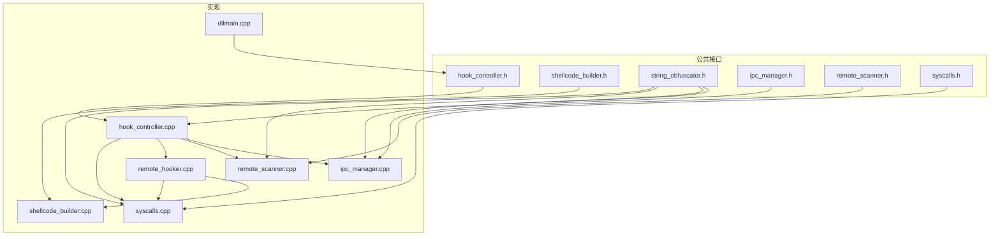
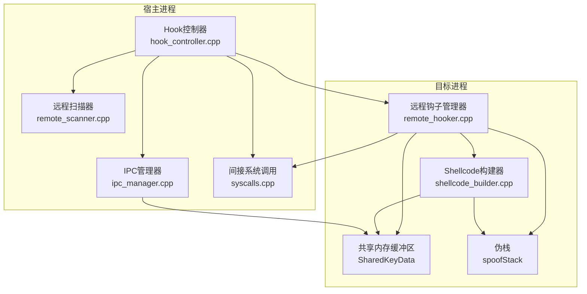
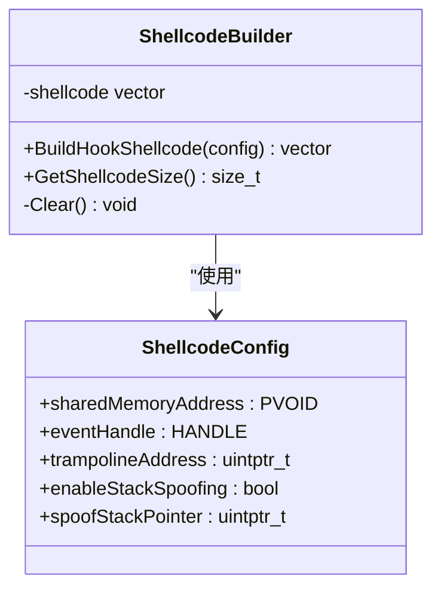
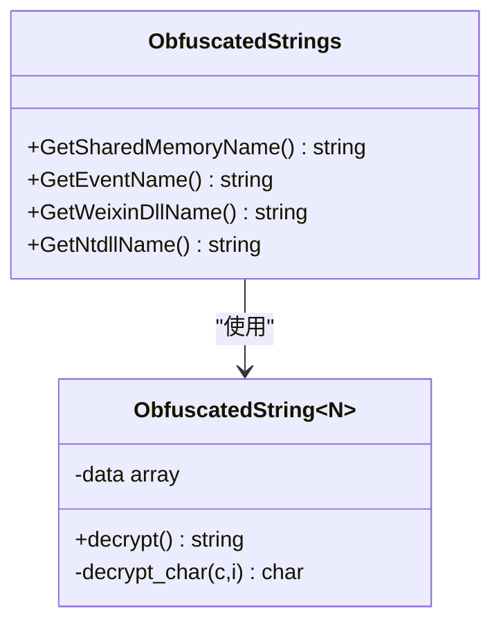
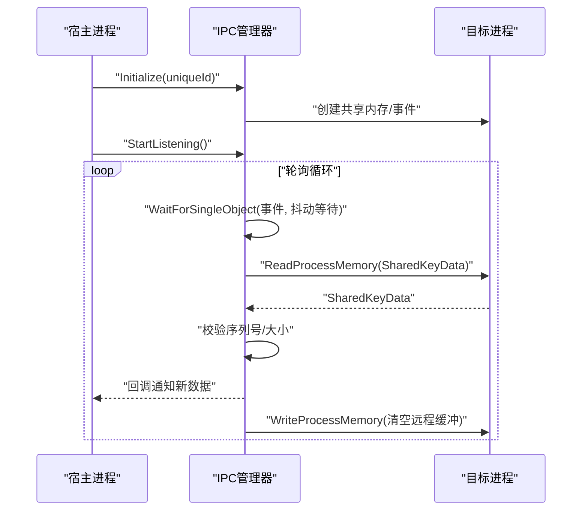
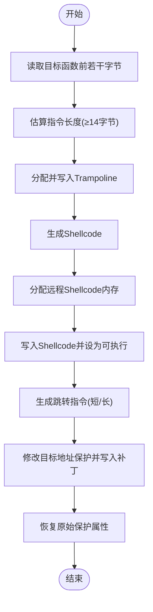
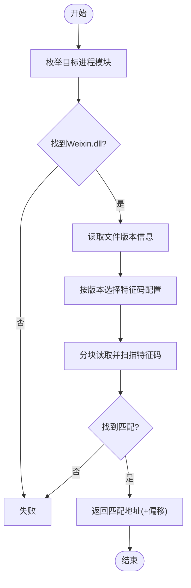
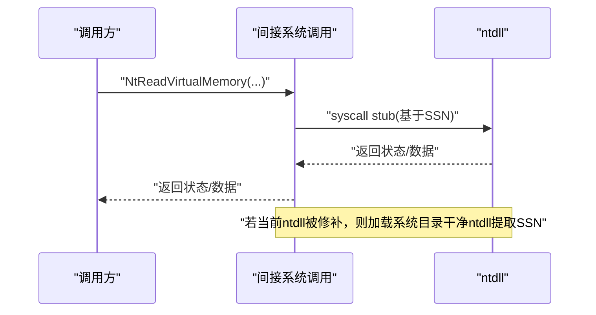
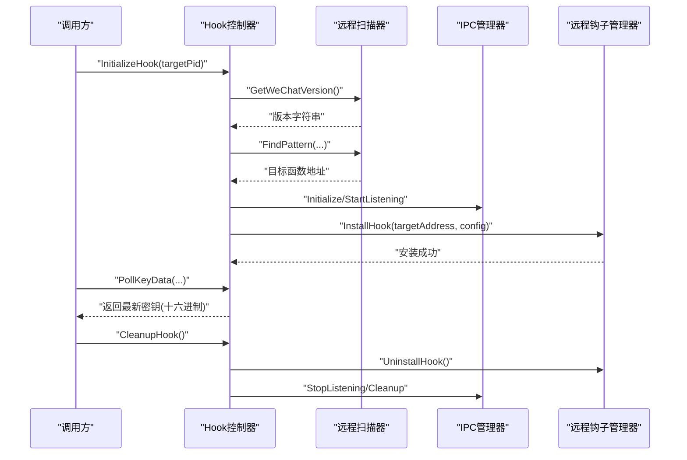
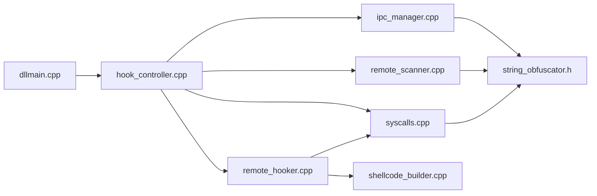

# 实用工具组件

<cite>
**本文引用的文件**
- [shellcode_builder.h](file://wx_key/include/shellcode_builder.h)
- [shellcode_builder.cpp](file://wx_key/src/shellcode_builder.cpp)
- [string_obfuscator.h](file://wx_key/include/string_obfuscator.h)
- [hook_controller.h](file://wx_key/include/hook_controller.h)
- [hook_controller.cpp](file://wx_key/src/hook_controller.cpp)
- [ipc_manager.h](file://wx_key/include/ipc_manager.h)
- [ipc_manager.cpp](file://wx_key/src/ipc_manager.cpp)
- [remote_hooker.h](file://wx_key/include/remote_hooker.h)
- [remote_hooker.cpp](file://wx_key/src/remote_hooker.cpp)
- [remote_scanner.h](file://wx_key/include/remote_scanner.h)
- [remote_scanner.cpp](file://wx_key/src/remote_scanner.cpp)
- [syscalls.h](file://wx_key/include/syscalls.h)
- [syscalls.cpp](file://wx_key/src/syscalls.cpp)
- [dllmain.cpp](file://wx_key/dllmain.cpp)
</cite>

## 目录
1. [简介](#简介)
2. [项目结构](#项目结构)
3. [核心组件](#核心组件)
4. [架构总览](#架构总览)
5. [组件详解](#组件详解)
6. [依赖关系分析](#依赖关系分析)
7. [性能考量](#性能考量)
8. [故障排查指南](#故障排查指南)
9. [结论](#结论)
10. [附录](#附录)

## 简介
本文件面向“实用工具组件”，聚焦于以下能力：
- Shellcode构建器：实现x64内联钩子的机器码生成，包含寄存器保存/恢复、栈伪造、跳板（Trampoline）衔接等。
- 字符串混淆器：基于编译期XOR的字符串加密与运行时解密，降低静态特征。
- DLL注入与钩子集成：通过远程进程内存分配、写入、保护变更，完成对目标函数的钩挂；结合IPC轮询实现密钥数据回传。
- 代码混淆与反调试：间接系统调用、字符串加密、版本特征码扫描、轮询IPC等策略降低被检测概率。

## 项目结构
仓库采用分层组织：公共头文件位于include目录，实现位于src目录，平台入口点位于dllmain.cpp。与实用工具组件直接相关的模块包括：
- Shellcode构建与远程钩子：shellcode_builder.*、remote_hooker.*
- 字符串混淆：string_obfuscator.h
- IPC与共享内存：ipc_manager.*
- 进程扫描与版本识别：remote_scanner.*
- 间接系统调用：syscalls.*

图表来源
- [hook_controller.h](file://wx_key/include/hook_controller.h#L1-L50)
- [hook_controller.cpp](file://wx_key/src/hook_controller.cpp#L1-L491)
- [shellcode_builder.h](file://wx_key/include/shellcode_builder.h#L1-L38)
- [shellcode_builder.cpp](file://wx_key/src/shellcode_builder.cpp#L1-L151)
- [string_obfuscator.h](file://wx_key/include/string_obfuscator.h#L1-L62)
- [ipc_manager.h](file://wx_key/include/ipc_manager.h#L1-L80)
- [ipc_manager.cpp](file://wx_key/src/ipc_manager.cpp#L1-L273)
- [remote_hooker.h](file://wx_key/include/remote_hooker.h#L1-L73)
- [remote_hooker.cpp](file://wx_key/src/remote_hooker.cpp#L1-L419)
- [remote_scanner.h](file://wx_key/include/remote_scanner.h#L1-L70)
- [remote_scanner.cpp](file://wx_key/src/remote_scanner.cpp#L1-L261)
- [syscalls.h](file://wx_key/include/syscalls.h#L1-L278)
- [syscalls.cpp](file://wx_key/src/syscalls.cpp#L1-L278)
- [dllmain.cpp](file://wx_key/dllmain.cpp#L1-L24)

章节来源
- [hook_controller.cpp](file://wx_key/src/hook_controller.cpp#L1-L491)
- [shellcode_builder.cpp](file://wx_key/src/shellcode_builder.cpp#L1-L151)
- [ipc_manager.cpp](file://wx_key/src/ipc_manager.cpp#L1-L273)
- [remote_hooker.cpp](file://wx_key/src/remote_hooker.cpp#L1-L419)
- [remote_scanner.cpp](file://wx_key/src/remote_scanner.cpp#L1-L261)
- [syscalls.cpp](file://wx_key/src/syscalls.cpp#L1-L278)
- [dllmain.cpp](file://wx_key/dllmain.cpp#L1-L24)

## 核心组件
- Shellcode构建器：根据配置生成内联钩子机器码，负责保存/恢复寄存器、条件拷贝密钥到共享内存、递增序列号、跳回Trampoline。
- 字符串混淆器：编译期XOR加密字符串，运行时解密，提供常用字符串的加密版本。
- IPC管理器：创建共享内存与事件，轮询远程缓冲区，回调通知新数据。
- 远程钩子管理器：在目标进程分配Trampoline与Shellcode，写入跳转补丁，保护属性变更。
- 远程扫描器：枚举模块、版本识别、特征码扫描。
- 间接系统调用：动态解析ntdll函数、提取SSN、生成syscall stub，规避检测。
- DLL入口：进程附加/分离时清理资源。

章节来源
- [shellcode_builder.h](file://wx_key/include/shellcode_builder.h#L1-L38)
- [shellcode_builder.cpp](file://wx_key/src/shellcode_builder.cpp#L1-L151)
- [string_obfuscator.h](file://wx_key/include/string_obfuscator.h#L1-L62)
- [ipc_manager.h](file://wx_key/include/ipc_manager.h#L1-L80)
- [ipc_manager.cpp](file://wx_key/src/ipc_manager.cpp#L1-L273)
- [remote_hooker.h](file://wx_key/include/remote_hooker.h#L1-L73)
- [remote_hooker.cpp](file://wx_key/src/remote_hooker.cpp#L1-L419)
- [remote_scanner.h](file://wx_key/include/remote_scanner.h#L1-L70)
- [remote_scanner.cpp](file://wx_key/src/remote_scanner.cpp#L1-L261)
- [syscalls.h](file://wx_key/include/syscalls.h#L1-L278)
- [syscalls.cpp](file://wx_key/src/syscalls.cpp#L1-L278)
- [hook_controller.h](file://wx_key/include/hook_controller.h#L1-L50)
- [hook_controller.cpp](file://wx_key/src/hook_controller.cpp#L1-L491)
- [dllmain.cpp](file://wx_key/dllmain.cpp#L1-L24)

## 架构总览
实用工具组件围绕“远程钩子 + IPC回传”的闭环工作流展开：
- 控制器在宿主进程中初始化上下文，打开目标进程，扫描特征码定位目标函数。
- 在目标进程分配远程数据缓冲区与伪栈，创建IPC资源。
- 生成Shellcode并写入目标进程，安装内联补丁，建立Trampoline。
- 目标函数被调用时，Shellcode将密钥写入共享内存并递增序列号，控制器轮询读取并解密输出。
- 通过间接系统调用与字符串混淆降低静态/动态检测风险。

图表来源
- [hook_controller.cpp](file://wx_key/src/hook_controller.cpp#L214-L379)
- [remote_hooker.cpp](file://wx_key/src/remote_hooker.cpp#L278-L389)
- [shellcode_builder.cpp](file://wx_key/src/shellcode_builder.cpp#L28-L150)
- [ipc_manager.cpp](file://wx_key/src/ipc_manager.cpp#L24-L132)
- [syscalls.cpp](file://wx_key/src/syscalls.cpp#L92-L122)

## 组件详解

### Shellcode构建器（指令编码、寄存器管理、栈操作）
- 功能职责
  - 生成x64内联钩子机器码，保存/恢复寄存器，条件拷贝密钥到共享内存，递增序列号，最后跳回Trampoline。
  - 支持可选的堆栈伪造：在进入Shellcode前切换到对齐后的伪栈，执行完后再切回真实栈。
- 关键实现要点
  - 使用Xbyak生成机器码，按需保存/恢复全部通用寄存器与标志位。
  - 通过配置参数决定是否启用堆栈伪造及伪栈指针位置。
  - 严格遵循x64调用约定，保证被钩函数的返回语义正确。
- 复杂度与性能
  - 机器码生成为O(1)，运行时开销主要来自内存访问与rep movsb。
  - 堆栈伪造引入少量额外指令，但能显著提升稳定性与兼容性。

图表来源
- [shellcode_builder.h](file://wx_key/include/shellcode_builder.h#L9-L34)
- [shellcode_builder.cpp](file://wx_key/src/shellcode_builder.cpp#L28-L150)

章节来源
- [shellcode_builder.h](file://wx_key/include/shellcode_builder.h#L1-L38)
- [shellcode_builder.cpp](file://wx_key/src/shellcode_builder.cpp#L1-L151)

### 字符串混淆器（加密算法、解密流程、运行时处理）
- 功能职责
  - 编译期XOR加密字符串，运行时解密，减少静态特征暴露。
  - 提供常用字符串的加密版本，如共享内存名、事件名、模块名等。
- 加密与解密机制
  - 加密：每个字符与固定偏移按索引异或，偏移值随索引变化，形成伪随机序列。
  - 解密：运行时逐字符还原，拼接为完整字符串。
  - 宏封装：OBFUSCATE_STR提供便捷的编译期包装。
- 安全性与局限
  - 仅对抗基础静态扫描，无法抵御高级逆向分析；建议配合其他混淆手段使用。

图表来源
- [string_obfuscator.h](file://wx_key/include/string_obfuscator.h#L8-L58)

章节来源
- [string_obfuscator.h](file://wx_key/include/string_obfuscator.h#L1-L62)

### IPC管理器（轮询模式、共享内存、事件）
- 功能职责
  - 创建全局/本地命名的共享内存与事件，轮询远程进程缓冲区，回调通知新数据。
  - 支持轻微抖动的轮询间隔，降低稳定特征。
- 关键流程
  - 初始化：生成唯一ID，替换模板占位符，尝试创建全局资源，失败则回退到本地命名。
  - 监听：线程循环等待事件或超时，读取远程SharedKeyData，校验序列号，触发回调并清空远程缓冲。
  - 清理：停止监听、解除映射、关闭句柄。
- 数据结构
  - SharedKeyData：包含数据大小、密钥缓冲区与序列号。

图表来源
- [ipc_manager.cpp](file://wx_key/src/ipc_manager.cpp#L24-L132)
- [ipc_manager.cpp](file://wx_key/src/ipc_manager.cpp#L212-L271)

章节来源
- [ipc_manager.h](file://wx_key/include/ipc_manager.h#L1-L80)
- [ipc_manager.cpp](file://wx_key/src/ipc_manager.cpp#L1-L273)

### 远程钩子管理器（Trampoline、补丁、保护）
- 功能职责
  - 在目标进程分配Trampoline与Shellcode，写入跳转补丁，恢复保护属性。
  - 提供指令长度估算、跳转指令生成（短跳转/长跳转）。
- 关键流程
  - 读取目标函数前若干字节作为原始指令，分配Trampoline并写入原始指令与回跳指令。
  - 生成Shellcode并写入目标进程，分配内存并设置可执行权限。
  - 生成跳转指令，确保长度覆盖原始指令，写入目标地址并恢复保护。
- 安全性
  - 使用间接系统调用进行内存读写与保护变更，降低API级检测特征。

图表来源
- [remote_hooker.cpp](file://wx_key/src/remote_hooker.cpp#L182-L388)

章节来源
- [remote_hooker.h](file://wx_key/include/remote_hooker.h#L1-L73)
- [remote_hooker.cpp](file://wx_key/src/remote_hooker.cpp#L1-L419)

### 远程扫描器（版本识别、特征码扫描）
- 功能职责
  - 枚举目标进程模块，定位Weixin.dll，读取版本信息，按版本选择特征码配置。
  - 分块读取远程内存，使用掩码匹配特征码，返回匹配地址列表。
- 版本配置
  - 针对不同微信版本维护特征码与偏移，自动选择最合适的配置。

图表来源
- [remote_scanner.cpp](file://wx_key/src/remote_scanner.cpp#L119-L259)

章节来源
- [remote_scanner.h](file://wx_key/include/remote_scanner.h#L1-L70)
- [remote_scanner.cpp](file://wx_key/src/remote_scanner.cpp#L1-L261)

### 间接系统调用（规避检测）
- 功能职责
  - 动态解析ntdll函数，提取SSN，生成syscall stub，统一通过syscall调用。
  - 若当前ntdll被修补，回退到系统目录加载干净的ntdll以提取SSN。
- 安全性
  - 减少API调用痕迹，降低EDR/AV检测概率。

图表来源
- [syscalls.cpp](file://wx_key/src/syscalls.cpp#L92-L122)
- [syscalls.cpp](file://wx_key/src/syscalls.cpp#L235-L276)

章节来源
- [syscalls.h](file://wx_key/include/syscalls.h#L1-L278)
- [syscalls.cpp](file://wx_key/src/syscalls.cpp#L1-L278)

### Hook控制器（集成与导出接口）
- 功能职责
  - 对外提供初始化、轮询取数、状态查询、清理等导出函数。
  - 内部协调扫描、IPC、钩子、系统调用等模块，完成端到端流程。
- 关键流程
  - 打开目标进程 → 版本识别 → 特征码扫描 → 分配远程缓冲区与伪栈 → 初始化IPC → 安装钩子 → 等待密钥数据。
- 线程安全
  - 使用临界区保护共享状态与队列，避免竞态。

图表来源
- [hook_controller.cpp](file://wx_key/src/hook_controller.cpp#L214-L379)
- [hook_controller.cpp](file://wx_key/src/hook_controller.cpp#L414-L491)

章节来源
- [hook_controller.h](file://wx_key/include/hook_controller.h#L1-L50)
- [hook_controller.cpp](file://wx_key/src/hook_controller.cpp#L1-L491)

## 依赖关系分析
- 组件耦合
  - Hook控制器聚合扫描器、IPC、远程钩子、系统调用等模块，是高层协调者。
  - 远程钩子依赖Shellcode构建器与系统调用，负责内存分配与补丁写入。
  - IPC依赖字符串混淆器生成命名，轮询远程缓冲区。
  - 所有模块均依赖字符串混淆器提供的加密字符串。
- 外部依赖
  - Xbyak用于机器码生成。
  - Windows API用于进程/内存/同步对象操作。
  - Psapi/version.lib用于版本信息读取。

图表来源
- [hook_controller.cpp](file://wx_key/src/hook_controller.cpp#L11-L20)
- [remote_hooker.cpp](file://wx_key/src/remote_hooker.cpp#L1-L6)
- [ipc_manager.cpp](file://wx_key/src/ipc_manager.cpp#L1-L7)
- [remote_scanner.cpp](file://wx_key/src/remote_scanner.cpp#L1-L8)
- [syscalls.cpp](file://wx_key/src/syscalls.cpp#L1-L7)
- [dllmain.cpp](file://wx_key/dllmain.cpp#L1-L9)

章节来源
- [hook_controller.cpp](file://wx_key/src/hook_controller.cpp#L1-L491)
- [remote_hooker.cpp](file://wx_key/src/remote_hooker.cpp#L1-L419)
- [ipc_manager.cpp](file://wx_key/src/ipc_manager.cpp#L1-L273)
- [remote_scanner.cpp](file://wx_key/src/remote_scanner.cpp#L1-L261)
- [syscalls.cpp](file://wx_key/src/syscalls.cpp#L1-L278)
- [dllmain.cpp](file://wx_key/dllmain.cpp#L1-L24)

## 性能考量
- Shellcode执行路径
  - 机器码生成阶段为编译期开销，运行时主要消耗在内存读写与rep movsb。
  - 堆栈伪造会增加少量指令，但通常可忽略。
- IPC轮询
  - 轮询间隔带抖动，避免稳定特征；读写远程缓冲区频率受目标函数调用频率影响。
- 远程扫描
  - 分块读取与本地匹配，避免一次性大块内存拷贝；特征码匹配复杂度与掩码长度相关。
- 系统调用
  - 间接syscall减少API调用痕迹，同时保持性能稳定。

## 故障排查指南
- 初始化失败
  - 打开进程失败：检查目标PID是否有效、权限是否足够、进程是否存在。
  - 版本识别失败：确认Weixin.dll存在且版本信息可读。
  - 特征码匹配失败：确认匹配数量为1，偏移正确。
- IPC问题
  - 共享内存/事件创建失败：检查命名冲突与权限，必要时回退到本地命名。
  - 轮询无数据：确认目标函数确实在写入共享内存，检查序列号变化。
- 钩子安装失败
  - 内存保护变更失败：检查目标地址可写，必要时增大补丁长度。
  - Trampoline写入失败：确认原始指令长度估算正确。
- 字符串混淆
  - 宏展开异常：确认编译器支持C++14及以上特性。
- 系统调用
  - SSN提取失败：确认ntdll可用，必要时回退到系统目录加载。

章节来源
- [hook_controller.cpp](file://wx_key/src/hook_controller.cpp#L225-L281)
- [ipc_manager.cpp](file://wx_key/src/ipc_manager.cpp#L50-L131)
- [remote_hooker.cpp](file://wx_key/src/remote_hooker.cpp#L359-L388)
- [syscalls.cpp](file://wx_key/src/syscalls.cpp#L92-L122)

## 结论
实用工具组件通过“Shellcode构建器 + 字符串混淆 + IPC轮询 + 远程钩子 + 间接系统调用”的组合，实现了对目标进程函数的稳定钩挂与密钥数据回传。组件间职责清晰、耦合适度，具备良好的扩展性与可维护性。建议在生产环境中结合更多反检测策略（如控制流混淆、多阶段解密等）进一步增强安全性。

## 附录

### 使用示例与配置选项
- 初始化钩子
  - 参数：目标微信进程PID
  - 返回：布尔值，成功/失败
  - 示例路径：[hook_controller.cpp](file://wx_key/src/hook_controller.cpp#L414-L417)
- 轮询密钥数据
  - 参数：输出缓冲区指针与大小（至少65字节）
  - 返回：布尔值，若有新数据返回true
  - 示例路径：[hook_controller.cpp](file://wx_key/src/hook_controller.cpp#L428-L455)
- 获取状态消息
  - 参数：输出缓冲区、大小、输出状态级别
  - 返回：布尔值，若有新消息返回true
  - 示例路径：[hook_controller.cpp](file://wx_key/src/hook_controller.cpp#L457-L486)
- 清理钩子
  - 返回：布尔值，成功/失败
  - 示例路径：[hook_controller.cpp](file://wx_key/src/hook_controller.cpp#L419-L426)
- 最后一次错误信息
  - 返回：错误信息字符串
  - 示例路径：[hook_controller.cpp](file://wx_key/src/hook_controller.cpp#L488-L490)

### 配置项说明
- Shellcode配置
  - 共享内存地址：远程分配的SharedKeyData地址
  - 事件句柄：不再使用（改为轮询）
  - Trampoline地址：由远程钩子管理器填充
  - 启用堆栈伪造：强制开启
  - 伪栈指针：远程伪栈顶地址（对齐到16字节）
  - 示例路径：[hook_controller.cpp](file://wx_key/src/hook_controller.cpp#L359-L366)

### 与主功能模块的集成方式
- DLL入口点
  - 进程附加时禁用库调用线程优化，进程分离时清理钩子资源
  - 示例路径：[dllmain.cpp](file://wx_key/dllmain.cpp#L12-L24)
- 主流程集成
  - 控制器负责串联扫描、IPC、钩子与系统调用，对外提供统一接口
  - 示例路径：[hook_controller.cpp](file://wx_key/src/hook_controller.cpp#L214-L379)