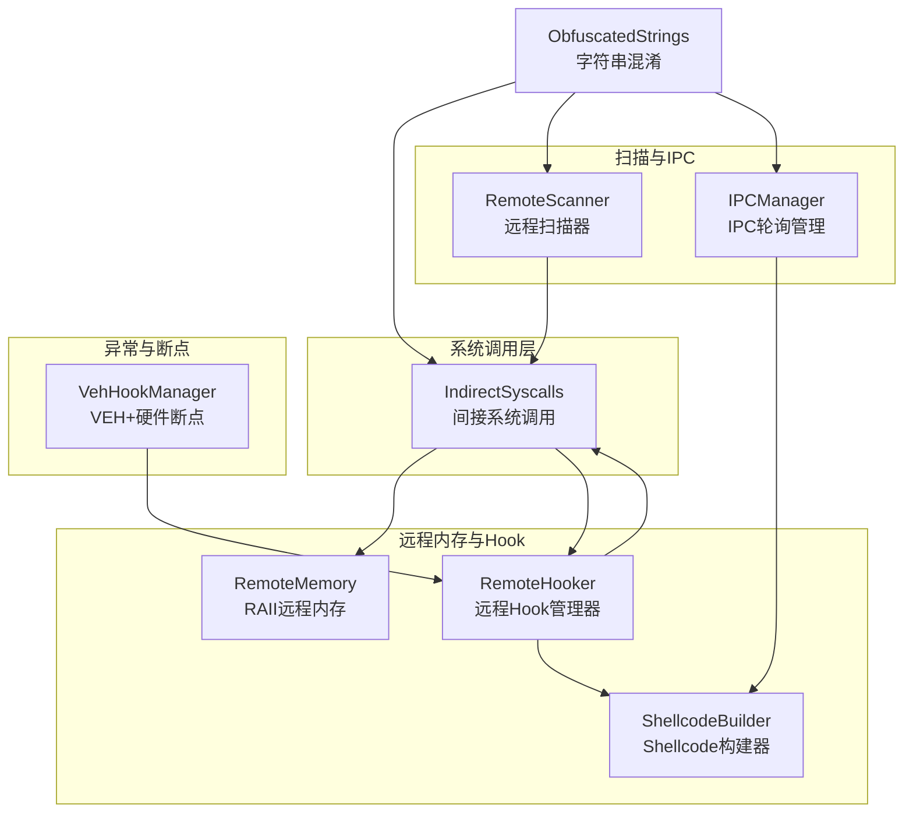
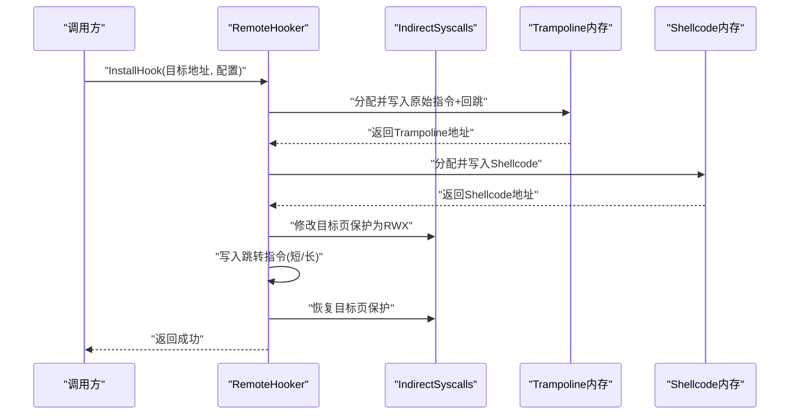
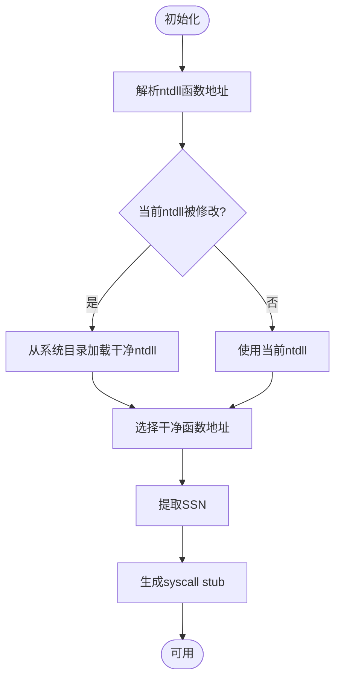
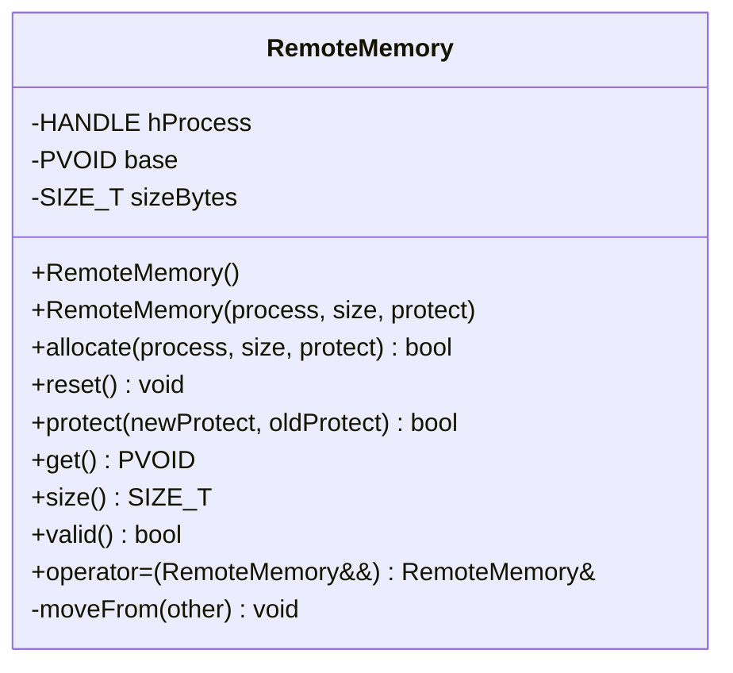
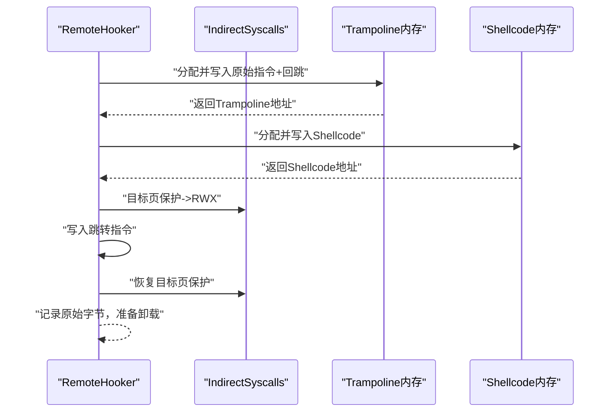
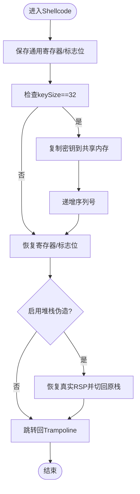
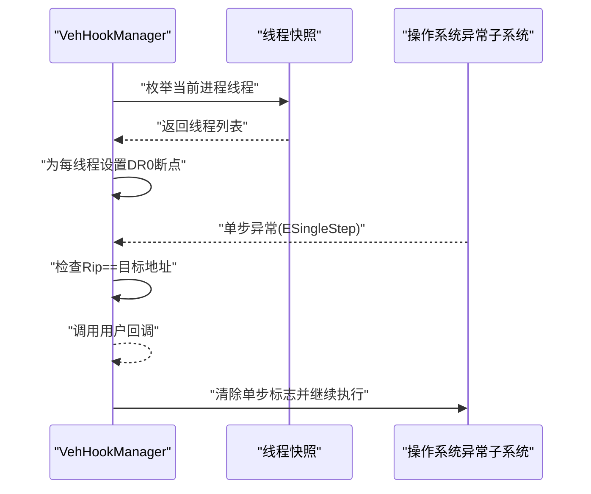
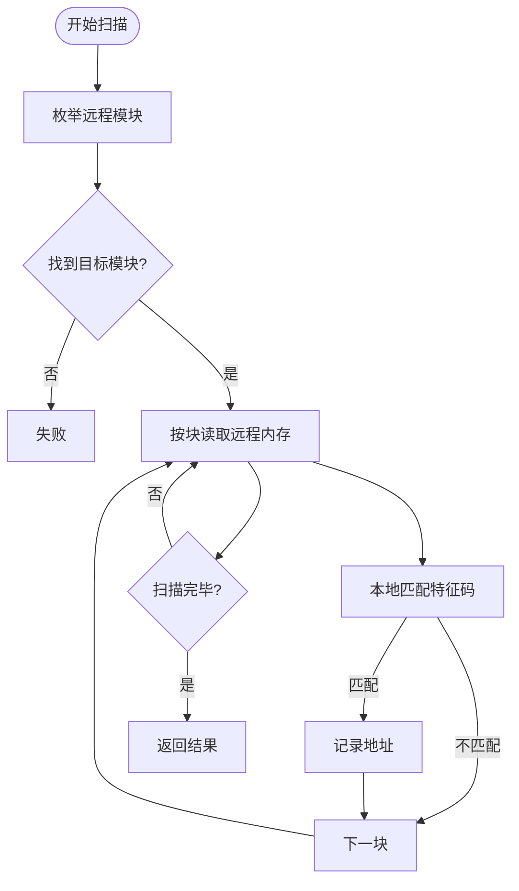
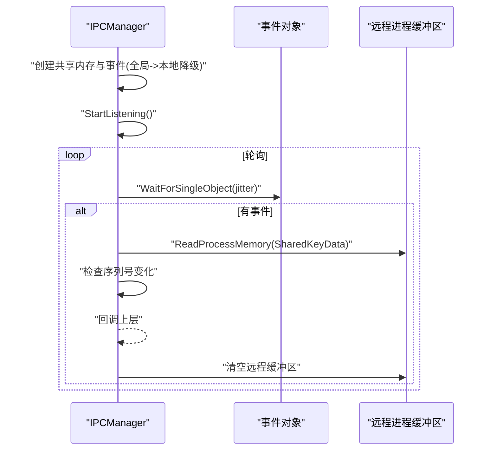
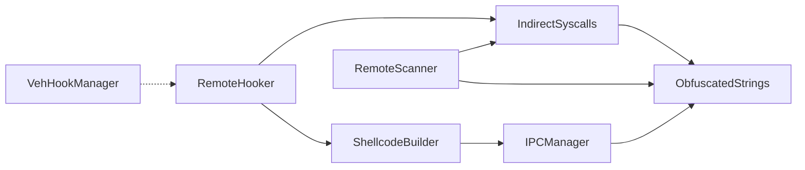

# 系统集成组件

<cite>
**本文引用的文件**
- [syscalls.h](file://wx_key/include/syscalls.h)
- [syscalls.cpp](file://wx_key/src/syscalls.cpp)
- [remote_memory.h](file://wx_key/include/remote_memory.h)
- [remote_hooker.h](file://wx_key/include/remote_hooker.h)
- [remote_hooker.cpp](file://wx_key/src/remote_hooker.cpp)
- [shellcode_builder.h](file://wx_key/include/shellcode_builder.h)
- [shellcode_builder.cpp](file://wx_key/src/shellcode_builder.cpp)
- [veh_hook_manager.h](file://wx_key/include/veh_hook_manager.h)
- [veh_hook_manager.cpp](file://wx_key/src/veh_hook_manager.cpp)
- [remote_scanner.h](file://wx_key/include/remote_scanner.h)
- [remote_scanner.cpp](file://wx_key/src/remote_scanner.cpp)
- [ipc_manager.h](file://wx_key/include/ipc_manager.h)
- [ipc_manager.cpp](file://wx_key/src/ipc_manager.cpp)
- [string_obfuscator.h](file://wx_key/include/string_obfuscator.h)
</cite>

## 目录
1. [简介](#简介)
2. [项目结构](#项目结构)
3. [核心组件](#核心组件)
4. [架构总览](#架构总览)
5. [详细组件分析](#详细组件分析)
6. [依赖关系分析](#依赖关系分析)
7. [性能考量](#性能考量)
8. [故障排查指南](#故障排查指南)
9. [结论](#结论)
10. [附录](#附录)

## 简介
本技术文档面向系统集成组件，聚焦于间接系统调用、远程内存管理、系统API封装设计模式、安全机制与异常处理、以及与Windows内核交互的安全与性能影响。文档同时提供使用示例与最佳实践，帮助开发者在保证安全的前提下高效完成跨进程内存访问、远程Hook与数据采集。

## 项目结构
该组件以C++实现，采用头文件声明与源文件实现分离，按功能域划分为：
- 系统调用与间接调用：syscalls.h/.cpp
- 远程内存管理：remote_memory.h
- 远程Hook与Trampoline：remote_hooker.h/.cpp
- Shellcode构建：shellcode_builder.h/.cpp
- VEH与硬件断点：veh_hook_manager.h/.cpp
- 远程特征码扫描：remote_scanner.h/.cpp
- IPC共享数据通道：ipc_manager.h/.cpp
- 字符串混淆工具：string_obfuscator.h

**图表来源**
- [syscalls.h](file://wx_key/include/syscalls.h#L96-L185)
- [remote_memory.h](file://wx_key/include/remote_memory.h#L8-L104)
- [remote_hooker.h](file://wx_key/include/remote_hooker.h#L10-L70)
- [shellcode_builder.h](file://wx_key/include/shellcode_builder.h#L18-L34)
- [veh_hook_manager.h](file://wx_key/include/veh_hook_manager.h#L10-L30)
- [remote_scanner.h](file://wx_key/include/remote_scanner.h#L16-L44)
- [ipc_manager.h](file://wx_key/include/ipc_manager.h#L19-L76)
- [string_obfuscator.h](file://wx_key/include/string_obfuscator.h#L42-L58)

**章节来源**
- [syscalls.h](file://wx_key/include/syscalls.h#L1-L189)
- [remote_memory.h](file://wx_key/include/remote_memory.h#L1-L107)
- [remote_hooker.h](file://wx_key/include/remote_hooker.h#L1-L73)
- [shellcode_builder.h](file://wx_key/include/shellcode_builder.h#L1-L38)
- [veh_hook_manager.h](file://wx_key/include/veh_hook_manager.h#L1-L33)
- [remote_scanner.h](file://wx_key/include/remote_scanner.h#L1-L70)
- [ipc_manager.h](file://wx_key/include/ipc_manager.h#L1-L80)
- [string_obfuscator.h](file://wx_key/include/string_obfuscator.h#L1-L62)

## 核心组件
- 间接系统调用封装：通过动态解析ntdll函数、提取SSN并生成syscall stub，实现绕过EDR的间接调用。
- 远程内存管理：基于RAII的RemoteMemory类，统一管理远程进程内存的分配、保护修改与释放。
- 远程Hook与Trampoline：自动计算目标指令长度、备份原始指令、生成Trampoline并写入跳转，支持硬件断点+VEH模式。
- Shellcode构建：使用Xbyak生成x64机器码，支持堆栈伪造、条件拷贝与序列号递增。
- VEH与硬件断点：遍历当前进程线程设置DR0断点，结合VEH捕获单步异常进行回调。
- 远程扫描与版本识别：枚举远程模块、分块读取、特征码匹配与版本配置选择。
- IPC共享通道：创建共享内存与事件，轮询远程缓冲区，实现跨进程数据传输。

**章节来源**
- [syscalls.cpp](file://wx_key/src/syscalls.cpp#L92-L122)
- [remote_memory.h](file://wx_key/include/remote_memory.h#L34-L85)
- [remote_hooker.cpp](file://wx_key/src/remote_hooker.cpp#L278-L389)
- [shellcode_builder.cpp](file://wx_key/src/shellcode_builder.cpp#L28-L150)
- [veh_hook_manager.cpp](file://wx_key/src/veh_hook_manager.cpp#L101-L122)
- [remote_scanner.cpp](file://wx_key/src/remote_scanner.cpp#L163-L204)
- [ipc_manager.cpp](file://wx_key/src/ipc_manager.cpp#L24-L132)

## 架构总览
系统通过IndirectSyscalls统一访问Nt系列API，RemoteHooker在远程进程内写入Shellcode并建立Trampoline，ShellcodeBuilder负责生成机器码，VEH+硬件断点提供替代触发方式，RemoteScanner与IPCManager分别承担扫描与数据通道职责。

**图表来源**
- [remote_hooker.cpp](file://wx_key/src/remote_hooker.cpp#L278-L389)
- [syscalls.cpp](file://wx_key/src/syscalls.cpp#L124-L233)

**章节来源**
- [remote_hooker.cpp](file://wx_key/src/remote_hooker.cpp#L278-L389)
- [syscalls.cpp](file://wx_key/src/syscalls.cpp#L124-L233)

## 详细组件分析

### 间接系统调用与动态导入
- 函数解析：通过混淆后的ntdll名称动态加载模块并解析函数地址；若当前ntdll被修改，会从系统目录加载干净副本以提取SSN。
- SSN提取与stub生成：扫描函数前若干字节定位“mov eax, imm32”立即数作为SSN，生成“mov r10,rcx; mov eax,ssn; syscall; ret”模板，分配可执行内存存放stub。
- 错误码与返回值：封装Nt系列API返回NTSTATUS，统一失败时返回非成功状态；调用前校验初始化状态与函数指针有效性。

**图表来源**
- [syscalls.cpp](file://wx_key/src/syscalls.cpp#L26-L90)
- [syscalls.cpp](file://wx_key/src/syscalls.cpp#L235-L276)

**章节来源**
- [syscalls.h](file://wx_key/include/syscalls.h#L96-L185)
- [syscalls.cpp](file://wx_key/src/syscalls.cpp#L26-L122)
- [syscalls.cpp](file://wx_key/src/syscalls.cpp#L235-L276)
- [string_obfuscator.h](file://wx_key/include/string_obfuscator.h#L42-L58)

### 远程内存管理（RemoteMemory）
- RAII语义：构造时可指定进程、大小与保护；析构自动释放；支持移动语义转移所有权。
- 分配与释放：使用NtAllocateVirtualMemory进行保留与提交，NtFreeVirtualMemory释放。
- 保护修改：NtProtectVirtualMemory原子修改保护，返回旧保护值供恢复。

**图表来源**
- [remote_memory.h](file://wx_key/include/remote_memory.h#L8-L104)

**章节来源**
- [remote_memory.h](file://wx_key/include/remote_memory.h#L34-L85)

### 远程Hook与Trampoline（RemoteHooker）
- 指令长度计算：基于x64反汇编规则估算需要备份的原始指令长度，确保写入跳转时不会破坏相邻指令。
- Trampoline构建：在远程进程分配内存，写入原始指令与回跳指令，设置为可执行。
- Shellcode注入：根据配置构建Shellcode，写入远程内存并设为可执行；生成跳转指令写入目标函数开头，必要时填充NOP。
- 保护与回滚：写入前临时提升目标页保护为RWX，写入后恢复；卸载时写回原始字节并释放内存。
- 硬件断点模式：可仅生成Trampoline与Shellcode，不直接写入补丁，交由上层设置硬件断点或VEH。

**图表来源**
- [remote_hooker.cpp](file://wx_key/src/remote_hooker.cpp#L197-L245)
- [remote_hooker.cpp](file://wx_key/src/remote_hooker.cpp#L278-L389)

**章节来源**
- [remote_hooker.h](file://wx_key/include/remote_hooker.h#L10-L70)
- [remote_hooker.cpp](file://wx_key/src/remote_hooker.cpp#L182-L245)
- [remote_hooker.cpp](file://wx_key/src/remote_hooker.cpp#L278-L389)

### Shellcode构建（ShellcodeBuilder）
- 生成环境：x64平台，使用Xbyak生成机器码。
- 关键逻辑：保存/恢复寄存器、条件检查（keySize==32）、复制密钥到共享内存、递增序列号、跳回Trampoline。
- 堆栈伪造：可选地将关键寄存器暂存至真实栈，切换到对齐后的伪栈，再恢复真实栈。

**图表来源**
- [shellcode_builder.cpp](file://wx_key/src/shellcode_builder.cpp#L28-L150)

**章节来源**
- [shellcode_builder.h](file://wx_key/include/shellcode_builder.h#L9-L34)
- [shellcode_builder.cpp](file://wx_key/src/shellcode_builder.cpp#L28-L150)

### VEH与硬件断点（VehHookManager）
- 线程遍历：使用快照枚举当前进程所有线程，为目标地址设置DR0全局断点。
- 异常处理：注册VEH，在单步异常且Rip命中目标地址时回调用户逻辑，清除单步标志后继续执行。
- 清理：卸载时恢复各线程上下文的DR寄存器。

**图表来源**
- [veh_hook_manager.cpp](file://wx_key/src/veh_hook_manager.cpp#L19-L66)
- [veh_hook_manager.cpp](file://wx_key/src/veh_hook_manager.cpp#L141-L156)

**章节来源**
- [veh_hook_manager.h](file://wx_key/include/veh_hook_manager.h#L10-L30)
- [veh_hook_manager.cpp](file://wx_key/src/veh_hook_manager.cpp#L19-L66)
- [veh_hook_manager.cpp](file://wx_key/src/veh_hook_manager.cpp#L101-L122)
- [veh_hook_manager.cpp](file://wx_key/src/veh_hook_manager.cpp#L141-L156)

### 远程扫描与版本识别（RemoteScanner）
- 模块枚举：使用远程进程句柄枚举模块，匹配目标模块名并获取基址与大小。
- 分块扫描：以固定块大小读取远程内存，本地缓冲区匹配特征码，支持单次与全部结果。
- 版本配置：根据版本字符串比较选择对应特征码配置，便于适配不同微信版本。

**图表来源**
- [remote_scanner.cpp](file://wx_key/src/remote_scanner.cpp#L158-L204)

**章节来源**
- [remote_scanner.h](file://wx_key/include/remote_scanner.h#L16-L44)
- [remote_scanner.cpp](file://wx_key/src/remote_scanner.cpp#L119-L147)
- [remote_scanner.cpp](file://wx_key/src/remote_scanner.cpp#L158-L204)
- [remote_scanner.cpp](file://wx_key/src/remote_scanner.cpp#L219-L259)

### IPC共享通道（IPCManager）
- 资源创建：生成唯一名称，优先尝试全局命名对象，失败则降级为本地命名对象。
- 轮询监听：启动独立线程，周期性等待事件并读取远程缓冲区，通过序列号去重，回调上层处理。
- 资源清理：停止监听、取消映射、关闭句柄。

**图表来源**
- [ipc_manager.cpp](file://wx_key/src/ipc_manager.cpp#L24-L132)
- [ipc_manager.cpp](file://wx_key/src/ipc_manager.cpp#L212-L271)

**章节来源**
- [ipc_manager.h](file://wx_key/include/ipc_manager.h#L19-L76)
- [ipc_manager.cpp](file://wx_key/src/ipc_manager.cpp#L24-L132)
- [ipc_manager.cpp](file://wx_key/src/ipc_manager.cpp#L212-L271)

## 依赖关系分析
- 组件耦合：RemoteHooker依赖IndirectSyscalls进行远程内存读写与保护修改；ShellcodeBuilder依赖IPC共享数据结构；RemoteScanner依赖IndirectSyscalls进行远程读取；VehHookManager独立运行但与RemoteHooker可配合使用。
- 外部依赖：Xbyak用于机器码生成；PSAPI/version库用于版本查询；Windows API用于线程快照、事件与共享内存。

**图表来源**
- [remote_hooker.h](file://wx_key/include/remote_hooker.h#L6-L7)
- [shellcode_builder.h](file://wx_key/include/shellcode_builder.h#L4-L6)
- [remote_scanner.h](file://wx_key/include/remote_scanner.h#L4-L6)
- [ipc_manager.h](file://wx_key/include/ipc_manager.h#L4-L6)
- [string_obfuscator.h](file://wx_key/include/string_obfuscator.h#L42-L58)

**章节来源**
- [remote_hooker.h](file://wx_key/include/remote_hooker.h#L6-L7)
- [shellcode_builder.h](file://wx_key/include/shellcode_builder.h#L4-L6)
- [remote_scanner.h](file://wx_key/include/remote_scanner.h#L4-L6)
- [ipc_manager.h](file://wx_key/include/ipc_manager.h#L4-L6)
- [string_obfuscator.h](file://wx_key/include/string_obfuscator.h#L42-L58)

## 性能考量
- 间接系统调用：通过SSN直调减少API开销，但需额外的stub分配与保护修改成本；建议集中调用并复用已初始化的函数指针。
- 远程内存：RemoteMemory采用RAII减少泄漏风险；频繁分配/释放建议池化或复用；保护修改需成对出现以避免页面状态不一致。
- Hook写入：短跳转更高效；长跳转用于远距离场景；写入前后保护修改与回滚需原子化，避免竞态。
- 扫描策略：分块读取与本地匹配减少远程IO次数；掩码匹配与版本配置减少无效扫描。
- IPC轮询：抖动等待避免稳定特征；事件驱动优于纯轮询，可在Shellcode中触发事件通知。

[本节为通用指导，无需列出具体文件来源]

## 故障排查指南
- 初始化失败：确认ntdll名称混淆解密正确、系统目录可访问；若当前ntdll被修改，检查从系统目录加载干净副本流程。
- 写入失败：检查目标页保护修改是否成功、写入长度与原始字节长度匹配；必要时填充NOP并确保原子写入。
- 保护异常：保护修改需成对恢复，避免遗留RWX页导致崩溃；卸载时先恢复再释放。
- 版本不匹配：确认版本解析与配置选择逻辑；必要时扩展版本配置表。
- VEH无效：检查线程快照是否成功、DR寄存器设置与VEH注册顺序；异常类型需为单步且Rip命中目标。

**章节来源**
- [syscalls.cpp](file://wx_key/src/syscalls.cpp#L92-L122)
- [remote_hooker.cpp](file://wx_key/src/remote_hooker.cpp#L358-L388)
- [remote_scanner.cpp](file://wx_key/src/remote_scanner.cpp#L76-L106)
- [veh_hook_manager.cpp](file://wx_key/src/veh_hook_manager.cpp#L101-L122)

## 结论
该系统集成组件通过间接系统调用、远程内存管理、Shellcode注入与VEH/硬件断点相结合，实现了对目标进程的安全、可控访问与Hook。其设计强调安全性（字符串混淆、保护修改原子化、版本适配）、健壮性（RAII与异常处理）与可维护性（模块化与清晰接口）。在实际部署中，建议严格遵循最佳实践，关注性能与安全平衡。

[本节为总结性内容，无需列出具体文件来源]

## 附录

### 使用示例与最佳实践
- 初始化与清理
  - 先调用间接系统调用初始化，再进行Hook或扫描；完成后清理资源。
  - 参考路径：[syscalls.cpp](file://wx_key/src/syscalls.cpp#L92-L122)
- 远程Hook
  - 使用RemoteHooker安装Hook，确保目标指令长度足够容纳跳转；卸载时写回原始字节并释放内存。
  - 参考路径：[remote_hooker.cpp](file://wx_key/src/remote_hooker.cpp#L278-L389)
- Shellcode配置
  - 通过ShellcodeConfig传入共享内存地址、事件句柄与Trampoline地址；启用堆栈伪造时注意对齐。
  - 参考路径：[shellcode_builder.h](file://wx_key/include/shellcode_builder.h#L9-L15)，[shellcode_builder.cpp](file://wx_key/src/shellcode_builder.cpp#L28-L150)
- IPC轮询
  - 初始化IPC后设置远程缓冲区地址，启动监听线程并在回调中处理数据；停止时调用停止监听并清理。
  - 参考路径：[ipc_manager.cpp](file://wx_key/src/ipc_manager.cpp#L24-L132)，[ipc_manager.cpp](file://wx_key/src/ipc_manager.cpp#L212-L271)
- 版本识别与扫描
  - 先获取微信版本，选择对应配置，再进行模块枚举与特征码扫描。
  - 参考路径：[remote_scanner.cpp](file://wx_key/src/remote_scanner.cpp#L219-L259)，[remote_scanner.cpp](file://wx_key/src/remote_scanner.cpp#L163-L204)

### 安全与合规建议
- 权限检查：确保具备必要的进程访问权限；对敏感操作进行前置校验。
- 地址验证：对输入的目标地址与长度进行边界检查；避免越界写入。
- 资源清理：所有分配的远程内存与事件、共享内存均需在异常路径中清理。
- 日志与调试：在开发阶段开启调试输出，生产环境谨慎使用。

[本节为通用指导，无需列出具体文件来源]