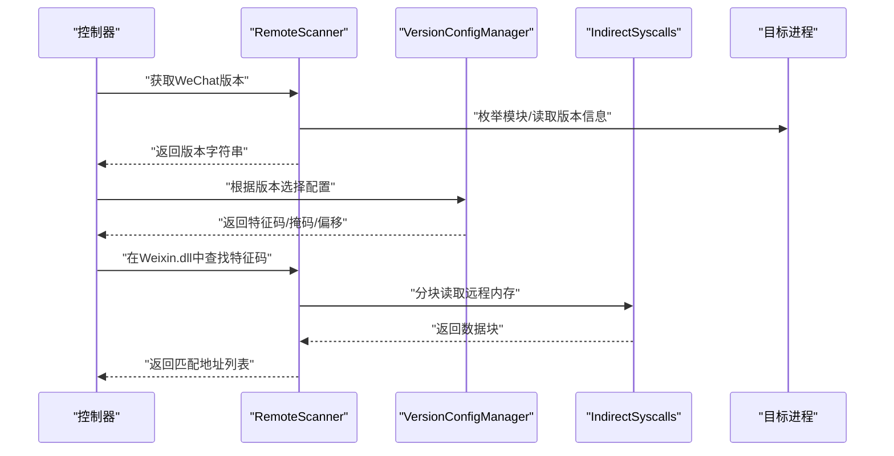
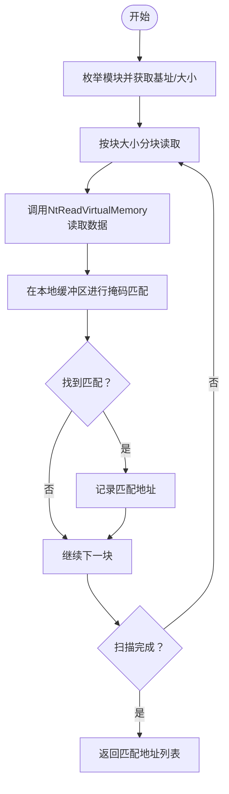
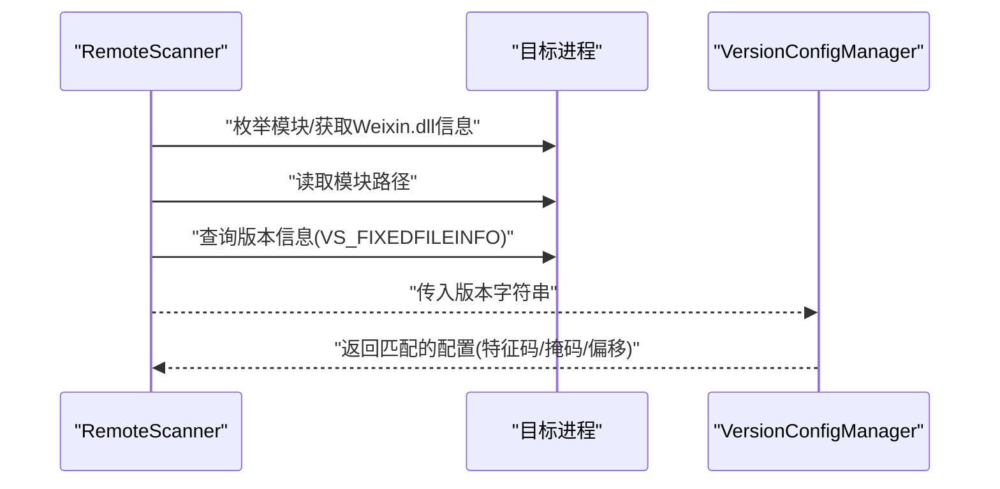
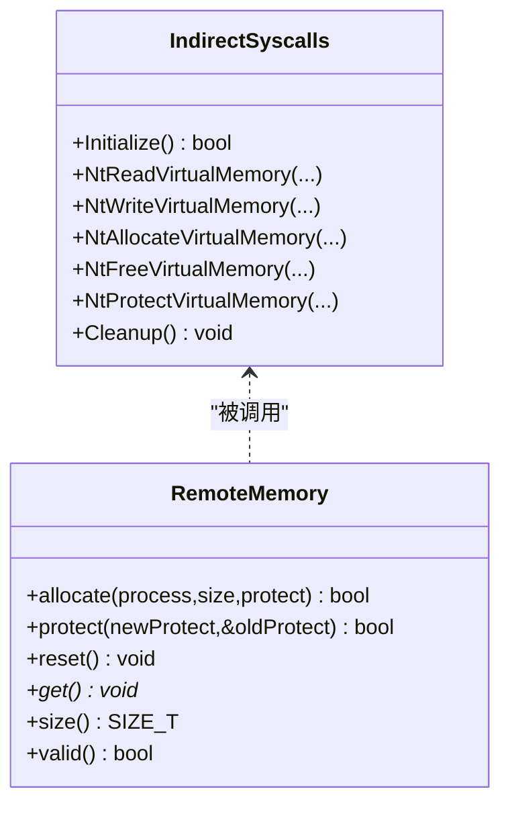
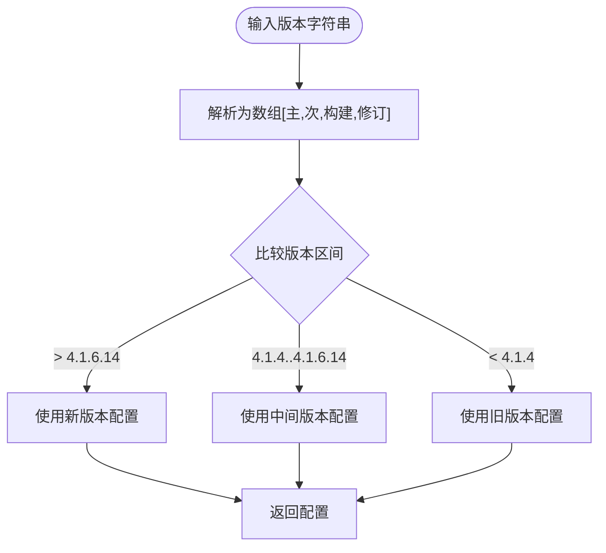
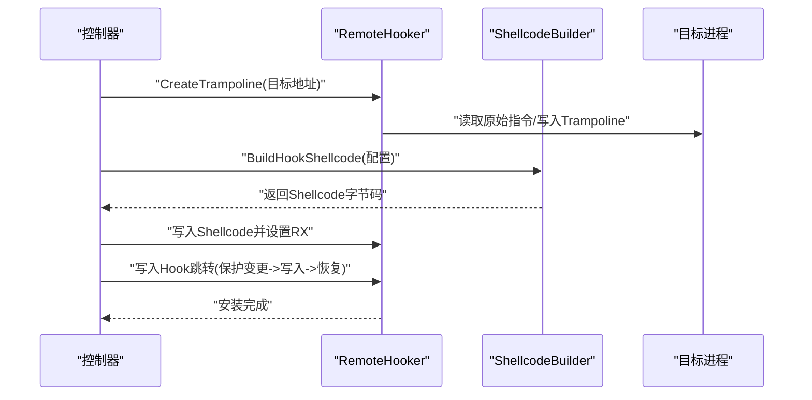
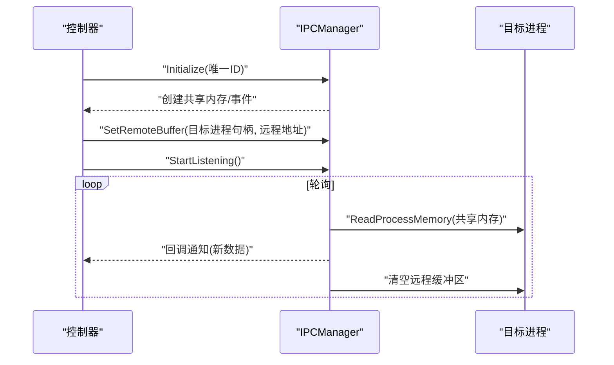
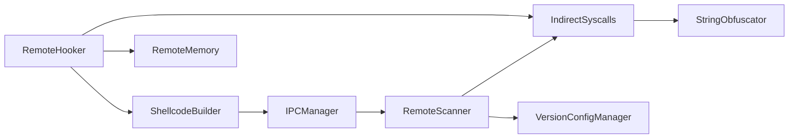

# 远程扫描器

<cite>
**本文引用的文件**
- [wx_key/src/remote_scanner.cpp](file://wx_key/src/remote_scanner.cpp)
- [wx_key/include/remote_scanner.h](file://wx_key/include/remote_scanner.h)
- [wx_key/include/remote_memory.h](file://wx_key/include/remote_memory.h)
- [wx_key/src/hook_controller.cpp](file://wx_key/src/hook_controller.cpp)
- [wx_key/include/syscalls.h](file://wx_key/include/syscalls.h)
- [wx_key/src/syscalls.cpp](file://wx_key/src/syscalls.cpp)
- [wx_key/include/remote_hooker.h](file://wx_key/include/remote_hooker.h)
- [wx_key/src/remote_hooker.cpp](file://wx_key/src/remote_hooker.cpp)
- [wx_key/include/ipc_manager.h](file://wx_key/include/ipc_manager.h)
- [wx_key/src/ipc_manager.cpp](file://wx_key/src/ipc_manager.cpp)
- [wx_key/include/shellcode_builder.h](file://wx_key/include/shellcode_builder.h)
- [wx_key/src/shellcode_builder.cpp](file://wx_key/src/shellcode_builder.cpp)
- [wx_key/include/string_obfuscator.h](file://wx_key/include/string_obfuscator.h)
</cite>

## 目录
1. [引言](#引言)
2. [项目结构](#项目结构)
3. [核心组件](#核心组件)
4. [架构总览](#架构总览)
5. [详细组件分析](#详细组件分析)
6. [依赖关系分析](#依赖关系分析)
7. [性能考虑](#性能考虑)
8. [故障排除指南](#故障排除指南)
9. [结论](#结论)
10. [附录](#附录)

## 引言
本技术文档面向“远程扫描器”子系统，聚焦于内存扫描算法、微信版本检测机制、远程内存读取安全机制、扫描配置管理、以及性能优化策略。文档同时提供使用示例与故障排除建议，帮助开发者与运维人员快速理解并正确使用该组件。

## 项目结构
该项目采用分层与按职责划分的组织方式：
- 核心扫描与版本检测：位于 wx_key/src 与 wx_key/include 下的 remote_scanner.*
- 系统调用封装与安全访问：syscalls.*
- 远程Hook与Shellcode：remote_hooker.*、shellcode_builder.*
- 进程间通信（IPC）：ipc_manager.*
- 远程内存管理：remote_memory.h
- 字符串混淆：string_obfuscator.h

```mermaid
graph TB
subgraph "远程扫描与版本检测"
RS["RemoteScanner<br/>特征码扫描/版本读取"]
VCM["VersionConfigManager<br/>版本配置管理"]
end
subgraph "系统调用与安全"
IS["IndirectSyscalls<br/>间接系统调用封装"]
RM["RemoteMemory<br/>远程内存RAII"]
end
subgraph "Hook与Shellcode"
RH["RemoteHooker<br/>安装/卸载Hook"]
SCB["ShellcodeBuilder<br/>生成Hook Shellcode"]
end
subgraph "IPC"
IPC["IPCManager<br/>共享内存轮询"]
end
RS --> IS
RS --> VCM
RH --> IS
RH --> RM
RH --> SCB
IPC --> RS
```

图示来源
- [wx_key/src/remote_scanner.cpp](file://wx_key/src/remote_scanner.cpp#L108-L261)
- [wx_key/include/remote_scanner.h](file://wx_key/include/remote_scanner.h#L15-L66)
- [wx_key/src/syscalls.cpp](file://wx_key/src/syscalls.cpp#L92-L278)
- [wx_key/include/syscalls.h](file://wx_key/include/syscalls.h#L95-L185)
- [wx_key/include/remote_memory.h](file://wx_key/include/remote_memory.h#L8-L104)
- [wx_key/src/remote_hooker.cpp](file://wx_key/src/remote_hooker.cpp#L278-L419)
- [wx_key/include/remote_hooker.h](file://wx_key/include/remote_hooker.h#L10-L70)
- [wx_key/src/shellcode_builder.cpp](file://wx_key/src/shellcode_builder.cpp#L27-L151)
- [wx_key/include/shellcode_builder.h](file://wx_key/include/shellcode_builder.h#L8-L34)
- [wx_key/src/ipc_manager.cpp](file://wx_key/src/ipc_manager.cpp#L24-L273)
- [wx_key/include/ipc_manager.h](file://wx_key/include/ipc_manager.h#L18-L76)

章节来源
- [wx_key/src/remote_scanner.cpp](file://wx_key/src/remote_scanner.cpp#L108-L261)
- [wx_key/include/remote_scanner.h](file://wx_key/include/remote_scanner.h#L15-L66)

## 核心组件
- 远程扫描器（RemoteScanner）：负责枚举远程模块、特征码匹配、分块读取与远程内存读取、微信版本读取。
- 版本配置管理（VersionConfigManager）：维护多版本的特征码与掩码、偏移量配置。
- 系统调用封装（IndirectSyscalls）：动态解析ntdll函数、构建syscall直调桩，提供NtReadVirtualMemory等安全封装。
- 远程内存管理（RemoteMemory）：基于RAII的远程内存分配/保护/释放。
- Hook管理器（RemoteHooker）：在目标进程内创建Trampoline与Shellcode，安装/卸载内联补丁。
- Shellcode构建器（ShellcodeBuilder）：使用Xbyak生成x64 Hook Shellcode，支持堆栈伪造。
- IPC管理器（IPCManager）：控制器端共享内存轮询，接收来自目标进程的数据。

章节来源
- [wx_key/include/remote_scanner.h](file://wx_key/include/remote_scanner.h#L15-L66)
- [wx_key/include/syscalls.h](file://wx_key/include/syscalls.h#L95-L185)
- [wx_key/include/remote_memory.h](file://wx_key/include/remote_memory.h#L8-L104)
- [wx_key/include/remote_hooker.h](file://wx_key/include/remote_hooker.h#L10-L70)
- [wx_key/include/shellcode_builder.h](file://wx_key/include/shellcode_builder.h#L8-L34)
- [wx_key/include/ipc_manager.h](file://wx_key/include/ipc_manager.h#L18-L76)

## 架构总览
远程扫描器工作流概览如下：



图示来源
- [wx_key/src/hook_controller.cpp](file://wx_key/src/hook_controller.cpp#L258-L314)
- [wx_key/src/remote_scanner.cpp](file://wx_key/src/remote_scanner.cpp#L119-L259)
- [wx_key/src/syscalls.cpp](file://wx_key/src/syscalls.cpp#L139-L153)

## 详细组件分析

### 内存扫描算法与特征码匹配
- 模式匹配：支持掩码匹配（通配符），逐字节比较，掩码为“?”表示忽略。
- 地址搜索：遍历模块镜像，按固定块大小分块读取，避免一次性读取整个模块导致的高延迟与内存压力。
- 数据提取：在本地缓冲区进行匹配，减少对远程进程的多次系统调用。



图示来源
- [wx_key/src/remote_scanner.cpp](file://wx_key/src/remote_scanner.cpp#L163-L204)
- [wx_key/src/syscalls.cpp](file://wx_key/src/syscalls.cpp#L139-L153)

章节来源
- [wx_key/src/remote_scanner.cpp](file://wx_key/src/remote_scanner.cpp#L149-L204)

### 微信版本检测机制
- 模块枚举：通过枚举远程进程模块定位Weixin.dll。
- 版本字符串解析：读取模块文件版本信息，解析主/次/构建/修订号。
- 兼容性验证：根据版本范围选择对应配置，若不在支持范围内则拒绝。



图示来源
- [wx_key/src/remote_scanner.cpp](file://wx_key/src/remote_scanner.cpp#L219-L259)
- [wx_key/src/remote_scanner.cpp](file://wx_key/src/remote_scanner.cpp#L76-L106)

章节来源
- [wx_key/src/remote_scanner.cpp](file://wx_key/src/remote_scanner.cpp#L19-L43)
- [wx_key/src/remote_scanner.cpp](file://wx_key/src/remote_scanner.cpp#L76-L106)

### 远程内存读取的安全机制
- 间接系统调用：动态解析ntdll函数，必要时从干净ntdll提取SSN构建syscall直调桩，降低EDR检测风险。
- 权限检查：通过NtOpenProcess打开目标进程句柄；读写/保护调用返回NTSTATUS，结合返回值判定成功与否。
- 地址验证：读取前进行保护属性变更（PAGE_EXECUTE_READWRITE）以写入Hook跳转，随后恢复旧保护，保证原子性与一致性。
- 异常处理：各接口统一返回布尔值或NTSTATUS，调用方需检查返回值并进行错误处理。



图示来源
- [wx_key/include/syscalls.h](file://wx_key/include/syscalls.h#L95-L185)
- [wx_key/src/syscalls.cpp](file://wx_key/src/syscalls.cpp#L92-L278)
- [wx_key/include/remote_memory.h](file://wx_key/include/remote_memory.h#L8-L104)

章节来源
- [wx_key/src/syscalls.cpp](file://wx_key/src/syscalls.cpp#L92-L278)
- [wx_key/include/remote_memory.h](file://wx_key/include/remote_memory.h#L34-L85)

### 扫描配置管理
- 版本特定配置：针对不同微信版本（如4.1.6.14以上、4.1.4至4.1.6.14、4.1.4以下）分别提供特征码、掩码与偏移量。
- 配置选择逻辑：解析版本字符串，比较主/次/构建/修订字段，选择最合适的配置。



图示来源
- [wx_key/src/remote_scanner.cpp](file://wx_key/src/remote_scanner.cpp#L45-L106)

章节来源
- [wx_key/src/remote_scanner.cpp](file://wx_key/src/remote_scanner.cpp#L45-L106)

### Hook与Shellcode流程
- Trampoline：备份目标函数前若干字节指令，生成回跳指令，确保原始函数继续执行。
- Shellcode：保存寄存器/标志位，拷贝密钥到共享内存，递增序列号，恢复寄存器并跳回Trampoline。
- 堆栈伪造：在启用时将关键寄存器暂存到真实栈，切换到对齐后的伪栈，再恢复真实栈指针。



图示来源
- [wx_key/src/remote_hooker.cpp](file://wx_key/src/remote_hooker.cpp#L197-L389)
- [wx_key/src/shellcode_builder.cpp](file://wx_key/src/shellcode_builder.cpp#L27-L151)

章节来源
- [wx_key/src/remote_hooker.cpp](file://wx_key/src/remote_hooker.cpp#L278-L419)
- [wx_key/src/shellcode_builder.cpp](file://wx_key/src/shellcode_builder.cpp#L27-L151)

### IPC轮询机制
- 共享内存：创建命名共享内存，零初始化，作为密钥缓冲区。
- 事件同步：创建事件对象，用于唤醒监听线程。
- 轮询读取：监听线程周期性读取远程进程共享内存，通过序列号去重，回调通知上层。



图示来源
- [wx_key/src/ipc_manager.cpp](file://wx_key/src/ipc_manager.cpp#L24-L273)

章节来源
- [wx_key/include/ipc_manager.h](file://wx_key/include/ipc_manager.h#L18-L76)
- [wx_key/src/ipc_manager.cpp](file://wx_key/src/ipc_manager.cpp#L212-L271)

## 依赖关系分析
- RemoteScanner依赖IndirectSyscalls进行远程内存读取，依赖VersionConfigManager进行版本适配。
- RemoteHooker依赖IndirectSyscalls进行远程读写/保护，依赖RemoteMemory进行内存生命周期管理，依赖ShellcodeBuilder生成Shellcode。
- IPCManager依赖系统共享内存与事件API，轮询RemoteScanner提供的远程缓冲区。
- 字符串混淆用于隐藏敏感字符串，降低静态检测风险。



图示来源
- [wx_key/src/remote_scanner.cpp](file://wx_key/src/remote_scanner.cpp#L1-L10)
- [wx_key/src/hook_controller.cpp](file://wx_key/src/hook_controller.cpp#L11-L20)
- [wx_key/include/string_obfuscator.h](file://wx_key/include/string_obfuscator.h#L42-L58)

章节来源
- [wx_key/src/hook_controller.cpp](file://wx_key/src/hook_controller.cpp#L11-L20)

## 性能考虑
- 并行扫描：当前实现按块顺序扫描，未显式使用多线程。可在模块内对不同段落或不同特征码并行扫描（需注意线程安全与竞争条件）。
- 缓存机制：RemoteScanner预分配扫描缓冲区，避免频繁分配；IPC轮询加入轻微抖动，降低稳定特征。
- 资源管理：RemoteMemory采用RAII自动释放；IndirectSyscalls在初始化阶段解析函数并构建直调桩，减少重复解析成本。
- I/O优化：分块读取减少单次系统调用负载；掩码匹配在本地完成，降低远程交互次数。

章节来源
- [wx_key/src/remote_scanner.cpp](file://wx_key/src/remote_scanner.cpp#L112-L114)
- [wx_key/src/ipc_manager.cpp](file://wx_key/src/ipc_manager.cpp#L214-L217)
- [wx_key/include/remote_memory.h](file://wx_key/include/remote_memory.h#L34-L65)
- [wx_key/src/syscalls.cpp](file://wx_key/src/syscalls.cpp#L92-L117)

## 故障排除指南
- 打开进程失败：检查目标PID是否存在、权限是否足够、是否被防护软件拦截。查看NTSTATUS与Win32错误消息。
- 版本检测失败：确认Weixin.dll是否加载、模块路径是否可读、版本信息查询是否成功。
- 特征码匹配失败：确认传入的特征码与掩码是否正确、偏移量是否匹配当前版本；检查返回结果数量是否为1。
- Hook安装失败：检查目标函数地址是否有效、原始指令长度计算是否正确、保护属性变更是否成功。
- IPC轮询无数据：确认共享内存/事件名称是否一致、目标进程是否写入数据、序列号是否变化、是否被清空。

章节来源
- [wx_key/src/hook_controller.cpp](file://wx_key/src/hook_controller.cpp#L225-L281)
- [wx_key/src/remote_scanner.cpp](file://wx_key/src/remote_scanner.cpp#L119-L147)
- [wx_key/src/remote_hooker.cpp](file://wx_key/src/remote_hooker.cpp#L278-L389)
- [wx_key/src/ipc_manager.cpp](file://wx_key/src/ipc_manager.cpp#L212-L271)

## 结论
该远程扫描器通过模块化设计实现了特征码扫描、版本检测、远程内存读取与Hook注入的完整链路。其关键优势在于：
- 使用分块扫描与本地匹配提升性能；
- 通过间接系统调用与字符串混淆增强隐蔽性；
- 以配置管理适配多版本微信；
- 以IPC轮询实现跨进程数据传输。

建议在生产环境中进一步引入并行扫描、更细粒度的错误分类与重试策略，并持续维护版本配置以覆盖新版本微信。

## 附录
- 使用示例（步骤说明）
  1) 初始化系统调用：调用初始化函数以解析ntdll函数并构建直调桩。
  2) 打开目标进程：使用进程ID打开目标进程句柄。
  3) 获取微信版本：读取Weixin.dll版本信息。
  4) 选择配置：根据版本选择对应的特征码/掩码/偏移。
  5) 查找目标地址：在Weixin.dll中扫描特征码，得到目标函数地址并应用偏移。
  6) 分配远程数据缓冲区与伪栈：为共享内存与堆栈伪造分配内存。
  7) 初始化IPC：创建共享内存与事件，设置回调。
  8) 安装Hook：生成Shellcode并写入目标函数，安装内联补丁。
  9) 轮询密钥：通过IPC轮询共享内存，获取密钥数据。
  10) 清理资源：卸载Hook、关闭句柄、释放内存。

- 关键API参考
  - RemoteScanner
    - 枚举模块：GetRemoteModuleInfo
    - 特征码匹配：FindPattern / FindAllPatterns
    - 远程读取：ReadRemoteMemory
    - 版本读取：GetWeChatVersion
  - VersionConfigManager
    - 初始化：InitializeConfigs
    - 选择配置：GetConfigForVersion
  - IndirectSyscalls
    - NtReadVirtualMemory / NtWriteVirtualMemory / NtAllocateVirtualMemory / NtFreeVirtualMemory / NtProtectVirtualMemory
  - RemoteHooker
    - InstallHook / UninstallHook / GetTrampolineAddress / GetRemoteShellcodeAddress
  - ShellcodeBuilder
    - BuildHookShellcode / GetShellcodeSize
  - IPCManager
    - Initialize / SetRemoteBuffer / SetDataCallback / StartListening / StopListening

章节来源
- [wx_key/include/remote_scanner.h](file://wx_key/include/remote_scanner.h#L15-L44)
- [wx_key/include/remote_scanner.h](file://wx_key/include/remote_scanner.h#L57-L66)
- [wx_key/include/syscalls.h](file://wx_key/include/syscalls.h#L95-L155)
- [wx_key/include/remote_hooker.h](file://wx_key/include/remote_hooker.h#L10-L40)
- [wx_key/include/shellcode_builder.h](file://wx_key/include/shellcode_builder.h#L18-L34)
- [wx_key/include/ipc_manager.h](file://wx_key/include/ipc_manager.h#L18-L53)