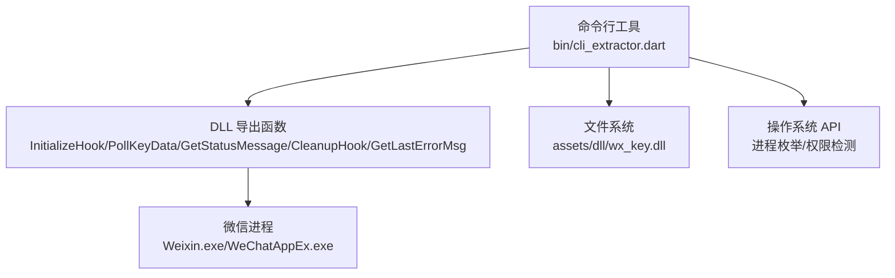
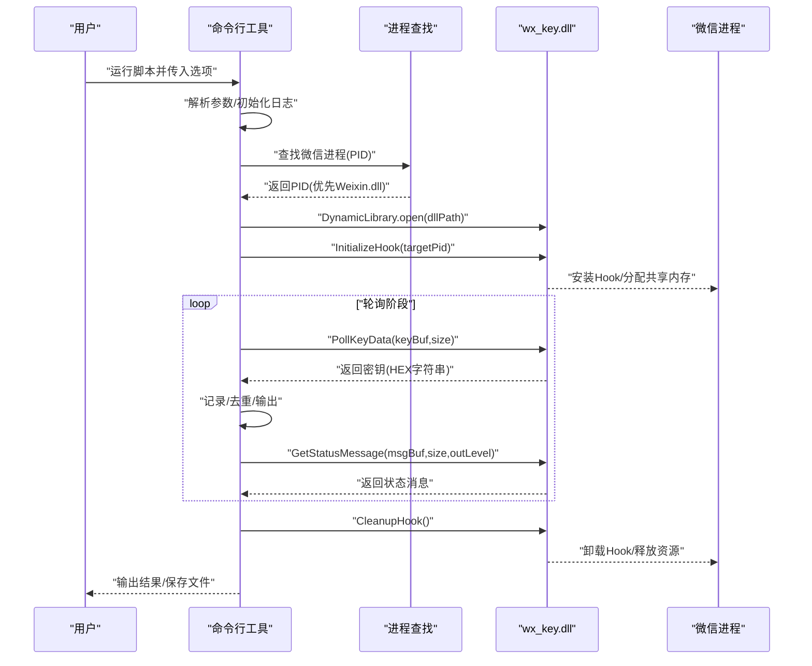
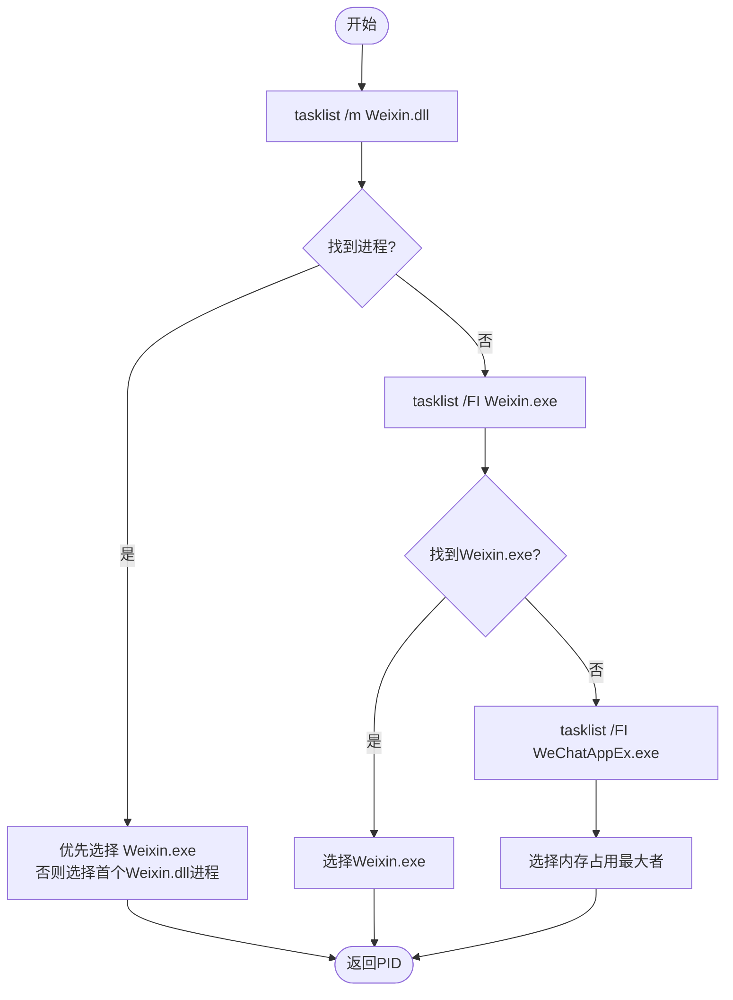
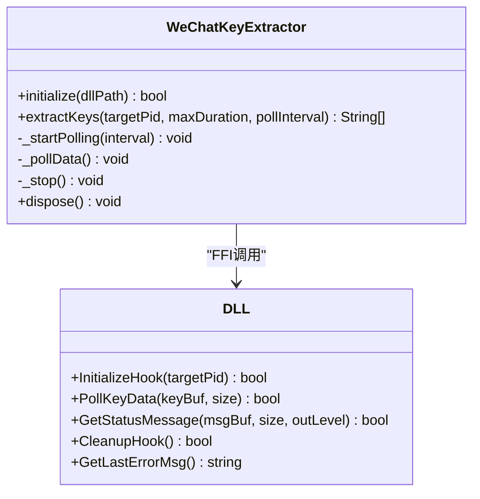
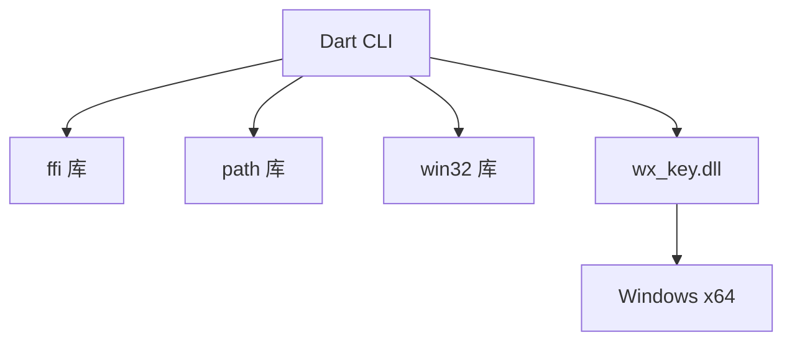
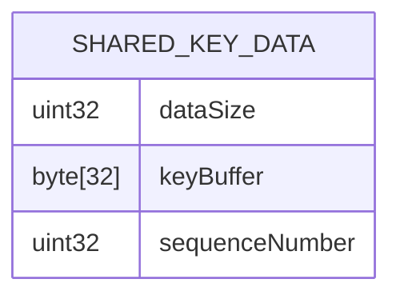

# 命令行工具

<cite>
**本文引用的文件**
- [README.md](file://README.md)
- [bin/README.md](file://bin/README.md)
- [bin/cli_extractor.dart](file://bin/cli_extractor.dart)
- [pubspec.yaml](file://pubspec.yaml)
- [docs/dll_usage.md](file://docs/dll_usage.md)
- [wx_key/include/hook_controller.h](file://wx_key/include/hook_controller.h)
- [wx_key/include/remote_scanner.h](file://wx_key/include/remote_scanner.h)
- [wx_key/include/ipc_manager.h](file://wx_key/include/ipc_manager.h)
</cite>

## 目录
1. [简介](#简介)
2. [项目结构](#项目结构)
3. [核心组件](#核心组件)
4. [架构总览](#架构总览)
5. [详细组件分析](#详细组件分析)
6. [依赖分析](#依赖分析)
7. [性能考量](#性能考量)
8. [故障排除指南](#故障排除指南)
9. [结论](#结论)
10. [附录](#附录)

## 简介
本文件为 wx_key 命令行工具的完整使用文档。该工具面向微信 4.x 版本，用于在无图形界面的环境下提取微信数据库密钥与缓存图片解密所需的密钥。它通过 Dart 脚本调用原生 DLL（FFI），在目标微信进程中安装远程 Hook 并轮询共享内存中的密钥数据，适合自动化脚本集成与批量处理场景。

- 设计目标与适用场景
  - 无需 GUI，适合 CI/CD、批处理脚本、无人值守环境。
  - 通过命令行参数灵活控制轮询间隔、超时时间、输出文件等。
  - 与图形界面版本共享同一 DLL 核心能力，功能一致，差异在于交互方式与日志输出。

- 功能概述
  - 自动定位微信进程（优先加载 Weixin.dll 的进程）。
  - 通过 DLL 初始化 Hook，轮询获取密钥数据。
  - 支持将密钥输出到控制台与文件，支持详细日志模式。
  - 提供错误诊断与状态消息，便于排障。

**章节来源**
- [README.md](file://README.md#L31-L56)
- [bin/README.md](file://bin/README.md#L3-L6)

## 项目结构
命令行工具位于 bin/cli_extractor.dart，配合 assets/dll/wx_key.dll 使用。核心目录与文件如下：
- bin/cli_extractor.dart：命令行入口与业务逻辑（参数解析、进程查找、DLL 调用、轮询、日志、输出）。
- assets/dll/wx_key.dll：原生 DLL，提供 InitializeHook、PollKeyData、GetStatusMessage、CleanupHook、GetLastErrorMsg 等导出函数。
- docs/dll_usage.md：DLL 接口与调用流程说明，便于理解 CLI 的工作原理。
- wx_key/include/*.h：DLL 头文件，定义 Hook 控制器、远程扫描器、IPC 管理器等接口与数据结构。

**图表来源**
- [bin/cli_extractor.dart](file://bin/cli_extractor.dart#L106-L147)
- [docs/dll_usage.md](file://docs/dll_usage.md#L21-L31)
- [wx_key/include/hook_controller.h](file://wx_key/include/hook_controller.h#L12-L46)

**章节来源**
- [bin/README.md](file://bin/README.md#L7-L26)
- [pubspec.yaml](file://pubspec.yaml#L84-L86)

## 核心组件
- 命令行参数解析器（ArgParser）
  - 支持选项：pid、dll、interval、timeout、output、verbose、help。
  - 默认值：dll 默认指向 assets/dll/wx_key.dll；interval 默认 100ms；timeout 默认 300s；verbose 默认关闭。
- 日志系统（Logger）
  - 支持 info/success/error/debug 四级日志，彩色输出，可选详细模式。
- 微信密钥提取器（WeChatKeyExtractor）
  - 通过 FFI 加载 DLL 并查找导出函数。
  - 初始化 Hook、启动轮询、读取密钥、读取状态消息、清理 Hook。
- 进程查找器（findWeChatProcess）
  - 优先选择加载 Weixin.dll 的进程；若失败回退到 Weixin.exe 或 WeChatAppEx.exe。
- 主流程（main）
  - 解析参数 → 初始化日志 → 查找微信进程 → 初始化 DLL → 提取密钥 → 输出与保存 → 释放资源。

**章节来源**
- [bin/cli_extractor.dart](file://bin/cli_extractor.dart#L430-L471)
- [bin/cli_extractor.dart](file://bin/cli_extractor.dart#L60-L90)
- [bin/cli_extractor.dart](file://bin/cli_extractor.dart#L93-L323)
- [bin/cli_extractor.dart](file://bin/cli_extractor.dart#L325-L418)
- [bin/cli_extractor.dart](file://bin/cli_extractor.dart#L474-L561)

## 架构总览
命令行工具的调用序列如下：

**图表来源**
- [bin/cli_extractor.dart](file://bin/cli_extractor.dart#L523-L560)
- [docs/dll_usage.md](file://docs/dll_usage.md#L35-L58)
- [wx_key/include/hook_controller.h](file://wx_key/include/hook_controller.h#L12-L46)

## 详细组件分析

### 命令行参数与使用方法
- 参数说明
  - -p, --pid：目标微信进程 PID（可选，自动查找优先加载 Weixin.dll 的进程）。
  - -d, --dll：DLL 文件路径，默认 assets/dll/wx_key.dll。
  - -i, --interval：轮询间隔（毫秒），默认 100。
  - -t, --timeout：超时时间（秒），默认 300。
  - -o, --output：输出文件路径（可选）。
  - -v, --verbose：详细输出模式。
  - -h, --help：显示帮助信息。
- 使用示例
  - 自动查找进程并提取：dart bin/cli_extractor.dart
  - 指定 PID、超时与输出：dart bin/cli_extractor.dart -p 5678 -t 300 -o keys.txt
  - 详细模式与自定义 DLL 路径：dart bin/cli_extractor.dart -v -d "C:\path\to\wx_key.dll"
  - 快速提取并 30 秒超时：dart bin/cli_extractor.dart -t 30

**章节来源**
- [bin/README.md](file://bin/README.md#L28-L54)
- [bin/cli_extractor.dart](file://bin/cli_extractor.dart#L430-L471)

### 进程查找策略
- 优先策略：tasklist 按模块 Weixin.dll 过滤，优先选择 Weixin.exe。
- 回退策略：tasklist 过滤 Weixin.exe；若仍失败，tasklist 过滤 WeChatAppEx.exe 并选择内存占用最大的实例。
- 失败处理：若均失败，提示用户手动指定 PID。

**图表来源**
- [bin/cli_extractor.dart](file://bin/cli_extractor.dart#L325-L418)

**章节来源**
- [bin/cli_extractor.dart](file://bin/cli_extractor.dart#L325-L418)

### DLL 接口与轮询机制
- DLL 导出函数
  - InitializeHook：初始化 Hook，返回布尔值；失败可通过 GetLastErrorMsg 获取错误信息。
  - PollKeyData：非阻塞轮询，返回密钥（64 位十六进制字符串）。
  - GetStatusMessage：获取状态消息与级别（0=Info, 1=Success, 2=Error）。
  - CleanupHook：清理 Hook 与共享内存。
  - GetLastErrorMsg：获取最后一次错误信息。
- 轮询与状态读取
  - CLI 以固定间隔调用 PollKeyData 与 GetStatusMessage，读取共享内存中的密钥与 DLL 内部日志。
  - 一旦提取到密钥，可提前结束轮询（取决于实现细节）。

**图表来源**
- [bin/cli_extractor.dart](file://bin/cli_extractor.dart#L93-L323)
- [wx_key/include/hook_controller.h](file://wx_key/include/hook_controller.h#L12-L46)

**章节来源**
- [docs/dll_usage.md](file://docs/dll_usage.md#L21-L31)
- [wx_key/include/hook_controller.h](file://wx_key/include/hook_controller.h#L12-L46)

### 日志与错误处理
- 日志级别与输出
  - info/success/error/debug 四级日志，支持彩色输出与详细模式。
  - DLL 状态消息通过 GetStatusMessage 获取，按级别映射到不同颜色。
- 错误处理
  - DLL 加载失败、初始化失败、轮询异常、Hook 卸载失败均有相应错误输出。
  - 通过 GetLastErrorMsg 获取具体错误原因，便于排障。

**章节来源**
- [bin/cli_extractor.dart](file://bin/cli_extractor.dart#L60-L90)
- [bin/cli_extractor.dart](file://bin/cli_extractor.dart#L264-L280)
- [docs/dll_usage.md](file://docs/dll_usage.md#L42-L49)

### 与图形界面版本的功能对应与差异
- 功能一致性
  - 两者共享同一 DLL 核心能力，均可提取数据库密钥与图片密钥。
- 交互差异
  - CLI 无图形界面，通过命令行参数与标准输出/文件输出工作。
  - UI 版本提供可视化状态、日志面板、自动注入流程与持久化存储。
- 适用场景
  - CLI 更适合自动化、批处理、CI/CD 环境。
  - UI 版本更适合交互式使用与人工确认。

**章节来源**
- [README.md](file://README.md#L77-L96)
- [bin/README.md](file://bin/README.md#L110-L121)

## 依赖分析
- Dart 依赖
  - ffi：用于加载与调用原生 DLL。
  - path：路径处理。
  - win32：Windows 平台能力（权限检测使用 fltmc）。
- DLL 依赖
  - Windows 平台与 x64 架构。
  - 需要管理员权限以进行进程注入与内存读取。
- 版本与兼容性
  - 支持微信 4.x 版本，UI 与 CLI 均基于同一 DLL 与扫描逻辑。

**图表来源**
- [pubspec.yaml](file://pubspec.yaml#L38-L51)
- [docs/dll_usage.md](file://docs/dll_usage.md#L15-L17)

**章节来源**
- [pubspec.yaml](file://pubspec.yaml#L30-L61)
- [docs/dll_usage.md](file://docs/dll_usage.md#L15-L17)

## 性能考量
- 轮询间隔（-i/--interval）
  - 建议不低于 50ms，避免过高 CPU 占用；默认 100ms 已较平衡。
- 超时时间（-t/--timeout）
  - 根据网络与环境调整，建议 300s 以上以覆盖复杂场景。
- 输出与 I/O
  - 大量密钥输出时建议使用 -o 指定文件，减少控制台渲染压力。
- 进程查找
  - 优先 Weixin.dll 进程可减少误选，提高成功率。

[本节为通用建议，不直接分析具体文件]

## 故障排除指南
- DLL 加载失败
  - 确认 DLL 文件存在且路径正确；尝试以管理员身份运行。
- 找不到微信进程
  - 确保微信已启动；若自动查找失败，使用 tasklist /m Weixin.dll 或 tasklist /FI "IMAGENAME eq Weixin.exe" 手动获取 PID。
- 提取失败
  - 检查微信版本是否受支持；确认管理员权限；查看详细输出中的 DLL 状态消息与错误信息。
- 权限问题
  - 若非管理员，工具会尝试 UAC 提权；若被阻止，请手动以管理员身份运行终端。
- 输出与日志
  - 使用 -v 开启详细模式，结合 DLL 状态消息定位问题。

**章节来源**
- [bin/README.md](file://bin/README.md#L92-L125)
- [bin/cli_extractor.dart](file://bin/cli_extractor.dart#L485-L511)

## 结论
命令行工具通过简洁的参数与稳定的 DLL 能力，实现了微信密钥提取的自动化与批量化。它与图形界面版本共享核心逻辑，适合在无人值守与集成环境中使用。建议在生产脚本中合理设置轮询间隔与超时时间，并结合详细日志与错误信息进行排障。

[本节为总结，不直接分析具体文件]

## 附录

### 常用命令速查
- 自动提取：dart bin/cli_extractor.dart
- 指定 PID/超时/输出：dart bin/cli_extractor.dart -p 5678 -t 300 -o keys.txt
- 详细模式与自定义 DLL：dart bin/cli_extractor.dart -v -d "C:\path\to\wx_key.dll"
- 快速提取（30 秒）：dart bin/cli_extractor.dart -t 30

**章节来源**
- [bin/README.md](file://bin/README.md#L40-L54)

### 数据模型与共享内存（概念示意）

**图表来源**
- [wx_key/include/ipc_manager.h](file://wx_key/include/ipc_manager.h#L9-L16)