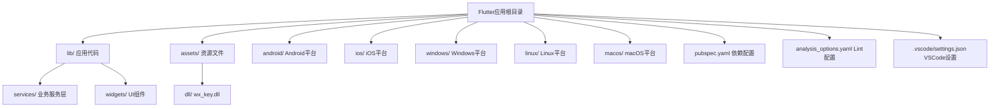
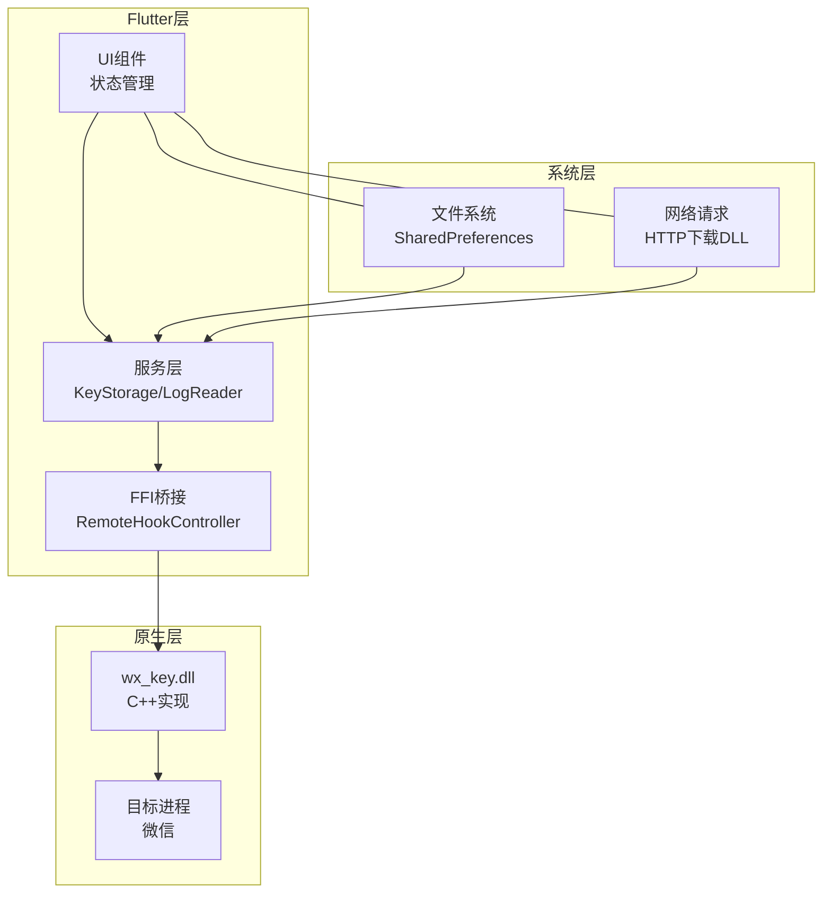
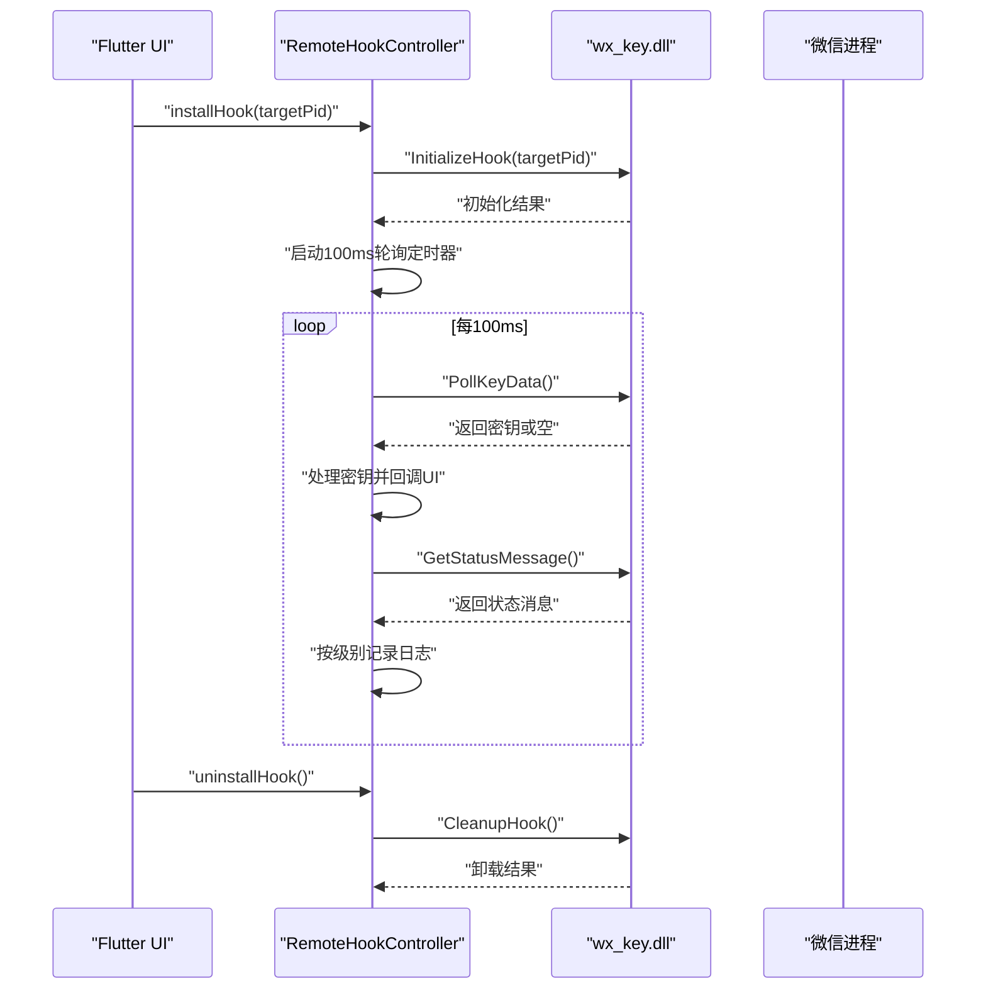
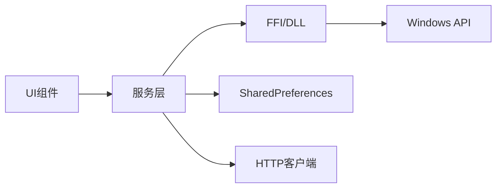

# Flutter开发环境配置

<cite>
**本文档引用的文件**
- [pubspec.yaml](file://pubspec.yaml)
- [analysis_options.yaml](file://analysis_options.yaml)
- [README.md](file://README.md)
- [main.dart](file://lib/main.dart)
- [remote_hook_controller.dart](file://lib/services/remote_hook_controller.dart)
- [key_storage.dart](file://lib/services/key_storage.dart)
- [cli_extractor.dart](file://bin/cli_extractor.dart)
- [settings.json](file://.vscode/settings.json)
- [build.gradle.kts](file://android/app/build.gradle.kts)
- [main.cpp](file://windows/runner/main.cpp)
- [main.cc](file://linux/runner/main.cc)
- [MainFlutterWindow.swift](file://macos/Runner/MainFlutterWindow.swift)
</cite>

## 目录
1. [简介](#简介)
2. [项目结构](#项目结构)
3. [核心组件](#核心组件)
4. [架构总览](#架构总览)
5. [详细组件分析](#详细组件分析)
6. [依赖关系分析](#依赖关系分析)
7. [性能考虑](#性能考虑)
8. [故障排除指南](#故障排除指南)
9. [结论](#结论)

## 简介
本指南面向使用本项目的开发者，提供从零搭建Flutter开发环境的完整配置方案。重点覆盖：
- Flutter SDK版本要求与安装验证（当前项目使用3.9.2）
- 依赖管理策略与版本控制（核心依赖如ffi、win32、shared_preferences等）
- 分析选项配置（代码规范检查与lint规则）
- 开发工具链配置（IDE设置、调试配置、热重载）
- 常见环境问题排查与解决方案

## 项目结构
该项目采用标准Flutter多平台工程结构，包含Windows、Linux、macOS、Android、iOS等平台的原生集成层，以及基于FFI的C++ DLL桥接。

图表来源
- [pubspec.yaml](file://pubspec.yaml#L1-L112)
- [README.md](file://README.md#L77-L96)

章节来源
- [pubspec.yaml](file://pubspec.yaml#L1-L112)
- [README.md](file://README.md#L77-L96)

## 核心组件
- Flutter SDK版本：^3.9.2（在环境配置段明确指定）
- 依赖管理：通过pubspec.yaml集中声明，dev_dependencies用于lint规则
- 分析选项：analysis_options.yaml继承flutter_lints推荐规则集
- FFI与原生集成：使用ffi、win32访问Windows本地API；通过shared_preferences进行本地持久化
- 资源与字体：assets中包含DLL与字体资源，flutter段声明字体映射

章节来源
- [pubspec.yaml](file://pubspec.yaml#L21-L22)
- [pubspec.yaml](file://pubspec.yaml#L30-L61)
- [analysis_options.yaml](file://analysis_options.yaml#L8-L10)

## 架构总览
应用采用“Flutter UI + FFI桥接 + 原生DLL”的混合架构，核心流程是通过RemoteHookController加载并调用wx_key.dll，轮询目标进程（微信）以提取密钥。

图表来源
- [main.dart](file://lib/main.dart#L16-L35)
- [remote_hook_controller.dart](file://lib/services/remote_hook_controller.dart#L34-L87)
- [key_storage.dart](file://lib/services/key_storage.dart#L5-L30)

## 详细组件分析

### Flutter SDK与环境配置
- 版本要求：SDK约束为^3.9.2，需确保本地Flutter版本满足该范围
- 版本验证：可通过flutter --version查看当前版本
- 平台支持：项目包含Windows、Linux、macOS、Android、iOS平台配置

章节来源
- [pubspec.yaml](file://pubspec.yaml#L21-L22)
- [README.md](file://README.md#L115-L132)

### 依赖管理策略
- 核心依赖用途与版本控制要点：
  - ffi：用于动态加载wx_key.dll并调用导出函数
  - win32：访问Windows API（与FFI配合）
  - shared_preferences：本地持久化（密钥、路径等）
  - path/path_provider：文件路径处理
  - http：下载DLL（用于自动化流程）
  - url_launcher：打开外部链接
  - window_manager：跨平台窗口管理
  - pointycastle：AES加密/解密
- 依赖获取：使用flutter pub get安装
- 版本升级：可通过flutter pub upgrade或手动更新版本号

章节来源
- [pubspec.yaml](file://pubspec.yaml#L30-L61)
- [pubspec.yaml](file://pubspec.yaml#L62-L71)

### 分析选项与Lint规则
- 规则集：继承flutter_lints推荐规则
- 自定义：可在analysis_options.yaml的rules段启用/禁用特定规则
- 常用实践：避免print、偏好单引号等规则可根据团队规范调整

章节来源
- [analysis_options.yaml](file://analysis_options.yaml#L8-L10)
- [analysis_options.yaml](file://analysis_options.yaml#L23-L25)

### FFI与原生桥接
- DLL加载：RemoteHookController通过DynamicLibrary.open加载wx_key.dll
- 导出函数绑定：定义InitializeHook、PollKeyData、GetStatusMessage、CleanupHook、GetLastErrorMsg等函数类型
- 轮询机制：每100ms轮询一次，读取密钥与状态消息
- 错误处理：统一通过日志记录与错误消息获取函数反馈

图表来源
- [remote_hook_controller.dart](file://lib/services/remote_hook_controller.dart#L89-L128)
- [remote_hook_controller.dart](file://lib/services/remote_hook_controller.dart#L146-L204)
- [remote_hook_controller.dart](file://lib/services/remote_hook_controller.dart#L206-L235)

章节来源
- [remote_hook_controller.dart](file://lib/services/remote_hook_controller.dart#L34-L87)
- [remote_hook_controller.dart](file://lib/services/remote_hook_controller.dart#L130-L144)

### 本地持久化与状态管理
- KeyStorage封装SharedPreferences，提供密钥、图片密钥、DLL路径等的读写与清理
- UI状态：MyHomePage维护微信进程状态、密钥提取状态、日志列表等

章节来源
- [key_storage.dart](file://lib/services/key_storage.dart#L5-L30)
- [main.dart](file://lib/main.dart#L420-L492)

### 命令行工具与自动化
- cli_extractor.dart提供命令行版本，支持自动查找微信进程、轮询提取密钥、输出到文件
- 参数解析：支持PID、DLL路径、轮询间隔、超时、输出文件、详细日志等

章节来源
- [cli_extractor.dart](file://bin/cli_extractor.dart#L430-L471)
- [cli_extractor.dart](file://bin/cli_extractor.dart#L325-L418)

### 平台构建配置
- Android：Gradle插件顺序与Java版本配置
- Windows/Linux/macOS：主入口与窗口初始化

章节来源
- [build.gradle.kts](file://android/app/build.gradle.kts#L1-L45)
- [main.cpp](file://windows/runner/main.cpp#L8-L33)
- [main.cc](file://linux/runner/main.cc#L1-L7)
- [MainFlutterWindow.swift](file://macos/Runner/MainFlutterWindow.swift#L4-L14)

## 依赖关系分析
- 低耦合：Flutter层通过服务抽象与FFI隔离原生细节
- 明确边界：UI仅负责展示与交互，服务层负责业务逻辑与持久化
- 外部依赖：FFI、win32、shared_preferences等作为横切关注点被集中使用

图表来源
- [main.dart](file://lib/main.dart#L1-L15)
- [remote_hook_controller.dart](file://lib/services/remote_hook_controller.dart#L1-L7)
- [key_storage.dart](file://lib/services/key_storage.dart#L1)

章节来源
- [pubspec.yaml](file://pubspec.yaml#L30-L61)

## 性能考虑
- 轮询频率：默认100ms，兼顾响应性与CPU占用，可根据平台能力调整
- 内存管理：FFI缓冲区使用calloc分配并在finally块释放，避免泄漏
- I/O优化：SharedPreferences批量读写，减少磁盘访问次数
- 网络下载：HTTP请求应设置超时与断点续传策略（如需）

## 故障排除指南
- DLL加载失败
  - 症状：初始化DLL失败、错误消息提示
  - 排查：确认DLL路径存在、工作目录正确、无中文路径限制
  - 参考：[remote_hook_controller.dart](file://lib/services/remote_hook_controller.dart#L47-L87)
- 微信进程未找到
  - 症状：未检测到微信安装目录、无法启动
  - 排查：确认微信已安装、路径配置正确、以管理员权限运行
  - 参考：[main.dart](file://lib/main.dart#L564-L592)
- 热重载/调试异常
  - 症状：热重载不生效、断点无效
  - 排查：检查VSCode设置、Flutter SDK路径、平台插件安装
  - 参考：[settings.json](file://.vscode/settings.json#L1-L7)
- Lint报错
  - 症状：静态分析失败
  - 排查：根据analysis_options.yaml调整规则或忽略特定文件
  - 参考：[analysis_options.yaml](file://analysis_options.yaml#L12-L25)
- 平台构建问题
  - Windows：确认Visual Studio与CMake可用
  - Linux：确保GTK/GLib/GIO开发包齐全
  - macOS：确认Xcode与Flutter macOS插件
  - 参考：[build.gradle.kts](file://android/app/build.gradle.kts#L1-L45)、[main.cpp](file://windows/runner/main.cpp#L1-L44)、[main.cc](file://linux/runner/main.cc#L1-L7)、[MainFlutterWindow.swift](file://macos/Runner/MainFlutterWindow.swift#L1-L16)

章节来源
- [remote_hook_controller.dart](file://lib/services/remote_hook_controller.dart#L237-L253)
- [main.dart](file://lib/main.dart#L564-L592)
- [settings.json](file://.vscode/settings.json#L1-L7)
- [analysis_options.yaml](file://analysis_options.yaml#L12-L25)
- [build.gradle.kts](file://android/app/build.gradle.kts#L1-L45)
- [main.cpp](file://windows/runner/main.cpp#L1-L44)
- [main.cc](file://linux/runner/main.cc#L1-L7)
- [MainFlutterWindow.swift](file://macos/Runner/MainFlutterWindow.swift#L1-L16)

## 结论
本指南提供了基于当前项目配置的完整Flutter开发环境搭建方案，涵盖SDK版本、依赖管理、分析规则、FFI桥接、平台构建与常见问题排查。遵循上述配置可确保在Windows/Linux/macOS平台上稳定运行并高效开发。