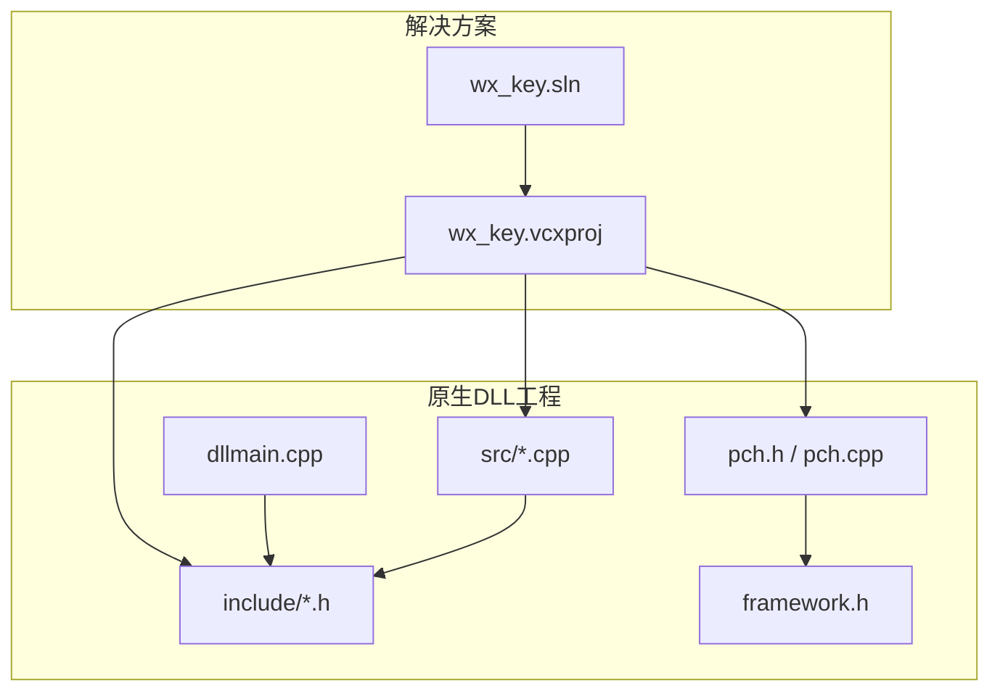
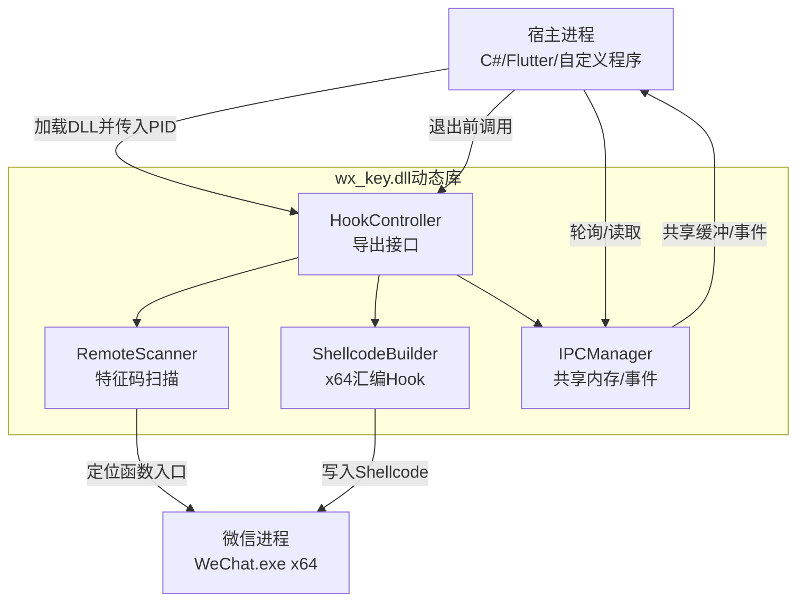
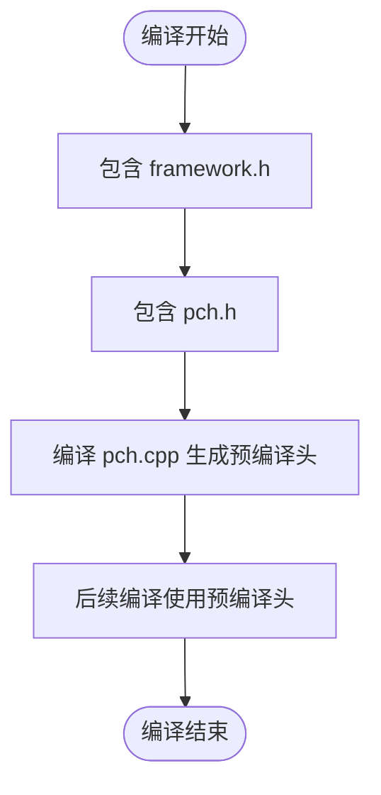
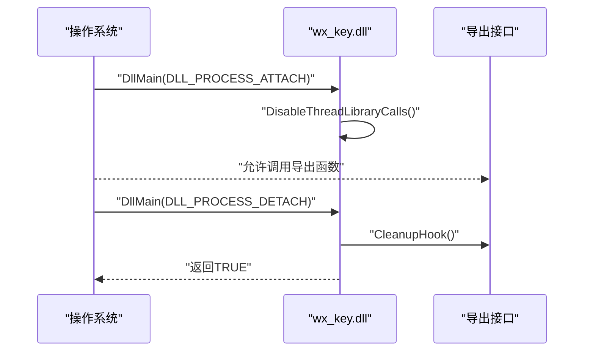
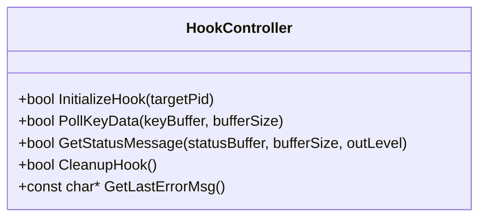
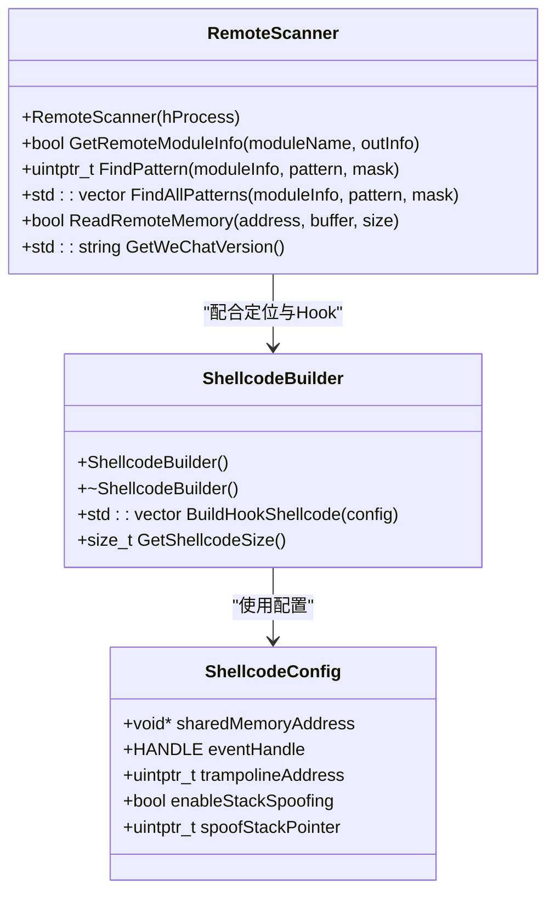
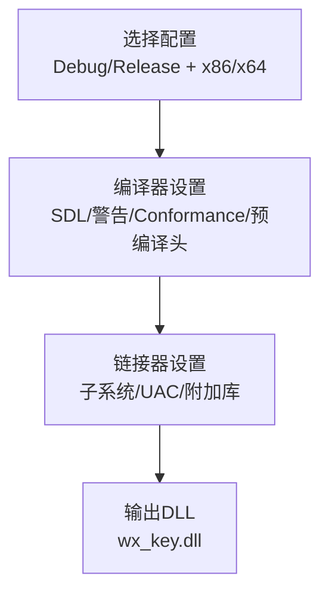
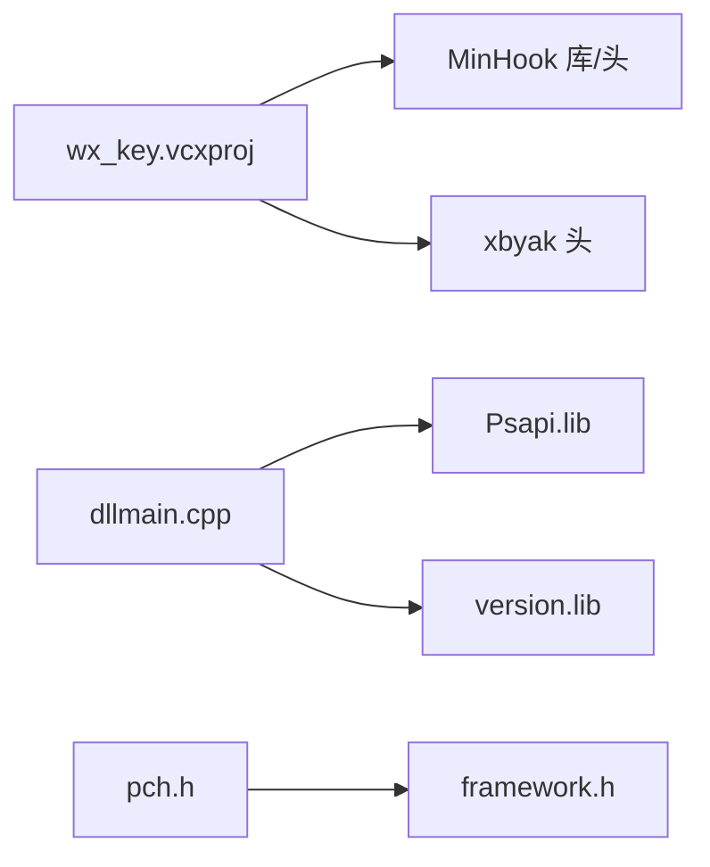

# 原生DLL开发环境

<cite>
**本文引用的文件**
- [wx_key.sln](file://wx_key/wx_key.sln)
- [wx_key.vcxproj](file://wx_key/wx_key.vcxproj)
- [wx_key.vcxproj.user](file://wx_key/wx_key.vcxproj.user)
- [framework.h](file://wx_key/framework.h)
- [pch.h](file://wx_key/pch.h)
- [pch.cpp](file://wx_key/pch.cpp)
- [dllmain.cpp](file://wx_key/dllmain.cpp)
- [hook_controller.h](file://wx_key/include/hook_controller.h)
- [hook_controller.cpp](file://wx_key/src/hook_controller.cpp)
- [remote_scanner.h](file://wx_key/include/remote_scanner.h)
- [shellcode_builder.h](file://wx_key/include/shellcode_builder.h)
- [dll_usage.md](file://docs/dll_usage.md)
- [README.md](file://README.md)
</cite>

## 目录
1. [引言](#引言)
2. [项目结构](#项目结构)
3. [核心组件](#核心组件)
4. [架构总览](#架构总览)
5. [详细组件分析](#详细组件分析)
6. [依赖关系分析](#依赖关系分析)
7. [性能考虑](#性能考虑)
8. [故障排查指南](#故障排查指南)
9. [结论](#结论)
10. [附录](#附录)

## 引言
本指南面向需要在Windows平台上搭建原生DLL开发环境并配置wx_key项目的读者。内容覆盖：
- Visual Studio安装与C++开发工具包要求
- wx_key项目的解决方案与项目配置要点（编译器、链接器、预处理器）
- C++项目结构与头文件组织（含framework.h与预编译头）
- DLL构建配置（调试/发布）
- 原生代码调试技巧与性能优化建议

## 项目结构
wx_key为一个混合架构项目，包含Flutter前端与C++原生DLL两部分。原生DLL位于wx_key目录，采用Visual Studio工程组织，核心文件如下：
- 解决方案与项目：wx_key.sln、wx_key.vcxproj
- 预编译头：framework.h、pch.h、pch.cpp
- DLL入口：dllmain.cpp
- 导出接口：include/hook_controller.h
- 核心实现：src/hook_controller.cpp及若干远程扫描、Hook、Shellcode等模块头文件

图表来源
- [wx_key.sln](file://wx_key/wx_key.sln#L1-L32)
- [wx_key.vcxproj](file://wx_key/wx_key.vcxproj#L1-L181)

章节来源
- [wx_key.sln](file://wx_key/wx_key.sln#L1-L32)
- [wx_key.vcxproj](file://wx_key/wx_key.vcxproj#L1-L181)

## 核心组件
- 预编译头体系：framework.h与pch.h/pch.cpp组合，统一引入常用系统头并加速编译
- DLL入口：dllmain.cpp实现标准DllMain，负责进程附加/分离时的初始化与清理
- 导出接口：hook_controller.h定义DLL对外的C风格导出函数集合
- 远程扫描与Hook：remote_scanner.h提供特征码扫描能力；shellcode_builder.h负责生成x64汇编Hook代码
- 工程配置：wx_key.vcxproj集中定义编译器、链接器、预处理器、包含路径与库依赖

章节来源
- [framework.h](file://wx_key/framework.h#L1-L6)
- [pch.h](file://wx_key/pch.h#L1-L14)
- [pch.cpp](file://wx_key/pch.cpp#L1-L6)
- [dllmain.cpp](file://wx_key/dllmain.cpp#L1-L24)
- [hook_controller.h](file://wx_key/include/hook_controller.h#L1-L50)
- [remote_scanner.h](file://wx_key/include/remote_scanner.h#L1-L70)
- [shellcode_builder.h](file://wx_key/include/shellcode_builder.h#L1-L38)
- [wx_key.vcxproj](file://wx_key/wx_key.vcxproj#L1-L181)

## 架构总览
wx_key的DLL作为“桥接组件”，在宿主进程与目标微信进程之间协作：
- 宿主进程加载wx_key.dll并传入WeChat进程PID
- DLL通过RemoteScanner在目标进程内存中定位关键函数入口
- 通过ShellcodeBuilder生成x64 Shellcode并写入目标进程，拦截密钥数据
- 通过共享内存与事件机制，将32字节密钥以HEX字符串形式传递给宿主进程
- 宿主进程轮询获取密钥与状态日志，最终在退出时调用CleanupHook释放资源

图表来源
- [hook_controller.h](file://wx_key/include/hook_controller.h#L1-L50)
- [remote_scanner.h](file://wx_key/include/remote_scanner.h#L1-L70)
- [shellcode_builder.h](file://wx_key/include/shellcode_builder.h#L1-L38)
- [dll_usage.md](file://docs/dll_usage.md#L1-L165)

## 详细组件分析

### 预编译头与框架头
- framework.h：最小化引入Windows头，减少编译体积与时间
- pch.h/pch.cpp：统一包含framework.h，作为预编译头，提升编译速度；注意频繁更新的头不应放入预编译列表
- 预编译头策略在不同平台配置中有所差异：x64配置默认禁用预编译头，Win32配置启用预编译头

图表来源
- [framework.h](file://wx_key/framework.h#L1-L6)
- [pch.h](file://wx_key/pch.h#L1-L14)
- [pch.cpp](file://wx_key/pch.cpp#L1-L6)
- [wx_key.vcxproj](file://wx_key/wx_key.vcxproj#L72-L147)

章节来源
- [framework.h](file://wx_key/framework.h#L1-L6)
- [pch.h](file://wx_key/pch.h#L1-L14)
- [pch.cpp](file://wx_key/pch.cpp#L1-L6)
- [wx_key.vcxproj](file://wx_key/wx_key.vcxproj#L72-L147)

### DLL入口与生命周期
- dllmain.cpp实现标准DllMain，处理DLL_PROCESS_ATTACH/DLL_PROCESS_DETACH
- 在进程附加时禁用库调用线程化；在进程分离时调用CleanupHook释放资源
- 通过pragma comment链接Psapi与version库，便于进程信息与版本查询

图表来源
- [dllmain.cpp](file://wx_key/dllmain.cpp#L1-L24)
- [hook_controller.h](file://wx_key/include/hook_controller.h#L1-L50)

章节来源
- [dllmain.cpp](file://wx_key/dllmain.cpp#L1-L24)
- [hook_controller.h](file://wx_key/include/hook_controller.h#L1-L50)

### 导出接口与调用约定
- hook_controller.h定义了InitializeHook、PollKeyData、GetStatusMessage、CleanupHook、GetLastErrorMsg等C风格导出函数
- 通过HOOK_API宏在DLL导入/导出间切换，保证宿主进程正确绑定符号
- 宿主进程需按规范轮询获取密钥与状态，并在退出前调用CleanupHook

图表来源
- [hook_controller.h](file://wx_key/include/hook_controller.h#L1-L50)

章节来源
- [hook_controller.h](file://wx_key/include/hook_controller.h#L1-L50)
- [dll_usage.md](file://docs/dll_usage.md#L21-L60)

### 远程扫描与Shellcode构建
- RemoteScanner：在指定远程进程模块中进行特征码扫描，支持多版本配置与掩码匹配
- ShellcodeBuilder：根据共享内存地址、事件句柄与跳板地址生成x64汇编Hook代码，支持可选堆栈伪造
- 二者共同支撑DLL对微信进程的关键函数Hook与密钥拦截

图表来源
- [remote_scanner.h](file://wx_key/include/remote_scanner.h#L1-L70)
- [shellcode_builder.h](file://wx_key/include/shellcode_builder.h#L1-L38)

章节来源
- [remote_scanner.h](file://wx_key/include/remote_scanner.h#L1-L70)
- [shellcode_builder.h](file://wx_key/include/shellcode_builder.h#L1-L38)

### 工程配置与构建选项
- 解决方案与平台：支持Debug|x64、Debug|x86、Release|x64、Release|x86
- 工程类型：DynamicLibrary（DLL）
- 编译器设置：启用SDL、警告级别、Conformance Mode、预编译头策略（Win32启用，x64禁用）
- 链接器设置：x64平台额外链接MinHook库，配置UAC与子系统
- 预处理器定义：按配置启用_DEBUG/NDEBUG等宏
- 包含目录：引入vendor/xbyak与MinHook的include路径

图表来源
- [wx_key.sln](file://wx_key/wx_key.sln#L9-L24)
- [wx_key.vcxproj](file://wx_key/wx_key.vcxproj#L29-L147)

章节来源
- [wx_key.sln](file://wx_key/wx_key.sln#L1-L32)
- [wx_key.vcxproj](file://wx_key/wx_key.vcxproj#L1-L181)

## 依赖关系分析
- 外部库依赖：MinHook（x64库与头文件）、xbyak（汇编工具）
- 系统库依赖：Psapi.lib、version.lib（在dllmain.cpp中显式链接）
- 头文件依赖：pch.h统一包含framework.h；各源文件包含对应头文件

图表来源
- [wx_key.vcxproj](file://wx_key/wx_key.vcxproj#L80-L146)
- [dllmain.cpp](file://wx_key/dllmain.cpp#L8-L9)
- [pch.h](file://wx_key/pch.h#L11-L11)

章节来源
- [wx_key.vcxproj](file://wx_key/wx_key.vcxproj#L80-L146)
- [dllmain.cpp](file://wx_key/dllmain.cpp#L8-L9)
- [pch.h](file://wx_key/pch.h#L11-L11)

## 性能考虑
- 预编译头策略：Win32启用预编译头以加速编译；x64禁用预编译头，避免潜在兼容问题
- 编译优化：Release配置启用全程序优化与内联/函数级链接
- 头文件更新频率：避免将频繁变动的头文件加入预编译列表，以免抵消预编译带来的收益
- 链接优化：启用UAC关闭与子系统Windows，减少不必要的系统调用开销

章节来源
- [wx_key.vcxproj](file://wx_key/wx_key.vcxproj#L35-L54)
- [wx_key.vcxproj](file://wx_key/wx_key.vcxproj#L89-L147)

## 故障排查指南
- 环境要求：仅支持x64系统与64位微信客户端；必要时以管理员权限运行
- 缓冲区大小：PollKeyData返回的HEX字符串（含结束符）至少需要65字节，建议分配128字节
- 单例原则：同一微信进程仅能Hook一次；如需重启扫描，先调用CleanupHook再重新InitializeHook
- 日志与错误：通过GetStatusMessage获取运行日志，GetLastErrorMsg获取最近错误详情
- 共享内存结构：Shellcode写入32字节密钥与sequenceNumber，上层可据此去重

章节来源
- [dll_usage.md](file://docs/dll_usage.md#L15-L60)
- [dll_usage.md](file://docs/dll_usage.md#L135-L165)

## 结论
本指南梳理了wx_key原生DLL开发所需的Visual Studio配置要点、项目结构与关键组件，并结合实际工程文件明确了编译器、链接器与预处理器设置。通过遵循本文的配置与最佳实践，可在Windows平台上稳定构建并调试该DLL，同时掌握必要的性能优化与故障排查方法。

## 附录

### Visual Studio安装与C++开发工具包要求
- 安装Visual Studio（推荐版本与工作负载包含“使用C++的桌面开发”）
- 确认已安装适用于项目的MSVC工具集（工程使用v145工具集）
- 安装Windows 10 SDK（工程指定WindowsTargetPlatformVersion为10.0）

章节来源
- [wx_key.vcxproj](file://wx_key/wx_key.vcxproj#L22-L26)

### wx_key项目配置要点
- 解决方案配置：支持Debug|x64、Debug|x86、Release|x64、Release|x86
- 工程类型：DynamicLibrary（DLL）
- 预处理器定义：按配置启用_DEBUG/NDEBUG等宏
- 包含目录：$(SolutionDir)vendor\xbyak、$(SolutionDir)vendor\MinHook_134_lib\include
- 链接库：x64平台链接libMinHook.x64.lib，dllmain.cpp显式链接Psapi与version

章节来源
- [wx_key.sln](file://wx_key/wx_key.sln#L9-L24)
- [wx_key.vcxproj](file://wx_key/wx_key.vcxproj#L72-L147)
- [dllmain.cpp](file://wx_key/dllmain.cpp#L8-L9)

### C++项目结构与头文件组织
- framework.h：最小化Windows头引入
- pch.h/pch.cpp：统一包含framework.h，加速编译
- 预编译头策略：Win32启用，x64禁用
- 源文件组织：include存放公共头文件，src存放实现文件，dllmain.cpp为DLL入口

章节来源
- [framework.h](file://wx_key/framework.h#L1-L6)
- [pch.h](file://wx_key/pch.h#L1-L14)
- [pch.cpp](file://wx_key/pch.cpp#L1-L6)
- [wx_key.vcxproj](file://wx_key/wx_key.vcxproj#L148-L177)

### DLL构建配置（调试/发布）
- Debug配置：启用调试库、Unicode字符集、SDL检查、预编译头（Win32启用，x64禁用）
- Release配置：启用全程序优化、内联/函数级链接、Unicode字符集、SDL检查、预编译头（Win32启用，x64禁用）
- x64平台链接MinHook库，配置UAC与子系统

章节来源
- [wx_key.vcxproj](file://wx_key/wx_key.vcxproj#L29-L54)
- [wx_key.vcxproj](file://wx_key/wx_key.vcxproj#L72-L147)

### 原生代码调试技巧
- 使用Visual Studio调试器附加到目标进程（如WeChat.exe），设置断点于关键Hook位置
- 利用GetStatusMessage与GetLastErrorMsg输出进行日志驱动调试
- 关注共享内存访问与事件同步，避免竞态条件
- 在x64平台调试时，确保符号信息完整（启用调试信息）

章节来源
- [dll_usage.md](file://docs/dll_usage.md#L35-L60)
- [hook_controller.h](file://wx_key/include/hook_controller.h#L25-L46)

### 性能优化建议
- 合理使用预编译头：Win32启用，x64禁用，避免频繁更新头文件导致重建
- Release优化：启用内联与全程序优化，减少运行时开销
- I/O与日志：限制状态队列大小，避免过多日志影响性能
- 外部库：确保MinHook与xbyak版本与工程一致，避免兼容性导致的性能回退

章节来源
- [wx_key.vcxproj](file://wx_key/wx_key.vcxproj#L89-L147)
- [hook_controller.cpp](file://wx_key/src/hook_controller.cpp#L108-L123)