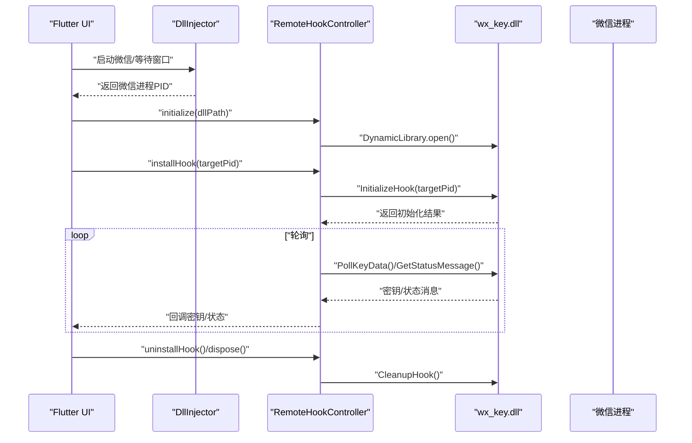
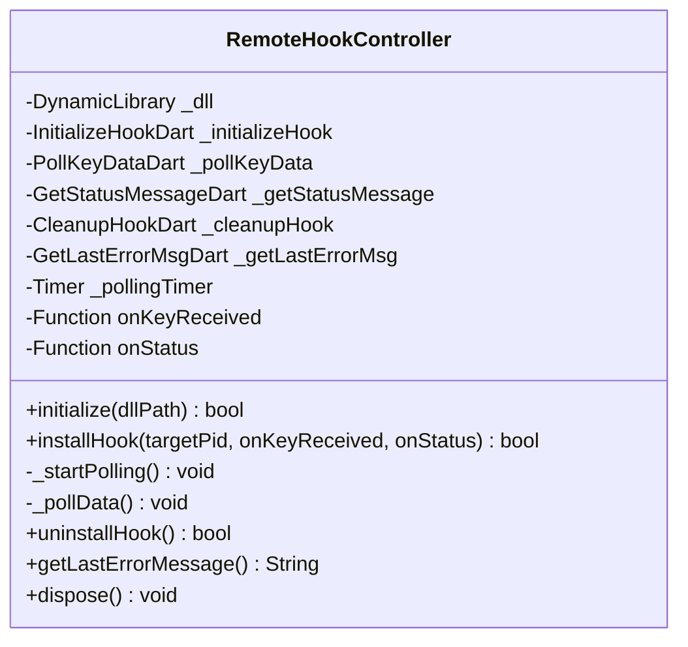
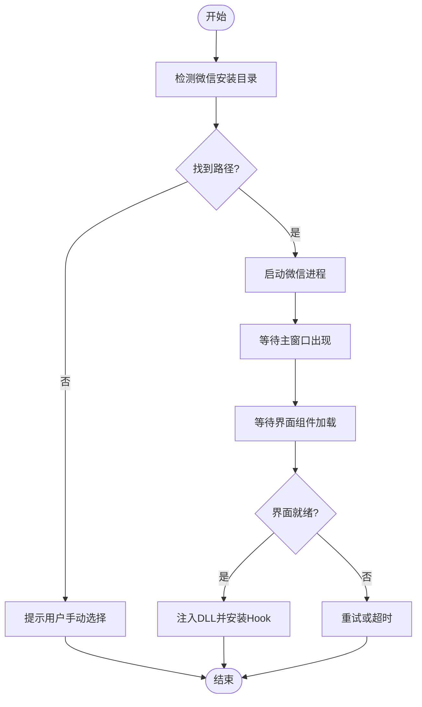
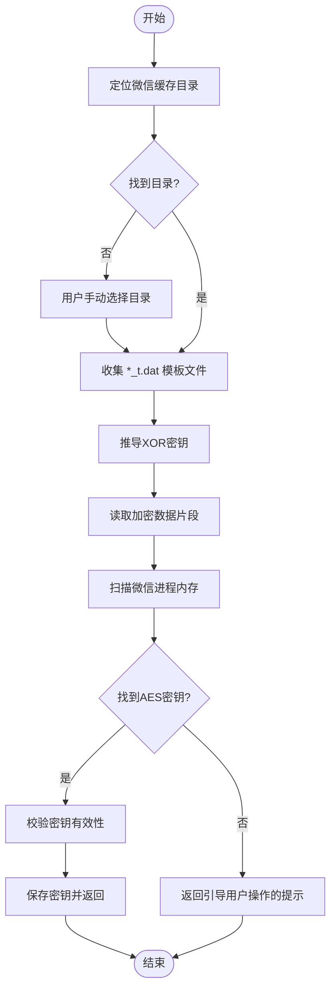
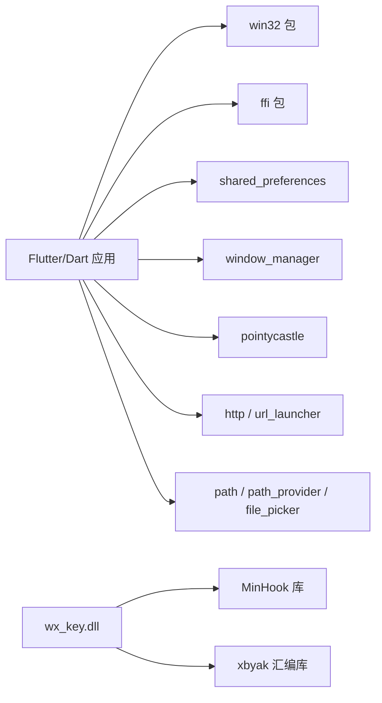

# 开发工作流与最佳实践

<cite>
**本文档引用的文件**
- [README.md](file://README.md)
- [pubspec.yaml](file://pubspec.yaml)
- [analysis_options.yaml](file://analysis_options.yaml)
- [android\app\build.gradle.kts](file://android\app\build.gradle.kts)
- [lib\main.dart](file://lib\main.dart)
- [lib\services\remote_hook_controller.dart](file://lib\services\remote_hook_controller.dart)
- [lib\services\dll_injector.dart](file://lib\services\dll_injector.dart)
- [lib\services\key_storage.dart](file://lib\services\key_storage.dart)
- [lib\services\image_key_service.dart](file://lib\services\image_key_service.dart)
- [docs\dll_usage.md](file://docs\dll_usage.md)
- [SECURITY_ADVISORY.md](file://SECURITY_ADVISORY.md)
- [test\widget_test.dart](file://test\widget_test.dart)
- [bin\cli_extractor.dart](file://bin\cli_extractor.dart)
- [wx_key\wx_key.vcxproj](file://wx_key\wx_key.vcxproj)
</cite>

## 目录
1. [项目概述](#项目概述)
2. [项目结构](#项目结构)
3. [核心组件](#核心组件)
4. [架构总览](#架构总览)
5. [详细组件分析](#详细组件分析)
6. [依赖关系分析](#依赖关系分析)
7. [性能考量](#性能考量)
8. [调试与故障排除指南](#调试与故障排除指南)
9. [代码质量保障](#代码质量保障)
10. [版本控制与协作规范](#版本控制与协作规范)
11. [开发环境优化建议](#开发环境优化建议)
12. [结论](#结论)

## 项目概述
本项目是一个针对微信 4.x 版本的数据库密钥与缓存图片解密密钥提取工具，采用 Flutter 作为前端界面，通过 FFI 调用 C++ 编写的控制器 DLL 实现对微信进程的远程 Hook 与内存扫描。项目同时提供命令行版本，便于自动化与集成。

- 项目目标：在微信 4.0 及以上版本中获取数据库密钥与图片密钥
- 技术栈：Flutter/Dart（前端）、C++（原生 DLL）
- 平台支持：Windows（含 Flutter 桌面端）

**章节来源**
- [README.md](file://README.md#L31-L96)

## 项目结构
项目采用“Flutter 前端 + C++ 原生 DLL”的混合架构，核心目录与职责如下：
- lib/：Flutter 前端代码，包含 UI、服务层与自定义组件
- assets/dll/wx_key.dll：嵌入式 DLL，提供密钥提取能力
- wx_key/：C++ 原生工程，包含 Hook、IPC、Shellcode 等实现
- docs/：DLL 使用与集成文档
- bin/：命令行工具（CLI）实现
- android/、ios/、linux/、macos/、windows/：Flutter 多平台构建配置
- test/：Flutter widget 测试
- docs/dll_usage.md：DLL 导出接口与调用流程说明

```mermaid
graph TB
subgraph "Flutter 前端(lib)"
UI["UI 与状态管理<br/>lib/main.dart"]
Services["服务层<br/>dll_injector.dart / remote_hook_controller.dart / image_key_service.dart / key_storage.dart"]
Widgets["自定义组件<br/>lib/widgets/"]
end
subgraph "嵌入式DLL(assets/dll)"
DLL["wx_key.dll"]
end
subgraph "C++ 原生工程(wx_key)"
VCX["Visual Studio 工程<br/>wx_key.vcxproj"]
Src["源码(src/*)"]
Inc["头文件(include/*)"]
end
subgraph "多平台构建(android/ios/linux/macos/windows)"
Gradle["Android Gradle 配置"]
Xcode["iOS Xcode 工作区"]
CMake["桌面端 CMake 配置"]
end
UI --> Services
Services --> DLL
DLL <- --> VCX
VCX --> Src
VCX --> Inc
UI --> Gradle
UI --> Xcode
UI --> CMake
```

**图表来源**
- [lib\main.dart](file://lib\main.dart#L16-L35)
- [lib\services\remote_hook_controller.dart](file://lib\services\remote_hook_controller.dart#L34-L87)
- [wx_key\wx_key.vcxproj](file://wx_key\wx_key.vcxproj#L1-L181)
- [android\app\build.gradle.kts](file://android\app\build.gradle.kts#L1-L45)

**章节来源**
- [README.md](file://README.md#L77-L96)
- [pubspec.yaml](file://pubspec.yaml#L84-L112)

## 核心组件
- 应用入口与窗口管理：初始化日志、窗口选项、运行应用
- DLL 注入与进程控制：微信进程检测、启动、窗口等待、注入与卸载
- 远程 Hook 控制器：FFI 加载 DLL、轮询密钥与状态、错误处理
- 密钥存储：SharedPreferences 持久化数据库密钥与图片密钥
- 图片密钥服务：模板文件分析、内存扫描、AES 密钥校验
- 命令行工具：独立 CLI 实现，便于自动化与集成

**章节来源**
- [lib\main.dart](file://lib\main.dart#L16-L35)
- [lib\services\dll_injector.dart](file://lib\services\dll_injector.dart#L31-L91)
- [lib\services\remote_hook_controller.dart](file://lib\services\remote_hook_controller.dart#L34-L87)
- [lib\services\key_storage.dart](file://lib\services\key_storage.dart#L5-L135)
- [lib\services\image_key_service.dart](file://lib\services\image_key_service.dart#L54-L114)
- [bin\cli_extractor.dart](file://bin\cli_extractor.dart#L93-L147)

## 架构总览
系统采用“前端 UI + FFI 调用 + 原生 DLL”的分层架构。Flutter 通过 FFI 动态加载 wx_key.dll，调用其导出函数进行 Hook 初始化、密钥轮询与状态获取，同时通过服务层协调日志、存储与 UI 更新。



**图表来源**
- [lib\services\dll_injector.dart](file://lib\services\dll_injector.dart#L531-L602)
- [lib\services\remote_hook_controller.dart](file://lib\services\remote_hook_controller.dart#L93-L128)
- [docs\dll_usage.md](file://docs\dll_usage.md#L25-L31)

**章节来源**
- [docs\dll_usage.md](file://docs\dll_usage.md#L1-L60)

## 详细组件分析

### 组件一：远程 Hook 控制器（轮询模式）
- 职责：加载 DLL、安装 Hook、轮询密钥与状态、错误诊断、资源清理
- 关键点：使用定时器每 100ms 轮询，避免回调复杂度；通过共享内存缓冲与序列号去重
- 错误处理：统一记录日志，提供最后错误信息查询



**图表来源**
- [lib\services\remote_hook_controller.dart](file://lib\services\remote_hook_controller.dart#L34-L278)

**章节来源**
- [lib\services\remote_hook_controller.dart](file://lib\services\remote_hook_controller.dart#L34-L278)

### 组件二：DLL 注入与进程控制
- 职责：微信安装路径探测、进程枚举、窗口句柄枚举、启动与关闭微信、等待界面加载
- 关键点：多注册表路径与常见路径回退策略；基于窗口标题与类名的 Ready 组件检测
- 安全性：提供进程终止与重启流程，避免残留进程影响 Hook



**图表来源**
- [lib\services\dll_injector.dart](file://lib\services\dll_injector.dart#L406-L479)
- [lib\services\dll_injector.dart](file://lib\services\dll_injector.dart#L604-L657)

**章节来源**
- [lib\services\dll_injector.dart](file://lib\services\dll_injector.dart#L97-L404)
- [lib\services\dll_injector.dart](file://lib\services\dll_injector.dart#L508-L602)

### 组件三：图片密钥服务（内存扫描与校验）
- 职责：定位微信缓存目录、模板文件分析、XOR 密钥推导、内存扫描 AES 密钥、密钥校验
- 关键点：按时间排序模板文件、跨块扫描、UTF-16 密钥兼容、超时控制
- 性能：分块读取与覆盖拼接，避免跨块遗漏；限制扫描区域大小



**图表来源**
- [lib\services\image_key_service.dart](file://lib\services\image_key_service.dart#L600-L696)

**章节来源**
- [lib\services\image_key_service.dart](file://lib\services\image_key_service.dart#L54-L114)
- [lib\services\image_key_service.dart](file://lib\services\image_key_service.dart#L198-L246)
- [lib\services\image_key_service.dart](file://lib\services\image_key_service.dart#L308-L467)

### 组件四：密钥存储服务
- 职责：数据库密钥与图片密钥的持久化、读取、清理与格式化展示
- 关键点：SharedPreferences 键名规范化；时间戳同步保存；一键清除

**章节来源**
- [lib\services\key_storage.dart](file://lib\services\key_storage.dart#L5-L135)
- [lib\services\key_storage.dart](file://lib\services\key_storage.dart#L170-L271)

### 组件五：命令行工具（CLI）
- 职责：独立运行的密钥提取工具，支持参数化配置与输出文件
- 关键点：进程 PID 自动探测、轮询控制、超时与日志级别

**章节来源**
- [bin\cli_extractor.dart](file://bin\cli_extractor.dart#L430-L471)
- [bin\cli_extractor.dart](file://bin\cli_extractor.dart#L474-L561)

## 依赖关系分析
- Flutter 依赖：win32、ffi、path、path_provider、shared_preferences、file_picker、http、url_launcher、window_manager、pointycastle
- Android Gradle 插件：Android/Kotlin/Flutter Gradle 插件组合
- 原生依赖：MinHook、xbyak（在 DLL 工程中配置）



**图表来源**
- [pubspec.yaml](file://pubspec.yaml#L30-L61)
- [wx_key\wx_key.vcxproj](file://wx_key\wx_key.vcxproj#L78-L146)

**章节来源**
- [pubspec.yaml](file://pubspec.yaml#L30-L61)
- [android\app\build.gradle.kts](file://android\app\build.gradle.kts#L1-L45)
- [wx_key\wx_key.vcxproj](file://wx_key\wx_key.vcxproj#L78-L146)

## 性能考量
- 轮询频率：DLL 控制器默认 100ms 轮询，平衡响应速度与 CPU 占用
- 内存扫描：分块 4MB 读取并覆盖拼接，避免跨块遗漏；跳过大内存区域
- 进程枚举：优先模块匹配（Weixin.dll）再回退到进程名，减少误判
- I/O 与 UI：日志与密钥更新在主线程 setState，避免阻塞；资源清理在窗口销毁时异步执行

**章节来源**
- [lib\services\remote_hook_controller.dart](file://lib\services\remote_hook_controller.dart#L130-L144)
- [lib\services\image_key_service.dart](file://lib\services\image_key_service.dart#L333-L354)
- [lib\services\dll_injector.dart](file://lib\services\dll_injector.dart#L604-L657)

## 调试与故障排除指南
- 热重载与断点调试
  - 使用 VS Code 或 Android Studio 启动 Flutter 应用，设置断点于关键服务（如 DLL 注入、Hook 安装、密钥轮询）
  - 在 CLI 中启用详细日志，观察轮询与状态消息输出
- 日志分析
  - 前端日志：AppLogger 统一记录 INFO/SUCCESS/WARNING/ERROR 级别
  - DLL 日志：GetStatusMessage 返回内部运行日志，按级别区分
- 常见问题
  - DLL 加载失败：检查路径与架构（仅 x64），确认管理员权限
  - 微信未就绪：等待界面组件加载或手动触发界面交互
  - 内存扫描超时：确保微信处于活跃状态并多次浏览图片以生成密钥

**章节来源**
- [lib\services\remote_hook_controller.dart](file://lib\services\remote_hook_controller.dart#L146-L204)
- [docs\dll_usage.md](file://docs\dll_usage.md#L135-L165)

## 代码质量保障
- 静态分析
  - 使用 Flutter Lints，遵循推荐规则；可通过 analysis_options.yaml 自定义规则
- 单元测试
  - 提供基础 widget 测试样例，建议扩展至服务层（如 KeyStorage、ImageKeyService 的纯函数部分）
- 集成测试
  - 通过 CLI 与 UI 流程串联测试，验证 DLL 注入、密钥轮询与存储链路

**章节来源**
- [analysis_options.yaml](file://analysis_options.yaml#L10-L29)
- [test\widget_test.dart](file://test\widget_test.dart#L13-L30)

## 版本控制与协作规范
- 分支管理
  - 主分支：稳定版本与发布
  - 功能分支：feature/YourFeature
  - 修复分支：fix/issue-number
- 提交规范
  - 类型：feat、fix、docs、style、refactor、perf、test、build、ci、chore
  - 示例：feat: 添加图片密钥自动选择功能
- 代码审查
  - PR 必须包含变更说明、测试用例与风险评估
  - 审查重点：DLL 注入安全性、内存扫描稳定性、日志完整性

**章节来源**
- [README.md](file://README.md#L154-L163)

## 开发环境优化建议
- Flutter
  - 使用最新稳定版 SDK，启用 Flutter Lints
  - 配置 VS Code settings.json，启用 Dart/Flutter 扩展与格式化
- Android
  - JDK 11+，NDK 版本与 Flutter 配置一致
- Windows 桌面端
  - 启用窗口管理与多分辨率适配
- C++ 原生
  - MinGW/MSVC 工具链与 x64 目标配置
  - 启用预编译头（PCH）加速构建

**章节来源**
- [pubspec.yaml](file://pubspec.yaml#L21-L29)
- [android\app\build.gradle.kts](file://android\app\build.gradle.kts#L13-L20)
- [wx_key\wx_key.vcxproj](file://wx_key\wx_key.vcxproj#L29-L54)

## 结论
本项目通过 Flutter 与 C++ DLL 的协同，实现了对微信密钥的自动化提取。建议在开发过程中严格遵循版本控制与协作规范，强化静态分析与测试，持续优化性能与稳定性，并在安全合规的前提下进行功能迭代。