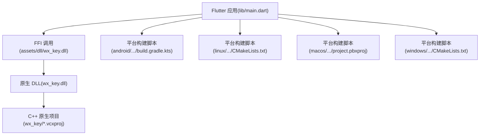
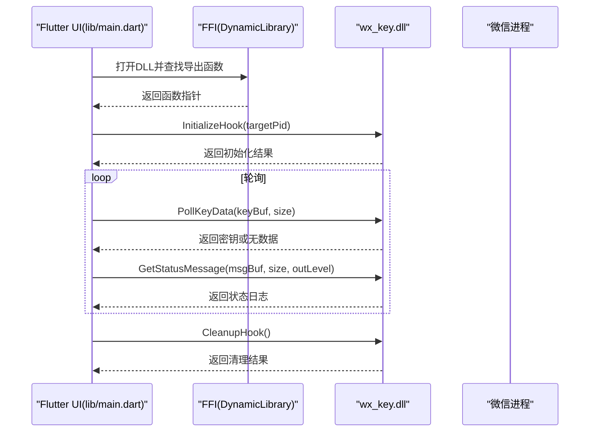
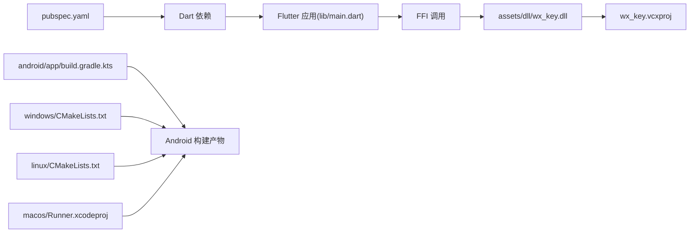

# 开发环境与构建

<cite>
**本文引用的文件**
- [pubspec.yaml](file://pubspec.yaml)
- [README.md](file://README.md)
- [analysis_options.yaml](file://analysis_options.yaml)
- [android/build.gradle.kts](file://android/build.gradle.kts)
- [android/app/build.gradle.kts](file://android/app/build.gradle.kts)
- [windows/CMakeLists.txt](file://windows/CMakeLists.txt)
- [linux/CMakeLists.txt](file://linux/CMakeLists.txt)
- [macos/Runner.xcodeproj/project.pbxproj](file://macos/Runner.xcodeproj/project.pbxproj)
- [wx_key/wx_key.vcxproj](file://wx_key/wx_key.vcxproj)
- [lib/main.dart](file://lib/main.dart)
- [bin/cli_extractor.dart](file://bin/cli_extractor.dart)
- [docs/dll_usage.md](file://docs/dll_usage.md)
</cite>

## 目录
1. [简介](#简介)
2. [项目结构](#项目结构)
3. [核心组件](#核心组件)
4. [架构总览](#架构总览)
5. [详细组件分析](#详细组件分析)
6. [依赖关系分析](#依赖关系分析)
7. [性能考量](#性能考量)
8. [故障排查指南](#故障排查指南)
9. [结论](#结论)
10. [附录](#附录)

## 简介
本指南面向 wx_key 项目的开发者，提供从零搭建 Flutter 开发环境、配置 Visual Studio 与 C++ 原生 DLL 编译、管理 pubspec 依赖与版本策略、完成 Flutter 与原生 DLL 的构建流程、配置代码质量检查工具、设置调试环境与最佳实践，以及提供持续集成与自动化构建的参考方案。项目同时包含命令行工具与 GUI 应用两套使用方式，GUI 通过 FFI 调用原生 DLL，CLI 则直接以 Dart 调用 DLL。

## 项目结构
项目采用 Flutter 多平台工程组织，根目录包含 Flutter 前端、各平台构建脚本、原生 C++ 项目与文档。关键目录与文件如下：
- lib/：Flutter 前端源码，包含 UI、服务层与组件
- assets/dll/wx_key.dll：打包的原生 DLL，供 Flutter 通过 FFI 调用
- wx_key/：Visual Studio C++ 原生项目，包含头文件与源文件、工程配置
- android/、ios/、linux/、macos/、windows/：各平台构建脚本与配置
- pubspec.yaml：Dart 包与依赖管理
- analysis_options.yaml：代码质量规则
- docs/dll_usage.md：DLL 集成与调用说明
- bin/cli_extractor.dart：命令行密钥提取工具

**图表来源**
- [lib/main.dart](file://lib/main.dart#L1-L120)
- [wx_key/wx_key.vcxproj](file://wx_key/wx_key.vcxproj#L1-L181)
- [android/app/build.gradle.kts](file://android/app/build.gradle.kts#L1-L45)
- [linux/CMakeLists.txt](file://linux/CMakeLists.txt#L1-L129)
- [macos/Runner.xcodeproj/project.pbxproj](file://macos/Runner.xcodeproj/project.pbxproj#L1-L200)
- [windows/CMakeLists.txt](file://windows/CMakeLists.txt#L1-L109)

**章节来源**
- [README.md](file://README.md#L77-L132)

## 核心组件
- Flutter 前端与服务层：负责 UI、窗口管理、日志、密钥存储与 FFI 控制器
- 原生 DLL 与 C++ 项目：提供微信进程扫描、Hook、共享内存轮询等核心能力
- 平台构建脚本：Android Gradle、Linux CMake、macOS Xcode、Windows CMake
- 代码质量与依赖：analysis_options.yaml、pubspec.yaml

**章节来源**
- [lib/main.dart](file://lib/main.dart#L1-L120)
- [pubspec.yaml](file://pubspec.yaml#L1-L112)
- [analysis_options.yaml](file://analysis_options.yaml#L1-L29)

## 架构总览
Flutter 应用通过 FFI 动态加载 wx_key.dll，调用其导出函数进行微信进程 Hook、密钥轮询与状态查询。原生 DLL 由 C++ 项目编译生成，支持 x64 架构与 Windows 平台。

**图表来源**
- [lib/main.dart](file://lib/main.dart#L1-L120)
- [docs/dll_usage.md](file://docs/dll_usage.md#L21-L60)
- [bin/cli_extractor.dart](file://bin/cli_extractor.dart#L106-L323)

## 详细组件分析

### Flutter 依赖与版本管理(pubspec.yaml)
- SDK 版本：要求 Dart SDK 版本满足 ^3.9.2
- 依赖包：
  - flutter: sdk: flutter
  - ffi、win32：用于调用原生 API 与 Windows 原生库
  - path、path_provider：文件路径与访问
  - shared_preferences、file_picker：持久化与文件选择
  - http：下载 DLL
  - url_launcher：打开链接
  - window_manager：窗口管理
  - pointycastle：AES 加解密
- 开发依赖：flutter_test、flutter_lints
- 资源与字体：assets 中包含 DLL 与 HarmonyOS_SansSC 字体

建议：
- 使用 Flutter SDK 与 Dart SDK 对应版本
- 依赖升级时优先使用 major 版本升级策略，关注 breaking changes
- 在 CI 中锁定依赖版本，确保可复现构建

**章节来源**
- [pubspec.yaml](file://pubspec.yaml#L21-L112)

### 代码质量与静态分析(analysis_options.yaml)
- 引入 Flutter 推荐 lint 规则集
- 可按需启用/禁用特定规则
- 通过 flutter analyze 或 IDE 集成运行

最佳实践：
- 在 PR 中强制执行分析
- 将分析作为 CI 步骤之一
- 避免全局禁用规则，优先针对文件或行注释忽略

**章节来源**
- [analysis_options.yaml](file://analysis_options.yaml#L8-L29)

### Android 构建配置(android/build.gradle.kts 与 android/app/build.gradle.kts)
- 统一仓库源与构建目录
- 子项目评估依赖 app 模块
- app 模块配置 compileSdk、ndkVersion、Java 11、minSdk/targetSdk、签名与 Flutter 版本映射

建议：
- 保持 compileSdk 与 NDK 版本与 Flutter SDK 兼容
- 在 CI 中使用 debug 签名配置以支持 release 构建

**章节来源**
- [android/build.gradle.kts](file://android/build.gradle.kts#L1-L25)
- [android/app/build.gradle.kts](file://android/app/build.gradle.kts#L1-L45)

### Windows 构建配置(windows/CMakeLists.txt)
- 定义 Debug/Profile/Release 三种模式
- 启用 Unicode、C++17、警告提升为错误
- 安装阶段将 ICU 数据、Flutter 库、插件库与资源复制到运行目录
- 通过 Flutter managed dir 与 runner 子目录组织构建

建议：
- 在 Visual Studio 中直接构建，便于调试
- Profile 与 Release 使用优化编译选项

**章节来源**
- [windows/CMakeLists.txt](file://windows/CMakeLists.txt#L1-L109)

### Linux 构建配置(linux/CMakeLists.txt)
- 定义 Debug/Profile/Release 模式
- 使用 GTK3 依赖与 C++14
- 安装阶段复制 Flutter 资源与插件库

建议：
- 在 Linux VM 或容器中进行构建以保证一致性

**章节来源**
- [linux/CMakeLists.txt](file://linux/CMakeLists.txt#L1-L129)

### macOS 构建配置(macos/Runner.xcodeproj/project.pbxproj)
- Xcode 工程包含 Flutter Assemble Target、Main App、资源与配置文件
- 通过 xcconfig 管理 Debug/Release 配置
- 生成插件注册文件与 entitlements

建议：
- 使用 Xcode 15+ 以匹配 Flutter 工具链
- 在 CI 中使用 xcodebuild 进行构建

**章节来源**
- [macos/Runner.xcodeproj/project.pbxproj](file://macos/Runner.xcodeproj/project.pbxproj#L1-L200)

### 原生 DLL 项目配置(wx_key/wx_key.vcxproj)
- 工程类型：动态库(DLL)
- 平台：x64（Windows 10 SDK）
- 工具集：v145
- 预编译头：Debug 使用、Release 不使用
- 依赖：MinHook x64 库与 xbyak 头文件
- 头文件与源文件：hook_controller、ipc_manager、remote_scanner、remote_hooker、shellcode_builder、remote_veh、veh_hook_manager、syscalls、string_obfuscator

建议：
- 确保 MinHook 与 xbyak 依赖路径正确
- 在 Debug/Release 下分别配置预编译头与优化选项

**章节来源**
- [wx_key/wx_key.vcxproj](file://wx_key/wx_key.vcxproj#L1-L181)

### GUI 应用与 FFI 控制器(lib/main.dart)
- 应用入口：初始化窗口管理、应用日志
- 服务层：DllInjector、RemoteHookController、KeyStorage、LogReader、ImageKeyService
- 流程：准备 DLL -> 关闭/启动微信 -> 注入 Hook -> 轮询密钥 -> 保存与复制 -> 清理资源
- 日志：通过 LogReader 监控 DLL 写入的日志文件

建议：
- 在 UI 线程外进行轮询，避免阻塞
- 超时控制与资源清理需完善

**章节来源**
- [lib/main.dart](file://lib/main.dart#L1-L120)
- [lib/main.dart](file://lib/main.dart#L420-L800)

### 命令行工具(bin/cli_extractor.dart)
- 通过 DynamicLibrary 打开 DLL 并绑定导出函数
- 自动查找微信进程 PID（优先 Weixin.exe，其次 WeChatAppEx.exe）
- 支持超时、轮询间隔、输出文件与详细日志
- 提供错误诊断与资源清理

建议：
- 在 CI 中以非交互方式运行
- 输出文件可用于自动化流水线

**章节来源**
- [bin/cli_extractor.dart](file://bin/cli_extractor.dart#L1-L120)
- [bin/cli_extractor.dart](file://bin/cli_extractor.dart#L474-L561)

### DLL 使用与集成(docs/dll_usage.md)
- API：InitializeHook、PollKeyData、GetStatusMessage、CleanupHook、GetLastErrorMsg
- 调用流程：定位 PID -> 加载 DLL -> 初始化 -> 轮询 -> 清理
- 注意事项：x64 架构、管理员权限、缓冲区大小、单实例 Hook、共享内存结构

建议：
- 上层应用严格遵循调用顺序与资源清理
- UI 层根据 outLevel 自行添加日志前缀

**章节来源**
- [docs/dll_usage.md](file://docs/dll_usage.md#L1-L165)

## 依赖关系分析
Flutter 应用与原生 DLL 之间通过 FFI 交互，构建系统在不同平台上通过各自脚本完成打包与安装。

**图表来源**
- [pubspec.yaml](file://pubspec.yaml#L30-L71)
- [lib/main.dart](file://lib/main.dart#L1-L120)
- [wx_key/wx_key.vcxproj](file://wx_key/wx_key.vcxproj#L1-L181)
- [android/app/build.gradle.kts](file://android/app/build.gradle.kts#L1-L45)
- [windows/CMakeLists.txt](file://windows/CMakeLists.txt#L1-L109)
- [linux/CMakeLists.txt](file://linux/CMakeLists.txt#L1-L129)
- [macos/Runner.xcodeproj/project.pbxproj](file://macos/Runner.xcodeproj/project.pbxproj#L1-L200)

**章节来源**
- [pubspec.yaml](file://pubspec.yaml#L30-L112)
- [lib/main.dart](file://lib/main.dart#L1-L120)

## 性能考量
- 轮询间隔：建议 100ms 左右，避免过高 CPU 占用
- 资源清理：退出前必须调用 CleanupHook，防止残留 Hook 导致崩溃
- 依赖优化：在 Release 模式启用编译器优化与链接时优化
- 日志与 UI：避免在 UI 线程进行阻塞操作，使用异步与流式日志

## 故障排查指南
常见问题与解决思路：
- DLL 加载失败：确认 DLL 路径正确且与应用架构一致（x64）
- 权限不足：以管理员身份运行或检查 UAC 设置
- 微信版本不兼容：特征码失效，需更新 DLL 源码中的扫描特征并重新编译
- 超时无密钥：检查微信进程状态、轮询间隔与日志级别
- 资源未清理：确保调用 CleanupHook 并等待释放完成

**章节来源**
- [docs/dll_usage.md](file://docs/dll_usage.md#L135-L165)
- [lib/main.dart](file://lib/main.dart#L494-L534)

## 结论
本指南提供了从环境搭建到构建与调试的完整路径，涵盖 Flutter 依赖管理、平台构建脚本、Visual Studio 原生 DLL 编译、FFI 集成、代码质量与故障排查。建议在本地与 CI 中均执行静态分析与构建验证，确保跨平台一致性与稳定性。

## 附录

### 开发环境与工具清单
- Flutter SDK 与 Dart SDK（满足 pubspec.yaml 中的 SDK 版本）
- Android Studio 与 Android SDK/NDK（Android 构建）
- Visual Studio 2022（含 MSVC v145 工具集、Windows 10 SDK）
- Xcode 15+（macOS 构建）
- CMake 3.13+（Linux/Windows 构建）

### 依赖安装与版本控制策略
- 使用 flutter pub get 安装依赖
- 在 CI 中使用 flutter pub get 并缓存依赖
- 版本升级：优先 major 版本升级，结合 flutter pub outdated 与变更日志

**章节来源**
- [pubspec.yaml](file://pubspec.yaml#L21-L71)
- [README.md](file://README.md#L115-L132)

### Visual Studio 配置与 C++ 原生项目编译
- 工具集：v145
- 平台：x64
- 预编译头：Debug 使用，Release 不使用
- 依赖：MinHook x64 库与 xbyak 头文件
- 构建类型：动态库(DLL)

**章节来源**
- [wx_key/wx_key.vcxproj](file://wx_key/wx_key.vcxproj#L21-L146)

### Flutter 构建与原生 DLL 编译步骤
- 安装依赖：flutter pub get
- 构建 Windows：flutter build windows --release
- 原生 DLL：在 Visual Studio 中生成 Release x64
- 资源打包：确保 assets/dll/wx_key.dll 被包含

**章节来源**
- [README.md](file://README.md#L115-L132)
- [windows/CMakeLists.txt](file://windows/CMakeLists.txt#L60-L109)

### 代码质量检查工具配置与使用
- 分析规则：analysis_options.yaml 引入 flutter_lints
- 在 IDE 中运行 flutter analyze 或在 CI 中执行
- 避免全局禁用规则，必要时使用行级或文件级注释

**章节来源**
- [analysis_options.yaml](file://analysis_options.yaml#L8-L29)

### 调试环境设置与开发工作流最佳实践
- GUI 调试：在 VS/VS Code 中附加 Flutter 进程，设置断点
- 原生 DLL 调试：在 Visual Studio 中附加目标进程，设置断点
- 日志：使用 AppLogger 与 LogReader，结合 GetStatusMessage
- 超时与清理：在 UI 生命周期中确保资源清理

**章节来源**
- [lib/main.dart](file://lib/main.dart#L494-L534)
- [docs/dll_usage.md](file://docs/dll_usage.md#L35-L60)

### 持续集成与自动化构建配置示例
- Android：Gradle Wrapper + Gradle 构建
- Windows：CMake + Visual Studio 构建
- Linux：CMake + GCC/Clang 构建
- macOS：Xcode 构建
- 建议在 CI 中执行：
  - flutter pub get
  - flutter analyze
  - flutter test
  - flutter build windows --release
  - 原生 DLL 构建（Visual Studio）

**章节来源**
- [android/build.gradle.kts](file://android/build.gradle.kts#L1-L25)
- [windows/CMakeLists.txt](file://windows/CMakeLists.txt#L1-L109)
- [linux/CMakeLists.txt](file://linux/CMakeLists.txt#L1-L129)
- [macos/Runner.xcodeproj/project.pbxproj](file://macos/Runner.xcodeproj/project.pbxproj#L1-L200)