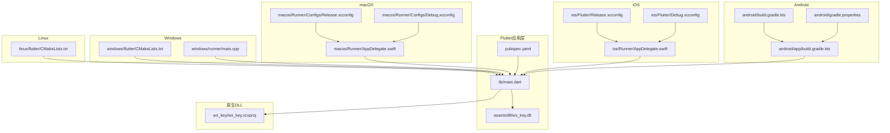
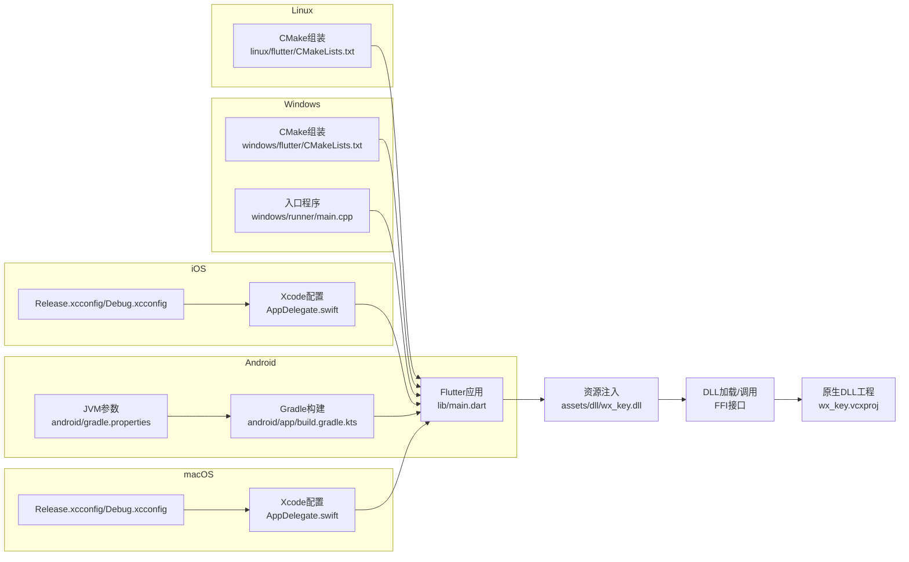
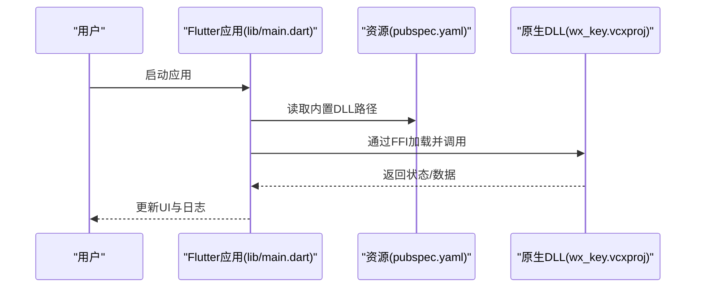
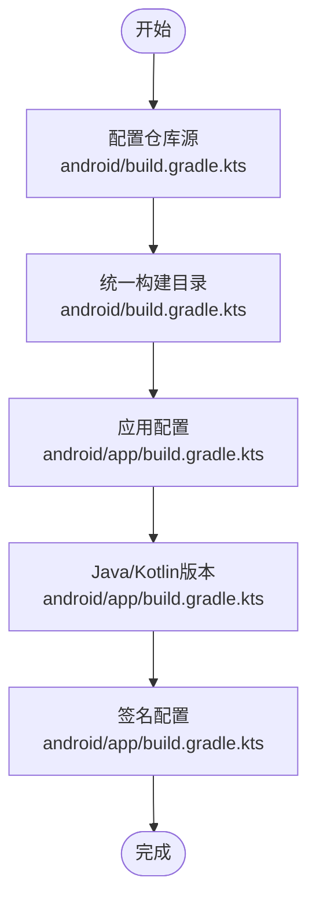
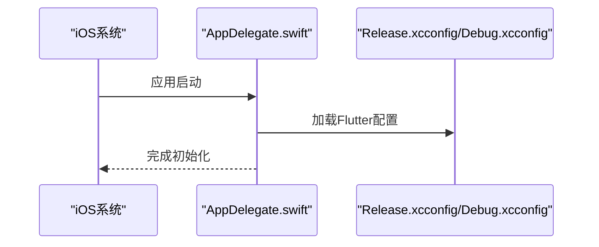
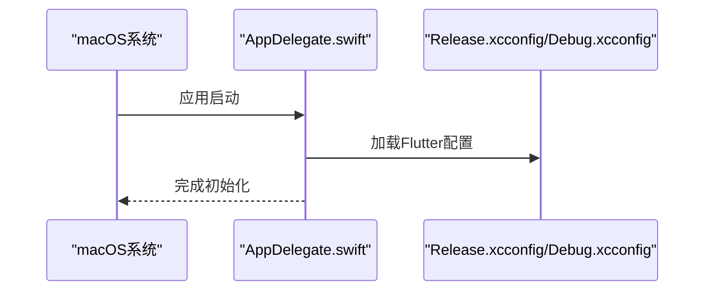
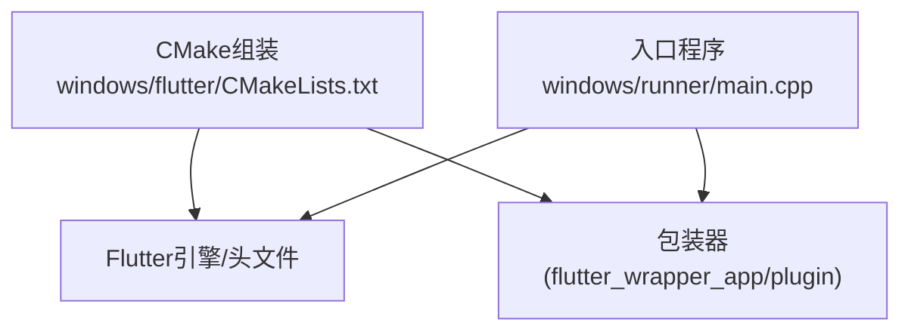
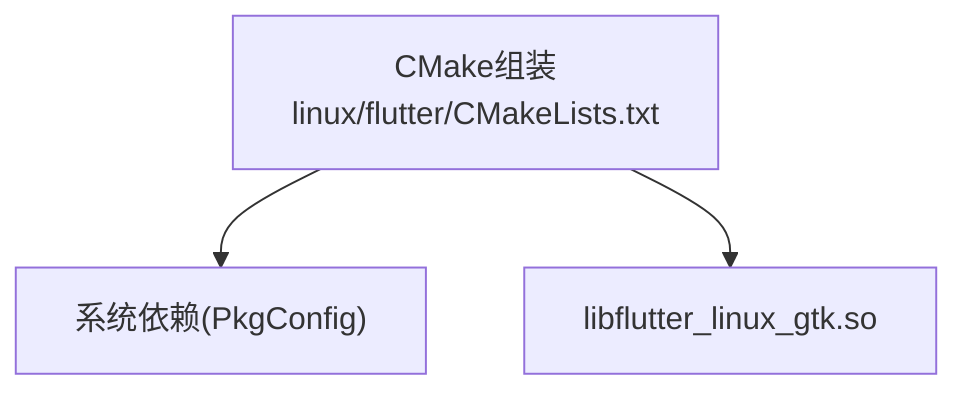
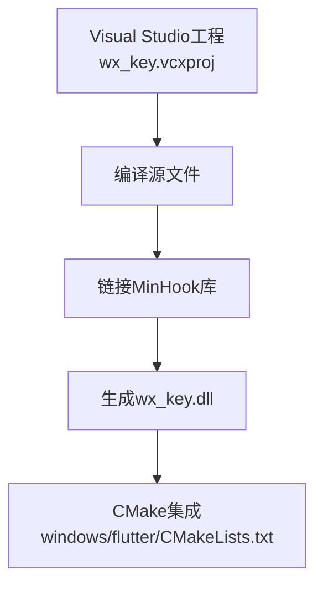
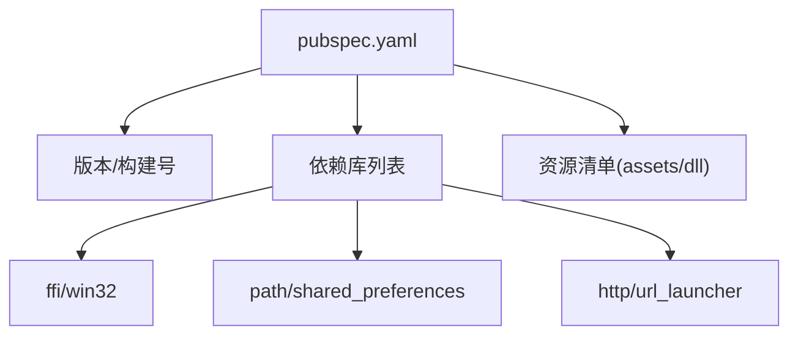

# 构建与部署流程

<cite>
**本文档引用的文件**
- [pubspec.yaml](file://pubspec.yaml)
- [android/build.gradle.kts](file://android/build.gradle.kts)
- [android/app/build.gradle.kts](file://android/app/build.gradle.kts)
- [android/gradle.properties](file://android/gradle.properties)
- [ios/Runner/AppDelegate.swift](file://ios/Runner/AppDelegate.swift)
- [ios/Flutter/Debug.xcconfig](file://ios/Flutter/Debug.xcconfig)
- [ios/Flutter/Release.xcconfig](file://ios/Flutter/Release.xcconfig)
- [macos/Runner/AppDelegate.swift](file://macos/Runner/AppDelegate.swift)
- [macos/Runner/Configs/Debug.xcconfig](file://macos/Runner/Configs/Debug.xcconfig)
- [macos/Runner/Configs/Release.xcconfig](file://macos/Runner/Configs/Release.xcconfig)
- [windows/flutter/CMakeLists.txt](file://windows/flutter/CMakeLists.txt)
- [linux/flutter/CMakeLists.txt](file://linux/flutter/CMakeLists.txt)
- [windows/runner/main.cpp](file://windows/runner/main.cpp)
- [wx_key/wx_key.vcxproj](file://wx_key/wx_key.vcxproj)
- [lib/main.dart](file://lib/main.dart)
- [.github/workflows](file://.github/workflows)
</cite>

## 目录
1. [简介](#简介)
2. [项目结构](#项目结构)
3. [核心组件](#核心组件)
4. [架构总览](#架构总览)
5. [详细组件分析](#详细组件分析)
6. [依赖关系分析](#依赖关系分析)
7. [性能考虑](#性能考虑)
8. [故障排除指南](#故障排除指南)
9. [结论](#结论)
10. [附录](#附录)

## 简介
本指南面向Flutter应用的构建与部署流程，覆盖以下内容：
- Flutter应用在不同平台（Windows、Android、iOS）的构建方式与差异
- 原生DLL（wx_key.dll）的编译流程与集成方式
- 跨平台构建脚本与打包分发策略
- 版本管理与安装包生成
- CI/CD自动化构建最佳实践
- 常见构建问题的诊断与解决

## 项目结构
该项目采用标准Flutter多平台工程布局，包含：
- Flutter应用层：lib、assets、web等
- 平台特定代码：android、ios、windows、linux、macos
- 原生DLL工程：wx_key（用于Windows平台）
- 配置文件：pubspec.yaml、各平台CMake/Gradle/Xcode配置

图表来源
- [lib/main.dart](file://lib/main.dart#L1-L50)
- [pubspec.yaml](file://pubspec.yaml#L84-L87)
- [android/app/build.gradle.kts](file://android/app/build.gradle.kts#L1-L45)
- [android/build.gradle.kts](file://android/build.gradle.kts#L1-L25)
- [android/gradle.properties](file://android/gradle.properties#L1-L4)
- [ios/Runner/AppDelegate.swift](file://ios/Runner/AppDelegate.swift#L1-L14)
- [ios/Flutter/Release.xcconfig](file://ios/Flutter/Release.xcconfig#L1-L2)
- [ios/Flutter/Debug.xcconfig](file://ios/Flutter/Debug.xcconfig#L1-L2)
- [macos/Runner/AppDelegate.swift](file://macos/Runner/AppDelegate.swift#L1-L14)
- [macos/Runner/Configs/Release.xcconfig](file://macos/Runner/Configs/Release.xcconfig#L1-L3)
- [macos/Runner/Configs/Debug.xcconfig](file://macos/Runner/Configs/Debug.xcconfig#L1-L3)
- [windows/flutter/CMakeLists.txt](file://windows/flutter/CMakeLists.txt#L1-L110)
- [linux/flutter/CMakeLists.txt](file://linux/flutter/CMakeLists.txt#L1-L89)
- [windows/runner/main.cpp](file://windows/runner/main.cpp#L1-L44)
- [wx_key/wx_key.vcxproj](file://wx_key/wx_key.vcxproj#L1-L181)

章节来源
- [pubspec.yaml](file://pubspec.yaml#L1-L112)
- [android/app/build.gradle.kts](file://android/app/build.gradle.kts#L1-L45)
- [android/build.gradle.kts](file://android/build.gradle.kts#L1-L25)
- [android/gradle.properties](file://android/gradle.properties#L1-L4)
- [ios/Runner/AppDelegate.swift](file://ios/Runner/AppDelegate.swift#L1-L14)
- [ios/Flutter/Release.xcconfig](file://ios/Flutter/Release.xcconfig#L1-L2)
- [ios/Flutter/Debug.xcconfig](file://ios/Flutter/Debug.xcconfig#L1-L2)
- [macos/Runner/AppDelegate.swift](file://macos/Runner/AppDelegate.swift#L1-L14)
- [macos/Runner/Configs/Release.xcconfig](file://macos/Runner/Configs/Release.xcconfig#L1-L3)
- [macos/Runner/Configs/Debug.xcconfig](file://macos/Runner/Configs/Debug.xcconfig#L1-L3)
- [windows/flutter/CMakeLists.txt](file://windows/flutter/CMakeLists.txt#L1-L110)
- [linux/flutter/CMakeLists.txt](file://linux/flutter/CMakeLists.txt#L1-L89)
- [windows/runner/main.cpp](file://windows/runner/main.cpp#L1-L44)
- [wx_key/wx_key.vcxproj](file://wx_key/wx_key.vcxproj#L1-L181)

## 核心组件
- 版本与依赖管理：通过pubspec.yaml统一声明版本号、构建号以及平台相关依赖（如FFI、win32等），并声明内置DLL资源路径。
- Android构建：使用Gradle Kotlin DSL，集中管理仓库源、构建目录与签名配置；release类型复用debug签名以便调试。
- iOS/macOS构建：基于Xcode配置文件，通过xcconfig继承Flutter生成的配置，支持Debug/Release两种模式。
- Windows/Linux构建：通过CMakeLists.txt控制Flutter引擎与插件包装器的组装，生成AOT库或动态库。
- 原生DLL工程：使用Visual Studio工程配置，支持x64/x86平台的Debug/Release构建，链接MinHook等第三方库。

章节来源
- [pubspec.yaml](file://pubspec.yaml#L1-L112)
- [android/app/build.gradle.kts](file://android/app/build.gradle.kts#L1-L45)
- [ios/Runner/AppDelegate.swift](file://ios/Runner/AppDelegate.swift#L1-L14)
- [macos/Runner/AppDelegate.swift](file://macos/Runner/AppDelegate.swift#L1-L14)
- [windows/flutter/CMakeLists.txt](file://windows/flutter/CMakeLists.txt#L1-L110)
- [linux/flutter/CMakeLists.txt](file://linux/flutter/CMakeLists.txt#L1-L89)
- [wx_key/wx_key.vcxproj](file://wx_key/wx_key.vcxproj#L1-L181)

## 架构总览
下图展示从Flutter应用到原生DLL的集成路径，以及各平台构建的关键节点：

图表来源
- [lib/main.dart](file://lib/main.dart#L1-L50)
- [pubspec.yaml](file://pubspec.yaml#L84-L87)
- [android/app/build.gradle.kts](file://android/app/build.gradle.kts#L1-L45)
- [android/gradle.properties](file://android/gradle.properties#L1-L4)
- [ios/Runner/AppDelegate.swift](file://ios/Runner/AppDelegate.swift#L1-L14)
- [ios/Flutter/Release.xcconfig](file://ios/Flutter/Release.xcconfig#L1-L2)
- [ios/Flutter/Debug.xcconfig](file://ios/Flutter/Debug.xcconfig#L1-L2)
- [macos/Runner/AppDelegate.swift](file://macos/Runner/AppDelegate.swift#L1-L14)
- [macos/Runner/Configs/Release.xcconfig](file://macos/Runner/Configs/Release.xcconfig#L1-L3)
- [macos/Runner/Configs/Debug.xcconfig](file://macos/Runner/Configs/Debug.xcconfig#L1-L3)
- [windows/flutter/CMakeLists.txt](file://windows/flutter/CMakeLists.txt#L1-L110)
- [windows/runner/main.cpp](file://windows/runner/main.cpp#L1-L44)
- [linux/flutter/CMakeLists.txt](file://linux/flutter/CMakeLists.txt#L1-L89)
- [wx_key/wx_key.vcxproj](file://wx_key/wx_key.vcxproj#L1-L181)

## 详细组件分析

### Flutter应用与资源集成
- 应用入口负责初始化窗口管理、日志系统，并在主界面中触发DLL注入与密钥提取流程。
- 资源清单声明内置DLL路径，确保打包时包含该文件。
- 通过FFI机制加载并调用原生DLL导出的函数，实现与Windows进程交互。

图表来源
- [lib/main.dart](file://lib/main.dart#L1-L50)
- [pubspec.yaml](file://pubspec.yaml#L84-L87)
- [wx_key/wx_key.vcxproj](file://wx_key/wx_key.vcxproj#L1-L181)

章节来源
- [lib/main.dart](file://lib/main.dart#L1-L50)
- [pubspec.yaml](file://pubspec.yaml#L84-L87)

### Android构建流程
- Gradle根配置集中管理仓库源与构建目录，子项目共享同一构建输出位置。
- 应用级配置启用Kotlin与Flutter Gradle插件，设置compileSdk、ndkVersion、Java版本与应用元数据。
- release类型复用debug签名，便于本地调试运行。

图表来源
- [android/build.gradle.kts](file://android/build.gradle.kts#L1-L25)
- [android/app/build.gradle.kts](file://android/app/build.gradle.kts#L1-L45)
- [android/gradle.properties](file://android/gradle.properties#L1-L4)

章节来源
- [android/build.gradle.kts](file://android/build.gradle.kts#L1-L25)
- [android/app/build.gradle.kts](file://android/app/build.gradle.kts#L1-L45)
- [android/gradle.properties](file://android/gradle.properties#L1-L4)

### iOS构建流程
- AppDelegate负责注册插件与启动生命周期回调。
- Xcode配置通过xcconfig文件继承Flutter生成的配置，分别定义Debug/Release模式。

图表来源
- [ios/Runner/AppDelegate.swift](file://ios/Runner/AppDelegate.swift#L1-L14)
- [ios/Flutter/Release.xcconfig](file://ios/Flutter/Release.xcconfig#L1-L2)
- [ios/Flutter/Debug.xcconfig](file://ios/Flutter/Debug.xcconfig#L1-L2)

章节来源
- [ios/Runner/AppDelegate.swift](file://ios/Runner/AppDelegate.swift#L1-L14)
- [ios/Flutter/Release.xcconfig](file://ios/Flutter/Release.xcconfig#L1-L2)
- [ios/Flutter/Debug.xcconfig](file://ios/Flutter/Debug.xcconfig#L1-L2)

### macOS构建流程
- AppDelegate提供窗口生命周期与安全恢复支持。
- Debug/Release配置同样通过xcconfig继承Flutter配置。

图表来源
- [macos/Runner/AppDelegate.swift](file://macos/Runner/AppDelegate.swift#L1-L14)
- [macos/Runner/Configs/Release.xcconfig](file://macos/Runner/Configs/Release.xcconfig#L1-L3)
- [macos/Runner/Configs/Debug.xcconfig](file://macos/Runner/Configs/Debug.xcconfig#L1-L3)

章节来源
- [macos/Runner/AppDelegate.swift](file://macos/Runner/AppDelegate.swift#L1-L14)
- [macos/Runner/Configs/Release.xcconfig](file://macos/Runner/Configs/Release.xcconfig#L1-L3)
- [macos/Runner/Configs/Debug.xcconfig](file://macos/Runner/Configs/Debug.xcconfig#L1-L3)

### Windows构建流程
- CMakeLists.txt控制Flutter引擎与包装器的组装，生成AOT库或动态库。
- 入口程序负责初始化COM、创建Flutter窗口并处理消息循环。

图表来源
- [windows/flutter/CMakeLists.txt](file://windows/flutter/CMakeLists.txt#L1-L110)
- [windows/runner/main.cpp](file://windows/runner/main.cpp#L1-L44)

章节来源
- [windows/flutter/CMakeLists.txt](file://windows/flutter/CMakeLists.txt#L1-L110)
- [windows/runner/main.cpp](file://windows/runner/main.cpp#L1-L44)

### Linux构建流程
- CMakeLists.txt查找GTK/GLib/GIO等系统依赖，生成Flutter库与头文件。
- 通过shell脚本后端组装Flutter工具链产物。

图表来源
- [linux/flutter/CMakeLists.txt](file://linux/flutter/CMakeLists.txt#L1-L89)

章节来源
- [linux/flutter/CMakeLists.txt](file://linux/flutter/CMakeLists.txt#L1-L89)

### 原生DLL编译流程（Windows）
- Visual Studio工程定义多配置（Debug/Release x86/x64），启用预编译头与UTF-8源码编码。
- 链接MinHook库，包含必要的头文件与源文件。
- 通过CMakeLists.txt在Windows平台集成DLL产物。

图表来源
- [wx_key/wx_key.vcxproj](file://wx_key/wx_key.vcxproj#L1-L181)
- [windows/flutter/CMakeLists.txt](file://windows/flutter/CMakeLists.txt#L1-L110)

章节来源
- [wx_key/wx_key.vcxproj](file://wx_key/wx_key.vcxproj#L1-L181)
- [windows/flutter/CMakeLists.txt](file://windows/flutter/CMakeLists.txt#L1-L110)

## 依赖关系分析
- 版本与构建号：pubspec.yaml统一管理版本与构建号，Android/iOS平台映射规则由平台文档约定。
- 依赖库：FFI、win32、path、shared_preferences、http等为应用功能提供支撑。
- 资源依赖：内置DLL通过assets声明，随应用打包并在运行时加载。

图表来源
- [pubspec.yaml](file://pubspec.yaml#L1-L112)

章节来源
- [pubspec.yaml](file://pubspec.yaml#L1-L112)

## 性能考虑
- Android构建：合理设置JVM内存参数，开启AndroidX/Jetifier以提升兼容性。
- Windows/Linux：利用CMake的并行编译能力，减少重复构建时间。
- 资源加载：避免在主线程进行大文件解压或网络下载，必要时使用异步任务与缓存策略。
- DLL调用：通过FFI进行轻量调用，避免频繁切换线程上下文。

## 故障排除指南
- Android签名问题：release类型复用debug签名，若出现签名冲突，需在应用级配置中指定正式签名。
- iOS/macOS配置缺失：确认xcconfig文件正确包含Generated.xcconfig，否则Flutter配置无法生效。
- Windows DLL加载失败：检查CMake生成的Flutter引擎与包装器是否完整，确保wx_key.dll路径与权限正确。
- Linux依赖缺失：确保系统已安装GTK/GLib/GIO等依赖，否则CMake查找会失败。
- 版本不一致：更新pubspec.yaml中的版本号后，同步更新平台侧的版本字段（Android的versionCode/versionName、iOS的CFBundleVersion/ShortVersion）。

章节来源
- [android/app/build.gradle.kts](file://android/app/build.gradle.kts#L33-L39)
- [ios/Flutter/Release.xcconfig](file://ios/Flutter/Release.xcconfig#L1-L2)
- [ios/Flutter/Debug.xcconfig](file://ios/Flutter/Debug.xcconfig#L1-L2)
- [macos/Runner/Configs/Release.xcconfig](file://macos/Runner/Configs/Release.xcconfig#L1-L3)
- [macos/Runner/Configs/Debug.xcconfig](file://macos/Runner/Configs/Debug.xcconfig#L1-L3)
- [windows/flutter/CMakeLists.txt](file://windows/flutter/CMakeLists.txt#L1-L110)
- [linux/flutter/CMakeLists.txt](file://linux/flutter/CMakeLists.txt#L24-L28)
- [pubspec.yaml](file://pubspec.yaml#L17-L19)

## 结论
本指南梳理了Flutter应用在多平台的构建与部署要点，明确了资源集成、原生DLL编译与平台配置的关键环节。结合版本管理与CI/CD实践，可实现稳定高效的自动化构建与发布流程。

## 附录
- CI/CD建议：在GitHub Actions中按平台拆分工作流，分别执行依赖安装、构建、测试与打包，最后上传制品。
- 打包与分发：Android生成APK/AAB，iOS生成IPA，Windows/Linux/macOS生成对应安装包，统一纳入版本标签与变更日志。