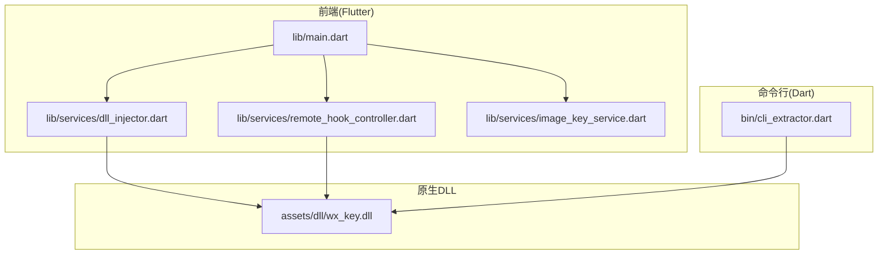
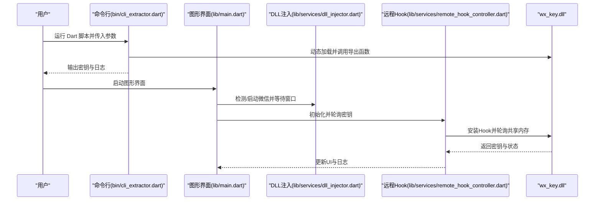
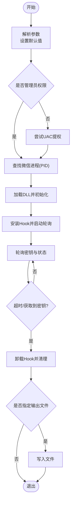
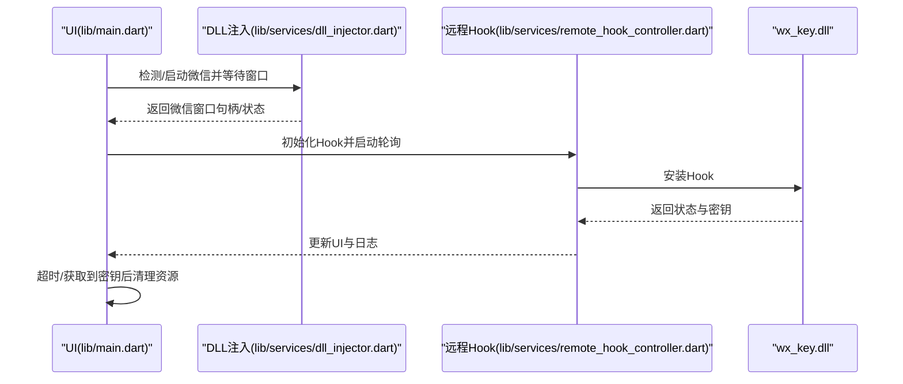
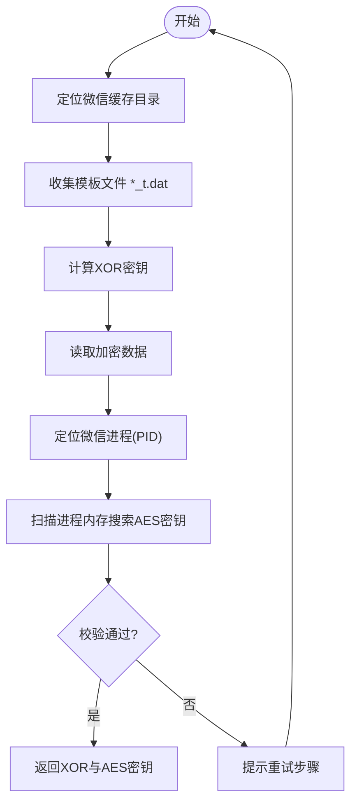
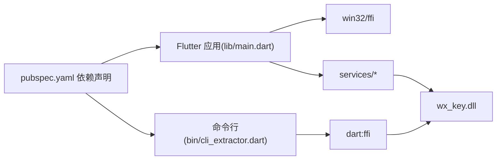

# 快速开始

<cite>
**本文引用的文件**
- [README.md](file://README.md)
- [bin/README.md](file://bin/README.md)
- [bin/cli_extractor.dart](file://bin/cli_extractor.dart)
- [docs/dll_usage.md](file://docs/dll_usage.md)
- [lib/main.dart](file://lib/main.dart)
- [lib/services/dll_injector.dart](file://lib/services/dll_injector.dart)
- [lib/services/remote_hook_controller.dart](file://lib/services/remote_hook_controller.dart)
- [lib/services/image_key_service.dart](file://lib/services/image_key_service.dart)
- [pubspec.yaml](file://pubspec.yaml)
- [SECURITY_ADVISORY.md](file://SECURITY_ADVISORY.md)
</cite>

## 目录
1. [简介](#简介)
2. [项目结构](#项目结构)
3. [核心组件](#核心组件)
4. [架构总览](#架构总览)
5. [详细组件分析](#详细组件分析)
6. [依赖关系分析](#依赖关系分析)
7. [性能与稳定性建议](#性能与稳定性建议)
8. [故障排除指南](#故障排除指南)
9. [结论](#结论)
10. [附录](#附录)

## 简介
本指南面向首次使用 wx_key 的用户，帮助你在最短时间内完成工具安装、运行与基础操作。工具支持在微信 4.x 版本中提取数据库密钥与缓存图片解密密钥，既提供图形界面版本，也提供无需界面的命令行版本。

- 重要提示：请从官方 GitHub Releases 页面下载最新 app.zip 压缩包，避免使用来源不明的版本。
- 为避免 DLL 加载失败等问题，请将工具文件夹放置在不含中文字符的路径下。

章节来源
- file://README.md#L59-L76

## 项目结构
- lib/：Flutter 前端与业务服务
  - main.dart：应用入口与窗口管理
  - services/：DLL 注入、远程 Hook 控制、密钥存储、日志、图片密钥服务等
- bin/：命令行版本（Dart 脚本）
- assets/dll/wx_key.dll：核心控制器 DLL
- docs/dll_usage.md：DLL 扩展使用说明
- wx_key/：C++ 原生项目（Visual Studio 工程）

图表来源
- [lib/main.dart](file://lib/main.dart#L1-L120)
- [lib/services/dll_injector.dart](file://lib/services/dll_injector.dart#L1-L120)
- [lib/services/remote_hook_controller.dart](file://lib/services/remote_hook_controller.dart#L1-L120)
- [lib/services/image_key_service.dart](file://lib/services/image_key_service.dart#L1-L120)
- [bin/cli_extractor.dart](file://bin/cli_extractor.dart#L1-L120)
- [pubspec.yaml](file://pubspec.yaml#L85-L87)

章节来源
- file://README.md#L77-L96
- file://pubspec.yaml#L85-L87

## 核心组件
- 命令行工具：无需界面，直接通过 Dart 调用 wx_key.dll 提取密钥，支持参数化配置与详细日志输出。
- 图形界面：基于 Flutter，提供微信版本检测、DLL 注入、密钥轮询、日志监控与密钥保存等功能。
- DLL 扩展：封装 Hook、内存扫描与共享内存轮询机制，供上层应用通过 FFI 调用。

章节来源
- file://bin/README.md#L1-L125
- file://docs/dll_usage.md#L1-L165
- file://lib/main.dart#L1-L120

## 架构总览
下图展示命令行与图形界面两种使用路径，均通过 FFI 调用 wx_key.dll，后者还包含 DLL 注入与窗口管理等辅助能力。

图表来源
- [bin/cli_extractor.dart](file://bin/cli_extractor.dart#L106-L188)
- [lib/main.dart](file://lib/main.dart#L709-L807)
- [lib/services/dll_injector.dart](file://lib/services/dll_injector.dart#L531-L602)
- [lib/services/remote_hook_controller.dart](file://lib/services/remote_hook_controller.dart#L89-L128)
- [assets/dll/wx_key.dll](file://assets/dll/wx_key.dll)

章节来源
- file://bin/cli_extractor.dart#L106-L188
- file://lib/main.dart#L709-L807
- file://lib/services/dll_injector.dart#L531-L602
- file://lib/services/remote_hook_controller.dart#L89-L128

## 详细组件分析

### 命令行工具（bin/cli_extractor.dart）
- 功能概述
  - 自动查找微信进程（优先加载 Weixin.dll 的进程），或由用户指定 PID
  - 动态加载 wx_key.dll 并调用其导出函数
  - 轮询共享内存获取密钥，支持超时与详细日志
  - 可将结果保存至文件
- 关键流程
  - 参数解析与默认值设置
  - 管理员权限检测与自动提权
  - DLL 初始化与 Hook 安装
  - 定时轮询密钥与状态消息
  - 清理资源与退出

图表来源
- [bin/cli_extractor.dart](file://bin/cli_extractor.dart#L430-L561)
- [bin/cli_extractor.dart](file://bin/cli_extractor.dart#L149-L188)
- [bin/cli_extractor.dart](file://bin/cli_extractor.dart#L190-L299)

章节来源
- file://bin/README.md#L7-L125
- file://bin/cli_extractor.dart#L430-L561

### 图形界面（lib/main.dart 与相关服务）
- 功能概述
  - 自动检测微信版本与安装路径
  - 一键注入 DLL、等待微信窗口就绪、轮询密钥
  - 日志监控与 UI 状态反馈
  - 密钥保存与剪贴板复制
- 关键流程
  - 启动时初始化窗口与日志
  - 检测微信版本与目录
  - 启动/关闭微信、等待窗口组件就绪
  - 注入 DLL 并轮询密钥
  - 超时处理与资源清理

图表来源
- [lib/main.dart](file://lib/main.dart#L709-L807)
- [lib/services/dll_injector.dart](file://lib/services/dll_injector.dart#L604-L657)
- [lib/services/remote_hook_controller.dart](file://lib/services/remote_hook_controller.dart#L89-L128)

章节来源
- file://lib/main.dart#L468-L534
- file://lib/services/dll_injector.dart#L604-L657
- file://lib/services/remote_hook_controller.dart#L89-L128

### 图片密钥获取服务（lib/services/image_key_service.dart）
- 功能概述
  - 自动定位微信缓存目录（支持多账号）
  - 从模板文件推导 XOR 密钥
  - 在微信进程内存中搜索并校验 AES 密钥
  - 提供进度回调与超时处理
- 推荐操作流程
  - 完全关闭当前登录的微信
  - 重新启动微信并登录
  - 打开朋友圈，寻找带图片的动态
  - 点击图片，再点击右上角打开大图
  - 重复上述步骤 2-3 次
  - 迅速回到工具内获取图片密钥

图表来源
- [lib/services/image_key_service.dart](file://lib/services/image_key_service.dart#L600-L697)

章节来源
- file://README.md#L68-L76
- file://lib/services/image_key_service.dart#L600-L697

### DLL 扩展使用（docs/dll_usage.md）
- 核心原理
  - 注入与扫描：定位微信进程并写入 Shellcode 进行 Hook
  - 共享内存：将拦截到的密钥写入共享缓冲并递增序列号
  - 轮询机制：上层应用定时检查共享内存获取密钥
- API 接口
  - InitializeHook：启动 Hook
  - PollKeyData：获取密钥（非阻塞）
  - GetStatusMessage：获取内部日志
  - CleanupHook：卸载 Hook
  - GetLastErrorMsg：错误诊断

章节来源
- file://docs/dll_usage.md#L1-L165

## 依赖关系分析
- Flutter 应用依赖 win32、ffi、path、shared_preferences、file_picker、http、url_launcher、window_manager、pointycastle 等包
- 命令行工具依赖 dart:ffi 与 path
- 原生 DLL 通过 FFI 被上层调用

图表来源
- [pubspec.yaml](file://pubspec.yaml#L30-L61)
- [lib/main.dart](file://lib/main.dart#L1-L15)
- [bin/cli_extractor.dart](file://bin/cli_extractor.dart#L1-L12)

章节来源
- file://pubspec.yaml#L30-L61

## 性能与稳定性建议
- 轮询间隔建议：命令行默认 100ms，图形界面默认 100ms，可根据系统负载适当增大
- 超时时间：命令行默认 300 秒，图形界面默认 60 秒，遇到复杂场景可适当延长
- 管理员权限：建议以管理员身份运行，避免权限不足导致 Hook 安装失败
- 路径规范：避免将工具放置在包含中文字符的路径下，防止 DLL 加载失败

章节来源
- file://bin/README.md#L65-L72
- file://bin/cli_extractor.dart#L420-L511

## 故障排除指南
- DLL 加载失败
  - 确认 DLL 文件存在且路径正确
  - 尝试以管理员身份运行
- 找不到微信进程
  - 确保微信已启动
  - 手动指定进程 PID
  - 使用系统工具确认 Weixin.exe 是否存在
- 提取失败
  - 检查微信版本是否支持
  - 确认管理员权限（自动提权被阻止时需手动以管理员运行）
  - 确认选择的是加载了 Weixin.dll 的正确进程
  - 查看详细输出了解具体错误
- 图片密钥获取失败
  - 按推荐流程反复打开大图，触发密钥生成
  - 确保微信进程处于活跃状态，避免被系统权限或安全软件阻止

章节来源
- file://bin/README.md#L92-L125
- file://lib/services/image_key_service.dart#L664-L686

## 结论
通过本快速开始指南，你可以在几分钟内完成工具的下载、安装与运行。建议优先使用图形界面版本以获得更好的交互体验，若追求自动化与批处理，可使用命令行版本。请始终遵循合法合规的使用原则，尊重知识产权与网络安全法规。

## 附录

### 安装与运行步骤
- 从 Releases 页面下载最新 app.zip 压缩包
- 解压后运行 wx_key.exe（或自行编译得到的可执行文件）
- 如遇中文路径问题，请将工具移动到不含中文字符的路径

章节来源
- file://README.md#L61-L67

### 命令行工具使用方法
- 基本用法
  - 自动查找微信进程并提取密钥
  - 指定微信进程 PID
  - 指定 DLL 路径
  - 保存结果到文件
  - 详细输出模式
- 参数说明
  - -p/--pid：微信进程 PID（可选，会自动查找）
  - -d/--dll：DLL 文件路径（默认: assets/dll/wx_key.dll）
  - -i/--interval：轮询间隔（毫秒，默认: 100）
  - -t/--timeout：超时时间（秒，默认: 300）
  - -o/--output：输出文件路径（可选）
  - -v/--verbose：详细输出模式
  - -h/--help：显示帮助信息

章节来源
- file://bin/README.md#L9-L54
- file://bin/cli_extractor.dart#L430-L471

### 图片密钥获取推荐流程
- 彻底关闭当前登录的微信
- 重新启动微信并登录
- 打开朋友圈，寻找带图片的动态
- 点击图片，再点击右上角打开大图
- 重复上述步骤 2-3 次
- 迅速回到工具内获取图片密钥

章节来源
- file://README.md#L68-L76
- file://lib/services/image_key_service.dart#L664-L686

### 安全与合规提示
- 请通过官方渠道下载，避免使用来源不明的版本
- 本项目仅供技术研究和学习使用，严禁用于任何恶意或非法目的
- 若发现侵权行为，请通过官方渠道举报

章节来源
- file://SECURITY_ADVISORY.md#L1-L33
- file://README.md#L19-L25