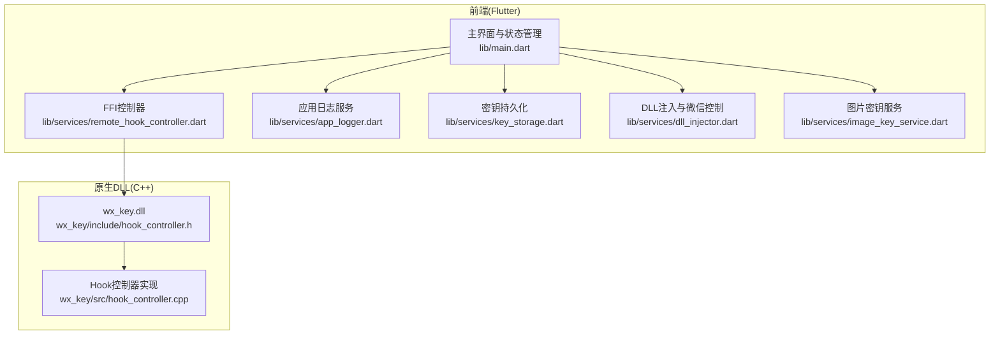
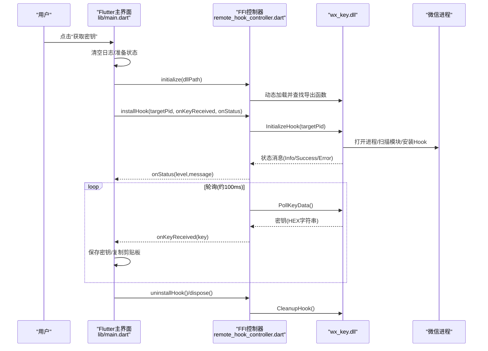
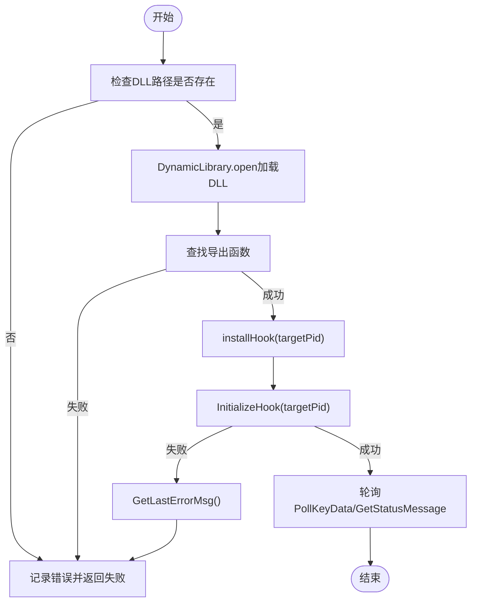
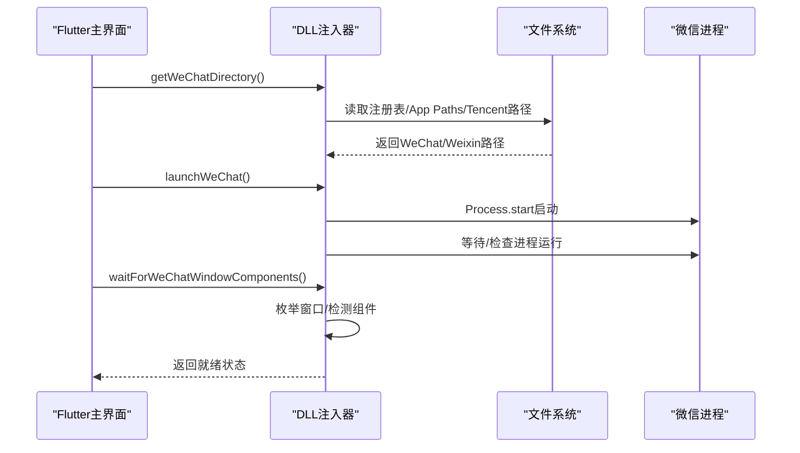
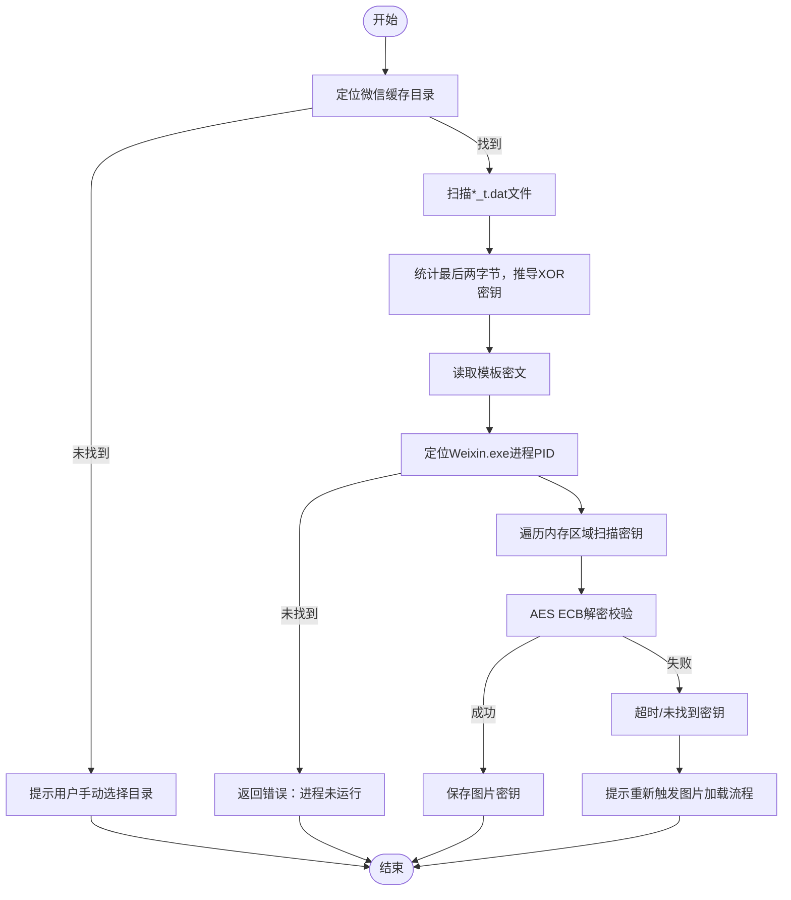
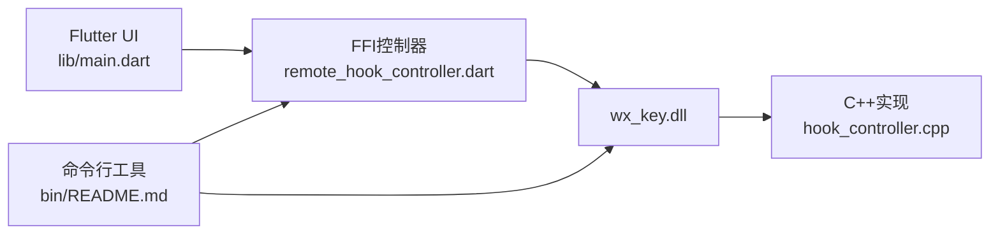

# 常见问题解决

<cite>
**本文引用的文件**
- [README.md](file://README.md)
- [docs/dll_usage.md](file://docs/dll_usage.md)
- [bin/README.md](file://bin/README.md)
- [lib/main.dart](file://lib/main.dart)
- [lib/services/remote_hook_controller.dart](file://lib/services/remote_hook_controller.dart)
- [lib/services/dll_injector.dart](file://lib/services/dll_injector.dart)
- [lib/services/image_key_service.dart](file://lib/services/image_key_service.dart)
- [lib/services/app_logger.dart](file://lib/services/app_logger.dart)
- [lib/services/key_storage.dart](file://lib/services/key_storage.dart)
- [wx_key/include/hook_controller.h](file://wx_key/include/hook_controller.h)
- [wx_key/src/hook_controller.cpp](file://wx_key/src/hook_controller.cpp)
</cite>

## 目录
1. [简介](#简介)
2. [项目结构](#项目结构)
3. [核心组件](#核心组件)
4. [架构总览](#架构总览)
5. [详细组件分析](#详细组件分析)
6. [依赖关系分析](#依赖关系分析)
7. [性能考虑](#性能考虑)
8. [故障排查指南](#故障排查指南)
9. [结论](#结论)
10. [附录](#附录)

## 简介
本指南聚焦于wx_key项目在Windows平台运行时的常见问题，涵盖DLL加载失败、权限不足、兼容性问题、微信进程启动失败、密钥提取失败、界面无响应等典型场景。结合项目中Flutter前端与C++ DLL的交互方式，提供可操作的诊断步骤、修复建议与最佳实践，帮助快速定位并解决问题。

## 项目结构
- 前端（Flutter）：负责UI、状态管理、日志与资源清理，通过FFI调用wx_key.dll。
- 原生DLL（C++）：负责微信进程扫描、Hook安装、共享内存通信与密钥轮询。
- 命令行工具（Dart）：提供无需UI的密钥提取流程，便于自动化与排障。

图表来源
- [lib/main.dart](file://lib/main.dart#L1-L120)
- [lib/services/remote_hook_controller.dart](file://lib/services/remote_hook_controller.dart#L1-L120)
- [lib/services/dll_injector.dart](file://lib/services/dll_injector.dart#L531-L602)
- [lib/services/image_key_service.dart](file://lib/services/image_key_service.dart#L600-L698)
- [lib/services/app_logger.dart](file://lib/services/app_logger.dart#L1-L120)
- [lib/services/key_storage.dart](file://lib/services/key_storage.dart#L1-L120)
- [wx_key/include/hook_controller.h](file://wx_key/include/hook_controller.h#L1-L50)
- [wx_key/src/hook_controller.cpp](file://wx_key/src/hook_controller.cpp#L414-L491)

章节来源
- [README.md](file://README.md#L77-L96)
- [lib/main.dart](file://lib/main.dart#L1-L120)

## 核心组件
- FFI控制器：负责加载DLL、查找导出函数、安装Hook、轮询密钥与状态、清理资源。
- DLL注入器：负责微信进程查找/启动、等待界面就绪、注入DLL。
- 图片密钥服务：解析缓存目录、统计XOR密钥、从模板文件读取密文、扫描微信进程内存获取AES密钥。
- 应用日志服务：统一记录INFO/SUCCESS/WARNING/ERROR日志，支持打开日志文件。
- 密钥存储：使用SharedPreferences持久化数据库密钥与图片密钥信息。

章节来源
- [lib/services/remote_hook_controller.dart](file://lib/services/remote_hook_controller.dart#L32-L128)
- [lib/services/dll_injector.dart](file://lib/services/dll_injector.dart#L531-L602)
- [lib/services/image_key_service.dart](file://lib/services/image_key_service.dart#L600-L698)
- [lib/services/app_logger.dart](file://lib/services/app_logger.dart#L61-L120)
- [lib/services/key_storage.dart](file://lib/services/key_storage.dart#L14-L135)

## 架构总览
下图展示从UI触发到DLL执行的关键调用链路与数据流。

图表来源
- [lib/main.dart](file://lib/main.dart#L709-L807)
- [lib/services/remote_hook_controller.dart](file://lib/services/remote_hook_controller.dart#L46-L128)
- [wx_key/include/hook_controller.h](file://wx_key/include/hook_controller.h#L12-L46)
- [wx_key/src/hook_controller.cpp](file://wx_key/src/hook_controller.cpp#L414-L491)

## 详细组件分析

### DLL加载与初始化（FFI控制器）
- 加载DLL：检查路径是否存在，DynamicLibrary.open成功后查找导出函数。
- 初始化Hook：调用InitializeHook(targetPid)，失败时通过GetLastErrorMsg获取错误。
- 轮询机制：每100ms调用PollKeyData与GetStatusMessage，避免UI线程阻塞。
- 清理资源：uninstallHook调用CleanupHook，释放Hook、IPC与远程内存。

图表来源
- [lib/services/remote_hook_controller.dart](file://lib/services/remote_hook_controller.dart#L46-L128)
- [wx_key/include/hook_controller.h](file://wx_key/include/hook_controller.h#L12-L46)
- [wx_key/src/hook_controller.cpp](file://wx_key/src/hook_controller.cpp#L414-L491)

章节来源
- [lib/services/remote_hook_controller.dart](file://lib/services/remote_hook_controller.dart#L46-L264)

### 微信进程启动与注入（DLL注入器）
- 查找微信：优先从注册表/App Paths/Tencent路径查找WeChat/Weixin可执行文件。
- 启动微信：Process.start以分离模式启动，等待2秒后检查进程是否运行。
- 等待界面：枚举窗口句柄，检测关键文本/类名标记，判断界面组件已就绪。
- 注入DLL：在UI流程中调用DLL注入与Hook安装。

图表来源
- [lib/services/dll_injector.dart](file://lib/services/dll_injector.dart#L406-L455)
- [lib/services/dll_injector.dart](file://lib/services/dll_injector.dart#L531-L602)
- [lib/services/dll_injector.dart](file://lib/services/dll_injector.dart#L604-L657)

章节来源
- [lib/services/dll_injector.dart](file://lib/services/dll_injector.dart#L531-L657)

### 图片密钥提取（内存扫描与密钥校验）
- 缓存目录定位：枚举Documents/xwechat_files下的账号目录，筛选含db_storage或Image缓存的目录。
- XOR密钥统计：从*_t.dat文件最后两字节统计最频繁的(x^0xFF, y^0xD9)组合，推导XOR密钥。
- AES密钥读取：从模板文件读取固定偏移的密文，随后在微信进程内存中搜索32字节ASCII/UTF-16密钥。
- 校验与超时：使用AES ECB解密验证，超时则提示重新触发微信图片加载流程。

图表来源
- [lib/services/image_key_service.dart](file://lib/services/image_key_service.dart#L600-L698)
- [lib/services/image_key_service.dart](file://lib/services/image_key_service.dart#L308-L467)

章节来源
- [lib/services/image_key_service.dart](file://lib/services/image_key_service.dart#L600-L698)

## 依赖关系分析
- 前端依赖FFI与win32库进行DLL加载与Windows API调用。
- DLL依赖远程扫描、Hook、IPC与共享内存等模块。
- 命令行工具依赖Dart FFI与win32，提供最小化流程验证。

图表来源
- [lib/main.dart](file://lib/main.dart#L1-L120)
- [lib/services/remote_hook_controller.dart](file://lib/services/remote_hook_controller.dart#L1-L120)
- [wx_key/src/hook_controller.cpp](file://wx_key/src/hook_controller.cpp#L414-L491)
- [bin/README.md](file://bin/README.md#L1-L125)

章节来源
- [lib/main.dart](file://lib/main.dart#L1-L120)
- [bin/README.md](file://bin/README.md#L1-L125)

## 性能考虑
- 轮询频率：UI侧每100ms轮询一次，兼顾及时性与CPU占用。
- 内存扫描：按4MB分块+65字节重叠，避免跨块遗漏；跳过大内存区域减少无效扫描。
- 日志缓冲：批量写入，定时刷新，降低IO压力。
- 资源清理：退出时主动uninstallHook并释放句柄，避免残留Hook影响微信稳定性。

章节来源
- [lib/services/remote_hook_controller.dart](file://lib/services/remote_hook_controller.dart#L130-L204)
- [lib/services/image_key_service.dart](file://lib/services/image_key_service.dart#L333-L467)
- [lib/services/app_logger.dart](file://lib/services/app_logger.dart#L120-L131)

## 故障排查指南

### 一、DLL加载失败
- 症状
  - FFI控制器初始化失败，日志显示“DLL文件不存在”或“导出函数加载失败”。
- 排查步骤
  - 确认DLL路径存在且可访问（assets/dll/wx_key.dll）。
  - 确保工具未安装在包含中文字符的目录，避免路径编码问题。
  - 以管理员身份运行，确保对DLL与目标进程的访问权限。
  - 检查系统架构一致性（DLL为x64，需在64位系统/64位微信上使用）。
- 相关实现
  - DLL加载与导出函数查找逻辑。
  - 环境要求与错误信息获取。

章节来源
- [lib/services/remote_hook_controller.dart](file://lib/services/remote_hook_controller.dart#L46-L87)
- [docs/dll_usage.md](file://docs/dll_usage.md#L15-L18)
- [README.md](file://README.md#L66-L66)

### 二、权限不足/无法打开进程
- 症状
  - InitializeHook失败，GetLastErrorMsg返回权限相关错误。
  - 进程打开失败或内存读取失败。
- 排查步骤
  - 以管理员身份运行工具与微信。
  - 关闭安全软件或加入白名单，避免阻止进程枚举与内存读取。
  - 确认微信版本支持（4.x系列）。
- 相关实现
  - 打开进程、系统调用初始化与错误格式化。
  - 进程内存读取与虚拟查询。

章节来源
- [wx_key/src/hook_controller.cpp](file://wx_key/src/hook_controller.cpp#L225-L256)
- [wx_key/src/hook_controller.cpp](file://wx_key/src/hook_controller.cpp#L125-L176)
- [lib/services/image_key_service.dart](file://lib/services/image_key_service.dart#L314-L321)

### 三、微信进程启动失败
- 症状
  - 启动微信失败，waitForWeChatWindowComponents超时。
- 排查步骤
  - 手动选择微信安装目录或在设置中配置。
  - 确认微信安装路径正确，存在WeChat.exe或Weixin.exe。
  - 若存在多个账号目录，优先选择含db_storage或Image缓存的目录。
- 相关实现
  - 注册表/App Paths/Tencent路径查找与默认路径探测。
  - 启动进程与等待界面组件就绪。

章节来源
- [lib/services/dll_injector.dart](file://lib/services/dll_injector.dart#L406-L455)
- [lib/services/dll_injector.dart](file://lib/services/dll_injector.dart#L531-L602)
- [lib/services/dll_injector.dart](file://lib/services/dll_injector.dart#L604-L657)

### 四、密钥提取失败
- 症状
  - 轮询无密钥，或GetStatusMessage提示“特征码未找到/版本不支持”。
- 排查步骤
  - 确认微信版本为4.x系列，且在支持范围内。
  - 重新登录微信并触发数据库读取（如打开聊天列表）。
  - 增大轮询间隔或延长超时时间，避免过早退出。
  - 检查DLL路径与架构匹配。
- 相关实现
  - 版本检测、特征码扫描与Hook安装。
  - 轮询与错误信息输出。

章节来源
- [wx_key/src/hook_controller.cpp](file://wx_key/src/hook_controller.cpp#L258-L282)
- [wx_key/src/hook_controller.cpp](file://wx_key/src/hook_controller.cpp#L283-L314)
- [lib/services/remote_hook_controller.dart](file://lib/services/remote_hook_controller.dart#L130-L204)

### 五、界面无响应/卡顿
- 症状
  - UI长时间无响应，轮询线程占用CPU。
- 排查步骤
  - 确保轮询在后台线程执行，避免在UI线程做死循环。
  - 调整轮询间隔至100ms，避免过于频繁。
  - 检查日志缓冲与磁盘IO，必要时清理日志文件。
- 相关实现
  - Timer周期性轮询与状态消息处理。
  - 日志缓冲与定时刷新。

章节来源
- [lib/services/remote_hook_controller.dart](file://lib/services/remote_hook_controller.dart#L130-L204)
- [lib/services/app_logger.dart](file://lib/services/app_logger.dart#L120-L131)

### 六、图片密钥提取失败
- 症状
  - 无法读取模板文件或从内存中找不到AES密钥。
- 排查步骤
  - 重新登录微信并多次打开带图片的朋友圈大图，触发缓存写入。
  - 确认缓存目录存在db_storage或Image子目录。
  - 若超时，按提示重新触发图片加载流程。
- 相关实现
  - 模板文件扫描、XOR密钥统计与AES密钥内存扫描。
  - 超时处理与用户提示。

章节来源
- [lib/services/image_key_service.dart](file://lib/services/image_key_service.dart#L600-L698)
- [lib/services/image_key_service.dart](file://lib/services/image_key_service.dart#L656-L686)

### 七、兼容性问题
- Windows版本
  - 项目明确支持Windows平台，建议在64位系统上运行。
- 微信版本
  - 支持微信4.x系列，已实测版本包括4.1.5.11、4.1.4.17等。
- 架构匹配
  - DLL为x64，需在64位系统与64位微信客户端上使用。

章节来源
- [README.md](file://README.md#L45-L56)
- [docs/dll_usage.md](file://docs/dll_usage.md#L15-L18)

### 八、错误代码与对应解决措施
- 常见错误类别
  - DLL加载失败：检查路径与权限；避免中文路径；以管理员运行。
  - 权限不足：以管理员身份运行工具与微信；关闭安全软件。
  - 版本不支持：确认微信版本为4.x；更新DLL特征码库。
  - 进程打开失败：确认微信进程存在；检查防病毒软件拦截。
  - 内存扫描失败：增大轮询/超时；重新触发微信图片加载。
- 获取错误信息
  - FFI控制器通过GetLastErrorMsg获取DLL内部错误字符串。
  - 应用日志服务记录INFO/SUCCESS/WARNING/ERROR级别日志，便于定位。

章节来源
- [lib/services/remote_hook_controller.dart](file://lib/services/remote_hook_controller.dart#L237-L253)
- [wx_key/src/hook_controller.cpp](file://wx_key/src/hook_controller.cpp#L177-L181)
- [lib/services/app_logger.dart](file://lib/services/app_logger.dart#L61-L86)

### 九、问题自检清单
- 系统与架构
  - 是否在64位Windows上运行？
  - 是否使用64位微信客户端？
- 路径与权限
  - 工具与DLL路径是否包含中文字符？
  - 是否以管理员身份运行？
- 微信状态
  - 微信是否已启动并登录？
  - 是否已触发数据库/图片缓存读取？
- 运行时行为
  - 轮询间隔是否合理（建议100ms）？
  - 是否在UI线程执行轮询？
- 日志与诊断
  - 是否查看并清理日志文件？
  - 是否使用命令行工具进行最小化流程验证？

章节来源
- [README.md](file://README.md#L66-L66)
- [bin/README.md](file://bin/README.md#L67-L71)
- [lib/services/remote_hook_controller.dart](file://lib/services/remote_hook_controller.dart#L130-L204)
- [lib/services/app_logger.dart](file://lib/services/app_logger.dart#L133-L167)

## 结论
通过上述分层排查与流程梳理，大多数运行时问题均可在权限、路径、架构与微信版本层面得到定位与修复。建议优先以管理员身份运行、确保DLL与微信架构一致、正确触发微信缓存读取，并结合日志与命令行工具进行最小化验证，从而快速恢复稳定运行。

## 附录

### A. 常用命令与参数（命令行工具）
- 自动查找微信进程并提取密钥
- 指定微信进程PID、DLL路径、轮询间隔、超时时间、输出文件
- 详细输出模式与帮助信息

章节来源
- [bin/README.md](file://bin/README.md#L9-L54)

### B. DLL导出函数与调用要点
- InitializeHook：启动入口，返回布尔值；失败时调用GetLastErrorMsg获取原因。
- PollKeyData：非阻塞轮询，返回密钥（HEX字符串）。
- GetStatusMessage：获取状态日志，带级别（Info/Success/Error）。
- CleanupHook：清理Hook与IPC资源，退出前务必调用。

章节来源
- [docs/dll_usage.md](file://docs/dll_usage.md#L21-L60)
- [wx_key/include/hook_controller.h](file://wx_key/include/hook_controller.h#L12-L46)