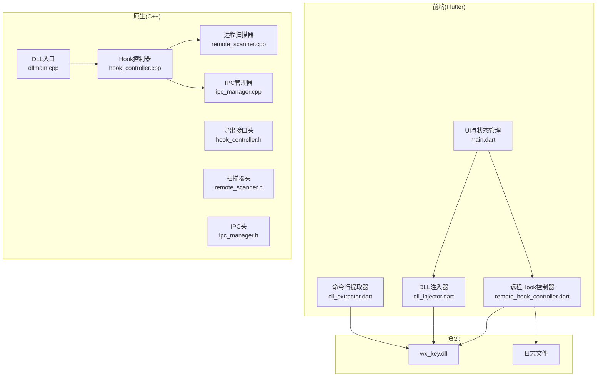
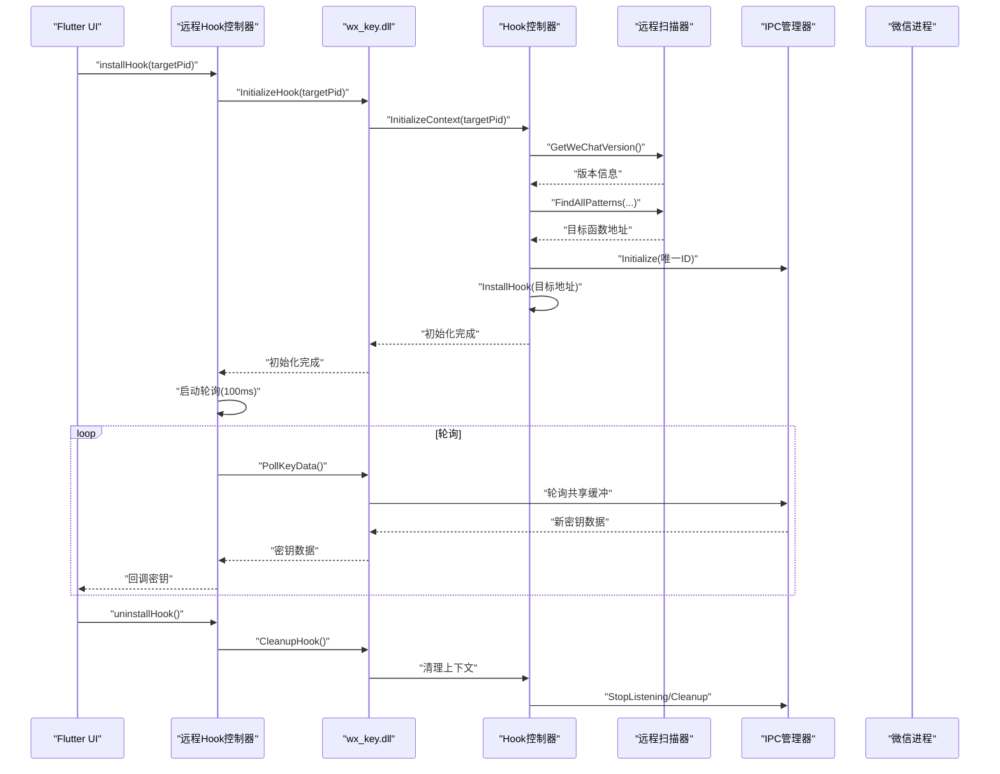
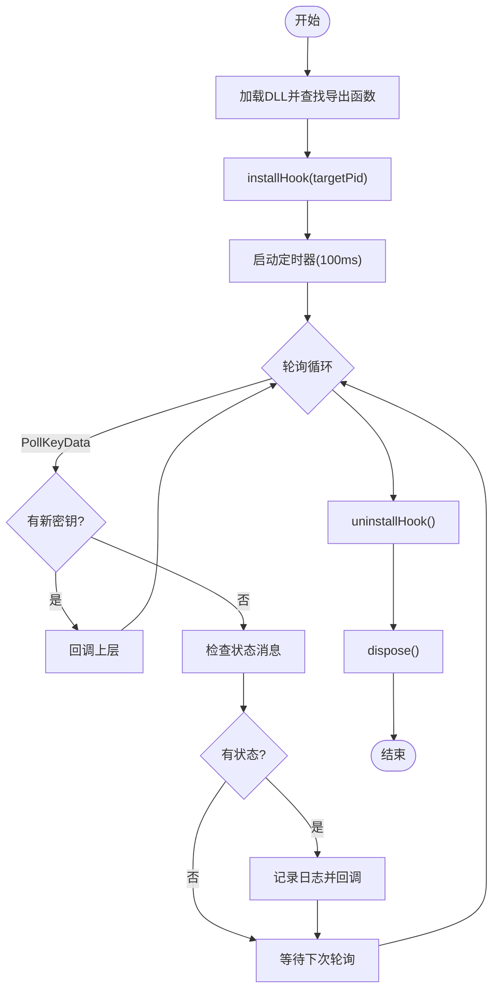
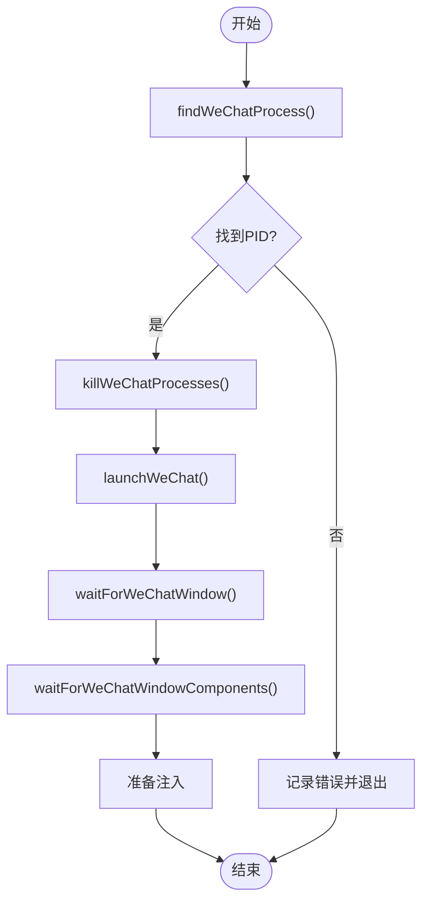
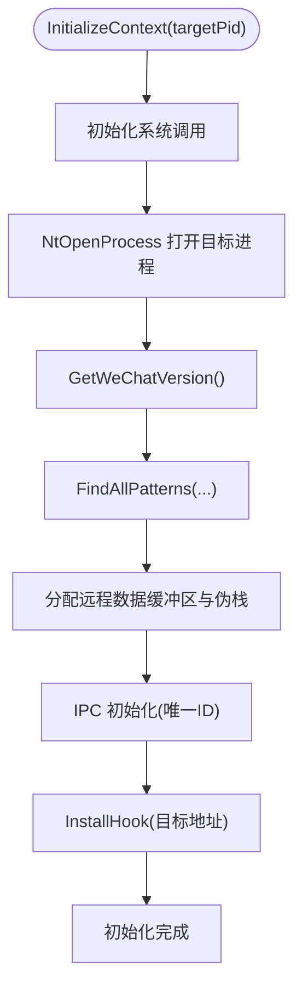
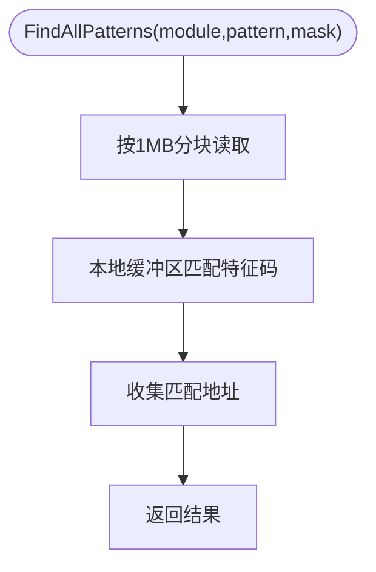
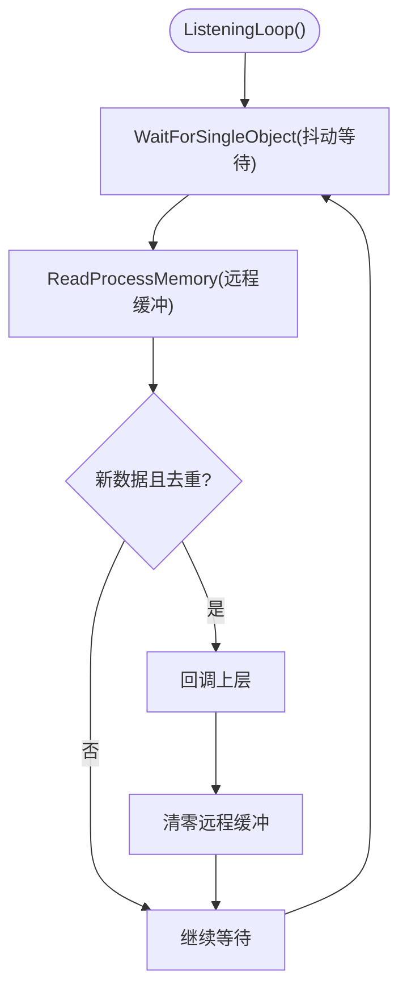
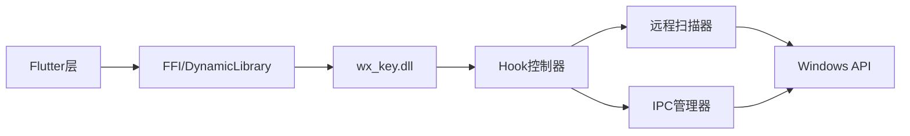

# 性能优化与监控

<cite>
**本文引用的文件**
- [README.md](file://README.md)
- [dll_usage.md](file://docs/dll_usage.md)
- [cli_extractor.dart](file://bin/cli_extractor.dart)
- [main.dart](file://lib/main.dart)
- [remote_hook_controller.dart](file://lib/services/remote_hook_controller.dart)
- [dll_injector.dart](file://lib/services/dll_injector.dart)
- [dllmain.cpp](file://wx_key/dllmain.cpp)
- [hook_controller.cpp](file://wx_key/src/hook_controller.cpp)
- [remote_scanner.cpp](file://wx_key/src/remote_scanner.cpp)
- [ipc_manager.cpp](file://wx_key/src/ipc_manager.cpp)
- [hook_controller.h](file://wx_key/include/hook_controller.h)
- [remote_scanner.h](file://wx_key/include/remote_scanner.h)
- [ipc_manager.h](file://wx_key/include/ipc_manager.h)
- [pubspec.yaml](file://pubspec.yaml)
</cite>

## 目录
1. [简介](#简介)
2. [项目结构](#项目结构)
3. [核心组件](#核心组件)
4. [架构总览](#架构总览)
5. [详细组件分析](#详细组件分析)
6. [依赖关系分析](#依赖关系分析)
7. [性能考量](#性能考量)
8. [故障排查指南](#故障排查指南)
9. [结论](#结论)
10. [附录](#附录)

## 简介
本指南围绕 wx_key 项目的性能优化与资源监控展开，聚焦以下目标：
- 内存使用优化：减少扫描与轮询带来的内存峰值与碎片
- CPU 占用控制：通过轮询节流、抖动与最小化系统调用降低 CPU 占用
- 磁盘 I/O 优化：避免频繁日志写入与不必要的文件操作
- DLL 注入过程的性能影响与优化：降低注入与 Hook 安装对目标进程的影响
- 微信进程监控与资源使用分析：提供可落地的监控手段
- 避免系统资源泄漏与性能瓶颈：规范生命周期与清理流程
- 性能基准测试与对比：给出可复现实验设计
- 资源监控工具与指标：推荐可用工具与关键指标
- 批处理与并发优化：在保证稳定性的前提下提升吞吐
- 长期运行稳定性保障：容错、限流与健康检查

## 项目结构
该项目采用 Flutter 前端 + C++ 原生 DLL 的混合架构：
- Flutter 层负责 UI、进程控制、日志与状态轮询
- C++ 层提供 Hook 控制、远程扫描、IPC 与 Shellcode 集成
- DLL 作为控制器在宿主进程中运行，不直接注入微信进程

图表来源
- [main.dart](file://lib/main.dart#L1-L120)
- [remote_hook_controller.dart](file://lib/services/remote_hook_controller.dart#L1-L120)
- [dll_injector.dart](file://lib/services/dll_injector.dart#L1-L120)
- [cli_extractor.dart](file://bin/cli_extractor.dart#L1-L120)
- [dllmain.cpp](file://wx_key/dllmain.cpp#L1-L24)
- [hook_controller.cpp](file://wx_key/src/hook_controller.cpp#L1-L120)
- [remote_scanner.cpp](file://wx_key/src/remote_scanner.cpp#L1-L120)
- [ipc_manager.cpp](file://wx_key/src/ipc_manager.cpp#L1-L120)
- [hook_controller.h](file://wx_key/include/hook_controller.h#L1-L50)
- [remote_scanner.h](file://wx_key/include/remote_scanner.h#L1-L70)
- [ipc_manager.h](file://wx_key/include/ipc_manager.h#L1-L80)

章节来源
- [README.md](file://README.md#L77-L96)
- [pubspec.yaml](file://pubspec.yaml#L30-L61)

## 核心组件
- 远程 Hook 控制器（Flutter）：负责加载 DLL、安装 Hook、轮询密钥与状态、清理资源
- DLL 注入器（Flutter）：负责微信进程发现、启动、窗口等待与注入时机控制
- Hook 控制器（C++）：初始化系统调用、打开目标进程、版本识别、特征码扫描、安装 Hook、IPC 初始化与数据回调
- 远程扫描器（C++）：按模块扫描特征码，分块读取远程内存，降低一次性内存压力
- IPC 管理器（C++）：轮询模式读取共享内存缓冲区，避免事件竞争与高耦合

章节来源
- [remote_hook_controller.dart](file://lib/services/remote_hook_controller.dart#L32-L128)
- [dll_injector.dart](file://lib/services/dll_injector.dart#L508-L657)
- [hook_controller.cpp](file://wx_key/src/hook_controller.cpp#L214-L379)
- [remote_scanner.cpp](file://wx_key/src/remote_scanner.cpp#L108-L204)
- [ipc_manager.cpp](file://wx_key/src/ipc_manager.cpp#L163-L271)

## 架构总览
整体工作流：前端触发 → DLL 加载 → Hook 安装 → 微信进程触发 → Shellcode 写入共享缓冲 → 前端轮询读取 → 清理资源

图表来源
- [remote_hook_controller.dart](file://lib/services/remote_hook_controller.dart#L89-L137)
- [hook_controller.cpp](file://wx_key/src/hook_controller.cpp#L414-L491)
- [ipc_manager.cpp](file://wx_key/src/ipc_manager.cpp#L163-L271)
- [dll_usage.md](file://docs/dll_usage.md#L35-L59)

## 详细组件分析

### 远程 Hook 控制器（Flutter）
- 轮询策略：每 100ms 轮询一次，避免 UI 线程阻塞与高 CPU 占用
- 资源管理：统一初始化、启动/停止轮询、卸载 Hook、清理回调引用
- 错误处理：获取 DLL 最后错误信息并记录日志

图表来源
- [remote_hook_controller.dart](file://lib/services/remote_hook_controller.dart#L89-L204)

章节来源
- [remote_hook_controller.dart](file://lib/services/remote_hook_controller.dart#L89-L235)

### DLL 注入器（Flutter）
- 进程发现：优先通过模块 Weixin.dll 定位微信进程，其次 Weixin.exe，最后回退到 WeChatAppEx.exe 并按内存占用择优
- 启动与等待：启动微信后等待主窗口出现并检测界面组件加载完成
- 权限与稳定性：终止现有微信进程，避免残留 Hook 影响

图表来源
- [dll_injector.dart](file://lib/services/dll_injector.dart#L508-L657)

章节来源
- [dll_injector.dart](file://lib/services/dll_injector.dart#L508-L657)

### Hook 控制器（C++）
- 初始化流程：打开目标进程、版本识别、特征码扫描、分配远程缓冲与伪栈、初始化 IPC、安装 Hook
- 线程同步：使用临界区保护共享数据，限制状态队列长度
- 错误处理：统一发送状态消息与最后错误信息

图表来源
- [hook_controller.cpp](file://wx_key/src/hook_controller.cpp#L214-L379)

章节来源
- [hook_controller.cpp](file://wx_key/src/hook_controller.cpp#L214-L491)
- [hook_controller.h](file://wx_key/include/hook_controller.h#L12-L46)

### 远程扫描器（C++）
- 分块扫描：以 1MB 为块读取远程内存，减少一次性内存压力
- 版本配置：针对不同微信版本维护特征码与掩码，提高适配性

图表来源
- [remote_scanner.cpp](file://wx_key/src/remote_scanner.cpp#L163-L204)

章节来源
- [remote_scanner.cpp](file://wx_key/src/remote_scanner.cpp#L108-L204)
- [remote_scanner.h](file://wx_key/include/remote_scanner.h#L15-L44)

### IPC 管理器（C++）
- 轮询模式：监听线程以抖动等待（约 80-143ms）轮询远程缓冲区，避免稳定频率特征
- 去重与清零：基于 sequenceNumber 去重，读取后清零远程缓冲防止重复消费

图表来源
- [ipc_manager.cpp](file://wx_key/src/ipc_manager.cpp#L212-L271)

章节来源
- [ipc_manager.cpp](file://wx_key/src/ipc_manager.cpp#L163-L271)
- [ipc_manager.h](file://wx_key/include/ipc_manager.h#L9-L16)

## 依赖关系分析
- 前端依赖：win32、ffi、path、shared_preferences、file_picker、http、window_manager 等
- 原生依赖：Psapi.lib、version.lib、Windows.h
- 组件耦合：Flutter 层通过 FFI 与 C++ DLL 交互；DLL 内部通过 Hook 控制器协调扫描与 IPC

图表来源
- [pubspec.yaml](file://pubspec.yaml#L30-L61)
- [hook_controller.cpp](file://wx_key/src/hook_controller.cpp#L1-L20)
- [ipc_manager.cpp](file://wx_key/src/ipc_manager.cpp#L1-L7)

章节来源
- [pubspec.yaml](file://pubspec.yaml#L30-L61)

## 性能考量

### 内存使用优化
- 远程扫描分块读取：每次读取 1MB，避免一次性映射大块内存，降低内存峰值与碎片
- 本地缓冲复用：扫描缓冲预分配并复用，减少频繁分配释放
- 临界区保护：共享数据与状态队列使用临界区，避免竞态与额外拷贝
- 资源及时释放：IPC 停止监听与 DLL Detach 时清理句柄与缓冲

优化建议
- 控制状态队列长度上限（当前限制为 100），避免日志堆积
- 轮询缓冲区大小建议与密钥长度一致（65 字节），避免多余分配
- 远程伪栈大小（32KB）可按需调整，平衡 Hook 稳定性与内存占用

章节来源
- [remote_scanner.cpp](file://wx_key/src/remote_scanner.cpp#L108-L114)
- [remote_scanner.cpp](file://wx_key/src/remote_scanner.cpp#L170-L172)
- [hook_controller.cpp](file://wx_key/src/hook_controller.cpp#L117-L123)
- [hook_controller.cpp](file://wx_key/src/hook_controller.cpp#L316-L332)
- [dllmain.cpp](file://wx_key/dllmain.cpp#L18-L22)

### CPU 占用控制
- 轮询节流：Flutter 层每 100ms 轮询一次，IPC 线程抖动等待 80-143ms，有效降低 CPU 占用
- 非阻塞接口：PollKeyData 与 GetStatusMessage 为非阻塞，避免线程阻塞
- 事件唤醒 + 轮询：虽然不再使用事件，但轮询仍具备抖动，减少稳定频率导致的忙等

优化建议
- 可根据场景动态调整轮询间隔（如 200ms/500ms），在延迟与 CPU 间折中
- 对高频状态消息进行去重与合并上报，减少 UI 更新频率

章节来源
- [dll_usage.md](file://docs/dll_usage.md#L52-L54)
- [remote_hook_controller.dart](file://lib/services/remote_hook_controller.dart#L131-L137)
- [ipc_manager.cpp](file://wx_key/src/ipc_manager.cpp#L214-L217)

### 磁盘 I/O 优化
- 日志文件：前端通过日志流写入文件，建议限制日志级别与总量，避免频繁刷盘
- 临时 DLL：命令行工具支持将 DLL 提取到临时目录，减少重复 IO

优化建议
- 使用滚动日志与固定大小上限，超过阈值自动清理
- 将日志写入内存缓冲，定期批量落盘

章节来源
- [cli_extractor.dart](file://bin/cli_extractor.dart#L59-L90)
- [cli_extractor.dart](file://bin/cli_extractor.dart#L522-L531)

### DLL 注入过程的性能影响与优化
- 注入时机：通过等待微信界面组件加载完成后再注入，避免在关键初始化阶段注入造成卡顿
- 进程终止：注入前终止现有微信进程，避免残留 Hook 导致不稳定
- 权限要求：部分操作需要管理员权限，失败时尽早提示并引导提权

优化建议
- 注入前进行轻量级健康检查（进程是否存在、模块是否加载）
- 注入后快速轮询一次，确认 Hook 生效，避免长时间无响应

章节来源
- [dll_injector.dart](file://lib/services/dll_injector.dart#L508-L657)
- [dll_usage.md](file://docs/dll_usage.md#L15-L18)

### 微信进程监控与资源使用分析
- 进程发现：优先通过 Weixin.dll 定位，其次 Weixin.exe，最后回退到 WeChatAppEx.exe 并择优
- 界面等待：通过枚举窗口标题与类名，结合子窗口数量阈值判断界面就绪
- 超时控制：设置最大等待时间，避免无限等待

优化建议
- 增加心跳检测：在注入后定期检查微信进程状态
- 记录关键时间点：注入前/后、界面就绪、Hook 生效等

章节来源
- [dll_injector.dart](file://lib/services/dll_injector.dart#L508-L657)

### 避免系统资源泄漏与性能瓶颈
- 清理顺序：先停止轮询，再卸载 Hook，最后清理回调与 DLL 引用
- 句柄与内存：确保 CloseHandle、UnmapViewOfFile、DeleteCriticalSection 等资源释放
- DLL 生命周期：DLL_PROCESS_DETACH 中调用 CleanupHook，避免残留

章节来源
- [remote_hook_controller.dart](file://lib/services/remote_hook_controller.dart#L206-L235)
- [hook_controller.cpp](file://wx_key/src/hook_controller.cpp#L381-L411)
- [dllmain.cpp](file://wx_key/dllmain.cpp#L18-L22)

### 性能基准测试与对比
建议的实验设计
- 测试目标：不同轮询间隔（100ms/200ms/500ms）、不同微信版本、不同系统负载
- 指标：CPU 占用率、内存占用、轮询延迟、成功率、首次命中时间
- 方法：使用系统自带性能监视器或第三方工具（如 Windows Performance Toolkit、Process Explorer）采集数据
- 对比：同一场景下对比事件驱动与轮询两种模式（若未来引入事件）

实施要点
- 保持环境一致：相同硬件、相同系统版本、相同微信版本
- 多次重复：每个配置至少运行 5 次取平均值
- 记录日志：同时记录状态消息与错误信息，便于问题定位

### 资源监控工具与指标
推荐工具
- Windows 任务管理器/性能监视器：查看 CPU、内存、句柄数
- Process Explorer：查看模块、句柄、线程与内存映射
- Windows Performance Toolkit：ETW 采样与火焰图
- VisualVM/JProfiler（如需分析 Dart/FFI 性能）

关键指标
- CPU 占用率（轮询线程与 IPC 线程）
- 内存使用（常驻与峰值）
- 轮询延迟（从轮询到回调）
- Hook 生效时间（从注入到首次回调）
- 错误率与错误类型分布

### 批处理与并发优化
- 批处理：对多个微信实例进行批处理时，建议串行注入并增加注入间隔，避免系统资源争用
- 并发：UI 线程仅负责展示，所有 I/O 与系统调用在后台线程执行
- 去重：基于 sequenceNumber 去重，避免重复处理同一密钥

章节来源
- [ipc_manager.cpp](file://wx_key/src/ipc_manager.cpp#L244-L247)
- [remote_hook_controller.dart](file://lib/services/remote_hook_controller.dart#L168-L200)

### 长期运行稳定性保障
- 超时与重试：设置最大等待时间与最大重试次数，避免长时间挂起
- 健康检查：定期检查微信进程状态与 DLL 是否正常
- 日志归档：限制日志文件大小，定期清理旧日志
- 资源回收：确保异常退出也能触发清理流程

章节来源
- [main.dart](file://lib/main.dart#L690-L707)
- [remote_hook_controller.dart](file://lib/services/remote_hook_controller.dart#L206-L235)

## 故障排查指南
常见问题与对策
- 权限不足：提示以管理员身份运行，检查 fltmc 命令返回码
- 微信版本不支持：特征码库未覆盖新版本，需更新特征码
- 注入失败：检查微信进程是否在注入前被终止，或注入时机不当
- 轮询无数据：确认轮询间隔合理，IPC 线程是否在运行，共享缓冲是否被清零

章节来源
- [dll_usage.md](file://docs/dll_usage.md#L135-L165)
- [cli_extractor.dart](file://bin/cli_extractor.dart#L486-L511)
- [hook_controller.cpp](file://wx_key/src/hook_controller.cpp#L262-L266)

## 结论
本项目通过轮询模式与分块扫描在稳定性与性能之间取得平衡：较低的 CPU 占用、可控的内存峰值、可靠的资源清理与完善的错误处理。建议在生产环境中进一步细化轮询策略、引入事件驱动（若可行）与更精细的监控指标，以获得更优的用户体验与更低的系统开销。

## 附录
- 命令行工具：支持自定义轮询间隔、超时时间与输出文件，适合自动化与批处理场景
- 文档与接口：DLL 导出函数与调用流程清晰，便于二次集成

章节来源
- [cli_extractor.dart](file://bin/cli_extractor.dart#L430-L471)
- [dll_usage.md](file://docs/dll_usage.md#L21-L60)