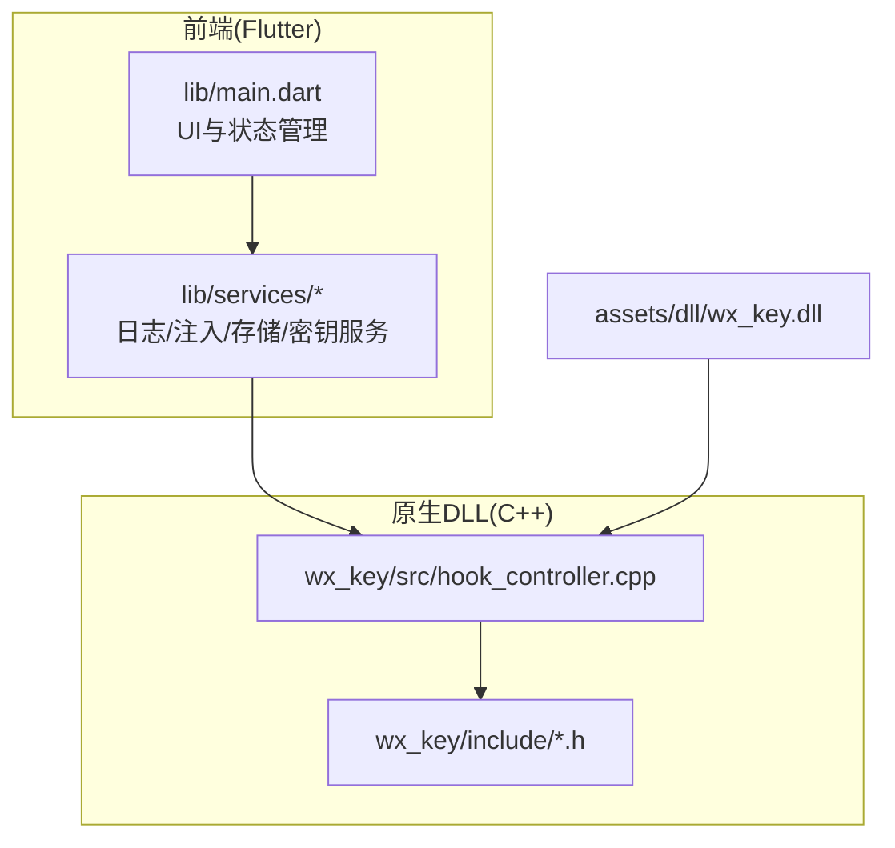
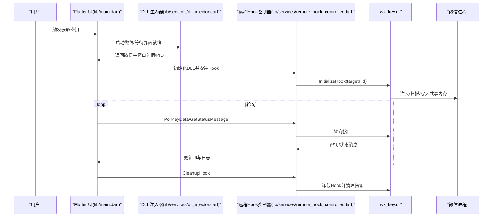
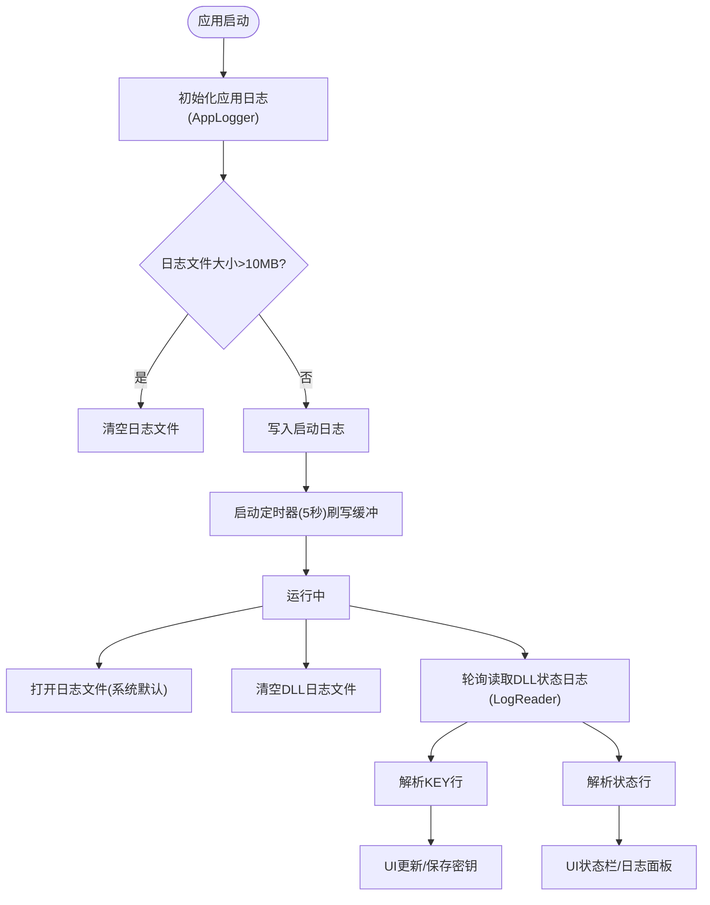
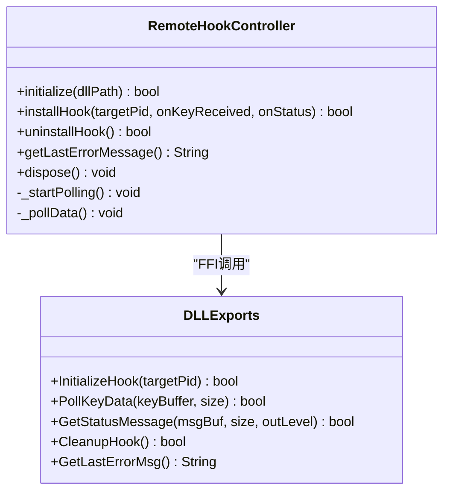
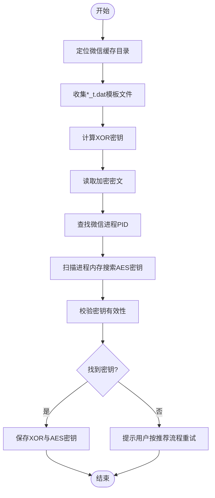
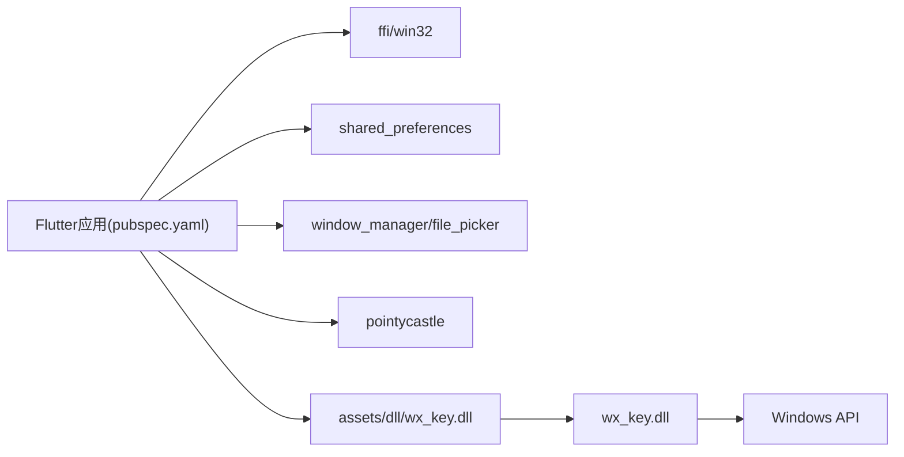

# 故障排除与维护

<cite>
**本文档引用的文件**
- [README.md](file://README.md)
- [SECURITY_ADVISORY.md](file://SECURITY_ADVISORY.md)
- [pubspec.yaml](file://pubspec.yaml)
- [bin/README.md](file://bin/README.md)
- [docs/dll_usage.md](file://docs/dll_usage.md)
- [lib/main.dart](file://lib/main.dart)
- [lib/services/app_logger.dart](file://lib/services/app_logger.dart)
- [lib/services/log_reader.dart](file://lib/services/log_reader.dart)
- [lib/services/key_storage.dart](file://lib/services/key_storage.dart)
- [lib/services/image_key_service.dart](file://lib/services/image_key_service.dart)
- [lib/services/dll_injector.dart](file://lib/services/dll_injector.dart)
- [lib/services/remote_hook_controller.dart](file://lib/services/remote_hook_controller.dart)
- [lib/services/image_key_service.dart](file://lib/services/image_key_service.dart)
- [wx_key/include/hook_controller.h](file://wx_key/include/hook_controller.h)
- [wx_key/include/remote_scanner.h](file://wx_key/include/remote_scanner.h)
- [wx_key/src/hook_controller.cpp](file://wx_key/src/hook_controller.cpp)
</cite>

## 目录
1. [简介](#简介)
2. [项目结构](#项目结构)
3. [核心组件](#核心组件)
4. [架构总览](#架构总览)
5. [详细组件分析](#详细组件分析)
6. [依赖关系分析](#依赖关系分析)
7. [性能考虑](#性能考虑)
8. [故障排除指南](#故障排除指南)
9. [结论](#结论)
10. [附录](#附录)

## 简介
本指南面向 wx_key 项目的使用者与维护者，聚焦于安装与运行时常见问题的诊断与修复、日志系统使用与定位、系统诊断步骤、性能优化与资源监控、版本更新与升级策略、安全注意事项与最佳实践，以及数据备份与恢复流程。项目采用 Flutter 前端与 C++ 原生 DLL 的混合架构，通过 DLL 注入与内存扫描实现微信密钥提取。

## 项目结构
项目采用分层组织方式：
- Flutter 前端：lib/ 目录，包含 UI、服务层与组件
- 原生 DLL：wx_key/ 目录，包含 C++ 实现与头文件
- 资源与文档：assets/、docs/、bin/ 等
- 平台构建：android/、ios/、linux/、macos/、windows/

图表来源
- [lib/main.dart](file://lib/main.dart#L1-L120)
- [lib/services/dll_injector.dart](file://lib/services/dll_injector.dart#L1-L120)
- [wx_key/src/hook_controller.cpp](file://wx_key/src/hook_controller.cpp#L1-L120)
- [wx_key/include/hook_controller.h](file://wx_key/include/hook_controller.h#L1-L50)

章节来源
- [README.md](file://README.md#L77-L96)
- [pubspec.yaml](file://pubspec.yaml#L84-L112)

## 核心组件
- 应用日志服务：集中记录应用运行状态与错误，支持缓冲与定时刷写，日志文件位于用户 APPDATA 目录下的 wx_key 子目录。
- 日志读取服务：轮询读取系统临时目录中的 DLL 状态日志，解析密钥与状态消息。
- DLL 注入与远程 Hook 控制器：通过 FFI 加载 wx_key.dll，调用初始化、轮询与清理接口。
- 密钥存储服务：使用 SharedPreferences 持久化数据库密钥与图片密钥信息。
- 图片密钥服务：扫描微信缓存目录，解析模板文件，结合微信进程内存扫描获取图片解密密钥。
- DLL 使用与集成：提供标准 C 风格 API，支持轮询模式与错误诊断。

章节来源
- [lib/services/app_logger.dart](file://lib/services/app_logger.dart#L1-L191)
- [lib/services/log_reader.dart](file://lib/services/log_reader.dart#L1-L138)
- [lib/services/remote_hook_controller.dart](file://lib/services/remote_hook_controller.dart#L1-L278)
- [lib/services/key_storage.dart](file://lib/services/key_storage.dart#L1-L273)
- [lib/services/image_key_service.dart](file://lib/services/image_key_service.dart#L1-L200)
- [docs/dll_usage.md](file://docs/dll_usage.md#L21-L60)

## 架构总览
整体架构围绕“前端控制 + 原生 DLL + 微信进程”的交互展开。前端通过 DLL 注入器启动微信、等待界面就绪，随后通过远程 Hook 控制器加载 DLL 并轮询密钥与状态消息；DLL 内部通过远程扫描与 Hook 捕获密钥，写入共享内存并通过 IPC/轮询机制回传给前端。

图表来源
- [lib/main.dart](file://lib/main.dart#L709-L807)
- [lib/services/dll_injector.dart](file://lib/services/dll_injector.dart#L531-L602)
- [lib/services/remote_hook_controller.dart](file://lib/services/remote_hook_controller.dart#L89-L128)
- [wx_key/src/hook_controller.cpp](file://wx_key/src/hook_controller.cpp#L182-L200)

## 详细组件分析

### 日志系统与文件位置
- 应用日志：位于用户 APPDATA 目录下的 wx_key 子目录，文件名为 app.log；支持 INFO/SUCCESS/WARNING/ERROR 等级别，具备缓冲与定时刷写机制，超过一定大小会自动清空。
- DLL 状态日志：位于系统临时目录，文件名为 wx_key_status.log；前端通过轮询读取，解析 KEY 行与状态行，分别触发密钥接收与状态更新。

图表来源
- [lib/services/app_logger.dart](file://lib/services/app_logger.dart#L30-L58)
- [lib/services/app_logger.dart](file://lib/services/app_logger.dart#L133-L144)
- [lib/services/log_reader.dart](file://lib/services/log_reader.dart#L96-L135)

章节来源
- [lib/services/app_logger.dart](file://lib/services/app_logger.dart#L1-L191)
- [lib/services/log_reader.dart](file://lib/services/log_reader.dart#L1-L138)

### DLL 注入与远程 Hook 控制器
- DLL 加载：通过 FFI 动态加载 wx_key.dll，查找导出函数并建立调用桥接。
- 初始化 Hook：传入微信进程 PID，DLL 内部完成远程扫描、分配共享内存与注入 Shellcode。
- 轮询机制：前端定时轮询 PollKeyData 与 GetStatusMessage，获取密钥与状态消息。
- 清理资源：调用 CleanupHook 卸载 Hook、释放共享内存并关闭句柄。

图表来源
- [lib/services/remote_hook_controller.dart](file://lib/services/remote_hook_controller.dart#L34-L278)
- [wx_key/include/hook_controller.h](file://wx_key/include/hook_controller.h#L12-L46)

章节来源
- [lib/services/remote_hook_controller.dart](file://lib/services/remote_hook_controller.dart#L1-L278)
- [docs/dll_usage.md](file://docs/dll_usage.md#L21-L60)

### 图片密钥提取服务
- 缓存目录定位：自动枚举用户文档目录下的 xwechat_files 子目录，识别潜在账号目录并检查 db_storage 与 Image 缓存。
- XOR 密钥计算：从模板文件末尾字节统计最常见组合，推导 XOR 密钥。
- AES 密钥获取：从模板文件读取固定偏移的密文，结合微信进程内存扫描定位 32 字节密钥。
- 进度与超时：提供进度回调与超时控制，必要时引导用户按推荐流程操作以提升成功率。

图表来源
- [lib/services/image_key_service.dart](file://lib/services/image_key_service.dart#L600-L698)

章节来源
- [lib/services/image_key_service.dart](file://lib/services/image_key_service.dart#L1-L698)

### 密钥存储与持久化
- 数据库存储：使用 SharedPreferences 保存数据库密钥与时间戳，支持读取、保存、清除与格式化显示。
- 图片密钥存储：同时保存 XOR 与 AES 密钥及时间戳，便于后续使用与审计。
- 数据备份：可通过导出日志与保存的密钥信息进行离线备份。

章节来源
- [lib/services/key_storage.dart](file://lib/services/key_storage.dart#L1-L273)

## 依赖关系分析
- Flutter 依赖：ffi、win32、path、path_provider、shared_preferences、file_picker、http、url_launcher、window_manager、pointycastle 等。
- 原生 DLL 依赖：Windows API、远程内存读取、进程枚举与注入、特征码扫描与 Shellcode 构建等。
- 资源与资产：内置 wx_key.dll 作为 Flutter 资产，随应用打包分发。

图表来源
- [pubspec.yaml](file://pubspec.yaml#L30-L61)
- [pubspec.yaml](file://pubspec.yaml#L84-L86)

章节来源
- [pubspec.yaml](file://pubspec.yaml#L1-L112)

## 性能考虑
- 轮询频率：远程 Hook 控制器默认每 100ms 轮询一次，兼顾响应速度与 CPU 占用；可根据系统负载适当调整。
- 内存扫描：图片密钥服务在进程内存中进行扫描，建议在微信空闲时段执行，避免与用户操作冲突。
- 日志刷写：应用日志采用缓冲与定时刷写，避免频繁磁盘 IO；DLL 状态日志采用轮询读取，建议在 UI 中限制最大消息数量以减少渲染压力。
- 超时与重试：图片密钥服务设置超时机制，避免长时间占用资源；建议在网络或权限受限环境下适当延长超时时间。

[本节为通用性能建议，无需特定文件引用]

## 故障排除指南

### 常见安装与运行时问题
- DLL 加载失败
  - 症状：初始化 Hook 失败，错误信息提示权限不足或版本不支持。
  - 排查：确认 wx_key.dll 存在且路径正确；以管理员身份运行；确保微信版本在支持范围内。
  - 参考：[bin/README.md](file://bin/README.md#L94-L98)、[docs/dll_usage.md](file://docs/dll_usage.md#L15-L18)
- 权限问题
  - 症状：无法打开微信进程、读取内存失败。
  - 排查：以管理员身份运行；检查 UAC 提示；确认安全软件未阻止进程访问。
  - 参考：[bin/README.md](file://bin/README.md#L67-L71)
- 兼容性问题
  - 症状：微信版本更新后无法获取密钥。
  - 排查：更新 DLL 源码中的特征码配置并重新编译；或等待上游更新。
  - 参考：[docs/dll_usage.md](file://docs/dll_usage.md#L145-L146)
- 找不到微信进程
  - 症状：自动查找失败或进程列表为空。
  - 排查：手动指定 PID；确认微信已启动；使用系统工具验证进程是否存在。
  - 参考：[bin/README.md](file://bin/README.md#L99-L102)

### 日志系统使用与定位
- 应用日志：启动后自动创建，位于用户 APPDATA 目录下的 wx_key 子目录；支持打开日志文件与查看大小。
- DLL 状态日志：位于系统临时目录，前端通过轮询读取；解析 KEY 行与状态行，分别触发密钥接收与 UI 更新。
- 建议：在问题发生前后对比日志，关注 ERROR 级别信息与时间戳，结合错误码定位根因。

章节来源
- [lib/services/app_logger.dart](file://lib/services/app_logger.dart#L133-L191)
- [lib/services/log_reader.dart](file://lib/services/log_reader.dart#L96-L138)

### 系统诊断与问题定位步骤
- 基础检查
  - 确认微信版本与支持范围；以管理员身份运行；确保 DLL 文件完整。
- 注入流程
  - 启动微信并等待界面就绪；确认主窗口句柄与 PID；安装 Hook 并观察状态消息。
- 内存扫描
  - 若图片密钥提取失败，按推荐流程操作后重试；检查内存扫描日志与错误信息。
- 超时与清理
  - 设置合理超时；超时后及时清理资源，避免残留 Hook 影响后续运行。

章节来源
- [lib/main.dart](file://lib/main.dart#L709-L807)
- [lib/services/dll_injector.dart](file://lib/services/dll_injector.dart#L604-L657)
- [lib/services/image_key_service.dart](file://lib/services/image_key_service.dart#L665-L698)

### 性能优化与资源监控
- 轮询间隔：根据系统负载调整轮询周期，避免过度占用 CPU。
- 内存扫描：尽量在后台执行，避开用户高频操作时段。
- 日志管理：定期清理过大的日志文件；限制 UI 中显示的日志条目数量。
- 资源释放：确保每次操作结束后调用 CleanupHook 并释放相关资源。

[本节为通用优化建议，无需特定文件引用]

### 版本更新与升级策略
- 发布版本：从 Releases 页面下载最新压缩包，解压后运行可执行文件。
- 自行构建：克隆仓库、安装依赖、构建发布版本，产物位于 build/windows/runner/Release。
- DLL 更新：若微信版本更新导致特征码失效，需更新 DLL 源码并重新编译。

章节来源
- [README.md](file://README.md#L61-L67)
- [README.md](file://README.md#L117-L132)
- [docs/dll_usage.md](file://docs/dll_usage.md#L145-L146)

### 安全注意事项与最佳实践
- 仅用于技术研究与学习，严禁用于任何非法用途。
- 官方声明永久停止更新，不再回复 issue；请通过官方渠道获取信息。
- 警惕盗版与商业欺诈，避免使用非官方渠道的二进制或源码。
- 使用前确保遵守当地法律法规，承担使用风险。

章节来源
- [README.md](file://README.md#L21-L27)
- [SECURITY_ADVISORY.md](file://SECURITY_ADVISORY.md#L1-L33)

### 社区支持与问题反馈
- 官方仓库：通过 Issues 与 Pull Request 参与改进。
- 注意：项目已声明永久停止更新，不再回复 issue。

章节来源
- [README.md](file://README.md#L154-L163)

### 数据备份与恢复
- 应用日志备份：导出 APPDATA 目录下的 wx_key/app.log 文件。
- 密钥备份：SharedPreferences 中保存的数据库密钥与图片密钥信息可用于离线备份。
- 恢复流程：在新环境中重新导入日志与密钥信息；确保 DLL 与微信版本兼容。

章节来源
- [lib/services/app_logger.dart](file://lib/services/app_logger.dart#L147-L191)
- [lib/services/key_storage.dart](file://lib/services/key_storage.dart#L117-L135)
- [lib/services/key_storage.dart](file://lib/services/key_storage.dart#L230-L257)

## 结论
本指南总结了 wx_key 项目在安装、运行、诊断、优化、升级、安全与数据备份方面的关键要点。建议在管理员权限下运行、定期检查日志、合理设置轮询与超时、遵循安全与合规要求，并通过官方渠道获取最新信息与支持。

[本节为总结性内容，无需特定文件引用]

## 附录

### 常用命令与路径
- DLL 路径：assets/dll/wx_key.dll
- 应用日志：APPDATA/wx_key/app.log
- DLL 状态日志：系统临时目录/wx_key_status.log
- 构建产物：build/windows/runner/Release/wx_key.exe

章节来源
- [pubspec.yaml](file://pubspec.yaml#L84-L86)
- [lib/services/app_logger.dart](file://lib/services/app_logger.dart#L13-L28)
- [lib/services/log_reader.dart](file://lib/services/log_reader.dart#L7-L10)
- [README.md](file://README.md#L127-L132)