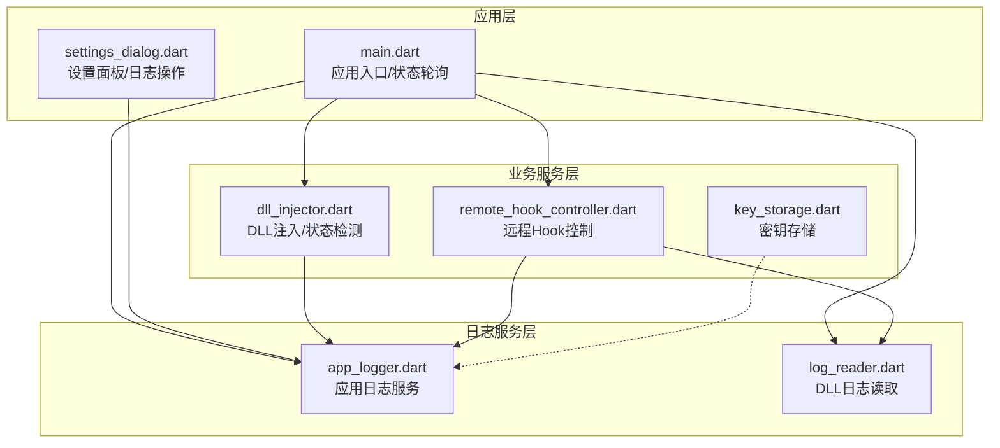
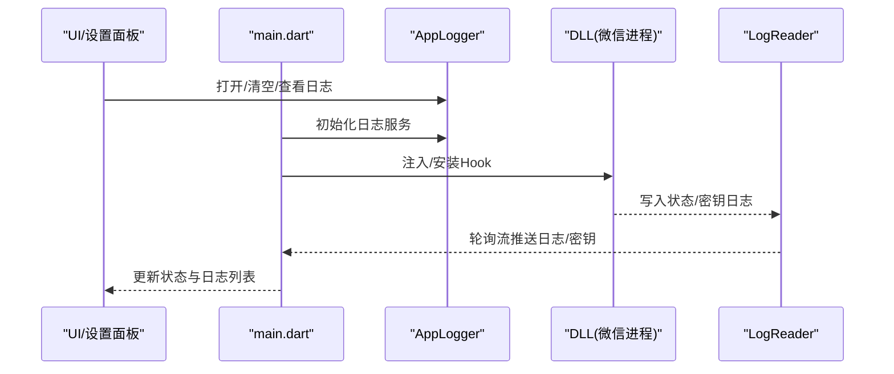
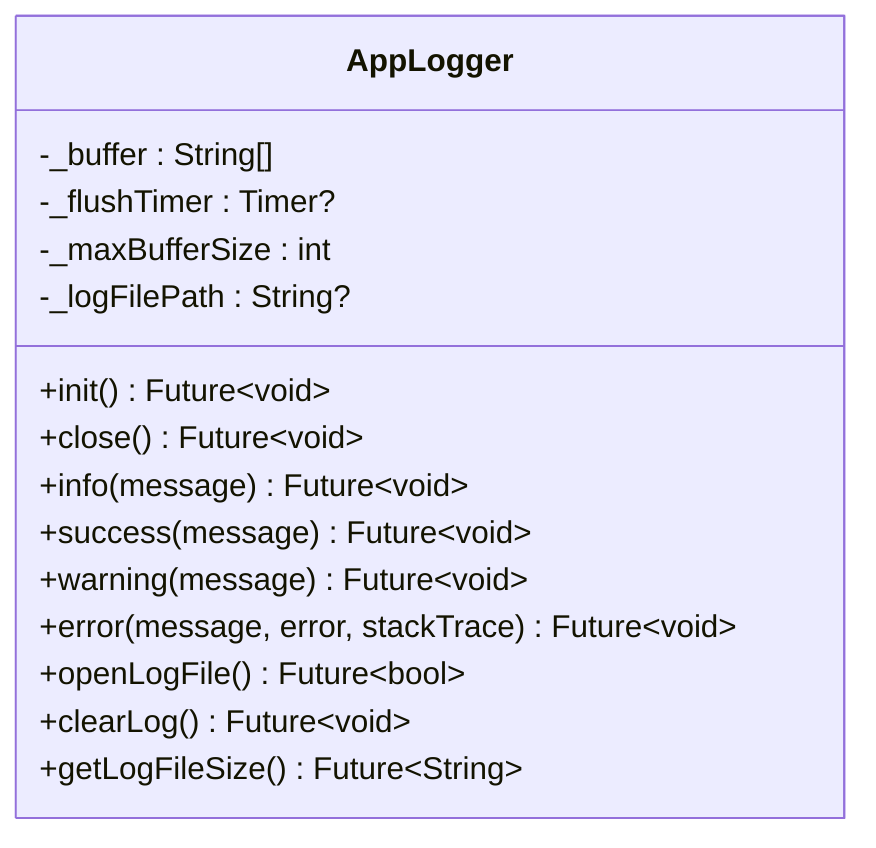
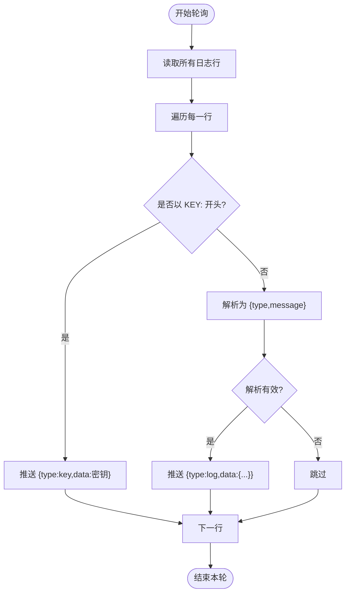
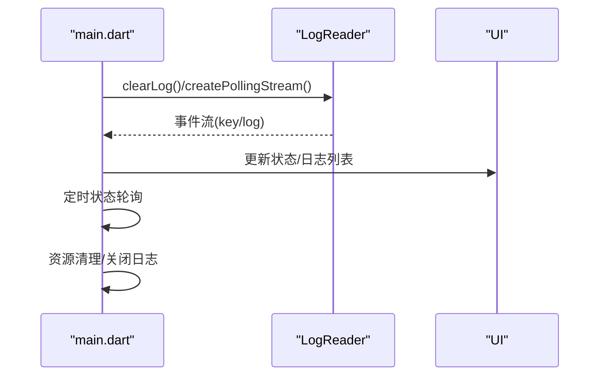

# 日志系统与诊断

<cite>
**本文档引用的文件**
- [lib/services/app_logger.dart](file://lib/services/app_logger.dart)
- [lib/services/log_reader.dart](file://lib/services/log_reader.dart)
- [lib/main.dart](file://lib/main.dart)
- [lib/widgets/settings_dialog.dart](file://lib/widgets/settings_dialog.dart)
- [lib/services/dll_injector.dart](file://lib/services/dll_injector.dart)
- [lib/services/remote_hook_controller.dart](file://lib/services/remote_hook_controller.dart)
- [lib/services/key_storage.dart](file://lib/services/key_storage.dart)
</cite>

## 目录
1. [简介](#简介)
2. [项目结构](#项目结构)
3. [核心组件](#核心组件)
4. [架构总览](#架构总览)
5. [详细组件分析](#详细组件分析)
6. [依赖关系分析](#依赖关系分析)
7. [性能考量](#性能考量)
8. [故障排查指南](#故障排查指南)
9. [结论](#结论)
10. [附录](#附录)

## 简介
本指南面向 wx_key 项目的使用者与维护者，系统性介绍应用的日志系统与诊断工具。内容涵盖：
- 日志文件位置、格式与内容含义
- app_logger.dart 与 log_reader.dart 的功能与使用方法
- 日志分析技巧与问题定位方法
- 如何启用不同级别的日志记录
- 常见日志错误信息的解读与处理建议
- 日志收集与导出方法
- 系统诊断工具的使用与性能监控方法
- 日志清理与管理的最佳实践

## 项目结构
日志系统主要分布在以下模块：
- 应用日志服务：lib/services/app_logger.dart
- DLL 状态日志读取：lib/services/log_reader.dart
- 主应用入口与状态轮询：lib/main.dart
- 设置面板与日志操作入口：lib/widgets/settings_dialog.dart
- DLL 注入与状态检测：lib/services/dll_injector.dart
- 远程 Hook 控制器与轮询：lib/services/remote_hook_controller.dart
- 密钥持久化与配置：lib/services/key_storage.dart



图表来源
- [lib/main.dart](file://lib/main.dart#L16-L35)
- [lib/services/app_logger.dart](file://lib/services/app_logger.dart#L1-L191)
- [lib/services/log_reader.dart](file://lib/services/log_reader.dart#L1-L138)
- [lib/services/dll_injector.dart](file://lib/services/dll_injector.dart#L1-L800)
- [lib/services/remote_hook_controller.dart](file://lib/services/remote_hook_controller.dart#L1-L278)
- [lib/widgets/settings_dialog.dart](file://lib/widgets/settings_dialog.dart#L1-L397)

章节来源
- [lib/main.dart](file://lib/main.dart#L16-L35)
- [lib/services/app_logger.dart](file://lib/services/app_logger.dart#L1-L191)
- [lib/services/log_reader.dart](file://lib/services/log_reader.dart#L1-L138)

## 核心组件
- 应用日志服务 AppLogger
  - 功能：统一记录应用运行日志，支持 INFO/SUCCESS/WARNING/ERROR 四级日志；具备缓冲区、定时刷新、文件大小限制与自动清空、打开日志文件、获取日志大小等能力。
  - 日志文件位置：优先写入用户应用数据目录下的 wx_key 子目录，若不可用则回退到系统临时目录。
  - 日志格式：每行包含时间戳、级别与消息，例如 "[2025-01-01 12:00:00.123] [LEVEL] 消息内容"。

- DLL 日志读取 LogReader
  - 功能：读取 DLL 写入的状态日志文件，解析状态与密钥；提供轮询流以持续监控新日志。
  - 日志文件位置：系统临时目录下的 wx_key_status.log。
  - 日志格式：普通状态行采用 "类型:消息"，密钥行采用 "KEY:密钥值"。

- 设置面板 SettingsDialog
  - 功能：提供打开日志文件、清空日志、查看日志大小等便捷操作入口。

章节来源
- [lib/services/app_logger.dart](file://lib/services/app_logger.dart#L14-L189)
- [lib/services/log_reader.dart](file://lib/services/log_reader.dart#L7-L94)
- [lib/widgets/settings_dialog.dart](file://lib/widgets/settings_dialog.dart#L89-L125)

## 架构总览
应用通过 AppLogger 记录运行状态，DLL 注入与远程 Hook 控制器在目标进程中工作，DLL 将状态与密钥写入日志文件，LogReader 轮询读取并推送至 UI 展示。



图表来源
- [lib/main.dart](file://lib/main.dart#L594-L615)
- [lib/services/log_reader.dart](file://lib/services/log_reader.dart#L96-L135)
- [lib/services/app_logger.dart](file://lib/services/app_logger.dart#L31-L59)

## 详细组件分析

### AppLogger 组件分析
- 日志级别
  - info：常规信息
  - success：成功状态
  - warning：警告
  - error：错误（可携带错误对象与堆栈）
- 缓冲与刷新
  - 内部缓冲区达到阈值时立即刷新；每 5 秒定时刷新一次。
- 文件管理
  - 启动时检查日志文件大小，超过 10MB 自动清空并记录提示。
  - 支持打开日志文件（Windows 下使用系统默认程序）、清空日志、获取日志大小。
- 文件位置
  - Windows：APPDATA 或 USERPROFILE 下的 wx_key 目录；若不可用则回退到系统临时目录。



图表来源
- [lib/services/app_logger.dart](file://lib/services/app_logger.dart#L7-L189)

章节来源
- [lib/services/app_logger.dart](file://lib/services/app_logger.dart#L31-L189)

### LogReader 组件分析
- 日志文件位置：系统临时目录下的 wx_key_status.log。
- 读取与解析
  - 读取全部行，过滤空行；解析 "类型:消息" 行；识别 "KEY:" 开头的密钥行。
- 流式轮询
  - 周期性读取日志，去重后推送事件，事件类型包括 "log"（状态消息）与 "key"（密钥）。
- 实用方法
  - extractKey：提取第一条密钥
  - getLogMessages：获取除密钥外的所有消息
  - createPollingStream：创建轮询流



图表来源
- [lib/services/log_reader.dart](file://lib/services/log_reader.dart#L96-L135)

章节来源
- [lib/services/log_reader.dart](file://lib/services/log_reader.dart#L7-L135)

### 主应用与 UI 集成
- 初始化与关闭
  - 应用启动时初始化 AppLogger；窗口关闭时清理资源并关闭日志服务。
- 日志监控
  - 启动 DLL 日志监控，创建轮询流，监听密钥与状态消息，更新 UI 状态栏与日志列表。
- 状态轮询
  - 定期检测微信进程状态，动态调整 UI 与日志展示。



图表来源
- [lib/main.dart](file://lib/main.dart#L594-L615)
- [lib/main.dart](file://lib/main.dart#L1241-L1302)
- [lib/main.dart](file://lib/main.dart#L495-L507)

章节来源
- [lib/main.dart](file://lib/main.dart#L495-L507)
- [lib/main.dart](file://lib/main.dart#L594-L615)
- [lib/main.dart](file://lib/main.dart#L1241-L1302)

### 设置面板与日志操作
- 打开日志文件：调用 AppLogger.openLogFile，Windows 下使用系统默认程序打开。
- 清空日志：调用 AppLogger.clearLog 并刷新 UI。
- 查看日志大小：调用 AppLogger.getLogFileSize 并在设置面板展示。

章节来源
- [lib/widgets/settings_dialog.dart](file://lib/widgets/settings_dialog.dart#L89-L125)
- [lib/services/app_logger.dart](file://lib/services/app_logger.dart#L147-L189)

### DLL 注入与状态检测
- 微信路径检测、进程管理、窗口等待与组件检测均通过日志记录关键步骤与结果。
- 状态检测包含“找到窗口句柄”“检测到关键文本/类名标记”“通过计数检测”等信息。

章节来源
- [lib/services/dll_injector.dart](file://lib/services/dll_injector.dart#L604-L657)
- [lib/services/dll_injector.dart](file://lib/services/dll_injector.dart#L760-L800)

### 远程 Hook 控制器
- 通过 DLL 导出函数进行初始化、轮询密钥与状态、清理 Hook。
- 轮询周期约 100ms，每次轮询最多处理 5 条状态消息。
- 状态级别映射：0=info、1=success、2=error。

章节来源
- [lib/services/remote_hook_controller.dart](file://lib/services/remote_hook_controller.dart#L131-L204)
- [lib/services/remote_hook_controller.dart](file://lib/services/remote_hook_controller.dart#L178-L192)

## 依赖关系分析
- app_logger.dart
  - 被 main.dart、settings_dialog.dart、dll_injector.dart、remote_hook_controller.dart 等多处调用，作为统一日志入口。
- log_reader.dart
  - 被 main.dart 的日志监控流程使用，负责读取 DLL 写入的日志。
- settings_dialog.dart
  - 通过 AppLogger 提供打开/清空/查看日志大小等能力。
- dll_injector.dart 与 remote_hook_controller.dart
  - 在注入、等待窗口、轮询状态等关键节点记录日志，便于问题定位。

```mermaid
graph LR
APP_LOGGER["AppLogger"] <- --> MAIN["main.dart"]
APP_LOGGER <- --> SETTINGS["settings_dialog.dart"]
APP_LOGGER <- --> DLL_INJ["dll_injector.dart"]
APP_LOGGER <- --> REMOTE_HOOK["remote_hook_controller.dart"]
LOG_READER["LogReader"] <- --> MAIN
LOG_READER <- --> REMOTE_HOOK
```

图表来源
- [lib/main.dart](file://lib/main.dart#L11-L14)
- [lib/widgets/settings_dialog.dart](file://lib/widgets/settings_dialog.dart#L5)
- [lib/services/dll_injector.dart](file://lib/services/dll_injector.dart#L9)
- [lib/services/remote_hook_controller.dart](file://lib/services/remote_hook_controller.dart#L6)

章节来源
- [lib/main.dart](file://lib/main.dart#L11-L14)
- [lib/widgets/settings_dialog.dart](file://lib/widgets/settings_dialog.dart#L5)
- [lib/services/dll_injector.dart](file://lib/services/dll_injector.dart#L9)
- [lib/services/remote_hook_controller.dart](file://lib/services/remote_hook_controller.dart#L6)

## 性能考量
- 缓冲与刷新策略
  - 内部缓冲区满即刷，避免频繁 IO；定时器每 5 秒强制刷新，兼顾实时性与性能。
- 轮询频率
  - LogReader 默认 500ms 轮询；RemoteHookController 默认 100ms 轮询，建议在 UI 不活跃时适当增大间隔以降低 CPU 占用。
- 文件大小限制
  - AppLogger 启动时自动清理超过 10MB 的日志文件，防止磁盘占用过高。
- UI 展示
  - 日志列表限制展示数量，避免大量日志导致渲染压力。

## 故障排查指南
- 常见日志错误与处理建议
  - “DLL未初始化，请先调用initialize()”
    - 现象：安装 Hook 前未正确加载控制器 DLL。
    - 处理：确保先调用 initialize(dllPath) 成功后再 installHook。
  - “DLL文件不存在: ...”
    - 现象：指定的 DLL 路径无效。
    - 处理：检查 DLL 路径是否存在，必要时重新提取或选择 DLL。
  - “微信启动失败，请检查微信安装路径”
    - 现象：无法定位微信可执行文件或启动失败。
    - 处理：在设置中手动选择微信安装目录，或检查默认路径是否存在。
  - “等待微信窗口超时”
    - 现象：长时间未检测到微信主窗口。
    - 处理：确认微信已正常启动，或延长等待时间；检查系统兼容性。
  - “Hook安装失败: ...”
    - 现象：远程 Hook 初始化失败。
    - 处理：查看最后错误信息，确认权限、兼容性与目标进程状态。
- 日志分析技巧
  - 区分应用日志与 DLL 日志：应用日志由 AppLogger 记录，DLL 日志由 LogReader 读取。
  - 关注状态级别：ERROR 通常表示严重问题，WARNING 表示可恢复风险，SUCCESS 表示关键成功点，INFO 为过程性信息。
  - 密钥提取链路：从 DLL 注入、等待窗口、安装 Hook、轮询密钥到 UI 展示，逐段核对日志。
- 问题定位方法
  - 使用设置面板打开日志文件，结合 UI 日志列表快速定位最近错误。
  - 在 DLL 注入阶段，关注“找到窗口句柄/检测到关键文本/类名标记/通过计数检测”等信息。
  - 在 Hook 轮询阶段，观察状态消息级别变化与密钥轮询输出。

章节来源
- [lib/services/remote_hook_controller.dart](file://lib/services/remote_hook_controller.dart#L98-L127)
- [lib/services/dll_injector.dart](file://lib/services/dll_injector.dart#L575-L602)
- [lib/services/dll_injector.dart](file://lib/services/dll_injector.dart#L604-L657)
- [lib/main.dart](file://lib/main.dart#L942-L952)

## 结论
wx_key 的日志系统通过 AppLogger 与 LogReader 形成“应用侧日志 + DLL 侧状态”的双通道记录机制，配合设置面板与 UI 实时展示，能够高效支撑问题定位与性能监控。遵循本文档的使用与管理建议，可显著提升调试效率与用户体验。

## 附录

### 日志文件位置与格式
- 应用日志文件
  - 位置：Windows 下优先 APPDATA/USERPROFILE 下的 wx_key 子目录；若不可用则回退到系统临时目录。
  - 格式：每行包含时间戳、级别与消息，例如 "[2025-01-01 12:00:00.123] [LEVEL] 消息内容"。
- DLL 状态日志文件
  - 位置：系统临时目录下的 wx_key_status.log。
  - 格式：普通行 "类型:消息"，密钥行 "KEY:密钥值"。

章节来源
- [lib/services/app_logger.dart](file://lib/services/app_logger.dart#L14-L28)
- [lib/services/log_reader.dart](file://lib/services/log_reader.dart#L7-L10)

### 启用不同级别的日志记录
- 在代码中调用相应方法：
  - AppLogger.info("信息")
  - AppLogger.success("成功")
  - AppLogger.warning("警告")
  - AppLogger.error("错误", error, stackTrace)

章节来源
- [lib/services/app_logger.dart](file://lib/services/app_logger.dart#L62-L86)

### 日志收集与导出
- 通过设置面板打开日志文件，使用系统默认程序查看与复制。
- 在应用关闭时，AppLogger 会记录关闭事件，便于完整性校验。
- 对于 DLL 日志，可在 UI 中查看实时流式输出，必要时截图或复制关键片段。

章节来源
- [lib/widgets/settings_dialog.dart](file://lib/widgets/settings_dialog.dart#L89-L103)
- [lib/main.dart](file://lib/main.dart#L500-L501)

### 系统诊断工具与性能监控
- 设置面板提供“打开日志文件”“清空日志”“查看日志大小”等快捷入口。
- UI 状态栏与日志列表实时反映注入与 Hook 进程状态。
- 建议在长时间运行场景下适当增大轮询间隔，减少资源消耗。

章节来源
- [lib/widgets/settings_dialog.dart](file://lib/widgets/settings_dialog.dart#L279-L296)
- [lib/services/remote_hook_controller.dart](file://lib/services/remote_hook_controller.dart#L131-L137)

### 日志清理与管理最佳实践
- 启动时自动清理超过 10MB 的日志文件，避免磁盘压力。
- 使用缓冲区与定时刷新平衡实时性与性能。
- 在设置面板中定期查看日志大小，必要时主动清空。
- 对于 DLL 日志，使用 LogReader 的清空方法在开始新流程前清理历史状态。

章节来源
- [lib/services/app_logger.dart](file://lib/services/app_logger.dart#L33-L41)
- [lib/services/log_reader.dart](file://lib/services/log_reader.dart#L12-L22)
- [lib/widgets/settings_dialog.dart](file://lib/widgets/settings_dialog.dart#L105-L125)