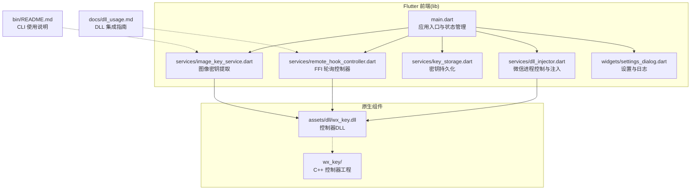
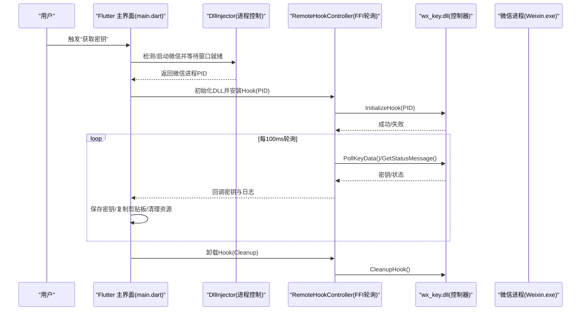
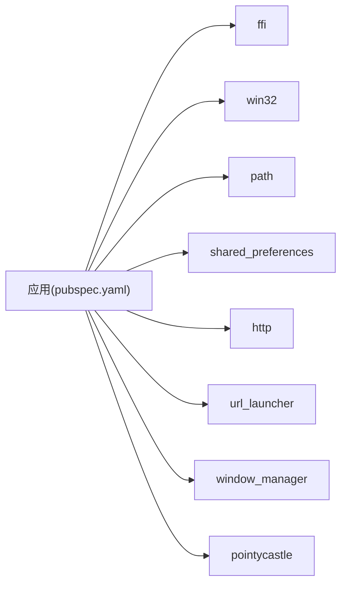

# 版本更新与维护

<cite>
**本文引用的文件**   
- [README.md](file://README.md)
- [LICENSE](file://LICENSE)
- [SECURITY_ADVISORY.md](file://SECURITY_ADVISORY.md)
- [pubspec.yaml](file://pubspec.yaml)
- [bin/README.md](file://bin/README.md)
- [docs/dll_usage.md](file://docs/dll_usage.md)
- [lib/main.dart](file://lib/main.dart)
- [lib/services/dll_injector.dart](file://lib/services/dll_injector.dart)
- [lib/services/remote_hook_controller.dart](file://lib/services/remote_hook_controller.dart)
- [lib/services/key_storage.dart](file://lib/services/key_storage.dart)
- [lib/services/image_key_service.dart](file://lib/services/image_key_service.dart)
- [lib/widgets/settings_dialog.dart](file://lib/widgets/settings_dialog.dart)
</cite>

## 目录
1. [引言](#引言)
2. [项目结构](#项目结构)
3. [核心组件](#核心组件)
4. [架构总览](#架构总览)
5. [详细组件分析](#详细组件分析)
6. [依赖关系分析](#依赖关系分析)
7. [性能考量](#性能考量)
8. [故障排查指南](#故障排查指南)
9. [结论](#结论)
10. [附录](#附录)

## 引言
本指南面向 wx_key 项目的维护者与使用者，围绕“版本更新与维护策略”展开，重点涵盖以下方面：
- 项目已停止更新的现状与历史版本支持范围
- 微信客户端版本升级带来的兼容性应对策略
- 手动与自动更新的配置方法
- 安全更新与补丁发布的注意事项
- 数据迁移与配置备份的维护流程
- 版本回滚与降级的操作指南
- 社区维护与替代方案
- 许可证变更与法律合规要点

## 项目结构
项目采用 Flutter 跨平台前端 + 原生 C++ 控制器 DLL 的混合架构，核心目录与职责如下：
- lib/：Flutter 前端与业务服务
  - services/：远程注入、密钥存储、日志读取、图像密钥提取等服务
  - widgets/：设置对话框等 UI 组件
- assets/dll/：内置 wx_key.dll（控制器 DLL）
- wx_key/：原生 C++ 控制器工程（Visual Studio）
- docs/：DLL 集成与使用说明
- bin/：命令行工具（CLI）说明文档
- 根目录：README、许可证、安全公告、pubspec 等

图表来源
- [lib/main.dart](file://lib/main.dart#L1-L120)
- [lib/services/dll_injector.dart](file://lib/services/dll_injector.dart#L1-L120)
- [lib/services/remote_hook_controller.dart](file://lib/services/remote_hook_controller.dart#L1-L120)
- [lib/services/key_storage.dart](file://lib/services/key_storage.dart#L1-L120)
- [lib/services/image_key_service.dart](file://lib/services/image_key_service.dart#L1-L120)
- [lib/widgets/settings_dialog.dart](file://lib/widgets/settings_dialog.dart#L1-L120)
- [docs/dll_usage.md](file://docs/dll_usage.md#L1-L60)
- [bin/README.md](file://bin/README.md#L1-L60)

章节来源
- [README.md](file://README.md#L77-L96)
- [pubspec.yaml](file://pubspec.yaml#L1-L40)

## 核心组件
- 远程注入与版本检测：负责微信安装路径探测、进程查找、启动/终止、窗口就绪检测与版本识别
- FFI 轮询控制器：加载并调用 wx_key.dll，通过轮询方式获取密钥与状态日志
- 密钥存储：使用本地偏好存储持久化数据库密钥、图像密钥、微信目录、DLL 路径等
- 图像密钥提取：扫描微信缓存目录模板文件，结合内存扫描与 AES 校验获取图像密钥
- 设置与日志：提供微信目录设置、日志查看与清空、窗口管理等运维能力

章节来源
- [lib/services/dll_injector.dart](file://lib/services/dll_injector.dart#L406-L480)
- [lib/services/remote_hook_controller.dart](file://lib/services/remote_hook_controller.dart#L32-L120)
- [lib/services/key_storage.dart](file://lib/services/key_storage.dart#L1-L120)
- [lib/services/image_key_service.dart](file://lib/services/image_key_service.dart#L54-L120)
- [lib/widgets/settings_dialog.dart](file://lib/widgets/settings_dialog.dart#L30-L120)

## 架构总览
下图展示从 UI 到原生 DLL 的调用链路与数据流。

图表来源
- [lib/main.dart](file://lib/main.dart#L709-L800)
- [lib/services/dll_injector.dart](file://lib/services/dll_injector.dart#L531-L602)
- [lib/services/remote_hook_controller.dart](file://lib/services/remote_hook_controller.dart#L89-L144)

## 详细组件分析

### 远程注入与微信版本检测
- 功能要点
  - 从注册表、App Paths、腾讯特定键等多源探测微信安装路径
  - 自动/手动选择微信目录，校验 Weixin.exe/WeChat.exe 存在性
  - 启动/终止微信进程，等待主窗口组件就绪
  - 识别微信 4.x 版本目录，作为兼容性判断依据

- 兼容性策略
  - 当微信版本目录变化时，优先使用用户设置的微信目录
  - 若未找到，回退到注册表与常见路径探测
  - 版本检测失败时引导进入设置页手动配置

章节来源
- [lib/services/dll_injector.dart](file://lib/services/dll_injector.dart#L97-L119)
- [lib/services/dll_injector.dart](file://lib/services/dll_injector.dart#L406-L480)
- [lib/services/dll_injector.dart](file://lib/services/dll_injector.dart#L531-L602)
- [lib/services/dll_injector.dart](file://lib/services/dll_injector.dart#L604-L657)

### FFI 轮询控制器（RemoteHookController）
- 功能要点
  - 加载 wx_key.dll 并解析导出函数
  - 以固定周期轮询密钥与状态消息
  - 统一错误获取与资源清理（卸载 Hook）

- 性能与稳定性
  - 轮询间隔 100ms，兼顾响应与 CPU 占用
  - 最多批量消费 5 条状态消息，避免阻塞
  - 异常捕获与日志记录，便于排障

章节来源
- [lib/services/remote_hook_controller.dart](file://lib/services/remote_hook_controller.dart#L32-L144)
- [lib/services/remote_hook_controller.dart](file://lib/services/remote_hook_controller.dart#L146-L204)
- [lib/services/remote_hook_controller.dart](file://lib/services/remote_hook_controller.dart#L206-L235)

### 密钥存储（KeyStorage）
- 功能要点
  - 持久化数据库密钥、图像密钥、时间戳、微信目录、DLL 路径
  - 提供读取、检查、清除与格式化时间显示
  - 与 UI 状态联动，首次启动加载已保存数据

- 迁移与备份
  - 建议定期导出应用数据目录中的偏好存储文件
  - 在升级/迁移时保留并恢复相关键值

章节来源
- [lib/services/key_storage.dart](file://lib/services/key_storage.dart#L1-L120)
- [lib/services/key_storage.dart](file://lib/services/key_storage.dart#L117-L135)
- [lib/main.dart](file://lib/main.dart#L536-L562)

### 图像密钥提取（ImageKeyService）
- 功能要点
  - 自动/手动选择微信缓存目录，枚举账号目录
  - 扫描模板文件获取 XOR 密钥，读取加密数据片段
  - 内存扫描微信进程，按 ASCII/UTF-16 规则匹配 32 字节密钥
  - 使用 AES 校验密钥有效性，超时与权限问题给出明确指引

- 兼容性与升级
  - 特征码/扫描规则随微信版本演进而调整
  - 建议在微信升级后优先更新 DLL 源码与特征库

章节来源
- [lib/services/image_key_service.dart](file://lib/services/image_key_service.dart#L54-L120)
- [lib/services/image_key_service.dart](file://lib/services/image_key_service.dart#L198-L246)
- [lib/services/image_key_service.dart](file://lib/services/image_key_service.dart#L308-L467)
- [lib/services/image_key_service.dart](file://lib/services/image_key_service.dart#L600-L696)

### 设置与日志（SettingsDialog 与日志服务）
- 功能要点
  - 手动设置微信目录，校验有效性
  - 打开/清空应用日志文件，辅助排障
  - 与窗口管理配合，优雅关闭与资源清理

章节来源
- [lib/widgets/settings_dialog.dart](file://lib/widgets/settings_dialog.dart#L30-L120)
- [lib/main.dart](file://lib/main.dart#L494-L534)

## 依赖关系分析
- 版本与构建
  - 应用版本与构建号在 pubspec 中定义，遵循 Flutter 构建规范
  - 依赖包括 FFI、win32、path、shared_preferences、http、url_launcher、window_manager、pointycastle 等
- 资产与 DLL
  - Flutter 资产清单包含内置 DLL，确保打包与分发一致性

图表来源
- [pubspec.yaml](file://pubspec.yaml#L24-L71)

章节来源
- [pubspec.yaml](file://pubspec.yaml#L19-L71)

## 性能考量
- 轮询频率与资源占用
  - 轮询间隔 100ms，建议在 UI 线程外执行，避免阻塞
- 内存扫描优化
  - 分块扫描与重叠拼接，避免跨块遗漏
  - 跳过大内存区域与不可读保护，减少无效 IO
- I/O 与磁盘访问
  - 模板文件扫描限制数量与排序，提升效率
- 网络与下载
  - CLI 模式支持自定义 DLL 路径，降低网络依赖

章节来源
- [lib/services/remote_hook_controller.dart](file://lib/services/remote_hook_controller.dart#L130-L144)
- [lib/services/image_key_service.dart](file://lib/services/image_key_service.dart#L333-L384)
- [lib/services/image_key_service.dart](file://lib/services/image_key_service.dart#L452-L456)
- [bin/README.md](file://bin/README.md#L11-L26)

## 故障排查指南
- DLL 加载失败
  - 确认 DLL 路径存在且可访问
  - 以管理员权限运行，避免 UAC 阻止
- 微信进程未找到
  - 确认微信已启动，或手动指定 PID
  - 使用系统工具列出 Weixin.dll/Weixin.exe
- 提取失败
  - 检查微信版本是否受支持
  - 确保具备管理员权限，必要时手动以管理员运行
  - 参考图像密钥提取的“建议流程”提高成功率
- 超时与权限
  - 调整超时时间，避开安全软件拦截
  - 清理日志文件，重新开始注入流程

章节来源
- [bin/README.md](file://bin/README.md#L92-L125)
- [lib/services/image_key_service.dart](file://lib/services/image_key_service.dart#L670-L686)

## 结论
- 项目已停止更新，不再回复 issue，历史版本支持微信 4.x
- 维护策略应聚焦于：手动配置、本地持久化、最小化网络依赖、严格的日志与排障流程
- 安全与合规：严格遵守 MIT 许可证条款，合法使用，避免商业欺诈与盗版风险
- 替代方案：关注社区反馈与第三方工具，但务必从官方渠道获取

## 附录

### 版本更新与维护策略（针对已停止更新的项目）
- 现状与支持范围
  - 项目已永久停止更新，不再回复 issue
  - 历史支持：微信 4.x（含 4.1.5.11、4.1.4.17、4.1.4.15、4.1.2.18、4.1.2.17、4.1.0.30、4.0.5.17 等）
- 兼容性应对
  - 微信版本升级后，DLL 特征码/扫描规则可能失效
  - 建议：在微信升级后，优先更新 DLL 源码与特征库，重新编译并替换内置 DLL
- 更新与分发
  - 由于项目停止更新，不提供自动更新机制
  - 手动更新：下载最新发布包，替换内置 DLL 或替换应用二进制
- 安全更新与补丁
  - 项目未提供安全补丁发布渠道
  - 如遇安全风险，建议立即停止使用并从官方渠道获取替代方案
- 数据迁移与配置备份
  - 使用 KeyStorage 持久化的密钥与配置，建议定期导出应用数据目录
  - 迁移时保留微信目录、DLL 路径、密钥与时间戳等键值
- 版本回滚与降级
  - 降级微信版本可能影响 DLL 兼容性
  - 回滚建议：保留旧版应用与 DLL，确保微信版本与 DLL 特征匹配
- 社区维护与替代方案
  - 项目已停止维护，不提供社区支持
  - 建议：从官方渠道获取替代工具，避免使用盗版或非官方版本
- 许可证变更与法律合规
  - 采用 MIT 许可证，可自由使用、修改与分发，但需保留版权与许可声明
  - 严禁将本工具用于任何商业或恶意用途
  - 遵守当地法律法规，负责任地使用工具

章节来源
- [README.md](file://README.md#L24-L27)
- [README.md](file://README.md#L45-L56)
- [docs/dll_usage.md](file://docs/dll_usage.md#L135-L165)
- [LICENSE](file://LICENSE#L1-L22)
- [SECURITY_ADVISORY.md](file://SECURITY_ADVISORY.md#L23-L33)