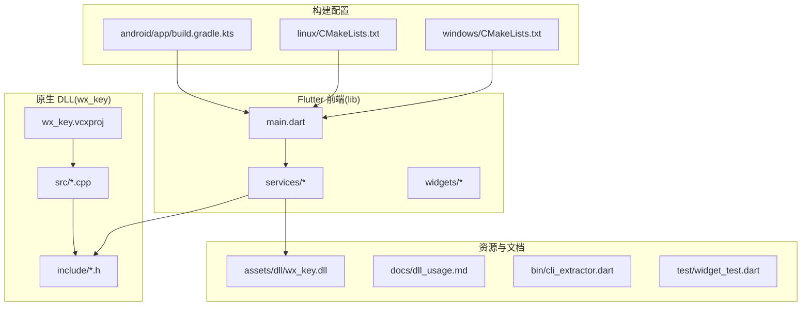
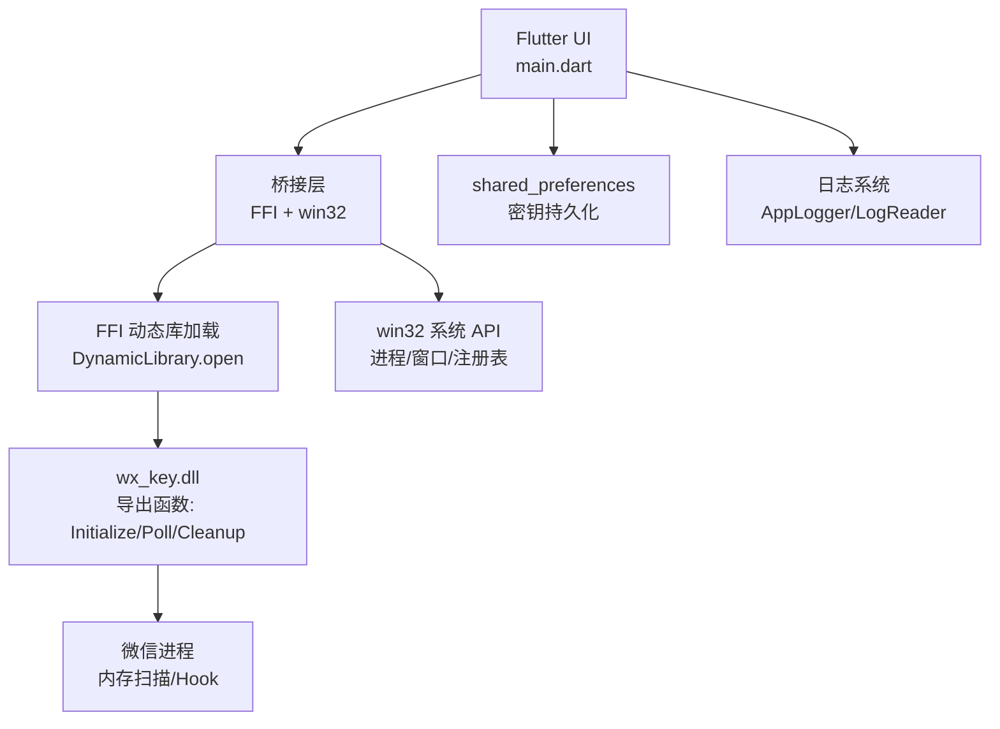
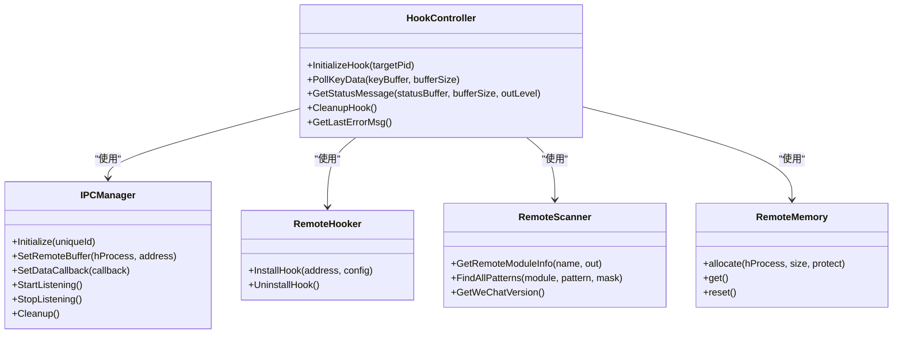
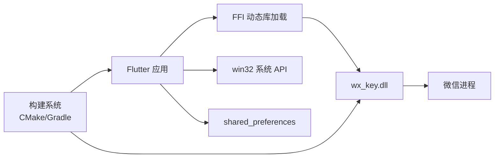

# 技术栈说明

<cite>
**本文档引用的文件**
- [pubspec.yaml](file://pubspec.yaml)
- [README.md](file://README.md)
- [analysis_options.yaml](file://analysis_options.yaml)
- [lib/main.dart](file://lib/main.dart)
- [lib/services/remote_hook_controller.dart](file://lib/services/remote_hook_controller.dart)
- [lib/services/dll_injector.dart](file://lib/services/dll_injector.dart)
- [lib/services/key_storage.dart](file://lib/services/key_storage.dart)
- [lib/services/image_key_service.dart](file://lib/services/image_key_service.dart)
- [windows/CMakeLists.txt](file://windows/CMakeLists.txt)
- [wx_key/wx_key.vcxproj](file://wx_key/wx_key.vcxproj)
- [wx_key/include/hook_controller.h](file://wx_key/include/hook_controller.h)
- [wx_key/src/hook_controller.cpp](file://wx_key/src/hook_controller.cpp)
- [docs/dll_usage.md](file://docs/dll_usage.md)
- [bin/cli_extractor.dart](file://bin/cli_extractor.dart)
- [test/widget_test.dart](file://test/widget_test.dart)
- [linux/CMakeLists.txt](file://linux/CMakeLists.txt)
- [android/app/build.gradle.kts](file://android/app/build.gradle.kts)
</cite>

## 目录
1. [简介](#简介)
2. [项目结构](#项目结构)
3. [核心组件](#核心组件)
4. [架构总览](#架构总览)
5. [详细组件分析](#详细组件分析)
6. [依赖关系分析](#依赖关系分析)
7. [性能考量](#性能考量)
8. [故障排除指南](#故障排除指南)
9. [结论](#结论)
10. [附录](#附录)

## 简介
本项目是一个基于 Flutter 的桌面应用，结合 C++ 原生 DLL 实现微信数据库密钥与图片密钥的提取。Flutter 负责 UI 与业务流程编排，C++ DLL 负责与微信进程交互、内存扫描与 Hook，二者通过 Flutter 的 FFI 与 win32 包进行桥接。项目支持 Windows 平台，具备完善的日志系统、状态轮询、密钥持久化与错误诊断能力。

## 项目结构
项目采用 Flutter 多平台工程组织方式，根目录包含 Flutter 前端、C++ 原生 DLL 工程、构建脚本与文档。关键目录与文件如下：
- lib：Flutter 前端代码，包含主入口、服务层与自定义组件
- assets：包含内置 DLL 与字体资源
- wx_key：C++ 原生 DLL 工程，包含头文件与源码
- windows/linux/android：各平台构建脚本与配置
- docs：DLL 使用说明文档
- bin：命令行提取工具
- test：Flutter 测试样例

**图表来源**
- [lib/main.dart](file://lib/main.dart#L1-L80)
- [lib/services/remote_hook_controller.dart](file://lib/services/remote_hook_controller.dart#L1-L60)
- [wx_key/wx_key.vcxproj](file://wx_key/wx_key.vcxproj#L1-L60)
- [wx_key/include/hook_controller.h](file://wx_key/include/hook_controller.h#L1-L30)
- [wx_key/src/hook_controller.cpp](file://wx_key/src/hook_controller.cpp#L1-L60)
- [windows/CMakeLists.txt](file://windows/CMakeLists.txt#L1-L40)
- [linux/CMakeLists.txt](file://linux/CMakeLists.txt#L1-L40)
- [android/app/build.gradle.kts](file://android/app/build.gradle.kts#L1-L40)
- [assets/dll/wx_key.dll](file://assets/dll/wx_key.dll)

**章节来源**
- [README.md](file://README.md#L77-L96)
- [pubspec.yaml](file://pubspec.yaml#L77-L112)

## 核心组件
- Flutter 应用入口与窗口管理：负责初始化日志、窗口选项、路由与状态管理
- FFI 与 DLL 交互：通过 DynamicLibrary 加载 DLL，绑定导出函数，实现轮询与状态获取
- Windows 系统 API：使用 win32 包进行进程枚举、窗口枚举、注册表查询与内存读取
- 数据持久化：使用 shared_preferences 存储密钥、时间戳与用户设置
- 图片密钥提取：基于模板文件统计 XOR 密钥，结合微信进程内存扫描获取 AES 密钥
- 命令行工具：提供 CLI 版本的密钥提取，便于自动化与调试

**章节来源**
- [lib/main.dart](file://lib/main.dart#L16-L35)
- [lib/services/remote_hook_controller.dart](file://lib/services/remote_hook_controller.dart#L1-L60)
- [lib/services/dll_injector.dart](file://lib/services/dll_injector.dart#L1-L60)
- [lib/services/key_storage.dart](file://lib/services/key_storage.dart#L1-L40)
- [lib/services/image_key_service.dart](file://lib/services/image_key_service.dart#L1-L60)
- [bin/cli_extractor.dart](file://bin/cli_extractor.dart#L1-L60)

## 架构总览
整体架构分为三层：UI 层（Flutter）、桥接层（FFI/win32）、原生层（C++ DLL）。UI 层负责用户交互与状态展示，桥接层负责与系统 API 和 DLL 通信，原生层负责微信进程交互与密钥提取。

**图表来源**
- [lib/main.dart](file://lib/main.dart#L1-L80)
- [lib/services/remote_hook_controller.dart](file://lib/services/remote_hook_controller.dart#L1-L60)
- [lib/services/dll_injector.dart](file://lib/services/dll_injector.dart#L1-L60)
- [lib/services/key_storage.dart](file://lib/services/key_storage.dart#L1-L40)
- [wx_key/include/hook_controller.h](file://wx_key/include/hook_controller.h#L12-L46)
- [wx_key/src/hook_controller.cpp](file://wx_key/src/hook_controller.cpp#L414-L491)

## 详细组件分析

### Flutter SDK 使用与版本要求
- 版本要求：SDK 版本约束为 ^3.9.2，确保与 Dart 语言版本兼容
- 依赖管理：通过 pubspec.yaml 声明依赖，包含 Material 设计、窗口管理、HTTP、URL Launcher、窗口管理等
- 资源与字体：在 pubspec.yaml 中声明 DLL 与字体资源，确保打包时包含
- 构建配置：Windows/Linux/Android 平台分别使用 CMake/Gradle 管理构建，Flutter 工具负责组装

**章节来源**
- [pubspec.yaml](file://pubspec.yaml#L21-L23)
- [pubspec.yaml](file://pubspec.yaml#L30-L61)
- [pubspec.yaml](file://pubspec.yaml#L84-L112)
- [windows/CMakeLists.txt](file://windows/CMakeLists.txt#L1-L40)
- [linux/CMakeLists.txt](file://linux/CMakeLists.txt#L1-L40)
- [android/app/build.gradle.kts](file://android/app/build.gradle.kts#L1-L40)

### C++ 原生 DLL 技术选型与配置
- 工程配置：Visual Studio 工程文件定义 x64 动态库，启用 Unicode，包含 MinHook 与 xbyak 头文件目录
- 编译选项：C++17 标准、警告级别、异常处理、预编译头（x64 使用不使用预编译头两种模式）
- 链接设置：链接 MinHook x64 库，禁用 UAC 提示
- 导出函数：提供 InitializeHook、PollKeyData、GetStatusMessage、CleanupHook、GetLastErrorMsg 等 C 风格接口
- 核心流程：初始化系统调用、打开目标进程、扫描模块与特征码、分配远程共享内存、安装 Hook、轮询密钥与状态

**图表来源**
- [wx_key/include/hook_controller.h](file://wx_key/include/hook_controller.h#L12-L46)
- [wx_key/src/hook_controller.cpp](file://wx_key/src/hook_controller.cpp#L32-L66)
- [wx_key/wx_key.vcxproj](file://wx_key/wx_key.vcxproj#L108-L146)

**章节来源**
- [wx_key/wx_key.vcxproj](file://wx_key/wx_key.vcxproj#L28-L146)
- [wx_key/include/hook_controller.h](file://wx_key/include/hook_controller.h#L1-L50)
- [wx_key/src/hook_controller.cpp](file://wx_key/src/hook_controller.cpp#L213-L412)

### 关键依赖包作用
- ffi：提供 Dart 与原生库的直接交互能力，用于加载 DLL 与绑定导出函数
- win32：提供 Windows 系统 API 的封装，用于进程枚举、窗口枚举、注册表查询、内存读取等
- shared_preferences：提供轻量级本地存储，用于保存密钥、时间戳与用户设置
- path/path_provider：路径处理与文件系统访问
- http/url_launcher：网络请求与 URL 打开
- window_manager：窗口管理与生命周期控制
- pointycastle：AES 加密/解密算法库，用于验证密钥有效性

**章节来源**
- [pubspec.yaml](file://pubspec.yaml#L38-L61)
- [lib/services/remote_hook_controller.dart](file://lib/services/remote_hook_controller.dart#L1-L10)
- [lib/services/dll_injector.dart](file://lib/services/dll_injector.dart#L1-L10)
- [lib/services/key_storage.dart](file://lib/services/key_storage.dart#L1-L10)
- [lib/services/image_key_service.dart](file://lib/services/image_key_service.dart#L1-L12)

### 开发工具链
- Flutter 开发环境：使用 Flutter SDK 与 Dart 工具链，通过 flutter pub get 安装依赖
- Visual Studio：用于 C++ 原生 DLL 的开发与调试，工程文件定义编译与链接选项
- CMake：Windows/Linux 平台的构建系统，负责 Flutter 侧的原生插件与资源安装
- Gradle/Kotlin：Android 平台的构建配置，集成 Flutter Gradle 插件
- 命令行工具：Dart CLI 提供独立的密钥提取流程，便于自动化与测试

**章节来源**
- [windows/CMakeLists.txt](file://windows/CMakeLists.txt#L1-L40)
- [linux/CMakeLists.txt](file://linux/CMakeLists.txt#L1-L40)
- [android/app/build.gradle.kts](file://android/app/build.gradle.kts#L1-L40)
- [bin/cli_extractor.dart](file://bin/cli_extractor.dart#L1-L60)

### 代码质量保证
- 静态分析：使用 Flutter Lints 规范，通过 analysis_options.yaml 启用推荐规则
- 代码规范：统一使用 Flutter 官方推荐的 linter 规则，避免冗余打印与风格问题
- 测试策略：提供基础的 Flutter widget 测试样例，可扩展单元测试与集成测试
- 日志与错误处理：集中化的日志系统与错误信息获取接口，便于问题定位与用户反馈

**章节来源**
- [analysis_options.yaml](file://analysis_options.yaml#L8-L29)
- [test/widget_test.dart](file://test/widget_test.dart#L1-L31)

### 技术选型理由与替代方案对比
- Flutter 选型理由：跨平台 UI 开发、热重载、生态丰富；替代方案如 Electron 或原生 WinForms/C# 在跨平台方面不具备优势
- FFI 选型理由：直接调用原生 DLL，性能高且可控；替代方案如 C# P/Invoke 需要额外桥接层
- win32 选型理由：Windows 平台系统 API 最佳实践；替代方案如 .NET P/Invoke 或 WMI 在复杂场景下不够灵活
- shared_preferences 选型理由：轻量级本地存储，适合小规模配置与密钥；替代方案如 SQLite 或 JSON 文件需增加复杂度
- MinHook 选型理由：稳定可靠的 x64 Hook 方案；替代方案如手动内联 Hook 更复杂且易出错

**章节来源**
- [pubspec.yaml](file://pubspec.yaml#L38-L61)
- [wx_key/wx_key.vcxproj](file://wx_key/wx_key.vcxproj#L108-L146)

## 依赖关系分析
Flutter 与原生 DLL 通过 FFI 直接交互，win32 包提供系统 API 能力，shared_preferences 提供本地存储。构建系统在不同平台采用 CMake/Gradle 管理，确保资源与插件正确打包。

**图表来源**
- [lib/services/remote_hook_controller.dart](file://lib/services/remote_hook_controller.dart#L1-L60)
- [lib/services/dll_injector.dart](file://lib/services/dll_injector.dart#L1-L60)
- [lib/services/key_storage.dart](file://lib/services/key_storage.dart#L1-L40)
- [windows/CMakeLists.txt](file://windows/CMakeLists.txt#L48-L58)
- [linux/CMakeLists.txt](file://linux/CMakeLists.txt#L49-L75)
- [android/app/build.gradle.kts](file://android/app/build.gradle.kts#L1-L40)

**章节来源**
- [lib/services/remote_hook_controller.dart](file://lib/services/remote_hook_controller.dart#L1-L60)
- [lib/services/dll_injector.dart](file://lib/services/dll_injector.dart#L1-L60)
- [lib/services/key_storage.dart](file://lib/services/key_storage.dart#L1-L40)
- [windows/CMakeLists.txt](file://windows/CMakeLists.txt#L48-L109)
- [linux/CMakeLists.txt](file://linux/CMakeLists.txt#L49-L129)
- [android/app/build.gradle.kts](file://android/app/build.gradle.kts#L1-L40)

## 性能考量
- 轮询频率：DLL 侧通过轮询机制获取密钥与状态，Flutter 侧默认 100ms 轮询，兼顾实时性与 CPU 占用
- 内存扫描：图片密钥提取涉及微信进程内存扫描，采用分块读取与重叠拼接，避免跨块遗漏
- 资源释放：Hook 卸载与句柄关闭在应用退出时执行，防止残留 Shellcode 导致崩溃
- 构建优化：Release 配置启用全程序优化与链接时优化，减少体积与提升运行效率

**章节来源**
- [lib/services/remote_hook_controller.dart](file://lib/services/remote_hook_controller.dart#L130-L144)
- [lib/services/image_key_service.dart](file://lib/services/image_key_service.dart#L333-L353)
- [wx_key/src/hook_controller.cpp](file://wx_key/src/hook_controller.cpp#L418-L426)
- [wx_key/wx_key.vcxproj](file://wx_key/wx_key.vcxproj#L127-L146)

## 故障排除指南
- DLL 加载失败：检查 DLL 路径与架构一致性（x64），确保以管理员权限运行
- 微信进程未找到：确认微信已启动并加载 Weixin.dll，必要时手动选择安装目录
- 权限不足：以管理员身份运行，确保具备进程打开与内存读取权限
- 版本不兼容：微信版本更新可能导致特征码失效，需更新 DLL 源码并重新编译
- 超时与重复：合理设置超时时间与去重逻辑，避免 UI 线程阻塞

**章节来源**
- [lib/services/dll_injector.dart](file://lib/services/dll_injector.dart#L508-L529)
- [lib/services/image_key_service.dart](file://lib/services/image_key_service.dart#L665-L686)
- [docs/dll_usage.md](file://docs/dll_usage.md#L135-L165)

## 结论
本项目通过 Flutter 与 C++ 原生 DLL 的协同，实现了微信密钥提取的完整流程。Flutter 负责 UI 与业务编排，FFI 与 win32 提供系统级能力，shared_preferences 保障数据持久化。构建系统与工具链完善，配合日志与错误处理机制，确保了开发与部署的稳定性。技术选型在跨平台、性能与可维护性之间取得平衡，适合类似场景的桌面应用开发。

## 附录
- DLL 使用文档：提供标准调用流程、API 接口说明与常见问题排查
- 命令行工具：提供 CLI 版本的密钥提取，便于自动化与测试
- 测试样例：基础的 Flutter widget 测试，可扩展为更全面的测试体系

**章节来源**
- [docs/dll_usage.md](file://docs/dll_usage.md#L1-L165)
- [bin/cli_extractor.dart](file://bin/cli_extractor.dart#L1-L60)
- [test/widget_test.dart](file://test/widget_test.dart#L1-L31)