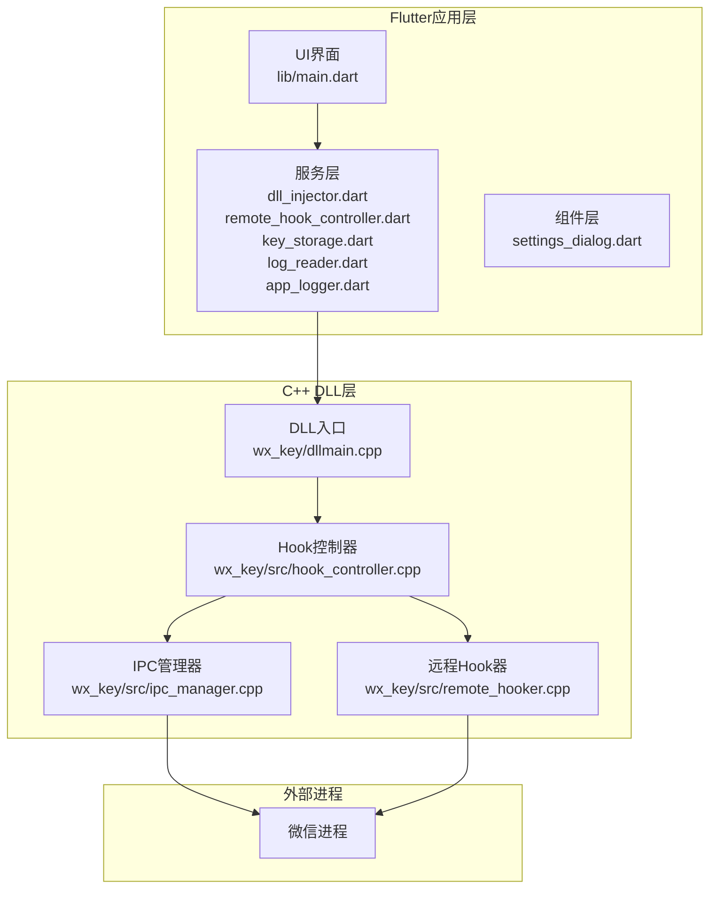
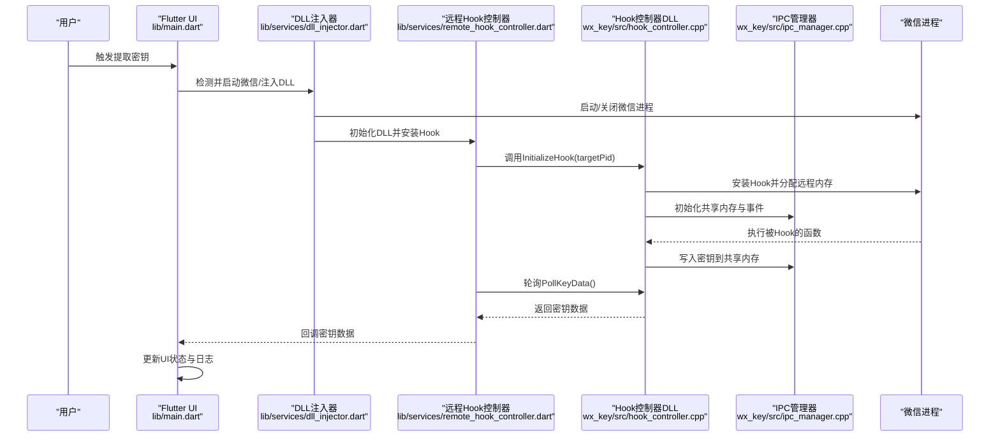
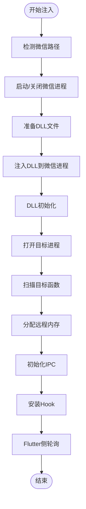
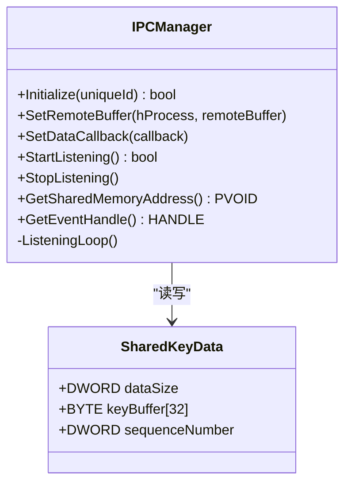
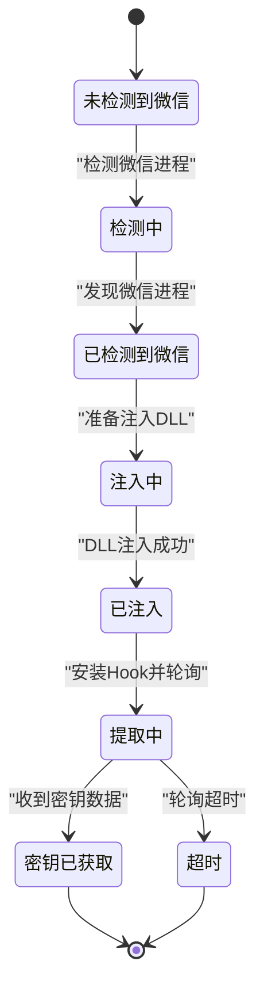
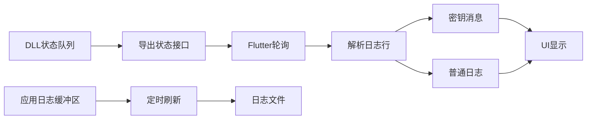
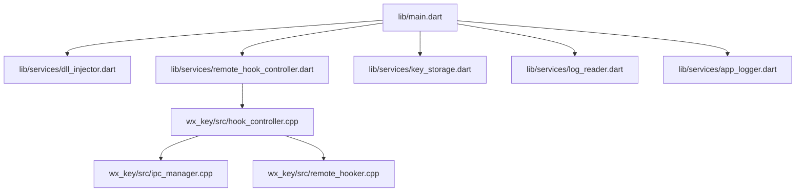

# 数据流架构

<cite>
**本文档引用的文件**
- [main.dart](file://lib/main.dart)
- [dllmain.cpp](file://wx_key/dllmain.cpp)
- [ipc_manager.cpp](file://wx_key/src/ipc_manager.cpp)
- [ipc_manager.h](file://wx_key/include/ipc_manager.h)
- [cli_extractor.dart](file://bin/cli_extractor.dart)
- [dll_injector.dart](file://lib/services/dll_injector.dart)
- [remote_hook_controller.dart](file://lib/services/remote_hook_controller.dart)
- [key_storage.dart](file://lib/services/key_storage.dart)
- [log_reader.dart](file://lib/services/log_reader.dart)
- [app_logger.dart](file://lib/services/app_logger.dart)
- [hook_controller.cpp](file://wx_key/src/hook_controller.cpp)
- [hook_controller.h](file://wx_key/include/hook_controller.h)
- [remote_hooker.cpp](file://wx_key/src/remote_hooker.cpp)
- [remote_hooker.h](file://wx_key/include/remote_hooker.h)
- [settings_dialog.dart](file://lib/widgets/settings_dialog.dart)
</cite>

## 目录
1. [简介](#简介)
2. [项目结构](#项目结构)
3. [核心组件](#核心组件)
4. [架构总览](#架构总览)
5. [详细组件分析](#详细组件分析)
6. [依赖关系分析](#依赖关系分析)
7. [性能考量](#性能考量)
8. [故障排除指南](#故障排除指南)
9. [结论](#结论)

## 简介
本项目实现了从微信进程到UI界面的完整数据流架构，涵盖DLL注入后的密钥提取流程、日志收集与状态更新机制、进程间通信（IPC）实现（共享内存与轮询）、状态管理与UI更新、错误处理与用户反馈等。系统采用Flutter作为UI框架，通过命令行工具与GUI两种方式运行，核心逻辑在C++ DLL中实现，利用共享内存进行跨进程数据交换。

## 项目结构
项目采用分层组织方式：
- Flutter应用层：lib/ 下的UI与服务层
- C++ DLL层：wx_key/ 下的Hook与IPC实现
- 命令行工具：bin/ 下的CLI提取器
- 平台集成：各平台的构建与打包配置

**图表来源**
- [main.dart](file://lib/main.dart#L1-L100)
- [dllmain.cpp](file://wx_key/dllmain.cpp#L1-L24)
- [hook_controller.cpp](file://wx_key/src/hook_controller.cpp#L1-L120)
- [ipc_manager.cpp](file://wx_key/src/ipc_manager.cpp#L1-L120)
- [remote_hooker.cpp](file://wx_key/src/remote_hooker.cpp#L1-L120)

**章节来源**
- [main.dart](file://lib/main.dart#L1-L120)
- [dllmain.cpp](file://wx_key/dllmain.cpp#L1-L24)

## 核心组件
- DLL注入与Hook控制：通过Flutter侧的DLL注入器与远程Hook控制器，将C++ DLL注入到微信进程并安装Hook。
- IPC通信：基于共享内存与事件的轮询机制，实现密钥数据的跨进程传输。
- 状态管理：集中维护密钥、日志、UI状态等数据，驱动UI更新。
- 日志系统：应用日志与DLL日志分离，分别持久化与轮询读取。
- 错误处理：统一的错误捕获、传播与用户反馈机制。

**章节来源**
- [remote_hook_controller.dart](file://lib/services/remote_hook_controller.dart#L1-L120)
- [ipc_manager.h](file://wx_key/include/ipc_manager.h#L1-L80)
- [hook_controller.h](file://wx_key/include/hook_controller.h#L1-L50)

## 架构总览
系统采用“Flutter应用 + C++ DLL”的混合架构。Flutter负责UI与业务流程编排，C++ DLL负责注入与Hook，通过共享内存进行数据交换。UI通过服务层与DLL交互，实现密钥提取、状态更新与日志展示。

**图表来源**
- [main.dart](file://lib/main.dart#L709-L800)
- [dll_injector.dart](file://lib/services/dll_injector.dart#L531-L602)
- [remote_hook_controller.dart](file://lib/services/remote_hook_controller.dart#L89-L128)
- [hook_controller.cpp](file://wx_key/src/hook_controller.cpp#L414-L426)
- [ipc_manager.cpp](file://wx_key/src/ipc_manager.cpp#L212-L271)

## 详细组件分析

### DLL注入与Hook安装流程
- 注入阶段：Flutter侧通过注入器检测微信安装路径、启动/关闭微信进程、准备DLL并注入。
- Hook阶段：DLL内部初始化系统调用、打开目标进程、扫描目标函数、分配远程内存、初始化IPC并安装Hook。
- 轮询阶段：Flutter侧定时轮询DLL提供的接口获取密钥与状态。

**图表来源**
- [dll_injector.dart](file://lib/services/dll_injector.dart#L531-L602)
- [hook_controller.cpp](file://wx_key/src/hook_controller.cpp#L214-L379)

**章节来源**
- [dll_injector.dart](file://lib/services/dll_injector.dart#L508-L602)
- [hook_controller.cpp](file://wx_key/src/hook_controller.cpp#L214-L379)

### IPC共享内存与轮询机制
- 数据结构：共享内存中存储固定大小的密钥数据结构，包含数据长度、密钥缓冲区与序列号。
- 初始化：生成唯一ID，创建共享内存与事件对象，支持全局/本地命名空间回退。
- 轮询监听：监听线程周期性等待事件并读取远程进程缓冲区，避免重复读取并清空缓冲区。
- 资源管理：提供清理函数，确保线程安全与资源释放。

**图表来源**
- [ipc_manager.h](file://wx_key/include/ipc_manager.h#L9-L16)
- [ipc_manager.h](file://wx_key/include/ipc_manager.h#L18-L76)

**章节来源**
- [ipc_manager.cpp](file://wx_key/src/ipc_manager.cpp#L24-L132)
- [ipc_manager.cpp](file://wx_key/src/ipc_manager.cpp#L212-L271)

### 状态管理与UI更新
- 状态变量：包含微信运行状态、DLL注入状态、密钥获取状态、日志消息等。
- 轮询机制：定时器轮询远程Hook控制器的状态与密钥数据，触发UI状态更新。
- 日志聚合：将DLL日志与应用日志合并，限制显示数量并区分状态级别。
- 持久化：密钥与图片密钥信息通过SharedPreferences持久化存储。

**图表来源**
- [main.dart](file://lib/main.dart#L429-L534)
- [main.dart](file://lib/main.dart#L690-L707)

**章节来源**
- [main.dart](file://lib/main.dart#L429-L534)
- [key_storage.dart](file://lib/services/key_storage.dart#L14-L30)

### 日志系统数据流
- DLL日志：DLL内部维护状态队列，通过导出函数提供状态消息轮询接口。
- 应用日志：Flutter侧应用日志服务，支持缓冲区写入、定时刷新与文件大小限制。
- 日志读取：UI侧通过轮询日志文件流，解析日志行并区分密钥与普通日志消息。

**图表来源**
- [hook_controller.cpp](file://wx_key/src/hook_controller.cpp#L457-L486)
- [app_logger.dart](file://lib/services/app_logger.dart#L30-L52)
- [log_reader.dart](file://lib/services/log_reader.dart#L96-L135)

**章节来源**
- [hook_controller.cpp](file://wx_key/src/hook_controller.cpp#L108-L123)
- [log_reader.dart](file://lib/services/log_reader.dart#L96-L135)
- [app_logger.dart](file://lib/services/app_logger.dart#L88-L131)

### 错误处理与用户反馈
- 错误捕获：DLL侧通过状态队列与错误消息接口向Flutter传递错误信息。
- 用户反馈：UI侧根据状态级别更新状态栏颜色与图标，对话框与Snackbars提供即时反馈。
- 资源清理：窗口关闭时统一清理Hook、停止轮询与关闭日志服务，确保资源释放。

**章节来源**
- [hook_controller.cpp](file://wx_key/src/hook_controller.cpp#L177-L181)
- [main.dart](file://lib/main.dart#L494-L507)
- [settings_dialog.dart](file://lib/widgets/settings_dialog.dart#L105-L125)

## 依赖关系分析
- Flutter应用依赖注入器、Hook控制器、存储与日志服务。
- Hook控制器依赖DLL导出函数与系统调用封装。
- DLL依赖IPC管理器、远程Hook器与远程内存管理。
- 日志服务相互独立，分别服务于应用与DLL。

**图表来源**
- [main.dart](file://lib/main.dart#L8-L14)
- [remote_hook_controller.dart](file://lib/services/remote_hook_controller.dart#L34-L87)
- [hook_controller.cpp](file://wx_key/src/hook_controller.cpp#L1-L22)

**章节来源**
- [main.dart](file://lib/main.dart#L8-L14)
- [remote_hook_controller.dart](file://lib/services/remote_hook_controller.dart#L34-L87)

## 性能考量
- 轮询优化：IPC监听线程采用抖动等待与原子读取，减少CPU占用与竞争条件。
- 缓冲区管理：应用日志采用缓冲区与定时刷新，避免频繁磁盘IO。
- 内存分配：远程Hook器使用反汇编长度检测与Trampoline机制，保证Hook稳定性。
- 超时控制：UI侧设置密钥获取超时，避免长时间轮询导致资源浪费。

**章节来源**
- [ipc_manager.cpp](file://wx_key/src/ipc_manager.cpp#L212-L271)
- [app_logger.dart](file://lib/services/app_logger.dart#L45-L48)
- [remote_hooker.cpp](file://wx_key/src/remote_hooker.cpp#L182-L195)
- [main.dart](file://lib/main.dart#L690-L707)

## 故障排除指南
- DLL加载失败：检查DLL路径与存在性，查看应用日志与错误消息接口。
- 注入失败：确认管理员权限、微信进程状态与版本兼容性。
- Hook安装失败：检查目标函数地址与模式匹配结果，查看状态队列中的错误信息。
- IPC连接问题：验证共享内存命名与事件对象创建，检查权限与命名空间回退逻辑。
- UI无响应：检查轮询定时器状态与回调函数注册，确认资源清理流程。

**章节来源**
- [remote_hook_controller.dart](file://lib/services/remote_hook_controller.dart#L89-L128)
- [hook_controller.cpp](file://wx_key/src/hook_controller.cpp#L214-L379)
- [ipc_manager.cpp](file://wx_key/src/ipc_manager.cpp#L105-L131)
- [app_logger.dart](file://lib/services/app_logger.dart#L54-L59)

## 结论
本项目通过清晰的分层架构与稳健的IPC机制，实现了从微信进程到UI界面的完整数据流。Flutter负责业务编排与用户体验，C++ DLL负责底层Hook与数据提取，共享内存确保高效稳定的数据交换。完善的日志与错误处理机制提升了系统的可观测性与可靠性。建议持续关注版本兼容性与性能优化，以适配微信版本的演进与用户规模的增长。