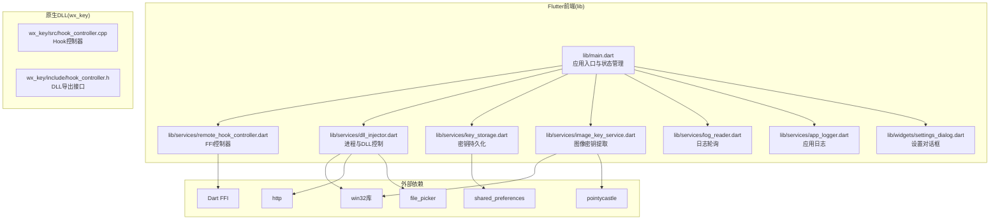
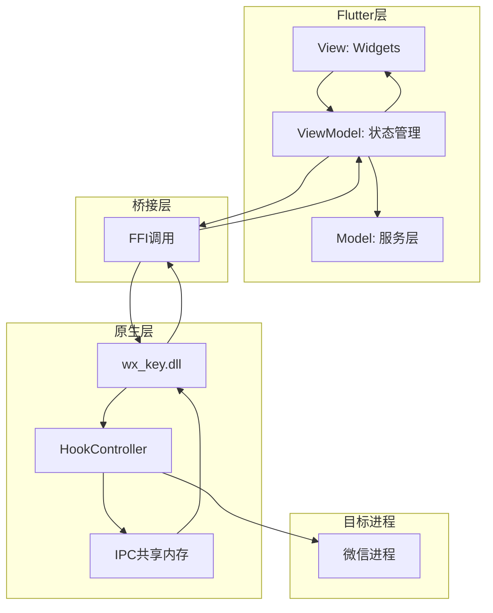
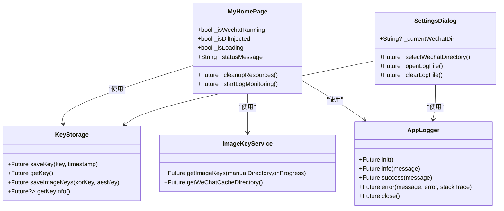
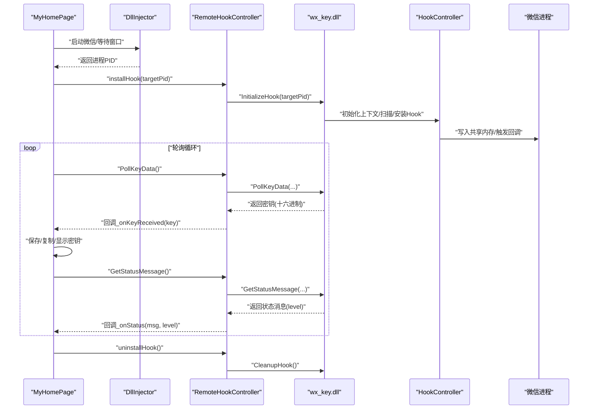
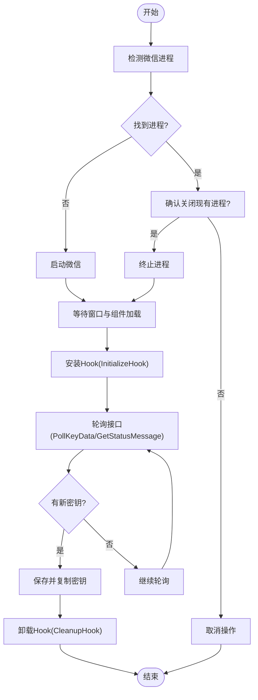
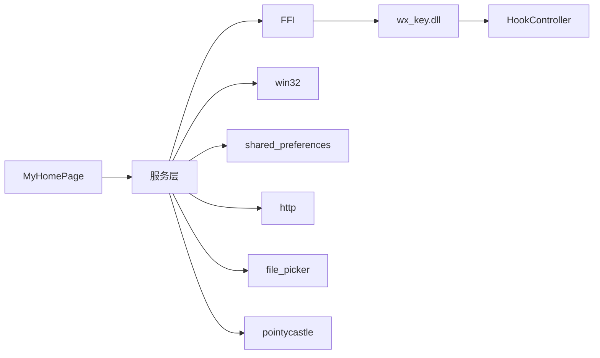

# 整体架构设计

<cite>
**本文档引用的文件**
- [README.md](file://README.md)
- [pubspec.yaml](file://pubspec.yaml)
- [lib/main.dart](file://lib/main.dart)
- [lib/services/remote_hook_controller.dart](file://lib/services/remote_hook_controller.dart)
- [lib/services/dll_injector.dart](file://lib/services/dll_injector.dart)
- [lib/services/key_storage.dart](file://lib/services/key_storage.dart)
- [lib/services/image_key_service.dart](file://lib/services/image_key_service.dart)
- [lib/services/log_reader.dart](file://lib/services/log_reader.dart)
- [lib/services/app_logger.dart](file://lib/services/app_logger.dart)
- [lib/widgets/settings_dialog.dart](file://lib/widgets/settings_dialog.dart)
- [wx_key/src/hook_controller.cpp](file://wx_key/src/hook_controller.cpp)
- [wx_key/include/hook_controller.h](file://wx_key/include/hook_controller.h)
</cite>

## 目录
1. [引言](#引言)
2. [项目结构](#项目结构)
3. [核心组件](#核心组件)
4. [架构总览](#架构总览)
5. [详细组件分析](#详细组件分析)
6. [依赖关系分析](#依赖关系分析)
7. [性能考量](#性能考量)
8. [故障排除指南](#故障排除指南)
9. [结论](#结论)
10. [附录](#附录)

## 引言
本项目为“微信密钥提取工具”，采用混合架构：Flutter前端负责用户界面与状态管理，C++原生DLL负责微信进程的Hook与密钥提取。通过FFI桥接，Flutter侧以轮询方式与DLL通信，实现密钥数据与状态消息的双向传递。系统还包含服务层封装业务逻辑，提供日志、持久化、图像密钥提取等能力，并通过IPC与共享内存保障跨进程数据一致性。

## 项目结构
项目采用典型的Flutter工程组织方式，按功能域划分lib目录，assets中包含内置DLL，wx_key目录为原生C++工程，包含Hook控制、IPC、远程扫描等模块头文件与源文件。

**图表来源**
- [lib/main.dart](file://lib/main.dart#L1-L120)
- [lib/services/remote_hook_controller.dart](file://lib/services/remote_hook_controller.dart#L1-L120)
- [lib/services/dll_injector.dart](file://lib/services/dll_injector.dart#L1-L120)
- [lib/services/key_storage.dart](file://lib/services/key_storage.dart#L1-L80)
- [lib/services/image_key_service.dart](file://lib/services/image_key_service.dart#L1-L120)
- [lib/services/log_reader.dart](file://lib/services/log_reader.dart#L1-L80)
- [lib/services/app_logger.dart](file://lib/services/app_logger.dart#L1-L80)
- [lib/widgets/settings_dialog.dart](file://lib/widgets/settings_dialog.dart#L1-L120)
- [wx_key/src/hook_controller.cpp](file://wx_key/src/hook_controller.cpp#L1-L120)
- [wx_key/include/hook_controller.h](file://wx_key/include/hook_controller.h#L1-L50)

**章节来源**
- [README.md](file://README.md#L77-L96)
- [pubspec.yaml](file://pubspec.yaml#L30-L61)

## 核心组件
- Flutter前端与MVVM
  - Model：服务层（KeyStorage、ImageKeyService、AppLogger等），负责数据与业务逻辑。
  - View：Widgets（MyHomePage、SettingsDialog等），负责UI渲染与用户交互。
  - ViewModel：通过状态管理（StatefulWidget + AnimationController）协调Model与View，处理生命周期与资源清理。
- 服务层
  - RemoteHookController：FFI控制器，负责加载DLL、查找导出函数、轮询密钥与状态。
  - DllInjector：进程发现、微信路径解析、进程启动/终止、窗口等待与组件检测。
  - KeyStorage：SharedPreferences封装，持久化数据库密钥与图像密钥。
  - ImageKeyService：图像密钥提取，内存扫描、密钥验证、与微信进程交互。
  - LogReader/AppLogger：日志轮询与应用日志持久化。
- 原生DLL与Hook
  - HookController：初始化上下文、扫描目标函数、安装Hook、IPC初始化、轮询接口导出。
  - IPC与共享内存：通过IPCManager与RemoteMemory在目标进程分配共享缓冲区，实现数据回传。

**章节来源**
- [lib/main.dart](file://lib/main.dart#L420-L535)
- [lib/services/remote_hook_controller.dart](file://lib/services/remote_hook_controller.dart#L32-L128)
- [lib/services/dll_injector.dart](file://lib/services/dll_injector.dart#L31-L120)
- [lib/services/key_storage.dart](file://lib/services/key_storage.dart#L5-L80)
- [lib/services/image_key_service.dart](file://lib/services/image_key_service.dart#L54-L120)
- [lib/services/log_reader.dart](file://lib/services/log_reader.dart#L6-L60)
- [lib/services/app_logger.dart](file://lib/services/app_logger.dart#L7-L60)
- [wx_key/src/hook_controller.cpp](file://wx_key/src/hook_controller.cpp#L23-L124)
- [wx_key/include/hook_controller.h](file://wx_key/include/hook_controller.h#L12-L46)

## 架构总览
混合架构以Flutter为UI与状态中枢，通过FFI调用原生DLL，DLL在目标微信进程中安装Hook并利用IPC共享内存回传密钥与状态。服务层将业务逻辑封装，降低UI与底层实现的耦合。

**图表来源**
- [lib/services/remote_hook_controller.dart](file://lib/services/remote_hook_controller.dart#L32-L128)
- [wx_key/src/hook_controller.cpp](file://wx_key/src/hook_controller.cpp#L414-L491)
- [wx_key/include/hook_controller.h](file://wx_key/include/hook_controller.h#L12-L46)

## 详细组件分析

### MVVM在Flutter中的实现
- Model
  - KeyStorage：封装SharedPreferences，提供密钥与图像密钥的读写与清理。
  - ImageKeyService：封装图像密钥提取流程，包含缓存目录定位、模板文件扫描、XOR/AES密钥计算、内存扫描与校验。
  - AppLogger：应用日志持久化与缓冲刷新。
- View
  - MyHomePage：主界面，包含状态指示、日志展示、按钮交互、窗口管理与资源清理。
  - SettingsDialog：设置面板，支持微信目录选择、日志文件打开与清空。
- ViewModel
  - 状态管理：通过StatefulWidget维护UI状态，使用AnimationController驱动视觉反馈。
  - 生命周期：在initState中启动轮询与检测，在dispose中清理Hook与订阅。

**图表来源**
- [lib/main.dart](file://lib/main.dart#L420-L535)
- [lib/widgets/settings_dialog.dart](file://lib/widgets/settings_dialog.dart#L20-L120)
- [lib/services/key_storage.dart](file://lib/services/key_storage.dart#L5-L135)
- [lib/services/image_key_service.dart](file://lib/services/image_key_service.dart#L54-L120)
- [lib/services/app_logger.dart](file://lib/services/app_logger.dart#L7-L80)

**章节来源**
- [lib/main.dart](file://lib/main.dart#L420-L535)
- [lib/widgets/settings_dialog.dart](file://lib/widgets/settings_dialog.dart#L20-L120)
- [lib/services/key_storage.dart](file://lib/services/key_storage.dart#L5-L135)
- [lib/services/image_key_service.dart](file://lib/services/image_key_service.dart#L54-L120)
- [lib/services/app_logger.dart](file://lib/services/app_logger.dart#L7-L80)

### 服务层架构设计
- RemoteHookController
  - 职责：加载DLL、查找导出函数、安装Hook、轮询密钥与状态、错误信息获取、资源清理。
  - 设计要点：使用定时器轮询，避免回调复杂性；通过指针缓冲区与UTF-8解码保证跨语言兼容。
- DllInjector
  - 职责：微信路径探测、进程枚举、进程启动/终止、窗口等待与界面组件检测。
  - 设计要点：多策略路径解析（注册表、App Paths、腾讯特定键）、窗口句柄枚举与组件计数判定。
- LogReader/AppLogger
  - 职责：轮询DLL日志文件、解析状态与密钥、应用日志持久化与缓冲刷新。
  - 设计要点：基于临时目录的共享日志文件，周期性轮询避免阻塞。

**图表来源**
- [lib/services/dll_injector.dart](file://lib/services/dll_injector.dart#L531-L657)
- [lib/services/remote_hook_controller.dart](file://lib/services/remote_hook_controller.dart#L89-L204)
- [wx_key/src/hook_controller.cpp](file://wx_key/src/hook_controller.cpp#L414-L491)
- [wx_key/include/hook_controller.h](file://wx_key/include/hook_controller.h#L12-L46)

**章节来源**
- [lib/services/remote_hook_controller.dart](file://lib/services/remote_hook_controller.dart#L32-L278)
- [lib/services/dll_injector.dart](file://lib/services/dll_injector.dart#L31-L200)
- [lib/services/log_reader.dart](file://lib/services/log_reader.dart#L96-L135)
- [lib/services/app_logger.dart](file://lib/services/app_logger.dart#L30-L80)

### DLL注入与Hook机制工作流程
- 进程间通信(IPC)与共享内存
  - HookController在目标进程中分配RemoteMemory作为共享缓冲区，DLL通过IPCManager设置远端缓冲区并注册数据回调。
  - Flutter侧通过轮询接口从共享缓冲区读取密钥与状态，避免回调复杂性。
- Hook安装与数据回传
  - HookController扫描Weixin.dll目标函数，安装Inline Hook，配置Shellcode与伪栈，将密钥写入共享缓冲区并通过IPC通知。
  - Flutter侧RemoteHookController定时轮询，读取新密钥与状态消息，更新UI与日志。
- 进程控制与窗口等待
  - DllInjector枚举进程、终止旧进程、启动新进程、等待主窗口与界面组件加载，确保Hook时机正确。

**图表来源**
- [lib/services/dll_injector.dart](file://lib/services/dll_injector.dart#L508-L657)
- [lib/services/remote_hook_controller.dart](file://lib/services/remote_hook_controller.dart#L89-L204)
- [wx_key/src/hook_controller.cpp](file://wx_key/src/hook_controller.cpp#L214-L379)

**章节来源**
- [wx_key/src/hook_controller.cpp](file://wx_key/src/hook_controller.cpp#L214-L379)
- [wx_key/include/hook_controller.h](file://wx_key/include/hook_controller.h#L12-L46)

### 数据流向与组件交互
- 数据流
  - 密钥：微信进程内存 → Hook → 共享内存 → DLL导出接口 → Flutter轮询 → UI显示与持久化。
  - 状态：Hook内部状态队列 → DLL导出接口 → Flutter轮询 → UI日志展示。
- 交互关系
  - MyHomePage协调DllInjector、RemoteHookController、KeyStorage、ImageKeyService与AppLogger。
  - RemoteHookController与HookController通过FFI与DLL导出接口交互。
  - LogReader轮询共享日志文件，向UI推送状态与密钥。

**章节来源**
- [lib/main.dart](file://lib/main.dart#L690-L807)
- [lib/services/log_reader.dart](file://lib/services/log_reader.dart#L96-L135)
- [lib/services/app_logger.dart](file://lib/services/app_logger.dart#L61-L86)

## 依赖关系分析
- 组件耦合与内聚
  - 耦合：RemoteHookController与HookController通过FFI耦合；DllInjector与win32库耦合；ImageKeyService与win32、pointycastle耦合。
  - 内聚：KeyStorage、AppLogger、LogReader分别聚焦单一职责，内聚性高。
- 外部依赖
  - FFI与win32：用于进程枚举、窗口枚举、内存读取与系统调用。
  - shared_preferences：本地持久化。
  - http与file_picker：网络下载与文件选择。
  - pointycastle：AES解密校验。

**图表来源**
- [pubspec.yaml](file://pubspec.yaml#L38-L61)
- [lib/services/remote_hook_controller.dart](file://lib/services/remote_hook_controller.dart#L1-L40)
- [lib/services/dll_injector.dart](file://lib/services/dll_injector.dart#L1-L10)
- [lib/services/image_key_service.dart](file://lib/services/image_key_service.dart#L1-L12)

**章节来源**
- [pubspec.yaml](file://pubspec.yaml#L38-L61)

## 性能考量
- 轮询频率：RemoteHookController以100ms为间隔轮询，平衡响应速度与CPU占用。
- 内存扫描：ImageKeyService分块读取与重叠拼接，避免跨块遗漏；限制单区域大小与进度反馈。
- 日志缓冲：AppLogger批量写入与定时刷新，减少频繁IO。
- IPC与共享内存：通过固定大小缓冲区与队列限制，避免内存膨胀。

[本节为通用指导，无需列出章节来源]

## 故障排除指南
- DLL加载失败
  - 检查DLL路径是否存在与可访问；确认架构匹配（x64）。
- Hook安装失败
  - 查看错误信息接口；确认微信版本受支持；确保目标函数扫描成功。
- 密钥获取超时
  - 确认微信已登录并触发图片加载；缩短内存扫描范围；检查安全软件拦截。
- 日志无输出
  - 检查临时目录权限；确认LogReader轮询正常；查看AppLogger文件大小与位置。

**章节来源**
- [lib/services/remote_hook_controller.dart](file://lib/services/remote_hook_controller.dart#L237-L253)
- [lib/services/dll_injector.dart](file://lib/services/dll_injector.dart#L658-L700)
- [lib/services/log_reader.dart](file://lib/services/log_reader.dart#L96-L135)
- [lib/services/app_logger.dart](file://lib/services/app_logger.dart#L30-L52)

## 结论
本项目通过Flutter与C++原生DLL的混合架构，实现了微信密钥提取的完整流程。Flutter负责UI与状态管理，服务层封装业务逻辑，DLL负责Hook与IPC数据回传。该设计在保证易用性的同时，兼顾了跨平台与底层控制能力，具备良好的扩展性与可维护性。

[本节为总结性内容，无需列出章节来源]

## 附录
- DLL导出接口
  - InitializeHook：安装Hook并初始化IPC。
  - PollKeyData：轮询获取密钥（十六进制字符串）。
  - GetStatusMessage：轮询获取状态消息与级别。
  - CleanupHook：卸载Hook并清理资源。
  - GetLastErrorMsg：获取最后错误信息。

**章节来源**
- [wx_key/include/hook_controller.h](file://wx_key/include/hook_controller.h#L12-L46)
- [wx_key/src/hook_controller.cpp](file://wx_key/src/hook_controller.cpp#L414-L491)