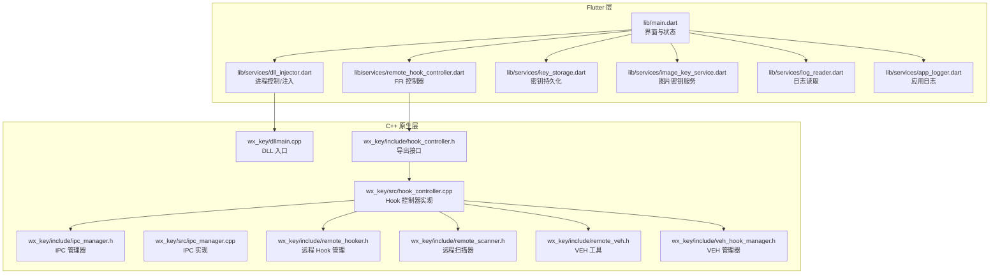
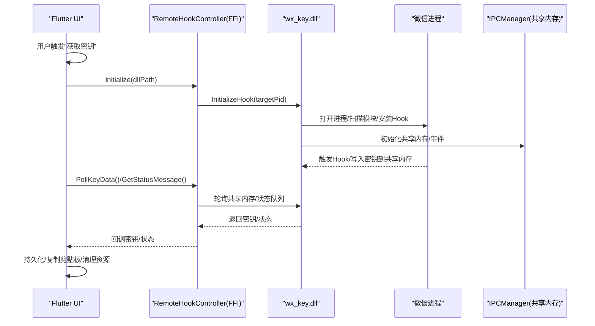
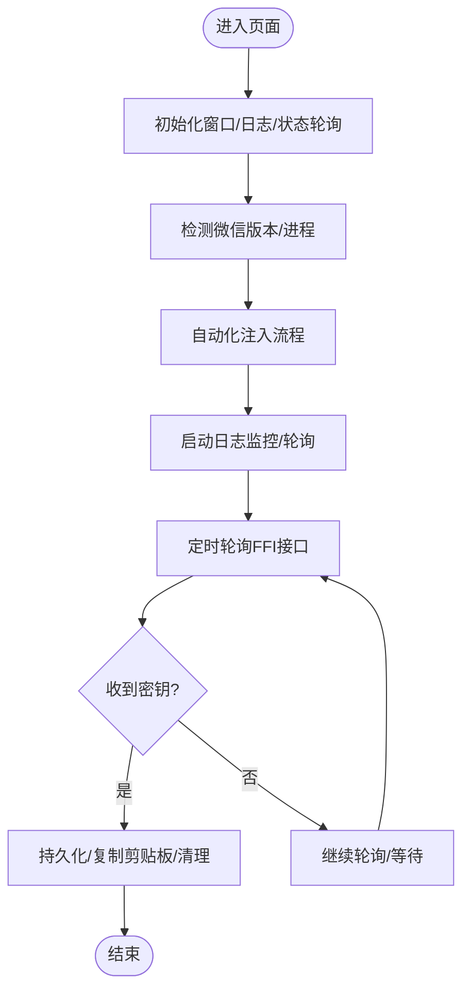
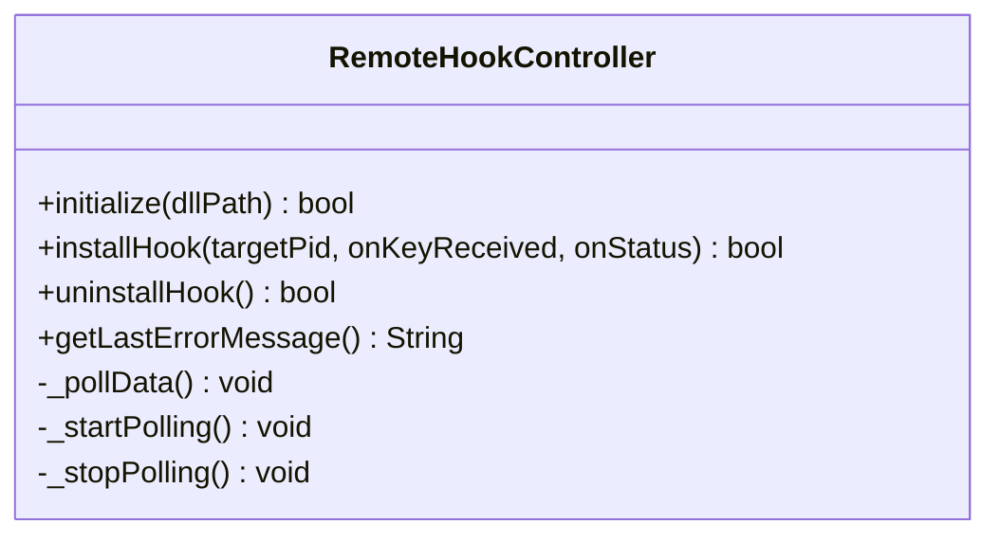
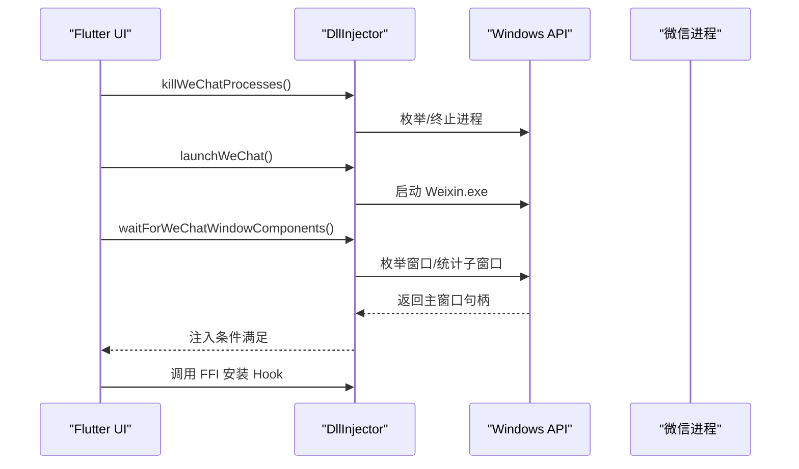
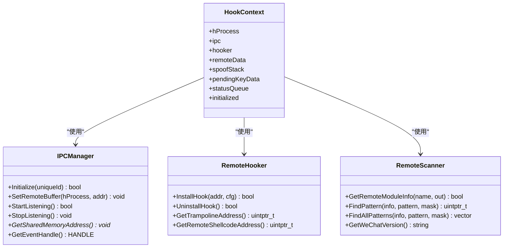
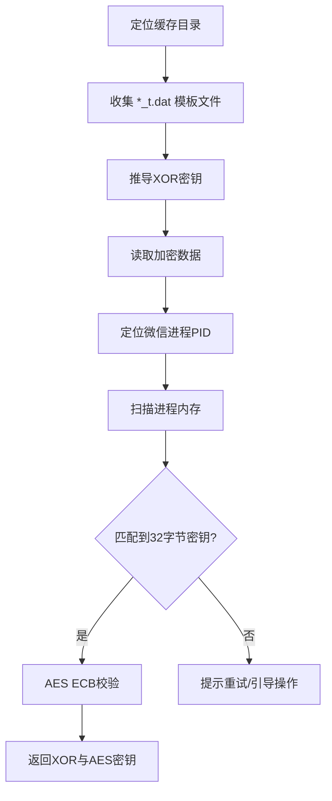
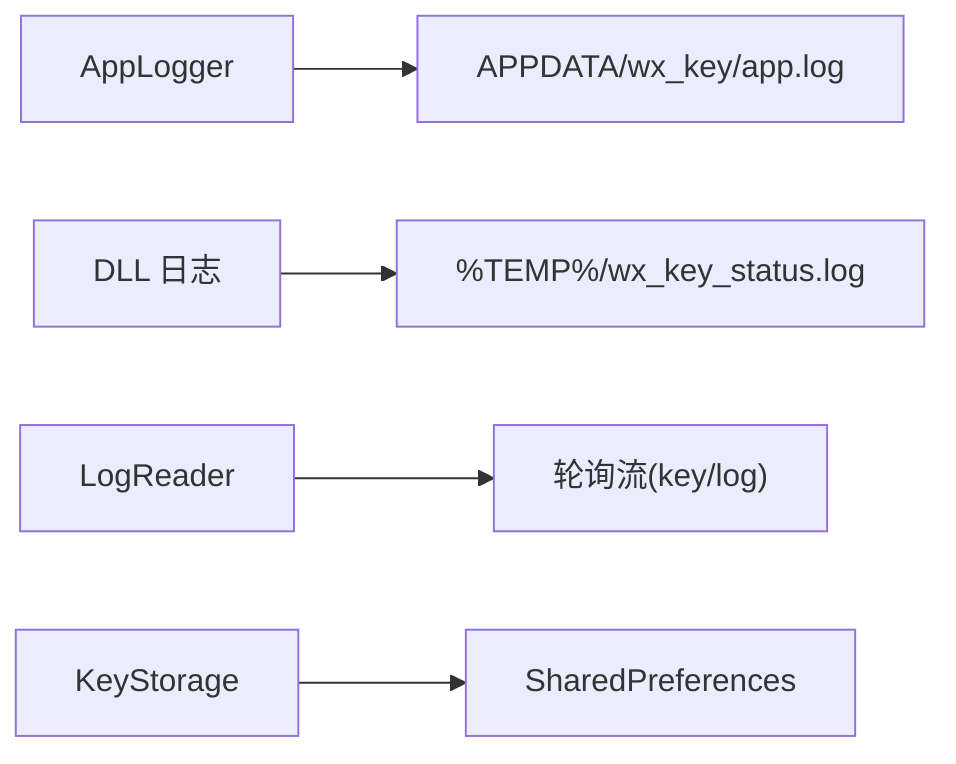
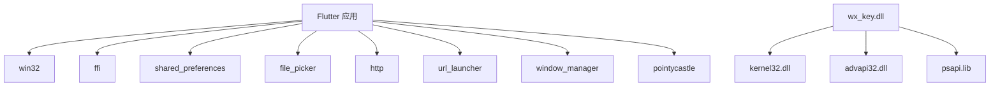

# 架构设计

<cite>
**本文引用的文件**
- [README.md](file://README.md)
- [pubspec.yaml](file://pubspec.yaml)
- [lib/main.dart](file://lib/main.dart)
- [lib/services/remote_hook_controller.dart](file://lib/services/remote_hook_controller.dart)
- [lib/services/dll_injector.dart](file://lib/services/dll_injector.dart)
- [lib/services/key_storage.dart](file://lib/services/key_storage.dart)
- [lib/services/image_key_service.dart](file://lib/services/image_key_service.dart)
- [lib/services/log_reader.dart](file://lib/services/log_reader.dart)
- [lib/services/app_logger.dart](file://lib/services/app_logger.dart)
- [wx_key/dllmain.cpp](file://wx_key/dllmain.cpp)
- [wx_key/include/hook_controller.h](file://wx_key/include/hook_controller.h)
- [wx_key/src/hook_controller.cpp](file://wx_key/src/hook_controller.cpp)
- [wx_key/include/ipc_manager.h](file://wx_key/include/ipc_manager.h)
- [wx_key/src/ipc_manager.cpp](file://wx_key/src/ipc_manager.cpp)
- [wx_key/include/remote_hooker.h](file://wx_key/include/remote_hooker.h)
- [wx_key/include/remote_scanner.h](file://wx_key/include/remote_scanner.h)
- [wx_key/include/remote_veh.h](file://wx_key/include/remote_veh.h)
- [wx_key/include/veh_hook_manager.h](file://wx_key/include/veh_hook_manager.h)
</cite>

## 目录
1. [引言](#引言)
2. [项目结构](#项目结构)
3. [核心组件](#核心组件)
4. [架构总览](#架构总览)
5. [详细组件分析](#详细组件分析)
6. [依赖分析](#依赖分析)
7. [性能考虑](#性能考虑)
8. [故障排除指南](#故障排除指南)
9. [结论](#结论)
10. [附录](#附录)

## 引言
本项目是一个混合架构的应用，结合了 Flutter 前端与 C++ 原生 DLL 的协作，用于在微信 4.x 版本中提取数据库密钥与缓存图片解密所需的密钥。系统通过 Flutter 提供用户界面与状态管理，通过 FFI 调用本地 DLL，DLL 在目标进程（微信）中执行 Hook 与内存扫描，借助共享内存与轮询机制将结果回传至 Flutter 层，最终由 UI 展示并持久化。

## 项目结构
项目采用“Flutter 前端 + C++ 原生模块”的双层架构：
- Flutter 层：负责 UI、状态管理、服务编排、日志与持久化。
- C++ 层：负责进程扫描、Hook 安装、内存读取、共享内存通信等底层能力。

图表来源
- [lib/main.dart](file://lib/main.dart#L1-L120)
- [lib/services/remote_hook_controller.dart](file://lib/services/remote_hook_controller.dart#L1-L120)
- [lib/services/dll_injector.dart](file://lib/services/dll_injector.dart#L1-L120)
- [lib/services/key_storage.dart](file://lib/services/key_storage.dart#L1-L80)
- [lib/services/image_key_service.dart](file://lib/services/image_key_service.dart#L1-L120)
- [lib/services/log_reader.dart](file://lib/services/log_reader.dart#L1-L80)
- [lib/services/app_logger.dart](file://lib/services/app_logger.dart#L1-L80)
- [wx_key/dllmain.cpp](file://wx_key/dllmain.cpp#L1-L24)
- [wx_key/include/hook_controller.h](file://wx_key/include/hook_controller.h#L1-L50)
- [wx_key/src/hook_controller.cpp](file://wx_key/src/hook_controller.cpp#L1-L120)
- [wx_key/include/ipc_manager.h](file://wx_key/include/ipc_manager.h#L1-L80)
- [wx_key/src/ipc_manager.cpp](file://wx_key/src/ipc_manager.cpp#L1-L120)
- [wx_key/include/remote_hooker.h](file://wx_key/include/remote_hooker.h#L1-L73)
- [wx_key/include/remote_scanner.h](file://wx_key/include/remote_scanner.h#L1-L70)
- [wx_key/include/remote_veh.h](file://wx_key/include/remote_veh.h#L1-L29)
- [wx_key/include/veh_hook_manager.h](file://wx_key/include/veh_hook_manager.h#L1-L33)

章节来源
- [README.md](file://README.md#L77-L112)
- [pubspec.yaml](file://pubspec.yaml#L30-L61)

## 核心组件
- Flutter 主入口与状态管理：负责窗口生命周期、状态轮询、日志流订阅、资源清理。
- FFI 控制器：封装 DLL 导出函数，提供初始化、轮询、状态获取、卸载等能力。
- 进程控制与注入：负责微信进程发现、启动、窗口等待、注入 DLL。
- 图片密钥服务：负责微信缓存目录定位、模板文件解析、XOR/AES 密钥推导与内存扫描。
- 日志系统：应用日志与 DLL 日志分离，分别持久化与轮询读取。
- 持久化：SharedPreferences 存储密钥与路径信息。

章节来源
- [lib/main.dart](file://lib/main.dart#L16-L120)
- [lib/services/remote_hook_controller.dart](file://lib/services/remote_hook_controller.dart#L32-L128)
- [lib/services/dll_injector.dart](file://lib/services/dll_injector.dart#L31-L120)
- [lib/services/image_key_service.dart](file://lib/services/image_key_service.dart#L54-L120)
- [lib/services/log_reader.dart](file://lib/services/log_reader.dart#L6-L60)
- [lib/services/app_logger.dart](file://lib/services/app_logger.dart#L7-L60)

## 架构总览
系统采用“前端 UI + FFI 控制 + 原生 Hook + 共享内存轮询”的混合架构。Flutter 作为控制中枢，通过 FFI 调用本地 DLL；DLL 在目标进程（微信）中安装 Hook，扫描内存并写入共享内存；Flutter 侧通过轮询读取共享内存与日志文件，实现无回调的稳定数据回传。

图表来源
- [lib/services/remote_hook_controller.dart](file://lib/services/remote_hook_controller.dart#L89-L128)
- [wx_key/include/hook_controller.h](file://wx_key/include/hook_controller.h#L12-L46)
- [wx_key/src/hook_controller.cpp](file://wx_key/src/hook_controller.cpp#L414-L491)
- [wx_key/include/ipc_manager.h](file://wx_key/include/ipc_manager.h#L18-L53)
- [wx_key/src/ipc_manager.cpp](file://wx_key/src/ipc_manager.cpp#L212-L273)

## 详细组件分析

### MVVM 与 Flutter 状态管理
- 状态容器：MyHomePage 作为状态持有者，维护微信运行状态、DLL 注入状态、密钥与日志等 UI 状态。
- 轮询驱动：通过定时器周期性调用 FFI 轮询接口，避免回调复杂度。
- 生命周期：窗口关闭时统一清理 Hook、停止轮询、关闭日志流订阅，确保资源回收。

图表来源
- [lib/main.dart](file://lib/main.dart#L420-L534)
- [lib/main.dart](file://lib/main.dart#L690-L707)
- [lib/main.dart](file://lib/main.dart#L709-L807)

章节来源
- [lib/main.dart](file://lib/main.dart#L420-L534)
- [lib/main.dart](file://lib/main.dart#L690-L707)
- [lib/main.dart](file://lib/main.dart#L709-L807)

### FFI 控制器（RemoteHookController）
- 功能职责：加载 DLL、查找导出函数、安装 Hook、轮询密钥与状态、卸载 Hook、错误获取。
- 轮询策略：固定周期（约 100ms）读取共享内存与状态队列，避免回调与线程同步复杂度。
- 线程安全：内部使用临界区保护共享数据，保证多线程读写一致性。

图表来源
- [lib/services/remote_hook_controller.dart](file://lib/services/remote_hook_controller.dart#L32-L278)

章节来源
- [lib/services/remote_hook_controller.dart](file://lib/services/remote_hook_controller.dart#L32-L278)

### DLL 注入与进程控制（DllInjector）
- 进程发现：通过 Win32 API 枚举进程，匹配 Weixin.exe。
- 路径探测：优先读取用户设置，其次注册表与常见路径，最后兜底扫描。
- 注入流程：关闭现有微信 → 启动新进程 → 等待窗口就绪 → 注入 DLL → 安装 Hook。
- 窗口等待：基于窗口标题与类名匹配，统计子窗口数量判断界面加载完成。

图表来源
- [lib/services/dll_injector.dart](file://lib/services/dll_injector.dart#L508-L657)
- [lib/services/dll_injector.dart](file://lib/services/dll_injector.dart#L659-L800)

章节来源
- [lib/services/dll_injector.dart](file://lib/services/dll_injector.dart#L508-L657)
- [lib/services/dll_injector.dart](file://lib/services/dll_injector.dart#L659-L800)

### Hook 与 IPC（C++ 原生）
- Hook 控制器：初始化系统调用、打开目标进程、扫描模块、安装 Inline Hook、分配远程数据缓冲区与伪栈、初始化 IPC。
- IPC 管理器：创建共享内存与事件，监听线程轮询远程缓冲区，回调上层处理新数据。
- 远程 Hook：在目标函数地址处安装跳板，保存原始指令，写入跳转指令，支持堆栈伪造。
- 版本扫描：根据微信版本配置查找特征码，适配不同版本。

图表来源
- [wx_key/src/hook_controller.cpp](file://wx_key/src/hook_controller.cpp#L23-L70)
- [wx_key/include/ipc_manager.h](file://wx_key/include/ipc_manager.h#L18-L76)
- [wx_key/include/remote_hooker.h](file://wx_key/include/remote_hooker.h#L9-L70)
- [wx_key/include/remote_scanner.h](file://wx_key/include/remote_scanner.h#L15-L44)

章节来源
- [wx_key/src/hook_controller.cpp](file://wx_key/src/hook_controller.cpp#L213-L380)
- [wx_key/src/hook_controller.cpp](file://wx_key/src/hook_controller.cpp#L414-L491)
- [wx_key/include/ipc_manager.h](file://wx_key/include/ipc_manager.h#L18-L76)
- [wx_key/src/ipc_manager.cpp](file://wx_key/src/ipc_manager.cpp#L212-L273)
- [wx_key/include/remote_hooker.h](file://wx_key/include/remote_hooker.h#L9-L70)
- [wx_key/include/remote_scanner.h](file://wx_key/include/remote_scanner.h#L15-L44)

### 图片密钥服务（ImageKeyService）
- 缓存目录定位：枚举 Documents/xwechat_files 下的账号目录，筛选含 db_storage 或 Image 缓存的目录。
- XOR 密钥推导：从 *_t.dat 模板文件末尾字节统计，推导 XOR 密钥。
- AES 密钥提取：读取模板文件中的加密数据，扫描微信进程内存，按 ASCII/UTF-16 规则匹配 32 字节密钥，使用 AES ECB 校验。
- 进度反馈：通过回调向 UI 报告扫描进度与状态。

图表来源
- [lib/services/image_key_service.dart](file://lib/services/image_key_service.dart#L600-L698)
- [lib/services/image_key_service.dart](file://lib/services/image_key_service.dart#L308-L467)

章节来源
- [lib/services/image_key_service.dart](file://lib/services/image_key_service.dart#L600-L698)
- [lib/services/image_key_service.dart](file://lib/services/image_key_service.dart#L308-L467)

### 日志与持久化
- 应用日志：集中写入 APPDATA 下的 app.log，定时刷新缓冲区，支持打开日志文件。
- DLL 日志：写入系统临时目录的 wx_key_status.log，Flutter 侧通过轮询流读取并区分密钥与状态消息。
- 密钥持久化：使用 SharedPreferences 存储数据库密钥、图片密钥与时间戳，支持清除。

图表来源
- [lib/services/app_logger.dart](file://lib/services/app_logger.dart#L13-L60)
- [lib/services/log_reader.dart](file://lib/services/log_reader.dart#L6-L60)
- [lib/services/key_storage.dart](file://lib/services/key_storage.dart#L14-L82)

章节来源
- [lib/services/app_logger.dart](file://lib/services/app_logger.dart#L13-L60)
- [lib/services/log_reader.dart](file://lib/services/log_reader.dart#L6-L60)
- [lib/services/key_storage.dart](file://lib/services/key_storage.dart#L14-L82)

## 依赖分析
- Flutter 依赖：win32（Win32 API）、ffi（FFI）、shared_preferences（持久化）、file_picker（文件选择）、http（下载）、url_launcher（打开链接）、window_manager（窗口管理）、pointycastle（AES）。
- 原生依赖：Windows SDK（进程/内存/共享内存/事件），间接系统调用（NtOpenProcess 等）。

图表来源
- [pubspec.yaml](file://pubspec.yaml#L38-L61)
- [wx_key/src/hook_controller.cpp](file://wx_key/src/hook_controller.cpp#L225-L232)

章节来源
- [pubspec.yaml](file://pubspec.yaml#L38-L61)
- [wx_key/src/hook_controller.cpp](file://wx_key/src/hook_controller.cpp#L225-L232)

## 性能考虑
- 轮询频率：FFI 轮询间隔约 100ms，兼顾实时性与 CPU 占用；IPC 轮询加入轻微抖动，降低可识别特征。
- 内存扫描：按 4MB 块扫描并带重叠，避免跨块遗漏；过滤不可读/保护区域，减少无效 IO。
- 线程与锁：Hook 上下文使用临界区保护共享数据，避免竞态；IPC 监听线程可优雅退出。
- I/O 优化：应用日志采用缓冲区 + 定时刷新，避免频繁磁盘写入。

## 故障排除指南
- DLL 加载失败：检查 DLL 路径是否存在、是否位于纯英文路径、权限问题。
- 注入失败：确认微信进程已关闭/启动成功、窗口等待超时可适当延长、权限不足需以管理员运行。
- Hook 安装失败：查看状态队列中的错误信息，确认目标函数地址与版本配置匹配。
- 密钥获取超时：按提示重新登录微信、打开朋友圈图片多次后再尝试。
- 日志定位：使用“打开日志”功能查看应用日志与 DLL 日志，结合轮询流定位问题阶段。

章节来源
- [lib/services/remote_hook_controller.dart](file://lib/services/remote_hook_controller.dart#L237-L253)
- [lib/main.dart](file://lib/main.dart#L690-L707)
- [lib/services/app_logger.dart](file://lib/services/app_logger.dart#L147-L167)

## 结论
本项目通过 Flutter 与 C++ 的混合架构，实现了对微信 4.x 的稳定密钥提取能力。Flutter 提供简洁易用的 UI 与状态管理，C++ 原生层负责高风险的 Hook 与内存扫描，二者通过 FFI 与共享内存实现低耦合协作。整体设计在安全性、稳定性与可维护性之间取得平衡，适合在受控环境下进行技术验证与学习。

## 附录
- 技术选型说明
  - Flutter：跨平台 UI 框架，便于快速迭代与多平台部署。
  - FFI：直接调用原生 DLL，避免中间层抽象带来的复杂性。
  - 共享内存 + 轮询：简化 IPC 设计，避免回调与线程模型复杂度。
  - AES：使用标准库进行密钥校验，确保结果正确性。
- 平台特定处理
  - Windows：使用 Win32 API、进程/内存/共享内存/事件等原生能力。
  - 跨平台支持：项目结构包含 android/ios/linux/macOS/windows，但核心 DLL 与 Hook 仅在 Windows 生效。