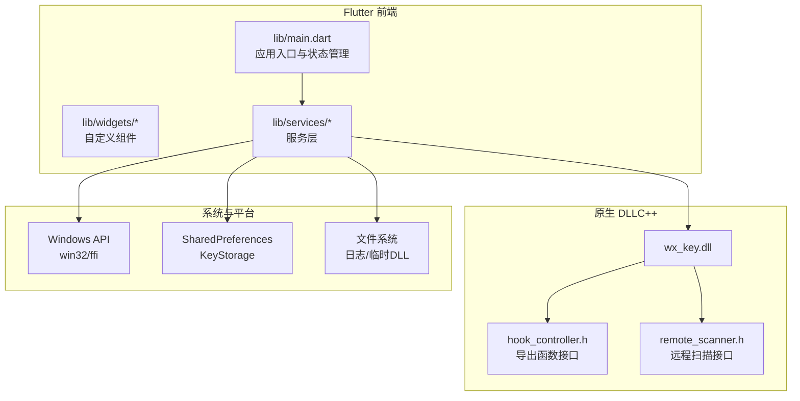
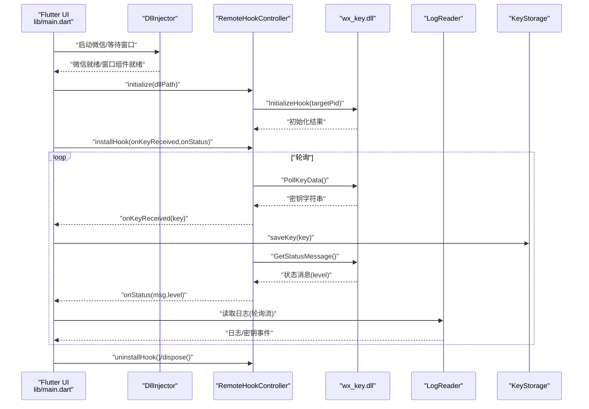
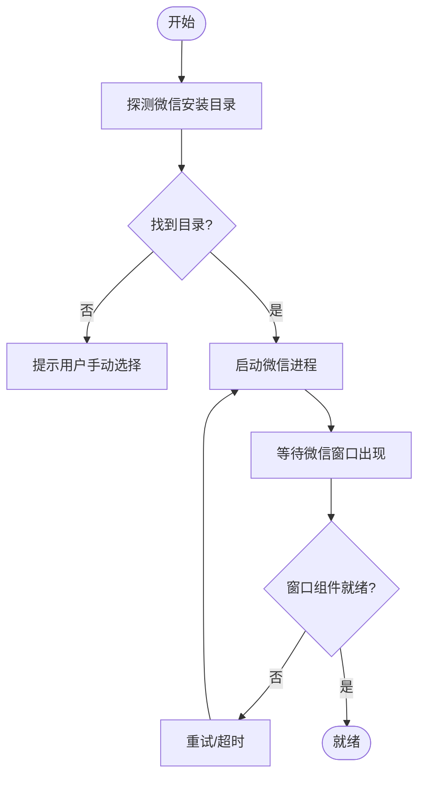
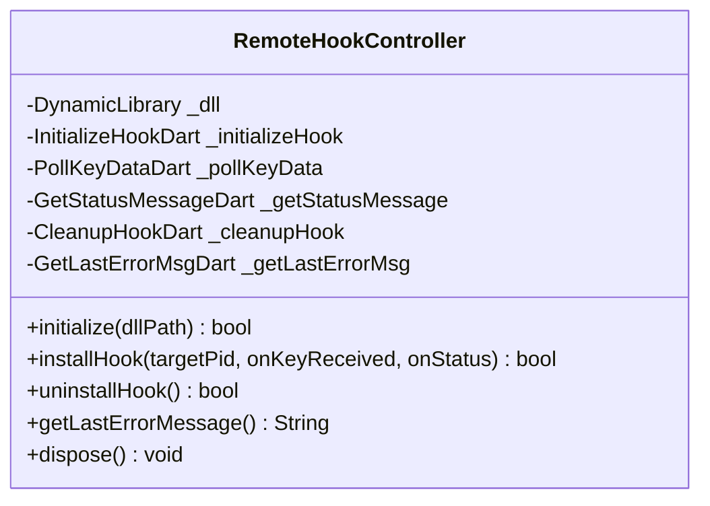
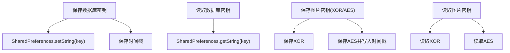
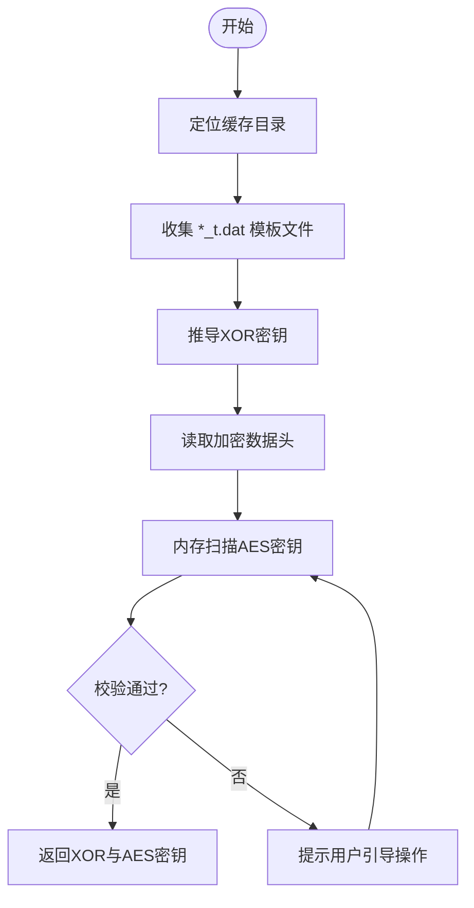
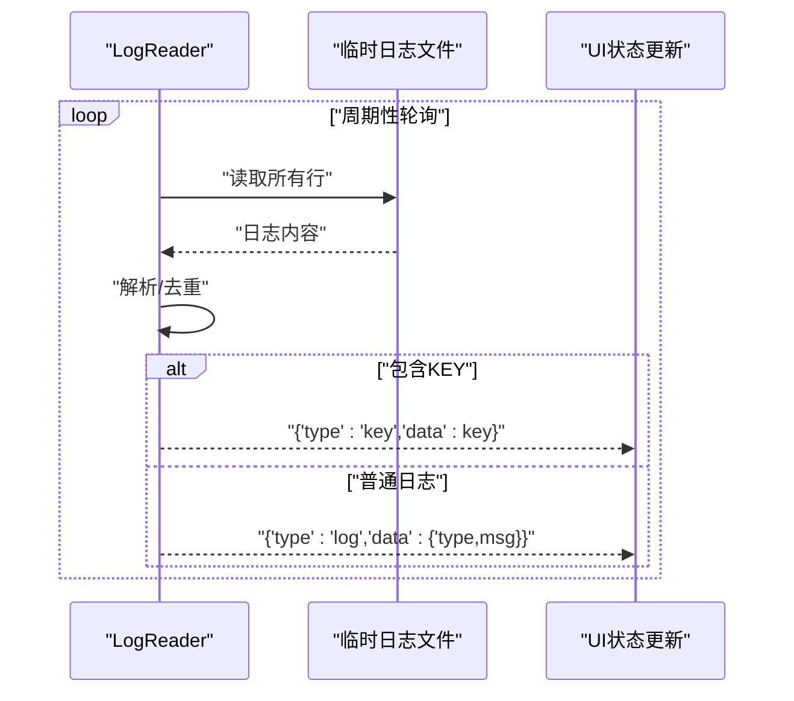
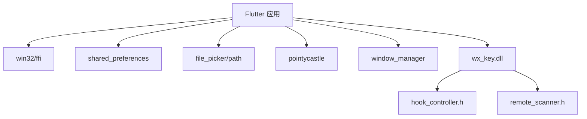

# 组件关系与交互

<cite>
**本文引用的文件**
- [lib/main.dart](file://lib/main.dart)
- [lib/services/dll_injector.dart](file://lib/services/dll_injector.dart)
- [lib/services/remote_hook_controller.dart](file://lib/services/remote_hook_controller.dart)
- [lib/services/key_storage.dart](file://lib/services/key_storage.dart)
- [lib/services/image_key_service.dart](file://lib/services/image_key_service.dart)
- [lib/services/log_reader.dart](file://lib/services/log_reader.dart)
- [lib/services/app_logger.dart](file://lib/services/app_logger.dart)
- [lib/widgets/settings_dialog.dart](file://lib/widgets/settings_dialog.dart)
- [android/app/src/main/kotlin/com/example/wx_key/MainActivity.kt](file://android/app/src/main/kotlin/com/example/wx_key/MainActivity.kt)
- [pubspec.yaml](file://pubspec.yaml)
- [README.md](file://README.md)
- [docs/dll_usage.md](file://docs/dll_usage.md)
- [wx_key/include/hook_controller.h](file://wx_key/include/hook_controller.h)
- [wx_key/include/remote_scanner.h](file://wx_key/include/remote_scanner.h)
</cite>

## 目录
1. [引言](#引言)
2. [项目结构](#项目结构)
3. [核心组件](#核心组件)
4. [架构总览](#架构总览)
5. [详细组件分析](#详细组件分析)
6. [依赖关系分析](#依赖关系分析)
7. [性能考虑](#性能考虑)
8. [故障排除指南](#故障排除指南)
9. [结论](#结论)
10. [附录](#附录)

## 引言
本项目是一个跨平台桌面应用，目标是在微信 4.x 版本中提取数据库密钥与缓存图片解密所需的 XOR/AES 密钥。应用采用 Flutter 前端，结合原生 C++ DLL（通过 FFI 调用）实现对微信进程的远程 Hook 与内存扫描。本文档聚焦于组件关系与交互，深入解析以下主题：
- Flutter 前端与原生 DLL 的 FFI 交互机制与参数传递
- 服务层组件的职责划分与相互依赖
- 状态管理与组件间同步
- 事件驱动与异步处理、错误传播
- 数据持久化（SharedPreferences）与版本兼容
- 时序图与数据流向图，帮助理解复杂交互

## 项目结构
项目采用典型的 Flutter 工程组织方式，核心代码位于 lib 目录，原生 DLL 位于 wx_key 目录并通过 Flutter 资源打包。关键目录与文件如下：
- lib/main.dart：应用入口与主界面状态管理
- lib/services/*：服务层（DLL 注入、远程 Hook 控制、密钥存储、图片密钥提取、日志与应用日志）
- lib/widgets/*：自定义 UI 组件（设置对话框等）
- assets/dll/wx_key.dll：内置 DLL（打包为资源）
- wx_key/include/*.h：DLL 导出函数与远程扫描接口定义
- pubspec.yaml：依赖与资源声明
- README.md 与 docs/dll_usage.md：项目说明与 DLL 集成指南

图表来源
- [lib/main.dart](file://lib/main.dart#L16-L35)
- [lib/services/dll_injector.dart](file://lib/services/dll_injector.dart#L1-L50)
- [lib/services/remote_hook_controller.dart](file://lib/services/remote_hook_controller.dart#L32-L87)
- [lib/services/key_storage.dart](file://lib/services/key_storage.dart#L1-L20)
- [wx_key/include/hook_controller.h](file://wx_key/include/hook_controller.h#L12-L46)
- [wx_key/include/remote_scanner.h](file://wx_key/include/remote_scanner.h#L15-L44)

章节来源
- [README.md](file://README.md#L77-L96)
- [pubspec.yaml](file://pubspec.yaml#L84-L87)

## 核心组件
- DllInjector：负责微信进程发现、启动、窗口等待与 DLL 路径管理；提供微信版本检测、进程控制等能力
- RemoteHookController：通过 FFI 加载 wx_key.dll，调用导出函数进行 Hook 初始化、轮询密钥与状态、清理资源
- KeyStorage：基于 SharedPreferences 的密钥持久化服务，支持数据库密钥与图片密钥（XOR/AES）的保存与读取
- ImageKeyService：图片密钥提取服务，负责微信缓存目录定位、模板文件扫描、XOR/AES 密钥推导与内存扫描
- LogReader：读取 DLL 写入的临时日志文件，提供轮询流以异步推送状态与密钥
- AppLogger：应用级日志服务，负责日志文件管理、缓冲与落盘
- SettingsDialog：设置弹窗，支持微信安装目录选择、日志文件打开与清空等

章节来源
- [lib/services/dll_injector.dart](file://lib/services/dll_injector.dart#L31-L95)
- [lib/services/remote_hook_controller.dart](file://lib/services/remote_hook_controller.dart#L34-L87)
- [lib/services/key_storage.dart](file://lib/services/key_storage.dart#L5-L20)
- [lib/services/image_key_service.dart](file://lib/services/image_key_service.dart#L54-L62)
- [lib/services/log_reader.dart](file://lib/services/log_reader.dart#L6-L22)
- [lib/services/app_logger.dart](file://lib/services/app_logger.dart#L7-L28)
- [lib/widgets/settings_dialog.dart](file://lib/widgets/settings_dialog.dart#L8-L18)

## 架构总览
整体架构采用“前端事件驱动 + 原生 DLL 远程 Hook”的模式：
- 前端通过 DllInjector 启动微信并等待窗口就绪
- 通过 RemoteHookController 初始化 DLL 并安装 Hook
- DLL 通过远程扫描定位微信密钥获取点，将密钥写入共享内存
- 前端轮询 DLL 导出函数获取密钥与状态，同时通过 LogReader 读取 DLL 日志
- KeyStorage 持久化密钥与配置，AppLogger 记录应用运行日志

图表来源
- [lib/main.dart](file://lib/main.dart#L866-L967)
- [lib/services/remote_hook_controller.dart](file://lib/services/remote_hook_controller.dart#L47-L128)
- [lib/services/log_reader.dart](file://lib/services/log_reader.dart#L96-L135)
- [docs/dll_usage.md](file://docs/dll_usage.md#L25-L31)

## 详细组件分析

### DllInjector：微信进程与窗口管理
- 职责
  - 微信安装目录探测（注册表、App Paths、腾讯特定键）
  - 进程发现与终止、微信启动与等待窗口出现
  - 窗口组件就绪检测（标题/类名匹配、子窗口统计）
  - DLL 路径管理（内置 DLL 提取到临时目录）
- 关键交互
  - 与 RemoteHookController 协作：提供 DLL 路径与微信 PID
  - 与 LogReader 协作：启动日志监控，读取 DLL 状态
- 参数与返回
  - 进程 ID 列表、窗口句柄枚举、窗口组件计数阈值等

图表来源
- [lib/services/dll_injector.dart](file://lib/services/dll_injector.dart#L406-L479)
- [lib/services/dll_injector.dart](file://lib/services/dll_injector.dart#L604-L657)

章节来源
- [lib/services/dll_injector.dart](file://lib/services/dll_injector.dart#L97-L119)
- [lib/services/dll_injector.dart](file://lib/services/dll_injector.dart#L508-L602)

### RemoteHookController：FFI 与 DLL 交互
- 职责
  - 动态加载 wx_key.dll 并解析导出函数
  - 初始化 Hook（传入目标微信 PID）
  - 轮询获取密钥与状态消息
  - 清理 Hook 与资源
- FFI 与参数
  - 导出函数类型映射：InitializeHook、PollKeyData、GetStatusMessage、CleanupHook、GetLastErrorMsg
  - 参数传递：密钥缓冲区（至少 65 字节）、状态缓冲区（至少 256 字节）、输出级别指针
- 错误处理
  - 通过 GetLastErrorMsg 获取最后错误信息
  - 轮询过程中捕获异常并记录日志

图表来源
- [lib/services/remote_hook_controller.dart](file://lib/services/remote_hook_controller.dart#L34-L87)
- [lib/services/remote_hook_controller.dart](file://lib/services/remote_hook_controller.dart#L146-L204)

章节来源
- [lib/services/remote_hook_controller.dart](file://lib/services/remote_hook_controller.dart#L47-L87)
- [lib/services/remote_hook_controller.dart](file://lib/services/remote_hook_controller.dart#L206-L235)
- [docs/dll_usage.md](file://docs/dll_usage.md#L25-L31)

### KeyStorage：数据持久化与版本兼容
- 职责
  - 数据库密钥与时间戳保存/读取
  - 图片密钥（XOR/AES）与时间戳保存/读取
  - 微信安装目录保存/读取
  - DLL 路径保存/读取
- 实现要点
  - 基于 SharedPreferences 的键值存储
  - 时间戳序列化为 ISO8601 字符串
  - 异常捕获与返回空值，保证 UI 不中断
- 版本兼容
  - 通过新增键名与条件判断实现平滑升级

图表来源
- [lib/services/key_storage.dart](file://lib/services/key_storage.dart#L14-L30)
- [lib/services/key_storage.dart](file://lib/services/key_storage.dart#L170-L205)
- [lib/services/key_storage.dart](file://lib/services/key_storage.dart#L230-L257)

章节来源
- [lib/services/key_storage.dart](file://lib/services/key_storage.dart#L1-L273)

### ImageKeyService：图片密钥提取
- 职责
  - 定位微信缓存目录（支持多账号）
  - 模板文件（*_t.dat）收集与解析
  - XOR 密钥推导与 AES 密钥读取（内存扫描）
- 内存扫描算法
  - 遍历进程内存区域（过滤不可读/保护页）
  - 按块扫描，支持 ASCII 与 UTF-16LE 密钥格式
  - 使用 AES ECB 校验密钥有效性
- 超时与重试
  - 内存扫描超时处理与用户引导（重新登录/打开图片）

图表来源
- [lib/services/image_key_service.dart](file://lib/services/image_key_service.dart#L64-L114)
- [lib/services/image_key_service.dart](file://lib/services/image_key_service.dart#L198-L246)
- [lib/services/image_key_service.dart](file://lib/services/image_key_service.dart#L308-L467)

章节来源
- [lib/services/image_key_service.dart](file://lib/services/image_key_service.dart#L54-L62)
- [lib/services/image_key_service.dart](file://lib/services/image_key_service.dart#L600-L696)

### LogReader 与 AppLogger：事件驱动与日志
- LogReader
  - 定期轮询临时日志文件，解析行并区分密钥与状态消息
  - 提供 StreamController 流，避免重复消息
- AppLogger
  - 缓冲区 + 定时刷新，限制日志文件大小
  - 支持打开日志文件、清空、获取大小等

图表来源
- [lib/services/log_reader.dart](file://lib/services/log_reader.dart#L96-L135)
- [lib/services/app_logger.dart](file://lib/services/app_logger.dart#L30-L52)

章节来源
- [lib/services/log_reader.dart](file://lib/services/log_reader.dart#L6-L22)
- [lib/services/app_logger.dart](file://lib/services/app_logger.dart#L120-L131)

### SettingsDialog：配置与运维
- 功能
  - 选择微信安装目录（验证是否存在 Weixin.exe/WeChat.exe）
  - 打开/清空应用日志
  - 触发主界面状态更新回调
- 与 KeyStorage/AppLogger 的协作

章节来源
- [lib/widgets/settings_dialog.dart](file://lib/widgets/settings_dialog.dart#L42-L85)
- [lib/widgets/settings_dialog.dart](file://lib/widgets/settings_dialog.dart#L89-L125)

## 依赖关系分析
- Flutter 与原生依赖
  - win32/ffi：Windows API 调用与 FFI
  - shared_preferences：密钥持久化
  - file_picker/path：文件/路径操作
  - pointycastle：AES 校验
  - window_manager：窗口管理
- 资源与打包
  - assets/dll/wx_key.dll：内置 DLL，随应用打包
- 组件耦合
  - RemoteHookController 与 DllInjector 高度耦合（DLL 路径、PID）
  - 主界面状态机与各服务通过回调/流连接，低耦合高内聚

图表来源
- [pubspec.yaml](file://pubspec.yaml#L38-L60)
- [pubspec.yaml](file://pubspec.yaml#L84-L87)
- [wx_key/include/hook_controller.h](file://wx_key/include/hook_controller.h#L12-L46)
- [wx_key/include/remote_scanner.h](file://wx_key/include/remote_scanner.h#L15-L44)

章节来源
- [pubspec.yaml](file://pubspec.yaml#L30-L61)

## 性能考虑
- 轮询频率与资源占用
  - RemoteHookController 轮询间隔 100ms，避免 UI 线程阻塞
  - LogReader 轮询间隔 500ms，减少 IO 压力
- 内存扫描优化
  - 分块扫描与重叠拼接，避免跨块遗漏
  - 过滤不可读/保护页，限制最大扫描区域
- 缓冲与落盘
  - AppLogger 使用缓冲区与定时刷新，降低频繁写入
- 资源清理
  - 超时与异常路径及时释放 DLL 句柄与轮询定时器

## 故障排除指南
- DLL 初始化失败
  - 检查管理员权限、微信架构匹配（x64）
  - 通过 GetLastErrorMsg 获取具体错误
- 微信窗口未就绪
  - 等待时间不足或界面组件未加载，适当延长等待
- 内存扫描超时
  - 引导用户重新登录并打开图片，触发密钥驻留内存
- 日志文件过大
  - AppLogger 自动清空超过阈值的日志文件，或手动清空

章节来源
- [lib/services/remote_hook_controller.dart](file://lib/services/remote_hook_controller.dart#L237-L253)
- [lib/services/dll_injector.dart](file://lib/services/dll_injector.dart#L618-L657)
- [lib/services/image_key_service.dart](file://lib/services/image_key_service.dart#L665-L686)
- [lib/services/app_logger.dart](file://lib/services/app_logger.dart#L30-L52)

## 结论
本项目通过 Flutter 与原生 DLL 的协同，实现了微信密钥提取的自动化流程。服务层组件职责清晰、边界明确，配合事件驱动与轮询机制，确保了异步操作的可控性与错误的可追踪性。SharedPreferences 与应用日志体系保障了数据持久化与可观测性。未来可在以下方面持续优化：
- 增强版本配置管理，降低特征码变更带来的维护成本
- 引入更细粒度的状态机与 UI 响应策略
- 优化内存扫描策略与并发控制

## 附录
- DLL 导出函数与调用流程参考：docs/dll_usage.md
- 原生接口定义：wx_key/include/hook_controller.h、wx_key/include/remote_scanner.h
- Android 入口 Activity：android/app/src/main/kotlin/com/example/wx_key/MainActivity.kt