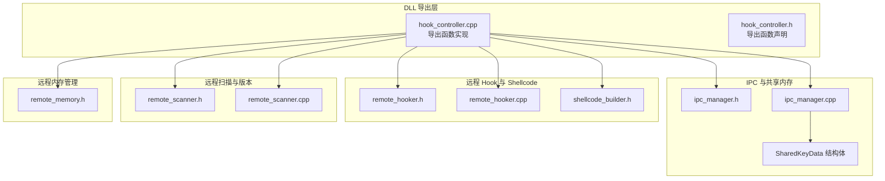
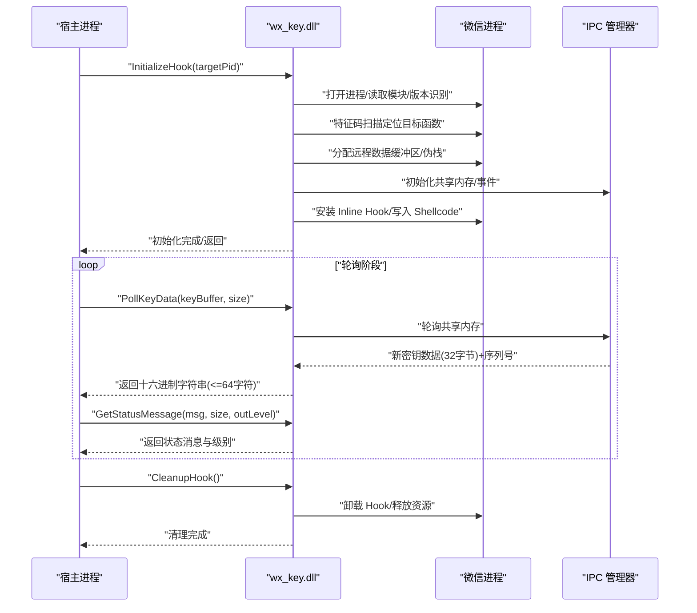
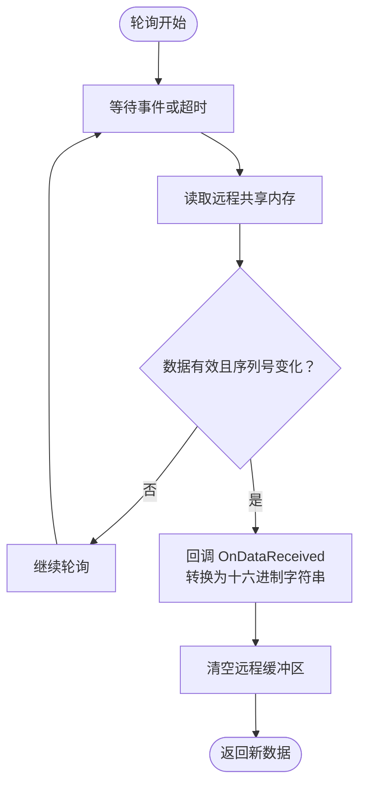
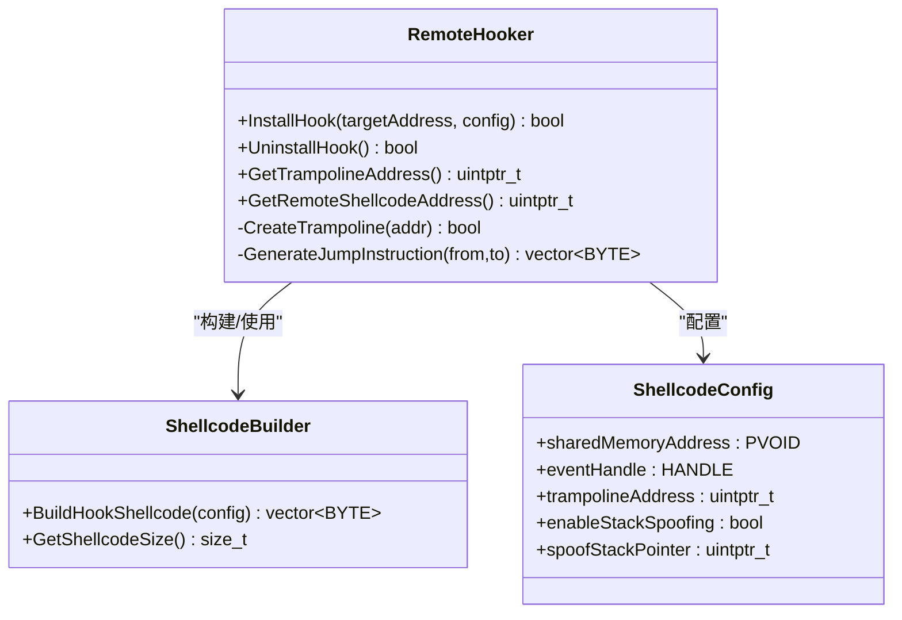
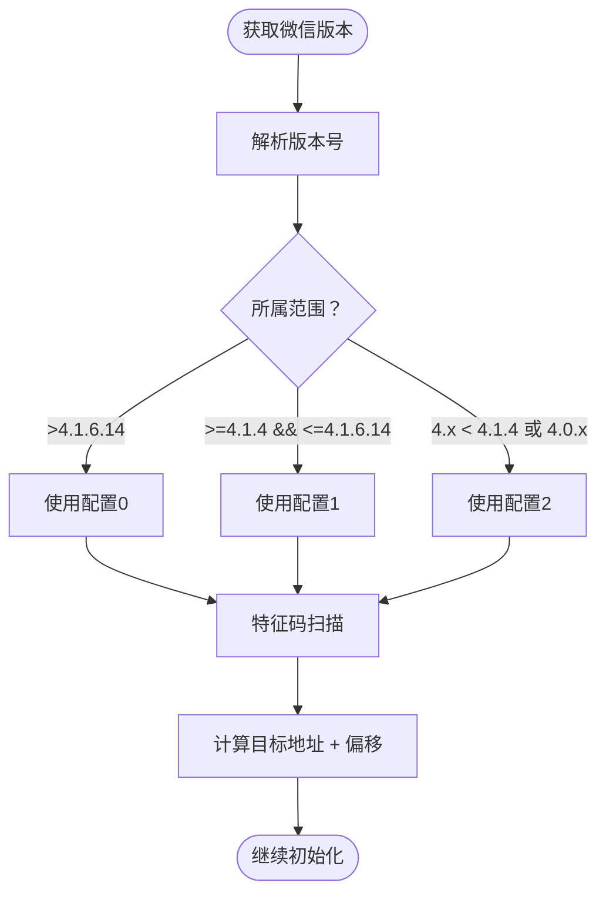
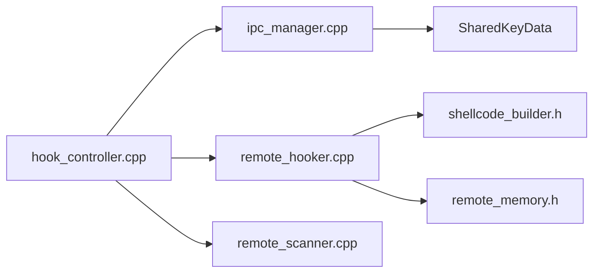

# DLL导出函数API

<cite>
**本文引用的文件**
- [dllmain.cpp](file://wx_key/dllmain.cpp)
- [hook_controller.h](file://wx_key/include/hook_controller.h)
- [hook_controller.cpp](file://wx_key/src/hook_controller.cpp)
- [ipc_manager.h](file://wx_key/include/ipc_manager.h)
- [ipc_manager.cpp](file://wx_key/src/ipc_manager.cpp)
- [remote_hooker.h](file://wx_key/include/remote_hooker.h)
- [remote_hooker.cpp](file://wx_key/src/remote_hooker.cpp)
- [remote_scanner.h](file://wx_key/include/remote_scanner.h)
- [remote_scanner.cpp](file://wx_key/src/remote_scanner.cpp)
- [shellcode_builder.h](file://wx_key/include/shellcode_builder.h)
- [remote_memory.h](file://wx_key/include/remote_memory.h)
- [dll_usage.md](file://docs/dll_usage.md)
- [README.md](file://README.md)
</cite>

## 目录
1. [简介](#简介)
2. [项目结构](#项目结构)
3. [核心组件](#核心组件)
4. [架构总览](#架构总览)
5. [详细组件分析](#详细组件分析)
6. [依赖关系分析](#依赖关系分析)
7. [性能考量](#性能考量)
8. [故障排除指南](#故障排除指南)
9. [结论](#结论)
10. [附录](#附录)

## 简介
本文件为 wx_key.dll 的导出函数 API 完整参考文档，覆盖以下导出函数的签名、参数、返回值、线程安全性、错误处理、调用顺序与生命周期管理最佳实践，并提供 C/C++、Python、.NET 的集成示例与版本兼容性说明。

- InitializeHook：初始化并安装 Hook（轮询模式）
- CleanupHook：清理并卸载 Hook
- PollKeyData：轮询获取新的密钥数据（十六进制字符串）
- GetStatusMessage：获取内部状态消息与级别
- GetLastErrorMsg：获取最后一次错误信息

## 项目结构
- DLL 入口与导出头文件位于 wx_key/include/hook_controller.h
- 导出函数实现在 wx_key/src/hook_controller.cpp
- IPC 轮询监听与共享内存结构在 wx_key/include/ipc_manager.h 与 wx_key/src/ipc_manager.cpp
- 远程 Hook 安装与 Shellcode 构建在 wx_key/include/remote_hooker.h 与 wx_key/src/remote_hooker.cpp
- 远程进程扫描与版本匹配在 wx_key/include/remote_scanner.h 与 wx_key/src/remote_scanner.cpp
- Shellcode 配置与远程内存管理在 wx_key/include/shellcode_builder.h 与 wx_key/include/remote_memory.h
- 使用指南与调用流程在 docs/dll_usage.md
- 项目背景与支持版本在 README.md

**图表来源**
- [hook_controller.cpp](file://wx_key/src/hook_controller.cpp#L414-L491)
- [hook_controller.h](file://wx_key/include/hook_controller.h#L12-L46)
- [ipc_manager.h](file://wx_key/include/ipc_manager.h#L9-L53)
- [ipc_manager.cpp](file://wx_key/src/ipc_manager.cpp#L24-L132)
- [remote_hooker.h](file://wx_key/include/remote_hooker.h#L9-L40)
- [remote_hooker.cpp](file://wx_key/src/remote_hooker.cpp#L278-L389)
- [remote_scanner.h](file://wx_key/include/remote_scanner.h#L15-L35)
- [remote_scanner.cpp](file://wx_key/src/remote_scanner.cpp#L108-L261)
- [shellcode_builder.h](file://wx_key/include/shellcode_builder.h#L8-L16)
- [remote_memory.h](file://wx_key/include/remote_memory.h#L7-L107)

**章节来源**
- [hook_controller.h](file://wx_key/include/hook_controller.h#L1-L50)
- [hook_controller.cpp](file://wx_key/src/hook_controller.cpp#L1-L491)
- [ipc_manager.h](file://wx_key/include/ipc_manager.h#L1-L80)
- [ipc_manager.cpp](file://wx_key/src/ipc_manager.cpp#L1-L273)
- [remote_hooker.h](file://wx_key/include/remote_hooker.h#L1-L73)
- [remote_hooker.cpp](file://wx_key/src/remote_hooker.cpp#L1-L419)
- [remote_scanner.h](file://wx_key/include/remote_scanner.h#L1-L70)
- [remote_scanner.cpp](file://wx_key/src/remote_scanner.cpp#L1-L261)
- [shellcode_builder.h](file://wx_key/include/shellcode_builder.h#L1-L38)
- [remote_memory.h](file://wx_key/include/remote_memory.h#L1-L107)
- [dll_usage.md](file://docs/dll_usage.md#L1-L165)
- [README.md](file://README.md#L45-L56)

## 核心组件
- 导出函数声明与宏定义：通过 HOOK_API 宏统一导出，使用 extern "C" __declspec(dllexport) 方式，便于 C/C++、.NET、Python 等多语言调用。
- IPC 轮询监听：IPCManager 在控制器进程中创建共享内存与事件，监听线程轮询远程进程缓冲区，回调触发后将密钥数据写入共享内存并递增序列号。
- 远程 Hook：RemoteHooker 在目标进程安装 Inline Hook，生成 Trampoline 与 Shellcode，拦截目标函数并将 32 字节密钥写入共享内存。
- 版本扫描：RemoteScanner 通过特征码扫描定位目标函数，支持微信 4.x 多版本，动态选择对应配置。

**章节来源**
- [hook_controller.h](file://wx_key/include/hook_controller.h#L6-L10)
- [ipc_manager.h](file://wx_key/include/ipc_manager.h#L18-L76)
- [remote_hooker.h](file://wx_key/include/remote_hooker.h#L9-L40)
- [remote_scanner.h](file://wx_key/include/remote_scanner.h#L15-L35)

## 架构总览
DLL 在宿主进程中运行，不注入目标进程。初始化阶段完成系统调用初始化、打开目标进程、版本识别、特征码扫描、远程内存分配、IPC 初始化与 Hook 安装。运行期通过 IPC 轮询获取密钥数据，提供状态消息与错误信息查询接口。

**图表来源**
- [hook_controller.cpp](file://wx_key/src/hook_controller.cpp#L214-L379)
- [ipc_manager.cpp](file://wx_key/src/ipc_manager.cpp#L212-L271)
- [remote_hooker.cpp](file://wx_key/src/remote_hooker.cpp#L278-L389)

## 详细组件分析

### 导出函数 API 参考

- 函数：InitializeHook
  - 签名：bool InitializeHook(DWORD targetPid)
  - 参数：
    - targetPid：微信进程 PID（需调用方自行获取）
  - 返回值：成功返回 true，失败返回 false
  - 作用：初始化系统调用、打开目标进程、版本识别、特征码扫描、分配远程内存、初始化 IPC、安装 Hook
  - 线程安全性：内部使用临界区保护全局上下文，多线程并发调用需外部同步
  - 错误处理：失败时可通过 GetLastErrorMsg 获取详细错误信息
  - 使用场景：首次接入时调用，成功后方可轮询密钥
  - 调用示例（C/C++）：参见“附录/调用示例”
  - 调用示例（.NET）：参见“附录/调用示例”
  - 调用示例（Python）：参见“附录/调用示例”

- 函数：CleanupHook
  - 签名：bool CleanupHook()
  - 参数：无
  - 返回值：总是返回 true（即使之前未初始化）
  - 作用：卸载 Hook、停止 IPC 监听、释放远程内存、关闭句柄、清理系统调用
  - 线程安全性：内部使用临界区保护，建议在退出前调用
  - 使用场景：程序退出或不再需要功能时调用
  - 注意：不清理可能导致残留 Shellcode 导致微信后续崩溃

- 函数：PollKeyData
  - 签名：bool PollKeyData(char* keyBuffer, int bufferSize)
  - 参数：
    - keyBuffer：输出缓冲区，至少 65 字节（64 字符十六进制 + 结束符）
    - bufferSize：缓冲区大小
  - 返回值：若有新密钥返回 true，否则返回 false
  - 作用：非阻塞轮询获取最新密钥（十六进制字符串），获取后自动清空共享缓冲
  - 线程安全性：内部使用临界区保护，建议仅在专用轮询线程调用
  - 使用场景：后台定时轮询，建议间隔约 100ms
  - 注意：每次返回后会清空缓冲，如需去重可结合序列号

- 函数：GetStatusMessage
  - 签名：bool GetStatusMessage(char* statusBuffer, int bufferSize, int* outLevel)
  - 参数：
    - statusBuffer：输出缓冲区，建议 >= 256 字节
    - bufferSize：缓冲区大小
    - outLevel：输出状态级别（0=info, 1=success, 2=error）
  - 返回值：若有新状态返回 true，否则返回 false
  - 作用：获取内部运行日志（如“扫描成功”、“特征码未找到”等）
  - 线程安全性：内部使用临界区保护，建议在专用轮询线程调用
  - 使用场景：UI 展示或调试日志采集

- 函数：GetLastErrorMsg
  - 签名：const char* GetLastErrorMsg()
  - 参数：无
  - 返回值：最近一次失败的错误信息字符串
  - 作用：错误诊断与排障
  - 线程安全性：内部使用临界区保护，建议在专用轮询线程调用

**章节来源**
- [hook_controller.h](file://wx_key/include/hook_controller.h#L12-L46)
- [hook_controller.cpp](file://wx_key/src/hook_controller.cpp#L414-L491)
- [dll_usage.md](file://docs/dll_usage.md#L21-L31)

### IPC 与共享内存
- 共享内存结构：SharedKeyData 包含 dataSize、keyBuffer[32]、sequenceNumber
- 轮询策略：IPCManager 监听线程周期性读取远程缓冲区，通过 sequenceNumber 去重，回调 OnDataReceived 将密钥转换为十六进制字符串并放入队列
- 事件与回退：优先使用 Global 命名空间，失败时回退到 Local 命名空间

**图表来源**
- [ipc_manager.cpp](file://wx_key/src/ipc_manager.cpp#L212-L271)
- [hook_controller.cpp](file://wx_key/src/hook_controller.cpp#L182-L211)

**章节来源**
- [ipc_manager.h](file://wx_key/include/ipc_manager.h#L9-L53)
- [ipc_manager.cpp](file://wx_key/src/ipc_manager.cpp#L24-L132)
- [hook_controller.cpp](file://wx_key/src/hook_controller.cpp#L182-L211)

### 远程 Hook 与 Shellcode
- Hook 类型：Inline Hook（回退方案），通过在目标函数开头写入跳转指令并生成 Trampoline 保持原函数继续执行
- Shellcode 配置：包含共享内存地址、Trampoline 地址、堆栈伪造开关与伪栈指针
- 远程内存：使用 NtAllocateVirtualMemory/NtProtectVirtualMemory 管理远程内存，确保可执行权限

**图表来源**
- [remote_hooker.h](file://wx_key/include/remote_hooker.h#L9-L40)
- [remote_hooker.cpp](file://wx_key/src/remote_hooker.cpp#L278-L389)
- [shellcode_builder.h](file://wx_key/include/shellcode_builder.h#L8-L16)

**章节来源**
- [remote_hooker.h](file://wx_key/include/remote_hooker.h#L9-L40)
- [remote_hooker.cpp](file://wx_key/src/remote_hooker.cpp#L197-L389)
- [shellcode_builder.h](file://wx_key/include/shellcode_builder.h#L8-L16)

### 版本扫描与兼容性
- 版本识别：通过读取 Weixin.dll 版本信息，解析主/次/构建/修订号
- 版本配置：根据版本范围选择对应的特征码与掩码、偏移量
- 支持范围：微信 4.0.x 及以上，已实测版本覆盖多个 4.1.x 与 4.0.x

**图表来源**
- [remote_scanner.cpp](file://wx_key/src/remote_scanner.cpp#L76-L106)
- [remote_scanner.cpp](file://wx_key/src/remote_scanner.cpp#L219-L259)

**章节来源**
- [remote_scanner.h](file://wx_key/include/remote_scanner.h#L47-L66)
- [remote_scanner.cpp](file://wx_key/src/remote_scanner.cpp#L45-L106)
- [README.md](file://README.md#L45-L56)

## 依赖关系分析
- 导出函数依赖 IPC、远程 Hook、远程扫描与系统调用封装
- IPC 依赖共享内存与事件，轮询线程与回调驱动数据流转
- Hook 依赖 ShellcodeBuilder 与远程内存管理，Trampoline 保障原函数继续执行
- 版本扫描依赖 Psapi 与版本信息查询 API

**图表来源**
- [hook_controller.cpp](file://wx_key/src/hook_controller.cpp#L11-L20)
- [ipc_manager.cpp](file://wx_key/src/ipc_manager.cpp#L1-L7)
- [remote_hooker.cpp](file://wx_key/src/remote_hooker.cpp#L1-L6)
- [remote_scanner.cpp](file://wx_key/src/remote_scanner.cpp#L1-L10)
- [shellcode_builder.h](file://wx_key/include/shellcode_builder.h#L1-L38)
- [remote_memory.h](file://wx_key/include/remote_memory.h#L1-L107)

**章节来源**
- [hook_controller.cpp](file://wx_key/src/hook_controller.cpp#L11-L20)
- [ipc_manager.cpp](file://wx_key/src/ipc_manager.cpp#L1-L7)
- [remote_hooker.cpp](file://wx_key/src/remote_hooker.cpp#L1-L6)
- [remote_scanner.cpp](file://wx_key/src/remote_scanner.cpp#L1-L10)

## 性能考量
- 轮询间隔：建议 80–143ms（含轻微抖动），避免稳定频率特征与过度 CPU 占用
- 缓冲区大小：密钥十六进制字符串 + 结束符至少 65 字节；状态消息建议 >= 256 字节
- 线程模型：仅在专用轮询线程调用导出函数，避免 UI 线程阻塞
- 去重策略：基于 sequenceNumber 去重，避免重复处理同一密钥

[本节为通用指导，无需列出具体文件来源]

## 故障排除指南
- 权限不足：以管理员身份运行宿主进程；必要时提升权限
- 微信版本不支持：特征码库需更新对应版本；更新 DLL 源码并重新编译
- 缓冲区溢出：确保 PollKeyData 的缓冲区大小 >= 65，GetStatusMessage >= 256
- 单例原则：同一微信进程仅允许一次 Hook；如需重启，先 CleanupHook 再 InitializeHook
- 日志前缀：GetStatusMessage 返回字符串不含前缀，UI 层可按 outLevel 自行添加
- 共享内存命名：Global 命名空间失败时回退到 Local 命名空间

**章节来源**
- [dll_usage.md](file://docs/dll_usage.md#L135-L165)
- [ipc_manager.cpp](file://wx_key/src/ipc_manager.cpp#L113-L132)

## 结论
本 DLL 提供稳定、可轮询的微信密钥获取能力，通过 Inline Hook 与共享内存实现跨进程数据传输。遵循推荐的调用顺序与生命周期管理，可在多语言环境中可靠集成。版本兼容性依赖特征码库维护，建议定期更新以适配新版本微信。

[本节为总结性内容，无需列出具体文件来源]

## 附录

### 调用顺序与生命周期管理最佳实践
- 定位进程：获取 Weixin.exe 的 PID（调用方负责）
- 加载 DLL：将 wx_key.dll 加载到当前进程空间
- 初始化：调用 InitializeHook(pid)，失败立即打印 GetLastErrorMsg
- 轮询：启动后台线程或定时器，循环调用 PollKeyData 与 GetStatusMessage
- 清理：程序退出前调用 CleanupHook，确保资源完全释放

**章节来源**
- [dll_usage.md](file://docs/dll_usage.md#L35-L59)

### C/C++ 调用示例（参考路径）
- 初始化与轮询：参见 [hook_controller.cpp](file://wx_key/src/hook_controller.cpp#L414-L491)
- 导出函数声明：参见 [hook_controller.h](file://wx_key/include/hook_controller.h#L12-L46)

### Python 调用示例（参考路径）
- 使用 ctypes 加载 DLL 并调用导出函数：
  - 参考 [dll_usage.md](file://docs/dll_usage.md#L62-L131) 中的 C# 示例风格，将 P/Invoke 映射改为 ctypes
  - 导出函数签名与调用方式与 C/C++ 一致

### .NET（C#/P/Invoke）调用示例（参考路径）
- 参见 [dll_usage.md](file://docs/dll_usage.md#L62-L131) 中的 C# 示例，包含：
  - DllImport 声明
  - StringBuilder 缓冲区
  - 异步轮询与清理

### 版本兼容性与向后兼容性
- 支持范围：微信 4.0.x 及以上，已实测版本覆盖多个 4.1.x 与 4.0.x
- 版本识别：通过 Weixin.dll 版本信息动态选择特征码配置
- 向后兼容：更新 DLL 源码中的特征码库并重新编译，无需修改上层调用代码

**章节来源**
- [README.md](file://README.md#L45-L56)
- [remote_scanner.cpp](file://wx_key/src/remote_scanner.cpp#L45-L106)

### 线程安全性与异常情况
- 线程安全：导出函数内部使用临界区保护全局上下文；建议仅在专用轮询线程调用
- 异常情况：
  - 未初始化调用：PollKeyData/GetStatusMessage 返回 false
  - 缓冲区过小：返回 false，避免缓冲区溢出
  - 权限不足/版本不支持：InitializeHook 返回 false，可通过 GetLastErrorMsg 获取详细信息

**章节来源**
- [hook_controller.cpp](file://wx_key/src/hook_controller.cpp#L428-L491)
- [dll_usage.md](file://docs/dll_usage.md#L135-L165)