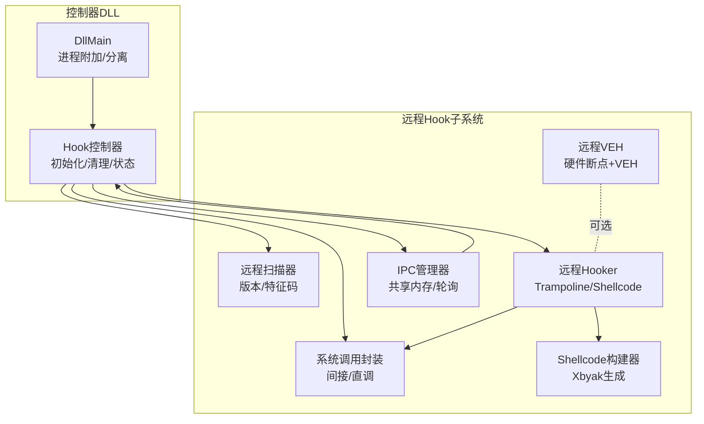
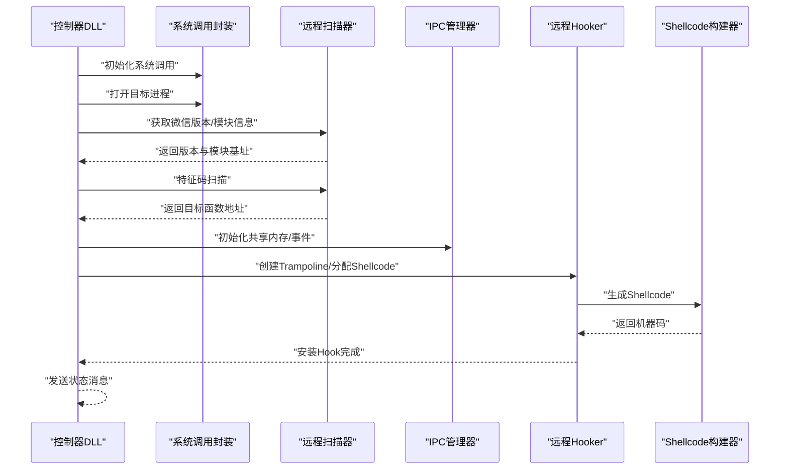
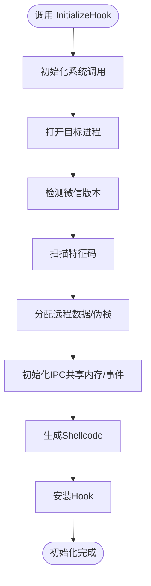
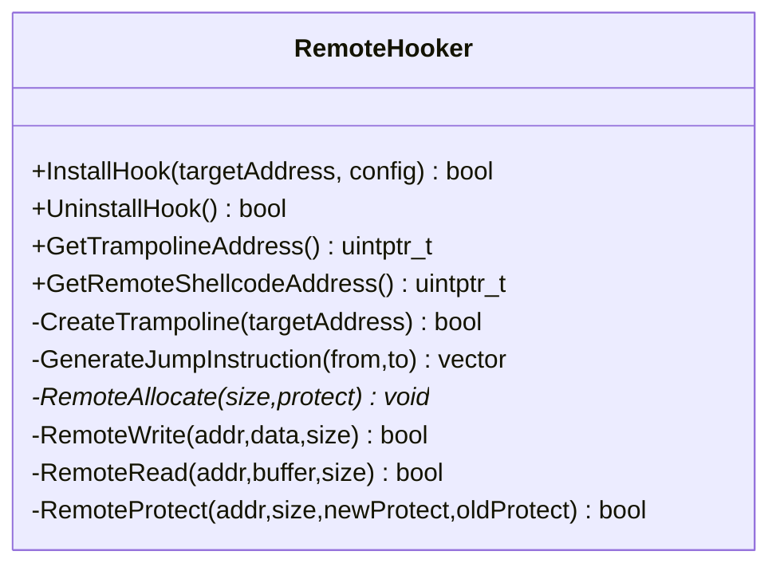
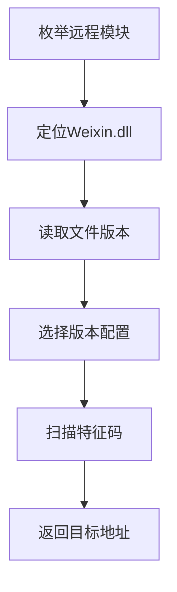
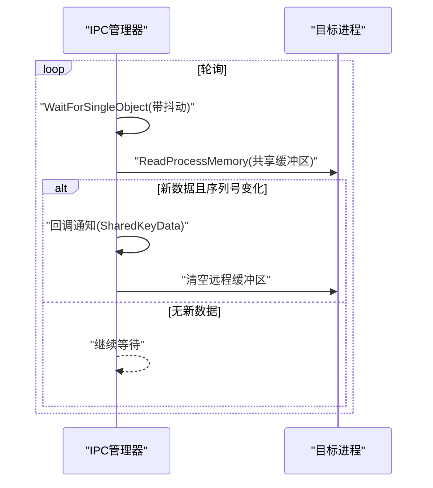
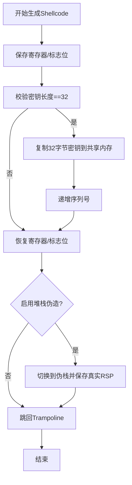
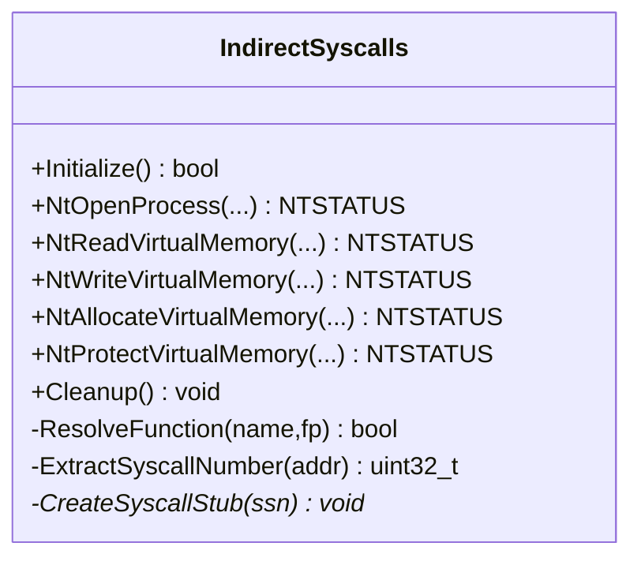
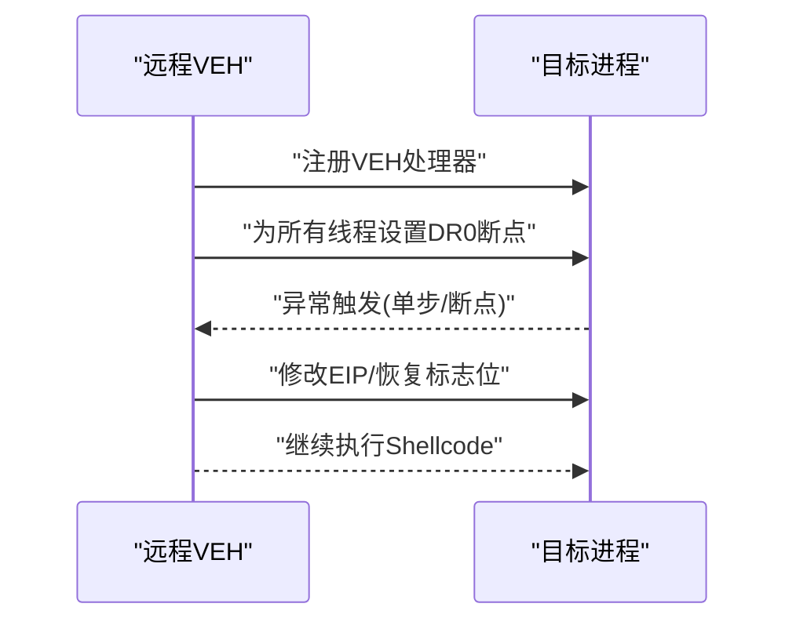
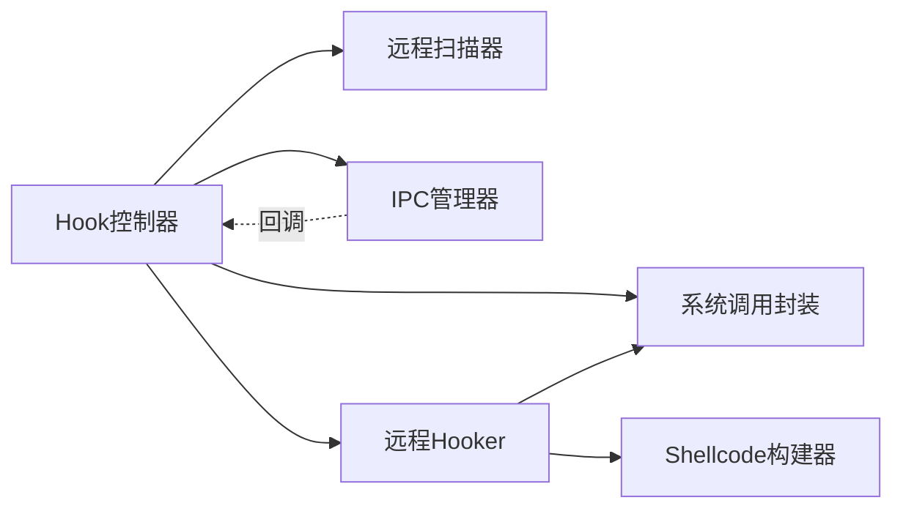

# DLL注入与Hook管理

<cite>
**本文档引用的文件**
- [dllmain.cpp](file://wx_key/dllmain.cpp)
- [hook_controller.cpp](file://wx_key/src/hook_controller.cpp)
- [hook_controller.h](file://wx_key/include/hook_controller.h)
- [remote_hooker.cpp](file://wx_key/src/remote_hooker.cpp)
- [remote_hooker.h](file://wx_key/include/remote_hooker.h)
- [remote_scanner.cpp](file://wx_key/src/remote_scanner.cpp)
- [remote_scanner.h](file://wx_key/include/remote_scanner.h)
- [ipc_manager.cpp](file://wx_key/src/ipc_manager.cpp)
- [ipc_manager.h](file://wx_key/include/ipc_manager.h)
- [shellcode_builder.cpp](file://wx_key/src/shellcode_builder.cpp)
- [shellcode_builder.h](file://wx_key/include/shellcode_builder.h)
- [syscalls.cpp](file://wx_key/src/syscalls.cpp)
- [syscalls.h](file://wx_key/include/syscalls.h)
- [remote_veh.cpp](file://wx_key/src/remote_veh.cpp)
- [remote_veh.h](file://wx_key/include/remote_veh.h)
</cite>

## 目录
1. [简介](#简介)
2. [项目结构](#项目结构)
3. [核心组件](#核心组件)
4. [架构总览](#架构总览)
5. [详细组件分析](#详细组件分析)
6. [依赖关系分析](#依赖关系分析)
7. [性能考量](#性能考量)
8. [故障排除指南](#故障排除指南)
9. [结论](#结论)
10. [附录](#附录)

## 简介
本项目是一个针对微信（WeChat）的DLL注入与Hook管理框架，能够在目标进程中安装远程Hook，捕获密钥数据并通过共享内存与轮询机制回传至控制器进程。系统采用“控制器DLL + 远程Hook + Shellcode”的组合方式，支持多版本微信的特征码扫描与适配，并提供状态消息、错误报告与资源清理能力。

## 项目结构
- 控制器DLL入口位于 [dllmain.cpp](file://wx_key/dllmain.cpp)，负责在进程附加/分离时进行基本初始化与资源清理。
- 核心逻辑集中在 [hook_controller.cpp](file://wx_key/src/hook_controller.cpp) 中，封装了进程打开、版本检测、特征码扫描、远程内存分配、IPC初始化、Hook安装与状态管理。
- 远程Hook实现位于 [remote_hooker.cpp](file://wx_key/src/remote_hooker.cpp)，负责在目标进程内创建Trampoline、生成并写入Shellcode、设置跳转补丁。
- 远程扫描与版本适配在 [remote_scanner.cpp](file://wx_key/src/remote_scanner.cpp) 中，支持按版本选择不同特征码与偏移。
- IPC轮询在 [ipc_manager.cpp](file://wx_key/src/ipc_manager.cpp) 中，通过共享内存与事件实现跨进程数据传输。
- Shellcode生成在 [shellcode_builder.cpp](file://wx_key/src/shellcode_builder.cpp)，使用Xbyak动态生成x64机器码。
- 系统调用封装在 [syscalls.cpp](file://wx_key/src/syscalls.cpp)，提供间接调用与直调stub。
- VEH远程安装在 [remote_veh.cpp](file://wx_key/src/remote_veh.cpp)，用于硬件断点+VEH模式（当前默认禁用）。

**图表来源**
- [dllmain.cpp](file://wx_key/dllmain.cpp#L12-L24)
- [hook_controller.cpp](file://wx_key/src/hook_controller.cpp#L214-L379)
- [remote_hooker.cpp](file://wx_key/src/remote_hooker.cpp#L278-L389)
- [remote_scanner.cpp](file://wx_key/src/remote_scanner.cpp#L109-L259)
- [ipc_manager.cpp](file://wx_key/src/ipc_manager.cpp#L24-L132)
- [shellcode_builder.cpp](file://wx_key/src/shellcode_builder.cpp#L28-L150)
- [syscalls.cpp](file://wx_key/src/syscalls.cpp#L92-L117)
- [remote_veh.cpp](file://wx_key/src/remote_veh.cpp#L238-L268)

**章节来源**
- [dllmain.cpp](file://wx_key/dllmain.cpp#L12-L24)
- [hook_controller.cpp](file://wx_key/src/hook_controller.cpp#L214-L379)

## 核心组件
- Hook控制器（导出函数）
  - InitializeHook：初始化并安装Hook（轮询模式）
  - PollKeyData：轮询获取新密钥数据（十六进制字符串）
  - GetStatusMessage：获取状态消息与级别
  - CleanupHook：清理并卸载Hook
  - GetLastErrorMsg：获取最后错误信息
- 远程Hooker：创建Trampoline、生成Shellcode、写入补丁、保护内存
- 远程扫描器：枚举模块、特征码扫描、版本解析与配置选择
- IPC管理器：共享内存/事件创建、监听线程、轮询读取
- Shellcode构建器：基于配置生成x64机器码
- 系统调用封装：间接调用与直调stub
- 远程VEH：可选的硬件断点+VEH模式

**章节来源**
- [hook_controller.h](file://wx_key/include/hook_controller.h#L12-L46)
- [hook_controller.cpp](file://wx_key/src/hook_controller.cpp#L414-L491)
- [remote_hooker.h](file://wx_key/include/remote_hooker.h#L9-L40)
- [remote_scanner.h](file://wx_key/include/remote_scanner.h#L15-L35)
- [ipc_manager.h](file://wx_key/include/ipc_manager.h#L18-L53)
- [shellcode_builder.h](file://wx_key/include/shellcode_builder.h#L8-L25)
- [syscalls.h](file://wx_key/include/syscalls.h#L95-L156)
- [remote_veh.h](file://wx_key/include/remote_veh.h#L8-L26)

## 架构总览
系统采用“控制器DLL + 远程Hook + Shellcode”的分层设计：
- 控制器DLL在目标进程上下文中运行，负责初始化Hook、分配远程内存、建立IPC通道、安装Hook并维护状态。
- 远程Hooker在目标进程内创建Trampoline与Shellcode，将密钥数据写入共享内存并递增序列号，随后跳回原始函数继续执行。
- IPC管理器在控制器侧启动监听线程，周期性轮询远程共享缓冲区，避免稳定频率特征。
- 系统调用封装提供间接与直调两种方式，增强抗检测能力。
- 远程VEH为可选方案，通过硬件断点触发异常并修改EIP，但当前默认禁用。

**图表来源**
- [hook_controller.cpp](file://wx_key/src/hook_controller.cpp#L225-L379)
- [remote_scanner.cpp](file://wx_key/src/remote_scanner.cpp#L119-L259)
- [ipc_manager.cpp](file://wx_key/src/ipc_manager.cpp#L24-L132)
- [remote_hooker.cpp](file://wx_key/src/remote_hooker.cpp#L278-L389)
- [shellcode_builder.cpp](file://wx_key/src/shellcode_builder.cpp#L28-L150)
- [syscalls.cpp](file://wx_key/src/syscalls.cpp#L92-L117)

## 详细组件分析

### Hook控制器（导出函数）
- InitializeHook
  - 参数：目标进程PID
  - 行为：初始化系统调用、打开进程、检测版本、扫描特征码、分配远程数据与伪栈、初始化IPC、安装Hook
  - 返回：成功/失败
- PollKeyData
  - 参数：输出缓冲区、缓冲区大小
  - 行为：非阻塞轮询，若存在新密钥则拷贝十六进制字符串
  - 返回：有新数据返回true
- GetStatusMessage
  - 参数：输出缓冲区、缓冲区大小、输出级别指针
  - 行为：返回最近状态消息与级别（0=信息，1=成功，2=错误）
  - 返回：有新消息返回true
- CleanupHook
  - 行为：卸载Hook、停止IPC、释放远程内存、关闭句柄
  - 返回：总是成功
- GetLastErrorMsg
  - 行为：返回最后一次错误描述
  - 返回：C风格字符串

**图表来源**
- [hook_controller.cpp](file://wx_key/src/hook_controller.cpp#L214-L379)

**章节来源**
- [hook_controller.h](file://wx_key/include/hook_controller.h#L12-L46)
- [hook_controller.cpp](file://wx_key/src/hook_controller.cpp#L414-L491)

### 远程Hooker（远程补丁与Trampoline）
- 主要职责
  - 读取目标函数前若干字节，创建Trampoline并写回原始指令与回跳指令
  - 在目标进程分配Shellcode内存，写入机器码并设置可执行权限
  - 生成跳转指令（短跳转或长跳转），写入目标函数开头，恢复保护
  - 提供卸载接口，恢复原始指令并释放内存
- 关键流程
  - 计算需要备份的指令长度（反汇编辅助）
  - 创建Trampoline并保护为可执行
  - 生成Shellcode并写入目标进程
  - 写入Hook跳转并保护目标区域

**图表来源**
- [remote_hooker.h](file://wx_key/include/remote_hooker.h#L9-L70)
- [remote_hooker.cpp](file://wx_key/src/remote_hooker.cpp#L97-L419)

**章节来源**
- [remote_hooker.h](file://wx_key/include/remote_hooker.h#L9-L70)
- [remote_hooker.cpp](file://wx_key/src/remote_hooker.cpp#L182-L389)

### 远程扫描器（版本与特征码）
- 主要职责
  - 枚举远程进程模块，定位Weixin.dll
  - 读取模块版本信息（文件版本）
  - 基于版本选择对应特征码与偏移，扫描目标函数地址
- 版本配置
  - 通过VersionConfigManager根据版本字符串选择配置
  - 支持多版本范围与掩码匹配

**图表来源**
- [remote_scanner.cpp](file://wx_key/src/remote_scanner.cpp#L119-L259)
- [remote_scanner.h](file://wx_key/include/remote_scanner.h#L46-L66)

**章节来源**
- [remote_scanner.cpp](file://wx_key/src/remote_scanner.cpp#L119-L259)
- [remote_scanner.h](file://wx_key/include/remote_scanner.h#L46-L66)

### IPC管理器（轮询模式）
- 主要职责
  - 创建全局/本地共享内存与事件，避免命名冲突
  - 启动监听线程，周期性轮询远程共享缓冲区
  - 通过序列号判断新数据，回调通知控制器
  - 清理时停止监听、解除映射、关闭句柄
- 轮询策略
  - 加入轻微抖动，避免稳定轮询间隔
  - 读取后清空远程缓冲区，防止重复消费

**图表来源**
- [ipc_manager.cpp](file://wx_key/src/ipc_manager.cpp#L206-L271)
- [ipc_manager.h](file://wx_key/include/ipc_manager.h#L9-L16)

**章节来源**
- [ipc_manager.cpp](file://wx_key/src/ipc_manager.cpp#L24-L271)
- [ipc_manager.h](file://wx_key/include/ipc_manager.h#L9-L76)

### Shellcode构建器（Xbyak生成）
- 主要职责
  - 根据配置生成x64机器码：保存寄存器、校验密钥长度、复制密钥到共享内存、递增序列号、跳回Trampoline
  - 可选堆栈伪造：切换到对齐的伪栈，保存真实RSP，恢复后回到原栈
- 关键点
  - 使用Xbyak动态生成，减少手工编码风险
  - 严格遵循x64调用约定与ABI

**图表来源**
- [shellcode_builder.cpp](file://wx_key/src/shellcode_builder.cpp#L28-L150)
- [shellcode_builder.h](file://wx_key/include/shellcode_builder.h#L8-L35)

**章节来源**
- [shellcode_builder.cpp](file://wx_key/src/shellcode_builder.cpp#L28-L150)
- [shellcode_builder.h](file://wx_key/include/shellcode_builder.h#L8-L35)

### 系统调用封装（间接与直调）
- 主要职责
  - 动态解析ntdll函数地址，封装常用Nt系列调用
  - 从ntdll stub提取SSN，构建直调stub，降低检测
- 适用场景
  - 进程打开、内存读写、内存保护、分配/释放

**图表来源**
- [syscalls.h](file://wx_key/include/syscalls.h#L95-L185)
- [syscalls.cpp](file://wx_key/src/syscalls.cpp#L92-L278)

**章节来源**
- [syscalls.h](file://wx_key/include/syscalls.h#L95-L185)
- [syscalls.cpp](file://wx_key/src/syscalls.cpp#L92-L278)

### 远程VEH（可选硬件断点+VEH）
- 主要职责
  - 在目标进程注册VEH异常处理器，为所有线程设置硬件断点
  - 触发异常时修改EIP并恢复，配合Shellcode执行
- 当前状态
  - 默认禁用，使用稳定的Inline Hook

**图表来源**
- [remote_veh.cpp](file://wx_key/src/remote_veh.cpp#L238-L268)
- [remote_veh.h](file://wx_key/include/remote_veh.h#L8-L26)

**章节来源**
- [remote_veh.cpp](file://wx_key/src/remote_veh.cpp#L238-L268)
- [remote_veh.h](file://wx_key/include/remote_veh.h#L8-L26)

## 依赖关系分析
- 组件耦合
  - Hook控制器依赖系统调用封装、远程扫描器、IPC管理器、远程Hooker与Shellcode构建器
  - 远程Hooker依赖系统调用封装与Shellcode构建器
  - IPC管理器与Hook控制器通过共享内存交互
- 外部依赖
  - Windows API（Psapi、version、kernel32等）
  - Xbyak用于机器码生成
- 潜在循环依赖
  - 无直接循环；各模块职责清晰，通过接口解耦

**图表来源**
- [hook_controller.cpp](file://wx_key/src/hook_controller.cpp#L11-L21)
- [remote_hooker.cpp](file://wx_key/src/remote_hooker.cpp#L1-L6)
- [shellcode_builder.cpp](file://wx_key/src/shellcode_builder.cpp#L1-L4)
- [ipc_manager.cpp](file://wx_key/src/ipc_manager.cpp#L1-L6)

**章节来源**
- [hook_controller.cpp](file://wx_key/src/hook_controller.cpp#L11-L21)
- [remote_hooker.cpp](file://wx_key/src/remote_hooker.cpp#L1-L6)
- [shellcode_builder.cpp](file://wx_key/src/shellcode_builder.cpp#L1-L4)
- [ipc_manager.cpp](file://wx_key/src/ipc_manager.cpp#L1-L6)

## 性能考量
- 内存扫描
  - 分块读取（1MB）与本地匹配，减少系统调用次数
- 轮询IPC
  - 加入抖动，避免稳定频率特征，降低CPU占用
- Hook安装
  - 仅写入必要的跳转指令，保留原始指令到Trampoline
- Shellcode
  - 使用rep movsb高效复制密钥，减少循环开销
- 抗检测
  - 间接系统调用与直调stub结合，降低API拦截概率

[本节为通用指导，无需特定文件分析]

## 故障排除指南
- 初始化失败
  - 检查系统调用初始化是否成功
  - 确认目标进程PID有效且进程存在
  - 查看版本检测结果与特征码匹配数量
- 进程打开失败
  - 确认权限足够（进程访问令牌）
  - 检查进程是否已退出
- 版本不支持
  - 当前支持范围：4.0.x及以上4.x版本
  - 若版本不在支持列表，需更新配置或降级
- Hook安装失败
  - 检查目标函数地址与备份长度
  - 确认内存保护设置与写入权限
- IPC轮询无数据
  - 检查共享内存/事件名称是否一致
  - 确认序列号变化与远程缓冲区清空逻辑
- 清理异常
  - 确保按顺序卸载Hook、停止IPC、释放远程内存
  - 检查句柄是否被提前关闭

**章节来源**
- [hook_controller.cpp](file://wx_key/src/hook_controller.cpp#L225-L379)
- [remote_scanner.cpp](file://wx_key/src/remote_scanner.cpp#L258-L259)
- [ipc_manager.cpp](file://wx_key/src/ipc_manager.cpp#L206-L271)
- [remote_hooker.cpp](file://wx_key/src/remote_hooker.cpp#L391-L417)

## 结论
该系统通过“控制器DLL + 远程Hook + Shellcode”的组合，在目标进程内稳定捕获密钥数据，并通过共享内存与轮询机制回传至控制器。其设计注重可维护性与可扩展性，支持多版本微信适配与抗检测策略。建议在生产环境中结合安全审计与合规审查，谨慎使用。

[本节为总结，无需特定文件分析]

## 附录

### DLL导出函数说明
- InitializeHook
  - 参数：DWORD targetPid（目标进程PID）
  - 返回：bool（成功/失败）
  - 作用：初始化系统调用、打开进程、版本检测、特征码扫描、分配远程内存、初始化IPC、安装Hook
- PollKeyData
  - 参数：char* keyBuffer（输出缓冲区）、int bufferSize（缓冲区大小）
  - 返回：bool（有新数据返回true）
  - 作用：非阻塞轮询获取十六进制密钥字符串（至少65字节）
- GetStatusMessage
  - 参数：char* statusBuffer（输出缓冲区）、int bufferSize（缓冲区大小）、int* outLevel（输出级别）
  - 返回：bool（有新消息返回true）
  - 作用：获取状态消息与级别（0=信息，1=成功，2=错误）
- CleanupHook
  - 参数：无
  - 返回：bool（成功/失败）
  - 作用：卸载Hook、停止IPC、释放远程内存、关闭句柄
- GetLastErrorMsg
  - 参数：无
  - 返回：const char*（最后错误描述）

**章节来源**
- [hook_controller.h](file://wx_key/include/hook_controller.h#L12-L46)
- [hook_controller.cpp](file://wx_key/src/hook_controller.cpp#L414-L491)