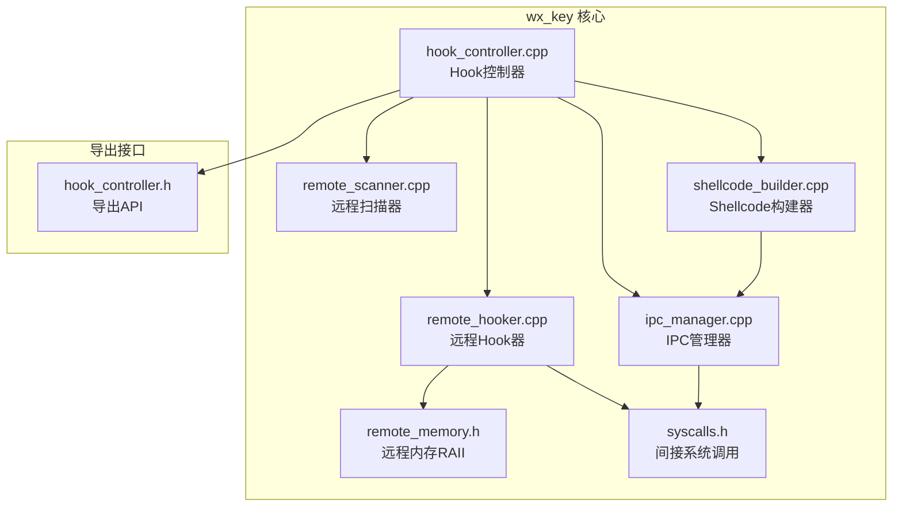
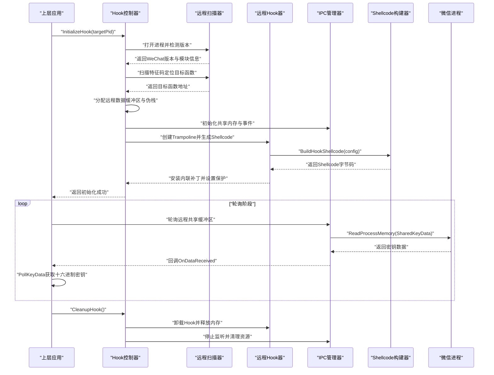
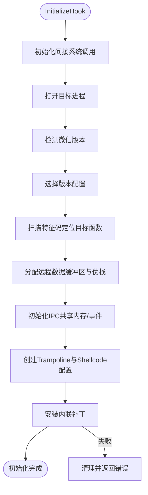
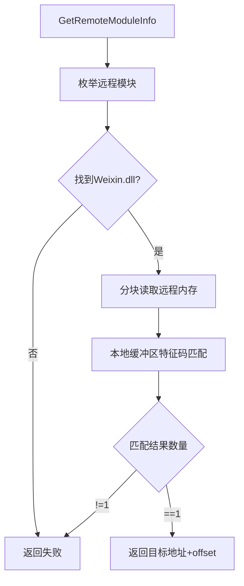
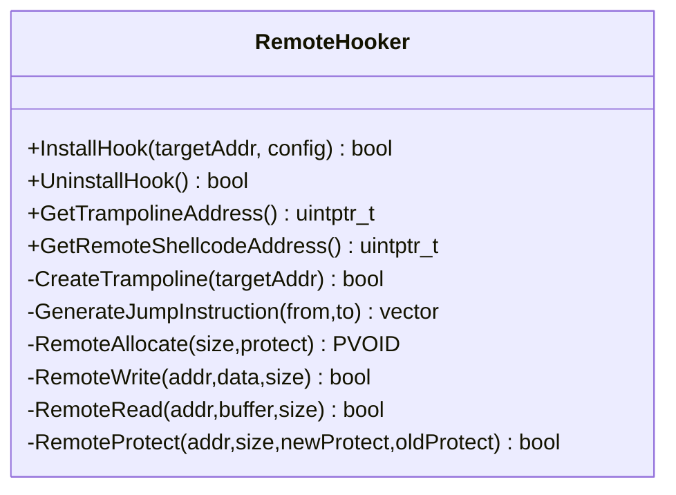
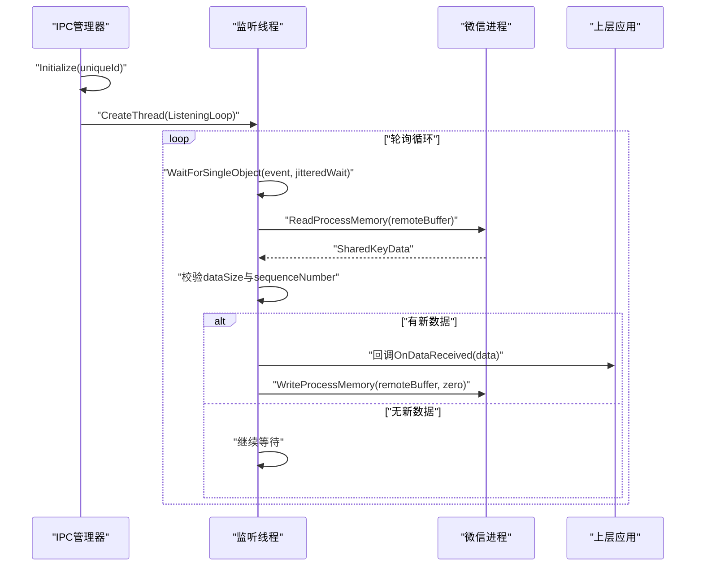
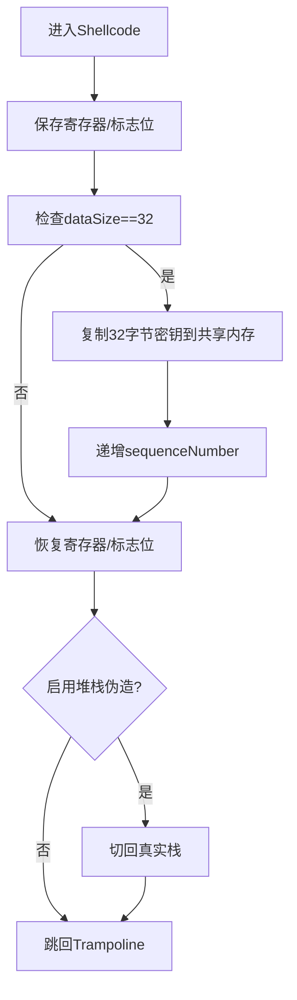
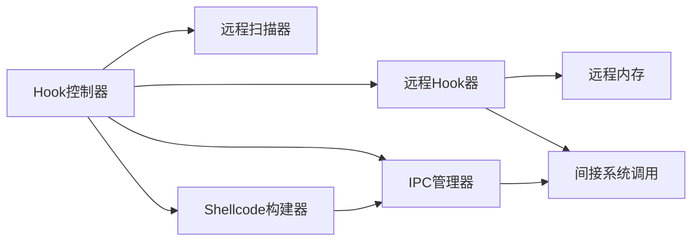

# DLL注入原理与实现

<cite>
**本文档引用的文件**
- [dllmain.cpp](file://wx_key/dllmain.cpp)
- [hook_controller.cpp](file://wx_key/src/hook_controller.cpp)
- [hook_controller.h](file://wx_key/include/hook_controller.h)
- [remote_hooker.cpp](file://wx_key/src/remote_hooker.cpp)
- [remote_hooker.h](file://wx_key/include/remote_hooker.h)
- [remote_scanner.cpp](file://wx_key/src/remote_scanner.cpp)
- [remote_scanner.h](file://wx_key/include/remote_scanner.h)
- [ipc_manager.cpp](file://wx_key/src/ipc_manager.cpp)
- [ipc_manager.h](file://wx_key/include/ipc_manager.h)
- [shellcode_builder.cpp](file://wx_key/src/shellcode_builder.cpp)
- [shellcode_builder.h](file://wx_key/include/shellcode_builder.h)
- [remote_memory.h](file://wx_key/include/remote_memory.h)
- [syscalls.h](file://wx_key/include/syscalls.h)
- [dll_usage.md](file://docs/dll_usage.md)
</cite>

## 目录
1. [简介](#简介)
2. [项目结构](#项目结构)
3. [核心组件](#核心组件)
4. [架构总览](#架构总览)
5. [详细组件分析](#详细组件分析)
6. [依赖关系分析](#依赖关系分析)
7. [性能考量](#性能考量)
8. [故障排查指南](#故障排查指南)
9. [结论](#结论)
10. [附录](#附录)

## 简介
本文件面向希望理解并实现Windows进程注入与远程Hook的开发者，结合wx_key项目的源码，系统阐述以下内容：
- Windows进程注入与远程Hook的基本原理：进程间通信、内存映射、模块加载与控制流劫持
- 注入策略与实现细节：远程线程注入、APC注入、进程替代等方法的适用场景与局限
- wx_key项目采用的注入策略：基于特征码扫描定位目标函数、内联补丁与Shellcode Hook、共享内存轮询通信
- 关键实现步骤：进程句柄获取、远程内存分配、Shellcode生成与写入、Trampoline回跳、IPC轮询
- 安全考虑、权限要求与兼容性说明

## 项目结构
wx_key项目采用分层设计，核心位于wx_key目录下的C++实现，配合文档与示例，形成可复用的DLL注入与Hook框架。

**图表来源**
- [hook_controller.cpp](file://wx_key/src/hook_controller.cpp#L1-L491)
- [remote_scanner.cpp](file://wx_key/src/remote_scanner.cpp#L1-L261)
- [remote_hooker.cpp](file://wx_key/src/remote_hooker.cpp#L1-L419)
- [ipc_manager.cpp](file://wx_key/src/ipc_manager.cpp#L1-L273)
- [shellcode_builder.cpp](file://wx_key/src/shellcode_builder.cpp#L1-L151)
- [remote_memory.h](file://wx_key/include/remote_memory.h#L1-L107)
- [syscalls.h](file://wx_key/include/syscalls.h#L1-L189)
- [hook_controller.h](file://wx_key/include/hook_controller.h#L1-L50)

**章节来源**
- [hook_controller.cpp](file://wx_key/src/hook_controller.cpp#L1-L491)
- [hook_controller.h](file://wx_key/include/hook_controller.h#L1-L50)

## 核心组件
- Hook控制器：负责初始化上下文、打开目标进程、版本检测、特征码扫描、远程内存分配、IPC初始化、安装Hook以及状态与错误上报
- 远程扫描器：枚举远程模块、读取远程内存、特征码匹配、版本解析与配置选择
- 远程Hook器：计算目标指令长度、生成Trampoline、分配与写入Shellcode、设置内存保护、安装/卸载内联补丁
- IPC管理器：创建共享内存与事件、启动轮询监听线程、从远程进程读取共享缓冲区并回调上层
- Shellcode构建器：使用Xbyak生成x64汇编，实现密钥拷贝、序列号递增与回跳Trampoline
- 远程内存：基于NtAllocateVirtualMemory/NtProtectVirtualMemory的RAII封装
- 间接系统调用：动态解析ntdll函数、封装常用Nt系列API，降低API指纹特征

**章节来源**
- [hook_controller.cpp](file://wx_key/src/hook_controller.cpp#L214-L379)
- [remote_scanner.cpp](file://wx_key/src/remote_scanner.cpp#L108-L261)
- [remote_hooker.cpp](file://wx_key/src/remote_hooker.cpp#L97-L419)
- [ipc_manager.cpp](file://wx_key/src/ipc_manager.cpp#L8-L273)
- [shellcode_builder.cpp](file://wx_key/src/shellcode_builder.cpp#L28-L151)
- [remote_memory.h](file://wx_key/include/remote_memory.h#L7-L107)
- [syscalls.h](file://wx_key/include/syscalls.h#L95-L189)

## 架构总览
下图展示wx_key从初始化到密钥轮询的完整流程，涵盖进程句柄获取、内存扫描、Hook安装与IPC通信。

**图表来源**
- [hook_controller.cpp](file://wx_key/src/hook_controller.cpp#L214-L379)
- [remote_scanner.cpp](file://wx_key/src/remote_scanner.cpp#L158-L204)
- [remote_hooker.cpp](file://wx_key/src/remote_hooker.cpp#L278-L389)
- [ipc_manager.cpp](file://wx_key/src/ipc_manager.cpp#L206-L271)
- [shellcode_builder.cpp](file://wx_key/src/shellcode_builder.cpp#L28-L151)

## 详细组件分析

### Hook控制器（进程句柄获取、内存分配与Hook安装）
Hook控制器是整个系统的协调者，负责：
- 初始化间接系统调用
- 打开目标进程（NtOpenProcess）
- 版本检测与配置选择
- 特征码扫描定位目标函数
- 分配远程数据缓冲区与伪栈
- 初始化IPC并设置回调
- 创建RemoteHooker并安装Hook
- 提供轮询接口与状态/错误查询

**图表来源**
- [hook_controller.cpp](file://wx_key/src/hook_controller.cpp#L214-L379)

**章节来源**
- [hook_controller.cpp](file://wx_key/src/hook_controller.cpp#L214-L379)
- [hook_controller.h](file://wx_key/include/hook_controller.h#L12-L46)

### 远程扫描器（特征码匹配与版本解析）
远程扫描器负责：
- 枚举远程进程模块并获取基址与大小
- 分块读取远程内存（1MB块）
- 在本地缓冲区中进行特征码匹配
- 解析微信版本并选择对应配置
- 读取远程模块路径并查询文件版本信息

**图表来源**
- [remote_scanner.cpp](file://wx_key/src/remote_scanner.cpp#L119-L204)
- [remote_scanner.h](file://wx_key/include/remote_scanner.h#L16-L44)

**章节来源**
- [remote_scanner.cpp](file://wx_key/src/remote_scanner.cpp#L108-L261)
- [remote_scanner.h](file://wx_key/include/remote_scanner.h#L15-L70)

### 远程Hook器（内联补丁与Trampoline）
远程Hook器负责：
- 计算目标指令长度（反汇编辅助）
- 读取原始指令并创建Trampoline
- 分配Shellcode内存并写入
- 设置内存保护（RW/RX）
- 生成跳转指令并写入目标函数（内联补丁）
- 支持卸载时恢复原始指令

**图表来源**
- [remote_hooker.cpp](file://wx_key/src/remote_hooker.cpp#L97-L419)
- [remote_hooker.h](file://wx_key/include/remote_hooker.h#L9-L73)

**章节来源**
- [remote_hooker.cpp](file://wx_key/src/remote_hooker.cpp#L182-L389)
- [remote_hooker.h](file://wx_key/include/remote_hooker.h#L9-L73)

### IPC管理器（共享内存轮询）
IPC管理器负责：
- 生成唯一标识并创建共享内存与事件（优先Global命名，失败回退Local）
- 启动监听线程，周期性轮询远程共享缓冲区
- 通过序列号去重，回调上层数据接收
- 提供清理接口，释放共享内存与事件句柄

**图表来源**
- [ipc_manager.cpp](file://wx_key/src/ipc_manager.cpp#L206-L271)
- [ipc_manager.h](file://wx_key/include/ipc_manager.h#L18-L76)

**章节来源**
- [ipc_manager.cpp](file://wx_key/src/ipc_manager.cpp#L24-L132)
- [ipc_manager.cpp](file://wx_key/src/ipc_manager.cpp#L206-L271)
- [ipc_manager.h](file://wx_key/include/ipc_manager.h#L18-L80)

### Shellcode构建器（x64汇编与回跳）
Shellcode构建器使用Xbyak生成x64汇编，实现：
- 保存/恢复寄存器与标志位
- 检查密钥长度（32字节）
- 将密钥复制到共享内存
- 递增序列号
- 可选堆栈伪造（切换到伪栈，回跳Trampoline）

**图表来源**
- [shellcode_builder.cpp](file://wx_key/src/shellcode_builder.cpp#L28-L151)
- [shellcode_builder.h](file://wx_key/include/shellcode_builder.h#L8-L35)

**章节来源**
- [shellcode_builder.cpp](file://wx_key/src/shellcode_builder.cpp#L28-L151)
- [shellcode_builder.h](file://wx_key/include/shellcode_builder.h#L8-L38)

### 远程内存与间接系统调用
- 远程内存：基于NtAllocateVirtualMemory/NtProtectVirtualMemory的RAII封装，自动释放
- 间接系统调用：动态解析ntdll函数，封装常用Nt系列API，降低API指纹特征

**章节来源**
- [remote_memory.h](file://wx_key/include/remote_memory.h#L7-L107)
- [syscalls.h](file://wx_key/include/syscalls.h#L95-L189)

## 依赖关系分析
- Hook控制器依赖远程扫描器、远程Hook器、IPC管理器、Shellcode构建器与远程内存
- 远程Hook器依赖远程内存与间接系统调用
- IPC管理器依赖间接系统调用与共享内存结构
- Shellcode构建器依赖IPC共享内存布局

**图表来源**
- [hook_controller.cpp](file://wx_key/src/hook_controller.cpp#L1-L491)
- [remote_hooker.cpp](file://wx_key/src/remote_hooker.cpp#L1-L419)
- [ipc_manager.cpp](file://wx_key/src/ipc_manager.cpp#L1-L273)
- [shellcode_builder.cpp](file://wx_key/src/shellcode_builder.cpp#L1-L151)
- [remote_memory.h](file://wx_key/include/remote_memory.h#L1-L107)
- [syscalls.h](file://wx_key/include/syscalls.h#L1-L189)

**章节来源**
- [hook_controller.cpp](file://wx_key/src/hook_controller.cpp#L1-L491)

## 性能考量
- 特征码扫描采用1MB分块读取，减少系统调用次数与内存压力
- IPC轮询加入轻微抖动（80-143ms），平衡响应性与CPU占用
- Shellcode仅在dataSize==32时执行拷贝，避免无效操作
- 远程内存分配与保护使用Nt系列API，减少调试器与防病毒软件触发

[本节为通用性能讨论，不直接分析具体文件]

## 故障排查指南
- 权限不足：以管理员身份运行，确保PROCESS_ALL_ACCESS与MEM_*权限
- 版本不支持：微信版本不在支持范围内或特征码偏移变化
- 进程不存在：目标PID对应的进程已退出
- 内存访问失败：远程进程内存保护或地址无效
- IPC初始化失败：共享内存/事件创建失败，检查命名冲突与权限
- Hook安装失败：目标指令长度计算失败或写入补丁失败

**章节来源**
- [hook_controller.cpp](file://wx_key/src/hook_controller.cpp#L225-L256)
- [hook_controller.cpp](file://wx_key/src/hook_controller.cpp#L284-L306)
- [ipc_manager.cpp](file://wx_key/src/ipc_manager.cpp#L113-L132)
- [remote_hooker.cpp](file://wx_key/src/remote_hooker.cpp#L358-L388)

## 结论
wx_key项目通过“特征码扫描 + 内联补丁 + Shellcode + 共享内存轮询”的组合，实现了稳定、可控且可维护的微信密钥获取方案。其关键优势在于：
- 明确的职责分离与模块化设计
- 健壮的错误处理与资源清理
- 适配多版本微信的特征码配置管理
- 低侵入性的Hook策略与可恢复的补丁机制

[本节为总结性内容，不直接分析具体文件]

## 附录

### DLL入口与导出API
- DLL入口：在DLL_PROCESS_ATTACH时禁用库调用线程化，在DLL_PROCESS_DETACH时清理Hook
- 导出API：InitializeHook、PollKeyData、GetStatusMessage、CleanupHook、GetLastErrorMsg

**章节来源**
- [dllmain.cpp](file://wx_key/dllmain.cpp#L11-L24)
- [hook_controller.h](file://wx_key/include/hook_controller.h#L12-L46)

### 注入策略与实现要点
- 远程线程注入：通过NtOpenProcess获取句柄，使用NtAllocateVirtualMemory/NtWriteVirtualMemory写入Shellcode，最后通过内联补丁跳转
- APC注入：适合特定线程上下文，需配合QueueUserAPC与目标线程状态
- 进程替代：通过CreateProcess替换目标进程，适用于需要完全接管的场景
- wx_key采用远程线程注入与内联补丁策略，具备稳定性与可控性

[本节为概念性说明，不直接分析具体文件]

### 安全考虑与权限要求
- 需要管理员权限以满足PROCESS_ALL_ACCESS与MEM_*权限
- 仅支持x64系统与64位微信客户端
- 程序退出前必须调用CleanupHook，避免残留Hook导致崩溃
- IPC命名采用唯一ID与随机后缀，降低可预测性

**章节来源**
- [dll_usage.md](file://docs/dll_usage.md#L15-L18)
- [hook_controller.cpp](file://wx_key/src/hook_controller.cpp#L376-L378)
- [ipc_manager.cpp](file://wx_key/src/ipc_manager.cpp#L24-L50)