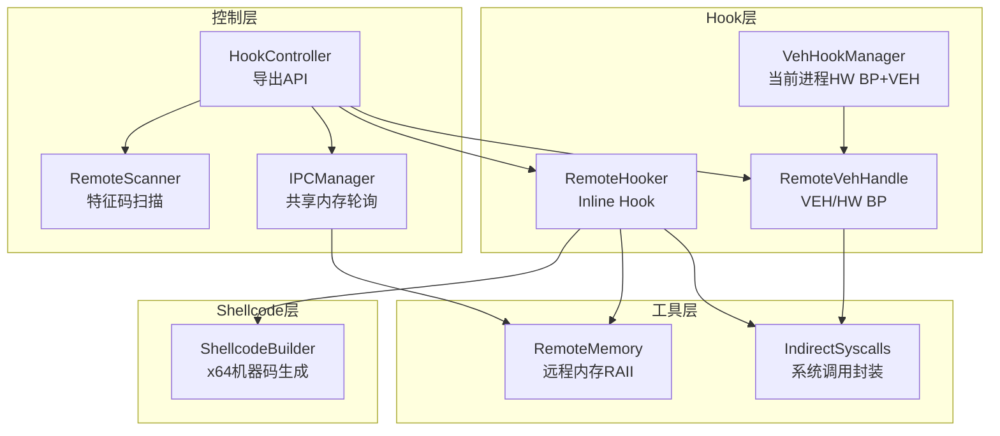
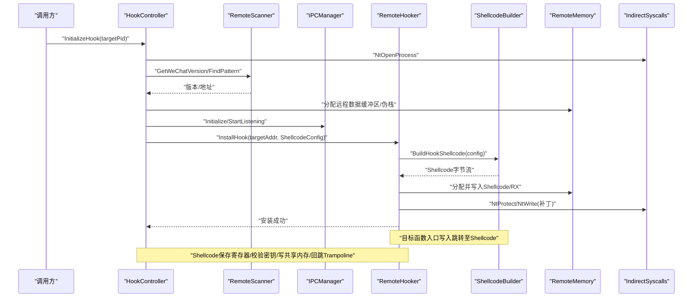
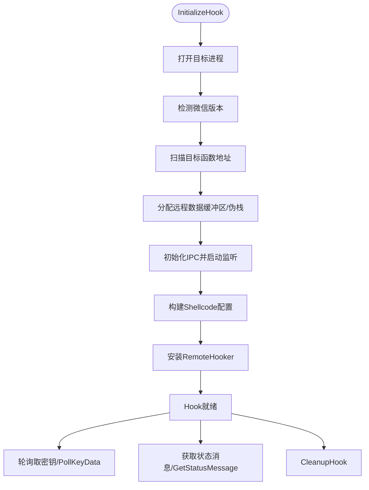
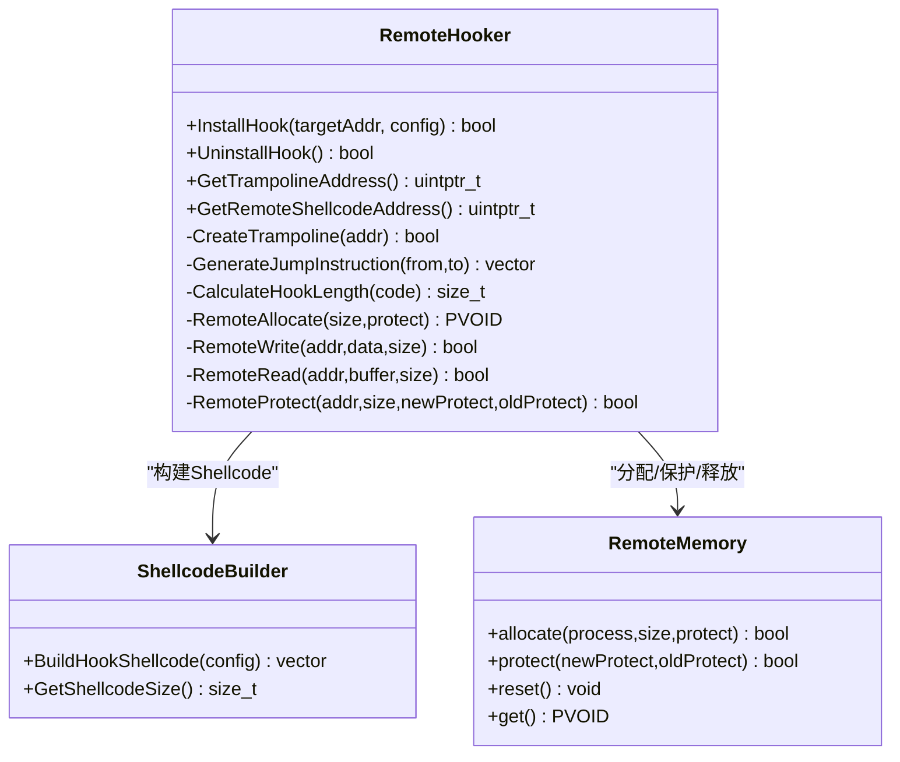
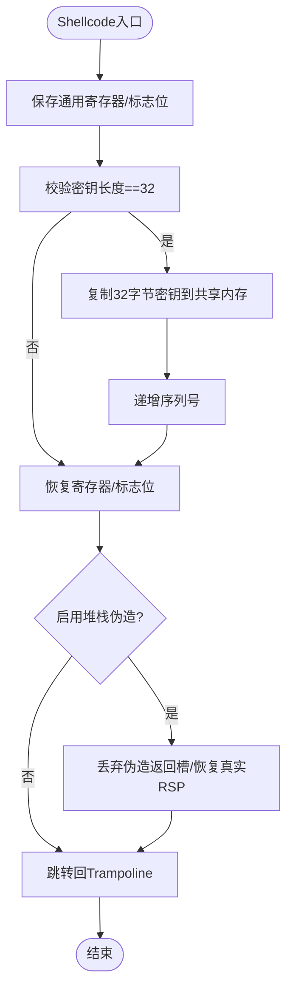
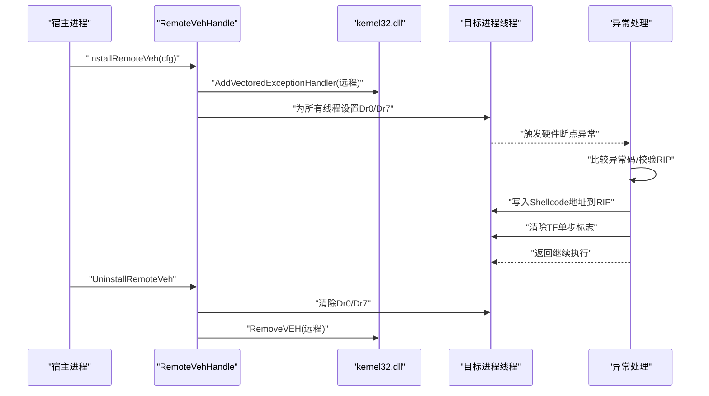
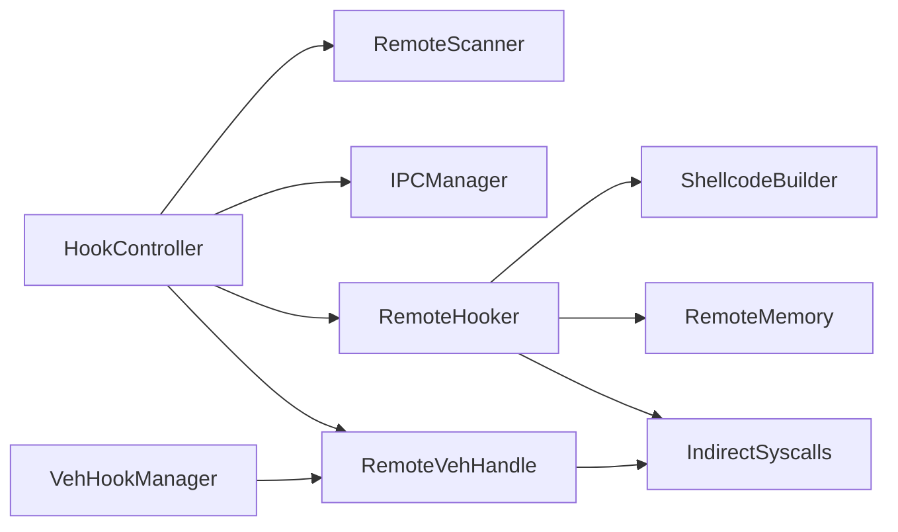
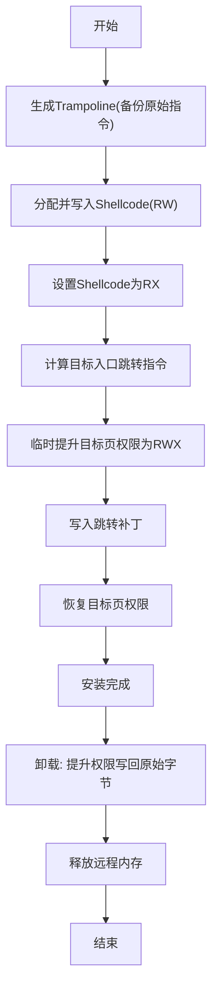
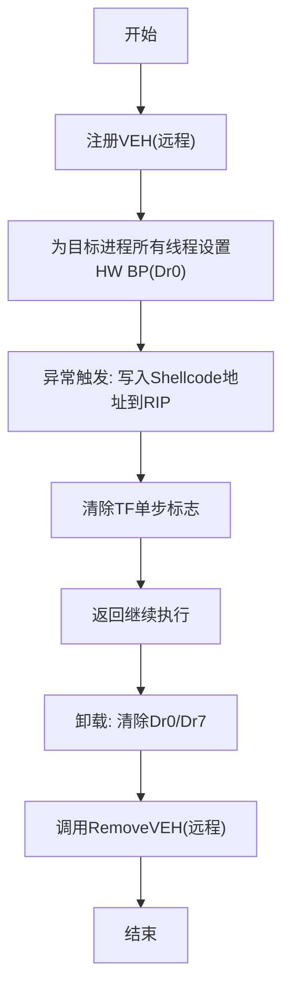

# Hook技术详解

<cite>
**本文引用的文件**
- [dllmain.cpp](file://wx_key/dllmain.cpp)
- [hook_controller.h](file://wx_key/include/hook_controller.h)
- [hook_controller.cpp](file://wx_key/src/hook_controller.cpp)
- [remote_hooker.h](file://wx_key/include/remote_hooker.h)
- [remote_hooker.cpp](file://wx_key/src/remote_hooker.cpp)
- [shellcode_builder.h](file://wx_key/include/shellcode_builder.h)
- [shellcode_builder.cpp](file://wx_key/src/shellcode_builder.cpp)
- [veh_hook_manager.h](file://wx_key/include/veh_hook_manager.h)
- [remote_veh.h](file://wx_key/include/remote_veh.h)
- [remote_veh.cpp](file://wx_key/src/remote_veh.cpp)
- [remote_scanner.h](file://wx_key/include/remote_scanner.h)
- [ipc_manager.h](file://wx_key/include/ipc_manager.h)
- [remote_memory.h](file://wx_key/include/remote_memory.h)
- [syscalls.h](file://wx_key/include/syscalls.h)
- [syscalls.cpp](file://wx_key/src/syscalls.cpp)
</cite>

## 目录
1. [引言](#引言)
2. [项目结构](#项目结构)
3. [核心组件](#核心组件)
4. [架构总览](#架构总览)
5. [详细组件分析](#详细组件分析)
6. [依赖关系分析](#依赖关系分析)
7. [性能考量](#性能考量)
8. [故障排查指南](#故障排查指南)
9. [结论](#结论)
10. [附录](#附录)

## 引言
本技术文档围绕微信密钥Hook方案，系统阐述远程Hook与本地Hook的差异、Inline Hook与VEH/HW BP混合策略、Shellcode构建与参数/返回值处理、内存保护修改与恢复机制、以及性能与调试要点。文档以实际代码为依据，提供可追溯的章节来源与图示，帮助读者快速理解并安全地应用这些技术。

## 项目结构
该项目采用分层设计：
- 控制层：导出API接口，负责上下文初始化、扫描定位、Hook安装与数据轮询
- Hook层：远程Inline Hook与VEH/HW BP混合Hook的实现
- Shellcode层：在目标进程内执行的跳板代码，负责数据采集与回跳
- 通信层：通过共享内存+轮询实现跨进程数据传递
- 工具层：远程内存管理、系统调用封装、特征码扫描、VEH/HW BP工具

**图表来源**
- [hook_controller.cpp](file://wx_key/src/hook_controller.cpp#L214-L379)
- [remote_hooker.cpp](file://wx_key/src/remote_hooker.cpp#L278-L389)
- [shellcode_builder.cpp](file://wx_key/src/shellcode_builder.cpp#L28-L150)
- [remote_veh.cpp](file://wx_key/src/remote_veh.cpp#L238-L268)
- [veh_hook_manager.h](file://wx_key/include/veh_hook_manager.h#L10-L30)
- [remote_scanner.h](file://wx_key/include/remote_scanner.h#L16-L44)
- [ipc_manager.h](file://wx_key/include/ipc_manager.h#L19-L76)
- [remote_memory.h](file://wx_key/include/remote_memory.h#L8-L104)
- [syscalls.h](file://wx_key/include/syscalls.h#L96-L185)

**章节来源**
- [hook_controller.cpp](file://wx_key/src/hook_controller.cpp#L214-L379)
- [remote_hooker.cpp](file://wx_key/src/remote_hooker.cpp#L278-L389)
- [shellcode_builder.cpp](file://wx_key/src/shellcode_builder.cpp#L28-L150)
- [remote_veh.cpp](file://wx_key/src/remote_veh.cpp#L238-L268)
- [veh_hook_manager.h](file://wx_key/include/veh_hook_manager.h#L10-L30)
- [remote_scanner.h](file://wx_key/include/remote_scanner.h#L16-L44)
- [ipc_manager.h](file://wx_key/include/ipc_manager.h#L19-L76)
- [remote_memory.h](file://wx_key/include/remote_memory.h#L8-L104)
- [syscalls.h](file://wx_key/include/syscalls.h#L96-L185)

## 核心组件
- Hook控制器：对外提供初始化、轮询取数、状态查询、清理等API；负责版本检测、特征码扫描、远程内存分配、IPC初始化、Hook安装与卸载
- 远程Hook器：实现Inline Hook，含Trampoline生成、目标函数补丁写入、内存保护修改与恢复
- Shellcode构建器：基于xbyak生成x64机器码，负责保存/恢复寄存器、校验密钥长度、拷贝密钥到共享内存、递增序列号、回跳Trampoline
- VEH/HW BP工具：在远程进程注册VEH并为所有线程设置硬件断点，配合异常处理触发Shellcode
- 通信管理器：共享内存+轮询，避免事件同步复杂度，降低Hook稳定性风险
- 远程内存管理：封装NtAllocate/NtProtect等，提供RAII语义
- 系统调用封装：动态解析ntdll函数、提取SSN构建syscall stub，规避EDR检测

**章节来源**
- [hook_controller.h](file://wx_key/include/hook_controller.h#L12-L46)
- [hook_controller.cpp](file://wx_key/src/hook_controller.cpp#L415-L491)
- [remote_hooker.h](file://wx_key/include/remote_hooker.h#L9-L70)
- [remote_hooker.cpp](file://wx_key/src/remote_hooker.cpp#L278-L389)
- [shellcode_builder.h](file://wx_key/include/shellcode_builder.h#L8-L34)
- [shellcode_builder.cpp](file://wx_key/src/shellcode_builder.cpp#L28-L150)
- [remote_veh.h](file://wx_key/include/remote_veh.h#L8-L26)
- [remote_veh.cpp](file://wx_key/src/remote_veh.cpp#L238-L268)
- [ipc_manager.h](file://wx_key/include/ipc_manager.h#L19-L76)
- [remote_memory.h](file://wx_key/include/remote_memory.h#L8-L104)
- [syscalls.h](file://wx_key/include/syscalls.h#L96-L185)

## 架构总览
下图展示从Hook控制器到各子系统的交互流程，包括版本检测、特征码扫描、远程内存分配、IPC初始化、Inline Hook安装、Shellcode执行与回跳、VEH/HW BP路径等。

**图表来源**
- [hook_controller.cpp](file://wx_key/src/hook_controller.cpp#L214-L379)
- [remote_hooker.cpp](file://wx_key/src/remote_hooker.cpp#L278-L389)
- [shellcode_builder.cpp](file://wx_key/src/shellcode_builder.cpp#L28-L150)
- [remote_veh.cpp](file://wx_key/src/remote_veh.cpp#L238-L268)
- [ipc_manager.h](file://wx_key/include/ipc_manager.h#L24-L46)
- [remote_memory.h](file://wx_key/include/remote_memory.h#L34-L85)
- [syscalls.h](file://wx_key/include/syscalls.h#L124-L155)

## 详细组件分析

### 组件A：Hook控制器（HookController）
- 职责：统一初始化流程、版本检测、特征码扫描、远程内存与IPC初始化、Hook安装、轮询取数、状态上报、清理
- 关键流程：
  - 打开目标进程并进行系统调用封装初始化
  - 扫描WeChat模块并定位目标函数地址
  - 分配远程共享数据缓冲区与伪栈
  - 初始化IPC并启动监听线程（轮询模式）
  - 配置Shellcode参数并安装RemoteHooker
  - 提供PollKeyData与GetStatusMessage等API

**图表来源**
- [hook_controller.cpp](file://wx_key/src/hook_controller.cpp#L214-L379)
- [hook_controller.h](file://wx_key/include/hook_controller.h#L12-L46)

**章节来源**
- [hook_controller.h](file://wx_key/include/hook_controller.h#L12-L46)
- [hook_controller.cpp](file://wx_key/src/hook_controller.cpp#L415-L491)

### 组件B：远程Hook器（RemoteHooker）与Inline Hook
- 职责：在目标进程内安装Inline Hook，生成Trampoline，写入跳转补丁，管理内存保护
- 关键点：
  - 反汇编长度估算，确保至少覆盖14字节以容纳长跳转
  - 读取原始指令，分配Trampoline并写回原始指令+回跳
  - 生成Shellcode并分配到目标进程，设置RX权限
  - 计算目标函数入口处的跳转指令（短跳转rel8或长跳转mov+rax+jmp）
  - 修改目标页保护为RWX写入补丁，再恢复旧保护，保证原子性
  - 卸载时恢复原始字节并释放远程内存

**图表来源**
- [remote_hooker.h](file://wx_key/include/remote_hooker.h#L9-L70)
- [remote_hooker.cpp](file://wx_key/src/remote_hooker.cpp#L278-L389)
- [shellcode_builder.h](file://wx_key/include/shellcode_builder.h#L18-L34)
- [remote_memory.h](file://wx_key/include/remote_memory.h#L8-L104)

**章节来源**
- [remote_hooker.h](file://wx_key/include/remote_hooker.h#L9-L70)
- [remote_hooker.cpp](file://wx_key/src/remote_hooker.cpp#L182-L389)

### 组件C：Shellcode构建器（ShellcodeBuilder）
- 职责：生成x64机器码，保存/恢复寄存器，校验密钥长度，拷贝密钥到共享内存，递增序列号，最后跳回Trampoline
- 关键点：
  - 支持堆栈伪造：切换到对齐的伪栈，保留真实RSP，构造返回槽位，再恢复
  - 使用rep movsb高效复制32字节密钥
  - 通过SharedKeyData结构访问dataSize/keyBuffer/sequenceNumber字段偏移
  - 最终通过寄存器跳转回Trampoline，保证原函数逻辑继续执行

**图表来源**
- [shellcode_builder.cpp](file://wx_key/src/shellcode_builder.cpp#L28-L150)
- [ipc_manager.h](file://wx_key/include/ipc_manager.h#L10-L16)

**章节来源**
- [shellcode_builder.h](file://wx_key/include/shellcode_builder.h#L8-L34)
- [shellcode_builder.cpp](file://wx_key/src/shellcode_builder.cpp#L28-L150)

### 组件D：VEH/HW BP混合Hook（RemoteVehHandle/VehHookManager）
- 职责：在远程进程注册VEH并为所有线程设置硬件断点，异常发生时写入Shellcode地址到RIP并清除单步标志，随后返回继续执行
- 关键点：
  - 通过枚举线程为Dr0设置目标地址，Dr7启用硬件断点
  - 注册VEH后执行远程代码，写入目标地址与Shellcode地址，再写回RIP并清除TF标志
  - 卸载时清除所有线程断点并通过unregister stub调用RemoveVEH

**图表来源**
- [remote_veh.cpp](file://wx_key/src/remote_veh.cpp#L238-L268)
- [remote_veh.h](file://wx_key/include/remote_veh.h#L25-L26)
- [veh_hook_manager.h](file://wx_key/include/veh_hook_manager.h#L10-L30)

**章节来源**
- [remote_veh.h](file://wx_key/include/remote_veh.h#L8-L26)
- [remote_veh.cpp](file://wx_key/src/remote_veh.cpp#L29-L89)
- [remote_veh.cpp](file://wx_key/src/remote_veh.cpp#L120-L235)
- [remote_veh.cpp](file://wx_key/src/remote_veh.cpp#L238-L268)
- [veh_hook_manager.h](file://wx_key/include/veh_hook_manager.h#L10-L30)

### 组件E：远程内存管理（RemoteMemory）
- 职责：封装NtAllocateVirtualMemory/NtProtectVirtualMemory，提供RAII语义，自动释放
- 关键点：支持移动构造/赋值，防止重复释放；提供protect便捷方法

**章节来源**
- [remote_memory.h](file://wx_key/include/remote_memory.h#L8-L104)

### 组件F：系统调用封装（IndirectSyscalls）
- 职责：动态解析ntdll函数，提取SSN并生成syscall stub，统一调用入口
- 关键点：优先使用原始ntdll以规避被修补的stub；支持回退到常规GetProcAddress

**章节来源**
- [syscalls.h](file://wx_key/include/syscalls.h#L96-L185)
- [syscalls.cpp](file://wx_key/src/syscalls.cpp#L92-L122)
- [syscalls.cpp](file://wx_key/src/syscalls.cpp#L235-L276)

### 组件G：特征码扫描与版本管理（RemoteScanner）
- 职责：扫描WeChat模块，按版本配置匹配特征码，返回目标函数地址
- 关键点：支持单次与多次匹配，提供本地缓冲批量化读取

**章节来源**
- [remote_scanner.h](file://wx_key/include/remote_scanner.h#L16-L66)

### 组件H：IPC通信（IPCManager）
- 职责：在宿主进程与目标进程间建立共享内存，轮询读取共享数据，回调通知
- 关键点：轮询模式替代事件同步，降低Hook稳定性风险；提供序列号避免重复消费

**章节来源**
- [ipc_manager.h](file://wx_key/include/ipc_manager.h#L19-L76)

## 依赖关系分析
- Hook控制器依赖RemoteScanner、IPCManager、RemoteHooker、ShellcodeBuilder、RemoteMemory、IndirectSyscalls
- RemoteHooker依赖ShellcodeBuilder、RemoteMemory、IndirectSyscalls
- ShellcodeBuilder依赖IPC共享结构定义
- RemoteVehHandle依赖IndirectSyscalls与kernel32远程函数
- VehHookManager为当前进程HW BP+VEH，作为备用策略

**图表来源**
- [hook_controller.cpp](file://wx_key/src/hook_controller.cpp#L11-L20)
- [remote_hooker.cpp](file://wx_key/src/remote_hooker.cpp#L1-L6)
- [shellcode_builder.cpp](file://wx_key/src/shellcode_builder.cpp#L1-L4)
- [remote_veh.cpp](file://wx_key/src/remote_veh.cpp#L1-L11)
- [veh_hook_manager.h](file://wx_key/include/veh_hook_manager.h#L10-L30)

**章节来源**
- [hook_controller.cpp](file://wx_key/src/hook_controller.cpp#L11-L20)
- [remote_hooker.cpp](file://wx_key/src/remote_hooker.cpp#L1-L6)
- [shellcode_builder.cpp](file://wx_key/src/shellcode_builder.cpp#L1-L4)
- [remote_veh.cpp](file://wx_key/src/remote_veh.cpp#L1-L11)
- [veh_hook_manager.h](file://wx_key/include/veh_hook_manager.h#L10-L30)

## 性能考量
- 内存保护修改：仅在写入补丁时临时提升权限，写入后立即恢复，减少RW窗口
- 机器码体积：Inline Hook至少14字节，建议选择连续指令边界，避免跨指令截断
- Shellcode效率：使用rep movsb复制固定长度密钥，减少循环开销
- IPC轮询：轮询频率与缓冲区大小需平衡延迟与CPU占用
- 系统调用封装：syscall stub减少API调用链路，降低拦截概率
- VEH/HW BP：异常路径仅在命中断点时触发，正常执行路径无额外开销

[本节为通用性能讨论，无需列出具体文件来源]

## 故障排查指南
- 初始化失败
  - 检查目标进程打开权限与PID有效性
  - 查看系统调用封装初始化状态与错误码
- 版本不支持
  - 确认微信版本是否在支持范围内，核对版本配置表
- 特征码匹配失败
  - 确认模块加载基址与掩码匹配，必要时调整pattern/mask
- Hook安装失败
  - 检查目标页保护修改与写入返回值
  - 核对Trampoline生成长度与原始指令备份
- Shellcode未生效
  - 确认共享内存地址与事件句柄配置
  - 检查堆栈伪造是否启用及伪栈对齐
- IPC无法取数
  - 检查共享内存映射与轮询线程状态
  - 核对序列号增长与回调触发

**章节来源**
- [hook_controller.cpp](file://wx_key/src/hook_controller.cpp#L225-L232)
- [hook_controller.cpp](file://wx_key/src/hook_controller.cpp#L252-L256)
- [hook_controller.cpp](file://wx_key/src/hook_controller.cpp#L276-L281)
- [hook_controller.cpp](file://wx_key/src/hook_controller.cpp#L294-L306)
- [remote_hooker.cpp](file://wx_key/src/remote_hooker.cpp#L359-L388)
- [remote_hooker.cpp](file://wx_key/src/remote_hooker.cpp#L400-L416)
- [ipc_manager.h](file://wx_key/include/ipc_manager.h#L36-L75)

## 结论
该方案以RemoteHooker为核心，结合Shellcode与IPC轮询，实现了稳定可靠的远程Hook。Inline Hook提供高兼容性，VEH/HW BP作为备用路径增强鲁棒性。通过系统调用封装与堆栈伪造等手段，兼顾了隐蔽性与性能。建议在生产环境中严格遵循内存保护原子性写入、Trampoline完整性与IPC一致性原则，并持续维护版本配置表以适配新版本微信。

[本节为总结性内容，无需列出具体文件来源]

## 附录

### Hook安装与卸载流程（Inline Hook）

**图表来源**
- [remote_hooker.cpp](file://wx_key/src/remote_hooker.cpp#L278-L389)
- [remote_hooker.cpp](file://wx_key/src/remote_hooker.cpp#L391-L417)

### Hook安装与卸载流程（VEH/HW BP）

**图表来源**
- [remote_veh.cpp](file://wx_key/src/remote_veh.cpp#L238-L268)
- [remote_veh.cpp](file://wx_key/src/remote_veh.cpp#L270-L283)

### API导出与生命周期
- 导出API：InitializeHook、PollKeyData、GetStatusMessage、CleanupHook、GetLastErrorMsg
- 生命周期：DLL入口在进程附加时禁用库线程调用，在进程分离时自动清理

**章节来源**
- [hook_controller.h](file://wx_key/include/hook_controller.h#L12-L46)
- [dllmain.cpp](file://wx_key/dllmain.cpp#L11-L23)