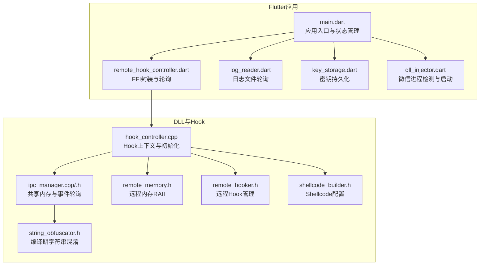
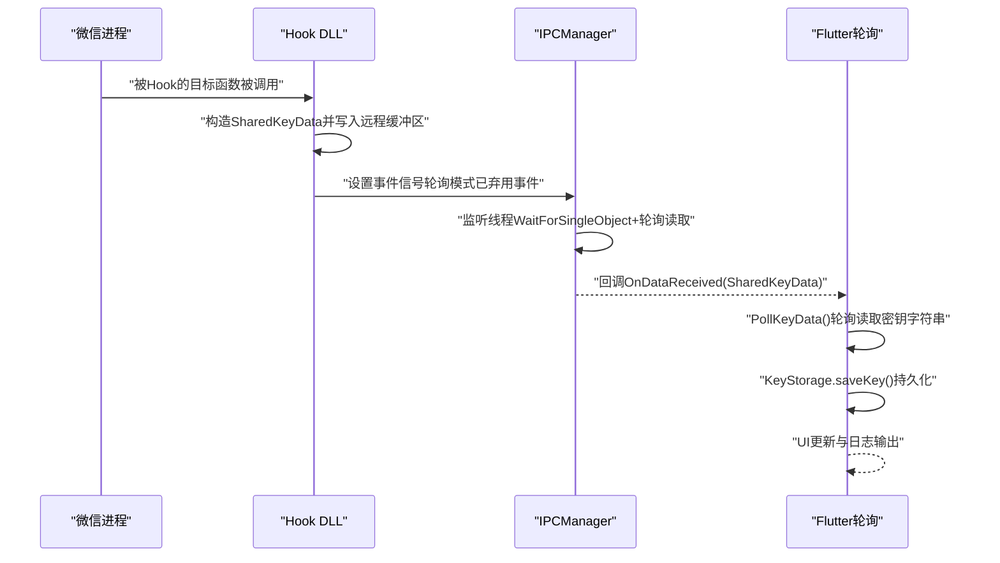
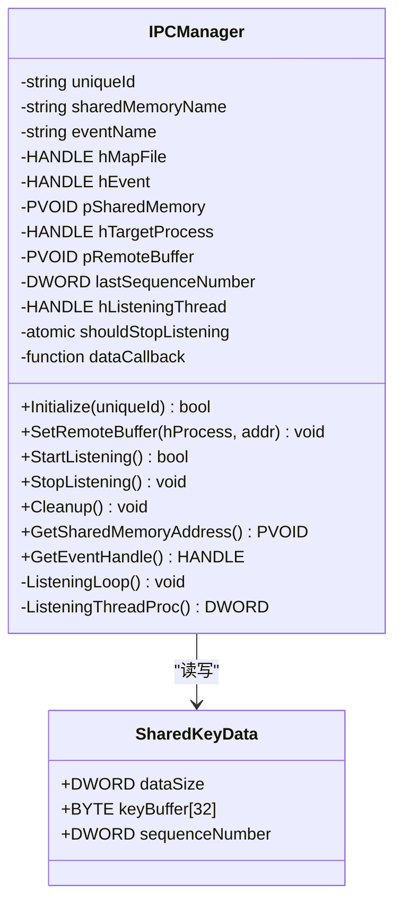
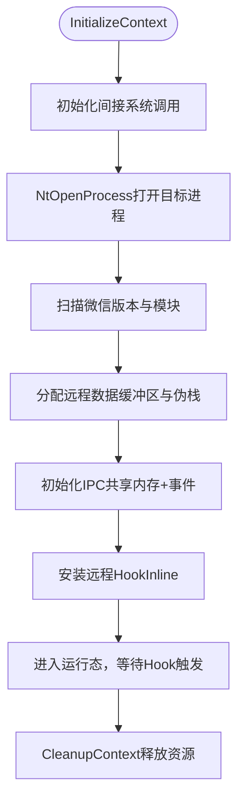
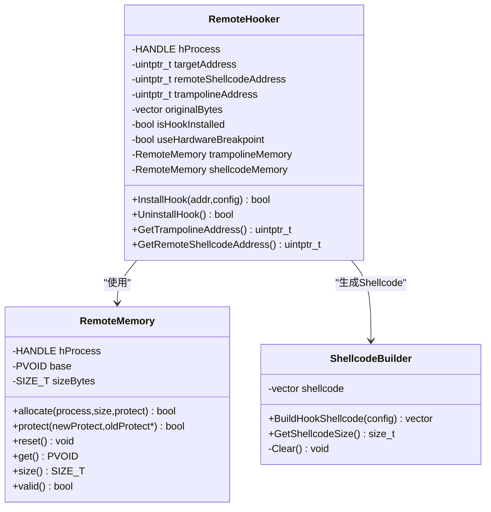
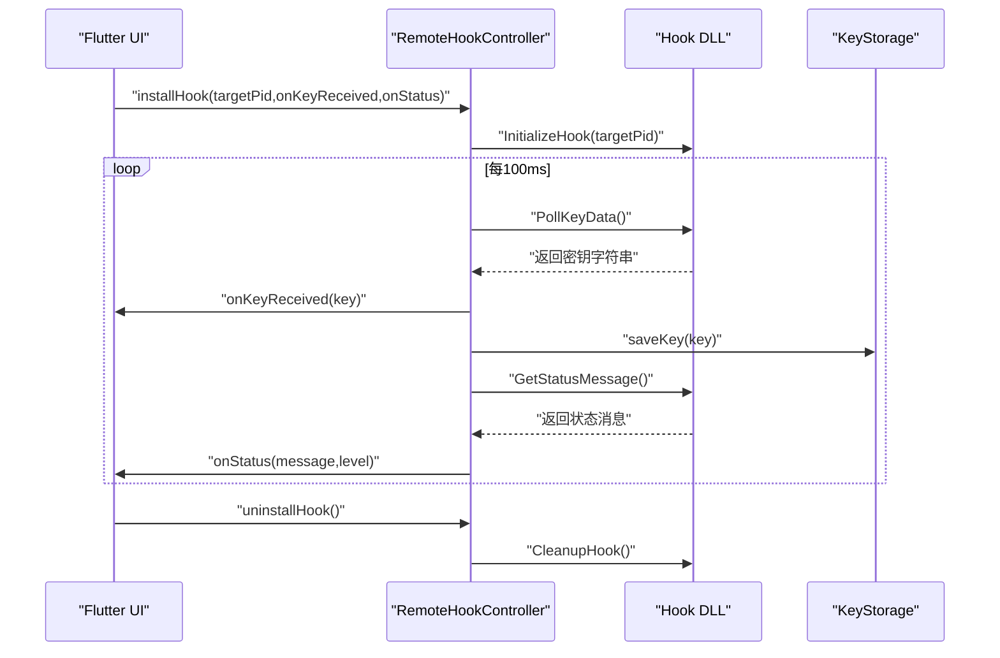
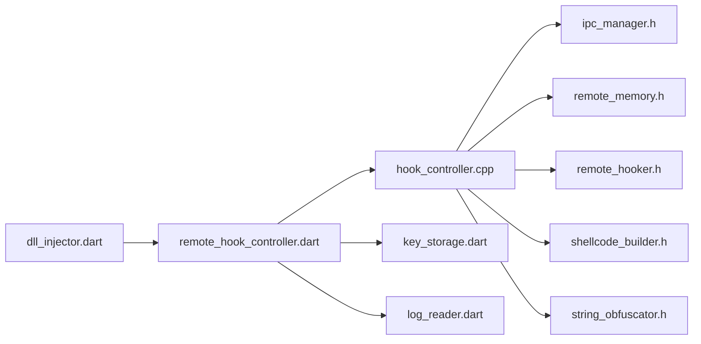

# IPC通信机制

<cite>
**本文档引用的文件**
- [ipc_manager.h](file://wx_key/include/ipc_manager.h)
- [ipc_manager.cpp](file://wx_key/src/ipc_manager.cpp)
- [hook_controller.h](file://wx_key/include/hook_controller.h)
- [hook_controller.cpp](file://wx_key/src/hook_controller.cpp)
- [remote_memory.h](file://wx_key/include/remote_memory.h)
- [remote_hooker.h](file://wx_key/include/remote_hooker.h)
- [shellcode_builder.h](file://wx_key/include/shellcode_builder.h)
- [string_obfuscator.h](file://wx_key/include/string_obfuscator.h)
- [remote_hook_controller.dart](file://lib/services/remote_hook_controller.dart)
- [dll_injector.dart](file://lib/services/dll_injector.dart)
- [log_reader.dart](file://lib/services/log_reader.dart)
- [key_storage.dart](file://lib/services/key_storage.dart)
- [main.dart](file://lib/main.dart)
</cite>

## 目录
1. [简介](#简介)
2. [项目结构](#项目结构)
3. [核心组件](#核心组件)
4. [架构总览](#架构总览)
5. [详细组件分析](#详细组件分析)
6. [依赖关系分析](#依赖关系分析)
7. [性能考量](#性能考量)
8. [故障排查指南](#故障排查指南)
9. [结论](#结论)
10. [附录](#附录)

## 简介
本文件系统性阐述wx_key项目中的IPC通信机制与密钥数据传输链路。项目采用“轮询模式”的共享内存IPC方案，结合DLL注入与远程Hook，在目标进程（微信）中捕获密钥数据，通过共享内存缓冲区与事件对象进行通知，最终由Flutter侧轮询读取并呈现。文档覆盖数据结构、缓冲区管理、同步机制、错误处理、超时与重连策略、安全与权限控制，以及调试与监控方法。

## 项目结构
- C++侧（wx_key/）：负责Hook安装、远程内存分配、共享内存与事件对象创建、轮询监听与数据回调。
- Dart侧（lib/）：负责DLL加载、轮询接口调用、状态与密钥接收、日志监控、持久化存储与UI交互。

**图表来源**
- [main.dart](file://lib/main.dart#L1-L2406)
- [remote_hook_controller.dart](file://lib/services/remote_hook_controller.dart#L1-L278)
- [log_reader.dart](file://lib/services/log_reader.dart#L1-L138)
- [key_storage.dart](file://lib/services/key_storage.dart#L1-L273)
- [dll_injector.dart](file://lib/services/dll_injector.dart#L1-L931)
- [hook_controller.cpp](file://wx_key/src/hook_controller.cpp#L1-L491)
- [ipc_manager.cpp](file://wx_key/src/ipc_manager.cpp#L1-L273)
- [remote_memory.h](file://wx_key/include/remote_memory.h#L1-L107)
- [remote_hooker.h](file://wx_key/include/remote_hooker.h#L1-L73)
- [shellcode_builder.h](file://wx_key/include/shellcode_builder.h#L1-L38)
- [string_obfuscator.h](file://wx_key/include/string_obfuscator.h#L1-L62)

**章节来源**
- [main.dart](file://lib/main.dart#L1-L2406)
- [remote_hook_controller.dart](file://lib/services/remote_hook_controller.dart#L1-L278)
- [dll_injector.dart](file://lib/services/dll_injector.dart#L1-L931)

## 核心组件
- 共享内存数据结构：定义密钥缓冲区、数据大小与序列号，作为跨进程传输载体。
- IPC管理器：负责共享内存与事件对象的创建、轮询监听、回调分发与资源清理。
- Hook控制器：负责DLL初始化、目标进程打开、版本检测、远程内存分配、IPC初始化、Hook安装与状态回调。
- 远程内存管理：基于NtAllocateVirtualMemory的RAII封装，保障远程内存生命周期与权限控制。
- 远程Hook管理：负责在目标进程内安装Inline Hook，生成Trampoline与Shellcode。
- Shellcode配置：描述共享内存地址、事件句柄、Trampoline地址、堆栈伪造等参数。
- 字符串混淆：编译期XOR混淆关键命名，降低静态可识别性。
- Flutter侧轮询：通过FFI调用PollKeyData与GetStatusMessage，定时轮询密钥与状态。

**章节来源**
- [ipc_manager.h](file://wx_key/include/ipc_manager.h#L9-L16)
- [ipc_manager.cpp](file://wx_key/src/ipc_manager.cpp#L24-L132)
- [hook_controller.h](file://wx_key/include/hook_controller.h#L12-L46)
- [hook_controller.cpp](file://wx_key/src/hook_controller.cpp#L214-L379)
- [remote_memory.h](file://wx_key/include/remote_memory.h#L7-L104)
- [remote_hooker.h](file://wx_key/include/remote_hooker.h#L9-L70)
- [shellcode_builder.h](file://wx_key/include/shellcode_builder.h#L8-L15)
- [string_obfuscator.h](file://wx_key/include/string_obfuscator.h#L42-L58)
- [remote_hook_controller.dart](file://lib/services/remote_hook_controller.dart#L8-L87)

## 架构总览
下图展示从DLL捕获到Flutter接收的完整链路：Hook触发后将密钥写入共享内存，IPC监听线程轮询读取并回调，Flutter侧轮询接口获取密钥并持久化与展示。

**图表来源**
- [hook_controller.cpp](file://wx_key/src/hook_controller.cpp#L316-L379)
- [ipc_manager.cpp](file://wx_key/src/ipc_manager.cpp#L212-L271)
- [remote_hook_controller.dart](file://lib/services/remote_hook_controller.dart#L130-L204)
- [key_storage.dart](file://lib/services/key_storage.dart#L14-L30)

## 详细组件分析

### IPC管理器（共享内存与轮询）
- 数据结构：SharedKeyData包含数据大小、密钥缓冲区与序列号，用于跨进程传输与去重。
- 初始化：生成唯一ID与名称，创建共享内存与事件对象；若全局命名受限则回退至Local命名。
- 轮询监听：监听线程在抖动等待后读取远程缓冲区，校验数据合法性与序列号变化，回调上层并清空远程缓冲区。
- 资源管理：提供SetRemoteBuffer、StartListening、StopListening、Cleanup等接口，保证线程安全与资源回收。

**图表来源**
- [ipc_manager.h](file://wx_key/include/ipc_manager.h#L11-L16)
- [ipc_manager.h](file://wx_key/include/ipc_manager.h#L19-L76)
- [ipc_manager.cpp](file://wx_key/src/ipc_manager.cpp#L24-L132)
- [ipc_manager.cpp](file://wx_key/src/ipc_manager.cpp#L212-L271)

**章节来源**
- [ipc_manager.h](file://wx_key/include/ipc_manager.h#L9-L53)
- [ipc_manager.cpp](file://wx_key/src/ipc_manager.cpp#L24-L132)
- [ipc_manager.cpp](file://wx_key/src/ipc_manager.cpp#L212-L271)

### Hook控制器（DLL初始化与Hook安装）
- 上下文管理：全局HookContext封装进程句柄、IPC、RemoteHooker、远程内存、状态队列与临界区。
- 初始化流程：打开目标进程、版本检测、扫描目标函数、分配远程数据缓冲区与伪栈、初始化IPC、安装Hook。
- 数据回调：OnDataReceived将二进制密钥转换为十六进制字符串并入队，供轮询读取。
- 清理流程：卸载Hook、停止IPC监听、释放远程内存、关闭句柄、清理状态。

**图表来源**
- [hook_controller.cpp](file://wx_key/src/hook_controller.cpp#L214-L379)
- [hook_controller.cpp](file://wx_key/src/hook_controller.cpp#L182-L211)

**章节来源**
- [hook_controller.h](file://wx_key/include/hook_controller.h#L12-L46)
- [hook_controller.cpp](file://wx_key/src/hook_controller.cpp#L214-L379)
- [hook_controller.cpp](file://wx_key/src/hook_controller.cpp#L182-L211)

### 远程内存与Hook管理
- RemoteMemory：基于NtAllocateVirtualMemory/Protect/Free的RAII封装，确保远程内存分配与权限变更的安全性。
- RemoteHooker：负责在目标进程内写入Shellcode、创建Trampoline、计算跳转指令长度与生成跳转，支持堆栈伪造。
- ShellcodeBuilder：根据配置生成Hook Shellcode，配置项包括共享内存地址、事件句柄、Trampoline地址与堆栈伪造开关。

**图表来源**
- [remote_memory.h](file://wx_key/include/remote_memory.h#L7-L104)
- [remote_hooker.h](file://wx_key/include/remote_hooker.h#L9-L70)
- [shellcode_builder.h](file://wx_key/include/shellcode_builder.h#L8-L34)

**章节来源**
- [remote_memory.h](file://wx_key/include/remote_memory.h#L7-L104)
- [remote_hooker.h](file://wx_key/include/remote_hooker.h#L9-L70)
- [shellcode_builder.h](file://wx_key/include/shellcode_builder.h#L8-L34)

### Flutter侧轮询与数据接收
- DLL加载：通过DynamicLibrary.open加载DLL，解析导出函数（InitializeHook、PollKeyData、GetStatusMessage、CleanupHook、GetLastErrorMsg）。
- 轮询策略：定时器每100ms调用PollKeyData读取密钥，GetStatusMessage读取状态消息，按级别输出日志。
- 接收与持久化：收到密钥后写入KeyStorage并更新UI，同时清理资源与停止轮询。

**图表来源**
- [remote_hook_controller.dart](file://lib/services/remote_hook_controller.dart#L89-L204)
- [key_storage.dart](file://lib/services/key_storage.dart#L14-L30)

**章节来源**
- [remote_hook_controller.dart](file://lib/services/remote_hook_controller.dart#L8-L87)
- [remote_hook_controller.dart](file://lib/services/remote_hook_controller.dart#L130-L204)
- [key_storage.dart](file://lib/services/key_storage.dart#L14-L30)

## 依赖关系分析
- C++侧依赖关系：hook_controller.cpp依赖ipc_manager.h、remote_memory.h、remote_hooker.h、shellcode_builder.h、string_obfuscator.h等头文件。
- Flutter侧依赖关系：remote_hook_controller.dart依赖ffi与win32包，dll_injector.dart依赖win32与file_picker等包。
- IPC耦合点：IPCManager与HookContext通过回调解耦，轮询模式避免了事件对象的复杂同步。

**图表来源**
- [hook_controller.cpp](file://wx_key/src/hook_controller.cpp#L11-L20)
- [remote_hook_controller.dart](file://lib/services/remote_hook_controller.dart#L1-L31)
- [dll_injector.dart](file://lib/services/dll_injector.dart#L1-L10)

**章节来源**
- [hook_controller.cpp](file://wx_key/src/hook_controller.cpp#L11-L20)
- [remote_hook_controller.dart](file://lib/services/remote_hook_controller.dart#L1-L31)

## 性能考量
- 轮询抖动：监听线程等待时间加入抖动，避免稳定特征导致被检测。
- 轮询频率：Flutter侧每100ms轮询一次，平衡实时性与CPU占用。
- 内存访问：仅在有事件信号或到达等待上限时读取远程缓冲区，减少无效IO。
- 事件对象：当前轮询模式已不再使用事件通知，简化同步逻辑，降低复杂度。

[本节为通用性能讨论，无需列出具体文件来源]

## 故障排查指南
- 常见错误来源：
  - 权限不足：初始化共享内存/事件时可能返回访问拒绝或权限不足，代码已回退至Local命名空间。
  - 进程打开失败：NtOpenProcess返回非成功状态码，需检查目标进程PID与权限。
  - 远程内存分配失败：NtAllocateVirtualMemory返回失败，检查目标进程状态与权限。
  - Hook安装失败：InstallHook返回失败，检查目标函数地址与Shellcode生成。
- 错误信息获取：DLL侧提供GetLastErrorMsg，Flutter侧RemoteHookController统一读取并记录日志。
- 超时与重连：
  - Flutter侧设置60秒超时，超时后自动清理资源并提示用户重试。
  - 重连建议：先确认微信进程状态，必要时重启微信并重新注入DLL。
- 日志监控：通过LogReader轮询日志文件，解析KEY行与状态行，辅助定位问题。

**章节来源**
- [ipc_manager.cpp](file://wx_key/src/ipc_manager.cpp#L117-L131)
- [hook_controller.cpp](file://wx_key/src/hook_controller.cpp#L244-L256)
- [hook_controller.cpp](file://wx_key/src/hook_controller.cpp#L318-L331)
- [hook_controller.cpp](file://wx_key/src/hook_controller.cpp#L369-L374)
- [remote_hook_controller.dart](file://lib/services/remote_hook_controller.dart#L237-L253)
- [log_reader.dart](file://lib/services/log_reader.dart#L96-L135)
- [main.dart](file://lib/main.dart#L690-L707)

## 结论
本项目通过“轮询模式共享内存IPC”实现了稳定可靠的密钥数据传输链路。C++侧负责Hook与IPC，Flutter侧负责轮询与UI，二者通过FFI接口解耦协作。设计在保证功能可用的同时，兼顾了安全性（字符串混淆、权限检查）、可维护性（RAII远程内存、回调解耦）与可观测性（日志与状态轮询）。建议在生产环境中进一步增强事件驱动与心跳机制，以提升响应速度与鲁棒性。

[本节为总结性内容，无需列出具体文件来源]

## 附录

### IPC连接建立、数据传输与终止步骤
- 连接建立
  - Flutter侧加载DLL并调用InitializeHook，传入目标微信PID。
  - DLL打开目标进程、检测版本、扫描目标函数、分配远程缓冲区与伪栈、初始化IPC、安装Hook。
  - IPCManager创建共享内存与事件对象，启动监听线程。
- 数据传输
  - Hook触发后将密钥写入远程缓冲区，IPCManager轮询读取并回调上层。
  - Flutter侧定时轮询PollKeyData获取密钥，GetStatusMessage获取状态消息。
- 连接终止
  - Flutter侧调用uninstallHook，DLL卸载Hook、停止IPC监听、释放远程内存、清理句柄。

**章节来源**
- [hook_controller.cpp](file://wx_key/src/hook_controller.cpp#L214-L379)
- [ipc_manager.cpp](file://wx_key/src/ipc_manager.cpp#L212-L271)
- [remote_hook_controller.dart](file://lib/services/remote_hook_controller.dart#L130-L204)

### 安全性考虑与权限控制
- 字符串混淆：关键命名在编译期进行XOR混淆，降低静态识别风险。
- 权限检查：共享内存/事件创建失败时回退至Local命名空间，避免全局作用域权限问题。
- 进程权限：通过NtOpenProcess打开目标进程，确保最小权限原则。
- 远程内存：使用NtAllocateVirtualMemory/Protect/Free进行远程内存管理，避免直接使用低级API带来的安全风险。

**章节来源**
- [string_obfuscator.h](file://wx_key/include/string_obfuscator.h#L42-L58)
- [ipc_manager.cpp](file://wx_key/src/ipc_manager.cpp#L117-L131)
- [hook_controller.cpp](file://wx_key/src/hook_controller.cpp#L244-L256)
- [remote_memory.h](file://wx_key/include/remote_memory.h#L34-L85)

### 调试与监控方法
- 日志文件：DLL向临时目录写入状态日志，Flutter侧LogReader轮询解析。
- 状态轮询：Flutter侧GetStatusMessage按级别输出INFO/SUCCESS/ERROR。
- 超时控制：60秒超时后自动清理资源，避免长时间占用。
- 目录与文件：通过SettingsDialog可打开与清空日志文件，便于问题定位。

**章节来源**
- [log_reader.dart](file://lib/services/log_reader.dart#L1-L138)
- [remote_hook_controller.dart](file://lib/services/remote_hook_controller.dart#L168-L204)
- [main.dart](file://lib/main.dart#L690-L707)
- [widgets/settings_dialog.dart](file://lib/widgets/settings_dialog.dart#L89-L125)