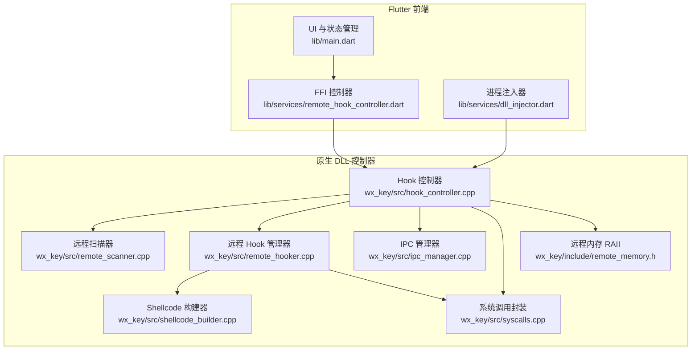
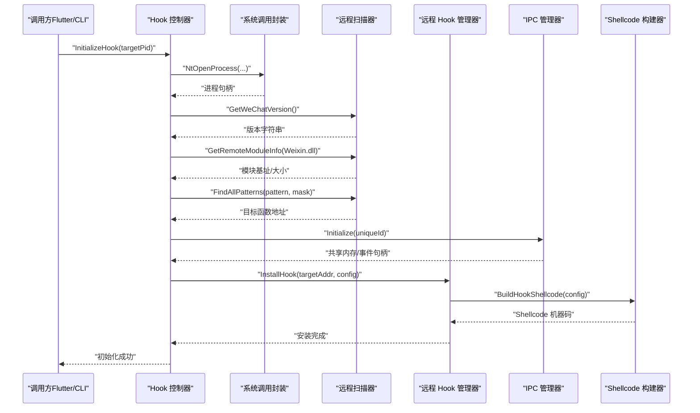
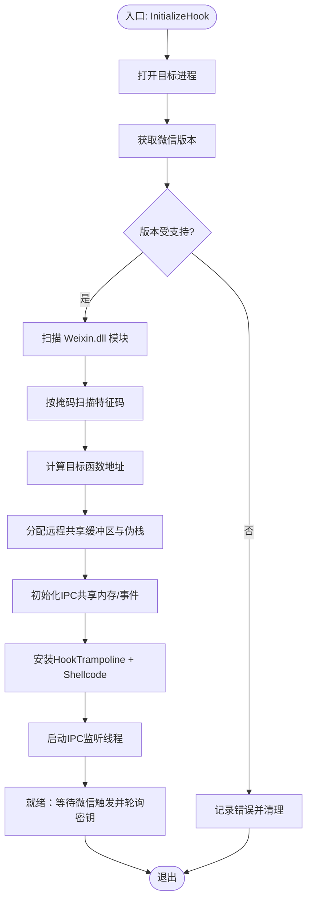
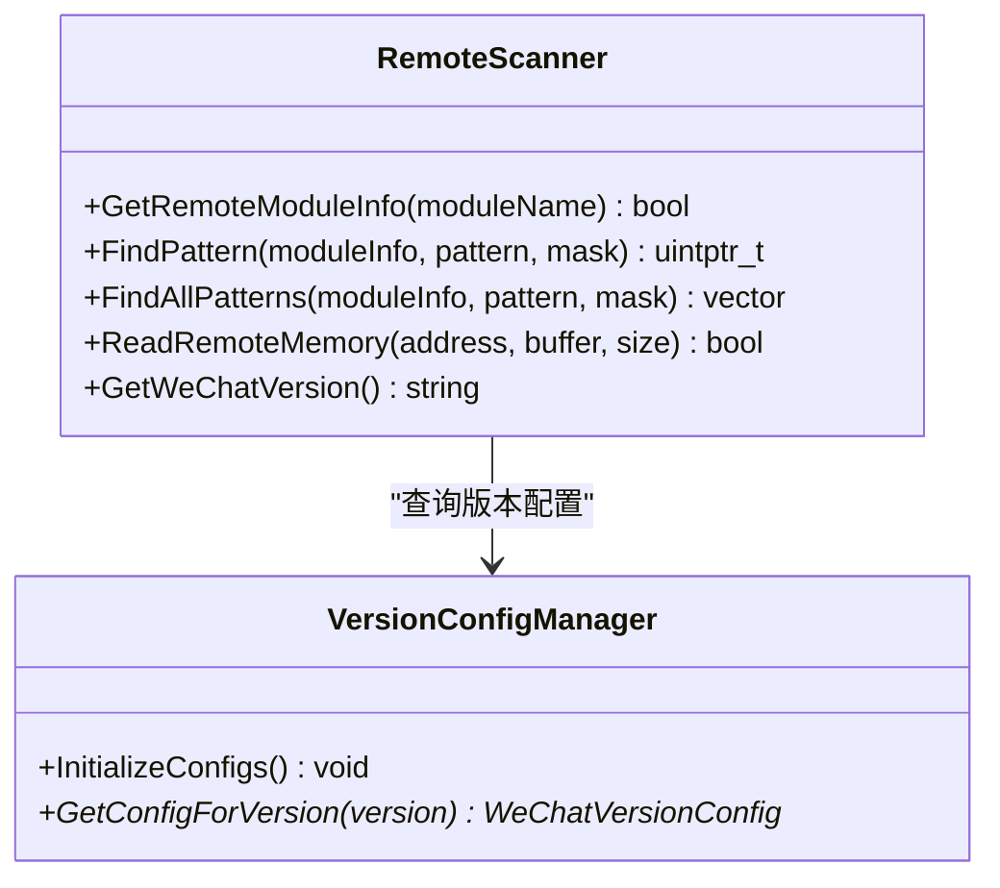
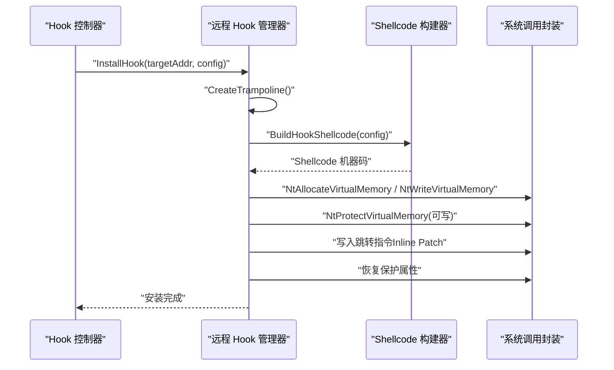
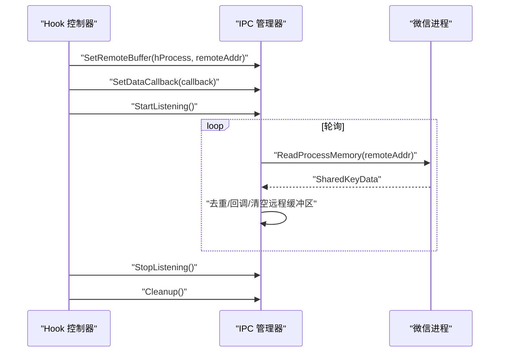
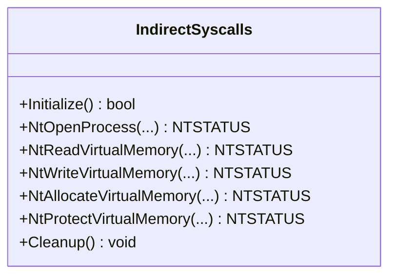
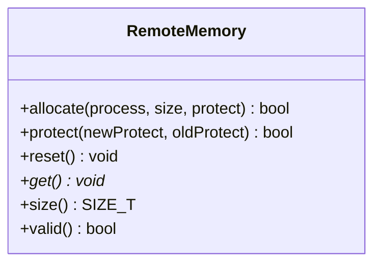
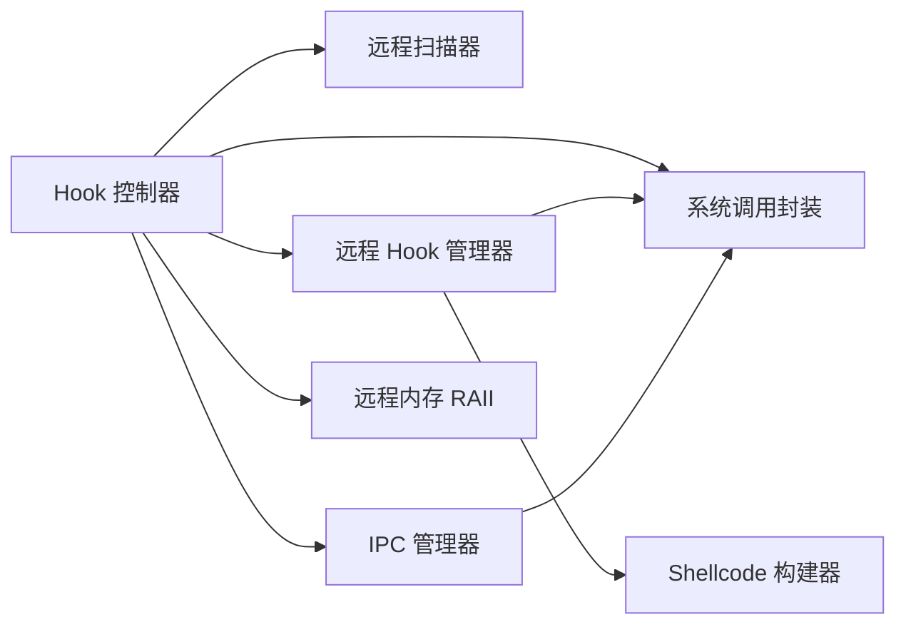

# 进程控制与管理

<cite>
**本文引用的文件**
- [README.md](file://README.md)
- [hook_controller.cpp](file://wx_key/src/hook_controller.cpp)
- [hook_controller.h](file://wx_key/include/hook_controller.h)
- [ipc_manager.cpp](file://wx_key/src/ipc_manager.cpp)
- [ipc_manager.h](file://wx_key/include/ipc_manager.h)
- [remote_hooker.cpp](file://wx_key/src/remote_hooker.cpp)
- [remote_hooker.h](file://wx_key/include/remote_hooker.h)
- [remote_scanner.cpp](file://wx_key/src/remote_scanner.cpp)
- [remote_scanner.h](file://wx_key/include/remote_scanner.h)
- [shellcode_builder.cpp](file://wx_key/src/shellcode_builder.cpp)
- [shellcode_builder.h](file://wx_key/include/shellcode_builder.h)
- [syscalls.cpp](file://wx_key/src/syscalls.cpp)
- [syscalls.h](file://wx_key/include/syscalls.h)
- [remote_memory.h](file://wx_key/include/remote_memory.h)
</cite>

## 目录
1. [引言](#引言)
2. [项目结构](#项目结构)
3. [核心组件](#核心组件)
4. [架构总览](#架构总览)
5. [详细组件分析](#详细组件分析)
6. [依赖关系分析](#依赖关系分析)
7. [性能考量](#性能考量)
8. [故障排查指南](#故障排查指南)
9. [结论](#结论)
10. [附录](#附录)

## 引言
本文件围绕微信进程控制与管理展开，系统性阐述从进程发现、启动与监控，到进程状态检测、进程间通信（IPC）、资源清理的完整流程；详解进程句柄管理、权限提升与安全上下文切换；给出进程注入前的准备工作（进程验证、版本检测与兼容性检查）；覆盖进程生命周期管理（从启动到清理）；并在异常情况下提供恢复与错误处理机制；最后总结最佳实践与安全注意事项。

## 项目结构
该仓库包含 Flutter 前端与 C++ 原生 DLL 两部分。DLL 作为控制器，负责微信进程的发现、启动与监控、Hook 安装、IPC 通信与密钥数据轮询；前端通过 FFI 调用 DLL 导出接口进行交互。

图表来源
- [README.md](file://README.md#L77-L96)
- [hook_controller.cpp](file://wx_key/src/hook_controller.cpp#L1-L491)
- [remote_scanner.cpp](file://wx_key/src/remote_scanner.cpp#L1-L261)
- [remote_hooker.cpp](file://wx_key/src/remote_hooker.cpp#L1-L419)
- [ipc_manager.cpp](file://wx_key/src/ipc_manager.cpp#L1-L273)
- [shellcode_builder.cpp](file://wx_key/src/shellcode_builder.cpp#L1-L151)
- [syscalls.cpp](file://wx_key/src/syscalls.cpp#L1-L278)
- [remote_memory.h](file://wx_key/include/remote_memory.h#L1-L107)

章节来源
- [README.md](file://README.md#L77-L96)

## 核心组件
- Hook 控制器：负责初始化上下文、打开目标进程、版本检测与兼容性校验、扫描目标函数地址、分配远程内存、初始化 IPC、安装 Hook、轮询密钥数据与状态消息、错误记录与清理。
- 远程扫描器：枚举远程模块、读取模块版本、按掩码扫描特征码、定位目标函数地址。
- 远程 Hook 管理器：创建 Trampoline、生成跳转指令、写入 Inline Patch、保护内存页、释放资源。
- IPC 管理器：创建共享内存与事件、轮询远程缓冲区、回调通知、线程安全停止。
- Shellcode 构建器：基于 Xbyak 生成 x64 Hook Shellcode，支持堆栈伪造与序列号递增。
- 系统调用封装：动态解析 ntdll 函数、提取 SSN、构建直调 stub，统一 Nt* 调用。
- 远程内存 RAII：封装 NtAllocateVirtualMemory/NtFreeVirtualMemory，提供自动释放与保护变更。

章节来源
- [hook_controller.h](file://wx_key/include/hook_controller.h#L12-L46)
- [hook_controller.cpp](file://wx_key/src/hook_controller.cpp#L214-L379)
- [remote_scanner.h](file://wx_key/include/remote_scanner.h#L16-L34)
- [remote_hooker.h](file://wx_key/include/remote_hooker.h#L10-L28)
- [ipc_manager.h](file://wx_key/include/ipc_manager.h#L19-L46)
- [shellcode_builder.h](file://wx_key/include/shellcode_builder.h#L9-L15)
- [syscalls.h](file://wx_key/include/syscalls.h#L96-L155)
- [remote_memory.h](file://wx_key/include/remote_memory.h#L8-L34)

## 架构总览
下图展示从 DLL 导出接口到各子系统的调用链路与数据流。

图表来源
- [hook_controller.cpp](file://wx_key/src/hook_controller.cpp#L214-L379)
- [remote_scanner.cpp](file://wx_key/src/remote_scanner.cpp#L119-L147)
- [remote_hooker.cpp](file://wx_key/src/remote_hooker.cpp#L278-L389)
- [ipc_manager.cpp](file://wx_key/src/ipc_manager.cpp#L24-L132)
- [shellcode_builder.cpp](file://wx_key/src/shellcode_builder.cpp#L28-L149)
- [syscalls.cpp](file://wx_key/src/syscalls.cpp#L124-L137)

## 详细组件分析

### Hook 控制器（进程发现、启动与监控）
- 进程打开与句柄管理：通过系统调用封装打开目标进程，持有进程句柄用于后续读写与保护变更。
- 版本检测与兼容性：扫描 Weixin.dll 模块路径，查询文件版本，根据版本选择对应特征码配置，限定支持范围。
- 地址扫描与定位：枚举远程模块，按掩码扫描特征码，定位目标函数地址并计算偏移。
- 远程内存分配：为目标进程分配共享密钥缓冲区与伪栈，用于 Shellcode 与 IPC 通信。
- IPC 初始化与监听：创建共享内存与事件，设置远程缓冲区地址，启动监听线程轮询密钥数据。
- Hook 安装：创建 Trampoline 与 Shellcode，写入 Inline Patch，恢复原保护属性。
- 状态与错误：统一发送状态消息与错误信息，支持轮询获取最新状态与错误。
- 清理流程：卸载 Hook、停止监听、释放远程内存、关闭句柄、清理锁与队列。

图表来源
- [hook_controller.cpp](file://wx_key/src/hook_controller.cpp#L214-L379)
- [remote_scanner.cpp](file://wx_key/src/remote_scanner.cpp#L119-L147)
- [ipc_manager.cpp](file://wx_key/src/ipc_manager.cpp#L24-L132)
- [remote_hooker.cpp](file://wx_key/src/remote_hooker.cpp#L278-L389)

章节来源
- [hook_controller.cpp](file://wx_key/src/hook_controller.cpp#L214-L379)
- [hook_controller.h](file://wx_key/include/hook_controller.h#L12-L46)

### 远程扫描器（进程状态检测与版本兼容）
- 模块枚举与信息获取：枚举远程进程模块，获取基址与镜像大小。
- 版本读取：通过模块路径读取文件版本信息，解析主/次/构建/修订号。
- 特征码扫描：分块读取远程内存，本地匹配掩码模式，返回所有匹配地址。
- 版本配置管理：内置多版本特征码与偏移，按版本区间选择配置。

图表来源
- [remote_scanner.cpp](file://wx_key/src/remote_scanner.cpp#L109-L259)
- [remote_scanner.h](file://wx_key/include/remote_scanner.h#L16-L66)

章节来源
- [remote_scanner.cpp](file://wx_key/src/remote_scanner.cpp#L109-L259)
- [remote_scanner.h](file://wx_key/include/remote_scanner.h#L16-L66)

### 远程 Hook 管理器（进程间通信与注入准备）
- Trampoline 创建：备份目标函数若干指令，生成可执行的回跳代码。
- Shellcode 生成：基于配置构建跳板，保存/恢复寄存器，拷贝密钥到共享内存，递增序列号，跳回 Trampoline。
- Inline Patch：修改目标函数开头为跳转至 Shellcode，保证原子性写入与保护恢复。
- 资源释放：恢复补丁、释放远程内存与 Trampoline。

图表来源
- [remote_hooker.cpp](file://wx_key/src/remote_hooker.cpp#L197-L389)
- [shellcode_builder.cpp](file://wx_key/src/shellcode_builder.cpp#L28-L149)
- [syscalls.cpp](file://wx_key/src/syscalls.cpp#L171-L217)

章节来源
- [remote_hooker.cpp](file://wx_key/src/remote_hooker.cpp#L197-L389)
- [remote_hooker.h](file://wx_key/include/remote_hooker.h#L10-L40)
- [shellcode_builder.cpp](file://wx_key/src/shellcode_builder.cpp#L28-L149)
- [shellcode_builder.h](file://wx_key/include/shellcode_builder.h#L9-L15)

### IPC 管理器（进程间通信与轮询）
- 资源初始化：创建全局/本地共享内存与事件，支持降级策略（Global→Local）。
- 远程缓冲区设置：传入目标进程句柄与远程地址，用于轮询读取。
- 监听线程：周期性 Wait 与轮询，读取远程共享数据，去重并回调通知，清空远程缓冲区。
- 停止与清理：原子停止标志、唤醒等待线程、关闭句柄、解除映射。

图表来源
- [ipc_manager.cpp](file://wx_key/src/ipc_manager.cpp#L134-L271)
- [ipc_manager.h](file://wx_key/include/ipc_manager.h#L19-L52)

章节来源
- [ipc_manager.cpp](file://wx_key/src/ipc_manager.cpp#L134-L271)
- [ipc_manager.h](file://wx_key/include/ipc_manager.h#L19-L52)

### 系统调用封装（权限提升与安全上下文）
- 动态解析：从混淆后的 ntdll 名称解析 Nt* 函数地址。
- SSN 直调：从 nt* stub 中提取系统调用号，构建 mov r10,rcx; mov eax,ssn; syscall; ret 的直调 stub。
- 统一封装：提供 NtOpenProcess/NtReadVirtualMemory/NtWriteVirtualMemory/NtAllocateVirtualMemory/NtProtectVirtualMemory 等。

图表来源
- [syscalls.cpp](file://wx_key/src/syscalls.cpp#L92-L233)
- [syscalls.h](file://wx_key/include/syscalls.h#L96-L155)

章节来源
- [syscalls.cpp](file://wx_key/src/syscalls.cpp#L92-L233)
- [syscalls.h](file://wx_key/include/syscalls.h#L96-L155)

### 远程内存管理（句柄与资源）
- RAII 包装：分配/保护/释放均通过 Nt* 实现，析构自动释放。
- 移动语义：支持移动赋值，避免重复释放。
- 与 Hook/IPC 协作：为 Shellcode 与共享缓冲区提供安全的远程内存。

图表来源
- [remote_memory.h](file://wx_key/include/remote_memory.h#L8-L90)

章节来源
- [remote_memory.h](file://wx_key/include/remote_memory.h#L8-L90)

## 依赖关系分析
- Hook 控制器依赖远程扫描器、远程 Hook 管理器、IPC 管理器、系统调用封装与远程内存。
- 远程 Hook 管理器依赖系统调用封装与 Shellcode 构建器。
- IPC 管理器独立工作，依赖系统调用封装与字符串混淆工具（名称生成）。
- 系统调用封装与远程内存为底层基础设施，被多个组件复用。

图表来源
- [hook_controller.cpp](file://wx_key/src/hook_controller.cpp#L1-L20)
- [remote_hooker.cpp](file://wx_key/src/remote_hooker.cpp#L1-L6)
- [ipc_manager.cpp](file://wx_key/src/ipc_manager.cpp#L1-L6)
- [syscalls.cpp](file://wx_key/src/syscalls.cpp#L1-L6)
- [remote_memory.h](file://wx_key/include/remote_memory.h#L1-L6)

章节来源
- [hook_controller.cpp](file://wx_key/src/hook_controller.cpp#L1-L20)
- [remote_hooker.cpp](file://wx_key/src/remote_hooker.cpp#L1-L6)
- [ipc_manager.cpp](file://wx_key/src/ipc_manager.cpp#L1-L6)
- [syscalls.cpp](file://wx_key/src/syscalls.cpp#L1-L6)
- [remote_memory.h](file://wx_key/include/remote_memory.h#L1-L6)

## 性能考量
- 内存扫描分块：远程扫描采用 1MB 分块读取与本地匹配，减少系统调用次数与跨进程拷贝。
- 轮询抖动：IPC 轮询引入轻微抖动，避免稳定时间特征，兼顾实时性与 CPU 占用。
- 原子写入：Inline Patch 写入前临时设为可写，写入后再恢复旧保护，降低冲突风险。
- 伪栈对齐：Shellcode 伪栈按 16 字节对齐，减少栈相关异常概率。
- 资源复用：共享内存与事件在控制器端创建，避免重复初始化成本。

## 故障排查指南
- 初始化失败
  - 打开进程失败：检查进程 PID 是否有效、权限是否足够、进程是否存活。
  - 版本不受支持：确认微信版本是否在支持范围内，必要时更新配置。
  - 未找到 Weixin.dll：确认微信已启动且模块加载正常。
  - 特征码匹配失败：确认掩码与偏移配置正确，必要时更新版本配置。
- IPC 通信异常
  - 共享内存/事件创建失败：尝试 Global→Local 降级策略；检查权限与命名冲突。
  - 轮询无数据：确认微信侧已写入共享缓冲区并递增序列号；检查回调是否设置。
- Hook 安装失败
  - Trampoline 创建失败：确认目标函数可读且指令边界合理。
  - Inline Patch 写入失败：检查目标页保护与写入长度；确保有足够的 NOP 填充。
- 资源清理
  - 卸载 Hook 后仍残留：确认恢复补丁成功；检查远程内存释放顺序。
  - 线程未退出：确保停止标志与事件唤醒；设置超时等待。

章节来源
- [hook_controller.cpp](file://wx_key/src/hook_controller.cpp#L225-L281)
- [ipc_manager.cpp](file://wx_key/src/ipc_manager.cpp#L113-L131)
- [remote_hooker.cpp](file://wx_key/src/remote_hooker.cpp#L391-L417)

## 结论
本系统通过“扫描-定位-安装-通信-轮询-清理”的闭环流程，实现了对微信进程的稳定 Hook 与密钥提取。其关键在于：
- 精确的版本检测与特征码适配；
- 原子化的 Inline Patch 与可执行的 Trampoline；
- 轮询驱动的 IPC 通信与序列号去重；
- 统一的系统调用封装与远程内存 RAII；
- 完备的错误记录与资源清理。

在实际部署中，建议严格遵循安全合规要求，仅在授权场景使用，并持续关注微信版本演进以维护兼容性。

## 附录

### 进程注入前的准备工作清单
- 进程验证
  - 确认微信进程已启动并登录；获取有效 PID。
  - 检查进程句柄打开权限（PROCESS_ALL_ACCESS）。
- 版本检测与兼容性
  - 读取 Weixin.dll 版本；核对支持范围；必要时更新特征码配置。
- 兼容性检查
  - 确认目标函数地址唯一；检查掩码与偏移是否匹配。
- 安全与权限
  - 确保宿主进程具备必要的调试/访问权限；避免在受限账户下运行。
- 资源准备
  - 预分配远程共享缓冲区与伪栈；初始化 IPC 名称与事件。

章节来源
- [remote_scanner.cpp](file://wx_key/src/remote_scanner.cpp#L219-L259)
- [hook_controller.cpp](file://wx_key/src/hook_controller.cpp#L258-L308)
- [ipc_manager.cpp](file://wx_key/src/ipc_manager.cpp#L24-L132)

### 进程生命周期管理（从启动到清理）
- 启动阶段
  - 启动微信并登录；等待关键页面加载完成。
  - 调用 InitializeHook(targetPid) 完成初始化。
- 运行阶段
  - 触发微信内部流程以生成密钥；轮询 PollKeyData 获取十六进制密钥。
  - 通过 GetStatusMessage 获取状态与错误信息。
- 清理阶段
  - 调用 CleanupHook() 卸载 Hook、停止监听、释放远程内存与句柄。
  - 记录最终状态并输出错误摘要。

章节来源
- [hook_controller.h](file://wx_key/include/hook_controller.h#L17-L46)
- [hook_controller.cpp](file://wx_key/src/hook_controller.cpp#L415-L490)
- [remote_hooker.cpp](file://wx_key/src/remote_hooker.cpp#L391-L417)
- [ipc_manager.cpp](file://wx_key/src/ipc_manager.cpp#L184-L196)

### 异常恢复与错误处理
- 版本不匹配：记录错误并立即 Cleanup，避免半成品状态。
- IPC 初始化失败：尝试 Local 命名空间；若仍失败，返回错误并清理。
- Hook 安装失败：回滚保护属性与补丁，释放内存，返回错误。
- 轮询无响应：检查回调设置与远程写入逻辑；增加超时与重试策略。

章节来源
- [hook_controller.cpp](file://wx_key/src/hook_controller.cpp#L225-L281)
- [ipc_manager.cpp](file://wx_key/src/ipc_manager.cpp#L113-L131)
- [remote_hooker.cpp](file://wx_key/src/remote_hooker.cpp#L391-L417)

### 最佳实践与安全注意事项
- 仅在合法授权场景使用；遵守法律法规与服务条款。
- 保持特征码与版本配置同步更新；定期回归测试。
- 使用最小权限原则；避免不必要的调试权限。
- 注意稳定性与兼容性：对不同版本与构建进行充分验证。
- 日志与可观测性：通过状态消息与错误接口收集诊断信息。
- 资源隔离：确保共享内存命名唯一，避免与其他实例冲突。