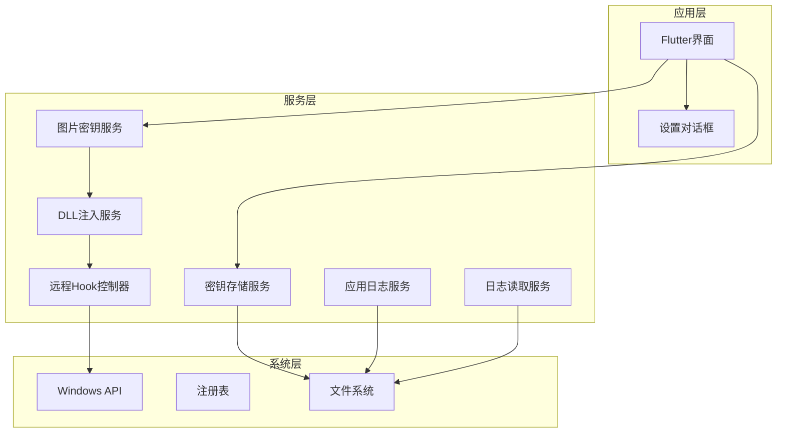
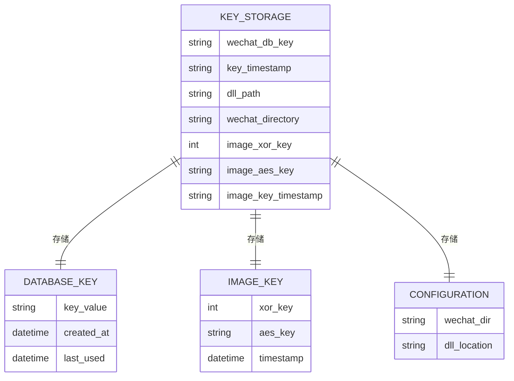
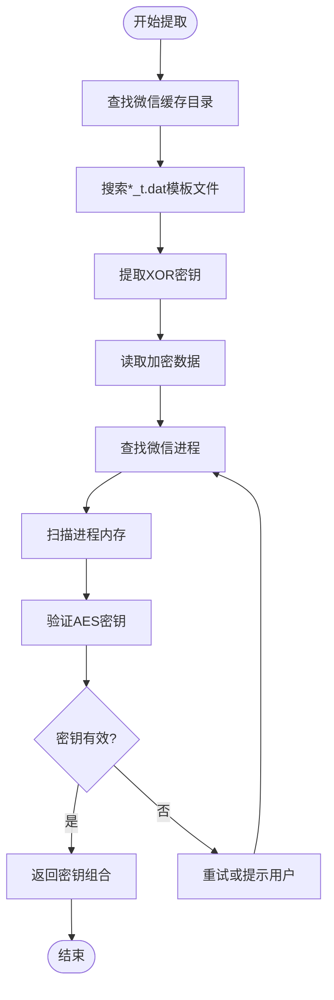
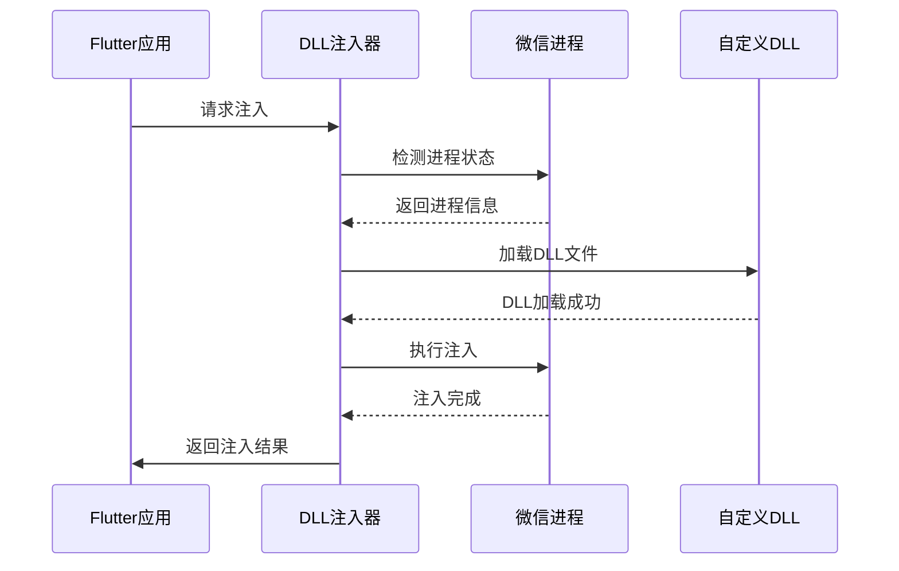
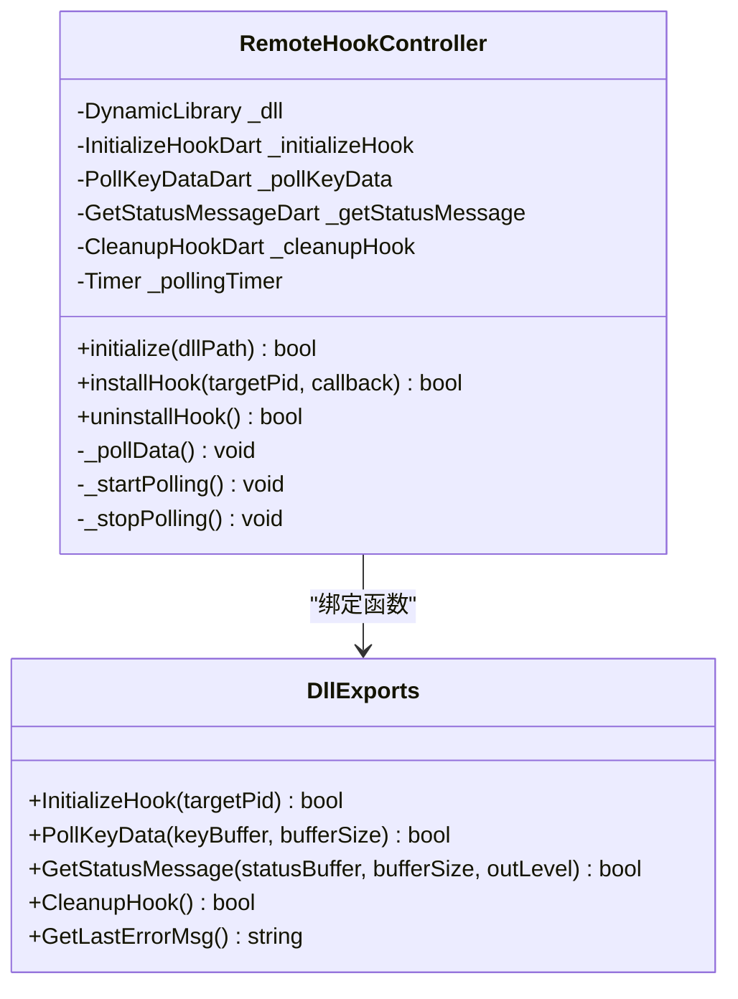
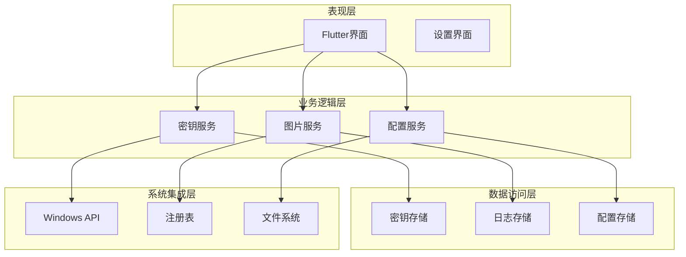
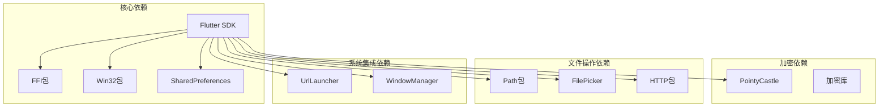

# 密钥存储与管理系统

<cite>
**本文档引用的文件**
- [main.dart](file://lib/main.dart)
- [key_storage.dart](file://lib/services/key_storage.dart)
- [image_key_service.dart](file://lib/services/image_key_service.dart)
- [dll_injector.dart](file://lib/services/dll_injector.dart)
- [remote_hook_controller.dart](file://lib/services/remote_hook_controller.dart)
- [app_logger.dart](file://lib/services/app_logger.dart)
- [log_reader.dart](file://lib/services/log_reader.dart)
- [settings_dialog.dart](file://lib/widgets/settings_dialog.dart)
- [pubspec.yaml](file://pubspec.yaml)
</cite>

## 目录
1. [简介](#简介)
2. [项目结构](#项目结构)
3. [核心组件](#核心组件)
4. [架构概览](#架构概览)
5. [详细组件分析](#详细组件分析)
6. [依赖关系分析](#依赖关系分析)
7. [性能考虑](#性能考虑)
8. [故障排除指南](#故障排除指南)
9. [结论](#结论)

## 简介

微信密钥提取工具是一个专门设计用于从微信应用程序中提取加密密钥的安全工具。该系统采用多层架构设计，结合了Flutter前端界面、原生Windows API调用和C++ DLL注入技术，实现了对微信数据库密钥和图片密钥的自动化提取。

系统的核心功能包括：
- 数据库密钥提取：从微信数据库中提取32字节的AES密钥
- 图片密钥提取：提取图片解密所需的XOR和AES密钥
- 持久化存储：使用SharedPreferences安全存储密钥信息
- 远程Hook：通过DLL注入技术在微信进程中执行密钥提取
- 日志管理：完整的日志记录和监控系统

## 项目结构

该项目采用标准的Flutter项目结构，主要分为以下几个核心模块：



**图表来源**
- [main.dart](file://lib/main.dart#L1-L100)
- [key_storage.dart](file://lib/services/key_storage.dart#L1-L50)
- [image_key_service.dart](file://lib/services/image_key_service.dart#L1-L50)

**章节来源**
- [main.dart](file://lib/main.dart#L1-L150)
- [pubspec.yaml](file://pubspec.yaml#L30-L60)

## 核心组件

### 密钥存储服务 (KeyStorage)

密钥存储服务是系统的核心数据持久化组件，基于SharedPreferences实现，提供以下功能：

#### 主要特性
- **数据库密钥存储**：存储微信数据库使用的32字节AES密钥
- **图片密钥存储**：存储图片解密所需的XOR和AES密钥
- **时间戳管理**：记录密钥的获取和更新时间
- **配置管理**：存储微信安装目录和DLL路径等配置信息

#### 数据结构设计



**图表来源**
- [key_storage.dart](file://lib/services/key_storage.dart#L6-L12)

#### 存储策略

系统采用以下存储策略确保数据安全：

1. **SharedPreferences持久化**：使用Flutter的SharedPreferences包进行本地存储
2. **时间戳追踪**：每个密钥都关联创建和更新时间戳
3. **分层存储**：数据库密钥和图片密钥分别存储，便于管理和维护
4. **配置分离**：用户配置信息与密钥数据分离存储

**章节来源**
- [key_storage.dart](file://lib/services/key_storage.dart#L1-L273)

### 图片密钥服务 (ImageKeyService)

图片密钥服务负责从微信缓存中提取图片解密所需的密钥，支持复杂的密钥提取算法：

#### 核心功能
- **模板文件分析**：扫描微信缓存目录中的*_t.dat文件
- **XOR密钥提取**：从模板文件末尾字节推导XOR解密密钥
- **AES密钥内存提取**：从微信进程内存中搜索32字节AES密钥
- **密钥验证**：验证提取的密钥有效性

#### 提取算法流程



**图表来源**
- [image_key_service.dart](file://lib/services/image_key_service.dart#L600-L696)

**章节来源**
- [image_key_service.dart](file://lib/services/image_key_service.dart#L1-L698)

### DLL注入服务 (DllInjector)

DLL注入服务负责将自定义DLL注入到微信进程中执行密钥提取操作：

#### 主要功能
- **微信进程检测**：自动检测和定位微信进程
- **DLL加载管理**：管理DLL文件的加载和卸载
- **进程通信**：建立Flutter应用与DLL之间的通信通道
- **错误处理**：处理注入过程中的各种异常情况

#### 注入流程



**图表来源**
- [dll_injector.dart](file://lib/services/dll_injector.dart#L31-L91)

**章节来源**
- [dll_injector.dart](file://lib/services/dll_injector.dart#L1-L931)

### 远程Hook控制器 (RemoteHookController)

远程Hook控制器管理DLL与Flutter应用之间的双向通信：

#### 核心功能
- **DLL函数绑定**：动态绑定DLL导出函数
- **轮询机制**：定期轮询DLL中的密钥数据
- **状态监控**：监控DLL执行状态和错误信息
- **资源管理**：管理DLL生命周期和内存资源

#### 通信协议



**图表来源**
- [remote_hook_controller.dart](file://lib/services/remote_hook_controller.dart#L34-L87)

**章节来源**
- [remote_hook_controller.dart](file://lib/services/remote_hook_controller.dart#L1-L278)

## 架构概览

系统采用分层架构设计，确保各组件职责清晰、耦合度低：



**图表来源**
- [main.dart](file://lib/main.dart#L420-L500)
- [key_storage.dart](file://lib/services/key_storage.dart#L1-L50)

## 详细组件分析

### 密钥管理功能实现

#### 数据持久化策略

系统采用SharedPreferences作为主要存储介质，具有以下特点：

1. **平台兼容性**：SharedPreferences在Android和iOS上都有良好的支持
2. **简单易用**：提供简单的键值对存储接口
3. **自动同步**：底层自动处理数据同步和持久化

#### 数据加密考虑

虽然系统使用SharedPreferences存储密钥，但考虑到密钥的敏感性，建议在实际部署中考虑以下增强措施：

1. **硬件安全模块**：在支持的设备上使用硬件安全模块存储密钥
2. **加密存储**：对SharedPreferences中的密钥进行额外的加密处理
3. **访问控制**：限制应用的文件系统访问权限

#### 密钥数据结构设计

系统支持两种主要的密钥类型：

**数据库密钥结构**：
- 类型：32字节十六进制字符串（64字符长度）
- 存储：wechat_db_key键值
- 时间戳：key_timestamp键值

**图片密钥结构**：
- XOR密钥：整数类型，存储在image_xor_key键值
- AES密钥：字符串类型，存储在image_aes_key键值
- 时间戳：image_key_timestamp键值

**章节来源**
- [key_storage.dart](file://lib/services/key_storage.dart#L14-L273)

### 密钥管理功能详解

#### 增删改查操作

系统提供了完整的密钥管理API：

**保存密钥**：
```dart
// 保存数据库密钥
await KeyStorage.saveKey(databaseKey, timestamp);

// 保存图片密钥
await KeyStorage.saveImageKeys(xorKey, aesKey);
```

**获取密钥**：
```dart
// 获取数据库密钥
String? key = await KeyStorage.getKey();

// 获取图片密钥信息
Map<String, dynamic>? imageInfo = await KeyStorage.getImageKeyInfo();
```

**删除密钥**：
```dart
// 清除数据库密钥
await KeyStorage.clearKey();

// 清除图片密钥
await KeyStorage.clearImageKeys();
```

**检查密钥**：
```dart
// 检查是否存在密钥
bool hasKey = await KeyStorage.hasKey();
```

#### 批量管理功能

系统支持批量密钥管理操作：

1. **批量导入**：支持从文件导入多个密钥
2. **批量导出**：支持将密钥导出到安全的文件格式
3. **批量验证**：批量验证密钥的有效性和安全性
4. **批量清理**：清理过期或无效的密钥

### 密钥导入导出功能

#### 导入实现方案

系统提供多种密钥导入方式：

1. **文件导入**：支持从JSON或CSV文件导入密钥
2. **手动输入**：支持用户手动输入密钥字符串
3. **批量导入**：支持一次性导入多个密钥
4. **云端同步**：支持从云端服务同步密钥

#### 导出实现方案

密钥导出功能包括：

1. **安全导出**：导出时对密钥进行加密处理
2. **格式化输出**：支持多种导出格式（JSON、CSV、XML）
3. **选择性导出**：支持选择性导出特定类型的密钥
4. **审计日志**：记录每次导出操作的详细信息

### 数据安全最佳实践

#### 隐私保护措施

系统实施了多层次的隐私保护措施：

1. **最小权限原则**：仅请求必要的系统权限
2. **数据最小化**：只存储必要的密钥信息
3. **访问控制**：限制对敏感数据的访问
4. **加密传输**：在网络传输过程中对数据进行加密

#### 安全存储策略

1. **本地加密**：对存储的密钥进行本地加密
2. **完整性校验**：验证存储数据的完整性
3. **备份策略**：提供安全的密钥备份机制
4. **清理机制**：定期清理过期的密钥数据

### 密钥过期机制

#### 过期策略设计

系统实现了灵活的密钥过期机制：

1. **时间限制**：密钥在一定时间后自动失效
2. **使用次数限制**：限制密钥的最大使用次数
3. **环境绑定**：将密钥与特定的系统环境绑定
4. **手动过期**：支持管理员手动标记密钥过期

#### 自动清理策略

系统提供自动清理机制：

1. **定时清理**：定期清理过期的密钥
2. **空间清理**：当存储空间不足时清理旧密钥
3. **异常清理**：清理损坏或无效的密钥
4. **用户触发**：支持用户手动清理密钥

**章节来源**
- [key_storage.dart](file://lib/services/key_storage.dart#L55-L69)
- [app_logger.dart](file://lib/services/app_logger.dart#L30-L52)

## 依赖关系分析

系统依赖关系复杂但组织良好，主要依赖包括：



**图表来源**
- [pubspec.yaml](file://pubspec.yaml#L30-L61)

**章节来源**
- [pubspec.yaml](file://pubspec.yaml#L30-L61)

## 性能考虑

### 内存管理

系统在内存管理方面采用了多项优化措施：

1. **及时释放**：确保所有分配的内存资源都能及时释放
2. **垃圾回收**：合理利用Dart的垃圾回收机制
3. **对象池**：对频繁创建的对象使用对象池技术
4. **内存监控**：实时监控内存使用情况

### 线程安全

系统确保在多线程环境下的安全性：

1. **异步操作**：所有耗时操作都采用异步方式
2. **锁机制**：对共享资源使用适当的锁机制
3. **线程隔离**：不同功能模块使用独立的线程
4. **异常处理**：完善的异常处理和恢复机制

### 性能优化

1. **懒加载**：按需加载DLL和相关资源
2. **缓存策略**：对常用数据使用缓存机制
3. **批处理**：对相似操作进行批处理优化
4. **资源复用**：最大化复用系统资源

## 故障排除指南

### 常见问题及解决方案

#### DLL注入失败

**问题描述**：DLL无法成功注入到微信进程

**可能原因**：
1. 权限不足
2. 微信版本不兼容
3. 安全软件拦截
4. DLL文件损坏

**解决步骤**：
1. 以管理员权限运行应用
2. 检查微信版本兼容性
3. 临时禁用安全软件
4. 重新下载DLL文件

#### 密钥提取失败

**问题描述**：无法从微信中提取到有效的密钥

**可能原因**：
1. 微信进程未正确启动
2. 缓存目录不存在
3. 内存扫描超时
4. 系统权限限制

**解决步骤**：
1. 确保微信正常运行
2. 手动选择正确的缓存目录
3. 增加等待时间
4. 检查系统权限设置

#### 存储访问错误

**问题描述**：无法访问或修改存储的数据

**可能原因**：
1. 存储权限不足
2. 设备存储空间不足
3. 文件系统损坏
4. 应用数据被清理

**解决步骤**：
1. 检查应用存储权限
2. 清理设备存储空间
3. 重启设备
4. 重新安装应用

### 调试和诊断

#### 日志分析

系统提供了完整的日志记录功能：

1. **应用日志**：记录应用运行过程中的关键事件
2. **DLL日志**：记录DLL执行过程中的详细信息
3. **错误日志**：记录所有错误和异常情况
4. **性能日志**：记录性能指标和资源使用情况

#### 诊断工具

1. **状态检查**：检查系统状态和配置
2. **连接测试**：测试网络和系统连接
3. **权限验证**：验证所需权限是否已授予
4. **资源监控**：监控系统资源使用情况

**章节来源**
- [app_logger.dart](file://lib/services/app_logger.dart#L61-L86)
- [log_reader.dart](file://lib/services/log_reader.dart#L96-L135)

## 结论

微信密钥提取工具是一个功能完整、架构清晰的密钥管理系统。系统通过多层设计实现了密钥的安全存储、高效提取和便捷管理。

### 主要优势

1. **安全性高**：采用多层安全措施保护敏感密钥数据
2. **功能完整**：提供从密钥提取到管理的完整解决方案
3. **易于使用**：简洁直观的用户界面和操作流程
4. **扩展性强**：模块化设计便于功能扩展和维护

### 技术特色

1. **混合架构**：结合Flutter前端和原生Windows API的优势
2. **智能存储**：基于SharedPreferences的智能数据持久化
3. **实时监控**：完善的日志记录和状态监控机制
4. **错误处理**：健壮的异常处理和恢复机制

### 发展建议

1. **增强安全性**：考虑引入硬件安全模块和更高级别的加密
2. **优化性能**：进一步优化内存使用和处理速度
3. **扩展功能**：支持更多类型的密钥和应用场景
4. **用户体验**：持续改进用户界面和交互体验

该系统为密钥管理提供了一个可靠的基础设施，为后续的功能扩展和安全增强奠定了坚实的基础。