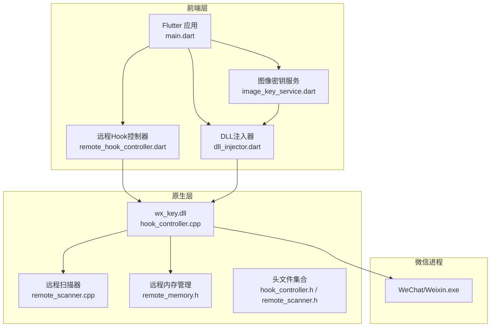
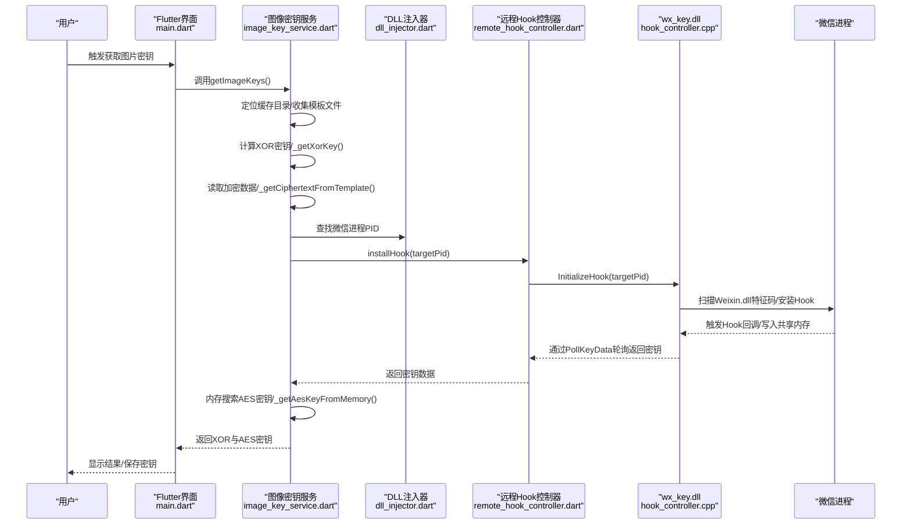
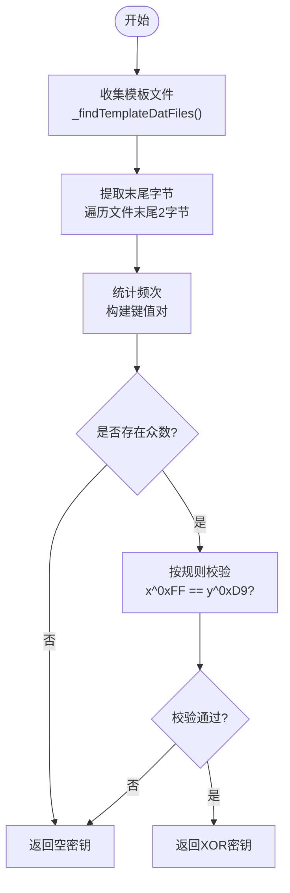
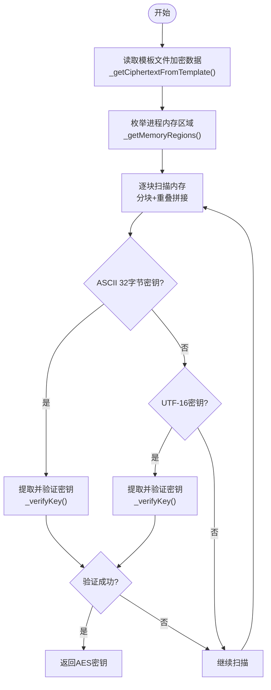
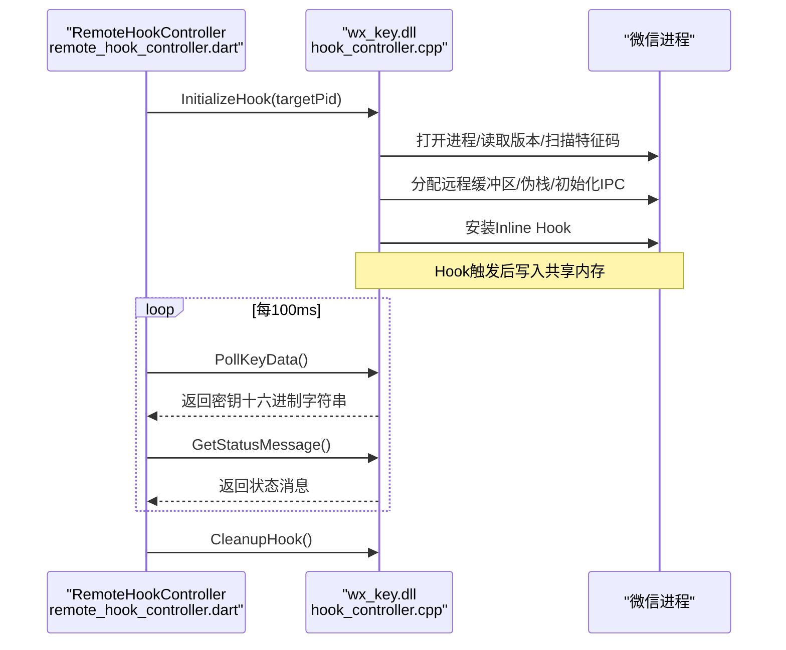
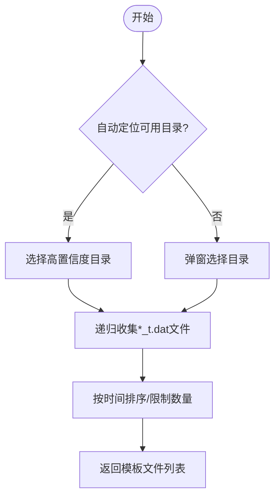
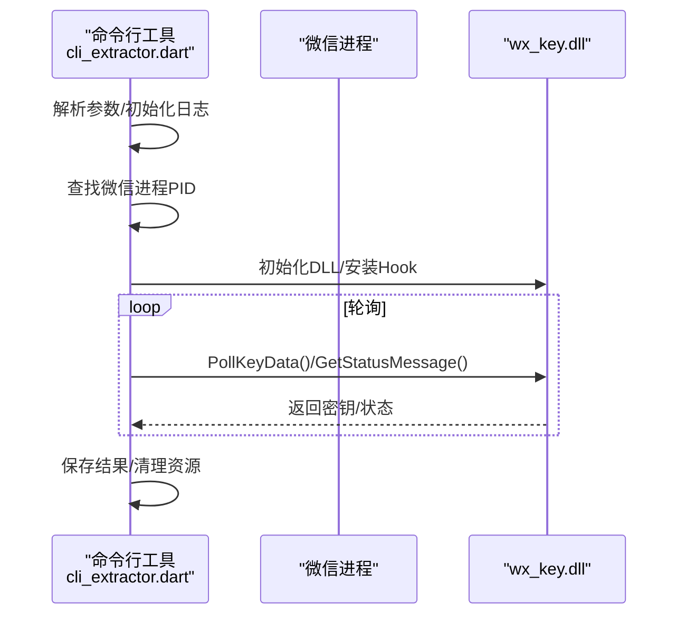
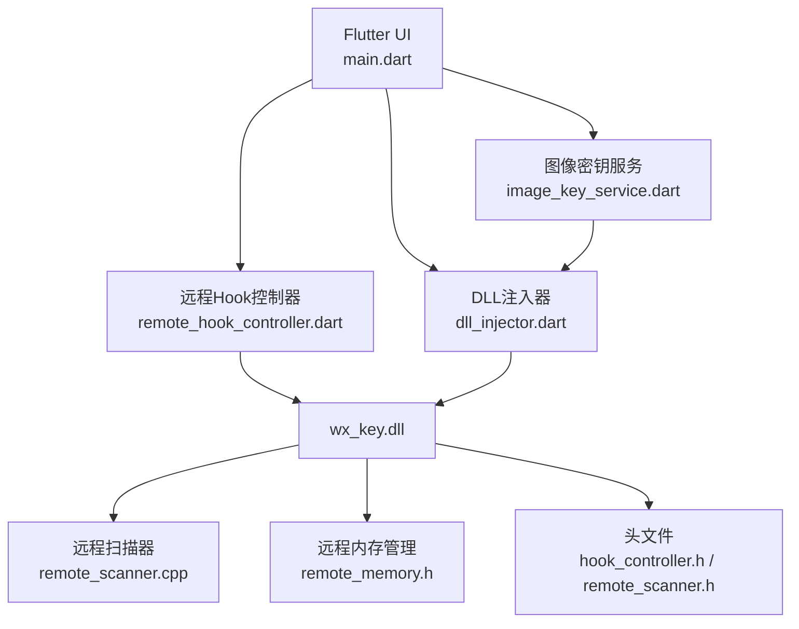

# 图片密钥提取

<cite>
**本文档引用的文件**
- [README.md](file://README.md)
- [cli_extractor.dart](file://bin/cli_extractor.dart)
- [main.dart](file://lib/main.dart)
- [image_key_service.dart](file://lib/services/image_key_service.dart)
- [remote_hook_controller.dart](file://lib/services/remote_hook_controller.dart)
- [dll_injector.dart](file://lib/services/dll_injector.dart)
- [hook_controller.h](file://wx_key/include/hook_controller.h)
- [remote_scanner.h](file://wx_key/include/remote_scanner.h)
- [remote_memory.h](file://wx_key/include/remote_memory.h)
- [hook_controller.cpp](file://wx_key/src/hook_controller.cpp)
- [remote_scanner.cpp](file://wx_key/src/remote_scanner.cpp)
</cite>

## 目录
1. [简介](#简介)
2. [项目结构](#项目结构)
3. [核心组件](#核心组件)
4. [架构总览](#架构总览)
5. [详细组件分析](#详细组件分析)
6. [依赖关系分析](#依赖关系分析)
7. [性能考量](#性能考量)
8. [故障排除指南](#故障排除指南)
9. [结论](#结论)

## 简介
本项目提供微信图片密钥提取能力，支持微信 4.0 及以上版本。其核心机制包含两个层面：
- XOR 密钥计算：基于微信版本号与模板文件末尾字节的数学关系推导出 XOR 密钥。
- AES 密钥内存搜索：在微信进程内存中搜索 32 字节 ASCII/UTF-16 密钥片段，并通过加密验证确保准确性。

项目同时提供命令行工具与 Flutter 图形界面两种使用方式，支持自动定位微信缓存目录、模板文件收集、密钥计算与内存搜索，并具备完善的日志与错误处理机制。

## 项目结构
项目采用混合架构：Flutter 前端负责 UI 与业务流程编排，C++ 原生 DLL 负责与微信进程交互、安装 Hook、扫描内存等底层操作。关键目录与文件如下：
- lib/：Flutter 前端与服务层，包含密钥服务、远程 Hook 控制器、DLL 注入器等。
- wx_key/：原生 C++ 项目，包含 Hook 控制器、远程扫描器、内存管理等头文件与源文件。
- bin/：命令行工具，提供无需 UI 的密钥提取流程。
- assets/dll/：内置的控制器 DLL，供前端或命令行调用。

图表来源
- [main.dart](file://lib/main.dart#L1-L200)
- [image_key_service.dart](file://lib/services/image_key_service.dart#L600-L698)
- [remote_hook_controller.dart](file://lib/services/remote_hook_controller.dart#L32-L128)
- [dll_injector.dart](file://lib/services/dll_injector.dart#L31-L120)
- [hook_controller.cpp](file://wx_key/src/hook_controller.cpp#L214-L379)
- [remote_scanner.cpp](file://wx_key/src/remote_scanner.cpp#L108-L261)
- [hook_controller.h](file://wx_key/include/hook_controller.h#L12-L47)
- [remote_scanner.h](file://wx_key/include/remote_scanner.h#L15-L66)

章节来源
- [README.md](file://README.md#L77-L96)
- [main.dart](file://lib/main.dart#L1-L200)

## 核心组件
- 图像密钥服务（image_key_service.dart）：负责微信缓存目录定位、模板文件收集、XOR 密钥计算、AES 密钥内存搜索与密钥验证。
- 远程 Hook 控制器（remote_hook_controller.dart）：封装 DLL 导出函数，提供轮询模式的 Hook 安装、密钥轮询与状态获取。
- DLL 注入器（dll_injector.dart）：负责微信安装路径探测、进程查找、启动与窗口等待、DLL 路径管理。
- Hook 控制器（hook_controller.cpp）：在微信进程中安装 Inline Hook，扫描目标函数，通过 IPC 将密钥数据写入共享内存并轮询返回。
- 远程扫描器（remote_scanner.cpp）：根据微信版本号选择特征码配置，扫描 Weixin.dll 中的目标函数地址。
- 远程内存管理（remote_memory.h）：封装远程内存分配与保护，用于共享数据缓冲区与伪栈。

章节来源
- [image_key_service.dart](file://lib/services/image_key_service.dart#L54-L698)
- [remote_hook_controller.dart](file://lib/services/remote_hook_controller.dart#L32-L278)
- [dll_injector.dart](file://lib/services/dll_injector.dart#L31-L200)
- [hook_controller.cpp](file://wx_key/src/hook_controller.cpp#L214-L491)
- [remote_scanner.cpp](file://wx_key/src/remote_scanner.cpp#L45-L106)
- [remote_memory.h](file://wx_key/include/remote_memory.h#L7-L104)

## 架构总览
整体流程分为两部分：数据库密钥提取与图片密钥提取。数据库密钥通过 DLL Hook 方式在微信运行时捕获，图片密钥通过模板文件与内存搜索结合的方式获取。

图表来源
- [main.dart](file://lib/main.dart#L420-L800)
- [image_key_service.dart](file://lib/services/image_key_service.dart#L600-L698)
- [remote_hook_controller.dart](file://lib/services/remote_hook_controller.dart#L89-L128)
- [hook_controller.cpp](file://wx_key/src/hook_controller.cpp#L414-L455)

## 详细组件分析

### XOR 密钥计算机制
XOR 密钥的推导基于模板文件（*_t.dat）末尾两个字节的统计规律与微信版本号的数学关系：
- 统计策略：遍历模板文件，提取每个文件末尾两个字节，形成键值对（格式为 "byte1_byte2"），统计出现频次。
- 众数选择：选择出现次数最多的键值对作为候选。
- 校验规则：对候选键值对的两个字节分别与固定常量进行异或运算，若结果一致，则认为该异或值为有效密钥。
- 版本相关：不同微信版本的模板文件结构略有差异，但 XOR 密钥的推导逻辑保持一致。

图表来源
- [image_key_service.dart](file://lib/services/image_key_service.dart#L148-L196)
- [image_key_service.dart](file://lib/services/image_key_service.dart#L198-L246)

章节来源
- [image_key_service.dart](file://lib/services/image_key_service.dart#L198-L246)

### AES 密钥内存搜索算法
AES 密钥搜索分为两个阶段：模板数据读取与内存扫描验证。
- 模板数据读取：从模板文件中提取固定偏移处的加密数据片段，作为后续解密验证的输入。
- 内存扫描：枚举微信进程的可读内存区域，按块读取并进行两类密钥模式匹配：
  - ASCII 32 字节密钥：以非字母数字字符为边界，提取连续 32 个字母数字字符。
  - UTF-16LE 存储：每隔一个字节取一个 ASCII 字符，构造 32 字节密钥。
- 密钥验证：使用 AES-ECB 模式对加密数据进行解密，若解密结果以 JPEG 头标识开头，则判定为有效密钥。

图表来源
- [image_key_service.dart](file://lib/services/image_key_service.dart#L248-L276)
- [image_key_service.dart](file://lib/services/image_key_service.dart#L308-L467)
- [image_key_service.dart](file://lib/services/image_key_service.dart#L492-L585)

章节来源
- [image_key_service.dart](file://lib/services/image_key_service.dart#L308-L467)
- [image_key_service.dart](file://lib/services/image_key_service.dart#L492-L585)

### Hook 安装与密钥轮询
Hook 控制器在微信进程中安装 Inline Hook，扫描 Weixin.dll 中的目标函数，捕获密钥后通过共享内存与轮询接口返回给前端：
- 初始化上下文：打开目标进程、检测微信版本、获取版本配置、扫描目标函数地址、分配远程数据缓冲区与伪栈、初始化 IPC。
- 安装 Hook：配置 Shellcode，启用堆栈伪造，安装 Inline Hook。
- 轮询接口：前端定期调用 PollKeyData 获取最新密钥，GetStatusMessage 获取状态消息，CleanupHook 卸载 Hook。

图表来源
- [remote_hook_controller.dart](file://lib/services/remote_hook_controller.dart#L89-L204)
- [hook_controller.cpp](file://wx_key/src/hook_controller.cpp#L214-L379)
- [hook_controller.cpp](file://wx_key/src/hook_controller.cpp#L428-L486)

章节来源
- [remote_hook_controller.dart](file://lib/services/remote_hook_controller.dart#L89-L204)
- [hook_controller.cpp](file://wx_key/src/hook_controller.cpp#L214-L379)

### 微信缓存目录遍历与文件处理
图像密钥服务提供自动与手动两种缓存目录定位方式：
- 自动定位：枚举用户文档目录下的 xwechat_files，筛选潜在账号目录，检查是否存在 db_storage 或 FileStorage/Image 等关键子目录。
- 手动选择：通过文件对话框让用户选择目标目录。
- 模板文件收集：递归搜索 *_t.dat 文件，按时间排序并限制数量，用于 XOR 密钥计算与 AES 密钥验证。

图表来源
- [image_key_service.dart](file://lib/services/image_key_service.dart#L54-L147)

章节来源
- [image_key_service.dart](file://lib/services/image_key_service.dart#L54-L147)

### 命令行工具与交互流程
命令行工具提供无需 UI 的密钥提取流程，支持参数配置与日志输出：
- 参数解析：支持 PID、DLL 路径、轮询间隔、超时时间、输出文件与详细日志。
- 进程查找：优先通过模块 Weixin.dll 定位进程，其次通过 Weixin.exe 或内存占用最大者回退。
- 提取流程：初始化 DLL、安装 Hook、轮询密钥、输出结果并保存到文件。

图表来源
- [cli_extractor.dart](file://bin/cli_extractor.dart#L430-L561)
- [cli_extractor.dart](file://bin/cli_extractor.dart#L325-L418)

章节来源
- [cli_extractor.dart](file://bin/cli_extractor.dart#L430-L561)
- [cli_extractor.dart](file://bin/cli_extractor.dart#L325-L418)

## 依赖关系分析
- 前端依赖：Flutter、win32、ffi、pointycastle、file_picker 等。
- 原生依赖：Windows API、间接系统调用封装、远程内存管理、特征码扫描。
- 版本兼容：通过版本配置管理器为不同微信版本选择对应的特征码与偏移，确保 Hook 安装的稳定性。

图表来源
- [main.dart](file://lib/main.dart#L1-L200)
- [image_key_service.dart](file://lib/services/image_key_service.dart#L600-L698)
- [remote_hook_controller.dart](file://lib/services/remote_hook_controller.dart#L32-L128)
- [dll_injector.dart](file://lib/services/dll_injector.dart#L31-L120)
- [hook_controller.cpp](file://wx_key/src/hook_controller.cpp#L214-L379)
- [remote_scanner.cpp](file://wx_key/src/remote_scanner.cpp#L45-L106)
- [remote_memory.h](file://wx_key/include/remote_memory.h#L7-L104)
- [hook_controller.h](file://wx_key/include/hook_controller.h#L12-L47)
- [remote_scanner.h](file://wx_key/include/remote_scanner.h#L15-L66)

章节来源
- [main.dart](file://lib/main.dart#L1-L200)
- [hook_controller.cpp](file://wx_key/src/hook_controller.cpp#L214-L379)

## 性能考量
- 内存扫描优化：采用 4MB 分块扫描与 65 字节重叠，兼顾性能与完整性；跳过大内存区域以减少无效扫描。
- 轮询频率：默认 100ms 轮询，平衡响应速度与系统开销；命令行工具可调整轮询间隔与超时时间。
- 版本适配：通过特征码配置管理器针对不同版本选择最优扫描策略，降低误匹配概率。
- I/O 限制：模板文件收集限制数量并按时间排序，避免过多文件影响性能。

## 故障排除指南
- DLL 加载失败：确保 DLL 文件路径正确且不含中文字符；检查权限与杀软拦截。
- 进程未找到：确认微信已启动并存在 Weixin.exe；必要时通过任务管理器结束旧进程后重启。
- Hook 安装失败：查看状态消息与最后错误信息；确认微信版本受支持；尝试以管理员权限运行。
- 内存搜索超时：按建议流程重新登录微信并打开图片；确保微信进程处于活跃状态。
- 密钥为空：检查模板文件是否存在；确认微信缓存目录正确；必要时手动选择目录。

章节来源
- [remote_hook_controller.dart](file://lib/services/remote_hook_controller.dart#L237-L253)
- [hook_controller.cpp](file://wx_key/src/hook_controller.cpp#L488-L490)
- [image_key_service.dart](file://lib/services/image_key_service.dart#L665-L686)

## 结论
本项目通过 XOR 密钥与 AES 密钥双算法机制，结合模板文件统计与内存搜索验证，实现了对微信图片缓存密钥的稳定提取。前端提供图形与命令行两种使用方式，原生层通过 Hook 与远程扫描保障兼容性与安全性。建议在合法合规的前提下使用，并遵循项目免责声明与安全警示。