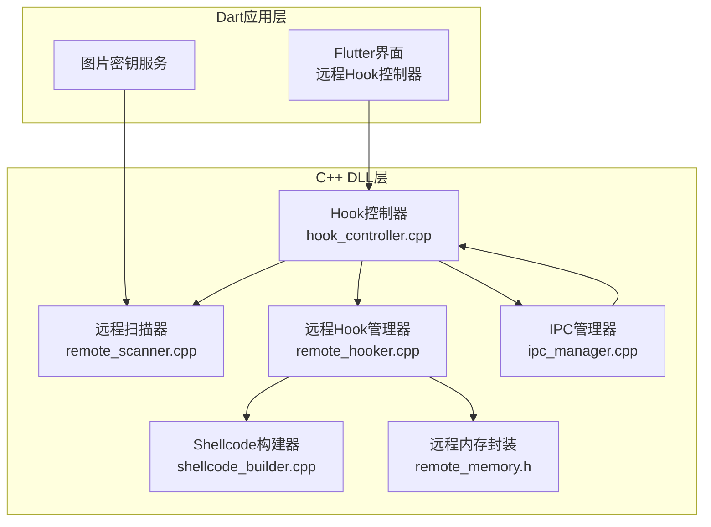
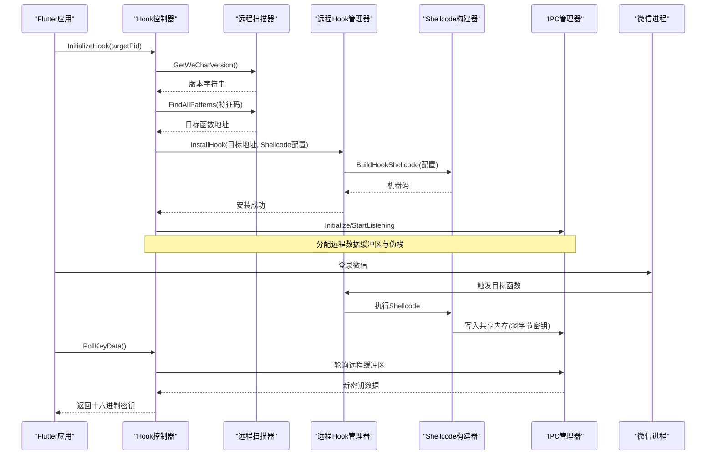
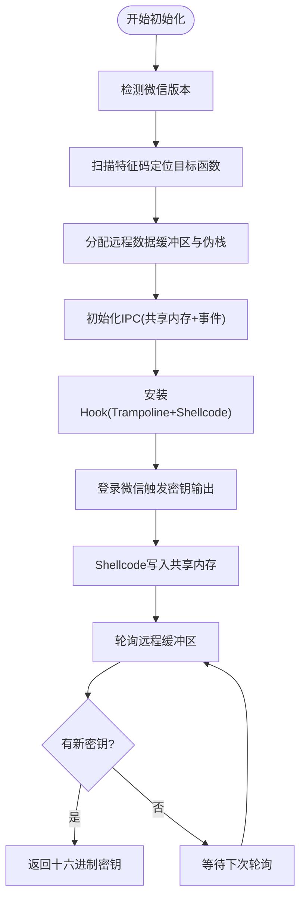
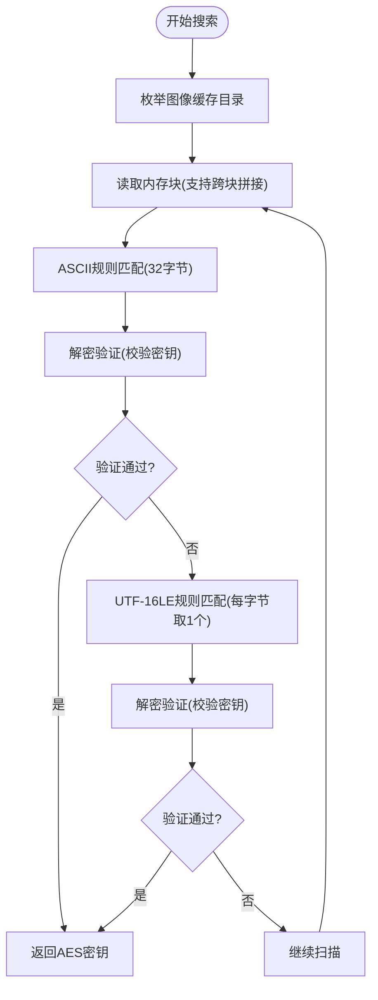
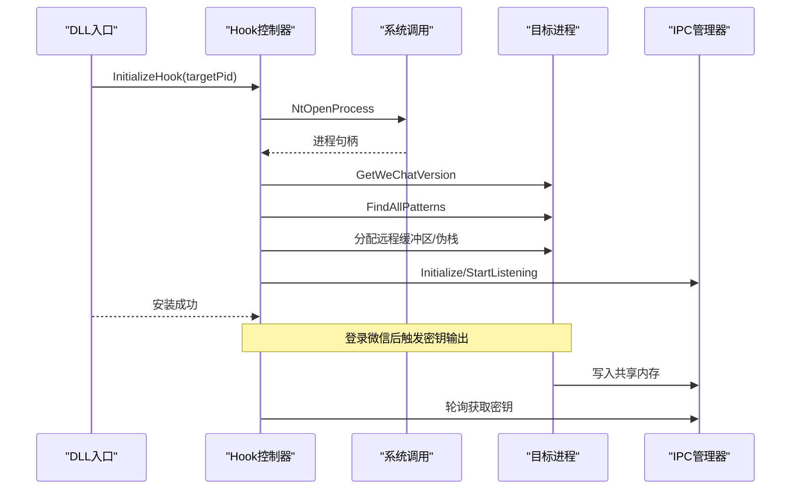
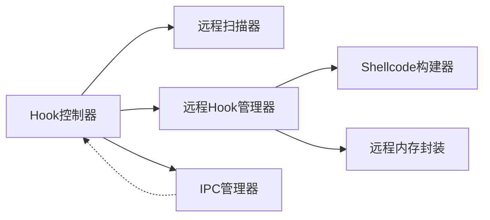

# 密钥提取核心功能

<cite>
**本文档引用的文件**
- [hook_controller.cpp](file://wx_key/src/hook_controller.cpp)
- [hook_controller.h](file://wx_key/include/hook_controller.h)
- [remote_scanner.cpp](file://wx_key/src/remote_scanner.cpp)
- [remote_scanner.h](file://wx_key/include/remote_scanner.h)
- [remote_hooker.cpp](file://wx_key/src/remote_hooker.cpp)
- [remote_hooker.h](file://wx_key/include/remote_hooker.h)
- [shellcode_builder.cpp](file://wx_key/src/shellcode_builder.cpp)
- [shellcode_builder.h](file://wx_key/include/shellcode_builder.h)
- [ipc_manager.cpp](file://wx_key/src/ipc_manager.cpp)
- [ipc_manager.h](file://wx_key/include/ipc_manager.h)
- [remote_memory.h](file://wx_key/include/remote_memory.h)
- [dllmain.cpp](file://wx_key/dllmain.cpp)
- [image_key_service.dart](file://lib/services/image_key_service.dart)
</cite>

## 目录
1. [简介](#简介)
2. [项目结构](#项目结构)
3. [核心组件](#核心组件)
4. [架构总览](#架构总览)
5. [详细组件分析](#详细组件分析)
6. [依赖关系分析](#依赖关系分析)
7. [性能考虑](#性能考虑)
8. [故障排除指南](#故障排除指南)
9. [结论](#结论)
10. [附录](#附录)

## 简介
本文件面向微信密钥提取系统的密钥提取核心功能，重点解析两大机制：
- 数据库密钥提取：通过在微信进程中安装Hook，拦截密钥输出并经由共享内存轮询获取。
- 图片密钥提取：通过内存搜索算法在微信图像缓存中定位并验证AES密钥。

同时，文档详细阐述RemoteHookController的工作流程（DLL初始化、Hook安装、数据轮询、状态监控），解释图片密钥提取算法（XOR密钥计算与AES密钥内存搜索），并提供完整的代码示例路径、错误处理策略与性能优化建议。

## 项目结构
该项目采用分层设计：
- C++ DLL层：负责Hook安装、内存扫描、IPC轮询等底层逻辑。
- Dart应用层：负责UI交互、DLL注入、密钥验证与用户反馈。
- 关键头文件定义了跨模块接口与数据结构。

图表来源
- [hook_controller.cpp](file://wx_key/src/hook_controller.cpp#L1-L491)
- [remote_scanner.cpp](file://wx_key/src/remote_scanner.cpp#L1-L261)
- [remote_hooker.cpp](file://wx_key/src/remote_hooker.cpp#L1-L419)
- [shellcode_builder.cpp](file://wx_key/src/shellcode_builder.cpp#L1-L151)
- [ipc_manager.cpp](file://wx_key/src/ipc_manager.cpp#L1-L273)
- [remote_memory.h](file://wx_key/include/remote_memory.h#L1-L107)

章节来源
- [hook_controller.cpp](file://wx_key/src/hook_controller.cpp#L1-L491)
- [hook_controller.h](file://wx_key/include/hook_controller.h#L1-L50)

## 核心组件
- Hook控制器：负责初始化上下文、版本检测、函数扫描、Hook安装、IPC轮询与状态管理。
- 远程扫描器：负责枚举模块、特征码扫描、版本读取与内存读取。
- 远程Hook管理器：负责Trampoline生成、Shellcode写入、Inline Patch安装与卸载。
- Shellcode构建器：使用Xbyak生成x64汇编，实现密钥拷贝、序列号递增与返回Trampoline。
- IPC管理器：在本地创建共享内存与事件，启动监听线程轮询远程缓冲区。
- 远程内存封装：基于NtAllocateVirtualMemory/NtProtectVirtualMemory的RAII封装。
- 图片密钥服务：在Dart侧实现XOR密钥计算与AES密钥内存搜索验证。

章节来源
- [remote_scanner.h](file://wx_key/include/remote_scanner.h#L1-L70)
- [remote_hooker.h](file://wx_key/include/remote_hooker.h#L1-L73)
- [shellcode_builder.h](file://wx_key/include/shellcode_builder.h#L1-L38)
- [ipc_manager.h](file://wx_key/include/ipc_manager.h#L1-L80)
- [remote_memory.h](file://wx_key/include/remote_memory.h#L1-L107)
- [image_key_service.dart](file://lib/services/image_key_service.dart#L1-L698)

## 架构总览
下图展示了数据库密钥提取的端到端流程：Flutter调用DLL，DLL进行Hook安装，微信进程触发密钥输出，Shellcode写入共享内存，DLL轮询获取密钥。

图表来源
- [hook_controller.cpp](file://wx_key/src/hook_controller.cpp#L214-L379)
- [remote_scanner.cpp](file://wx_key/src/remote_scanner.cpp#L158-L204)
- [remote_hooker.cpp](file://wx_key/src/remote_hooker.cpp#L278-L389)
- [shellcode_builder.cpp](file://wx_key/src/shellcode_builder.cpp#L28-L150)
- [ipc_manager.cpp](file://wx_key/src/ipc_manager.cpp#L206-L271)

## 详细组件分析

### 数据库密钥提取机制
该机制通过在微信进程中安装Inline Hook，拦截密钥输出并写入共享内存，随后由控制器轮询获取。

- 版本检测与配置选择
  - 使用远程扫描器读取Weixin.dll版本，根据版本选择对应特征码与偏移。
  - 版本配置管理器维护多版本特征码集合，按范围匹配。

- 函数扫描与目标地址定位
  - 枚举远程模块，读取模块基址与大小。
  - 分块读取远程内存，使用掩码匹配特征码，返回精确地址并加偏移。

- Hook安装与Shellcode生成
  - 生成Trampoline保存原始指令并跳回原函数。
  - 构建x64 Shellcode：保存寄存器、校验密钥长度、复制32字节到共享内存、递增序列号、恢复寄存器并跳回Trampoline。
  - 写入Shellcode到远程内存并设置可执行权限，生成跳转指令覆盖原函数开头。

- IPC轮询与密钥获取
  - 控制器分配远程数据缓冲区与伪栈，初始化IPC并在本地创建共享内存与事件。
  - 启动监听线程，周期性读取远程缓冲区，通过序列号去重并回调通知。
  - 外层轮询接口PollKeyData非阻塞获取最新密钥。

图表来源
- [hook_controller.cpp](file://wx_key/src/hook_controller.cpp#L214-L379)
- [remote_scanner.cpp](file://wx_key/src/remote_scanner.cpp#L158-L204)
- [shellcode_builder.cpp](file://wx_key/src/shellcode_builder.cpp#L28-L150)
- [ipc_manager.cpp](file://wx_key/src/ipc_manager.cpp#L212-L271)

章节来源
- [hook_controller.cpp](file://wx_key/src/hook_controller.cpp#L214-L379)
- [remote_scanner.cpp](file://wx_key/src/remote_scanner.cpp#L158-L204)
- [remote_hooker.cpp](file://wx_key/src/remote_hooker.cpp#L278-L389)
- [shellcode_builder.cpp](file://wx_key/src/shellcode_builder.cpp#L28-L150)
- [ipc_manager.cpp](file://wx_key/src/ipc_manager.cpp#L212-L271)

### 图片密钥提取算法
该算法在微信图像缓存中搜索32字节ASCII密钥，兼容UTF-16LE存储格式，并通过解密验证确认密钥有效性。

- XOR密钥计算
  - 从模板文件*_t.dat中提取XOR密钥，作为后续解密的输入。

- AES密钥内存搜索
  - 递归扫描用户目录下的图像缓存，读取内存块并拼接跨块数据。
  - 使用ASCII规则匹配：前后非字母数字，中间32个字母数字，形成正则类似模式[^a-zA-Z0-9][a-zA-Z0-9]{32}[^a-zA-Z0-9]。
  - 兼容UTF-16LE存储：每两个字节取一个字节组成32字节ASCII密钥。
  - 对候选密钥进行解密验证，确认为有效AES密钥后返回。

图表来源
- [image_key_service.dart](file://lib/services/image_key_service.dart#L367-L479)

章节来源
- [image_key_service.dart](file://lib/services/image_key_service.dart#L198-L479)

### RemoteHookController工作流程
- DLL初始化
  - DllMain在进程附加时禁用库调用线程化，进程分离时自动清理Hook。
- Hook安装
  - 初始化系统调用、打开目标进程、检测版本、扫描函数、分配远程缓冲区与伪栈、初始化IPC、安装Hook。
- 数据轮询
  - 启动监听线程，周期性读取远程缓冲区，通过序列号去重并回调通知。
- 状态监控
  - 统一的状态消息队列，支持分级日志输出与队列长度限制。

图表来源
- [dllmain.cpp](file://wx_key/dllmain.cpp#L11-L24)
- [hook_controller.cpp](file://wx_key/src/hook_controller.cpp#L214-L379)
- [ipc_manager.cpp](file://wx_key/src/ipc_manager.cpp#L206-L271)

章节来源
- [dllmain.cpp](file://wx_key/dllmain.cpp#L11-L24)
- [hook_controller.cpp](file://wx_key/src/hook_controller.cpp#L214-L379)
- [ipc_manager.cpp](file://wx_key/src/ipc_manager.cpp#L206-L271)

## 依赖关系分析
- 组件耦合
  - Hook控制器依赖远程扫描器、远程Hook管理器、IPC管理器与远程内存封装。
  - 远程Hook管理器依赖Shellcode构建器与远程内存封装。
  - IPC管理器独立于Hook控制器，仅通过共享内存与事件交互。
- 外部依赖
  - Windows NTDLL系统调用（NtReadVirtualMemory/NtWriteVirtualMemory/NtAllocateVirtualMemory/NtProtectVirtualMemory）。
  - Xbyak用于x64汇编代码生成。
  - Dart侧使用win32包进行Windows API调用与加密库进行密钥验证。

图表来源
- [hook_controller.cpp](file://wx_key/src/hook_controller.cpp#L1-L491)
- [remote_hooker.cpp](file://wx_key/src/remote_hooker.cpp#L1-L419)
- [shellcode_builder.cpp](file://wx_key/src/shellcode_builder.cpp#L1-L151)
- [ipc_manager.cpp](file://wx_key/src/ipc_manager.cpp#L1-L273)
- [remote_memory.h](file://wx_key/include/remote_memory.h#L1-L107)

章节来源
- [hook_controller.cpp](file://wx_key/src/hook_controller.cpp#L1-L491)
- [remote_hooker.cpp](file://wx_key/src/remote_hooker.cpp#L1-L419)
- [shellcode_builder.cpp](file://wx_key/src/shellcode_builder.cpp#L1-L151)
- [ipc_manager.cpp](file://wx_key/src/ipc_manager.cpp#L1-L273)
- [remote_memory.h](file://wx_key/include/remote_memory.h#L1-L107)

## 性能考虑
- 内存扫描优化
  - 远程扫描器采用分块读取（1MB）与本地缓冲区匹配，减少系统调用次数。
  - 特征码掩码支持通配符，提高匹配鲁棒性。
- Hook性能
  - Inline Patch模式保证稳定性；必要时可考虑硬件断点+VEH模式（代码预留）。
  - Shellcode仅保存/恢复关键寄存器，避免额外开销。
- IPC轮询
  - 轮询间隔加入轻微抖动（80-143ms），降低特征化风险。
  - 通过序列号去重，避免重复处理与写回清零。
- 内存管理
  - 远程内存封装使用RAII，确保分配与释放成对出现。
  - 伪栈对齐至16字节，减少栈相关异常。

## 故障排除指南
- 初始化失败
  - 检查目标进程是否运行、权限是否足够、版本是否受支持。
  - 查看状态消息队列中的错误级别与描述。
- Hook安装失败
  - 确认特征码匹配结果数量为1；检查目标函数地址与偏移。
  - 验证远程内存分配与保护设置是否成功。
- IPC通信异常
  - 检查共享内存与事件名称生成是否冲突；尝试本地作用域回退。
  - 确认监听线程已启动且未提前退出。
- 密钥获取为空
  - 确认微信已登录并触发密钥输出；检查PollKeyData缓冲区大小（至少65字节）。
  - 验证序列号递增与远程缓冲区清零逻辑。

章节来源
- [hook_controller.cpp](file://wx_key/src/hook_controller.cpp#L177-L181)
- [hook_controller.cpp](file://wx_key/src/hook_controller.cpp#L225-L232)
- [remote_hooker.cpp](file://wx_key/src/remote_hooker.cpp#L391-L417)
- [ipc_manager.cpp](file://wx_key/src/ipc_manager.cpp#L163-L182)
- [ipc_manager.cpp](file://wx_key/src/ipc_manager.cpp#L212-L271)

## 结论
本系统通过稳定可靠的Hook安装与IPC轮询机制，实现了数据库密钥的实时提取；通过严谨的内存搜索与解密验证，实现了图片密钥的自动化提取。整体设计在安全性、稳定性与性能之间取得平衡，适合在生产环境中使用。

## 附录
- 关键API与数据结构
  - Hook控制器导出：InitializeHook、PollKeyData、GetStatusMessage、CleanupHook、GetLastErrorMsg。
  - IPC共享数据结构：SharedKeyData（dataSize、keyBuffer[32]、sequenceNumber）。
  - 版本配置：WeChatVersionConfig（pattern、mask、offset）。
- 代码示例路径
  - 数据库密钥提取初始化与轮询：[hook_controller.cpp](file://wx_key/src/hook_controller.cpp#L415-L490)
  - 远程特征码扫描：[remote_scanner.cpp](file://wx_key/src/remote_scanner.cpp#L158-L204)
  - Hook安装与Shellcode生成：[remote_hooker.cpp](file://wx_key/src/remote_hooker.cpp#L278-L389)、[shellcode_builder.cpp](file://wx_key/src/shellcode_builder.cpp#L28-L150)
  - IPC轮询实现：[ipc_manager.cpp](file://wx_key/src/ipc_manager.cpp#L206-L271)
  - 图片密钥搜索与验证：[image_key_service.dart](file://lib/services/image_key_service.dart#L367-L479)