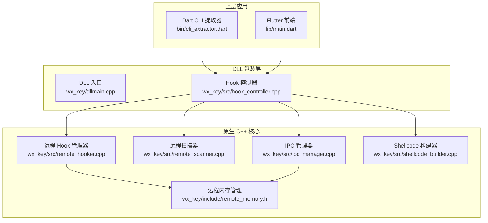
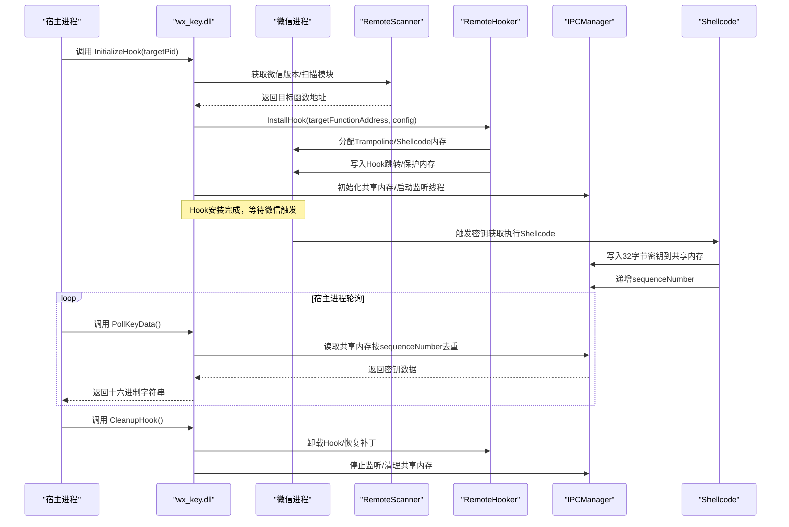
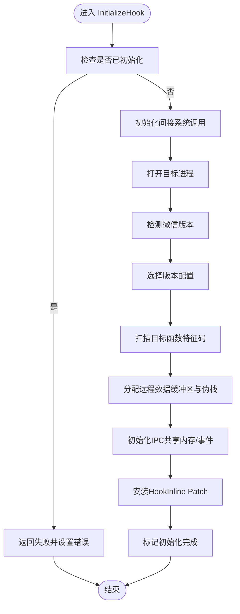
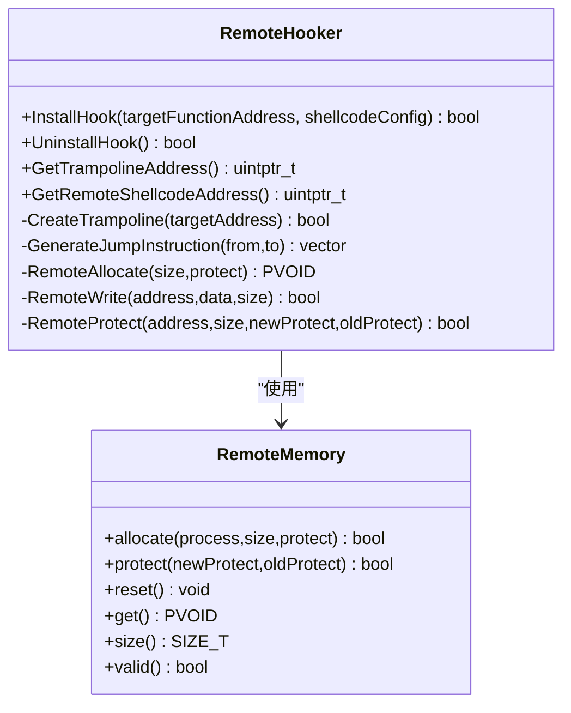
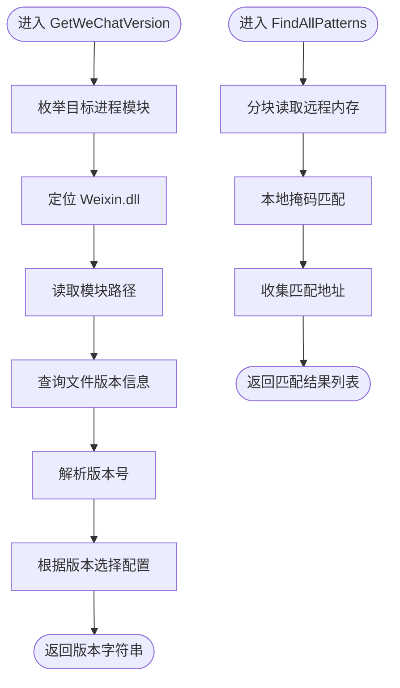
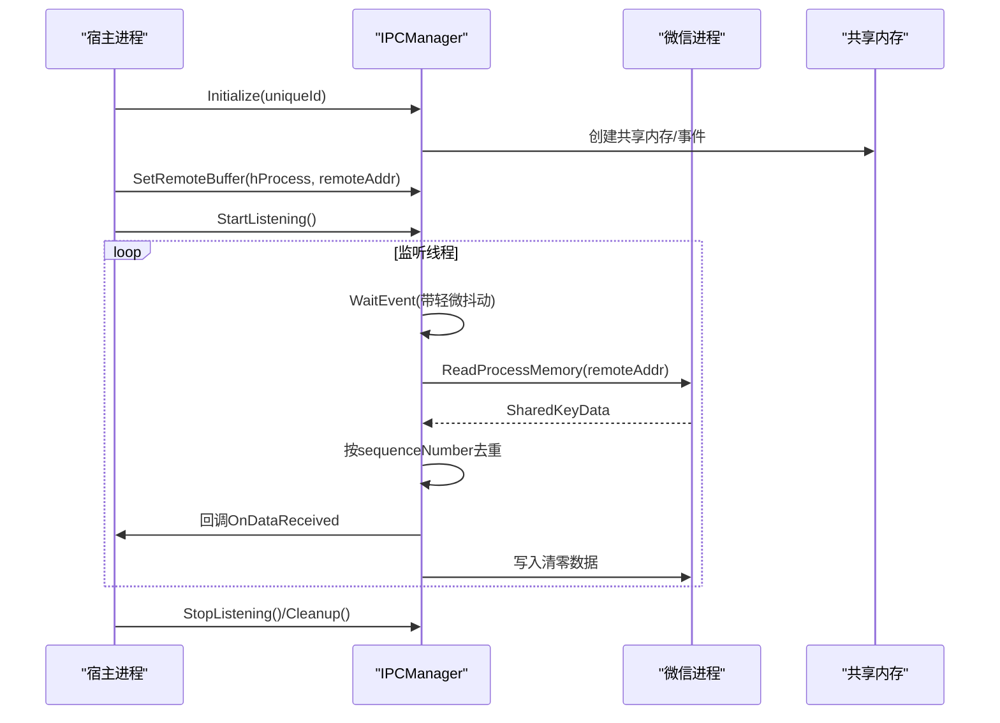
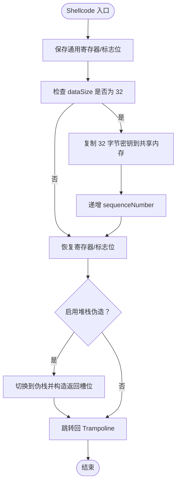
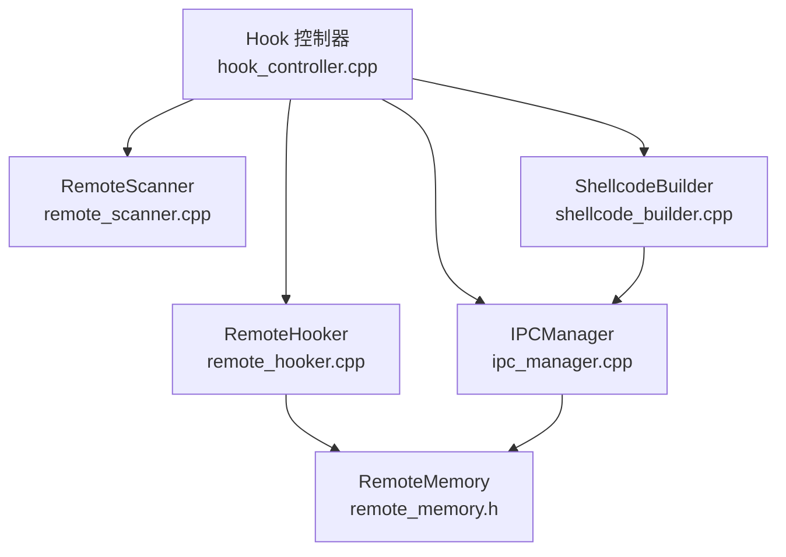
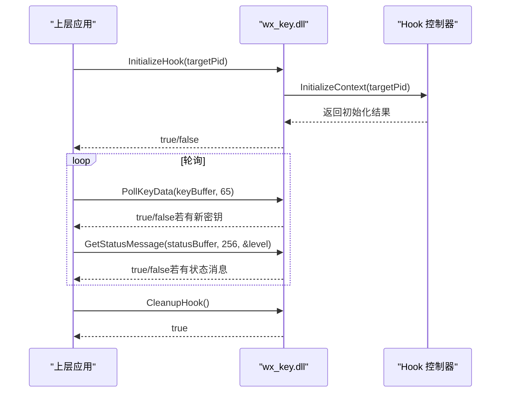

# 数据库密钥提取

<cite>
**本文档引用的文件**
- [hook_controller.cpp](file://wx_key/src/hook_controller.cpp)
- [hook_controller.h](file://wx_key/include/hook_controller.h)
- [remote_hooker.cpp](file://wx_key/src/remote_hooker.cpp)
- [remote_hooker.h](file://wx_key/include/remote_hooker.h)
- [remote_memory.h](file://wx_key/include/remote_memory.h)
- [ipc_manager.cpp](file://wx_key/src/ipc_manager.cpp)
- [ipc_manager.h](file://wx_key/include/ipc_manager.h)
- [remote_scanner.cpp](file://wx_key/src/remote_scanner.cpp)
- [remote_scanner.h](file://wx_key/include/remote_scanner.h)
- [shellcode_builder.cpp](file://wx_key/src/shellcode_builder.cpp)
- [shellcode_builder.h](file://wx_key/include/shellcode_builder.h)
- [dllmain.cpp](file://wx_key/dllmain.cpp)
- [cli_extractor.dart](file://bin/cli_extractor.dart)
- [dll_usage.md](file://docs/dll_usage.md)
- [README.md](file://README.md)
</cite>

## 目录
1. [简介](#简介)
2. [项目结构](#项目结构)
3. [核心组件](#核心组件)
4. [架构总览](#架构总览)
5. [详细组件分析](#详细组件分析)
6. [依赖关系分析](#依赖关系分析)
7. [性能考量](#性能考量)
8. [故障排除指南](#故障排除指南)
9. [结论](#结论)
10. [附录](#附录)

## 简介
本项目提供了一个针对微信 4.x 版本的数据库密钥提取方案，通过在微信进程中安装 Hook，拦截密钥获取流程并将密钥写入共享内存，随后由宿主进程通过轮询方式读取密钥。该方案采用 DLL 化设计，提供稳定的 C 风格导出接口，便于在多种上层语言（如 Flutter/Dart、C#、C++）中集成。

## 项目结构
项目主要分为三层：
- 原生 C++ 层：负责 Hook 安装、远程内存操作、特征码扫描、Shellcode 生成与注入、IPC 轮询等核心逻辑。
- DLL 包装层：通过导出函数暴露统一接口，供上层应用调用。
- 上层应用层：通过 FFI/Dart 或 P/Invoke 调用 DLL，实现密钥提取的完整生命周期管理。

**图表来源**
- [dllmain.cpp](file://wx_key/dllmain.cpp#L1-L24)
- [hook_controller.cpp](file://wx_key/src/hook_controller.cpp#L1-L491)
- [remote_hooker.cpp](file://wx_key/src/remote_hooker.cpp#L1-L419)
- [remote_scanner.cpp](file://wx_key/src/remote_scanner.cpp#L1-L261)
- [ipc_manager.cpp](file://wx_key/src/ipc_manager.cpp#L1-L273)
- [shellcode_builder.cpp](file://wx_key/src/shellcode_builder.cpp#L1-L151)
- [remote_memory.h](file://wx_key/include/remote_memory.h#L1-L107)

**章节来源**
- [README.md](file://README.md#L77-L96)
- [dll_usage.md](file://docs/dll_usage.md#L1-L165)

## 核心组件
- Hook 控制器：负责初始化上下文、安装 Hook、轮询密钥数据、状态上报与错误处理。
- 远程 Hook 管理器：负责在目标进程创建 Trampoline、生成并写入 Shellcode、设置内存保护、恢复补丁。
- 远程扫描器：负责枚举模块、读取内存、特征码匹配、版本识别与配置选择。
- IPC 管理器：负责创建共享内存与事件、启动监听线程、轮询远程缓冲区、回调数据处理。
- Shellcode 构建器：负责根据配置生成 x64 汇编 Shellcode，将密钥写入共享内存并递增序列号。
- 远程内存管理：提供 RAII 封装的远程内存分配、保护与释放。

**章节来源**
- [hook_controller.h](file://wx_key/include/hook_controller.h#L12-L46)
- [remote_hooker.h](file://wx_key/include/remote_hooker.h#L9-L40)
- [remote_scanner.h](file://wx_key/include/remote_scanner.h#L15-L35)
- [ipc_manager.h](file://wx_key/include/ipc_manager.h#L18-L53)
- [shellcode_builder.h](file://wx_key/include/shellcode_builder.h#L8-L28)
- [remote_memory.h](file://wx_key/include/remote_memory.h#L7-L34)

## 架构总览
整体架构围绕“Hook 安装—密钥拦截—共享内存—轮询读取”的闭环展开。DLL 在宿主进程中初始化，扫描微信进程并定位目标函数，安装 Hook 后，当微信触发密钥获取时，Shellcode 将 32 字节密钥写入共享内存并递增序列号。宿主进程通过轮询机制读取共享内存，获取密钥十六进制字符串并进行后续处理。

**图表来源**
- [hook_controller.cpp](file://wx_key/src/hook_controller.cpp#L214-L379)
- [remote_hooker.cpp](file://wx_key/src/remote_hooker.cpp#L278-L389)
- [ipc_manager.cpp](file://wx_key/src/ipc_manager.cpp#L212-L271)
- [shellcode_builder.cpp](file://wx_key/src/shellcode_builder.cpp#L28-L150)

**章节来源**
- [dll_usage.md](file://docs/dll_usage.md#L7-L18)
- [hook_controller.cpp](file://wx_key/src/hook_controller.cpp#L414-L491)

## 详细组件分析

### Hook 控制器（RemoteHookController）
Hook 控制器是 DLL 的核心协调者，负责：
- 初始化上下文：打开目标进程、检测微信版本、选择版本配置、扫描目标函数、分配远程缓冲区与伪栈、初始化 IPC、安装 Hook。
- 数据轮询：提供非阻塞的 PollKeyData 接口，将 32 字节密钥转换为 64 字节十六进制字符串返回。
- 状态管理：维护状态消息队列，支持分级日志输出。
- 错误处理：统一错误格式化与最后错误存储，便于上层诊断。

关键函数与行为：
- InitializeHook：执行完整的初始化流程，返回成功/失败状态。
- PollKeyData：非阻塞轮询，返回新密钥后自动清空缓冲。
- GetStatusMessage：从内部队列取出一条状态消息，支持 0=Info、1=Success、2=Error 三级别。
- CleanupHook：卸载 Hook、停止 IPC、释放远程内存与句柄。

**图表来源**
- [hook_controller.cpp](file://wx_key/src/hook_controller.cpp#L214-L379)

**章节来源**
- [hook_controller.cpp](file://wx_key/src/hook_controller.cpp#L24-L211)
- [hook_controller.cpp](file://wx_key/src/hook_controller.cpp#L414-L491)
- [hook_controller.h](file://wx_key/include/hook_controller.h#L12-L46)

### 远程 Hook 管理器（RemoteHooker）
负责在目标进程内完成 Hook 的安装与卸载：
- 创建 Trampoline：备份目标函数的若干字节指令，以便 Hook 后继续执行。
- 生成 Shellcode：根据配置写入跳转回 Trampoline 的指令。
- 写入与保护：在目标进程分配内存、写入 Shellcode、设置可执行权限。
- 安装与恢复：写入 Hook 跳转指令（Inline Patch），并在卸载时恢复原始指令。

**图表来源**
- [remote_hooker.h](file://wx_key/include/remote_hooker.h#L9-L70)
- [remote_memory.h](file://wx_key/include/remote_memory.h#L7-L104)

**章节来源**
- [remote_hooker.cpp](file://wx_key/src/remote_hooker.cpp#L97-L419)
- [remote_hooker.h](file://wx_key/include/remote_hooker.h#L9-L70)
- [remote_memory.h](file://wx_key/include/remote_memory.h#L7-L107)

### 远程扫描器（RemoteScanner）
负责在目标进程内进行模块枚举、内存读取与特征码匹配：
- 模块信息：获取 Weixin.dll 的基址与大小。
- 特征码扫描：分块读取内存，使用掩码匹配算法查找目标函数地址。
- 版本配置：根据微信版本选择对应的特征码与偏移。
- 版本识别：读取模块文件版本号，用于配置选择。

**图表来源**
- [remote_scanner.cpp](file://wx_key/src/remote_scanner.cpp#L219-L259)
- [remote_scanner.cpp](file://wx_key/src/remote_scanner.cpp#L163-L204)

**章节来源**
- [remote_scanner.cpp](file://wx_key/src/remote_scanner.cpp#L108-L261)
- [remote_scanner.h](file://wx_key/include/remote_scanner.h#L15-L70)

### IPC 管理器（IPCManager）
负责在宿主进程与目标进程之间建立 IPC 通道：
- 共享内存：创建固定大小的共享内存，承载密钥数据结构。
- 事件同步：创建事件对象，用于唤醒监听线程。
- 轮询监听：在独立线程中周期性读取共享内存，按序列号去重，回调上层处理。
- 资源清理：停止监听线程、解除映射、关闭句柄。

**图表来源**
- [ipc_manager.cpp](file://wx_key/src/ipc_manager.cpp#L24-L132)
- [ipc_manager.cpp](file://wx_key/src/ipc_manager.cpp#L212-L271)

**章节来源**
- [ipc_manager.cpp](file://wx_key/src/ipc_manager.cpp#L1-L273)
- [ipc_manager.h](file://wx_key/include/ipc_manager.h#L18-L76)

### Shellcode 构建器（ShellcodeBuilder）
负责生成 x64 汇编代码，实现密钥拦截与写入：
- 寄存器保存/恢复：在进入与退出时保存/恢复通用寄存器。
- 密钥拷贝：当 dataSize==32 时，将密钥从源地址复制到共享内存。
- 序列号递增：每次写入后递增 sequenceNumber，用于去重。
- 堆栈伪造：可选启用，将关键寄存器暂存到真实栈，切换到对齐后的伪栈，再恢复真实栈。

**图表来源**
- [shellcode_builder.cpp](file://wx_key/src/shellcode_builder.cpp#L28-L150)

**章节来源**
- [shellcode_builder.cpp](file://wx_key/src/shellcode_builder.cpp#L1-L151)
- [shellcode_builder.h](file://wx_key/include/shellcode_builder.h#L8-L34)

### DLL 入口与生命周期
- DLL 入口：在 DLL_PROCESS_ATTACH 时禁用线程库调用，DLL_PROCESS_DETACH 时自动清理。
- 生命周期：上层应用负责调用 InitializeHook/CleanupHook，确保 Hook 安全安装与卸载。

**章节来源**
- [dllmain.cpp](file://wx_key/dllmain.cpp#L11-L24)

## 依赖关系分析
- Hook 控制器依赖远程扫描器、远程 Hook 管理器、IPC 管理器、Shellcode 构建器与远程内存管理。
- 远程 Hook 管理器依赖远程内存管理与系统调用封装。
- IPC 管理器依赖系统调用与字符串混淆工具（用于命名对象）。
- Shellcode 构建器依赖 Xbyak 代码生成库与共享内存结构定义。

**图表来源**
- [hook_controller.cpp](file://wx_key/src/hook_controller.cpp#L11-L20)
- [remote_hooker.cpp](file://wx_key/src/remote_hooker.cpp#L1-L6)
- [ipc_manager.cpp](file://wx_key/src/ipc_manager.cpp#L1-L7)
- [shellcode_builder.cpp](file://wx_key/src/shellcode_builder.cpp#L1-L5)

**章节来源**
- [hook_controller.cpp](file://wx_key/src/hook_controller.cpp#L1-L20)
- [remote_hooker.cpp](file://wx_key/src/remote_hooker.cpp#L1-L6)
- [ipc_manager.cpp](file://wx_key/src/ipc_manager.cpp#L1-L7)
- [shellcode_builder.cpp](file://wx_key/src/shellcode_builder.cpp#L1-L5)

## 性能考量
- 轮询间隔：CLI 默认 100ms，兼顾响应速度与 CPU 占用。可根据场景调整，过短会增加 CPU 占用，过长会延迟密钥获取。
- 抖动机制：IPC 监听线程在等待事件时加入轻微抖动（约 80-143ms），降低稳定轮询特征，减少被检测概率。
- 内存扫描：采用分块读取（1MB）与本地掩码匹配，平衡扫描效率与内存占用。
- 原子写入：Hook 写入 Shellcode 时尽量保证跳转指令写入的原子性，避免目标函数处于半写入状态。

**章节来源**
- [cli_extractor.dart](file://bin/cli_extractor.dart#L41-L54)
- [ipc_manager.cpp](file://wx_key/src/ipc_manager.cpp#L212-L271)
- [remote_scanner.cpp](file://wx_key/src/remote_scanner.cpp#L163-L204)
- [remote_hooker.cpp](file://wx_key/src/remote_hooker.cpp#L335-L388)

## 故障排除指南
常见问题与解决建议：
- 权限不足：需要以管理员身份运行，确保对目标进程具有必要访问权限。
- 微信版本不支持：当微信版本更新导致特征码失效时，需更新版本配置与特征码。
- 缓冲区过小：PollKeyData 返回的是 64 字节十六进制字符串 + 结束符，建议分配至少 65 字节。
- 单例原则：同一微信进程只能安装一次 Hook，如需重启扫描，先调用 CleanupHook 再重新 InitializeHook。
- 资源泄漏：务必在程序退出前调用 CleanupHook，避免残留 Hook 导致微信崩溃。
- 日志诊断：通过 GetStatusMessage 获取内部状态消息，结合 GetLastErrorMsg 获取具体错误原因。

**章节来源**
- [dll_usage.md](file://docs/dll_usage.md#L135-L165)
- [hook_controller.cpp](file://wx_key/src/hook_controller.cpp#L177-L181)
- [hook_controller.cpp](file://wx_key/src/hook_controller.cpp#L457-L491)

## 结论
本方案通过在微信进程中安装 Hook，结合共享内存与轮询机制，实现了对数据库密钥的稳定提取。其模块化设计使得各组件职责清晰、易于维护与扩展。在集成时需关注权限、版本兼容性与资源清理，以确保系统的稳定性与安全性。

## 附录

### API 定义与调用示例
- InitializeHook：启动 Hook 安装流程，返回布尔值表示成功与否。
- PollKeyData：非阻塞轮询密钥，返回真值时表示有新密钥，缓冲区包含 64 字节十六进制字符串。
- GetStatusMessage：获取内部状态消息，支持 0=Info、1=Success、2=Error 三级别。
- CleanupHook：卸载 Hook 并清理资源。
- GetLastErrorMsg：获取最后一次错误信息。

**图表来源**
- [hook_controller.h](file://wx_key/include/hook_controller.h#L12-L46)
- [cli_extractor.dart](file://bin/cli_extractor.dart#L149-L188)

**章节来源**
- [hook_controller.h](file://wx_key/include/hook_controller.h#L12-L46)
- [dll_usage.md](file://docs/dll_usage.md#L21-L60)
- [cli_extractor.dart](file://bin/cli_extractor.dart#L149-L188)