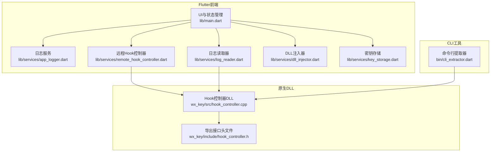
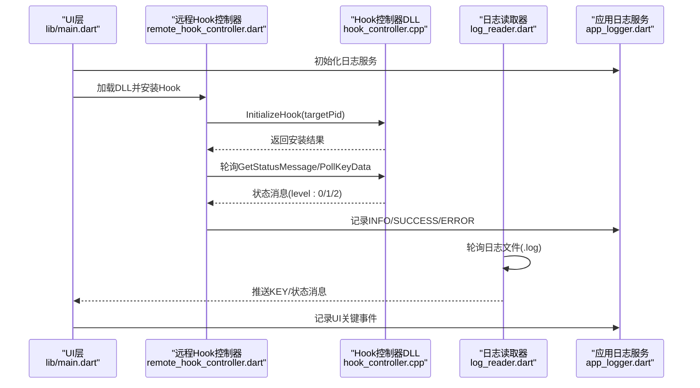
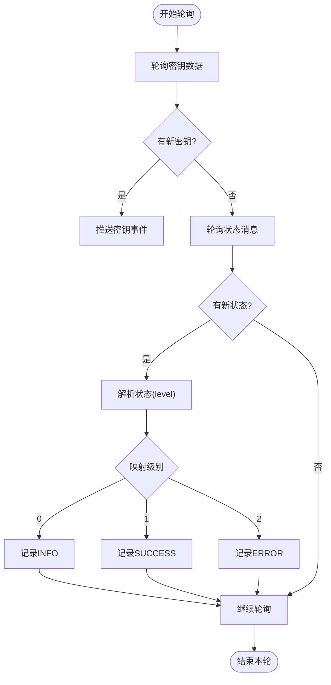
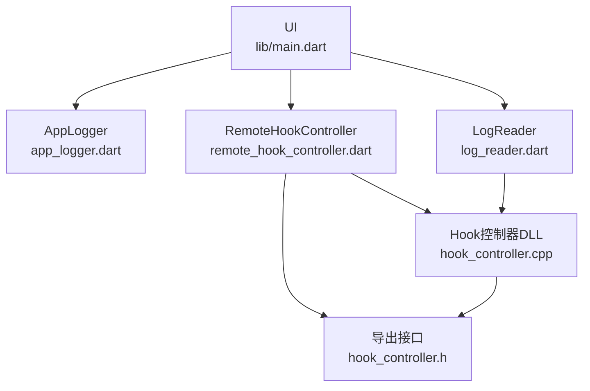

# 日志系统与监控

<cite>
**本文档引用的文件**
- [lib/main.dart](file://lib/main.dart)
- [lib/services/app_logger.dart](file://lib/services/app_logger.dart)
- [lib/services/log_reader.dart](file://lib/services/log_reader.dart)
- [lib/services/remote_hook_controller.dart](file://lib/services/remote_hook_controller.dart)
- [lib/services/dll_injector.dart](file://lib/services/dll_injector.dart)
- [lib/services/key_storage.dart](file://lib/services/key_storage.dart)
- [bin/cli_extractor.dart](file://bin/cli_extractor.dart)
- [wx_key/src/hook_controller.cpp](file://wx_key/src/hook_controller.cpp)
- [wx_key/include/hook_controller.h](file://wx_key/include/hook_controller.h)
- [README.md](file://README.md)
</cite>

## 目录
1. [简介](#简介)
2. [项目结构](#项目结构)
3. [核心组件](#核心组件)
4. [架构总览](#架构总览)
5. [详细组件分析](#详细组件分析)
6. [依赖关系分析](#依赖关系分析)
7. [性能考量](#性能考量)
8. [故障排除指南](#故障排除指南)
9. [结论](#结论)
10. [附录](#附录)

## 简介
本文件系统性梳理该代码库的日志记录机制与监控流程，覆盖日志级别设计、输出格式规范、状态监控流程（DLL状态轮询、错误追踪、性能监控）、日志文件组织与命名规则、日志分析工具与调试技巧、监控指标与告警机制、日志清理策略与存储空间管理，以及故障诊断与问题定位方法论。目标是帮助开发者与运维人员快速理解并高效使用日志与监控体系。

## 项目结构
该项目采用 Flutter 前端 + C++ 原生 DLL 的混合架构，日志与监控涉及多层协作：
- Flutter 层：UI 状态展示、日志流订阅、窗口生命周期管理、资源清理与关闭流程。
- 服务层：日志服务、日志读取、远程 Hook 控制器、DLL 注入器、密钥存储。
- 原生层：控制器 DLL（hook 安装、状态消息队列、错误信息导出）。

图表来源
- [lib/main.dart](file://lib/main.dart#L16-L35)
- [lib/services/app_logger.dart](file://lib/services/app_logger.dart#L1-L191)
- [lib/services/log_reader.dart](file://lib/services/log_reader.dart#L1-L138)
- [lib/services/remote_hook_controller.dart](file://lib/services/remote_hook_controller.dart#L1-L278)
- [lib/services/dll_injector.dart](file://lib/services/dll_injector.dart#L1-L931)
- [lib/services/key_storage.dart](file://lib/services/key_storage.dart#L1-L273)
- [bin/cli_extractor.dart](file://bin/cli_extractor.dart#L1-L685)
- [wx_key/src/hook_controller.cpp](file://wx_key/src/hook_controller.cpp#L1-L491)
- [wx_key/include/hook_controller.h](file://wx_key/include/hook_controller.h#L1-L50)

章节来源
- [README.md](file://README.md#L77-L96)

## 核心组件
- 应用日志服务（AppLogger）：负责应用内部日志的缓冲、落盘、大小控制与文件打开。
- 日志读取器（LogReader）：负责轮询 DLL 写入的状态日志文件，解析并推送密钥与状态消息。
- 远程Hook控制器（RemoteHookController）：通过 FFI 加载 DLL，安装 Hook，轮询密钥与状态消息，统一记录日志。
- DLL 注入器（DllInjector）：负责微信进程发现、启动、窗口等待、组件就绪检测等，期间持续记录日志。
- 密钥存储（KeyStorage）：负责密钥与图片密钥的持久化与查询。
- 命令行提取器（cli_extractor.dart）：独立 CLI 工具，复用 DLL 接口进行密钥提取与状态轮询。

章节来源
- [lib/services/app_logger.dart](file://lib/services/app_logger.dart#L1-L191)
- [lib/services/log_reader.dart](file://lib/services/log_reader.dart#L1-L138)
- [lib/services/remote_hook_controller.dart](file://lib/services/remote_hook_controller.dart#L1-L278)
- [lib/services/dll_injector.dart](file://lib/services/dll_injector.dart#L1-L931)
- [lib/services/key_storage.dart](file://lib/services/key_storage.dart#L1-L273)
- [bin/cli_extractor.dart](file://bin/cli_extractor.dart#L1-L685)

## 架构总览
整体监控与日志流程如下：
- 应用启动时初始化日志服务，随后进入 UI 状态管理。
- UI 触发 DLL 注入与 Hook 安装，远程Hook控制器通过 FFI 调用 DLL 导出函数。
- DLL 在目标进程中安装 Hook，捕获密钥并通过共享缓冲区传递；同时将状态消息与错误信息入队。
- Flutter 侧通过两种方式消费日志：
  - 轮询 DLL 写入的日志文件（LogReader），解析 KEY 行与状态行。
  - 通过 RemoteHookController 的轮询接口直接读取状态消息与密钥。
- 应用日志服务负责将关键事件写入应用日志文件，便于问题定位与审计。

图表来源
- [lib/main.dart](file://lib/main.dart#L594-L615)
- [lib/services/remote_hook_controller.dart](file://lib/services/remote_hook_controller.dart#L93-L204)
- [wx_key/src/hook_controller.cpp](file://wx_key/src/hook_controller.cpp#L414-L490)
- [lib/services/log_reader.dart](file://lib/services/log_reader.dart#L96-L135)
- [lib/services/app_logger.dart](file://lib/services/app_logger.dart#L30-L104)

## 详细组件分析

### 日志级别与输出格式规范
- 日志级别
  - INFO：普通信息，如“应用启动”“开始安装Hook”“轮询到密钥数据”等。
  - SUCCESS：成功状态，如“Hook安装成功”“密钥获取成功”等。
  - WARNING：警告信息，如“未找到微信安装目录”“密钥获取超时”等。
  - ERROR：错误信息，包含错误对象与堆栈跟踪。
- 输出格式
  - 时间戳：精确到毫秒（截取至小数点后三位）。
  - 级别：INFO/SUCCESS/WARNING/ERROR。
  - 内容：具体消息，错误场景追加错误详情与堆栈。
- 缓冲与落盘
  - 内部缓冲区达到阈值（默认50条）或定时器触发（每5秒）时批量写入。
  - 应用启动时若日志文件超过10MB则清空，避免磁盘占用过大。
- 文件位置
  - 应用日志：位于用户应用数据目录下的专用文件夹，文件名为 app.log。
  - DLL 状态日志：位于系统临时目录，文件名为 wx_key_status.log。
- UI 展示
  - UI 侧维护最近若干条日志消息，按级别映射图标与颜色，支持去重与滚动展示。

章节来源
- [lib/services/app_logger.dart](file://lib/services/app_logger.dart#L30-L117)
- [lib/main.dart](file://lib/main.dart#L623-L644)

### 状态监控流程（DLL状态轮询、错误追踪、性能监控）
- DLL 状态轮询
  - RemoteHookController 以固定周期轮询 DLL 的状态消息接口，最多每次处理5条，按级别映射为 INFO/SUCCESS/ERROR。
  - LogReader 以固定周期轮询 DLL 写入的状态日志文件，解析 KEY 行与“类型:消息”行，分别推送密钥与状态。
- 错误追踪
  - DLL 内部维护最后错误信息，可通过 GetLastErrorMsg 导出函数获取。
  - RemoteHookController 与 DllInjector 在关键节点记录错误详情与堆栈，便于定位。
- 性能监控
  - 轮询频率：RemoteHookController 默认100ms，LogReader 默认500ms。
  - 资源清理：窗口关闭或流程结束时，统一停止轮询、卸载Hook、关闭日志服务，释放资源。

图表来源
- [lib/services/remote_hook_controller.dart](file://lib/services/remote_hook_controller.dart#L146-L204)
- [wx_key/src/hook_controller.cpp](file://wx_key/src/hook_controller.cpp#L457-L486)

章节来源
- [lib/services/remote_hook_controller.dart](file://lib/services/remote_hook_controller.dart#L130-L204)
- [lib/services/log_reader.dart](file://lib/services/log_reader.dart#L96-L135)
- [wx_key/src/hook_controller.cpp](file://wx_key/src/hook_controller.cpp#L457-L490)

### 日志文件组织与命名规则
- 应用日志文件
  - 路径：用户应用数据目录下的专用文件夹，文件名为 app.log。
  - 清理策略：启动时若超过10MB则清空；支持手动打开日志文件。
- DLL 状态日志文件
  - 路径：系统临时目录，文件名为 wx_key_status.log。
  - 清理策略：UI 启动监控前清空；轮询时去重处理，避免重复上报。
- 命名与位置
  - 采用平台标准环境变量确定路径，保证跨用户兼容。
  - 临时文件用于 DLL 与 Flutter 之间的异步通信，避免直接共享内存带来的复杂性。

章节来源
- [lib/services/app_logger.dart](file://lib/services/app_logger.dart#L14-L28)
- [lib/services/log_reader.dart](file://lib/services/log_reader.dart#L7-L10)
- [lib/main.dart](file://lib/main.dart#L594-L599)

### 日志分析工具与调试技巧
- 应用日志
  - 提供打开日志文件的功能，便于直接查看与分析。
  - 支持查询日志文件大小，辅助容量管理。
- DLL 状态日志
  - 通过轮询流解析 KEY 行与“类型:消息”行，UI 侧进行去重与展示。
  - CLI 工具同样支持轮询状态消息与密钥提取，适合自动化与批处理场景。
- 调试建议
  - 启动阶段关注“应用启动/应用关闭”等关键事件。
  - Hook 安装阶段关注“初始化系统调用/打开目标进程/扫描函数/分配远程缓冲区/安装Hook”等步骤。
  - 密钥提取阶段关注“轮询到密钥数据”的次数与间隔，结合 UI 状态判断是否成功。

章节来源
- [lib/services/app_logger.dart](file://lib/services/app_logger.dart#L147-L188)
- [lib/services/log_reader.dart](file://lib/services/log_reader.dart#L59-L94)
- [bin/cli_extractor.dart](file://bin/cli_extractor.dart#L206-L262)

### 监控指标定义与告警机制
- 指标定义
  - Hook 安装成功率：安装成功/总尝试次数。
  - 状态消息级别分布：INFO/SUCCESS/WARNING/ERROR 的数量与比例。
  - 密钥提取耗时：从安装Hook到首次获取密钥的时间。
  - 轮询效率：单位时间内轮询次数与有效数据量。
- 告警机制
  - UI 状态栏根据级别动态切换颜色与图标，ERROR/WARNING 显示为高优先级。
  - 超时告警：密钥提取超时（默认60秒）自动停止监听并清理资源。
  - 错误告警：DLL 最后错误信息通过 GetLastErrorMsg 导出，RemoteHookController/DllInjector 记录并上报。

章节来源
- [lib/main.dart](file://lib/main.dart#L690-L707)
- [lib/services/remote_hook_controller.dart](file://lib/services/remote_hook_controller.dart#L206-L235)
- [wx_key/src/hook_controller.cpp](file://wx_key/src/hook_controller.cpp#L488-L490)

### 日志清理策略与存储空间管理
- 应用日志
  - 启动时检查文件大小，超过阈值（10MB）自动清空，避免磁盘占用过大。
  - 支持手动清空与打开日志文件，便于运维与排障。
- DLL 状态日志
  - 启动监控前清空，避免历史残留影响。
  - 轮询时使用集合去重，避免重复上报同一行。
- 存储空间管理
  - 建议定期归档旧日志，结合系统磁盘配额与自动清理策略，保障长期稳定运行。

章节来源
- [lib/services/app_logger.dart](file://lib/services/app_logger.dart#L33-L41)
- [lib/main.dart](file://lib/main.dart#L597-L599)
- [lib/services/log_reader.dart](file://lib/services/log_reader.dart#L12-L22)

### 故障诊断与问题定位方法论
- 常见问题定位步骤
  - 确认微信进程：DllInjector 通过多种方式查找微信进程与安装路径，失败时记录详细错误。
  - Hook 安装验证：检查 DLL 是否加载成功、导出函数是否解析、安装结果与最后错误信息。
  - 状态消息核对：通过 RemoteHookController 与 LogReader 的双通道核对，确认状态一致性。
  - 密钥提取验证：观察轮询频率与密钥数量，结合 UI 状态判断是否成功。
- 关键日志点
  - “应用启动/应用关闭”：确认生命周期管理正常。
  - “开始初始化Hook/Hook安装成功/Hook卸载成功/Hook卸载失败”：确认 Hook 生命周期。
  - “轮询到密钥数据/轮询数据异常”：确认轮询有效性。
  - “微信启动失败/微信启动成功/等待微信界面组件超时”：确认微信启动与界面就绪。
- 错误信息获取
  - 通过 RemoteHookController.getLastErrorMessage 与 GetLastErrorMsg 获取 DLL 最后错误信息。
  - 通过 AppLogger.error 记录异常与堆栈，便于回溯。

章节来源
- [lib/services/dll_injector.dart](file://lib/services/dll_injector.dart#L508-L602)
- [lib/services/remote_hook_controller.dart](file://lib/services/remote_hook_controller.dart#L206-L264)
- [wx_key/src/hook_controller.cpp](file://wx_key/src/hook_controller.cpp#L488-L490)

## 依赖关系分析
- 组件耦合
  - UI 与日志服务：UI 在关键节点调用 AppLogger 记录事件。
  - UI 与远程Hook控制器：UI 通过 RemoteHookController 安装/卸载 Hook，并接收状态与密钥。
  - UI 与日志读取器：UI 通过 LogReader 轮询 DLL 状态日志，解析 KEY 与状态。
  - 远程Hook控制器与 DLL：通过 FFI 调用 DLL 导出函数，实现 Hook 安装、轮询与清理。
- 外部依赖
  - Windows API：进程枚举、窗口枚举、注册表查询等。
  - Flutter FFI：动态加载 DLL、调用导出函数。
  - 文件系统：日志文件读写与打开。

图表来源
- [lib/main.dart](file://lib/main.dart#L16-L35)
- [lib/services/remote_hook_controller.dart](file://lib/services/remote_hook_controller.dart#L46-L87)
- [lib/services/log_reader.dart](file://lib/services/log_reader.dart#L24-L44)
- [wx_key/src/hook_controller.cpp](file://wx_key/src/hook_controller.cpp#L414-L490)
- [wx_key/include/hook_controller.h](file://wx_key/include/hook_controller.h#L12-L46)

章节来源
- [lib/services/remote_hook_controller.dart](file://lib/services/remote_hook_controller.dart#L1-L278)
- [lib/services/log_reader.dart](file://lib/services/log_reader.dart#L1-L138)
- [wx_key/src/hook_controller.cpp](file://wx_key/src/hook_controller.cpp#L1-L491)
- [wx_key/include/hook_controller.h](file://wx_key/include/hook_controller.h#L1-L50)

## 性能考量
- 轮询频率
  - RemoteHookController 默认100ms轮询，LogReader 默认500ms轮询，兼顾实时性与性能。
- 缓冲策略
  - AppLogger 内部缓冲区阈值与定时刷新减少频繁 IO，提升吞吐。
- 资源释放
  - 窗口关闭与流程结束时统一停止轮询、卸载 Hook、关闭日志服务，避免资源泄漏。
- I/O 优化
  - DLL 状态日志采用追加写入，避免随机访问；UI 侧使用去重集合避免重复处理。

## 故障排除指南
- DLL 加载失败
  - 检查 DLL 路径是否存在；确认导出函数解析成功；查看最后错误信息。
- Hook 安装失败
  - 关注“打开目标进程/扫描函数/分配远程缓冲区/安装Hook”各步骤的错误信息。
- 密钥提取超时
  - 检查微信界面是否就绪；确认轮询是否正常；查看 UI 状态与日志。
- 日志文件过大
  - 启动时自动清空；必要时手动清空并重新开始监控。

章节来源
- [lib/services/remote_hook_controller.dart](file://lib/services/remote_hook_controller.dart#L46-L87)
- [lib/services/remote_hook_controller.dart](file://lib/services/remote_hook_controller.dart#L206-L235)
- [lib/services/app_logger.dart](file://lib/services/app_logger.dart#L33-L41)
- [lib/main.dart](file://lib/main.dart#L690-L707)

## 结论
该日志系统与监控体系通过“应用日志 + DLL 状态日志 + 双通道轮询”的组合，实现了对 Hook 生命周期、密钥提取过程与 UI 状态的全面可观测性。配合清晰的日志级别与格式、完善的错误追踪与告警机制、合理的清理与存储策略，能够有效支撑开发调试与生产运维需求。建议在实际部署中结合业务场景进一步细化指标与告警阈值，并建立日志归档与巡检机制。

## 附录
- 关键接口与职责
  - RemoteHookController：加载 DLL、安装/卸载 Hook、轮询密钥与状态、记录日志。
  - LogReader：轮询 DLL 状态日志、解析 KEY 与状态消息。
  - AppLogger：应用日志缓冲、落盘、大小控制、打开日志文件。
  - DllInjector：微信进程发现、启动、窗口等待与组件就绪检测。
  - KeyStorage：密钥与图片密钥的持久化与查询。
  - CLI 工具：独立命令行提取器，复用 DLL 接口进行自动化提取。

章节来源
- [lib/services/remote_hook_controller.dart](file://lib/services/remote_hook_controller.dart#L1-L278)
- [lib/services/log_reader.dart](file://lib/services/log_reader.dart#L1-L138)
- [lib/services/app_logger.dart](file://lib/services/app_logger.dart#L1-L191)
- [lib/services/dll_injector.dart](file://lib/services/dll_injector.dart#L1-L931)
- [lib/services/key_storage.dart](file://lib/services/key_storage.dart#L1-L273)
- [bin/cli_extractor.dart](file://bin/cli_extractor.dart#L1-L685)