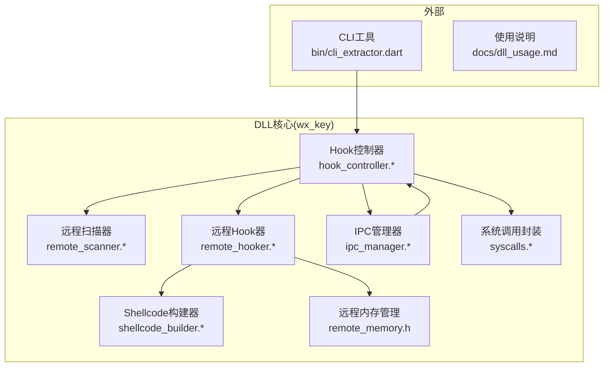
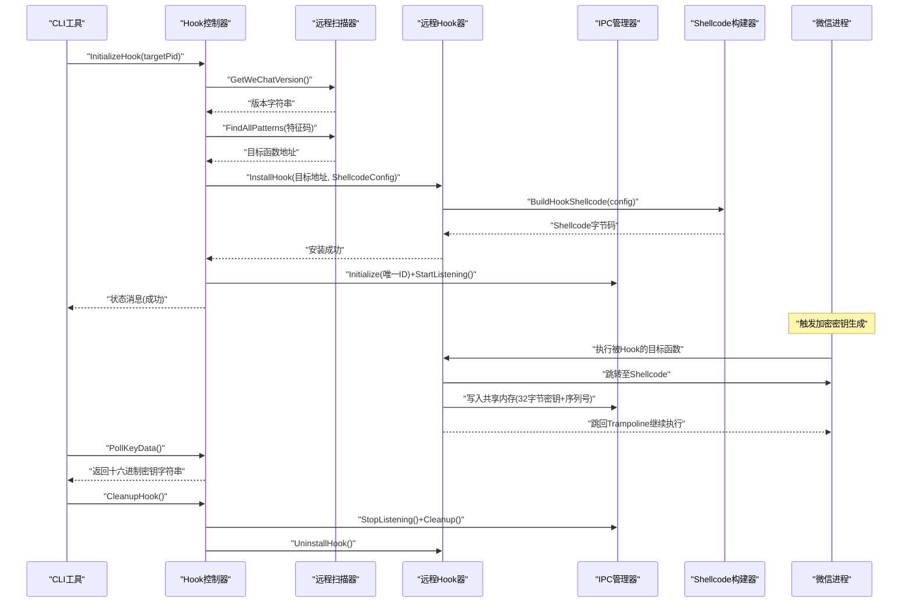
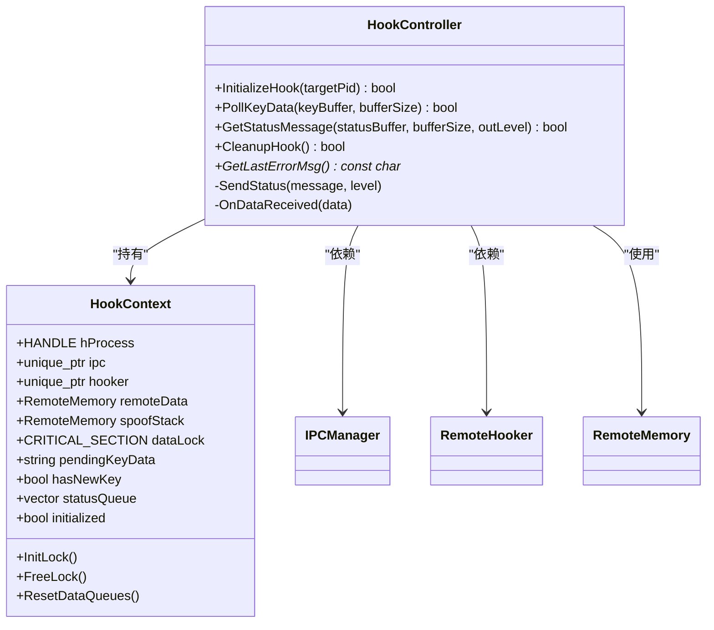
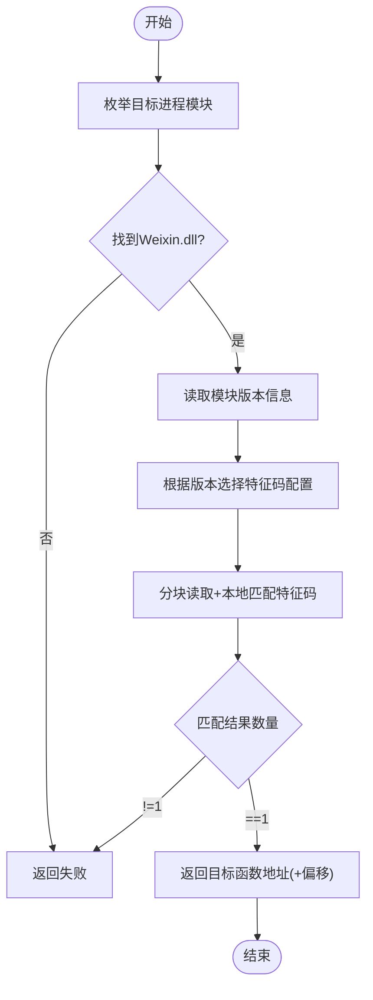
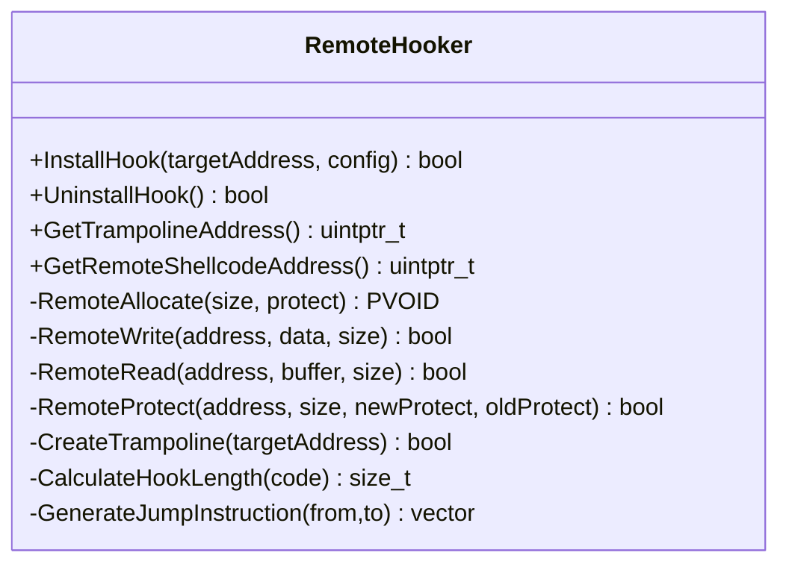
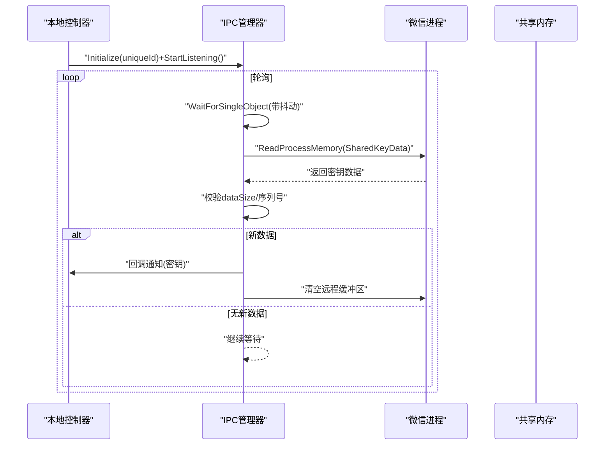
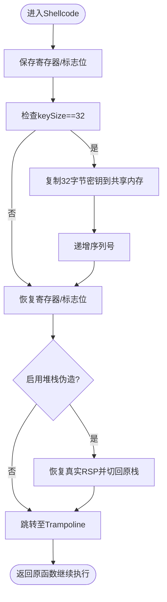
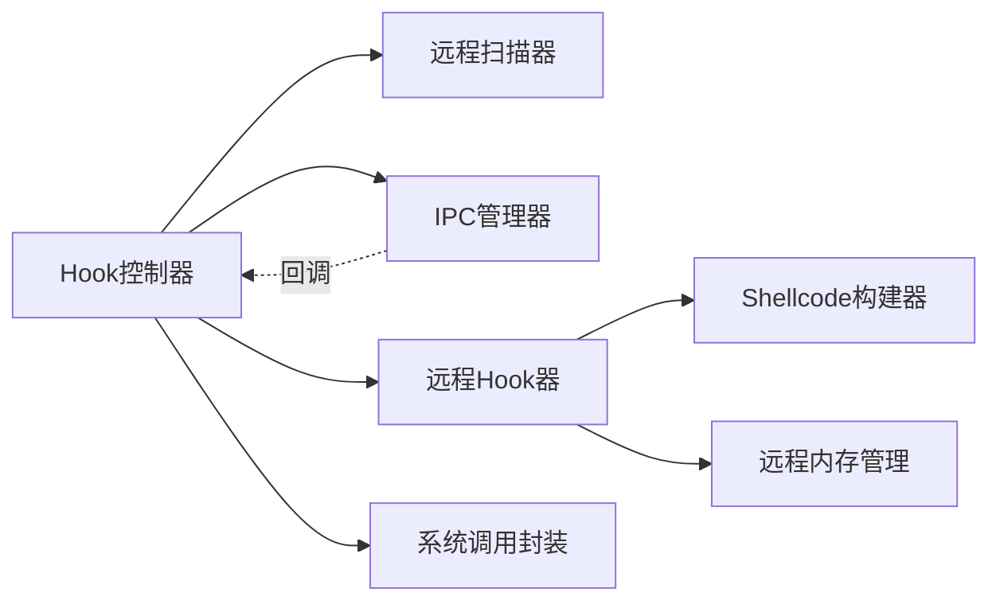

# 核心功能模块

<cite>
**本文引用的文件**
- [wx_key/include/hook_controller.h](file://wx_key/include/hook_controller.h)
- [wx_key/src/hook_controller.cpp](file://wx_key/src/hook_controller.cpp)
- [wx_key/include/remote_hooker.h](file://wx_key/include/remote_hooker.h)
- [wx_key/src/remote_hooker.cpp](file://wx_key/src/remote_hooker.cpp)
- [wx_key/include/remote_scanner.h](file://wx_key/include/remote_scanner.h)
- [wx_key/src/remote_scanner.cpp](file://wx_key/src/remote_scanner.cpp)
- [wx_key/include/ipc_manager.h](file://wx_key/include/ipc_manager.h)
- [wx_key/src/ipc_manager.cpp](file://wx_key/src/ipc_manager.cpp)
- [wx_key/include/shellcode_builder.h](file://wx_key/include/shellcode_builder.h)
- [wx_key/src/shellcode_builder.cpp](file://wx_key/src/shellcode_builder.cpp)
- [wx_key/include/remote_memory.h](file://wx_key/include/remote_memory.h)
- [wx_key/include/syscalls.h](file://wx_key/include/syscalls.h)
- [wx_key/src/syscalls.cpp](file://wx_key/src/syscalls.cpp)
- [wx_key/dllmain.cpp](file://wx_key/dllmain.cpp)
- [bin/cli_extractor.dart](file://bin/cli_extractor.dart)
- [docs/dll_usage.md](file://docs/dll_usage.md)
</cite>

## 目录
1. [简介](#简介)
2. [项目结构](#项目结构)
3. [核心组件](#核心组件)
4. [架构总览](#架构总览)
5. [详细组件分析](#详细组件分析)
6. [依赖关系分析](#依赖关系分析)
7. [性能考量](#性能考量)
8. [故障排查指南](#故障排查指南)
9. [结论](#结论)
10. [附录](#附录)

## 简介
本文件面向wx_key核心功能模块，系统性阐述两大密钥提取能力：数据库密钥提取与图片密钥提取；自动化DLL注入与Hook安装流程（含进程控制与状态轮询）；密钥存储与管理策略（持久化与安全）；以及远程Hook控制器与FFI接口设计。文档同时提供模块协作关系图、关键流程时序图与性能优化建议，帮助开发者快速理解并安全高效地集成与扩展。

## 项目结构
仓库采用分层与按功能域组织的结构：
- 外部接口与CLI：bin/cli_extractor.dart、docs/dll_usage.md
- DLL核心：wx_key/（C++实现，导出FFI接口）
- 平台适配：android/、ios/、linux/、macos/、windows/（Flutter/原生平台入口）

DLL核心模块的关键目录与职责：
- include/：对外头文件（FFI接口、数据结构、类声明）
- src/：核心实现（Hook、扫描、IPC、内存、系统调用封装等）
- dllmain.cpp：DLL入口，暴露Hook控制器API
- wx_key.sln / wx_key.vcxproj：Visual Studio工程文件

图表来源
- [wx_key/src/hook_controller.cpp](file://wx_key/src/hook_controller.cpp#L1-L491)
- [wx_key/src/remote_scanner.cpp](file://wx_key/src/remote_scanner.cpp#L1-L261)
- [wx_key/src/remote_hooker.cpp](file://wx_key/src/remote_hooker.cpp#L1-L419)
- [wx_key/src/ipc_manager.cpp](file://wx_key/src/ipc_manager.cpp#L1-L273)
- [wx_key/src/shellcode_builder.cpp](file://wx_key/src/shellcode_builder.cpp#L1-L151)
- [wx_key/include/remote_memory.h](file://wx_key/include/remote_memory.h#L1-L107)
- [wx_key/include/syscalls.h](file://wx_key/include/syscalls.h#L1-L189)

章节来源
- [wx_key/src/hook_controller.cpp](file://wx_key/src/hook_controller.cpp#L1-L491)
- [wx_key/src/remote_scanner.cpp](file://wx_key/src/remote_scanner.cpp#L1-L261)
- [wx_key/src/remote_hooker.cpp](file://wx_key/src/remote_hooker.cpp#L1-L419)
- [wx_key/src/ipc_manager.cpp](file://wx_key/src/ipc_manager.cpp#L1-L273)
- [wx_key/src/shellcode_builder.cpp](file://wx_key/src/shellcode_builder.cpp#L1-L151)
- [wx_key/include/remote_memory.h](file://wx_key/include/remote_memory.h#L1-L107)
- [wx_key/include/syscalls.h](file://wx_key/include/syscalls.h#L1-L189)

## 核心组件
- Hook控制器（FFI接口）：提供初始化、轮询取密钥、状态查询、清理等API，协调扫描、Hook、IPC与内存管理。
- 远程扫描器：在目标进程枚举模块、特征码扫描、版本识别。
- 远程Hook器：在目标进程内安装Inline Hook，生成Trampoline与Shellcode。
- IPC管理器：在本地/远程进程间通过共享内存与事件进行轮询通信。
- Shellcode构建器：基于Xbyak生成x64 Hook Shellcode，完成密钥拷贝与序列号递增。
- 远程内存管理：RAII封装NtAllocate/NtProtect等，保障资源释放与权限控制。
- 系统调用封装：动态解析ntdll函数、提取SSN并生成syscall stub，规避检测。

章节来源
- [wx_key/include/hook_controller.h](file://wx_key/include/hook_controller.h#L1-L50)
- [wx_key/src/hook_controller.cpp](file://wx_key/src/hook_controller.cpp#L1-L491)
- [wx_key/include/remote_scanner.h](file://wx_key/include/remote_scanner.h#L1-L70)
- [wx_key/src/remote_scanner.cpp](file://wx_key/src/remote_scanner.cpp#L1-L261)
- [wx_key/include/remote_hooker.h](file://wx_key/include/remote_hooker.h#L1-L73)
- [wx_key/src/remote_hooker.cpp](file://wx_key/src/remote_hooker.cpp#L1-L419)
- [wx_key/include/ipc_manager.h](file://wx_key/include/ipc_manager.h#L1-L80)
- [wx_key/src/ipc_manager.cpp](file://wx_key/src/ipc_manager.cpp#L1-L273)
- [wx_key/include/shellcode_builder.h](file://wx_key/include/shellcode_builder.h#L1-L38)
- [wx_key/src/shellcode_builder.cpp](file://wx_key/src/shellcode_builder.cpp#L1-L151)
- [wx_key/include/remote_memory.h](file://wx_key/include/remote_memory.h#L1-L107)
- [wx_key/include/syscalls.h](file://wx_key/include/syscalls.h#L1-L189)
- [wx_key/src/syscalls.cpp](file://wx_key/src/syscalls.cpp#L1-L278)

## 架构总览
下图展示了从CLI到DLL、再到目标进程的完整链路：CLI触发初始化，DLL打开目标进程、扫描特征码定位目标函数、安装Hook、通过共享内存轮询接收密钥，最终由CLI消费密钥并输出。

图表来源
- [wx_key/src/hook_controller.cpp](file://wx_key/src/hook_controller.cpp#L214-L379)
- [wx_key/src/remote_scanner.cpp](file://wx_key/src/remote_scanner.cpp#L158-L204)
- [wx_key/src/remote_hooker.cpp](file://wx_key/src/remote_hooker.cpp#L278-L389)
- [wx_key/src/ipc_manager.cpp](file://wx_key/src/ipc_manager.cpp#L163-L271)
- [wx_key/src/shellcode_builder.cpp](file://wx_key/src/shellcode_builder.cpp#L28-L150)

## 详细组件分析

### 组件A：Hook控制器（FFI接口）
- 职责：统一初始化流程、状态管理、数据轮询、错误上报与资源清理。
- 关键流程：
  - 初始化上下文：打开进程、版本检测、特征码扫描、分配远程缓冲区与伪栈、初始化IPC、安装Hook。
  - 轮询取密钥：线程安全地从内部队列取出最新密钥并清空。
  - 状态轮询：从内部队列弹出最近状态消息，带级别（info/success/error）。
  - 清理：卸载Hook、停止IPC、释放远程内存、关闭句柄、清理系统调用封装。
- 线程安全：使用CRITICAL_SECTION保护共享状态与队列。
- 错误处理：统一格式化Win32/NTSTATUS错误，记录最后错误字符串。

图表来源
- [wx_key/src/hook_controller.cpp](file://wx_key/src/hook_controller.cpp#L23-L67)
- [wx_key/include/hook_controller.h](file://wx_key/include/hook_controller.h#L12-L46)

章节来源
- [wx_key/include/hook_controller.h](file://wx_key/include/hook_controller.h#L1-L50)
- [wx_key/src/hook_controller.cpp](file://wx_key/src/hook_controller.cpp#L1-L491)

### 组件B：远程扫描器（特征码扫描与版本识别）
- 职责：枚举目标进程模块、在指定模块内进行特征码扫描、读取模块版本信息。
- 实现要点：
  - 模块枚举与信息获取使用间接系统调用，避免常规API被拦截。
  - 特征码扫描采用分块读取（1MB）+本地缓冲匹配，减少跨进程读取次数。
  - 版本识别通过模块路径读取文件版本信息，支持多版本配置映射。
- 性能：预分配2MB扫描缓冲区，按模块大小分块读取，兼顾速度与稳定性。

图表来源
- [wx_key/src/remote_scanner.cpp](file://wx_key/src/remote_scanner.cpp#L119-L204)
- [wx_key/src/remote_scanner.cpp](file://wx_key/src/remote_scanner.cpp#L219-L259)

章节来源
- [wx_key/include/remote_scanner.h](file://wx_key/include/remote_scanner.h#L1-L70)
- [wx_key/src/remote_scanner.cpp](file://wx_key/src/remote_scanner.cpp#L1-L261)

### 组件C：远程Hook器（Inline Hook与Trampoline）
- 职责：在目标进程内安装Inline Hook，生成Trampoline与Shellcode，恢复原始指令并跳回。
- 实现要点：
  - 反汇编估算：简单x64指令长度估算，确保至少覆盖14字节以容纳长跳转。
  - Trampoline：备份原始指令+回跳指令，分配RX权限。
  - Shellcode：通过ShellcodeBuilder生成，写入目标进程并设置RX权限。
  - Hook补丁：修改目标函数开头为跳转到Shellcode，保证原子性（临时提升权限写入后恢复）。
- 安全：仅在Inline模式写补丁；硬件断点模式由上层控制，此处不写补丁。

图表来源
- [wx_key/include/remote_hooker.h](file://wx_key/include/remote_hooker.h#L10-L70)
- [wx_key/src/remote_hooker.cpp](file://wx_key/src/remote_hooker.cpp#L278-L389)

章节来源
- [wx_key/include/remote_hooker.h](file://wx_key/include/remote_hooker.h#L1-L73)
- [wx_key/src/remote_hooker.cpp](file://wx_key/src/remote_hooker.cpp#L1-L419)

### 组件D：IPC管理器（轮询模式共享内存通信）
- 职责：在本地/远程进程间通过共享内存与事件进行轮询通信，传输32字节密钥与序列号。
- 实现要点：
  - 名称混淆：使用混淆字符串模板，结合唯一ID与随机后缀，降低可预测性。
  - 轮询线程：周期性WaitForSingleObject+ReadProcessMemory，避免稳定频率特征。
  - 去重与清空：通过序列号判断新数据，读取后清空远程缓冲区，防止重复消费。
  - 回调通知：将解包后的密钥数据通过回调传递给Hook控制器。
- 安全：事件句柄与共享内存均支持Global/Local回退策略，提高兼容性。

图表来源
- [wx_key/src/ipc_manager.cpp](file://wx_key/src/ipc_manager.cpp#L206-L271)
- [wx_key/include/ipc_manager.h](file://wx_key/include/ipc_manager.h#L18-L76)

章节来源
- [wx_key/include/ipc_manager.h](file://wx_key/include/ipc_manager.h#L1-L80)
- [wx_key/src/ipc_manager.cpp](file://wx_key/src/ipc_manager.cpp#L1-L273)

### 组件E：Shellcode构建器（x64 Hook Shellcode）
- 职责：基于Xbyak生成x64 Hook Shellcode，完成密钥拷贝、序列号递增与回跳。
- 实现要点：
  - 寄存器保存/恢复：完整保存通用寄存器与标志位，确保不破坏目标函数语义。
  - 堆栈伪造：可选启用，将关键寄存器暂存到真实栈，切换到对齐后的伪栈，再恢复。
  - 数据写入：将32字节密钥写入共享内存，设置dataSize=32，递增sequenceNumber。
  - 回跳逻辑：跳转至Trampoline继续执行原始函数。
- 安全：严格校验keySize=32，避免异常数据污染。

图表来源
- [wx_key/src/shellcode_builder.cpp](file://wx_key/src/shellcode_builder.cpp#L28-L150)

章节来源
- [wx_key/include/shellcode_builder.h](file://wx_key/include/shellcode_builder.h#L1-L38)
- [wx_key/src/shellcode_builder.cpp](file://wx_key/src/shellcode_builder.cpp#L1-L151)

### 组件F：远程内存管理与系统调用封装
- 远程内存管理：提供RAII封装，自动分配/释放远程内存，支持权限变更。
- 系统调用封装：动态解析ntdll函数，提取SSN并生成syscall stub，统一封装Nt系列调用，便于后续扩展。

章节来源
- [wx_key/include/remote_memory.h](file://wx_key/include/remote_memory.h#L1-L107)
- [wx_key/include/syscalls.h](file://wx_key/include/syscalls.h#L1-L189)
- [wx_key/src/syscalls.cpp](file://wx_key/src/syscalls.cpp#L1-L278)

## 依赖关系分析
- 组件耦合：
  - Hook控制器聚合IPC、Hooker、Scanner、RemoteMemory、Syscalls。
  - Hooker依赖ShellcodeBuilder与RemoteMemory。
  - IPC依赖Hook控制器提供的回调接口。
  - Scanner与Syscalls相互独立，但共同服务于Hook控制器。
- 外部依赖：
  - Xbyak用于x64机器码生成。
  - Windows API与Nt系列系统调用。
  - Flutter/Dart CLI通过FFI调用DLL接口。

图表来源
- [wx_key/src/hook_controller.cpp](file://wx_key/src/hook_controller.cpp#L1-L491)
- [wx_key/src/remote_hooker.cpp](file://wx_key/src/remote_hooker.cpp#L1-L419)
- [wx_key/src/ipc_manager.cpp](file://wx_key/src/ipc_manager.cpp#L1-L273)

章节来源
- [wx_key/src/hook_controller.cpp](file://wx_key/src/hook_controller.cpp#L1-L491)
- [wx_key/src/remote_hooker.cpp](file://wx_key/src/remote_hooker.cpp#L1-L419)
- [wx_key/src/ipc_manager.cpp](file://wx_key/src/ipc_manager.cpp#L1-L273)

## 性能考量
- 扫描性能：
  - 分块读取（1MB）+本地匹配，减少跨进程读取次数；预分配2MB缓冲区，降低频繁分配成本。
  - 版本配置管理器懒初始化，避免重复初始化开销。
- Hook性能：
  - Inline Hook仅写入最小必要长度（≥14字节），确保跳转完整；Trampoline只保留原始指令+回跳。
  - Shellcode使用rep movsb高效拷贝32字节密钥。
- IPC性能：
  - 轮询间隔加入轻微抖动，避免稳定特征；事件唤醒与清空远程缓冲区减少无效读取。
- 内存与权限：
  - 远程内存分配后立即设置RX权限，避免多次保护切换。
  - 临时提升目标函数权限写入补丁后立即恢复，降低风险窗口。

[本节为通用性能建议，无需特定文件引用]

## 故障排查指南
- 常见错误与定位：
  - 打开进程失败：检查目标PID是否存在、权限是否足够；查看系统错误码与NTSTATUS。
  - 版本不支持：确认微信版本是否在支持范围内；核对版本配置映射。
  - 特征码匹配失败：确认模块加载顺序与内存布局变化；调整掩码或偏移。
  - Hook安装失败：检查目标函数可写权限、指令边界与补丁长度；确认Trampoline生成成功。
  - IPC轮询无数据：确认共享内存名称与事件名称一致；检查回调是否注册；验证序列号递增。
- 日志与状态：
  - 使用状态轮询接口获取info/success/error级别消息，结合最后错误字符串定位问题。
  - 清理阶段务必调用CleanupHook，避免残留Hook影响目标进程稳定性。

章节来源
- [wx_key/src/hook_controller.cpp](file://wx_key/src/hook_controller.cpp#L225-L281)
- [wx_key/src/remote_scanner.cpp](file://wx_key/src/remote_scanner.cpp#L158-L204)
- [wx_key/src/remote_hooker.cpp](file://wx_key/src/remote_hooker.cpp#L278-L389)
- [wx_key/src/ipc_manager.cpp](file://wx_key/src/ipc_manager.cpp#L206-L271)

## 结论
本核心功能模块以Hook控制器为中心，串联扫描、Hook、IPC与Shellcode四大子系统，形成“定位—安装—通信—取数”的闭环。通过轮询IPC与Inline Hook的组合，既保证了稳定性，又降低了被检测的风险。配合完善的错误处理与状态轮询，为上层CLI与Flutter应用提供了可靠的FFI接口。建议在生产环境中持续关注微信版本演进与特征码变化，及时更新配置与扫描策略。

[本节为总结性内容，无需特定文件引用]

## 附录

### FFI接口与使用模式
- Hook控制器API（导出自DLL）：
  - 初始化：InitializeHook(targetPid)
  - 轮询取密钥：PollKeyData(keyBuffer, bufferSize)
  - 状态轮询：GetStatusMessage(statusBuffer, bufferSize, outLevel)
  - 清理：CleanupHook()
  - 最后错误：GetLastErrorMsg()
- CLI使用模式（参考）：
  - 启动微信并获取PID
  - 调用InitializeHook
  - 循环调用PollKeyData获取密钥
  - 调用CleanupHook
  - 参考文档：docs/dll_usage.md

章节来源
- [wx_key/include/hook_controller.h](file://wx_key/include/hook_controller.h#L12-L46)
- [bin/cli_extractor.dart](file://bin/cli_extractor.dart)
- [docs/dll_usage.md](file://docs/dll_usage.md)

### 密钥存储与管理策略
- 持久化存储：
  - 建议将十六进制密钥写入受控文件或加密容器，避免明文驻留内存。
  - 使用安全的文件权限与访问控制列表，限制读取范围。
- 数据安全：
  - 密钥生命周期：仅在内存中保持短暂可用，消费后立即清零或销毁。
  - 传输安全：通过安全通道（如加密网络）传输，避免明文泄露。
  - 防重复消费：利用序列号去重，结合IPC清空远程缓冲区。
- 合规与审计：
  - 记录密钥提取事件与状态日志，便于审计与追踪。
  - 定期轮换密钥与混淆策略，降低长期暴露风险。

[本节为通用安全建议，无需特定文件引用]