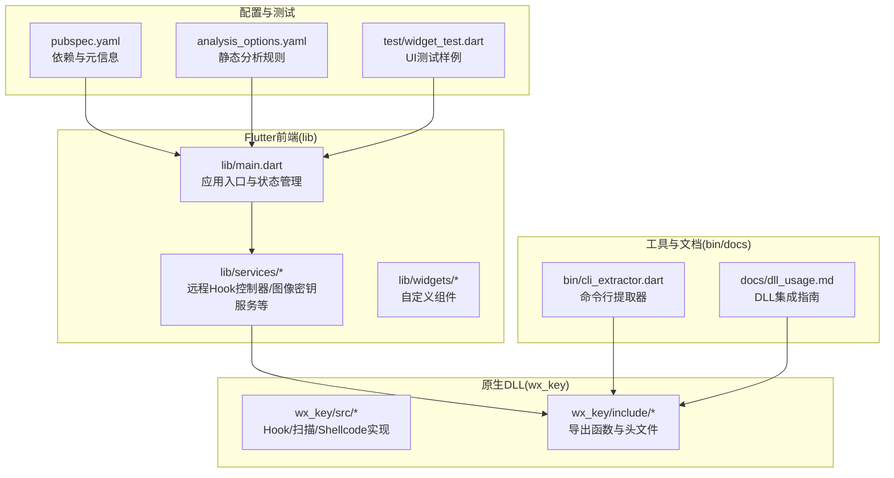
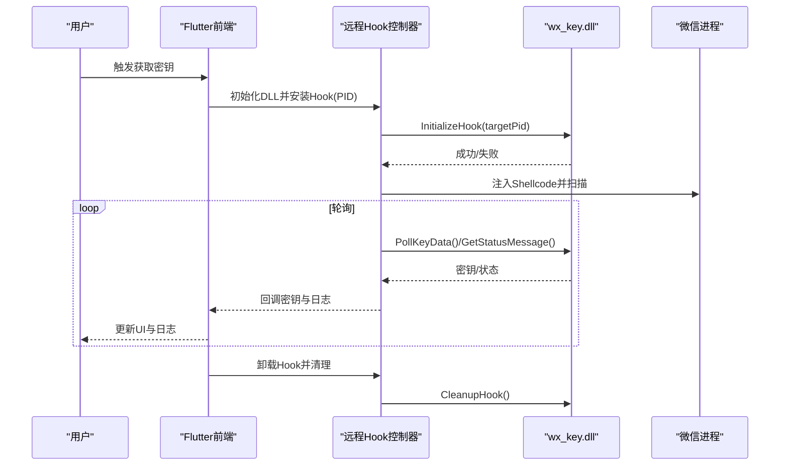
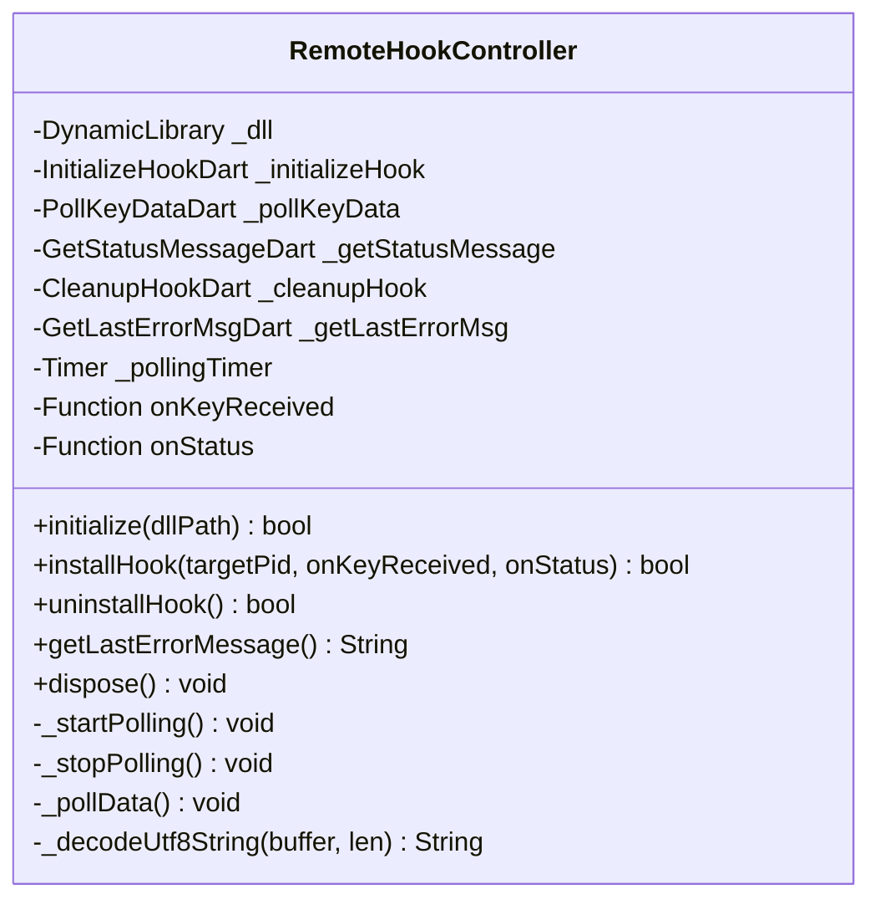
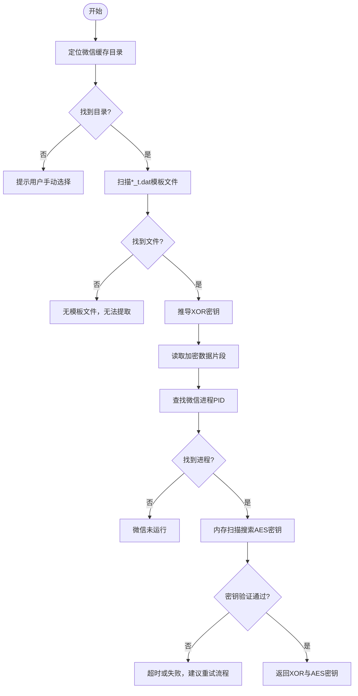
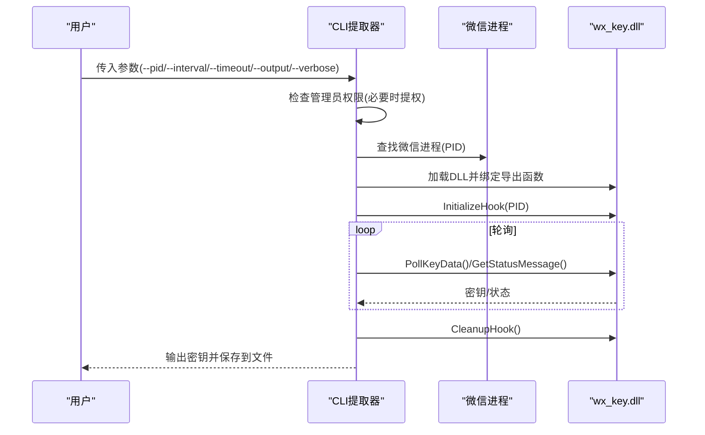
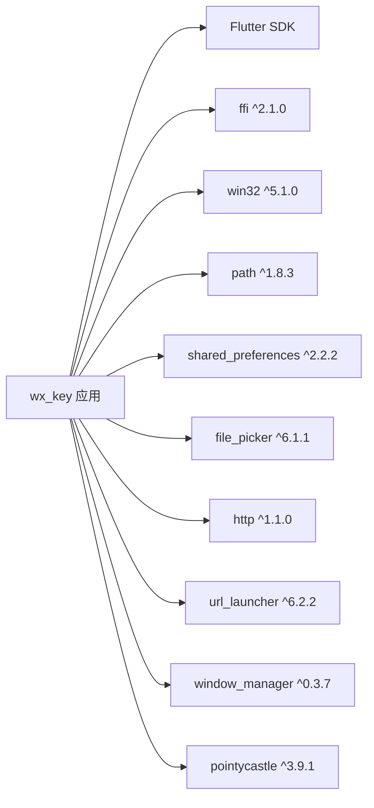

# 贡献指南

<cite>
**本文档引用的文件**
- [LICENSE](file://LICENSE)
- [README.md](file://README.md)
- [SECURITY_ADVISORY.md](file://SECURITY_ADVISORY.md)
- [analysis_options.yaml](file://analysis_options.yaml)
- [pubspec.yaml](file://pubspec.yaml)
- [lib/main.dart](file://lib/main.dart)
- [lib/services/remote_hook_controller.dart](file://lib/services/remote_hook_controller.dart)
- [lib/services/image_key_service.dart](file://lib/services/image_key_service.dart)
- [docs/dll_usage.md](file://docs/dll_usage.md)
- [bin/cli_extractor.dart](file://bin/cli_extractor.dart)
- [test/widget_test.dart](file://test/widget_test.dart)
</cite>

## 目录
1. [简介](#简介)
2. [项目结构](#项目结构)
3. [核心组件](#核心组件)
4. [架构总览](#架构总览)
5. [详细组件分析](#详细组件分析)
6. [依赖关系分析](#依赖关系分析)
7. [性能考量](#性能考量)
8. [故障排除指南](#故障排除指南)
9. [结论](#结论)
10. [附录](#附录)

## 简介
本项目为微信数据库与图片密钥提取工具，提供基于Flutter的图形界面与原生C++ DLL的远程Hook能力，用于在微信4.0及以上版本中提取数据库密钥与缓存图片解密所需的密钥。项目采用MIT许可，鼓励在合规前提下的学习与研究。

- 开源协议：MIT License
- 适用平台：Windows（x64）
- 主要技术栈：Flutter/Dart（前端UI与服务）、C++（原生Hook与扫描）

**章节来源**
- [LICENSE](file://LICENSE#L1-L22)
- [README.md](file://README.md#L1-L187)

## 项目结构
项目采用多平台混合架构，包含Flutter前端、原生C++ DLL与CLI工具，同时提供文档与测试。

**图表来源**
- [lib/main.dart](file://lib/main.dart#L1-L800)
- [lib/services/remote_hook_controller.dart](file://lib/services/remote_hook_controller.dart#L1-L278)
- [lib/services/image_key_service.dart](file://lib/services/image_key_service.dart#L1-L698)
- [docs/dll_usage.md](file://docs/dll_usage.md#L1-L165)
- [bin/cli_extractor.dart](file://bin/cli_extractor.dart#L1-L685)
- [pubspec.yaml](file://pubspec.yaml#L1-L112)
- [analysis_options.yaml](file://analysis_options.yaml#L1-L29)
- [test/widget_test.dart](file://test/widget_test.dart#L1-L31)

**章节来源**
- [README.md](file://README.md#L77-L132)
- [pubspec.yaml](file://pubspec.yaml#L1-L112)

## 核心组件
- 应用入口与UI：负责窗口管理、状态展示与日志渲染。
- 远程Hook控制器：封装DLL加载、导出函数绑定、轮询与状态获取、资源清理。
- 图像密钥服务：负责微信缓存目录定位、模板文件扫描、XOR/AES密钥推导与内存扫描。
- 命令行提取器：提供无需GUI的CLI工具，便于自动化与批量处理。
- 文档与示例：DLL集成指南，包含API说明与调用流程。

**章节来源**
- [lib/main.dart](file://lib/main.dart#L1-L800)
- [lib/services/remote_hook_controller.dart](file://lib/services/remote_hook_controller.dart#L1-L278)
- [lib/services/image_key_service.dart](file://lib/services/image_key_service.dart#L1-L698)
- [docs/dll_usage.md](file://docs/dll_usage.md#L1-L165)
- [bin/cli_extractor.dart](file://bin/cli_extractor.dart#L1-L685)

## 架构总览
系统通过Flutter前端与原生DLL协作，实现对微信进程的远程Hook与密钥提取。前端负责用户交互与状态展示，DLL负责扫描、Hook与密钥共享。

**图表来源**
- [lib/services/remote_hook_controller.dart](file://lib/services/remote_hook_controller.dart#L32-L278)
- [docs/dll_usage.md](file://docs/dll_usage.md#L21-L60)
- [bin/cli_extractor.dart](file://bin/cli_extractor.dart#L93-L323)

## 详细组件分析

### 远程Hook控制器（轮询模式）
- 职责：加载DLL、绑定导出函数、安装Hook、轮询密钥与状态、清理资源。
- 关键点：使用定时器每100ms轮询，避免回调复杂度；错误通过DLL导出函数获取。
- 资源管理：统一在卸载阶段释放回调与DLL句柄，避免泄漏。

**图表来源**
- [lib/services/remote_hook_controller.dart](file://lib/services/remote_hook_controller.dart#L32-L278)

**章节来源**
- [lib/services/remote_hook_controller.dart](file://lib/services/remote_hook_controller.dart#L1-L278)

### 图像密钥服务（XOR与AES）
- 职责：定位微信缓存目录、扫描模板文件、推导XOR密钥、从内存中搜索AES密钥并验证。
- 算法要点：基于模板文件最后两字节统计与特征匹配，结合Win32内存扫描与AES验证。
- 性能与稳定性：限制扫描区域大小、分块读取与重叠拼接，避免跨块遗漏；超时保护与日志分级。

**图表来源**
- [lib/services/image_key_service.dart](file://lib/services/image_key_service.dart#L600-L698)

**章节来源**
- [lib/services/image_key_service.dart](file://lib/services/image_key_service.dart#L1-L698)

### 命令行提取器（CLI）
- 职责：无需GUI的密钥提取工具，支持参数化配置（PID、轮询间隔、超时、输出文件、详细日志）。
- 流程：自动提权（UAC）、进程查找、DLL初始化、轮询、结果输出与保存。

**图表来源**
- [bin/cli_extractor.dart](file://bin/cli_extractor.dart#L474-L561)
- [docs/dll_usage.md](file://docs/dll_usage.md#L35-L60)

**章节来源**
- [bin/cli_extractor.dart](file://bin/cli_extractor.dart#L1-L685)

### 应用入口与状态管理
- 职责：初始化窗口、日志系统、状态轮询、资源清理与关闭流程。
- 关键点：窗口生命周期管理、日志流订阅、超时控制与资源释放。

**章节来源**
- [lib/main.dart](file://lib/main.dart#L16-L507)

## 依赖关系分析
- 依赖管理：Flutter SDK与第三方包（ffi、win32、path、shared_preferences、file_picker、http、url_launcher、window_manager、pointycastle等）。
- 分析规则：启用Flutter推荐规则，可通过analysis_options.yaml定制。
- 版本与构建：pubspec.yaml定义版本、构建号与依赖版本范围。

**图表来源**
- [pubspec.yaml](file://pubspec.yaml#L30-L61)

**章节来源**
- [pubspec.yaml](file://pubspec.yaml#L1-L112)
- [analysis_options.yaml](file://analysis_options.yaml#L8-L29)

## 性能考量
- 轮询频率：建议100ms轮询，兼顾响应与CPU占用。
- 内存扫描：按4MB分块扫描并保留65字节重叠，避免跨块遗漏；跳过大内存区域与不可读区域。
- 超时与重试：为内存扫描设置合理超时，提供重试流程提示。
- 资源释放：确保在UI关闭与异常情况下释放DLL与回调，避免残留Hook。

[本节为通用性能建议，不直接分析具体文件]

## 故障排除指南
- DLL加载失败：检查DLL路径是否存在，确认架构匹配（x64）与权限（管理员）。
- 无法获取密钥：确认微信进程已启动且PID有效；按建议流程重复触发图片加载后再尝试。
- 内存扫描超时：检查安全软件拦截、系统权限与微信版本兼容性。
- 日志与状态：通过状态消息与日志级别区分Info/Success/Error，辅助定位问题。

**章节来源**
- [lib/services/remote_hook_controller.dart](file://lib/services/remote_hook_controller.dart#L47-L87)
- [lib/services/image_key_service.dart](file://lib/services/image_key_service.dart#L665-L686)
- [docs/dll_usage.md](file://docs/dll_usage.md#L135-L165)

## 结论
本项目通过Flutter与原生DLL的协同，实现了对微信密钥的稳定提取。贡献者可在遵循MIT许可与社区行为准则的前提下，通过Issue与PR参与改进。对于安全与合规，项目明确声明仅用于学习研究，并提供安全警示与免责声明。

[本节为总结性内容，不直接分析具体文件]

## 附录

### 贡献流程（Fork、分支与PR）
- Fork仓库
- 创建功能分支：git checkout -b feature/YourFeature
- 提交更改：git commit -m "Add YourFeature"
- 推送分支：git push origin feature/YourFeature
- 发起Pull Request并附上说明

**章节来源**
- [README.md](file://README.md#L154-L163)

### 代码贡献要求与标准
- 代码风格与静态分析：遵循Flutter推荐规则，可通过analysis_options.yaml调整。
- 注释规范：保持清晰的函数与类注释，解释关键流程与边界条件。
- 测试要求：提供UI测试样例，覆盖关键交互与状态变更。

**章节来源**
- [analysis_options.yaml](file://analysis_options.yaml#L8-L29)
- [test/widget_test.dart](file://test/widget_test.dart#L1-L31)

### 问题报告模板与格式要求
- 标题：简洁描述问题
- 环境信息：操作系统、微信版本、项目版本
- 复现步骤：最小可复现步骤
- 预期行为与实际行为
- 日志与截图（如有）

[本节为通用模板说明，不直接分析具体文件]

### 功能请求提交流程与评估标准
- 在Issue中描述需求背景、使用场景与预期效果
- 提供可行性分析与影响范围评估
- 社区讨论与维护者评估后决定是否纳入

[本节为通用流程说明，不直接分析具体文件]

### 文档贡献方式与质量要求
- 文档需与实现保持同步，包含API说明、调用流程与注意事项
- 示例代码需可运行，参数与输出清晰标注
- 术语统一，语言简洁准确

**章节来源**
- [docs/dll_usage.md](file://docs/dll_usage.md#L1-L165)

### 社区行为准则与沟通礼仪
- 尊重他人，禁止人身攻击
- 基于事实与证据进行讨论
- 遵守法律法规，避免敏感话题
- 项目明确声明仅用于学习研究，严禁用于非法用途

**章节来源**
- [README.md](file://README.md#L19-L27)
- [SECURITY_ADVISORY.md](file://SECURITY_ADVISORY.md#L23-L30)

### 开发环境搭建与测试流程
- 克隆仓库与安装依赖：flutter pub get
- 构建发布版本（Windows）：flutter build windows --release
- 运行测试：flutter test
- CLI工具：dart bin/cli_extractor.dart（需管理员权限）

**章节来源**
- [README.md](file://README.md#L115-L132)
- [pubspec.yaml](file://pubspec.yaml#L1-L112)
- [test/widget_test.dart](file://test/widget_test.dart#L1-L31)
- [bin/cli_extractor.dart](file://bin/cli_extractor.dart#L474-L561)

### 参与讨论与决策过程
- 通过Issue与PR进行讨论
- 维护者根据贡献质量与项目方向进行评估
- 重大变更需社区共识与安全合规评估

[本节为通用流程说明，不直接分析具体文件]