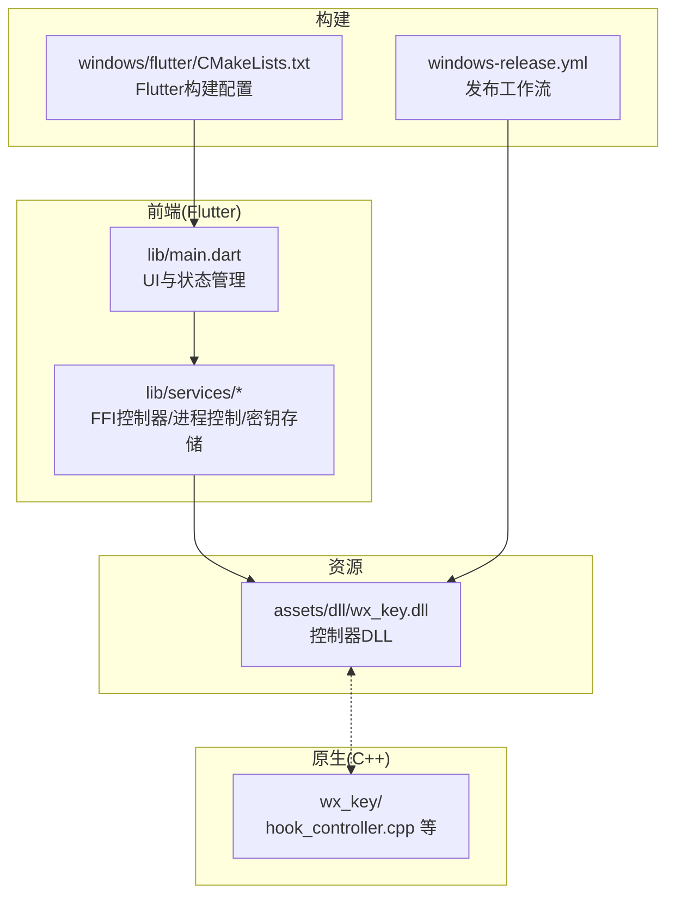
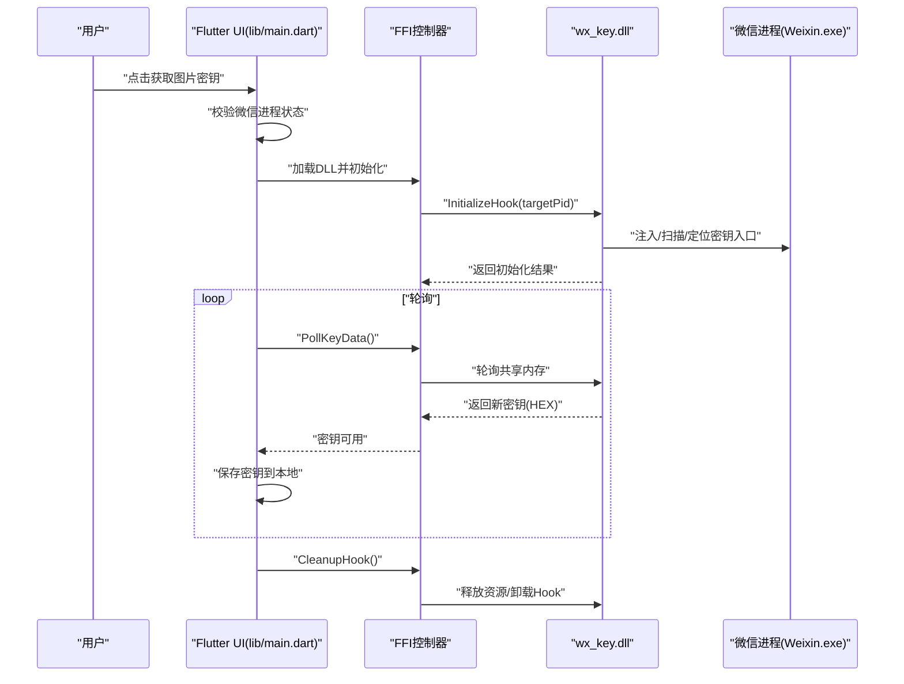

# 快速开始指南

<cite>
**本文引用的文件**
- [README.md](file://README.md)
- [SECURITY_ADVISORY.md](file://SECURITY_ADVISORY.md)
- [bin/README.md](file://bin/README.md)
- [docs/dll_usage.md](file://docs/dll_usage.md)
- [pubspec.yaml](file://pubspec.yaml)
- [.github/workflows/windows-release.yml](file://.github/workflows/windows-release.yml)
- [assets/dll/wx_key.dll](file://assets/dll/wx_key.dll)
- [lib/main.dart](file://lib/main.dart)
- [lib/services/key_storage.dart](file://lib/services/key_storage.dart)
- [windows/flutter/CMakeLists.txt](file://windows/flutter/CMakeLists.txt)
</cite>

## 目录
1. [简介](#简介)
2. [项目结构](#项目结构)
3. [核心组件](#核心组件)
4. [架构总览](#架构总览)
5. [详细组件分析](#详细组件分析)
6. [依赖关系分析](#依赖关系分析)
7. [性能考虑](#性能考虑)
8. [故障排除指南](#故障排除指南)
9. [结论](#结论)
10. [附录](#附录)

## 简介
本指南面向首次使用 wx_key 工具的用户，提供从下载、安装到运行的完整步骤，以及获取图片密钥的标准操作流程与常见问题排查建议。工具支持微信 4.x 版本，通过 DLL 注入与内存扫描技术提取数据库与图片解密所需的密钥。

## 项目结构
- 前端（Flutter）：lib/ 下的 UI 与服务层，负责与用户交互、调用 DLL、存储密钥等。
- 原生 DLL：assets/dll/wx_key.dll，作为与微信进程交互的桥接层。
- 原生 C++ 项目：wx_key/，包含 Hook、IPC、Shellcode 等实现。
- 命令行工具：bin/cli_extractor.dart，提供无需 GUI 的密钥提取能力。
- 文档：docs/dll_usage.md，说明 DLL 的集成与调用流程。
- 发布流程：.github/workflows/windows-release.yml，自动化打包发布 Windows 版本。



图表来源
- [lib/main.dart](file://lib/main.dart#L1175-L1210)
- [lib/services/key_storage.dart](file://lib/services/key_storage.dart#L207-L272)
- [assets/dll/wx_key.dll](file://assets/dll/wx_key.dll)
- [wx_key/wx_key.vcxproj](file://wx_key/wx_key.vcxproj#L1-L32)
- [windows/flutter/CMakeLists.txt](file://windows/flutter/CMakeLists.txt#L1-L110)
- [.github/workflows/windows-release.yml](file://.github/workflows/windows-release.yml#L1-L78)

章节来源
- [README.md](file://README.md#L77-L96)
- [pubspec.yaml](file://pubspec.yaml#L84-L87)

## 核心组件
- 前端 UI 与状态管理：负责引导用户完成微信进程选择、触发密钥提取、展示结果与日志。
- FFI 控制器：通过动态加载 DLL 并调用其导出函数，实现注入、轮询与清理。
- 密钥存储：使用本地持久化保存图片密钥（XOR 与 AES），便于后续使用。
- 命令行工具：bin/cli_extractor.dart，提供参数化提取流程，适合自动化与脚本场景。
- DLL 集成指南：docs/dll_usage.md，说明如何在自定义程序中直接复用 wx_key.dll。

章节来源
- [lib/main.dart](file://lib/main.dart#L1175-L1210)
- [lib/services/key_storage.dart](file://lib/services/key_storage.dart#L207-L272)
- [bin/README.md](file://bin/README.md#L1-L125)
- [docs/dll_usage.md](file://docs/dll_usage.md#L1-L165)

## 架构总览
下图展示了从用户操作到 DLL 注入、内存扫描与密钥轮询的整体流程。



图表来源
- [lib/main.dart](file://lib/main.dart#L1175-L1210)
- [lib/services/key_storage.dart](file://lib/services/key_storage.dart#L207-L272)
- [docs/dll_usage.md](file://docs/dll_usage.md#L35-L59)

## 详细组件分析

### 下载与安装
- 从 GitHub Releases 页面下载最新发布的压缩包，解压后得到可执行文件与 DLL。
- 运行工具时，确保工具文件夹路径不包含中文字符，以避免 DLL 加载失败等问题。
- 若需命令行版本，可直接运行 bin/cli_extractor.dart（需 Dart 环境）。

章节来源
- [README.md](file://README.md#L61-L67)
- [bin/README.md](file://bin/README.md#L1-L26)

### 运行工具
- Windows 桌面版：解压后运行 wx_key.exe（位于构建产物目录）。
- 命令行版：使用 Dart 运行 bin/cli_extractor.dart，支持 PID、DLL 路径、输出文件、超时等参数。
- 构建发布版：可通过 Flutter 构建生成 Windows 可执行文件，路径为 build/windows/runner/Release/wx_key.exe。

章节来源
- [README.md](file://README.md#L61-L67)
- [bin/README.md](file://bin/README.md#L11-L26)
- [README.md](file://README.md#L117-L132)

### 获取图片密钥的标准流程
- 完全关闭当前登录的微信。
- 重新启动微信并登录。
- 打开朋友圈，寻找带图片的消息。
- 点击图片，再点击右上角打开大图，重复 2-3 次。
- 迅速回到工具内点击“获取图片密钥”，等待轮询成功后保存。

章节来源
- [README.md](file://README.md#L68-L76)

### 命令行工具使用要点
- 自动查找微信进程并提取密钥，或手动指定 PID、DLL 路径、输出文件与超时时间。
- 详细模式可输出内部日志，便于排查问题。
- 常见问题：找不到微信进程、DLL 加载失败、权限不足等，详见故障排除章节。

章节来源
- [bin/README.md](file://bin/README.md#L1-L125)

### DLL 集成与调用
- DLL 通过注入与内存扫描定位密钥入口，使用共享内存与序列号机制传递密钥。
- 调用流程：定位进程 -> 加载 DLL -> Initialize -> 轮询 -> Cleanup。
- 注意事项：仅支持 x64 系统与 64 位微信；需要管理员权限；缓冲区大小需满足 65 字节以上。

章节来源
- [docs/dll_usage.md](file://docs/dll_usage.md#L1-L165)

## 依赖关系分析
- 前端依赖：ffi、win32、shared_preferences、file_picker、http、url_launcher、window_manager、pointycastle 等。
- DLL 与原生 C++：通过 Visual Studio 工程编译生成，供 Flutter 通过 FFI 调用。
- 发布流程：GitHub Actions 自动构建 Windows 版本并打包为 zip 发布。

```mermaid
graph LR
Flutter["Flutter 应用(lib/main.dart)"] --> FFI["FFI 动态库加载"]
FFI --> DLL["wx_key.dll"]
DLL <- --> Native["C++ 原生模块(wx_key/*)"]
Build["CMake/MSBuild 构建"] --> Flutter
Release["GitHub Actions 发布"] --> DLL
```

图表来源
- [pubspec.yaml](file://pubspec.yaml#L38-L61)
- [windows/flutter/CMakeLists.txt](file://windows/flutter/CMakeLists.txt#L1-L110)
- [.github/workflows/windows-release.yml](file://.github/workflows/windows-release.yml#L1-L78)

章节来源
- [pubspec.yaml](file://pubspec.yaml#L38-L61)
- [windows/flutter/CMakeLists.txt](file://windows/flutter/CMakeLists.txt#L1-L110)
- [.github/workflows/windows-release.yml](file://.github/workflows/windows-release.yml#L1-L78)

## 性能考虑
- 轮询间隔建议保持在 100ms 左右，避免占用过多 CPU。
- 在 UI 线程外进行轮询，防止界面卡顿。
- 仅在需要时保持 Hook 激活，完成后及时调用 CleanupHook 释放资源。

章节来源
- [docs/dll_usage.md](file://docs/dll_usage.md#L51-L58)

## 故障排除指南
- DLL 加载失败
  - 确认 DLL 文件存在且路径正确。
  - 尝试以管理员身份运行。
  - 避免将工具文件夹放置在包含中文字符的目录下。
- 找不到微信进程
  - 确保微信已启动。
  - 手动指定进程 PID（优先选择加载 Weixin.dll 的进程）。
- 提取失败
  - 检查微信版本是否受支持。
  - 确认具备管理员权限（UAC 提权被阻止时需手动以管理员运行）。
  - 查看详细输出了解具体错误。
- 安全警示
  - 请通过官方渠道下载，避免使用盗版或付费封装版本，谨防欺诈与隐私风险。

章节来源
- [bin/README.md](file://bin/README.md#L92-L109)
- [README.md](file://README.md#L66-L67)
- [SECURITY_ADVISORY.md](file://SECURITY_ADVISORY.md#L1-L33)

## 结论
wx_key 提供了图形界面与命令行两种使用方式，结合 DLL 注入与内存扫描技术，能够稳定提取微信数据库与图片解密所需的密钥。遵循本指南的下载、安装与运行步骤，并严格按标准流程获取图片密钥，可有效提升成功率与稳定性。遇到问题时，可参考故障排除章节进行定位与解决。

## 附录
- 官方 Releases 页面：前往 Releases 下载最新 app.zip 压缩包。
- 命令行参数参考：PID、DLL 路径、轮询间隔、超时、输出文件、详细模式等。
- 官方安全警示：请通过 ycccccccy/wx_key 官方仓库获取，避免侵权与欺诈风险。

章节来源
- [README.md](file://README.md#L61-L67)
- [bin/README.md](file://bin/README.md#L28-L38)
- [SECURITY_ADVISORY.md](file://SECURITY_ADVISORY.md#L23-L27)