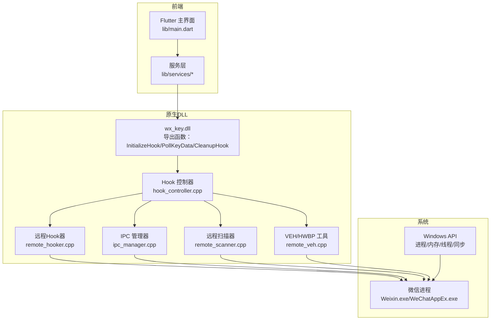
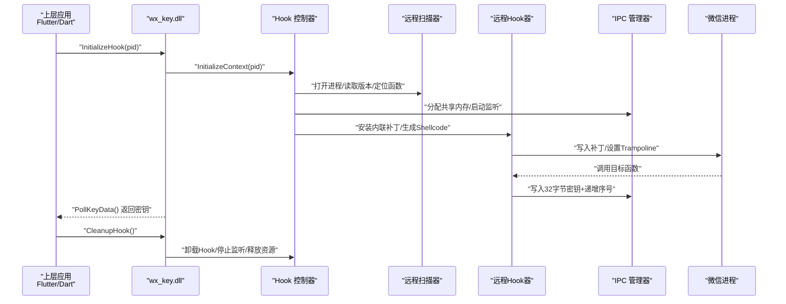
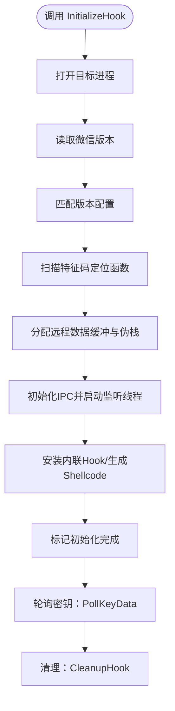
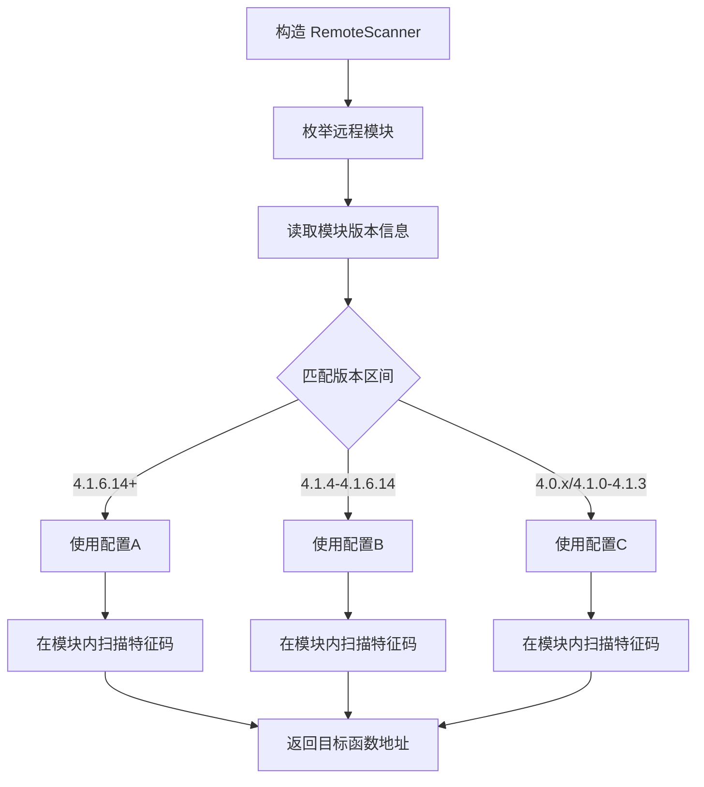
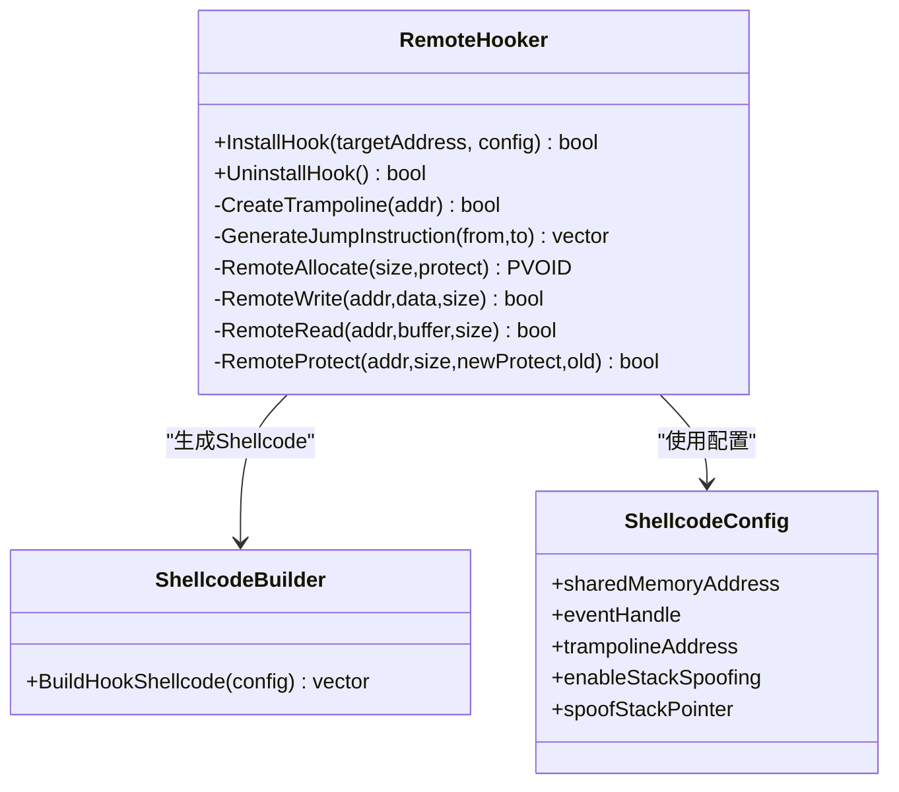
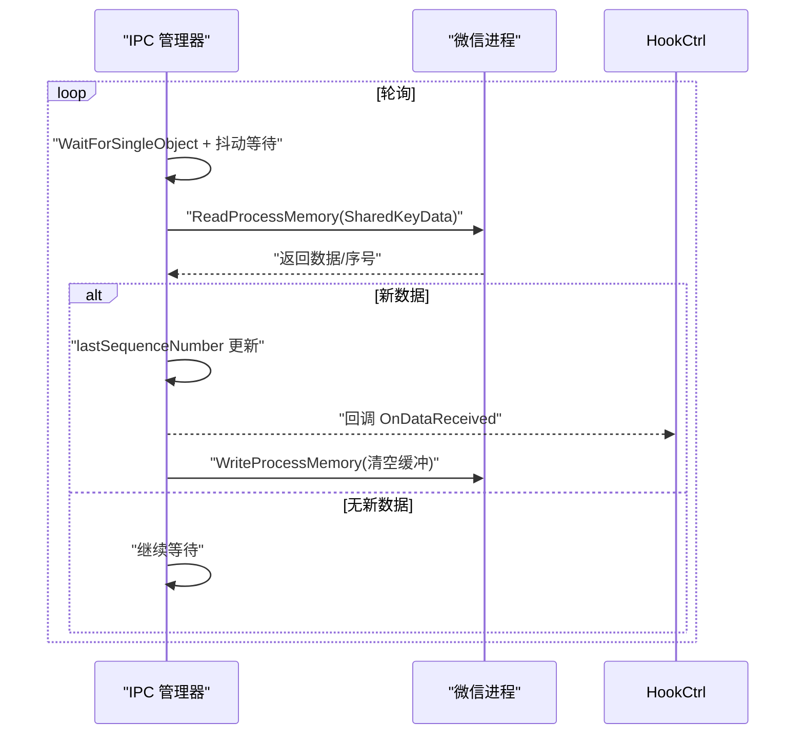
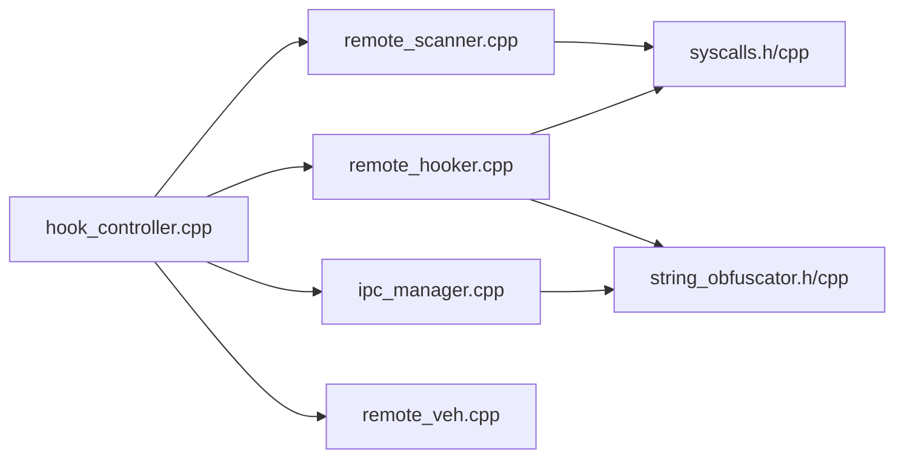

# 技术背景与应用场景

<cite>
**本文引用的文件**
- [README.md](file://README.md)
- [bin/README.md](file://bin/README.md)
- [docs/dll_usage.md](file://docs/dll_usage.md)
- [LICENSE](file://LICENSE)
- [SECURITY_ADVISORY.md](file://SECURITY_ADVISORY.md)
- [wx_key/include/hook_controller.h](file://wx_key/include/hook_controller.h)
- [wx_key/include/remote_hooker.h](file://wx_key/include/remote_hooker.h)
- [wx_key/include/ipc_manager.h](file://wx_key/include/ipc_manager.h)
- [wx_key/include/remote_scanner.h](file://wx_key/include/remote_scanner.h)
- [wx_key/include/remote_veh.h](file://wx_key/include/remote_veh.h)
- [wx_key/src/hook_controller.cpp](file://wx_key/src/hook_controller.cpp)
- [wx_key/src/remote_scanner.cpp](file://wx_key/src/remote_scanner.cpp)
- [wx_key/src/ipc_manager.cpp](file://wx_key/src/ipc_manager.cpp)
- [wx_key/src/remote_hooker.cpp](file://wx_key/src/remote_hooker.cpp)
- [wx_key/src/remote_veh.cpp](file://wx_key/src/remote_veh.cpp)
</cite>

## 目录
1. [引言](#引言)
2. [项目结构](#项目结构)
3. [核心组件](#核心组件)
4. [架构总览](#架构总览)
5. [详细组件分析](#详细组件分析)
6. [依赖关系分析](#依赖关系分析)
7. [性能考量](#性能考量)
8. [故障排查指南](#故障排查指南)
9. [结论](#结论)
10. [附录](#附录)

## 引言
本项目面向微信 4.x 版本，提供数据库密钥与缓存图片解密密钥的自动化提取能力。其技术目标是在不破坏微信正常功能的前提下，通过进程注入、内存扫描与 Hook 技术，在微信访问敏感数据时实时捕获密钥，并通过轮询 IPC 通道将密钥安全地传递给上层应用。项目同时提供 Flutter GUI 与 Dart 命令行两种使用形态，并封装为可复用的 wx_key.dll，便于第三方在 C#/Flutter/C++ 等环境中集成。

## 项目结构
项目采用多平台混合架构：Flutter 前端负责用户交互与状态管理；C++ 原生子项目（wx_key）实现 DLL 注入、内存扫描、Hook、共享内存 IPC 与 VEH/HWBP 等核心逻辑；assets 中包含预编译的 wx_key.dll；bin 提供纯 Dart CLI 工具；docs 提供 DLL 集成指南；根目录 README 与安全声明说明使用范围、许可与合规要求。

图表来源
- [README.md](file://README.md#L77-L96)
- [docs/dll_usage.md](file://docs/dll_usage.md#L1-L165)
- [wx_key/include/hook_controller.h](file://wx_key/include/hook_controller.h#L12-L46)
- [wx_key/src/hook_controller.cpp](file://wx_key/src/hook_controller.cpp#L214-L379)

章节来源
- [README.md](file://README.md#L77-L96)
- [docs/dll_usage.md](file://docs/dll_usage.md#L1-L165)

## 核心组件
- DLL 导出接口：提供初始化、轮询取密钥、状态日志、清理与错误查询等统一入口，供上层通过 FFI/DLL 加载调用。
- 远程扫描器：在目标微信进程中枚举模块、读取版本、基于特征码与掩码定位目标函数入口，支持多版本配置。
- 远程 Hooker：在目标函数处安装内联补丁，生成 Trampoline 与 Shellcode，将密钥写入共享内存并递增序列号。
- IPC 管理器：在本地创建共享内存与事件，监听远程进程缓冲区变化并通过回调传递数据。
- VEH/HWBP 工具：可选的异常处理与硬件断点方案，用于在特定场景下替代内联 Hook。
- 上层服务：Flutter 侧通过 FFI 轮询 DLL，CLI 侧通过 Dart 直接调用 DLL，均遵循统一的生命周期与错误处理。

章节来源
- [wx_key/include/hook_controller.h](file://wx_key/include/hook_controller.h#L12-L46)
- [wx_key/include/remote_scanner.h](file://wx_key/include/remote_scanner.h#L15-L35)
- [wx_key/include/remote_hooker.h](file://wx_key/include/remote_hooker.h#L9-L35)
- [wx_key/include/ipc_manager.h](file://wx_key/include/ipc_manager.h#L18-L47)
- [wx_key/include/remote_veh.h](file://wx_key/include/remote_veh.h#L8-L27)
- [docs/dll_usage.md](file://docs/dll_usage.md#L21-L32)

## 架构总览
下图展示从上层应用到微信进程的关键交互链路：上层通过 FFI/DLL 加载 wx_key.dll，DLL 打开微信进程、检测版本、扫描特征码、安装 Hook、通过共享内存轮询密钥，最终由上层消费密钥并清理资源。

图表来源
- [wx_key/src/hook_controller.cpp](file://wx_key/src/hook_controller.cpp#L214-L379)
- [wx_key/src/remote_scanner.cpp](file://wx_key/src/remote_scanner.cpp#L108-L204)
- [wx_key/src/ipc_manager.cpp](file://wx_key/src/ipc_manager.cpp#L163-L271)
- [wx_key/src/remote_hooker.cpp](file://wx_key/src/remote_hooker.cpp#L278-L389)
- [docs/dll_usage.md](file://docs/dll_usage.md#L35-L59)

## 详细组件分析

### 组件A：Hook 控制器（DLL 导出与全局状态）
- 职责：统一初始化流程、维护全局上下文、暴露 Initialize/Poll/Status/Cleanup/LastError 等导出函数。
- 关键流程：
  - 打开目标进程 → 读取微信版本 → 选择版本配置 → 扫描特征码 → 分配远程缓冲与伪栈 → 初始化 IPC → 安装 Hook → 标记初始化完成。
  - 轮询接口在临界区内安全读取密钥，读取后清空缓冲，避免重复消费。
  - 日志队列统一输出 Info/Success/Error 三级别消息，供上层 UI 或 CLI 展示。
- 安全与稳定性：
  - 使用临界区保护共享状态，限制日志队列长度，避免内存膨胀。
  - 初始化失败与错误码映射到 GetLastErrorMsg，便于上层诊断。

图表来源
- [wx_key/src/hook_controller.cpp](file://wx_key/src/hook_controller.cpp#L214-L379)
- [wx_key/include/hook_controller.h](file://wx_key/include/hook_controller.h#L12-L46)

章节来源
- [wx_key/src/hook_controller.cpp](file://wx_key/src/hook_controller.cpp#L214-L491)
- [wx_key/include/hook_controller.h](file://wx_key/include/hook_controller.h#L12-L46)

### 组件B：远程扫描器（特征码定位与版本匹配）
- 职责：枚举远程模块、读取模块版本、在指定模块内按特征码与掩码扫描，返回目标函数地址。
- 版本配置：
  - 针对微信 4.1.6.14 以上、4.1.4–4.1.6.14、以及 4.1.4 以下三个区间分别维护特征码与偏移，自动选择最合适的配置。
- 性能优化：
  - 分块读取远程内存（1MB 块），减少系统调用次数；本地缓冲区复用，避免频繁分配。

图表来源
- [wx_key/src/remote_scanner.cpp](file://wx_key/src/remote_scanner.cpp#L45-L106)
- [wx_key/include/remote_scanner.h](file://wx_key/include/remote_scanner.h#L47-L66)

章节来源
- [wx_key/src/remote_scanner.cpp](file://wx_key/src/remote_scanner.cpp#L108-L261)
- [wx_key/include/remote_scanner.h](file://wx_key/include/remote_scanner.h#L15-L70)

### 组件C：远程 Hooker（内联补丁与 Shellcode）
- 职责：在目标函数入口写入跳转指令，将执行引导至远程 Shellcode；同时生成 Trampoline 保存原始指令并回跳。
- 关键点：
  - 反汇编长度估算，确保至少覆盖 14 字节以容纳长跳转。
  - 通过间接系统调用读写远程内存，设置内存保护，保证原子性与稳定性。
  - 支持硬件断点/VEH 模式（可选），用于特殊场景下的 Hook 替代方案。

图表来源
- [wx_key/include/remote_hooker.h](file://wx_key/include/remote_hooker.h#L9-L70)
- [wx_key/src/remote_hooker.cpp](file://wx_key/src/remote_hooker.cpp#L278-L389)

章节来源
- [wx_key/include/remote_hooker.h](file://wx_key/include/remote_hooker.h#L9-L73)
- [wx_key/src/remote_hooker.cpp](file://wx_key/src/remote_hooker.cpp#L1-L419)

### 组件D：IPC 管理器（共享内存轮询）
- 职责：在本地创建共享内存与事件，启动监听线程轮询远程进程缓冲区；通过回调将新数据交付给 Hook 控制器。
- 轮询策略：
  - 使用抖动等待（约 80–143ms）降低稳定特征；通过序列号去重；读取后清空远程缓冲，避免重复消费。
- 容错设计：
  - 支持 Global/Local 名称回退，提升跨权限场景可用性；提供 Stop/Start 生命周期控制。

图表来源
- [wx_key/include/ipc_manager.h](file://wx_key/include/ipc_manager.h#L18-L76)
- [wx_key/src/ipc_manager.cpp](file://wx_key/src/ipc_manager.cpp#L212-L271)

章节来源
- [wx_key/include/ipc_manager.h](file://wx_key/include/ipc_manager.h#L18-L80)
- [wx_key/src/ipc_manager.cpp](file://wx_key/src/ipc_manager.cpp#L1-L273)

### 组件E：VEH/HWBP 工具（异常与硬件断点）
- 职责：在目标进程注册 VEH，为所有线程设置硬件断点，命中异常时将 Shellcode 地址写入 RIP 并清除陷阱标志，随后返回。
- 适用场景：内联补丁不可用或不稳定时的替代路径；对多线程、复杂异常场景的增强支持。

章节来源
- [wx_key/include/remote_veh.h](file://wx_key/include/remote_veh.h#L8-L27)
- [wx_key/src/remote_veh.cpp](file://wx_key/src/remote_veh.cpp#L238-L284)

## 依赖关系分析
- 组件耦合：
  - Hook 控制器聚合扫描器、Hooker、IPC 管理器与远程内存工具，形成强内聚的初始化与运行时控制中心。
  - IPC 与 Hooker 通过共享内存解耦，轮询模式避免回调级联带来的复杂性。
- 外部依赖：
  - Windows API（进程/内存/线程/同步）、间接系统调用（NtOpenProcess/NtReadVirtualMemory/NtWriteVirtualMemory 等）。
- 潜在环依赖：
  - 无直接循环依赖；各组件通过头文件声明与实现分离，接口清晰。

图表来源
- [wx_key/src/hook_controller.cpp](file://wx_key/src/hook_controller.cpp#L11-L20)
- [wx_key/src/remote_scanner.cpp](file://wx_key/src/remote_scanner.cpp#L1-L11)
- [wx_key/src/ipc_manager.cpp](file://wx_key/src/ipc_manager.cpp#L1-L7)
- [wx_key/src/remote_hooker.cpp](file://wx_key/src/remote_hooker.cpp#L1-L6)

章节来源
- [wx_key/src/hook_controller.cpp](file://wx_key/src/hook_controller.cpp#L11-L20)
- [wx_key/src/remote_scanner.cpp](file://wx_key/src/remote_scanner.cpp#L1-L11)
- [wx_key/src/ipc_manager.cpp](file://wx_key/src/ipc_manager.cpp#L1-L7)
- [wx_key/src/remote_hooker.cpp](file://wx_key/src/remote_hooker.cpp#L1-L6)

## 性能考量
- 内存扫描：
  - 采用 1MB 分块读取与本地缓冲复用，降低 NtReadVirtualMemory 调用频度，提高扫描效率。
- 轮询 IPC：
  - 抖动等待与固定缓冲区大小，平衡 CPU 占用与响应延迟；序列号去重避免重复处理。
- Hook 安装：
  - 通过间接系统调用与原子写保护切换，减少异常路径；Trampoline 保持原函数可执行性。
- 资源释放：
  - 明确的初始化/清理流程，避免残留 Shellcode 与共享内存泄漏。

## 故障排查指南
- DLL 加载失败：
  - 确认 DLL 路径正确、架构匹配（x64）、权限足够（必要时以管理员运行）。
- 找不到微信进程：
  - 使用 tasklist 或进程名定位 Weixin.exe/WeChatAppEx.exe，优先选择加载 Weixin.dll 的进程。
- 提取失败：
  - 检查微信版本是否受支持；查看详细日志与 GetLastErrorMsg；确认轮询间隔与超时设置合理。
- 上层集成问题：
  - 确保缓冲区大小满足 64 字节十六进制字符串 + 结束符；遵循初始化→轮询→清理的生命周期；注意单实例限制与共享内存结构。

章节来源
- [bin/README.md](file://bin/README.md#L65-L125)
- [docs/dll_usage.md](file://docs/dll_usage.md#L135-L165)

## 结论
本项目通过 DLL 注入、远程扫描、内联 Hook 与共享内存轮询等核心技术，实现了对微信数据库与图片密钥的自动化提取。其模块化设计与清晰的生命周期管理，既保证了技术可行性，也为上层应用提供了良好的可复用性。项目强调合法合规与安全警示，建议在授权范围内使用，并严格遵循相关法律法规。

## 附录

### 技术背景与密码学基础
- 微信数据库与图片密钥的存储与访问：
  - 数据库密钥用于解密 SQLite 数据库文件；图片密钥用于解密缓存图片。
  - 项目通过 Hook 微信在读取这些密钥时的流程，将密钥写入共享内存，从而在不修改微信源码的情况下完成提取。
- Hook 与内存扫描的实现要点：
  - 特征码扫描用于定位目标函数入口，不同版本微信的指令布局差异通过多套配置适配。
  - 内联补丁在目标函数入口写入跳转，将执行流引导至 Shellcode；Shellcode 负责读取寄存器中的密钥并写入共享缓冲。
- 与同类工具的对比与优势
  - 本项目提供统一 DLL 接口与轮询 IPC，便于第三方集成；支持多版本微信的特征码适配；提供明确的生命周期与错误诊断接口。
  - 相比直接解析数据库或图片文件的工具，本项目更侧重“密钥提取”的前置环节，为后续的数据解密与分析提供基础。

章节来源
- [docs/dll_usage.md](file://docs/dll_usage.md#L7-L18)
- [bin/README.md](file://bin/README.md#L110-L121)

### 许可与合规
- 许可证：MIT，允许自由使用、修改与分发，需保留版权与许可声明。
- 免责声明：仅供技术研究与学习使用，严禁用于任何商业或非法用途；使用者需自行承担使用风险。

章节来源
- [LICENSE](file://LICENSE#L1-L22)
- [README.md](file://README.md#L136-L151)
- [SECURITY_ADVISORY.md](file://SECURITY_ADVISORY.md#L23-L33)