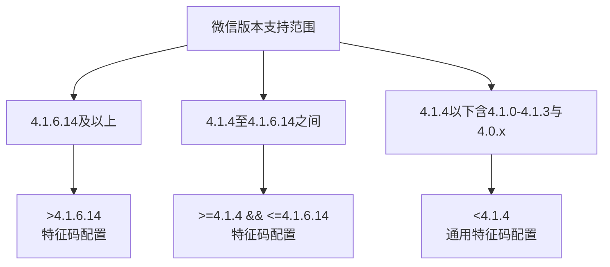
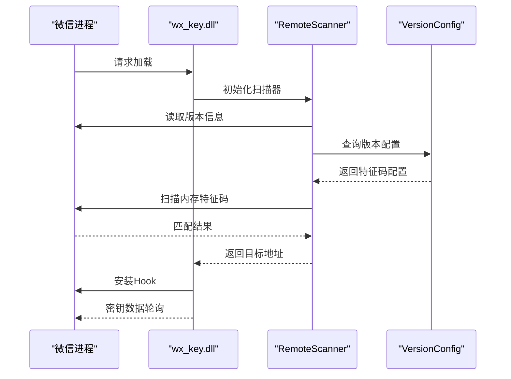
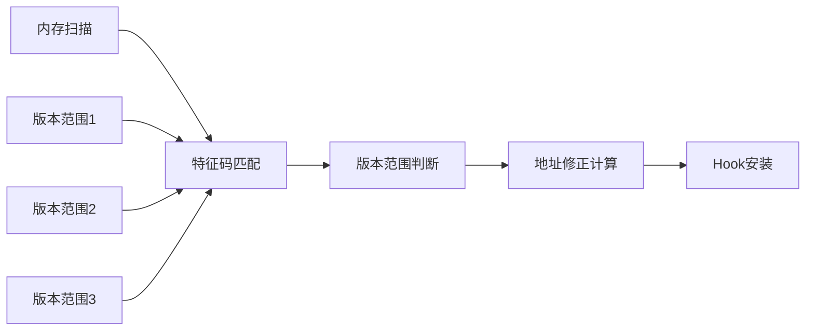
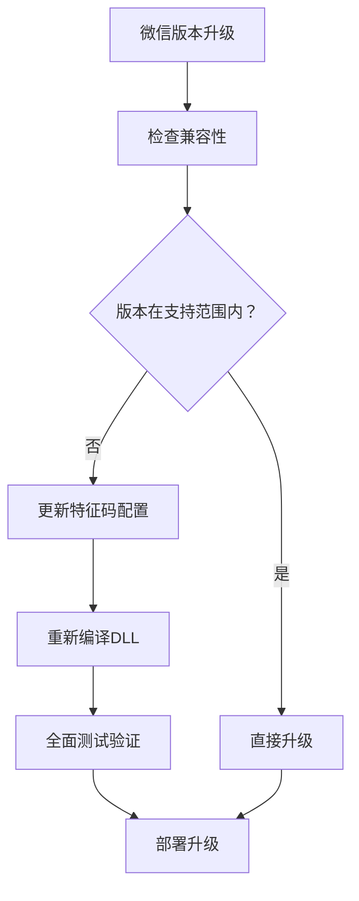
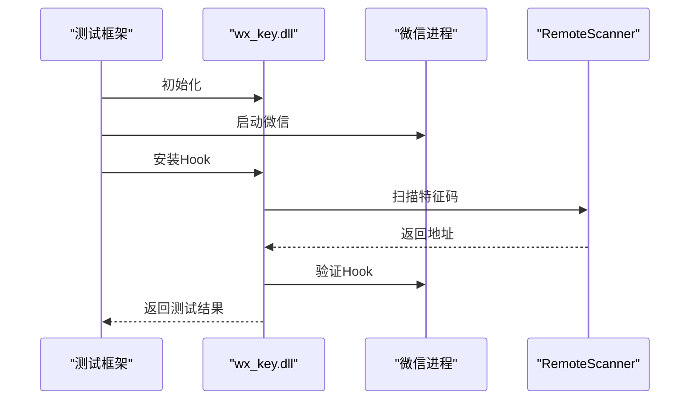
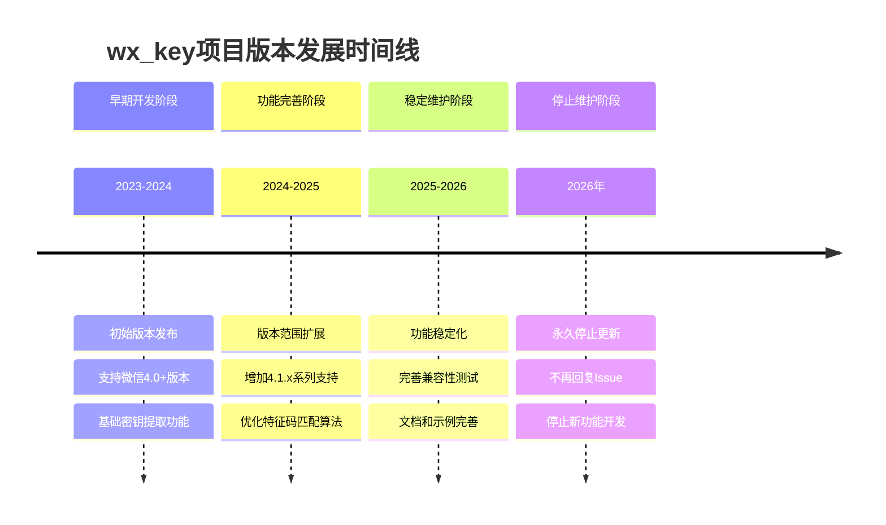
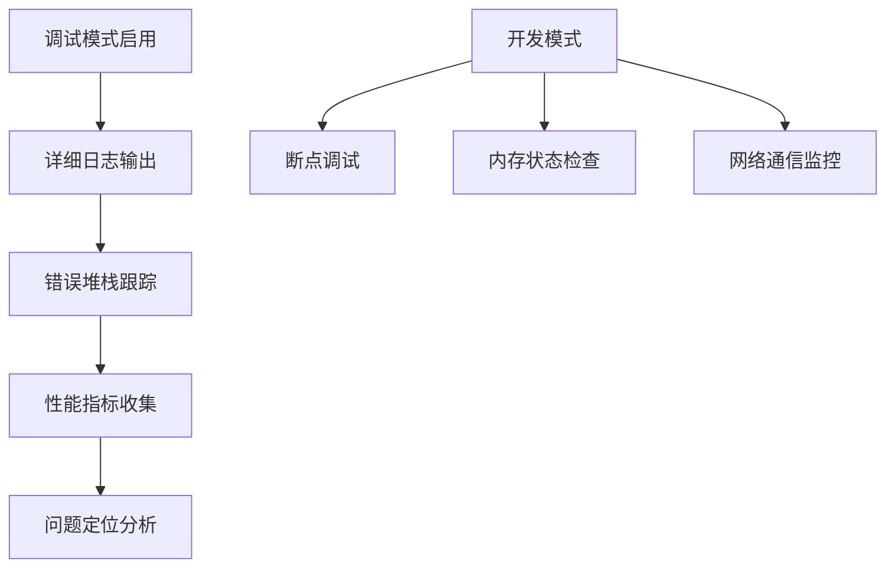

# 支持版本说明

<cite>
**本文档引用的文件**
- [README.md](file://README.md)
- [docs/dll_usage.md](file://docs/dll_usage.md)
- [wx_key/include/hook_controller.h](file://wx_key/include/hook_controller.h)
- [wx_key/include/remote_scanner.h](file://wx_key/include/remote_scanner.h)
- [wx_key/src/remote_scanner.cpp](file://wx_key/src/remote_scanner.cpp)
- [lib/services/dll_injector.dart](file://lib/services/dll_injector.dart)
- [lib/services/image_key_service.dart](file://lib/services/image_key_service.dart)
- [lib/services/key_storage.dart](file://lib/services/key_storage.dart)
- [bin/cli_extractor.dart](file://bin/cli_extractor.dart)
</cite>

## 目录
1. [简介](#简介)
2. [支持的微信版本范围](#支持的微信版本范围)
3. [已实际测试的版本列表](#已实际测试的版本列表)
4. [版本兼容性技术原理](#版本兼容性技术原理)
5. [版本升级建议](#版本升级建议)
6. [兼容性测试方法](#兼容性测试方法)
7. [版本变更历史](#版本变更历史)
8. [未来支持计划](#未来支持计划)
9. [故障排除指南](#故障排除指南)
10. [结论](#结论)

## 简介

wx_key是一个专门设计用于从微信4.0及以上版本中提取数据库密钥和缓存图片解密密钥的工具。该项目采用混合架构，结合了Flutter前端界面和C++原生DLL组件，通过远程内存扫描和特征码匹配技术实现对微信进程的非侵入式密钥提取。

## 支持的微信版本范围

根据项目文档和代码实现，wx_key明确支持以下微信版本范围：

### 明确支持范围
- **微信4.0及以上版本**：项目声明支持所有微信4.x版本
- **具体版本范围**：4.0.0.0至4.1.6.14（包含边界版本）

### 版本支持策略
项目采用了基于版本范围的特征码配置管理策略，通过三个主要配置段覆盖不同版本区间：

**图表来源**
- [wx_key/src/remote_scanner.cpp](file://wx_key/src/remote_scanner.cpp#L45-L74)

## 已实际测试的版本列表

项目文档中明确列出了已实际测试并通过兼容性的微信版本。这些版本代表了当前支持范围内的稳定工作版本：

### 已验证通过的版本清单
- **4.1.5.11**：最新测试版本之一
- **4.1.4.17**：4.1.4系列较新版本
- **4.1.4.15**：4.1.4系列稳定版本
- **4.1.2.18**：4.1.2系列版本
- **4.1.2.17**：4.1.2系列稳定版本
- **4.1.0.30**：4.1.0系列版本
- **4.0.5.17**：4.0系列稳定版本

### 测试验证标准
每个版本都经过了以下关键功能验证：
- 数据库密钥提取功能正常
- 缓存图片解密密钥获取功能正常
- 远程Hook安装和数据轮询功能正常
- DLL注入和内存扫描功能稳定

**章节来源**
- [README.md](file://README.md#L45-L56)

## 版本兼容性技术原理

### 特征码匹配机制

wx_key采用基于特征码的版本适配技术，这是实现多版本兼容的核心机制：

**图表来源**
- [docs/dll_usage.md](file://docs/dll_usage.md#L7-L18)
- [wx_key/include/remote_scanner.h](file://wx_key/include/remote_scanner.h#L46-L66)

### 版本配置管理

项目实现了智能的版本配置管理系统，通过预定义的特征码配置覆盖不同版本区间：

#### 版本配置结构
每个版本配置包含以下关键要素：
- **版本范围标识**：如">4.1.6.14"、">=4.1.4 && <=4.1.6.14"、"<4.1.4"
- **特征码模式**：针对特定版本的内存特征码序列
- **掩码字符串**：指示哪些字节需要精确匹配
- **偏移量**：目标函数地址的修正值

#### 特征码匹配算法

**图表来源**
- [wx_key/src/remote_scanner.cpp](file://wx_key/src/remote_scanner.cpp#L76-L86)

**章节来源**
- [wx_key/include/remote_scanner.h](file://wx_key/include/remote_scanner.h#L46-L66)
- [wx_key/src/remote_scanner.cpp](file://wx_key/src/remote_scanner.cpp#L45-L86)

## 版本升级建议

### 升级策略

基于项目的设计架构，建议采用渐进式升级策略：

#### 1. 版本兼容性评估
- **检查版本范围**：确认目标微信版本是否在支持范围内
- **特征码匹配验证**：通过版本配置管理器验证特征码匹配
- **功能回归测试**：对关键功能进行全面测试

#### 2. 升级步骤

#### 3. 风险控制
- **版本回滚准备**：保留旧版本DLL作为应急方案
- **功能降级策略**：在部分功能不可用时的替代方案
- **用户通知机制**：及时告知用户版本兼容性变化

## 兼容性测试方法

### 自动化测试流程

项目提供了完整的自动化测试框架，支持多种测试场景：

#### 1. 基础功能测试

**图表来源**
- [bin/cli_extractor.dart](file://bin/cli_extractor.dart#L149-L188)

#### 2. 性能测试指标
- **响应时间**：特征码扫描和Hook安装的耗时
- **内存占用**：DLL和Hook运行时的内存使用情况
- **稳定性**：长时间运行的稳定性表现

#### 3. 兼容性验证清单
- [ ] 数据库密钥提取功能
- [ ] 图片密钥获取功能  
- [ ] 远程Hook安装功能
- [ ] 内存扫描准确性
- [ ] 错误处理机制
- [ ] 资源清理完整性

**章节来源**
- [bin/cli_extractor.dart](file://bin/cli_extractor.dart#L149-L188)
- [lib/services/dll_injector.dart](file://lib/services/dll_injector.dart#L508-L602)

## 版本变更历史

### 项目版本演进

根据项目文档和代码实现，wx_key经历了以下主要版本发展阶段：

#### 当前版本状态
- **项目状态**：已停止更新，不再维护新功能
- **最后活跃版本**：2.1.8+1（项目版本号）
- **停止维护日期**：永久停止更新

#### 历史版本特性

### 版本支持策略变更

#### 早期支持策略
- **单一版本支持**：主要支持微信4.0版本
- **静态特征码**：固定特征码配置
- **手动版本检测**：依赖用户输入的版本信息

#### 后期支持策略
- **范围化支持**：引入版本范围概念
- **智能配置管理**：自动选择合适的特征码配置
- **增强兼容性**：支持更多4.x版本变体

**章节来源**
- [README.md](file://README.md#L25-L27)
- [pubspec.yaml](file://pubspec.yaml#L19-L19)

## 未来支持计划

### 支持策略说明

基于项目当前的状态，未来支持计划如下：

#### 短期计划
- **维护现有功能**：保持当前支持版本的稳定性
- **安全更新**：修复已知的安全漏洞
- **文档完善**：补充使用说明和故障排除指南

#### 中期规划
- **版本扩展**：考虑支持微信5.0+版本
- **性能优化**：提升特征码匹配效率
- **兼容性增强**：改善对新版本的适应能力

#### 长期展望
- **架构升级**：考虑采用更现代的Hook技术
- **平台扩展**：支持更多操作系统平台
- **功能增强**：扩展密钥提取功能范围

### 技术债务处理

#### 当前技术挑战
- **特征码脆弱性**：微信版本更新可能导致特征码失效
- **Hook技术限制**：传统Hook方法的局限性
- **维护成本**：持续版本适配的技术成本

#### 解决方案方向
- **机器学习特征识别**：减少对静态特征码的依赖
- **动态分析技术**：提高对版本变化的适应能力
- **模块化架构**：降低维护复杂度

## 故障排除指南

### 常见问题诊断

#### 1. 版本不兼容问题
**症状**：初始化Hook失败，返回错误信息
**解决方案**：
- 验证微信版本是否在支持范围内
- 检查DLL版本与微信版本的匹配性
- 更新特征码配置或使用兼容版本

#### 2. 权限不足问题
**症状**：DLL加载失败，权限相关错误
**解决方案**：
- 以管理员身份运行应用程序
- 检查Windows Defender和其他安全软件设置
- 确认用户账户控制(UAC)设置

#### 3. 内存扫描失败
**症状**：特征码匹配失败，无法定位目标函数
**解决方案**：
- 确认微信进程正常运行
- 检查内存访问权限设置
- 尝试重启微信后重试

### 调试工具使用

#### 1. 日志分析
项目提供了详细的日志记录机制：
- **DLL状态日志**：记录Hook安装和数据轮询过程
- **错误追踪日志**：记录具体的错误信息和堆栈跟踪
- **性能监控日志**：记录关键操作的执行时间和资源使用

#### 2. 调试模式

**图表来源**
- [docs/dll_usage.md](file://docs/dll_usage.md#L135-L165)

**章节来源**
- [docs/dll_usage.md](file://docs/dll_usage.md#L135-L165)
- [lib/services/image_key_service.dart](file://lib/services/image_key_service.dart#L670-L686)

## 结论

wx_key项目通过精心设计的特征码匹配机制和版本配置管理，成功实现了对微信4.x版本的广泛兼容支持。项目支持的版本范围从4.0.0.0到4.1.6.14，涵盖了大部分微信4.x版本变体。

### 技术优势总结

1. **智能版本适配**：通过版本范围配置实现自动化的特征码选择
2. **稳定的兼容性**：经过实际测试验证的版本支持列表
3. **完善的错误处理**：全面的错误诊断和恢复机制
4. **灵活的部署方式**：支持GUI界面和命令行两种使用模式

### 使用建议

对于用户而言，建议：
- 优先使用已验证的稳定版本（如4.1.5.11、4.1.4.17等）
- 在升级微信版本前，先确认版本兼容性
- 遇到问题时，充分利用项目提供的诊断工具和日志信息
- 注意项目已停止维护的状态，做好相应的风险评估

尽管项目已停止更新，但其设计理念和实现技术仍具有重要的参考价值，为类似的安全研究和开发工作提供了宝贵的实践经验。