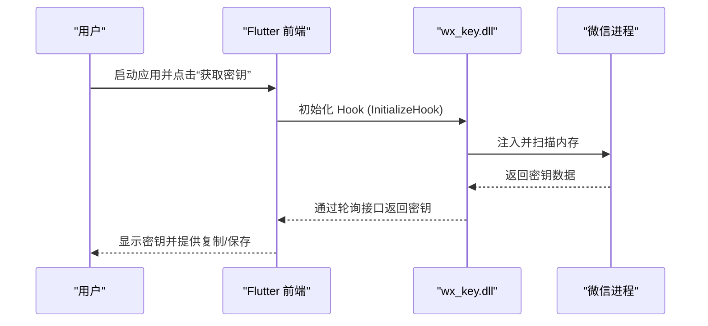
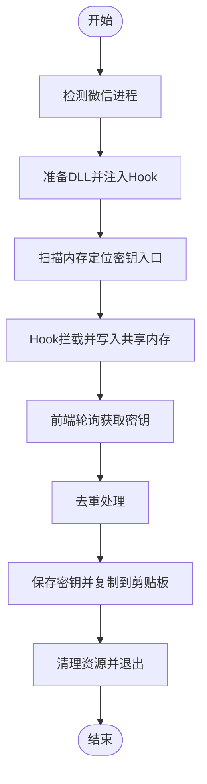
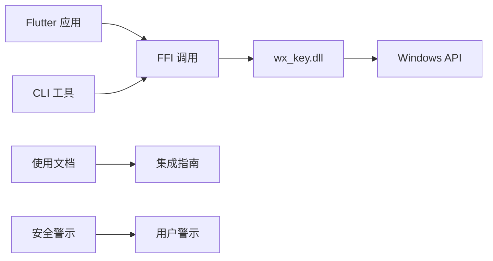

# 法律声明与免责声明

<cite>
**本文引用的文件**
- [LICENSE](file://LICENSE)
- [README.md](file://README.md)
- [SECURITY_ADVISORY.md](file://SECURITY_ADVISORY.md)
- [bin/README.md](file://bin/README.md)
- [docs/dll_usage.md](file://docs/dll_usage.md)
- [lib/main.dart](file://lib/main.dart)
- [pubspec.yaml](file://pubspec.yaml)
</cite>

## 目录
1. [引言](#引言)
2. [项目结构](#项目结构)
3. [核心组件](#核心组件)
4. [架构总览](#架构总览)
5. [详细组件分析](#详细组件分析)
6. [依赖关系分析](#依赖关系分析)
7. [性能考虑](#性能考虑)
8. [故障排除指南](#故障排除指南)
9. [结论](#结论)
10. [附录](#附录)

## 引言
本文件为 wx_key 项目提供法律声明与免责声明，明确项目的法律地位、使用限制、MIT 许可证条款、免责声明以及合规使用指南。请在使用本工具前仔细阅读并理解以下内容，确保您的使用行为符合法律法规与道德规范。

## 项目结构
本项目是一个跨平台的微信数据库与图片密钥提取工具，包含 Flutter 前端、原生 C++ DLL 组件以及 CLI 命令行版本。项目采用 MIT 许可证，面向技术研究与学习目的，严禁用于任何恶意或非法用途。

```mermaid
graph TB
subgraph "前端"
UI["Flutter 应用<br/>lib/main.dart"]
Services["服务层<br/>dll_injector.dart / remote_hook_controller.dart / image_key_service.dart"]
end
subgraph "原生组件"
DLL["wx_key.dll<br/>C++ 实现"]
Hook["Hook 控制器<br/>hook_controller.cpp"]
Scanner["内存扫描器<br/>remote_scanner.cpp"]
IPC["进程间通信<br/>ipc_manager.cpp"]
end
subgraph "CLI"
CLI["命令行工具<br/>bin/cli_extractor.dart"]
end
subgraph "文档"
Docs["使用文档<br/>docs/dll_usage.md"]
Security["安全警示<br/>SECURITY_ADVISORY.md"]
end
UI --> Services
Services --> DLL
DLL --> Hook
DLL --> Scanner
DLL --> IPC
CLI --> DLL
UI -.-> Docs
UI -.-> Security
```

**图表来源**
- [lib/main.dart](file://lib/main.dart#L1-L120)
- [docs/dll_usage.md](file://docs/dll_usage.md#L1-L60)
- [SECURITY_ADVISORY.md](file://SECURITY_ADVISORY.md#L1-L33)

**章节来源**
- [README.md](file://README.md#L77-L132)
- [pubspec.yaml](file://pubspec.yaml#L1-L112)

## 核心组件
- 前端应用：基于 Flutter 构建，提供图形界面与状态管理，负责与 DLL 交互、日志展示与密钥存储。
- 原生 DLL：封装微信逆向工程的核心逻辑，包括进程注入、内存扫描、Hook 技术与共享内存通信。
- CLI 工具：无需界面的命令行版本，支持参数化运行与自动化脚本集成。
- 文档与安全警示：提供 DLL 集成指南与商业欺诈防范声明。

**章节来源**
- [lib/main.dart](file://lib/main.dart#L1-L120)
- [docs/dll_usage.md](file://docs/dll_usage.md#L1-L60)
- [bin/README.md](file://bin/README.md#L1-L70)

## 架构总览
本项目采用“前端 GUI + 原生 DLL + 进程注入”的架构设计，通过 Flutter 与 C++ DLL 通过 FFI 进行通信，实现对微信进程的内存扫描与密钥提取。



**图表来源**
- [lib/main.dart](file://lib/main.dart#L709-L800)
- [docs/dll_usage.md](file://docs/dll_usage.md#L35-L58)

## 详细组件分析

### 许可证与法律地位
- 许可证类型：MIT License
- 版权归属：Copyright (c) 2024 wx_key
- 权利与义务：
  - 可自由使用、复制、修改、合并、发布、分发、再许可和销售软件及其文档。
  - 必须在软件副本中保留版权与许可声明。
  - 软件按“现状”提供，不提供任何明示或暗示的担保。
  - 在任何情况下，作者或版权持有人不对任何索赔、损害或其他责任负责。

**章节来源**
- [LICENSE](file://LICENSE#L1-L22)
- [README.md](file://README.md#L136-L142)

### 免责声明
- 本工具仅供技术研究与学习使用，严禁用于任何恶意或非法目的。
- 使用本工具产生的一切后果与责任，均由使用者自行承担。
- 开发者不对因使用本工具而导致的任何损失负责。
- 使用者必须确保其行为符合当地法律法规。
- 严禁将本工具用于任何商业或恶意用途。

**章节来源**
- [README.md](file://README.md#L18-L25)
- [README.md](file://README.md#L143-L151)
- [bin/README.md](file://bin/README.md#L122-L125)

### 安全警示与商业欺诈防范
- 官方声明：项目坚持永久开源，官方版本绝不收取任何费用。
- 侵权警示：近期发现不法分子盗用本项目代码，通过“换壳”及增加付费模块的方式进行商业欺诈。
- 官方渠道：请通过官方 GitHub 仓库下载，切勿向侵权者支付任何费用。
- 安全风险：盗版软件可能包含恶意后门或隐私收集脚本，存在安全风险。

**章节来源**
- [SECURITY_ADVISORY.md](file://SECURITY_ADVISORY.md#L1-L33)

### 合规使用指南
- 使用范围：仅限于技术研究与学习目的。
- 行为准则：严格遵守当地法律法规，不得用于任何非法或恶意用途。
- 资源清理：程序退出前必须调用清理接口，避免残留 Hook 导致微信崩溃。
- 版本兼容：关注微信版本更新，必要时更新 DLL 特征码库以维持功能。

**章节来源**
- [docs/dll_usage.md](file://docs/dll_usage.md#L56-L58)
- [README.md](file://README.md#L147-L150)

### 数据流与处理逻辑
- 进程注入：前端检测微信进程，准备 DLL 并启动微信，随后注入 Hook。
- 内存扫描：DLL 扫描微信内存，定位密钥获取函数入口。
- Hook 拦截：写入 Shellcode 拦截密钥，写入共享内存并递增序列号。
- 轮询获取：前端定时轮询共享内存，获取密钥并进行去重处理。
- 日志与状态：DLL 提供状态消息与错误诊断接口，前端进行日志展示与 UI 更新。



**图表来源**
- [lib/main.dart](file://lib/main.dart#L709-L800)
- [docs/dll_usage.md](file://docs/dll_usage.md#L35-L58)

**章节来源**
- [lib/main.dart](file://lib/main.dart#L485-L534)
- [docs/dll_usage.md](file://docs/dll_usage.md#L1-L60)

## 依赖关系分析
- Flutter 依赖：FFI、win32、path、shared_preferences、file_picker、http、url_launcher、window_manager、pointycastle 等。
- 原生 DLL：依赖 C/C++ 运行时与 Windows API，需管理员权限运行。
- CLI 工具：依赖 Dart FFI 与操作系统进程管理能力。



**图表来源**
- [pubspec.yaml](file://pubspec.yaml#L30-L61)
- [docs/dll_usage.md](file://docs/dll_usage.md#L1-L30)

**章节来源**
- [pubspec.yaml](file://pubspec.yaml#L30-L61)

## 性能考虑
- 轮询间隔：建议设置合理的轮询间隔（如 100ms），避免过度占用 CPU。
- 资源管理：及时清理 Hook 与共享内存，防止内存泄漏与微信崩溃。
- 权限与兼容性：确保以管理员身份运行，关注微信版本更新带来的特征码变化。

[本节为通用指导，不涉及具体文件分析]

## 故障排除指南
- DLL 加载失败：检查 DLL 文件是否存在且路径正确，尝试以管理员身份运行。
- 找不到微信进程：确认微信已启动，手动指定进程 PID，或使用系统工具查找 Weixin.exe。
- 提取失败：检查微信版本是否支持，确认具备管理员权限，查看详细输出了解具体错误。

**章节来源**
- [bin/README.md](file://bin/README.md#L92-L108)

## 结论
wx_key 项目在 MIT 许可证下提供技术研究与学习工具，开发者明确声明仅用于合法目的。请严格遵守免责声明与合规使用指南，避免将工具用于任何非法或恶意用途。同时，关注官方安全警示，通过官方渠道获取软件，防范商业欺诈与安全风险。

[本节为总结性内容，不涉及具体文件分析]

## 附录
- MIT 许可证全文可在 [LICENSE](file://LICENSE) 中查阅。
- 安全警示与侵权声明可在 [SECURITY_ADVISORY.md](file://SECURITY_ADVISORY.md) 中查阅。
- DLL 集成与使用指南可在 [docs/dll_usage.md](file://docs/dll_usage.md) 中查阅。
- 前端应用与服务层实现可在 [lib/main.dart](file://lib/main.dart) 中查阅。
- 项目依赖与配置可在 [pubspec.yaml](file://pubspec.yaml) 中查阅。