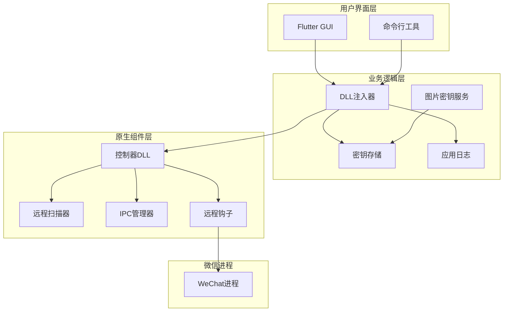
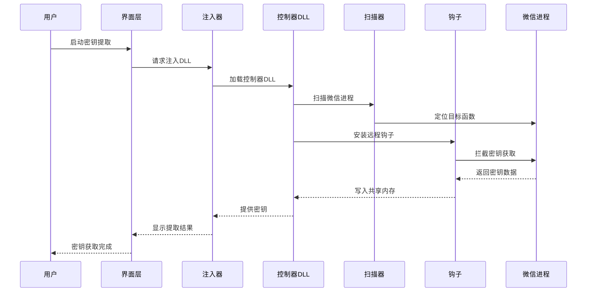
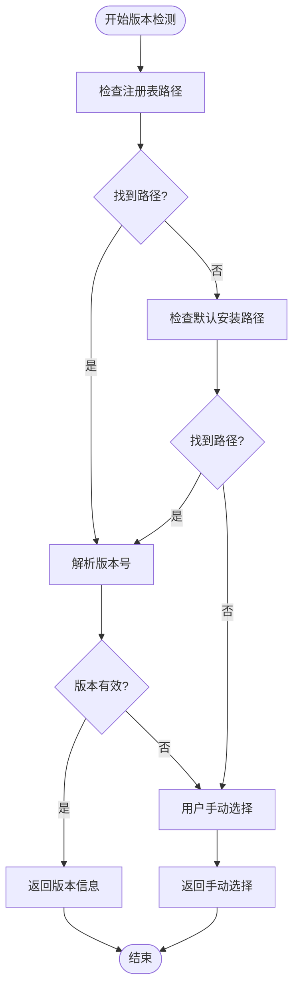
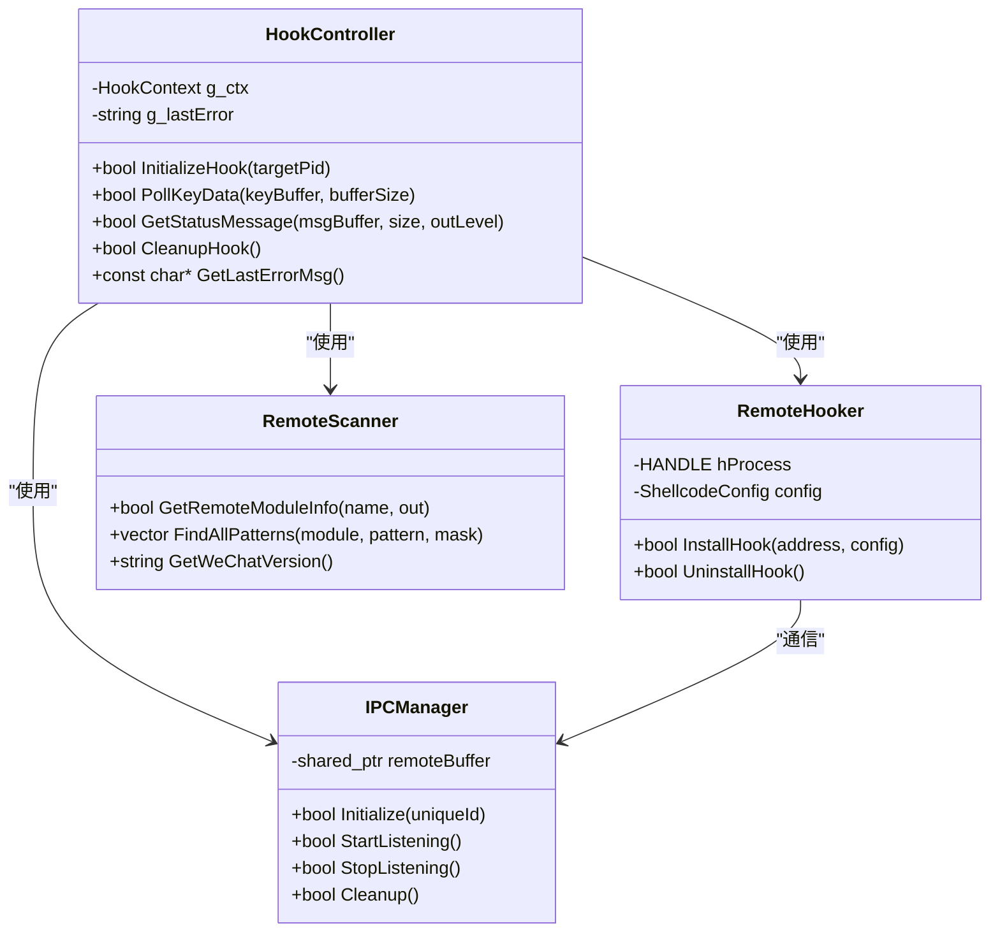
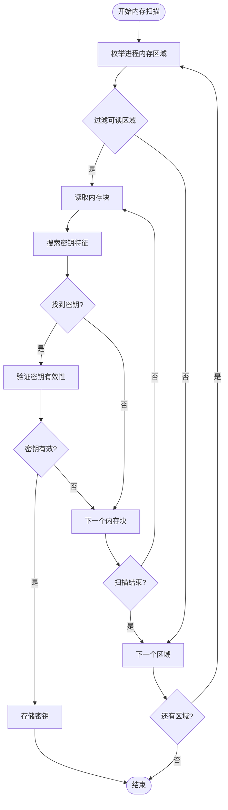
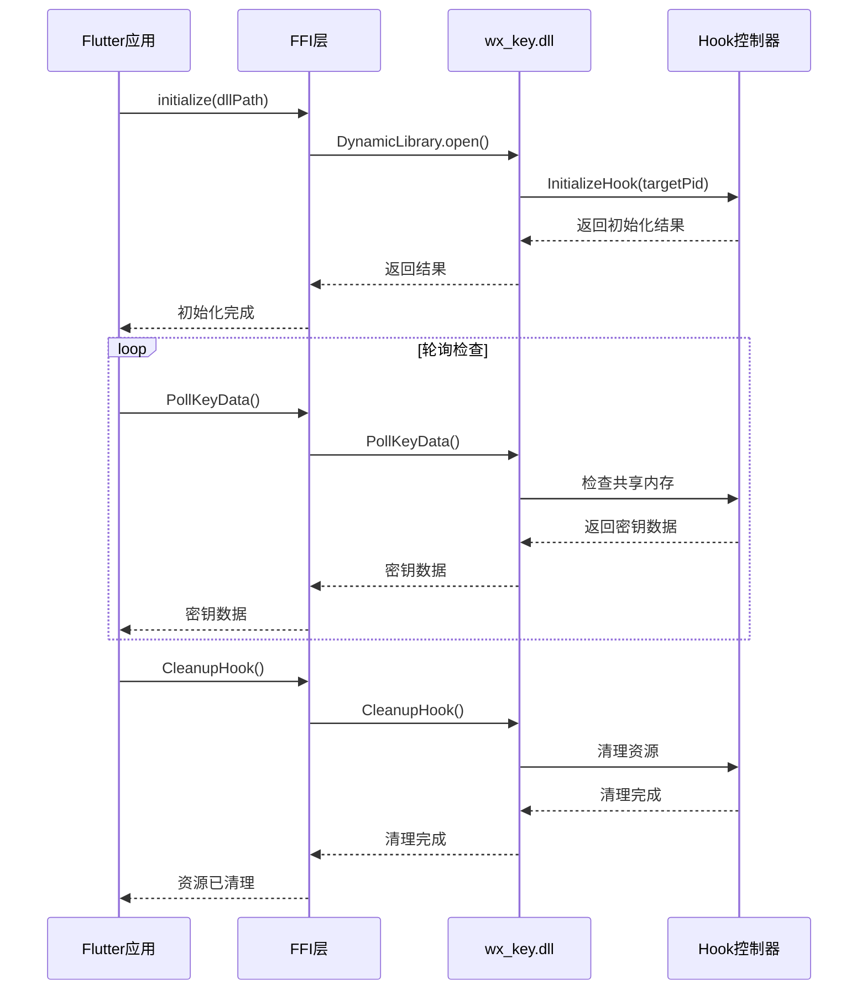
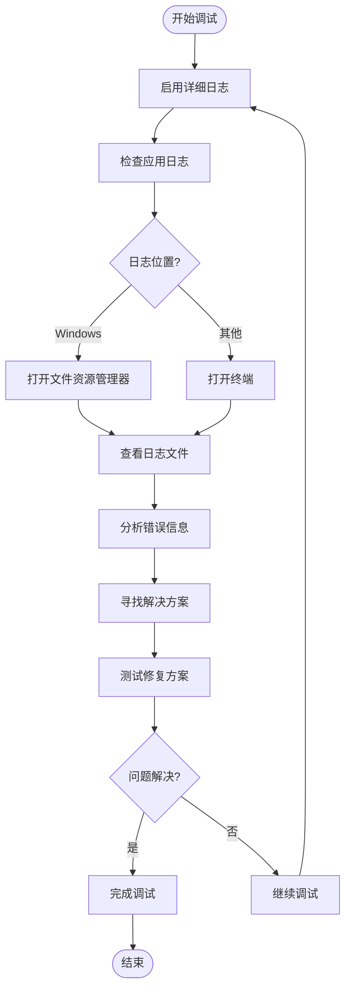

# 项目概述

<cite>
**本文档引用的文件**
- [README.md](file://README.md)
- [LICENSE](file://LICENSE)
- [SECURITY_ADVISORY.md](file://SECURITY_ADVISORY.md)
- [pubspec.yaml](file://pubspec.yaml)
- [lib/main.dart](file://lib/main.dart)
- [lib/services/remote_hook_controller.dart](file://lib/services/remote_hook_controller.dart)
- [lib/services/dll_injector.dart](file://lib/services/dll_injector.dart)
- [lib/services/image_key_service.dart](file://lib/services/image_key_service.dart)
- [lib/services/key_storage.dart](file://lib/services/key_storage.dart)
- [lib/services/app_logger.dart](file://lib/services/app_logger.dart)
- [bin/cli_extractor.dart](file://bin/cli_extractor.dart)
- [docs/dll_usage.md](file://docs/dll_usage.md)
- [wx_key/include/hook_controller.h](file://wx_key/include/hook_controller.h)
- [wx_key/src/hook_controller.cpp](file://wx_key/src/hook_controller.cpp)
- [wx_key/dllmain.cpp](file://wx_key/dllmain.cpp)
</cite>

## 目录
1. [项目简介](#项目简介)
2. [核心目标与定位](#核心目标与定位)
3. [主要功能特性](#主要功能特性)
4. [技术架构概览](#技术架构概览)
5. [支持的微信版本](#支持的微信版本)
6. [快速开始指南](#快速开始指南)
7. [技术实现细节](#技术实现细节)
8. [法律声明与免责声明](#法律声明与免责声明)
9. [项目价值与应用场景](#项目价值与应用场景)
10. [故障排除指南](#故障排除指南)
11. [总结](#总结)

## 项目简介

wx_key是一个专为微信4.0及以上版本设计的数据库密钥提取工具。该项目的核心目标是在不破坏微信正常功能的前提下，获取微信数据库的解密密钥以及缓存图片的解密密钥，为数据恢复、备份和分析提供技术支持。

该项目采用混合架构设计，结合了Flutter前端界面、C++原生DLL组件和远程内存扫描技术，实现了对微信进程的安全访问和密钥提取功能。

## 核心目标与定位

### 技术研究导向
- **纯技术研究工具**：项目明确标注仅供技术研究和学习使用
- **教育目的**：致力于帮助开发者理解微信客户端的工作原理
- **开源共享**：坚持永久开源原则，拒绝任何形式的商业化收费

### 功能定位
- **数据库密钥提取**：获取微信数据库的32字节解密密钥
- **图片密钥获取**：提取微信缓存图片的XOR和AES解密密钥
- **多版本支持**：兼容微信4.x系列的所有版本

## 主要功能特性

### 核心功能
1. **自动化密钥提取**
   - 支持微信数据库密钥的自动获取
   - 图片缓存密钥的智能识别和提取
   - 多种提取模式的灵活切换

2. **智能进程管理**
   - 自动检测微信进程状态
   - 智能启动和关闭微信进程
   - 进程间通信和状态同步

3. **安全存储机制**
   - 密钥信息的本地安全存储
   - 时间戳追踪和版本管理
   - 自动清理和过期处理

### 用户体验特性
1. **图形化界面**
   - 直观的操作界面设计
   - 实时状态显示和进度反馈
   - 错误信息的友好提示

2. **多平台支持**
   - Windows平台原生支持
   - 跨平台架构设计
   - 命令行工具支持

## 技术架构概览

### 整体架构设计



**架构图来源**
- [lib/main.dart](file://lib/main.dart#L1-L800)
- [lib/services/remote_hook_controller.dart](file://lib/services/remote_hook_controller.dart#L34-L87)
- [wx_key/src/hook_controller.cpp](file://wx_key/src/hook_controller.cpp#L23-L66)

### 组件交互流程



**序列图来源**
- [lib/services/dll_injector.dart](file://lib/services/dll_injector.dart#L508-L602)
- [lib/services/remote_hook_controller.dart](file://lib/services/remote_hook_controller.dart#L89-L128)
- [wx_key/src/hook_controller.cpp](file://wx_key/src/hook_controller.cpp#L414-L426)

## 支持的微信版本

### 版本兼容性
- **支持范围**：微信4.0.x及以上版本
- **已验证版本**：
  - 4.1.5.11
  - 4.1.4.17
  - 4.1.4.15
  - 4.1.2.18
  - 4.1.2.17
  - 4.1.0.30
  - 4.0.5.17

### 版本检测机制



**流程图来源**
- [lib/services/dll_injector.dart](file://lib/services/dll_injector.dart#L457-L479)

## 快速开始指南

### 环境要求
- **操作系统**：Windows系统
- **权限要求**：管理员权限
- **微信版本**：4.0及以上版本

### 安装步骤

1. **下载发布版本**
   - 访问GitHub Releases页面
   - 下载最新的`app.zip`压缩包
   - 解压到任意目录

2. **首次运行**
   - 运行`wx_key.exe`
   - 系统会自动检测微信安装路径
   - 如未检测到，可手动选择微信目录

3. **获取数据库密钥**
   - 确保微信已登录
   - 点击"获取数据库密钥"按钮
   - 等待密钥提取完成
   - 密钥会自动保存到本地

### 命令行使用

```bash
# 基本使用
dart cli_extractor.dart

# 指定进程ID
dart cli_extractor.dart --pid 1234

# 设置轮询间隔
dart cli_extractor.dart --interval 200

# 设置超时时间
dart cli_extractor.dart --timeout 600

# 指定DLL路径
dart cli_extractor.dart --dll ./custom/wx_key.dll
```

**快速开始指南来源**
- [README.md](file://README.md#L59-L76)
- [bin/cli_extractor.dart](file://bin/cli_extractor.dart#L430-L471)

## 技术实现细节

### DLL架构设计



**类图来源**
- [wx_key/include/hook_controller.h](file://wx_key/include/hook_controller.h#L12-L46)
- [wx_key/src/hook_controller.cpp](file://wx_key/src/hook_controller.cpp#L32-L66)

### 远程内存扫描算法



**算法流程图来源**
- [lib/services/image_key_service.dart](file://lib/services/image_key_service.dart#L308-L467)

### FFI接口设计



**接口序列图来源**
- [lib/services/remote_hook_controller.dart](file://lib/services/remote_hook_controller.dart#L47-L87)
- [lib/services/remote_hook_controller.dart](file://lib/services/remote_hook_controller.dart#L130-L144)

## 法律声明与免责声明

### 许可证信息
项目采用MIT许可证，允许自由使用、修改和分发，但需保留原始版权声明和许可证文本。

### 重要声明
- **仅限技术研究**：本工具仅供技术研究和学习目的
- **用户责任**：使用者需自行承担使用本工具产生的所有后果
- **法律合规**：使用者必须确保其行为符合当地法律法规
- **禁止商业用途**：严禁将本工具用于任何商业或恶意用途

### 安全警示
项目发布方明确声明：
- 永远停止更新，不再回复任何issue
- 严禁用于任何非法目的
- 使用者需自行承担全部责任

**法律声明来源**
- [LICENSE](file://LICENSE#L1-L22)
- [README.md](file://README.md#L19-L25)
- [README.md](file://README.md#L143-L151)

## 项目价值与应用场景

### 技术价值
1. **逆向工程技术展示**
   - 展示了现代反汇编和调试技术的应用
   - 提供了进程间通信和内存操作的实践案例
   - 体现了跨语言编程和FFI接口设计

2. **安全研究贡献**
   - 为网络安全研究提供了有价值的参考
   - 展示了移动应用安全防护的重要性
   - 促进了安全意识的提升

### 应用场景
1. **数据恢复**
   - 微信聊天记录的备份和恢复
   - 数据迁移和升级支持
   - 灾难恢复场景的数据保护

2. **安全审计**
   - 企业微信使用情况的合规检查
   - 安全漏洞的评估和修复
   - 数据泄露风险的预防

3. **学术研究**
   - 计算机科学教育的实践案例
   - 系统编程和逆向工程的教学材料
   - 安全研究的理论基础

## 故障排除指南

### 常见问题及解决方案

#### 权限问题
**问题**：运行时提示权限不足
**解决方案**：
1. 以管理员身份运行应用程序
2. 检查Windows Defender和杀毒软件设置
3. 关闭安全软件后重试

#### 微信版本不兼容
**问题**：无法获取密钥或版本检测失败
**解决方案**：
1. 确认微信版本在支持范围内
2. 手动选择正确的微信安装目录
3. 更新到最新版本的wx_key工具

#### DLL加载失败
**问题**：DLL文件无法加载或找不到
**解决方案**：
1. 确保DLL文件完整且未被病毒软件删除
2. 检查文件路径中是否包含中文字符
3. 重新下载并解压工具包

#### 内存扫描超时
**问题**：图片密钥提取过程中超时
**解决方案**：
1. 按照推荐流程操作微信应用
2. 确保微信进程处于活跃状态
3. 适当增加等待时间

### 调试和日志



**调试流程图来源**
- [lib/services/app_logger.dart](file://lib/services/app_logger.dart#L30-L52)
- [lib/services/app_logger.dart](file://lib/services/app_logger.dart#L133-L144)

## 总结

wx_key项目是一个技术含量较高的微信逆向工程工具，展现了现代软件开发中多种技术的综合应用。项目虽然已停止维护，但其技术实现仍然具有重要的学习价值和研究意义。

### 项目特色
1. **技术创新**：采用了先进的远程内存扫描和进程间通信技术
2. **架构合理**：分层设计清晰，职责分离明确
3. **用户体验**：提供了友好的图形界面和命令行工具
4. **文档完善**：包含了详细的使用说明和技术文档

### 技术成就
- 成功实现了对微信4.x版本的密钥提取
- 展示了跨语言编程和系统级编程的技术能力
- 提供了完整的逆向工程实践案例

### 使用建议
由于项目已停止更新，建议用户：
1. 仅用于个人学习和研究目的
2. 遵守相关法律法规和软件许可协议
3. 注意使用过程中的安全风险
4. 如需生产环境使用，建议寻求专业的技术支持

该项目为理解现代即时通讯软件的工作原理提供了宝贵的参考，对于计算机科学和网络安全领域的学习者具有重要的指导意义。