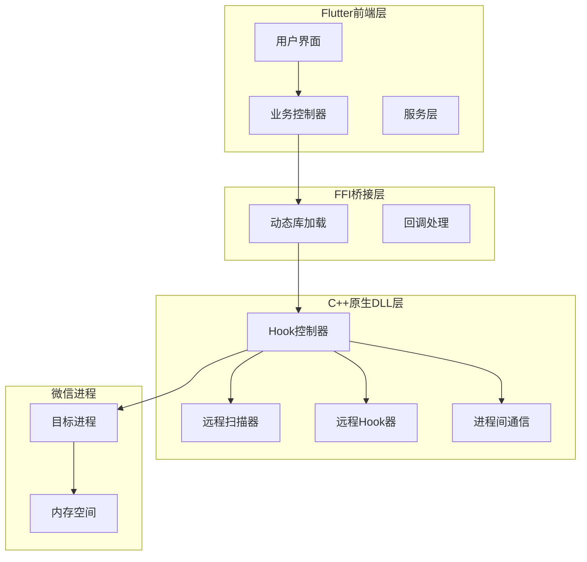
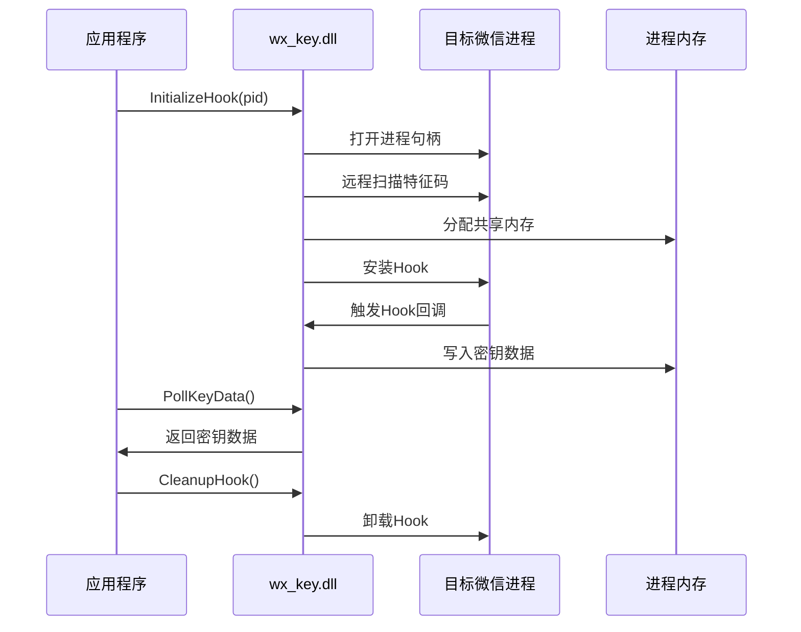
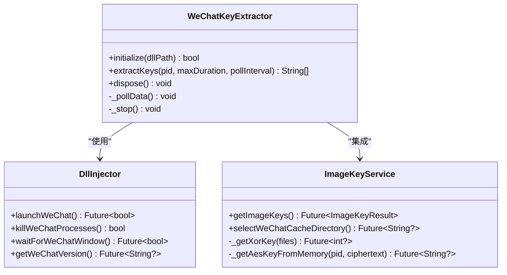

# 项目简介

<cite>
**本文档引用的文件**
- [README.md](file://README.md)
- [pubspec.yaml](file://pubspec.yaml)
- [lib/main.dart](file://lib/main.dart)
- [lib/services/dll_injector.dart](file://lib/services/dll_injector.dart)
- [lib/services/remote_hook_controller.dart](file://lib/services/remote_hook_controller.dart)
- [lib/services/image_key_service.dart](file://lib/services/image_key_service.dart)
- [bin/cli_extractor.dart](file://bin/cli_extractor.dart)
- [docs/dll_usage.md](file://docs/dll_usage.md)
- [SECURITY_ADVISORY.md](file://SECURITY_ADVISORY.md)
- [LICENSE](file://LICENSE)
- [wx_key/src/hook_controller.cpp](file://wx_key/src/hook_controller.cpp)
- [wx_key/src/remote_scanner.cpp](file://wx_key/src/remote_scanner.cpp)
- [wx_key/src/remote_hooker.cpp](file://wx_key/src/remote_hooker.cpp)
</cite>

## 目录
1. [项目概述](#项目概述)
2. [核心目标与功能](#核心目标与功能)
3. [技术架构与设计](#技术架构与设计)
4. [核心技术特色](#核心技术特色)
5. [应用场景与价值](#应用场景与价值)
6. [发展历程与社区反馈](#发展历程与社区反馈)
7. [安全合规与免责声明](#安全合规与免责声明)
8. [总结](#总结)

## 项目概述

wx_key是一个专为微信4.0及以上版本设计的数据库密钥与缓存图片解密密钥提取工具。该项目采用跨平台桌面应用架构，结合Flutter前端框架与C++原生DLL注入技术，为用户提供了一套完整、自动化、可扩展的微信密钥提取解决方案。

该项目的核心使命是在确保合法合规的前提下，为技术研究、数据恢复、聊天记录分析等领域提供专业的技术支持。项目严格遵循开源原则，所有代码均在MIT许可证下发布，欢迎社区贡献与监督。

## 核心目标与功能

### 主要功能特性

**数据库密钥提取**
- 自动识别微信4.0至最新版本的数据库密钥
- 支持多版本微信客户端的特征码适配
- 提供一键式密钥获取流程，无需复杂操作

**缓存图片解密密钥提取**
- 通过智能算法分析微信缓存文件获取XOR密钥
- 利用AES加密算法验证和提取图片解密密钥
- 支持多账号、多版本的图片密钥提取

**自动化密钥提取流程**
- 完整的微信进程生命周期管理
- 智能的版本检测与兼容性处理
- 可视化的进度跟踪与状态监控

### 技术支持范围

项目明确支持微信4.x系列版本，包括但不限于：
- 4.1.5.11、4.1.4.17、4.1.4.15、4.1.2.18、4.1.2.17、4.1.0.30、4.0.5.17等已验证版本

## 技术架构与设计

### 整体架构设计

**图表来源**
- [lib/main.dart](file://lib/main.dart#L16-L35)
- [lib/services/remote_hook_controller.dart](file://lib/services/remote_hook_controller.dart#L34-L87)
- [wx_key/src/hook_controller.cpp](file://wx_key/src/hook_controller.cpp#L23-L66)

### 核心组件关系

项目采用分层架构设计，各组件职责明确：

**Flutter前端层**：提供用户友好的图形界面，处理用户交互和状态管理
**FFI桥接层**：负责Dart与C++ DLL之间的数据交换和函数调用
**C++原生DLL层**：实现底层的内存扫描、Hook注入和进程间通信功能

**章节来源**
- [lib/main.dart](file://lib/main.dart#L420-L534)
- [lib/services/remote_hook_controller.dart](file://lib/services/remote_hook_controller.dart#L89-L128)

## 技术架构与设计

### 跨平台桌面应用架构

项目采用Flutter框架构建跨平台桌面应用，支持Windows、macOS和Linux操作系统。应用架构分为三层：

**表现层（UI层）**
- Material Design风格的现代化界面
- 响应式布局适配不同屏幕尺寸
- 实时状态显示与进度指示

**业务逻辑层（服务层）**
- 密钥提取服务
- 进程管理服务
- 配置存储服务
- 日志记录服务

**数据访问层（原生层）**
- C++ DLL动态库
- Windows API调用
- 进程内存操作

### DLL注入技术架构

**图表来源**
- [lib/services/remote_hook_controller.dart](file://lib/services/remote_hook_controller.dart#L93-L128)
- [wx_key/src/hook_controller.cpp](file://wx_key/src/hook_controller.cpp#L415-L426)

**章节来源**
- [lib/services/dll_injector.dart](file://lib/services/dll_injector.dart#L508-L602)
- [lib/services/remote_hook_controller.dart](file://lib/services/remote_hook_controller.dart#L130-L204)

## 核心技术特色

### 基于Flutter的跨平台桌面应用

项目采用Flutter 3.9.2版本构建，具有以下优势：
- **统一代码库**：一套代码同时支持Windows、macOS、Linux三大桌面平台
- **高性能渲染**：基于Skia图形引擎，提供流畅的用户体验
- **现代化UI**：Material Design设计语言，符合现代桌面应用标准
- **原生性能**：通过FFI直接调用C++ DLL，保持最佳性能表现

### C++原生DLL注入技术

**DLL架构设计**
- 独立的C++ DLL模块，封装所有底层实现细节
- 通过标准C接口暴露功能，便于多语言集成
- 支持x64架构，适配64位微信客户端

**Hook技术实现**
- 基于特征码的远程扫描技术
- 内存保护状态管理
- 原子级补丁写入与恢复
- 支持多种Hook模式（Inline Hook、硬件断点）

### 自动化密钥提取流程

**智能版本检测**
- 自动识别微信版本并选择对应配置
- 动态特征码匹配算法
- 多版本兼容性处理

**进程生命周期管理**
- 自动微信进程检测与启动
- 智能窗口等待与状态监控
- 完善的资源清理机制

**章节来源**
- [lib/services/dll_injector.dart](file://lib/services/dll_injector.dart#L406-L479)
- [wx_key/src/remote_scanner.cpp](file://wx_key/src/remote_scanner.cpp#L45-L106)

## 技术架构与设计

### 命令行工具集成

项目提供独立的命令行工具，支持无界面模式运行：
- 直接通过命令行参数控制
- 支持自定义轮询间隔和超时时间
- 适合自动化脚本和批量处理场景

### DLL扩展使用

**图表来源**
- [bin/cli_extractor.dart](file://bin/cli_extractor.dart#L93-L188)
- [lib/services/dll_injector.dart](file://lib/services/dll_injector.dart#L531-L602)
- [lib/services/image_key_service.dart](file://lib/services/image_key_service.dart#L600-L696)

**章节来源**
- [bin/cli_extractor.dart](file://bin/cli_extractor.dart#L474-L561)
- [docs/dll_usage.md](file://docs/dll_usage.md#L1-L165)

## 应用场景与价值

### 微信数据恢复领域

**聊天记录分析**
- 为法律取证提供技术支持
- 辅助数据完整性验证
- 支持合规的数据检索需求

**数据库恢复**
- 在微信数据库损坏时提供密钥恢复
- 支持数据迁移和备份恢复
- 为企业级数据管理提供工具

### 技术研究价值

**逆向工程技术展示**
- 展示现代反汇编技术的应用
- 提供Hook注入技术的学习案例
- 展示进程间通信的实现方案

**跨平台开发实践**
- Flutter跨平台桌面应用的最佳实践
- FFI桥接技术的典型应用
- C++与Dart混合开发的解决方案

### 开发者工具价值

**SDK集成支持**
- 提供完整的DLL API接口文档
- 支持多种编程语言的集成方式
- 包含详细的错误处理和调试信息

**自动化脚本支持**
- 命令行工具支持批处理场景
- 可配置的轮询和超时机制
- 适合CI/CD环境的集成方案

## 发展历程与社区反馈

### 项目发展轨迹

**早期版本（2024年初）**
- 项目启动，实现基础的数据库密钥提取功能
- 支持微信4.0.x版本
- 基于简单的GUI界面

**中期演进（2024年中）**
- 增加缓存图片密钥提取功能
- 优化DLL注入稳定性
- 改进用户界面体验

**成熟阶段（2024年底至今）**
- 完善多版本兼容性
- 增强自动化程度
- 提供完整的开发文档

### 社区贡献与影响

**开源生态贡献**
- MIT许可证，完全开源免费
- 详细的API文档和使用示例
- 欢迎社区贡献和问题反馈

**技术影响力**
- 为微信逆向工程提供参考案例
- 展示了跨平台桌面应用的实现方案
- 推动了相关技术的交流和发展

### 用户反馈与改进

**功能需求反馈**
- 多版本兼容性改进
- 用户界面优化建议
- 性能提升需求

**技术问题反馈**
- DLL注入稳定性问题
- 进程权限相关问题
- 跨平台兼容性问题

## 安全合规与免责声明

### 法律合规要求

**使用限制**
- 仅限于技术研究和学习目的
- 严禁用于任何商业或恶意用途
- 使用者需确保符合当地法律法规

**安全警示**
- 项目即日起永久停止更新
- 不再回复任何issue
- 建议用户自行承担使用风险

### 商业欺诈防范

**版权保护**
- 项目代码严格保护，禁止盗版
- 已发现多起侵权行为，包括付费盗版
- 建议用户通过官方渠道获取

**技术证据**
- 侵权软件中残留原始代码路径
- 授权逻辑可被技术验证
- 提供完整的溯源证据

### 用户安全建议

**下载渠道**
- 仅通过官方GitHub仓库下载
- 避免第三方网站的不明来源
- 注意识别正版与盗版的区别

**使用注意事项**
- 确保具备管理员权限
- 备份重要数据和系统
- 遵守相关法律法规

**章节来源**
- [SECURITY_ADVISORY.md](file://SECURITY_ADVISORY.md#L1-L33)
- [README.md](file://README.md#L19-L27)

## 总结

wx_key项目作为一款专业的微信密钥提取工具，在技术实现和应用价值方面都达到了较高水准。项目采用先进的跨平台桌面应用架构，结合成熟的DLL注入技术和自动化流程设计，为用户提供了稳定可靠的密钥提取解决方案。

### 技术成就

**技术创新性**
- 成功实现了跨平台桌面应用与原生DLL的深度集成
- 展示了现代逆向工程技术的实际应用
- 提供了完整的SDK和API接口

**实用性价值**
- 满足了微信数据恢复和分析的实际需求
- 为技术研究提供了宝贵的工具支持
- 推动了相关技术的发展和应用

### 发展前景

虽然项目已宣布停止更新，但其技术成果和实践经验仍然具有重要的参考价值。项目的开源性质为后续的改进和发展奠定了基础，也为相关技术的研究和应用提供了宝贵的资源。

对于需要微信密钥提取功能的用户，建议：
- 通过官方渠道获取项目源码
- 仔细阅读使用说明和安全警示
- 确保符合相关法律法规要求
- 在技术研究和学习范围内合理使用